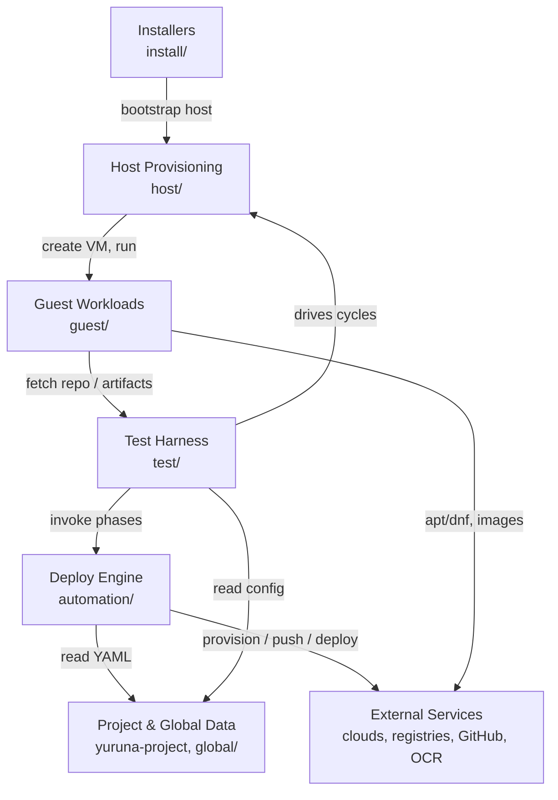

# Level-1 components

> One sentence: the seven top-level building blocks of Yuruna and how they
> connect. Drill into any block in [02-component-breakdown.md](02-component-breakdown.md).

See [Design overview](00-index.md) · [Yuruna Architecture](../architecture.md).

Derived from the repository layout: `automation/`, `host/`, `guest/`,
`install/`, `test/`, `global/` (yuruna) and the `yuruna-project` data repo.
`tools/` (release-pin updater + git hooks) is folded into **Deploy Engine**.

| Component | Root | Responsibility |
|---|---|---|
| Installers | `install/` | One-shot per-host bootstrap (`irm\|iex`, `curl\|bash`). |
| Host Provisioning | `host/` | Create/start/stop VMs on Hyper-V, KVM, UTM. |
| Guest Workloads | `guest/` | Scripts that run **inside** a booted guest. |
| Test Harness | `test/` | Continuous VM create + validate loop, status, pool. |
| Deploy Engine | `automation/` | Three-phase Resources→Components→Workloads + validation. |
| Project & Global Data | `yuruna-project/`, `global/` | Per-project YAML, charts, OpenTofu templates, vault. |
| External Services | — | Clouds, container registries, k8s, GitHub, OCR, mirrors. |

---

Copyright (c) 2019-2026 by Alisson Sol et al.

Last review: 2026.07.03
