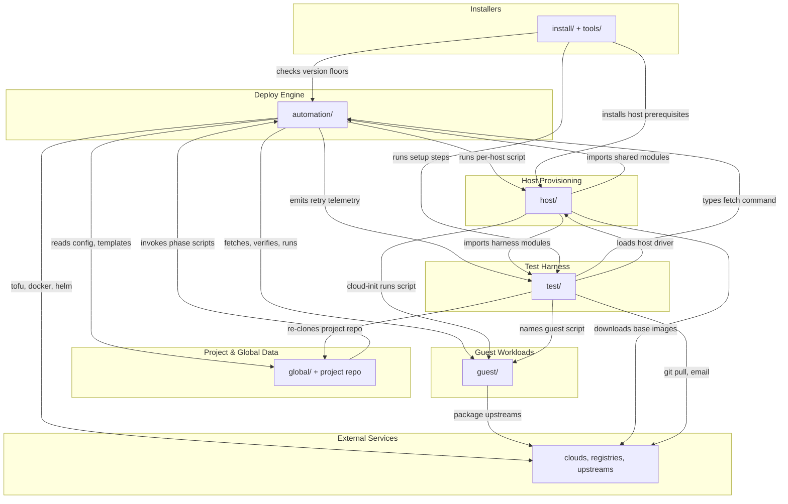

# Context and Components

> One sentence: the seven level-1 blocks Yuruna is built from, the directory roots behind each one, and the calls that actually cross the boundaries between them.

See [Design overview](00-index.md) - [Component breakdown](02-component-breakdown.md) -
[Data flows](03-data-flows.md) - [Lifecycle state](04-lifecycle-state.md) -
[Configuration data model](05-data-model.md) - [Deployment topology](06-deployment.md) -
[Naming conventions](naming.md) - [Yuruna Architecture](../architecture.md).

## Where the blocks come from

The block set is not an invented taxonomy. It is the tracked top-level
directories of the two repositories, read with `git ls-tree -r --name-only HEAD`
and bucketed by first path segment. `VERSION` reads `2026.08.23`.

`yuruna` tracks 1066 files across nine directories:

| Root | Tracked files |
|---|---|
| `automation/` | 44 |
| `dev-only/` | 63 |
| `docs/` | 45 |
| `global/` | 51 |
| `guest/` | 30 |
| `host/` | 150 |
| `install/` | 10 |
| `test/` | 646 |
| `tools/` | 14 |
| root files (no directory) | 13 |

`yuruna-project` tracks 116 files across four directories: `example/` 96,
`template/` 7, `book/` 4, `test/` 1, plus 8 root files.

Thirteen roots become seven blocks through three exclusions and two merges. Both
merges are argued from code in [The two merges](#the-two-merges); the exclusions
are listed in [What is not a block](#what-is-not-a-block).

## The seven blocks

```mermaid
flowchart TD
  subgraph deploy-engine["Deploy Engine"]
    automation["automation/"]
  end
  subgraph project-data["Project & Global Data"]
    global-project["global/ + project repo"]
  end
  subgraph guest-workloads["Guest Workloads"]
    guest["guest/"]
  end
  subgraph host-provisioning["Host Provisioning"]
    host["host/"]
  end
  subgraph installers["Installers"]
    install-tools["install/ + tools/"]
  end
  subgraph test-harness["Test Harness"]
    test["test/"]
  end
  subgraph external-services["External Services"]
    external-endpoints["clouds, registries, upstreams"]
  end

  automation -->|"reads config, templates"| global-project
  automation -->|"fetches, verifies, runs"| guest
  automation -->|"runs per-host script"| host
  automation -->|"emits retry telemetry"| test
  automation -->|"tofu, docker, helm"| external-endpoints
  global-project -->|"invokes phase scripts"| automation
  guest -->|"package upstreams"| external-endpoints
  host -->|"imports shared modules"| automation
  host -->|"cloud-init runs script"| guest
  host -->|"imports harness modules"| test
  host -->|"downloads base images"| external-endpoints
  install-tools -->|"checks version floors"| automation
  install-tools -->|"installs host prerequisites"| host
  install-tools -->|"runs setup steps"| test
  test -->|"types fetch command"| automation
  test -->|"re-clones project repo"| global-project
  test -->|"names guest script"| guest
  test -->|"loads host driver"| host
  test -->|"git pull, email"| external-endpoints
```

### What each box maps to on disk

Seven subgraphs, one node each, so no parent's child set exceeds one. The single
node inside each subgraph stands for the whole block;
[Component breakdown](02-component-breakdown.md) expands the same seven ids into
their real children, which is why nothing here can disagree with it about counts.

| Node | Block | Roots owned | Tracked files |
|---|---|---|---|
| `automation` | Deploy Engine | `automation/` | 44 |
| `global-project` | Project & Global Data | `global/`, the `yuruna-project` repository | 51 + 108 |
| `guest` | Guest Workloads | `guest/` | 30 |
| `host` | Host Provisioning | `host/` | 150 |
| `install-tools` | Installers | `install/`, `tools/` | 10 + 14 |
| `test` | Test Harness | `test/` | 646 |
| `external-endpoints` | External Services | none | 0 |

The yuruna arithmetic closes: 44 + 51 + 30 + 150 + 10 + 14 + 646 = 945 tracked
files inside blocks, plus 45 in `docs/`, 63 in `dev-only/` and 13 root files
excluded, for 1066. In `yuruna-project`, 108 files sit inside `project-data` and
the remaining 8 are root files, for 116.

### The one aggregate: External Services

`external-endpoints` is the only node in this diagram that folds siblings. It
stands for **7** outside systems, no directory behind any of them:

1. **Cloud control planes** -- `tofu plan` / `tofu apply` against
   `hashicorp/aws` and `hashicorp/azurerm`
   (`automation/Yuruna.Resource.psm1:253,257,261`), `tofu destroy`
   (`automation/Yuruna.Clear.psm1:84`), and `az account show --query id --output
   tsv` when `ARM_SUBSCRIPTION_ID` is unset (`automation/Yuruna.Resource.psm1:221`).
2. **Container registries** -- five ordered logins registered in
   `automation/Yuruna.CredentialProvider.psm1` at `:99` (`azurecr`), `:123`
   (`ecr`), `:154` (`gar`), `:185` (`dockerhub`), `:217` (`docker-generic`).
3. **The OpenTofu provider registry** -- `tofu init -input=false`
   (`automation/Yuruna.Retry.psm1:319`), the only step that downloads providers.
4. **GitHub** -- the guest-side fallback fetch, `https://api.github.com/repos/...`
   with a token or `https://raw.githubusercontent.com/...` without
   (`automation/fetch-and-execute.sh:168,170`), plus `Invoke-GitPull`
   (`test/modules/Test.HostGit.psm1:349`) on the host side.
5. **OS image publishers** -- `cloud-images.ubuntu.com`
   (`host/modules/Yuruna.Image.psm1:837`), `releases.ubuntu.com` and
   `cdimage.ubuntu.com` (`host/modules/Yuruna.UbuntuImage.psm1:96,98,103`).
6. **Package upstreams** -- `download.docker.com` and `pkgs.k8s.io`
   (`guest/ubuntu.server.26/ubuntu.server.26.k8s.sh:75,134`), plus each family's
   distribution repositories through its `*.update.sh`.
7. **The transactional mail API** -- `https://api.resend.com/emails`
   (`test/extension/notification/default.psm1:100`).

Four blocks reach it and none of them reach the same member set, which is why the
four inbound labels differ. `external-endpoints` has no outbound edge: nothing
outside the system calls in.

### The 19 cross-block edges

Ordered by source block declaration order, then by target block declaration
order. Every row was re-read in the current tree.

| Source | Target | Label | Proof |
|---|---|---|---|
| `automation` | `global-project` | reads config, templates | `automation/Yuruna.Resource.psm1:67` reads `config/<subfolder>/resources.yml`, `automation/Yuruna.Component.psm1:62` reads `components.yml`, `automation/Yuruna.Workload.psm1:316` reads `workloads.yml`, all under `$project_root`; templates resolve at `Yuruna.Resource.psm1:103` then `:105` |
| `automation` | `guest` | fetches, verifies, runs | `automation/fetch-and-execute.sh` takes a `guest/**` path and gates the bytes on a host-supplied SHA-256 before any of them reach bash; `EXEC_REQUIRE_SHA256=1` makes a missing digest fail closed (`:279-282`), otherwise the run warns and proceeds (`:283-284`) |
| `automation` | `host` | runs per-host script | `Invoke-YurunaHostScript` (`automation/Yuruna.HostRedirect.psm1:250`) resolves `host/<platform>/<name>.ps1` and runs it in a child pwsh |
| `automation` | `test` | emits retry telemetry | `automation/Yuruna.HostRedirect.psm1:127` loads `test/modules/Test.HostDetection.psm1` on demand; `automation/Yuruna.Retry.psm1:144` calls `Send-CycleEventSafely`, defined in `test/modules/Test.Log.psm1`, behind the `Get-Command` guard at `:131` |
| `automation` | `external-endpoints` | tofu, docker, helm | `tofu init` (`automation/Yuruna.Retry.psm1:319`), `tofu plan` / `apply` (`automation/Yuruna.Resource.psm1:253,257,261`), `helm lint` (`automation/Yuruna.Workload.psm1:121`), `kubectl config use-context` (`:384`), docker through `Invoke-ComponentCommand` (`automation/Yuruna.Component.psm1:97`), five registry logins (`automation/Yuruna.CredentialProvider.psm1:99,123,154,185,217`) |
| `global-project` | `automation` | invokes phase scripts | the project's own guest script calls all three phases as plain `pwsh` invocations: `yuruna-project/example/website/test/ubuntu.server.24/ubuntu.server.24.workload.k8s.website.sh:263,443,446` |
| `guest` | `external-endpoints` | package upstreams | `guest/ubuntu.server.26/ubuntu.server.26.k8s.sh:75` fetches the Docker signing key, `:134` the Kubernetes key |
| `host` | `automation` | imports shared modules | all three drivers import `automation/Yuruna.Common.psm1` `-Global` (`host/ubuntu.kvm/modules/Yuruna.Host.psm1:94`, `host/macos.utm/modules/Yuruna.Host.psm1:74`, `host/windows.hyper-v/modules/Yuruna.Host.psm1:75`); per-guest builders add `automation/Yuruna.GuestSeed.psm1` and call `New-CloudInitUserData` |
| `host` | `guest` | cloud-init runs script | three service seeds run a `guest/ubuntu.server.26/*.sh` builder by absolute path: `host/vmconfig/stash-service.base.user-data:186`, `host/vmconfig/pool-control-service.base.user-data:186`, `host/vmconfig/download-agent-service.base.user-data:342` |
| `host` | `test` | imports harness modules | every driver's load tail imports `test/modules/Test.Ssh.psm1` and `test/modules/Test.CachingProxyService.psm1` `-Global` (`host/ubuntu.kvm/modules/Yuruna.Host.psm1:95-96`, and the same two lines in the macOS and Hyper-V drivers) |
| `host` | `external-endpoints` | downloads base images | `host/modules/Yuruna.Image.psm1:837` fetches from `cloud-images.ubuntu.com` and GPG-verifies against `host/modules/keys/ubuntu-image-signing-keys.asc`; `host/modules/Yuruna.UbuntuImage.psm1:96,98,103` resolves ISOs from `releases.ubuntu.com` and `cdimage.ubuntu.com` |
| `install-tools` | `automation` | checks version floors | `install/ubuntu.kvm.sh:923` reads `automation/Yuruna.Requirement.yml`; `install/ubuntu.kvm.sh:1275`, `install/macos.utm.sh:1120` and `install/windows.hyper-v.ps1:1514` run `automation/Test-Requirement.ps1` and parse its output |
| `install-tools` | `host` | installs host prerequisites | `install/ubuntu.kvm.sh:1023` resolves `host/ubuntu.kvm/yuruna-bridge-pin.sudoers` and installs it as `/etc/sudoers.d/yuruna-bridge-pin`; `:1246` points the operator at `host/ubuntu.kvm/Enable-TestAutomation.ps1` |
| `install-tools` | `test` | runs setup steps | `install/setup.ps1:3356` runs `test/lab/Set-LabToken.ps1`; the same script resolves `test/service/<Start\|Stop>*.ps1` and imports several `test/modules/*.psm1` |
| `test` | `automation` | types fetch command | 13 sequence files under `test/sequences/` type `/usr/local/lib/yuruna/fetch-and-execute.sh` into a guest, for example `test/sequences/workload.guest.ubuntu.server.26.yml:42`; that binary is `automation/fetch-and-execute.sh`, seeded into the guest |
| `test` | `global-project` | re-clones project repo | `Update-ProjectClone` (`test/modules/Test.HostGit.psm1:785`) refreshes `<RepoRoot>/project/` from `repositories.projectUrl`; `test/service/Start-StatusService.ps1` serves the tree as `/yuruna-project-archive.tar.gz` |
| `test` | `guest` | names guest script | the same 13 sequence lines name the `guest/**` path they want run, for example `test/sequences/workload.guest.ubuntu.server.26.yml:42` naming `guest/ubuntu.server.26/ubuntu.server.26.code.sh` |
| `test` | `host` | loads host driver | `test/modules/Test.HostBootstrap.psm1:79` builds `host/<platform>/modules/Yuruna.Host.psm1` from `Get-HostFolder` and imports it `-Global`, throwing at `:81` when it is absent |
| `test` | `external-endpoints` | git pull, email | `Invoke-GitPull` (`test/modules/Test.HostGit.psm1:349`); `test/extension/notification/default.psm1:100` posts to `https://api.resend.com/emails` |

Every ordered block pair not in this table has no call site. In particular
`guest` calls nothing but package upstreams, and `global-project` calls nothing
but the deploy engine.

## What each block is

| Block | Charter |
|---|---|
| **Deploy Engine** | The three deploy phases (resources, components, workloads), the validation and clear operations, and the shared PowerShell and guest-side shell libraries the other blocks import. `automation/yuruna.ps1:99-105` dispatches `requirements`, `clear`, `validate`, `resources`, `components`, `workloads`. |
| **Project & Global Data** | The declarative input the engine reads: per-project `config/<subfolder>/*.yml`, the project-local template trees, and the framework-supplied `global/resources/` fallback. `global/resources/` holds 48 files in 10 OpenTofu template directories under three provider roots (`aws`, `azure`, `localhost`). |
| **Guest Workloads** | Per-OS-family install scripts that run inside a guest, fetched by name over the host route. 30 files: 6 READMEs and 24 scripts in five families -- `amazon.linux.2023`, `macos.26`, `ubuntu.server.24`, `ubuntu.server.26`, `windows.11`. |
| **Host Provisioning** | Three hypervisor drivers (`host/<platform>/modules/Yuruna.Host.psm1` for `macos.utm`, `ubuntu.kvm`, `windows.hyper-v`), 25 per-guest image and VM builders, 8 files under `host/modules/`, and the 31 cloud-init data files in `host/vmconfig/`. `host/Yuruna.Host.Contract.psm1:57` declares the 38 verb names every driver must export. |
| **Installers** | One-command host bootstrap for the three platforms (`install/windows.hyper-v.ps1`, `install/ubuntu.kvm.sh`, `install/macos.utm.sh`), the guided `install/setup.ps1`, the signed release manifest that gates the download (`install/install.sha256`, `install/install.sha256.sig`, `install/keys/`), and the 14 repository gates and suite runners in `tools/`. |
| **Test Harness** | The cycle runner, the sequence engine, the host and pool services, the extension areas, and the Pester suites. 646 files, the largest of which are `test/modules/` (315) and `test/extension/` (231). |
| **External Services** | Owns nothing on disk. Names the seven outside systems every other block reaches, enumerated above. |

## The two merges

Two merges hold the level-1 count at seven. Neither is a convenience: each one
collapses roots that a single function already treats as one namespace.

### `global/` merges with the `yuruna-project` repository

Resource template resolution is a two-level lookup written in one function:

- `automation/Yuruna.Resource.psm1:103` --
  `Join-Path -Path $project_root -ChildPath "resources/$resourceTemplate"`
- `automation/Yuruna.Resource.psm1:105`, reached only when the first path does
  not exist --
  `Join-Path -Path $yuruna_root -ChildPath "global/resources/$resourceTemplate"`

The validator repeats the same fallback at `automation/Yuruna.Validation.psm1:140`.
Project-first, global-second, one namespace, so drawing two blocks would put a
boundary in the middle of one `if`.

The shipped projects prove the fallback is the live path rather than a
theoretical one: `example/website/resources/` and `example/text-to-sql/resources/`
contain nothing but a `placeholder` file, while
`example/website/config/azure/resources.yml:26,30,36` names `azure/resource-group`,
`azure/registry` and `azure/aks-cluster`,
`example/website/config/aws/resources.yml:24,31` names `aws/registry` and
`aws/eks-cluster`, and `example/website/config/localhost/resources.yml` names
`localhost/registry` and `localhost/context-copy`. All seven resolve under
`global/resources/`.

The fallback is resources-only. Components resolve from the project alone
(`automation/Yuruna.Component.psm1:83,133`) and so do workloads
(`automation/Yuruna.Workload.psm1:73`). A repository-wide search for
`global/components` and `global/workloads` finds no code reference at all: the
only hits are `.gitattributes:98` and `:99`, declaring the two marker files
`eol=lf`.

### `install/` merges with `tools/`

`tools/Update-YurunaReleasePins.ps1` produces the artifacts the installers are
verified against, so the two directories are one release path:

- `:112` -- `$sha256File = Join-Path $installDir 'install.sha256'`
- `:113` -- `$sigFile = Join-Path $installDir 'install.sha256.sig'`
- `:119` -- the manifest input list starts `'install/macos.utm.sh'`
- `:140` -- rewrites the verified-download tag inside `install/README.md`

The rest of `tools/` is repository gates that run against every block, which is
why they belong with the release path rather than with any single block they
inspect: `tools/Test-AsciiNoBom.ps1:99` targets `install/windows.hyper-v.ps1`,
`tools/Test-RegionAnchors.ps1:206` walks `host/vmconfig`,
`tools/Invoke-GoTest.ps1:57` defaults to `test/extension`, and
`tools/Invoke-TestSuite.ps1:102` defaults to `@('test/modules', 'host/modules')`.
Putting them inside any one block would claim an ownership the code does not have.

## What is not a block

| Path | Why it is not a block |
|---|---|
| `docs/` (45 tracked) | Documentation, including the `docs/design/` directory this file lives in. No runtime path reads it. |
| `dev-only/` (63 tracked) | Maintainer trees -- `design/`, `review.history/`, `review-autopilot/`, plus `mcp-guide.md`, `prompts.txt`, `release.md`, and the release and version-stamping scripts. `KEEP-PRIVATE.txt` names `dev-only`, so the whole subtree is stripped from the public mirror. |
| yuruna root files (13) | Repository furniture: `LICENSE.md`, `CHANGELOG.md`, `CONTRIBUTING.md`, `SECURITY.md`, `README.md`, `PSScriptAnalyzerSettings.psd1`, `VERSION`, `.gitattributes`, `.gitconfig.yuruna`, `.gitignore`, `KEEP-PRIVATE.txt`, `CLAUDE.md`, `Add-AutomationToPath.ps1`. |
| yuruna-project root files (8) | Same reason. |
| `project/` (untracked) | Gitignored at `.gitignore:376`. It exists in every live working tree, but `Update-ProjectClone` (`test/modules/Test.HostGit.psm1:785`) refreshes it from `repositories.projectUrl` at cycle start, so its contents belong to `project-data` while its lifecycle belongs to `test-harness`. |
| `test/status/<subdir>/` (untracked) | Harness runtime state -- `runtime/`, `log/`, `perf/`, `extension/`, `captures/`, `ssh/` -- under the one umbrella rule `test/status/*/` (`.gitignore:407`). Only the UI files at the `test/status/` root stay tracked. |
| `test/test.config.yml` (untracked) | The live operator configuration, holding credentials. The tracked artifact is `test/test.config.yml.template`. |
| `install/setup.answers.*.yml` (untracked) | One machine's answers to the guided installer. |

## Edges that are easy to misread

- **`install-tools -> host` is two different things.** The sudoers half really
  runs: `install/ubuntu.kvm.sh:1023` installs `yuruna-bridge-pin.sudoers`. The
  provisioning half does not -- `:1246` prints the
  `host/ubuntu.kvm/Enable-TestAutomation.ps1` command for the operator to run
  instead of running it, because that script changes libvirt state on a machine
  that may never host a runner. Read that arrow as a handoff, not a call.
- **`install-tools -> automation` is the opposite case.** The version-floor check
  really executes `automation/Test-Requirement.ps1` in a child process and reads
  the answer back (`install/ubuntu.kvm.sh:1275`, `install/macos.utm.sh:1120`,
  `install/windows.hyper-v.ps1:1514`).
- **`automation -> test` and `host -> test` do not mean the harness is a
  dependency of a deploy.** Both are optional-in-practice: the retry telemetry
  call is guarded by `Get-Command Send-CycleEventSafely`
  (`automation/Yuruna.Retry.psm1:131`), so it is a plain no-op outside a cycle.
  The driver imports are unconditional, but drivers only load inside a runner.
- **`test -> automation` is not a function call.** No cycle path calls a phase
  entry point in-process. The harness types a command string into a guest console
  or SSH session; the binary that runs is a copy of `automation/fetch-and-execute.sh`
  already seeded into that guest. See [Data flows](03-data-flows.md).
- **`global-project -> automation` closes the loop.** The project's own guest
  script is what finally runs `Set-Resource.ps1`, `Set-Component.ps1` and
  `Set-Workload.ps1` (`ubuntu.server.24.workload.k8s.website.sh:263,443,446`).
  The engine is driven from inside the guest, by data the engine itself deployed.
- **`host -> guest` and `automation -> guest` reach the same scripts by different
  routes.** In production a service guest runs its build script from cloud-init by
  absolute path (`host/vmconfig/stash-service.base.user-data:186`); three
  sequences drive those same scripts through `fetch-and-execute.sh`. Both paths
  landing on one script is why those scripts are idempotent.

## Where the block boundaries do not match the directories

Four boundaries cut across a directory line. Each one is a place where reading
the tree alone would give the wrong picture.

1. **`automation/` is a shared library root, not only the deploy engine.** 31
   files under `test/` name an `automation/Yuruna.*.psm1` path, 16 of them outside
   the Pester suites -- for example `test/Test-Config.ps1:124` importing
   `Yuruna.Common.psm1`, and `test/modules/Test.CachingProxyService.psm1:1302`
   resolving `Yuruna.Retry.psm1`. Several modules in that directory are never on
   a deploy path at all: the three phase wrappers import only
   `Yuruna.LogLevel.psm1` and their own phase module
   (`automation/Set-Resource.ps1:58,76` and the same two lines in the component
   and workload wrappers), so `Yuruna.CloudInitTemplate`, `Yuruna.GuestSeed`,
   `Yuruna.HostRedirect` and their siblings serve the host and harness blocks
   rather than the deploy phases that share their directory.

2. **`host/vmconfig/` is data, not code.** All 31 files are cloud-init inputs and
   the directory contains no script of any kind. The base-plus-overlay merge that
   turns them into a seed lives in the deploy engine
   (`automation/Yuruna.CloudInitTemplate.psm1`), while a per-guest builder in the
   host block resolves the three template paths. The directory sits under `host/`
   and is read by both blocks.

3. **`test/extension/` is mostly Go.** Seven `go.mod` modules under that path
   build daemons that run inside VMs, not in the runner process. Their compiled
   binaries are gitignored by name, so the block owns the source and never the
   artifact -- a count of tracked files there measures source, not what ships.

4. **One harness-side caller of the deploy engine is out of band.**
   `test/service/Start-McpServer.ps1` is an operator-launched stdio MCP server. Its
   tool table (`:165-185`) exposes ten entry points resolved against
   `$script:AutomationDir` (`:79`, used at `:123`) -- the three phase scripts,
   `Invoke-Clear.ps1`, `Set-HostAlias.ps1`, and five read-only checks -- each
   shelled out as a child pwsh at `:133`. It is a `test/` file that calls
   `automation/` directly, which no cycle path does.

A fifth asymmetry is worth stating plainly: **the dependency between the deploy
engine and the test harness is bidirectional.** `host/` and `test/` import
`automation/`, and `automation/` reaches back at
`Yuruna.HostRedirect.psm1:127` and `Yuruna.Retry.psm1:144`. There is no layering
here to preserve; the guard at `Yuruna.Retry.psm1:131` is what keeps the back
edge harmless.
