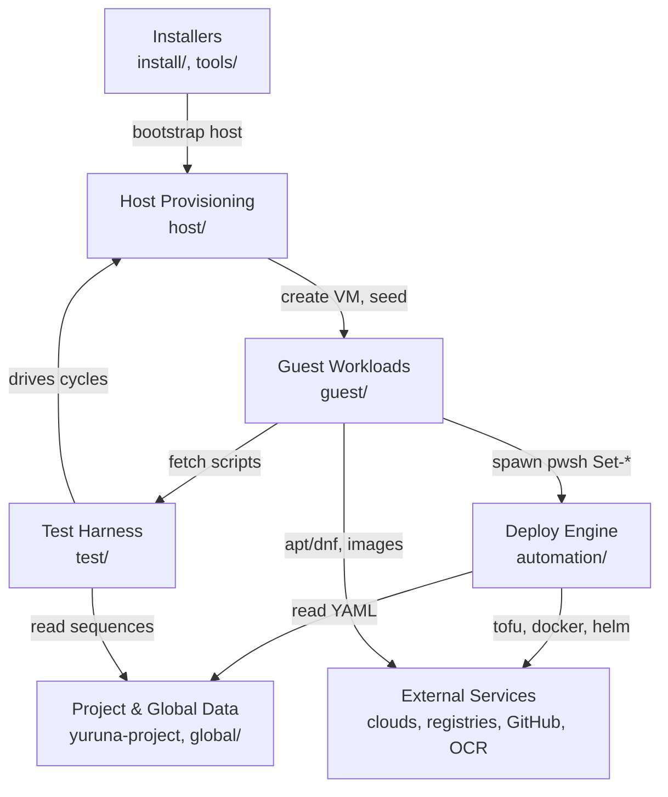

# Level-1 components

> One sentence: the seven top-level building blocks of Yuruna and how they
> connect. Drill into any block in [02-component-breakdown.md](02-component-breakdown.md).

See [Design overview](00-index.md) · [Yuruna Architecture](../architecture.md).

Derived from the repository layout: `automation/`, `host/`, `guest/`,
`install/`, `test/`, `global/` (yuruna) and the `yuruna-project` data repo.
`tools/` (`Update-YurunaReleasePins.ps1`, `Invoke-Lint.ps1`, `githooks/`) is
folded into **Installers**, whose integrity artifacts it produces.

```mermaid
flowchart TD
    installers[Installers<br/>install/, tools/]
    host-provisioning[Host Provisioning<br/>host/]
    guest-workloads[Guest Workloads<br/>guest/]
    test-harness[Test Harness<br/>test/]
    deploy-engine[Deploy Engine<br/>automation/]
    project-data[Project & Global Data<br/>yuruna-project, global/]
    external-services[External Services<br/>clouds, registries, GitHub, OCR]

    installers -->|bootstrap host| host-provisioning
    test-harness -->|drives cycles| host-provisioning
    host-provisioning -->|create VM, seed| guest-workloads
    guest-workloads -->|fetch scripts| test-harness
    guest-workloads -->|spawn pwsh Set-*| deploy-engine
    deploy-engine -->|read YAML| project-data
    test-harness -->|read sequences| project-data
    deploy-engine -->|tofu, docker, helm| external-services
    guest-workloads -->|apt/dnf, images| external-services
```

| Component | Root | Responsibility |
|---|---|---|
| Installers | `install/`, `tools/` | One-shot per-host bootstrap (`irm\|iex`, `curl\|bash`) plus the release-pin/signing and lint tooling. |
| Host Provisioning | `host/` | Create/start/stop VMs on Hyper-V, KVM, UTM behind one verb contract. |
| Guest Workloads | `guest/` | Scripts that run **inside** a booted guest. |
| Test Harness | `test/` | Continuous VM create + validate loop, status service, pool, lab. |
| Deploy Engine | `automation/` | Three-phase Resources→Components→Workloads + validation + guest shell runtime. |
| Project & Global Data | `yuruna-project/`, `global/` | Per-project YAML, charts, OpenTofu templates, sequences. |
| External Services | — | Clouds, container registries, k8s, GitHub, OCR, mirrors, email. |

Two edges are easy to misread:

- **`guest-workloads -->|spawn pwsh Set-*| deploy-engine`** — the deploy
  engine is normally exercised *inside* a guest, not from the harness. No file
  under `test/` invokes `Set-Resource.ps1` / `Set-Component.ps1` /
  `Set-Workload.ps1`; the project's own in-guest workload script does, against
  the repo clone in the VM
  (`yuruna-project/example/website/test/ubuntu.server.26/ubuntu.server.26.workload.k8s.website.sh`
  runs `cd "$REAL_HOME/yuruna/project/example"` then
  `pwsh ../../automation/Set-Component.ps1 website localhost`). The operator
  running the phases by hand is the other entry point.
- **`guest-workloads -->|fetch scripts| test-harness`** — the guest pulls its
  scripts back from the runner host's status service (`/yuruna-repo/`), which
  is part of the Test Harness. Flow C in
  [03-data-flows.md](03-data-flows.md) has the detail.

---

LICENSEURI https://yuruna.link/license

Copyright (c) 2019-2026 by Alisson Sol et al.

Last review: 2026.07.31
