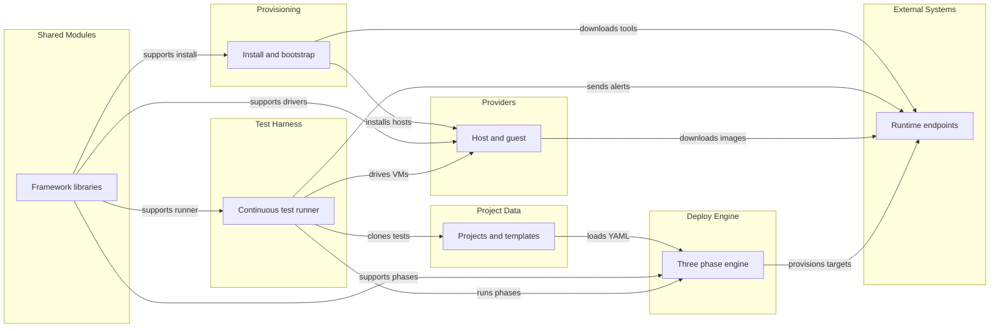

# Context and components

This level-1 view shows the seven current system blocks and only the dependencies that cross their boundaries.

```mermaid
flowchart LR
  subgraph provisioning["Provisioning"]
    provisioning-root["Install and bootstrap"]
  end

  subgraph deploy-engine["Deploy Engine"]
    deploy-engine-root["Three phase engine"]
  end

  subgraph test-harness["Test Harness"]
    test-harness-root["Continuous test runner"]
  end

  subgraph providers["Providers"]
    providers-root["Host and guest"]
  end

  subgraph project-data["Project Data"]
    project-data-root["Projects and templates"]
  end

  subgraph shared-modules["Shared Modules"]
    shared-modules-root["Framework libraries"]
  end

  subgraph external-systems["External Systems"]
    external-systems-root["Runtime endpoints"]
  end

  provisioning-root -->|"installs hosts"| providers-root
  provisioning-root -->|"downloads tools"| external-systems-root
  project-data-root -->|"loads YAML"| deploy-engine-root
  shared-modules-root -->|"supports install"| provisioning-root
  shared-modules-root -->|"supports phases"| deploy-engine-root
  shared-modules-root -->|"supports runner"| test-harness-root
  shared-modules-root -->|"supports drivers"| providers-root
  test-harness-root -->|"drives VMs"| providers-root
  test-harness-root -->|"clones tests"| project-data-root
  test-harness-root -->|"runs phases"| deploy-engine-root
  test-harness-root -->|"sends alerts"| external-systems-root
  providers-root -->|"downloads images"| external-systems-root
  deploy-engine-root -->|"provisions targets"| external-systems-root
```

## Source grounding

- **Provisioning** comes from `install/setup.ps1`, the three platform installer
  entry points under `install/`, host/guest seed modules under `automation/`, and
  the checks under `tools/`.
- **Deploy Engine** comes from `automation/Set-Resource.ps1`,
  `Set-Component.ps1`, `Set-Workload.ps1`, `Invoke-Clear.ps1`, and their
  `Yuruna.*.psm1` phase modules.
- **Test Harness** comes from `test/Start-TestRunner.ps1`, its cycle and inner
  workers under `test/modules/`, and the services and extensions under `test/`.
- **Providers** comes from `host/Yuruna.Host.Contract.psm1`,
  `host/{windows.hyper-v,ubuntu.kvm,macos.utm}`, `host/modules`, `host/vmconfig`,
  and the five current `guest/` payload folders.
- **Project Data** comes from `global/` and
  `yuruna-project/{template,example,book,test}`. The runtime-generated
  `resources.output.yml` and `.yuruna/` paths are included only in the expanded
  view.
- **Shared Modules** comes from the reusable `automation/Import.Yaml.psm1` and
  `automation/Yuruna.{Common,Validation,VariableExpansion,DeploymentKind,Result,Retry,Log,LogLevel,CredentialProvider,Component.Registry}.psm1`
  modules, plus locale/catalog/message libraries in
  `test/modules/Test.{Locale,Catalog,Message}.psm1`, the Go extension SDK's `i18n/`,
  and the browser kernel under `globalization/kernel/`.
- **External Systems** maps to current call sites in the resource, component,
  workload, installer, image-download, caching, storage, source-fetch, and
  notification code. `global/config/gcp/gcp-access-key.json` and Google Artifact
  Registry login handling are current credential support, but no GCP deployment
  box is drawn because its resource/provider tree is not implemented.

The boundary is intentionally role-based: `automation/` contains both phase logic
and libraries shared by installers, providers, and the test harness. The next page
expands the seven blocks without pretending each is a single directory.

Globalization crosses Shared Modules, Test Harness, and Project Data rather than
forming an eighth service. Catalog compilation/distribution is build-time tooling;
locale negotiation and rendering run inside existing status/pool services and
browser pages. [Globalization and future localization](07-globalization.md)
distinguishes these implemented mechanisms from partial UI conversion and planned
additional runtime languages.

---

[Yuruna Architecture](../architecture.md) | [Design index](00-index.md) | [Component breakdown](02-component-breakdown.md)
