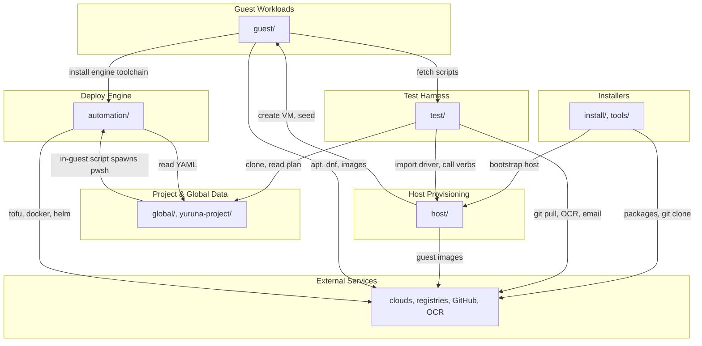

# Context and components

> One sentence: the seven top-level building blocks Yuruna is made of and the
> edges between them, each one a placeholder opened up in the breakdown doc.

See [Design overview](00-index.md) · [Component breakdown](02-component-breakdown.md) ·
[Yuruna Architecture](../architecture.md).

Derived from the repository layout — `automation/`, `global/`, `guest/`,
`host/`, `install/`, `test/`, `tools/` in **yuruna**, plus the **yuruna-project**
data repo (`book/`, `example/`, `template/`, `test/`). The two remaining tracked
roots, `docs/` and `dev-only/`, hold documentation and maintainer tooling rather
than system components, and `project/` is gitignored (`.gitignore:376`) because
the harness re-creates it every cycle.

## The seven blocks

Each `subgraph` is a placeholder wrapping one node; [doc 2](02-component-breakdown.md)
opens each one into at most seven real children. Seven blocks, no more.
Declaration order follows the repository's own directory order, with the block
that owns no directory last.

```mermaid
flowchart TD
    subgraph automation[Deploy Engine]
        deploy-engine[automation/]
    end
    subgraph project-global["Project & Global Data"]
        project-data[global/, yuruna-project/]
    end
    subgraph guest[Guest Workloads]
        guest-workloads[guest/]
    end
    subgraph host[Host Provisioning]
        host-provisioning[host/]
    end
    subgraph install[Installers]
        installers[install/, tools/]
    end
    subgraph test[Test Harness]
        test-harness[test/]
    end
    subgraph external[External Services]
        external-services[clouds, registries, GitHub, OCR]
    end

    installers -->|bootstrap host| host-provisioning
    installers -->|packages, git clone| external-services
    test-harness -->|import driver, call verbs| host-provisioning
    test-harness -->|clone, read plan| project-data
    test-harness -->|git pull, OCR, email| external-services
    host-provisioning -->|create VM, seed| guest-workloads
    host-provisioning -->|guest images| external-services
    guest-workloads -->|fetch scripts| test-harness
    guest-workloads -->|install engine toolchain| deploy-engine
    guest-workloads -->|apt, dnf, images| external-services
    project-data -->|in-guest script spawns pwsh| deploy-engine
    deploy-engine -->|read YAML| project-data
    deploy-engine -->|tofu, docker, helm| external-services
```

| Component | Root | Responsibility |
|---|---|---|
| Deploy Engine | `automation/` | Three-phase Resources→Components→Workloads (15 `.ps1`, 22 `.psm1`), the `Confirm-*` validators each phase re-runs, and the six-file guest-side shell runtime (`fetch-and-execute.sh`, `yuruna-retry.sh`, `yuruna-run.sh`, `yuruna-network.sh`, `yuruna-host-locate.sh`, `yuruna-versions.sh`). |
| Project & Global Data | `global/`, `yuruna-project/` | Per-project YAML, Dockerfiles, Helm charts, OpenTofu templates, sequences, the cycle plan, and the in-guest workload scripts under each project's `test/<guest>/`. |
| Guest Workloads | `guest/` | Scripts that run **inside** a booted guest — five families (`amazon.linux.2023`, `ubuntu.server.24`, `ubuntu.server.26`, `windows.11`, `macos.26`). |
| Host Provisioning | `host/` | Create/start/stop VMs on Hyper-V, KVM and UTM behind one 38-verb contract, acquire and verify guest images, and merge the cloud-init seeds. |
| Installers | `install/`, `tools/` | One-shot per-host bootstrap (`irm\|iex`, `curl\|bash`), the guided `setup.ps1`, plus release-pin signing, SDK mirroring and lint gates. |
| Test Harness | `test/` | Continuous VM create + validate loop, status service, extension services, pool and lab admin. |
| External Services | — | Clouds, container registries, Kubernetes, GitHub, upstream mirrors, OCR engines, email (`api.resend.com`). |

Nothing in this diagram is planned or config-gated, so no edge is dashed. The
one planned item in this area has no block: `global/config/` holds `gcp` with a
credential stub only, and `global/resources/` has `aws`, `azure` and `localhost`
but no `gcp` templates.

## Edges that are easy to misread

- **`project-data --> deploy-engine`** — the deploy engine is normally exercised
  *inside* a guest, by a script from the **project** repo rather than by the
  harness. No file under `test/` invokes `Set-Resource.ps1` /
  `Set-Component.ps1` / `Set-Workload.ps1`; the eight `test/` files that mention
  those names carry only comments (`test/Invoke-TestSequence.ps1:156`,
  `test/modules/Test.Orchestrator.psm1:84`), Pester structural guards that list
  the entry points as data (`test/modules/Test.AuEntry.Tests.ps1:39`), and two
  references to an unrelated `project/test/Set-Resource.ps1`. The real
  caller is
  `yuruna-project/example/website/test/ubuntu.server.26/ubuntu.server.26.workload.k8s.website.sh`,
  which does `cd "$REAL_HOME/yuruna/project/example"` and then
  `pwsh ../../automation/Set-Resource.ps1 website localhost` (line 236),
  `Set-Component.ps1` (417) and `Set-Workload.ps1` (420). The operator running
  the phases by hand is the other entry point.
- **`guest-workloads --> deploy-engine`** — this is a **toolchain** edge, not a
  call. `guest/ubuntu.server.26/ubuntu.server.26.k8s.sh` installs Docker,
  Kubernetes, Helm, OpenTofu and mkcert, and says so in its own failure text:
  "downstream chart-based workloads … will fail at Set-Workload" (`:565`) and
  "Downstream Set-Resource steps rely on 'tofu'" (`:581`). No script under
  `guest/` invokes a phase script.
- **`guest-workloads --> test-harness`** — the guest pulls its scripts back from
  the runner host's status service, so a `guest/` script and a project script
  arrive by the same route. `automation/fetch-and-execute.sh` probes
  `http://${YURUNA_STATUS_SERVICE_IP}:${YURUNA_STATUS_SERVICE_PORT}/livecheck`
  (`:107`) and then sets
  `HOST_BASE="http://${YURUNA_STATUS_SERVICE_IP}:${YURUNA_STATUS_SERVICE_PORT}/yuruna-repo/"`
  (`:100`, `:109`). Flow C in [03-data-flows.md](03-data-flows.md) has the
  detail.
- **`test-harness --> host-provisioning`** — an import, not a spawn.
  `Initialize-YurunaHost` (`test/modules/Test.HostBootstrap.psm1:41`) resolves
  `host/<host type>/modules/Yuruna.Host.psm1` and imports it
  `-Force -DisableNameChecking -Global`, so the contract verbs resolve directly
  in the runner's own session and the driver's `New-VM` / `Start-VM` shadow the
  Hyper-V cmdlets of the same name on purpose. The exception is the per-host
  operator scripts, which do run in a child `pwsh` rooted in the host folder.
- **`installers --> host-provisioning`** — the arrow crosses two other blocks'
  files on the way. `install/setup.ps1:2913` calls
  `test/lab/Enable-TestAutomation.ps1`, which imports
  `automation/Yuruna.HostRedirect.psm1` and dispatches to
  `host/<short>/Enable-TestAutomation.ps1`. The bootstrappers themselves stop
  after installing packages and cloning; they never call `setup.ps1`.
- **`host-provisioning --> external-services`** —
  `host/<provider>/guest.<key>/Get-Image.ps1` reaches the publisher origin
  directly. When a download-agent service answers the discovery ladder in
  `host/modules/Yuruna.DownloadAgent.psm1`, that same call is served off the LAN
  instead; flow E in [03-data-flows.md](03-data-flows.md) shows both.

One edge is absent on purpose. **Host Provisioning reads no project YAML**: the
image and VM-shape inputs a `Get-Image.ps1` / `New-VM.ps1` pair consumes come
from `test/test.config.yml`, `host/vmconfig/` and the download-agent service —
never from `yuruna-project`. A grep for `resources.yml`, `components.yml`,
`workloads.yml` or `yuruna-project` across `host/` returns one comment and no
code. Project data reaches a guest only after boot, over the Guest Workloads
edge.

## Where the block boundaries do not match the directories

- **`automation/` is a shared library root, not only the Deploy Engine.** Five
  of its modules exist for other blocks: `Yuruna.CloudInitTemplate.psm1` is
  imported by 21 `host/*/guest.*/New-VM.ps1` scripts and `Yuruna.GuestSeed.psm1`
  by 9 of them, `Yuruna.HostSetup.psm1` by all six
  `Enable-TestAutomation.ps1` / `Sync-HostConfiguration.ps1` host scripts,
  `Yuruna.HostRedirect.psm1` by `install/setup.ps1` and `test/lab/`, and
  `Yuruna.GitHubSource.psm1` by both the seed builder and the harness. Thirteen
  non-test files under `test/` import `automation/Yuruna.Common.psm1`, and
  `Yuruna.Log.psm1` has **no** importer under `automation/` at all — its three
  consumers are all in `test/`. Drawing those as block edges would claim "Host
  Provisioning depends on the Deploy Engine", which is not what is happening.
- **The Project Data block has a third root that is in neither repo.**
  `Update-ProjectClone` (`test/modules/Test.HostGit.psm1:785`) wipes and
  re-clones `repositories.projectUrl` into `<RepoRoot>/project/` at every cycle
  start, so previous cycle output cannot leak forward. That clone is what the
  harness reads the cycle plan from (`Get-CycleConfigPath` returns
  `project/test/test.runner.yml`, `test/modules/Test.SequencePlanner.psm1:58`)
  and what the sequences name in their fetch paths
  (`project/example/website/test/ubuntu.server.26/…`). So the Test Harness
  writes into the Project Data block's root once per cycle — that is the
  `clone, read plan` edge.
- **`tools/`** is drawn inside **Installers** because the signed integrity
  artifacts under `install/` are its output — `Update-YurunaReleasePins.ps1`
  regenerates and signs `install/install.sha256`, gated by
  `Test-AsciiNoBom.ps1`. Its remaining entries (the linter, the SDK mirror, the
  config migrator, the pre-commit hook) are development gates, not shipped
  artifacts.
- **`global/`** is drawn with **yuruna-project** rather than with the engine:
  `global/resources/<template>` is the fallback a project's `resources/` folder
  resolves to, so the two are one data plane with two roots.
- **Part of the Test Harness block does not run on the harness host.** The Go
  daemons under `test/extension/*/server/` are compiled and run *inside* service
  VMs, and `test/extension/pool-aggregator-service/` runs inside the
  caching-proxy VM. By directory they belong here; by deployment they are their
  own nodes in [06-deployment.md](06-deployment.md).
- **External Services** owns no directory. It exists so the edges that leave the
  machine are visible instead of implied.

---

LICENSEURI https://yuruna.link/license

Copyright (c) 2019-2026 by Alisson Sol et al.

Last review: 2026.08.16
