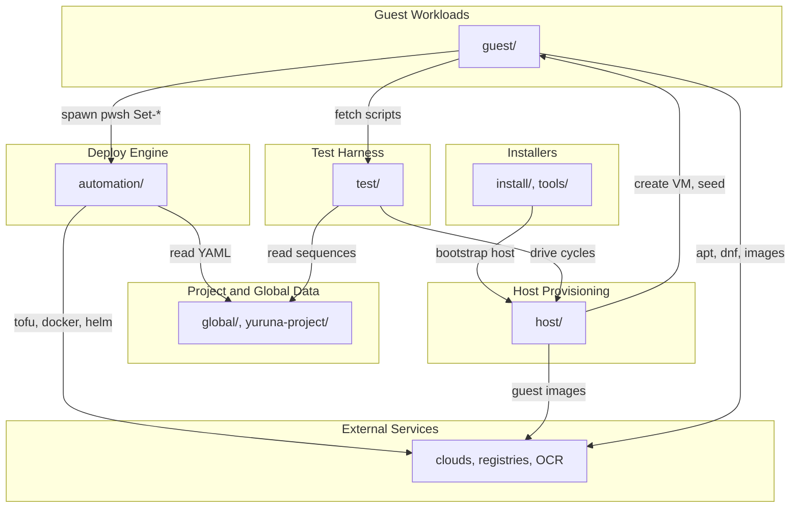

# Context and components

> One sentence: the seven top-level building blocks Yuruna is made of and the
> edges between them, each one a placeholder opened up in the breakdown doc.

See [Design overview](00-index.md) · [Component breakdown](02-component-breakdown.md) ·
[Yuruna Architecture](../architecture.md).

Derived from the repository layout — `automation/`, `global/`, `guest/`,
`host/`, `install/`, `test/`, `tools/` in **yuruna**, plus the **yuruna-project**
data repo (`book/`, `example/`, `template/`, `test/`).

## The seven blocks

Each `subgraph` is a placeholder; [doc 2](02-component-breakdown.md) opens each
one into at most seven real children. Declaration order follows the repository's
own directory order, with the block that owns no directory last.

```mermaid
flowchart TD
    subgraph automation[Deploy Engine]
        deploy-engine[automation/]
    end
    subgraph projectdata[Project and Global Data]
        project-data[global/, yuruna-project/]
    end
    subgraph guest[Guest Workloads]
        guest-workloads[guest/]
    end
    subgraph host[Host Provisioning]
        host-provisioning[host/]
    end
    subgraph install[Installers]
        installers[install/, tools/]
    end
    subgraph test[Test Harness]
        test-harness[test/]
    end
    subgraph external[External Services]
        external-services[clouds, registries, OCR]
    end

    installers -->|bootstrap host| host-provisioning
    test-harness -->|drive cycles| host-provisioning
    host-provisioning -->|create VM, seed| guest-workloads
    guest-workloads -->|fetch scripts| test-harness
    guest-workloads -->|spawn pwsh Set-*| deploy-engine
    deploy-engine -->|read YAML| project-data
    test-harness -->|read sequences| project-data
    deploy-engine -->|tofu, docker, helm| external-services
    host-provisioning -->|guest images| external-services
    guest-workloads -->|apt, dnf, images| external-services
```

| Component | Root | Responsibility |
|---|---|---|
| Deploy Engine | `automation/` | Three-phase Resources→Components→Workloads, its validators, and the guest-side shell runtime. |
| Project & Global Data | `global/`, `yuruna-project/` | Per-project YAML, Dockerfiles, Helm charts, OpenTofu templates, sequences and the cycle plan. |
| Guest Workloads | `guest/` | Scripts that run **inside** a booted guest. |
| Host Provisioning | `host/` | Create/start/stop VMs on Hyper-V, KVM and UTM behind one verb contract. |
| Installers | `install/`, `tools/` | One-shot per-host bootstrap (`irm\|iex`, `curl\|bash`), the guided `setup.ps1`, plus release-pin signing, SDK mirroring and lint gates. |
| Test Harness | `test/` | Continuous VM create + validate loop, status service, extension services, pool and lab admin. |
| External Services | — | Clouds, container registries, Kubernetes, GitHub, upstream mirrors, OCR engines, email. |

## Edges that are easy to misread

- **`guest-workloads --> deploy-engine`** — the deploy engine is normally
  exercised *inside* a guest, not from the harness. No file under `test/`
  invokes `Set-Resource.ps1` / `Set-Component.ps1` / `Set-Workload.ps1`; the
  project's own in-guest workload script does, against the repo clone in the VM
  (`yuruna-project/example/website/test/ubuntu.server.26/ubuntu.server.26.workload.k8s.website.sh`
  runs `cd "$REAL_HOME/yuruna/project/example"` then
  `pwsh ../../automation/Set-Component.ps1 website localhost`). The operator
  running the phases by hand is the other entry point.
- **`guest-workloads --> test-harness`** — the guest pulls its scripts back from
  the runner host's status service (`/yuruna-repo/`, `/yuruna-archive.tar.gz`),
  which is part of the Test Harness. Flow C in
  [03-data-flows.md](03-data-flows.md) has the detail.
- **`host-provisioning --> external-services`** — `host/<provider>/guest.<key>/Get-Image.ps1`
  reaches the publisher origin directly. When a download-agent service answers,
  that same call is served off the LAN instead; flow E in
  [03-data-flows.md](03-data-flows.md) shows both.

One edge is absent on purpose. **Host Provisioning reads no project YAML**: the
image and VM-shape inputs a `Get-Image.ps1` / `New-VM.ps1` pair consumes come
from `test/test.config.yml`, `host/vmconfig/` and the download-agent service —
never from `yuruna-project`. Project data reaches a guest only after boot, over
the Guest Workloads edge.

## Where the block boundaries do not match the directories

- **`tools/`** is drawn inside **Installers** because the signed integrity
  artifacts under `install/` are its output. Its three other entries are
  development gates, not shipped artifacts.
- **`global/`** is drawn with **yuruna-project** rather than with the engine:
  `global/resources/<template>` is the fallback a project's `resources/` folder
  resolves to, so the two are one data plane with two roots.
- **External Services** owns no directory. It exists so the edges that leave the
  machine are visible instead of implied.

---

LICENSEURI https://yuruna.link/license

Copyright (c) 2019-2026 by Alisson Sol et al.

Last review: 2026.08.07
