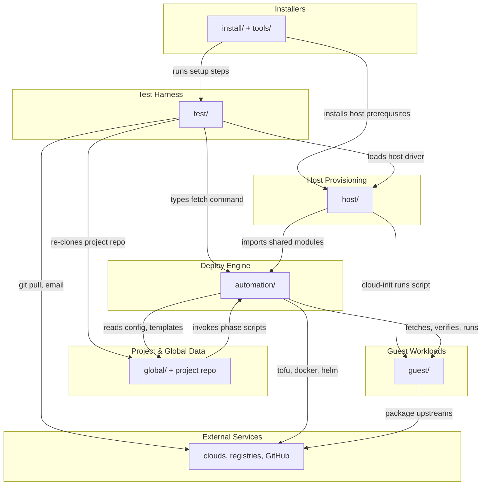

# Context and Components

> One sentence: the seven level-1 blocks Yuruna is built from, where each one lives on disk, and which calls actually cross the boundaries between them.

See [Design overview](00-index.md) - [Component breakdown](02-component-breakdown.md) -
[Yuruna Architecture](../architecture.md).

## Where the blocks come from

The blocks below are not an invented taxonomy. They are the tracked top-level
directories of the two repositories, read with `git ls-tree --name-only HEAD`.

`yuruna` tracks nine directories: `automation/`, `dev-only/`, `docs/`, `global/`,
`guest/`, `host/`, `install/`, `test/`, `tools/`. `yuruna-project` tracks four:
`book/`, `example/`, `template/`, `test/`.

Three exclusions and two merges turn that listing into seven blocks:

- **`docs/` and `dev-only/` are excluded.** They are documentation and maintainer
  trees. No runtime path reads them, and this file lives inside one of them.
- **`project/` is excluded.** It exists in a working tree but is gitignored at
  `.gitignore:376`, because `Update-ProjectClone`
  (`test/modules/Test.HostGit.psm1:785`) deletes and re-clones it at the start of
  every cycle so the previous cycle's output cannot leak forward.
- **Root files are excluded** (`README.md`, `VERSION`, `PSScriptAnalyzerSettings.psd1`,
  and so on). They are repository furniture, not system parts.
- **`global/` and the whole `yuruna-project` repository merge into one block.**
  A resource template is resolved project-first and global-second by the same two
  lines of the same function, so the two roots are one namespace rather than two
  components (see the boundary notes below).
- **`install/` and `tools/` merge into one block.** Both exist to get a machine to
  the point where a cycle can run, and `tools/Update-YurunaReleasePins.ps1`
  regenerates the manifest the installers are verified against.

One block, External Services, owns no directory at all. It is declared last for
that reason; every other block is declared in repository directory order.

## The seven blocks

```mermaid
flowchart TD
  subgraph deploy-engine["Deploy Engine"]
    automation["automation/"]
  end
  subgraph project-data["Project & Global Data"]
    project-trees["global/ + project repo"]
  end
  subgraph guest-workloads["Guest Workloads"]
    guest-scripts["guest/"]
  end
  subgraph host-provisioning["Host Provisioning"]
    host-drivers["host/"]
  end
  subgraph installers["Installers"]
    install-tools["install/ + tools/"]
  end
  subgraph test-harness["Test Harness"]
    test-tree["test/"]
  end
  subgraph external-services["External Services"]
    external-endpoints["clouds, registries, GitHub"]
  end

  install-tools -->|"installs host prerequisites"| host-drivers
  install-tools -->|"runs setup steps"| test-tree
  test-tree -->|"loads host driver"| host-drivers
  test-tree -->|"re-clones project repo"| project-trees
  test-tree -->|"types fetch command"| automation
  test-tree -->|"git pull, email"| external-endpoints
  host-drivers -->|"imports shared modules"| automation
  host-drivers -->|"cloud-init runs script"| guest-scripts
  automation -->|"fetches, verifies, runs"| guest-scripts
  automation -->|"reads config, templates"| project-trees
  project-trees -->|"invokes phase scripts"| automation
  automation -->|"tofu, docker, helm"| external-endpoints
  guest-scripts -->|"package upstreams"| external-endpoints
```

Seven boxes, one per block, nothing folded into an aggregate. Each edge names a
call that exists in a file:

- `install-tools -> host-drivers`: `install/ubuntu.kvm.sh:914` installs
  `host/ubuntu.kvm/yuruna-bridge-pin.sudoers`, and `:1137` points the operator at
  `host/ubuntu.kvm/Enable-TestAutomation.ps1`.
- `install-tools -> test-tree`: `install/setup.ps1:3355` runs
  `test/lab/Set-LabToken.ps1`; the same script drives `test/service/*` and
  `test/pool/*`.
- `test-tree -> host-drivers`: `test/modules/Test.HostBootstrap.psm1:79` resolves
  `host/<type>/modules/Yuruna.Host.psm1` and imports it, throwing when it is absent.
- `test-tree -> project-trees`: `Update-ProjectClone`
  (`test/modules/Test.HostGit.psm1:785`) re-clones the project repository.
- `test-tree -> automation`: `test/sequences/start.guest.ubuntu.server.24.yml:99`
  types `/usr/local/lib/yuruna/fetch-and-execute.sh` into the guest console; that
  binary is `automation/fetch-and-execute.sh`, seeded into the guest.
- `test-tree -> external-endpoints`: `Invoke-GitPull`
  (`test/modules/Test.HostGit.psm1:349`) and the Resend call at
  `test/extension/notification/default.psm1:91`.
- `host-drivers -> automation`: `host/ubuntu.kvm/modules/Yuruna.Host.psm1:94`
  imports `automation/Yuruna.Common.psm1`; every per-guest builder calls
  `New-CloudInitUserData` (`host/windows.hyper-v/guest.stash-service/New-VM.ps1:213`).
- `host-drivers -> guest-scripts`: the seed at
  `host/vmconfig/stash-service.base.user-data:186` runs
  `guest/ubuntu.server.26/ubuntu.server.26.stash-service.sh` by absolute path.
- `automation -> guest-scripts`: `automation/fetch-and-execute.sh` fetches a
  `guest/**` path, gates it on a SHA-256 digest, and executes it.
- `automation -> project-trees`: `automation/Yuruna.Resource.psm1:105` falls back
  to `global/resources/<template>`; the phase scripts read
  `<project_root>/config//*.yml`.
- `project-trees -> automation`: the project's own guest script calls the phase
  entry points, e.g.
  `yuruna-project/example/website/test/ubuntu.server.24/ubuntu.server.24.workload.k8s.website.sh:263`.
- `automation -> external-endpoints`: `tofu init` / `apply`
  (`automation/Yuruna.Resource.psm1:240`), docker build and push, and the five
  registry logins registered in `automation/Yuruna.CredentialProvider.psm1`.
- `guest-scripts -> external-endpoints`: every family's `update.sh` and workload
  script installs from upstream package repositories.

## What each block is

| Component | Root | Responsibility |
|---|---|---|
| Deploy Engine | `automation/` | 44 files: 22 `.psm1` (20 of them `Yuruna.*`), 15 `.ps1`, 6 guest shell scripts, and `Yuruna.Requirement.yml`. Three phase entry points -- `Set-Resource.ps1`, `Set-Component.ps1`, `Set-Workload.ps1` -- drive OpenTofu, Docker and helm/kubectl. `fetch-and-execute.sh`, `yuruna-retry.sh`, `yuruna-network.sh`, `yuruna-host-locate.sh`, `yuruna-run.sh` and `yuruna-versions.sh` are seeded into guests and run there. |
| Project & Global Data | `global/`, `yuruna-project/` | 51 files under `global/`, including 10 OpenTofu templates across 3 clouds (`aws`, `azure`, `localhost`); `global/components/` and `global/workloads/` hold only `placeholder`. 116 tracked files in `yuruna-project`: `template/` (scaffold, `localhost` only), `example/website` (the only project with `aws`, `azure` and `localhost`), `example/text-to-sql`, `example/nested.host` (sequences, no deploy tree), and `book/`. |
| Guest Workloads | `guest/` | 30 files, 24 of them scripts, in 5 families: `amazon.linux.2023`, `macos.26`, `ubuntu.server.24`, `ubuntu.server.26`, `windows.11`. Workload names are `update`, `code`, `k8s`, `n8n`, `openclaw`, `postgresql`, plus the three `ubuntu.server.26`-only service builders (`stash-service`, `download-agent-service`, `pool-control-service`). |
| Host Provisioning | `host/` | 150 files. Three `modules/Yuruna.Host.psm1` drivers -- `windows.hyper-v`, `ubuntu.kvm`, `macos.utm` -- all implementing the 38 verbs declared in `Yuruna.Host.Contract.psm1`. 25 `guest.*` builder directories, 6 shared modules under `host/modules/`, and 31 cloud-init seed files under `vmconfig/`. |
| Installers | `install/`, `tools/` | 10 tracked files in `install/`: three bootstrappers (`windows.hyper-v.ps1`, `ubuntu.kvm.sh`, `macos.utm.sh`), the guided `setup.ps1`, and the `install.sha256` manifest with its detached signature and public keys. 11 files in `tools/`: the CI gates (`Test-AsciiNoBom.ps1`, `Test-RegionAnchors.ps1`, `Invoke-Lint.ps1`, `Invoke-ShellCheck.ps1`, `Invoke-GoTest.ps1`, `Invoke-JsTest.ps1`, `Invoke-TestSuite.ps1`), `Update-YurunaReleasePins.ps1`, and `githooks/pre-commit`. |
| Test Harness | `test/` | 591 tracked files: 95 `.psm1` under `test/modules/`, 19 files in `test/sequences/`, 13 JSON Schemas in `test/schemas/`, 14 lifecycle scripts in `test/service/`, 13 pool-admin scripts in `test/pool/`, and 8 areas under `test/extension/`. |
| External Services | (no directory) | Cloud control planes reached through OpenTofu providers; container registries behind the five credential providers (`azurecr`, `ecr`, `gar`, `dockerhub`, `docker-generic`); GitHub, via `api.github.com` and `raw.githubusercontent.com` in `automation/fetch-and-execute.sh:168` and via `git pull`; upstream package repositories; and Resend for e-mail. |

## Edges that are easy to misread

- **Nothing in `test/` ever calls a phase entry point.** The deploy engine is
  driven from inside the guest, by a script the *project* ships: the harness types
  `fetch-and-execute.sh guest/.../update.sh`, the guest later runs the project's own
  workload script, and that script calls
  `pwsh ../../automation/Set-Resource.ps1 website localhost`
  (`yuruna-project/example/website/test/ubuntu.server.24/ubuntu.server.24.workload.k8s.website.sh:263`).
  Grepping `test/` for `Set-Resource.ps1` returns comments only.
- **The arrow from Project & Global Data into the Deploy Engine is not backwards.**
  Data repositories usually do not call code, but this one ships the shell script
  that invokes all three phases (same citation as above). That is why the block is
  a source of an edge and not only a target.
- **`automation/` is not a leaf library.** It is imported by `host/` and `test/`, as
  expected, but it also reaches back: `automation/Yuruna.HostRedirect.psm1:127`
  loads `test/modules/Test.HostDetection.psm1` on demand. The dependency between
  the Deploy Engine and the Test Harness runs in both directions.
- **Service VMs never touch the harness.** `guest/ubuntu.server.26/*-service.sh`
  runs from cloud-init by absolute path
  (`host/vmconfig/stash-service.base.user-data:186`), not through
  `fetch-and-execute.sh` and not through any sequence. A service VM builds itself.
- **The installers stop short of provisioning.** `install/ubuntu.kvm.sh:1137` prints
  the `Enable-TestAutomation.ps1` command rather than running it, so the arrow into
  Host Provisioning is a handoff, not an invocation.

## Where the block boundaries do not match the directories

- **`automation/` is a shared library root, not just the Deploy Engine.** 28 files
  under `test/` import an `automation/Yuruna.*` module -- for example
  `test/Test-Config.ps1:124` (`Yuruna.Common.psm1`) and
  `test/modules/Test.CachingProxyService.psm1:1302` (`Yuruna.Retry.psm1`). Several
  modules in the directory (`Yuruna.CloudInitTemplate`, `Yuruna.GuestSeed`,
  `Yuruna.GitHubSource`, `Yuruna.HostRedirect`, `Yuruna.HostSetup`, `Yuruna.Log`)
  are never on a deploy path at all.
- **`global/` and a separate repository are one block.**
  `automation/Yuruna.Resource.psm1:105` resolves `<project_root>/resources/<t>`
  first and `<yuruna_root>/global/resources/<t>` second, with the same fallback
  duplicated in the validator at `automation/Yuruna.Validation.psm1:140`. The two
  roots are one template namespace with project-first precedence. The fallback is
  resources-only: `global/components/` and `global/workloads/` contain nothing but
  a `placeholder` file and no code path consults them.
- **`project/` is a directory but not a block.** It is gitignored
  (`.gitignore:376`) and re-created every cycle by `Update-ProjectClone`
  (`test/modules/Test.HostGit.psm1:785`), which deletes the tree before cloning.
  Its contents belong to Project & Global Data; its lifecycle belongs to the Test
  Harness.
- **`host/vmconfig/` is data, not code.** All 31 files are cloud-init seeds: 6
  `*.base.user-data`, 6 `*.meta-data`, 18 `*.overlay.yml`, and one shared
  `guest-dhcp.network-config`. There is no script in the directory. The merge logic
  that turns a base plus an overlay into a seed lives in the Deploy Engine, at
  `automation/Yuruna.CloudInitTemplate.psm1`.
- **`test/extension/` is mostly Go, not PowerShell.** Six `go.mod` modules live
  there -- `caching-proxy-parser-service`, `download-agent-service/server`,
  `extension-sdk`, `pool-aggregator-service`, `pool-control-service/server`,
  `stash-service/server` -- and the daemons they build run inside VMs, not in the
  runner process. The `.psm1` files beside them are metadata stubs and host-side
  clients.
- **`tools/` ships no installer.** It is grouped with `install/` because
  `tools/Update-YurunaReleasePins.ps1` regenerates `install/install.sha256` and
  signs it, making the two roots one release path; the rest of `tools/` is CI gates
  that run against every other block.
