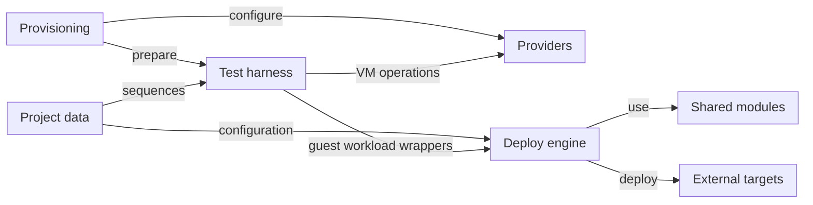

# Context and components

This view locates the seven source-backed system boundaries expanded in the component breakdown.

The [canonical architecture](../architecture.md) defines the capabilities and
deployment phases; this page maps their implementation boundaries rather than
restating that design. Arrows mean a dependency, invocation, or supplied input,
not a network connection; [deployment](06-deployment.md) shows placement.

```mermaid
flowchart LR
    subgraph install["Provisioning"]
    end
    subgraph automation["Deploy engine"]
    end
    subgraph test["Test harness"]
    end
    subgraph host["Providers"]
    end
    subgraph yuruna-project["Project data"]
    end
    subgraph automation-shared["Shared modules"]
    end
    subgraph global-resources["External targets"]
    end
    install -->|configure| host
    install -->|prepare| test
    yuruna-project -->|configuration| automation
    yuruna-project -->|sequences| test
    test -->|VM operations| host
    test -->|guest workload wrappers| automation
    automation -->|use| automation-shared
    automation -->|deploy| global-resources
```

Each subgraph is an empty placeholder rendered as one boundary box: seven boxes
total, with no nested representative boxes. Its actual children are expanded
under the same name in [Component breakdown](02-component-breakdown.md).

| Boundary | Source anchors and scope |
| --- | --- |
| Provisioning | [install/setup.ps1](../../install/setup.ps1) orchestrates host configuration, storage and service-VM bring-up after the platform installers. |
| Deploy engine | [Set-Resource.ps1](../../automation/Set-Resource.ps1), [Set-Component.ps1](../../automation/Set-Component.ps1), and [Set-Workload.ps1](../../automation/Set-Workload.ps1) call the corresponding `Yuruna.*` modules. |
| Test harness | [Start-TestRunner.ps1](../../test/Start-TestRunner.ps1), [Test.Prelude.psm1](../../test/modules/Test.Prelude.psm1), [Test.SequenceRunner.psm1](../../test/modules/Test.SequenceRunner.psm1), [test/service](../../test/service), and [test/extension](../../test/extension) own execution and its supporting services. |
| Providers | [Yuruna.Host.Contract.psm1](../../host/Yuruna.Host.Contract.psm1), [host](../../host), and [guest](../../guest) implement VM operations, installation adapters and guest scripts. |
| Project data | [example](https://github.com/alissonsol/yuruna-project/tree/main/example), [template](https://github.com/alissonsol/yuruna-project/tree/main/template), and [test/test.runner.yml](https://github.com/alissonsol/yuruna-project/blob/main/test/test.runner.yml) supply application assets and executable test definitions. |
| Shared modules | [Yuruna.Common.psm1](../../automation/Yuruna.Common.psm1), [automation](../../automation), [host/modules](../../host/modules), [test/modules](../../test/modules), [globalization](../../globalization), and [tools](../../tools) provide reusable runtime implementation and developer tooling, not another service boundary. |
| External targets | [global/resources](../../global/resources), [Yuruna.Component.Registry.psm1](../../automation/Yuruna.Component.Registry.psm1), and [Yuruna.Workload.psm1](../../automation/Yuruna.Workload.psm1) define the actual cloud, registry and cluster interactions. |

Directories do not partition the system one-to-one. `automation/` contains both
phase implementations and shared helpers; `test/extension/` includes daemons
running in service VMs; and `host/*/guest.*/` installs a guest while `guest/`
contains scripts executed inside it. The runner's `project/` checkout is runtime
input, refreshed from the configured repository, not the framework's tracked
project examples. The website's
[guest workload wrapper](https://github.com/alissonsol/yuruna-project/blob/main/example/website/test/ubuntu.server.26/ubuntu.server.26.workload.k8s.website.sh)
is a concrete bridge from test execution to the deploy engine.

The checked-in resource templates and website configurations cover `localhost`,
`aws`, and `azure`. [global/config/gcp](../../global/config/gcp) is not a GCP
resource implementation, so GCP is excluded from the implemented target set.
Developer checks in [tools](../../tools), including catalog generation and test
suite launchers, support these boundaries; they are not another runtime service.

---

Back to [Architecture](../architecture.md) · [Design overview](README.md)
