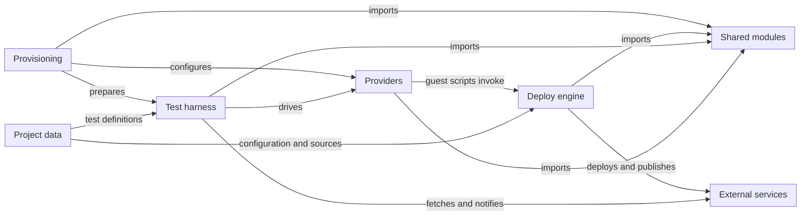

# Context and components

This view locates seven system boundaries and the dependencies expanded in the component breakdown.

Read the [canonical architecture](../architecture.md) for the capabilities and
deployment model. These are code ownership boundaries, not seven processes or
seven directories.

```mermaid
flowchart LR
    subgraph install["Provisioning"]
    end
    subgraph automation["Deploy engine"]
    end
    subgraph test["Test harness"]
    end
    subgraph host["Providers"]
    end
    subgraph yuruna-project["Project data"]
    end
    subgraph yuruna-common-psm1["Shared modules"]
    end
    subgraph global-resources["External services"]
    end
    install -->|prepares| test
    install -->|configures| host
    test -->|drives| host
    host -->|guest scripts invoke| automation
    yuruna-project -->|configuration and sources| automation
    yuruna-project -->|test definitions| test
    install -->|imports| yuruna-common-psm1
    automation -->|imports| yuruna-common-psm1
    test -->|imports| yuruna-common-psm1
    host -->|imports| yuruna-common-psm1
    automation -->|deploys and publishes| global-resources
    test -->|fetches and notifies| global-resources
```

Each empty subgraph is an L1 placeholder; the matching section of
[02 Component breakdown](02-component-breakdown.md) expands it. The seven
boundaries group these source artifacts:

| Boundary | Sources and scope |
| --- | --- |
| Provisioning | [install/](../../install/), [install/setup.ps1](../../install/setup.ps1), [Yuruna.HostSetup.psm1](../../automation/Yuruna.HostSetup.psm1), [test/lab/](../../test/lab/), and service launchers in [test/service/](../../test/service/). |
| Deploy engine | [Set-Resource.ps1](../../automation/Set-Resource.ps1), [Set-Component.ps1](../../automation/Set-Component.ps1), [Set-Workload.ps1](../../automation/Set-Workload.ps1), their phase modules, validators, and cleanup entry point. |
| Test harness | [Start-TestRunner.ps1](../../test/Start-TestRunner.ps1), [test/modules/](../../test/modules/), [test/sequences/](../../test/sequences/), [test/status/](../../test/status/), [test/pool/](../../test/pool/), and [test/extension/](../../test/extension/). |
| Providers | [host/](../../host/), its shared [contract](../../host/Yuruna.Host.Contract.psm1) and [modules](../../host/modules/), plus [guest/](../../guest/) scripts. |
| Project data | The sibling [yuruna-project repository](https://github.com/alissonsol/yuruna-project): [example/](https://github.com/alissonsol/yuruna-project/tree/main/example), [template/](https://github.com/alissonsol/yuruna-project/tree/main/template), [book/](https://github.com/alissonsol/yuruna-project/tree/main/book), and [test/test.runner.yml](https://github.com/alissonsol/yuruna-project/blob/main/test/test.runner.yml). |
| Shared modules | Cross-cutting [automation/](../../automation/) modules, [global/](../../global/) templates, [globalization/](../../globalization/), and supporting [tools/](../../tools/). |
| External services | Actual integration points in [global/resources/](../../global/resources/), [Yuruna.CredentialProvider.psm1](../../automation/Yuruna.CredentialProvider.psm1), [Yuruna.GitHubSource.psm1](../../automation/Yuruna.GitHubSource.psm1), [Yuruna.HostDownload.psm1](../../host/modules/Yuruna.HostDownload.psm1), and [notification/](../../test/extension/notification/). |

The deploy engine and shared modules both occupy `automation/`; installer and
runner code also import that directory. The harness owns service implementations,
while provisioning owns their launch. Guest scripts run inside VMs; the host
drivers execute on hypervisor hosts. The runner refreshes its local `project/`
checkout from `repositories.projectUrl`; that checkout is runtime input, not a
second implementation of the harness.

The harness boundary includes the implemented host-refresh control path:
[Invoke-HostRefresh.ps1](../../test/lab/Invoke-HostRefresh.ps1),
[Test.HostRefresh](../../test/modules/Test.HostRefresh.psm1), and
[Test.HostRefreshIntent](../../test/modules/Test.HostRefreshIntent.psm1).
Refresh coordinates the existing runner and provider within the harness boundary.
The Hyper-V and KVM providers implement the bounded virtualization probe and
start-if-stopped operations in the host contract. The manual refresh path
and automatic trigger have separate admission rules;
[Lifecycle](04-lifecycle-state.md) identifies the enabled repair rungs and
the automatic policy qualification.

GCP registry authentication exists in the credential-provider registry, but
there is no `global/resources/gcp/` or example `config/gcp/` deployment here.
GCP deployment remains planned, as stated by the architecture; it has no active
edge in these diagrams.

The external-services boundary describes implemented integration code, not
deployment certification. For example, the checked-in AWS EKS template has
separate Kubernetes API and workload-ingress outputs; those interfaces are
expanded in [Deployment](06-deployment.md#aws-application-ingress).

---

[Architecture](../architecture.md) | [Design overview](README.md)
