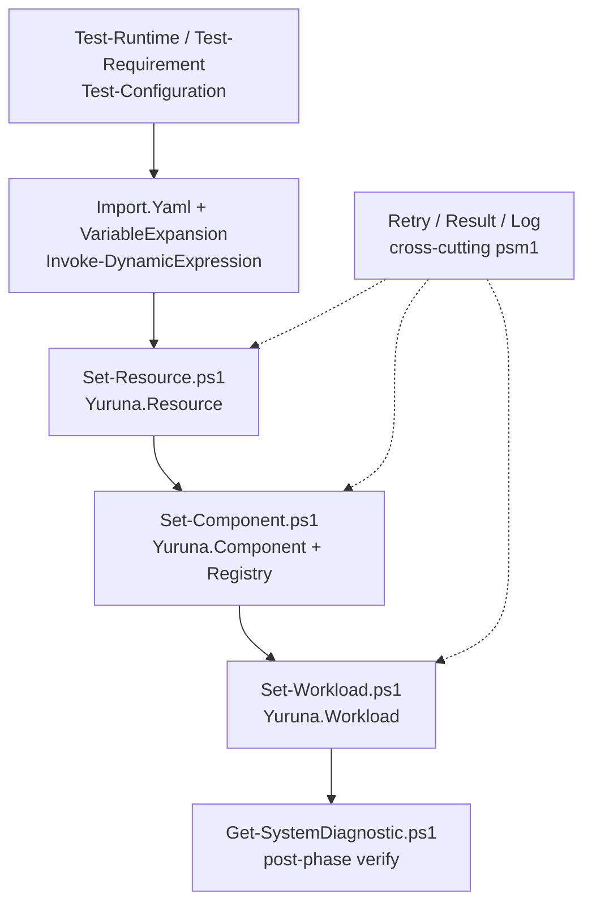
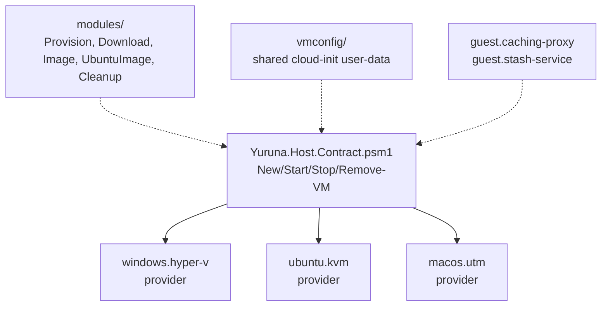
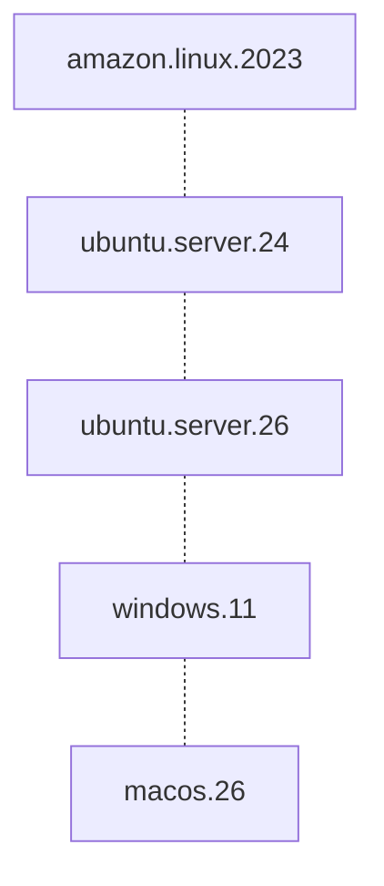
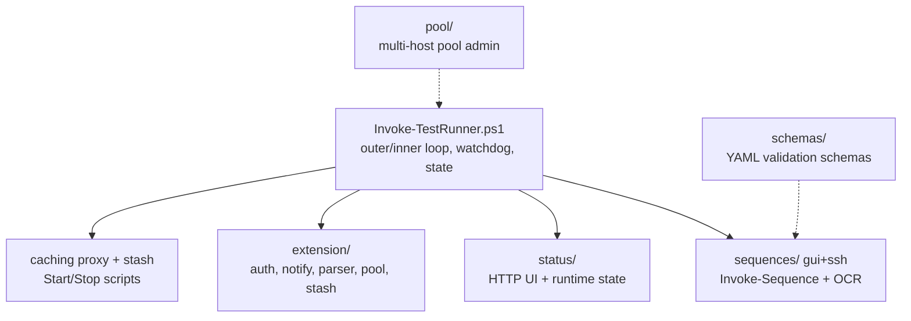
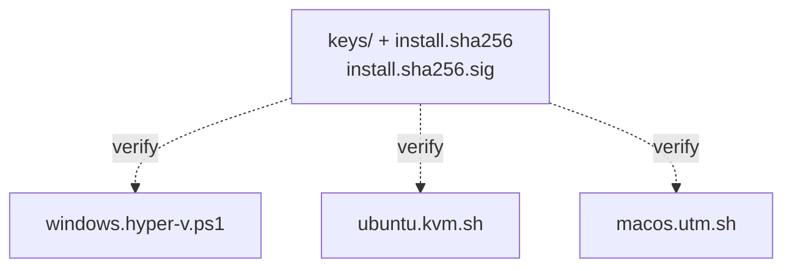
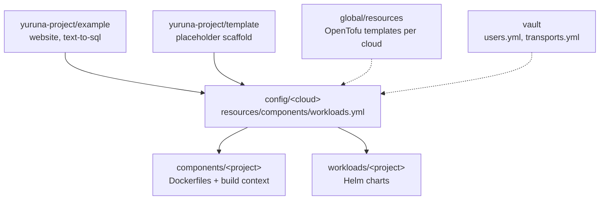
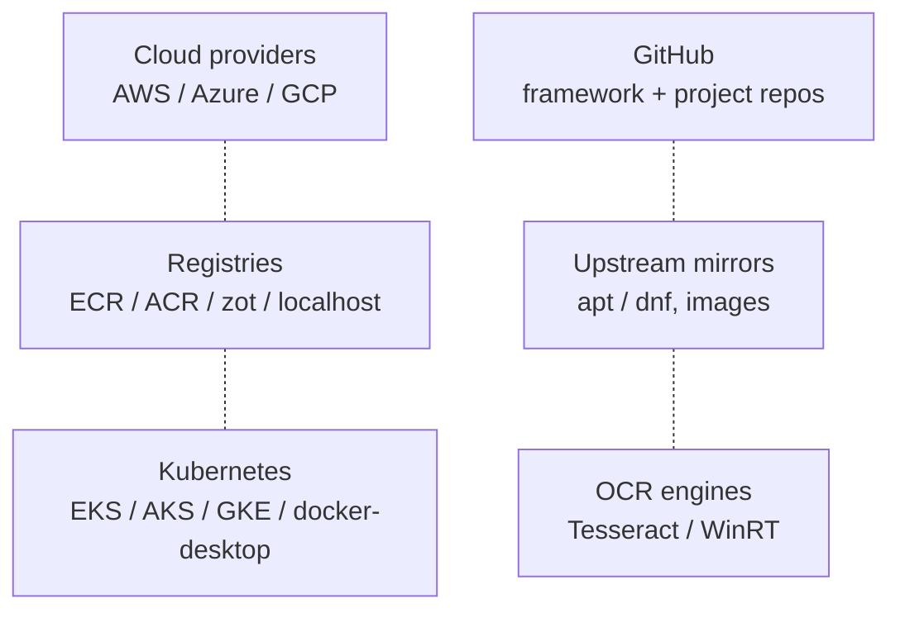

# Level-2 component breakdown

> One sentence: each Level-1 component expanded into at most seven real
> child scripts/modules/directories.

See [Design overview](00-index.md) · [Level-1 components](01-context-and-components.md) · [Yuruna Architecture](../architecture.md).

## Deploy Engine — `automation/`

## Host Provisioning — `host/`

`infra-guests` (`guest.caching-proxy`, `guest.stash-service`) is a logical
aggregate: these directories live nested under each provider
(`windows.hyper-v/`, `ubuntu.kvm/`, `macos.utm/`), not at the `host/` root
(see the [≤7 rule](00-index.md#the-7-rule-grouping-decisions)).

## Guest Workloads — `guest/`

Each holds the in-guest workload scripts fetched and run via
`automation/fetch-and-execute.sh` once the guest is booted.

## Test Harness — `test/`

## Installers — `install/`

## Project & Global Data — `yuruna-project/`, `global/`

## External Services

---

Copyright (c) 2019-2026 by Alisson Sol et al.

Last review: 2026.07.03
