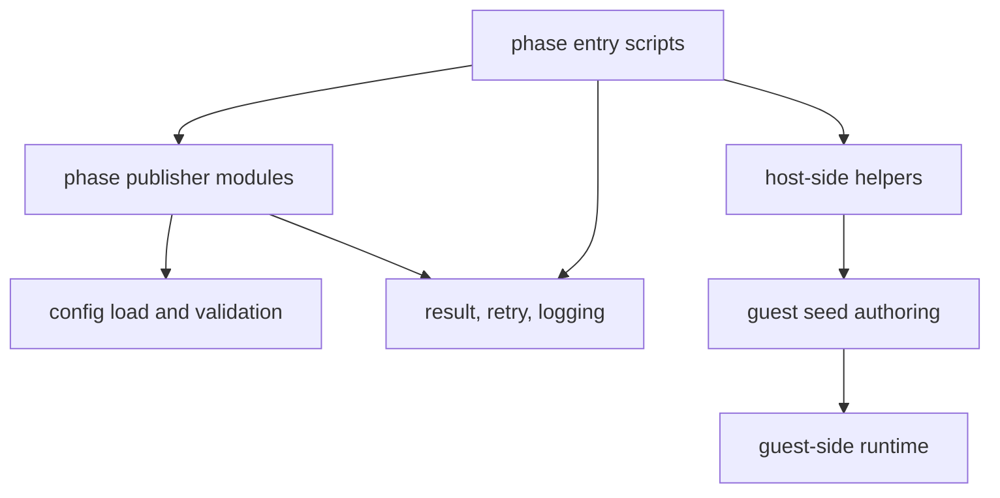
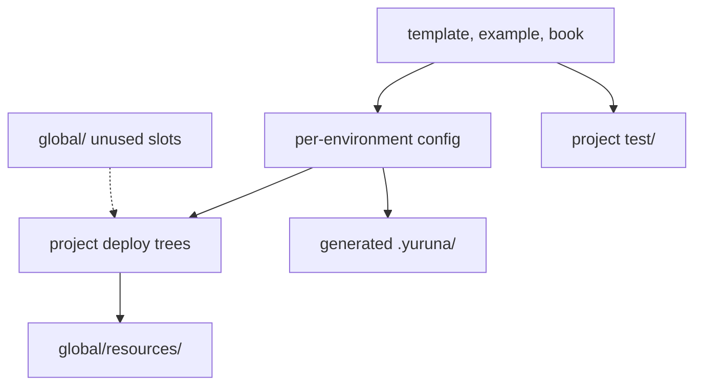
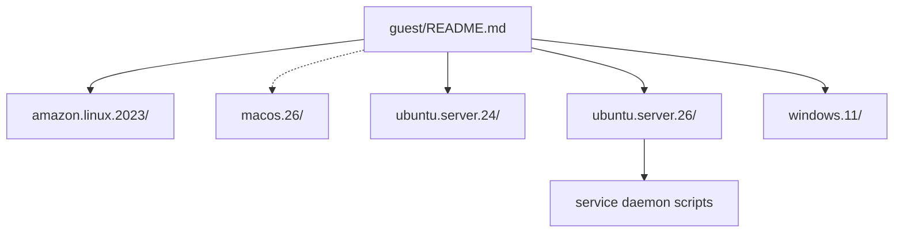
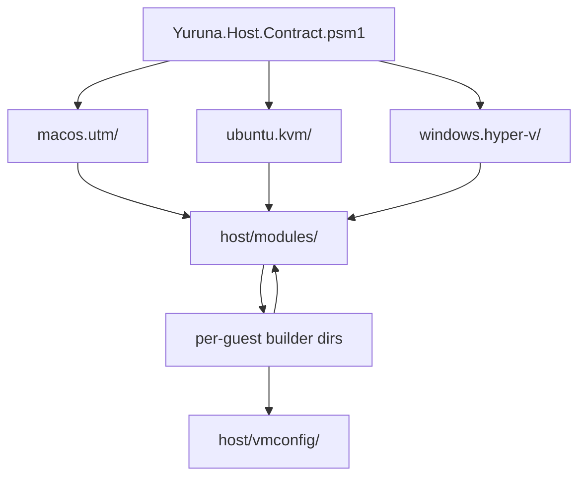
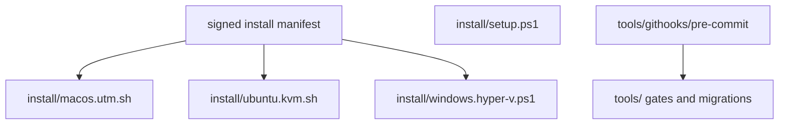
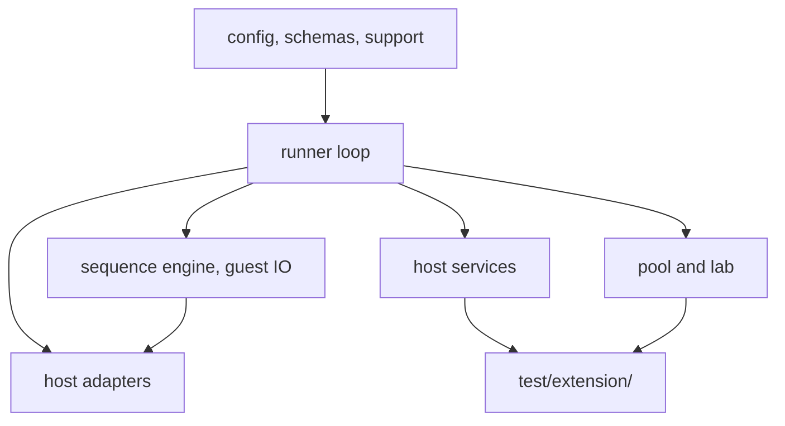
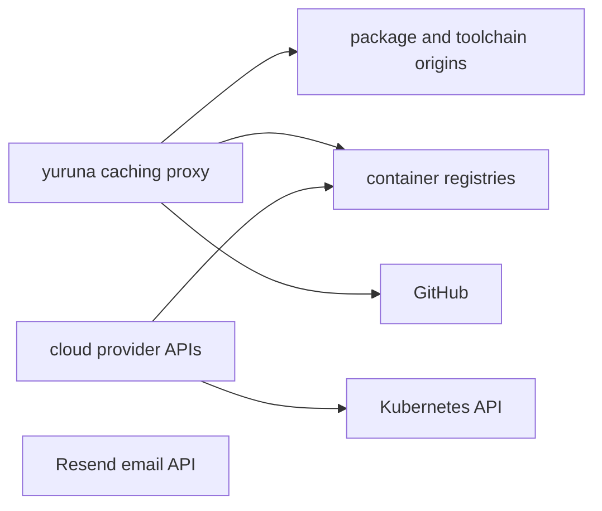

# Component breakdown

> One sentence: each of the seven top-level blocks opened into at most seven
> real children, with the exact file list behind every aggregate box.

See [Design overview](00-index.md) - [Context and components](01-context-and-components.md) -
[Yuruna Architecture](../architecture.md).

Sections follow the block order [doc 1](01-context-and-components.md) declares:
repository directory order, with the block that owns no directory last. Every
diagram holds seven boxes or fewer. Where a directory holds more children than
that, siblings are folded into a named aggregate chosen along a responsibility
boundary, and the fold is named with its member list underneath.

Only `*.psm1`, `*.ps1`, `*.sh` and data files are counted below. The 205
`test/modules/*.Tests.ps1` Pester suites are excluded throughout: they mirror
the modules they cover and are driven as one set by `tools/Invoke-TestSuite.ps1`.

## Deploy Engine -- `automation/`

```mermaid
flowchart TD
    entry-scripts["phase entry scripts"]
    phase-publishers["phase publisher modules"]
    config-load["config load and validation"]
    run-outcome["result, retry, logging"]
    host-helpers["host-side helpers"]
    guest-seed["guest seed authoring"]
    guest-runtime["guest-side runtime"]

    entry-scripts --> phase-publishers
    entry-scripts --> run-outcome
    entry-scripts --> host-helpers
    phase-publishers --> config-load
    phase-publishers --> run-outcome
    host-helpers --> guest-seed
    guest-seed --> guest-runtime
```

`automation/` holds 44 files, so all seven boxes are aggregates. The split is by
who calls whom, not by file extension: the entry scripts are what a deploy is
driven through, the publishers own the tool-invoking phases, and the last box
holds artifacts that never execute on the host at all. Three qualifications the
diagram cannot carry. The probes in `host-helpers` are invoked directly as well,
by the harness and by `test/service/Start-McpServer.ps1`, whose ten MCP tools draw
three entry points from that box and seven from `entry-scripts`
(table at `test/service/Start-McpServer.ps1:158-186`, each shelled out to a child
pwsh at `:133`). That script is also the only place the block's uneven success
semantics are written down (`ConvertTo-McpToolResult`, `:196-260`). `tofu init` is run from
`automation/Yuruna.Retry.psm1:319`, not from the resource publisher, so the
network-facing first step is retried by the same policy as the rest of the run.
And `guest-seed` is the mirror image of "never executes on the host": three
host-side builders whose *output* is what runs in a guest.

**`entry-scripts`** (8) -- `automation/yuruna.ps1` (the single dispatcher over
`requirements / clear / validate / resources / components / workloads`),
`automation/Set-Resource.ps1`, `automation/Set-Component.ps1`,
`automation/Set-Workload.ps1`, `automation/Invoke-Clear.ps1`,
`automation/Test-Configuration.ps1`, `automation/Test-Requirement.ps1`,
`automation/Test-Runtime.ps1`. The three `Set-*` scripts share a prelude -- set
the log level, resolve the root set, evict every `Yuruna.*` module, import the one
phase module -- and a tail -- transcript, one `Publish-*List` call, then
`Complete-YurunaRun`, which exits 1 on a failure manifest -- which is why they are
one box and not three. `Set-Workload.ps1:66-77` is the one variation: it runs
`Test-Runtime.ps1` first and reads the verdict as the LAST pipeline object,
because that script streams tables on the healthy path. `Test-Requirement.ps1` is
also this block's machine-readable interface to the installers: `-Tool <list>
-WarnOnly` prints one `REQUIREMENT-ISSUE: <text>` line per problem and exits 0,
because an installer wants the operator told rather than blocked.

**`phase-publishers`** (8) -- `automation/Yuruna.Resource.psm1`,
`automation/Yuruna.Component.psm1`,
`automation/Yuruna.Component.Registry.psm1`,
`automation/Yuruna.CredentialProvider.psm1`,
`automation/Yuruna.Workload.psm1`, `automation/Yuruna.Clear.psm1`,
`automation/Yuruna.Requirement.psm1` and the version table
`automation/Yuruna.Requirement.yml`. The registry bridge and the credential
provider are folded in here because they supply the component pipeline's
`registryLogin` phase, which runs between `tag` and `push`
(`automation/Yuruna.Component.psm1:218`, `:230`, `:242`);
`Yuruna.CredentialProvider.psm1` has a second consumer outside this block, in the
harness's own credential self-heal (`test/modules/Test.CredentialProvider.psm1:41`).
The requirement pair is in this box as the phase precondition rather than as a
publisher -- `Confirm-RequirementList` publishes nothing. It checks the 20 tool
rows in `Yuruna.Requirement.yml` for MISSING or BELOW, narrowable with `-Tool`,
and adds a `Runtime capabilities` section holding one row today, AES-GCM, because
a runtime that meets the PowerShell floor can still lack the algorithm every
Lab-token enrollment needs (`automation/Yuruna.Requirement.psm1:145-155`).
`automation/Check-DependencyVersion.ps1:75` parses the same table so it can ask
upstream what is newer.

**`config-load`** (5) -- `automation/Import.Yaml.psm1`,
`automation/Yuruna.Validation.psm1`,
`automation/Yuruna.VariableExpansion.psm1`,
`automation/Yuruna.DeploymentKind.psm1`,
`automation/Invoke-DynamicExpression.psm1`. Folded together because each one
turns declarative YAML into something executable: parse, gate, expand into
environment variables, resolve the deployment kind, then evaluate.

**`run-outcome`** (4) -- `automation/Yuruna.Result.psm1`,
`automation/Yuruna.Retry.psm1`, `automation/Yuruna.LogLevel.psm1`,
`automation/Yuruna.Log.psm1`. `Yuruna.Result.psm1` and `Yuruna.Retry.psm1` decide
what a run reports and how often a step is reattempted, and `Yuruna.LogLevel.psm1`
is the prelude every entry point imports. `Yuruna.Retry.psm1` is also imported
from `host/modules/` and `test/modules/`, so it is a shared policy rather than a
deploy-only detail -- and it is only the host half of one: its guest twin is
`automation/yuruna-retry.sh` in `guest-runtime`, honouring the same
`YURUNA_RETRY_MAX_ATTEMPTS` and `YURUNA_RETRY_DELAY_SECONDS`.
`Yuruna.Log.psm1` sits in this directory but on no deploy path at all -- nothing
in `automation/` imports it; it is a `Write-*` tee the test runner picks up
(`test/modules/Invoke-TestRunnerInnerLoop.ps1:303`).

**`host-helpers`** (7) -- `automation/Yuruna.Common.psm1` (the 42-function
grab bag of address, memory, MAC and sudo helpers),
`automation/Yuruna.HostRedirect.psm1`, `automation/Yuruna.HostSetup.psm1`,
`automation/Set-HostAlias.ps1`, `automation/Get-SystemDiagnostic.ps1`,
`automation/Check-DependencyVersion.ps1`, `automation/context-copy.ps1`. Five of
these are off the three-phase deploy path and are imported from `host/**`,
`install/setup.ps1:2322` and `test/modules/`. `Yuruna.Common.psm1` is one of the
two exceptions: all three publishers import it (`Yuruna.Resource.psm1:29`,
`Yuruna.Component.psm1:26`, `Yuruna.Workload.psm1:26`), which is why the
42-function grab bag cannot be moved out of this block. `context-copy.ps1` is the
one file here with no caller anywhere in either repository -- a hand-run
kube-context repair tool; the `localhost/context-copy` OpenTofu template ships its
own `context-copy.sh`, and that is what the resource phase runs.

**`guest-seed`** (5) -- `automation/Yuruna.CloudInitTemplate.psm1`,
`automation/Yuruna.GuestSeed.psm1`, `automation/Yuruna.GitHubSource.psm1`,
`automation/windows-guest-bootstrap.ps1`,
`automation/yuruna-host-locate.ps1`. Authored on the host, consumed in a guest.
`Yuruna.CloudInitTemplate.psm1` merges a base seed with an overlay and fills every
`*_PLACEHOLDER`, throwing on any left unresolved; `Yuruna.GuestSeed.psm1` builds
the apt-proxy block and the Windows first-logon bootstrap; `Yuruna.GitHubSource.psm1`
merges nothing -- it resolves the repository slug, commit and token that the seed
bakes in as the guest's GitHub fallback route. The Windows pair is separate work
again: `New-WindowsGuestBootstrap` (`automation/Yuruna.GuestSeed.psm1:140`) base64s
`yuruna-host-locate.ps1` into `windows-guest-bootstrap.ps1` and hands back one
UTF-16LE `-EncodedCommand` blob for the three `guest.windows.11` builders.

**`guest-runtime`** (7) -- `automation/fetch-and-execute.sh`,
`automation/yuruna-run.sh`, `automation/yuruna-retry.sh`,
`automation/yuruna-network.sh`, `automation/yuruna-host-locate.sh`,
`automation/yuruna-versions.sh`, `automation/Test-YurunaHost.ps1`. Five of the
seven arrive by cloud-init: `Get-YurunaGuestScriptBase64`
(`automation/Yuruna.CloudInitTemplate.psm1:166`) base64s `yuruna-retry.sh`,
`yuruna-versions.sh`, `fetch-and-execute.sh`, `yuruna-network.sh` and
`yuruna-host-locate.sh` into `/usr/local/lib/yuruna/`, and throws if any is
missing. `yuruna-run.sh` deliberately does not: the harness base64s it into the
ssh command line and pipes it to `bash -s --` (`test/modules/Test.Ssh.psm1:963`),
so the supervisor always matches this harness rather than the oldest snapshot.
`Test-YurunaHost.ps1` runs from a repo checkout inside the guest.
`automation/yuruna-retry.sh` is the guest half of the retry policy whose host half
is `Yuruna.Retry.psm1`, and `automation/yuruna-versions.sh` is the version pin
manifest that `automation/Check-DependencyVersion.ps1` reads back on the host.

## Project & Global Data -- `global/`, `yuruna-project/`

```mermaid
flowchart TD
    global-resources["global/resources/"]
    global-placeholders["global/ unused slots"]
    shipped-projects["template, example, book"]
    project-config["per-environment config"]
    project-trees["project deploy trees"]
    project-test["project test/"]
    project-work["generated .yuruna/"]

    shipped-projects --> project-config
    shipped-projects --> project-test
    project-config --> project-trees
    project-config --> project-work
    project-trees --> global-resources
    global-placeholders -.-> project-trees
    %% planned: no global fallback is implemented for components or workloads
```

Two roots share this block because they are the same contract seen from both
sides: `global/` is what the framework ships as a fallback, `yuruna-project/` is
what an operator supplies. Only the resource phase actually has a fallback.

A third root is not drawn, because a box for it would take the diagram to eight:
`<RepoRoot>/project/` is where every path below is actually read from. It is
gitignored (`.gitignore:376`) and re-created each cycle by `Update-ProjectClone`
(`test/modules/Test.HostGit.psm1:785`), which deletes the tree before cloning
`repositories.projectUrl` and refuses any target not strictly under the repo root.
So the shape -- `config/<cloud>/`, `components/`, `workloads/`, `test/` -- is the
contract, and `yuruna-project` is one instance of it; an operator pointing
`projectUrl` elsewhere gets their own tree in the same slot.

**`global-resources`** (10 template directories) --
`global/resources/aws/eks-cluster/`, `global/resources/aws/registry/`,
`global/resources/azure/aks-cluster/`, `global/resources/azure/postgresql/`,
`global/resources/azure/registry/`, `global/resources/azure/resource-group/`,
`global/resources/azure/storage-share/`, `global/resources/azure/vm-linux/`,
`global/resources/localhost/context-copy/`,
`global/resources/localhost/registry/`. Folded into one box because they are
interchangeable at the same lookup point: a `template:` value in
`resources.yml` resolves against the project's own `resources/` first and this
tree second. Interchangeable at the lookup point is not the same as usable:
`Set-Resource` requires every resource to declare at least one tofu `output`
block and throws when `tofu output -json` comes back empty
(`automation/Yuruna.Resource.psm1:309`), and two of the ten -- `aws/eks-cluster/`
and `azure/vm-linux/` -- declare none. There is no `global/resources/gcp/`; gcp
appears in prose only.

**`global-placeholders`** (3) -- `global/components/placeholder`,
`global/workloads/placeholder`, `global/config/gcp/gcp-access-key.json`. The
dashed edge records that the slots exist but nothing reads them:
`Yuruna.Component.psm1` resolves a build folder only under the project root, and
`Yuruna.Workload.psm1` resolves a chart only under the project root. The third is
the sharpest: `global/config/gcp/gcp-access-key.json` is tracked and NOT
gitignored, and its own first line tells the operator to replace it with a
service-account key downloaded from GCP -- a tracked slot that becomes a committed
private key the moment it is used. Nothing reads it, and there is no
`global/resources/gcp/` for it to serve.

**`shipped-projects`** (5) -- `yuruna-project/template/` (the scaffold:
`config/localhost/` with `TO-SET` markers in place of a real component, plus two
empty `yrn42template/` slots -- a bare `placeholder` under `components/` and an
`echoParams.ps1` under `workloads/`, neither wired to the config nor buildable
as-is), `yuruna-project/example/website/`,
`yuruna-project/example/text-to-sql/`, `yuruna-project/example/nested.host/`,
`yuruna-project/book/test/`. Folded because they share one root shape, not
because they are interchangeable: a project root is whatever holds
`config/<cloud>/`, and only `template/`, `example/website/` and
`example/text-to-sql/` do. `Resolve-YurunaRootSet`
(`automation/Yuruna.LogLevel.psm1:102-106`) fails the run when that directory is
missing, so `example/nested.host/` (a README and one sequence) and `book/` (four
sequences) can never be passed as `project_root`; they contribute only to
`project-test`.

**`project-config`** -- one directory per target environment, holding
`resources.yml`, `components.yml`, `workloads.yml`, the generated
`resources.output.yml`, and the project vault: plaintext `*.txt` files in
`config/<cloud>/secrets/`, plus a peer `config/secrets/` shared across cloud
subfolders that only the workload path reads. `Invoke-SecretFolderValidation`
(`automation/Yuruna.Validation.psm1:72-101`) marks every vault file
`git update-index --assume-unchanged` as it validates; an empty file is
informational for resources (`:157-159`) and blocking for workloads
(`:305-313`). No shipped project tree contains a `secrets/` directory -- it is a
slot the operator fills. Live instances:
`yuruna-project/example/website/config/aws/`,
`yuruna-project/example/website/config/azure/`,
`yuruna-project/example/website/config/localhost/`,
`yuruna-project/example/text-to-sql/config/localhost/`,
`yuruna-project/template/config/localhost/`.

**`project-trees`** (3 per project) -- `resources/` (the project-local first
tier of the template lookup: present in all three roots but holding only a
`placeholder`, so today every `template:` value falls through to
`global/resources/`), `components/` (a build folder per component, each holding a
Dockerfile), `workloads/` (a helm chart per chart deployment). Concrete
instances include
`yuruna-project/example/website/components/frontend/website/` and
`yuruna-project/example/website/workloads/frontend/website/`.

**`project-test`** -- `<RepoRoot>/project/test/test.runner.yml` is the cycle
plan. `Get-CycleConfigPath` (`test/modules/Test.SequencePlanner.psm1:56`) reads
that one path and nothing else, so the tracked
`yuruna-project/test/test.runner.yml` becomes the plan only once it is cloned
into the `project/` slot. The plan's names then resolve project-first and
framework-second -- `Resolve-SequencePath`
(`test/modules/Test.SequenceResolve.psm1:273-286`) probes every `test/` directory
under the clone -- `project/test/` included -- before `test/sequences/`, so a project file shadows a framework
file of the same name, and a name with no project file at all (the shipped plan's
`workload.guest.windows.11`) resolves entirely in the framework. Project
sequences also chain back the other way: `workload.guest.ubuntu.server.24.k8s.website.yml`
names the framework's `workload.guest.ubuntu.server.24` as its prerequisite. Two
same-named files under different project `test/` directories is a `PlannerFatal`
(`Find-ProjectFlatSequenceFile`, `:193-208`). The project `test/` directories
are:
`yuruna-project/example/website/test/`,
`yuruna-project/example/text-to-sql/test/`,
`yuruna-project/example/nested.host/test/`, `yuruna-project/book/test/`. Folded
into one box because the resolver treats them as one search set: every `test/`
directory found under the cloned project shadows the framework's
`test/sequences/` by file name.

**`project-work`** -- the generated `.yuruna/` tree under a project root:
`.yuruna/<cloud>/` first and one subtree per phase second
(`resources/<resourceName>/`, `components/`, `workloads/<context>/<installName>/`),
plus a cloud-independent `.yuruna/tofu-plugin-cache/` that `Set-Resource` creates
and exports as `TF_PLUGIN_CACHE_DIR` when the operator has not set one
(`automation/Yuruna.Resource.psm1:353-357`). It holds the timestamped input
backups, the staged tofu work folders, and the `*.stderr.log` / `*.rc` sidecar
pairs. It is a box rather than a
footnote because it is the only place a post-mortem finds the tool output;
`automation/Get-SystemDiagnostic.ps1` scans for it with `-Force` precisely
because the dot-prefixed name hides it from an ordinary walk.

## Guest Workloads -- `guest/`

```mermaid
flowchart TD
    guest-readme["guest/README.md"]
    amazon-linux-2023["amazon.linux.2023/"]
    macos-26["macos.26/"]
    ubuntu-server-24["ubuntu.server.24/"]
    ubuntu-server-26["ubuntu.server.26/"]
    windows-11["windows.11/"]
    service-daemons["service daemon scripts"]

    guest-readme --> amazon-linux-2023
    guest-readme --> ubuntu-server-24
    guest-readme --> ubuntu-server-26
    guest-readme --> windows-11
    guest-readme -.-> macos-26
    %% manual: New-VM.ps1 restores the IPSW, first boot is Setup Assistant
    ubuntu-server-26 --> service-daemons
```

Five of the seven boxes are real directories -- `amazon.linux.2023/`,
`macos.26/`, `ubuntu.server.24/`, `ubuntu.server.26/`, `windows.11/`. The other
two are a single file (`guest/README.md`, the family index) and the diagram's one
fold, the three `ubuntu.server.26` service-daemon scripts. The dashed edge to
`macos.26/` records that the family is manual rather than unbuilt:
`host/macos.utm/guest.macos.26/New-VM.ps1` creates the VM and stops at Setup
Assistant, nothing installs `automation/fetch-and-execute.sh` on a macOS guest,
and there is no `test/sequences/start.guest.macos.26.yml`.

| Box | Files |
|---|---|
| `amazon.linux.2023/` | `guest/amazon.linux.2023/amazon.linux.2023.update.sh`, `.code.sh`, `.n8n.sh`, `.openclaw.sh`, `.postgresql.sh` |
| `macos.26/` | `guest/macos.26/macos.26.update.sh` |
| `ubuntu.server.24/` | `guest/ubuntu.server.24/ubuntu.server.24.update.sh`, `.code.sh`, `.k8s.sh`, `.n8n.sh`, `.openclaw.sh`, `.postgresql.sh` |
| `ubuntu.server.26/` | `guest/ubuntu.server.26/ubuntu.server.26.update.sh`, `.code.sh`, `.k8s.sh`, `.n8n.sh`, `.openclaw.sh`, `.postgresql.sh` |
| `windows.11/` | `guest/windows.11/windows.11.update.ps1`, `.code.ps1`, `.k8s.ps1` |
| `service-daemons` | `guest/ubuntu.server.26/ubuntu.server.26.stash-service.sh`, `.download-agent-service.sh`, `.pool-control-service.sh` |

Each family box also holds a `README.md` -- six in all counting `guest/README.md`,
which is the other 6 of the block's 30 tracked files. The per-family README is the
workload index: `guest/ubuntu.server.26/README.md` lists all nine, the three
service builders included.

**`service-daemons`** is split out of `ubuntu.server.26/` rather than left in it
because the three scripts do a different job -- each compiles a Go daemon out of
`test/extension/` and installs it under systemd -- and because they carry a second
entry point the other six do not: cloud-init runs them by absolute path on first
boot. Only `stash-service` gets its own bring-up unit
(`host/vmconfig/stash-service.base.user-data:202`, `yuruna-stash-bringup.service`,
re-entrant through `ConditionPathExists`); `pool-control-service.base.user-data:186`
and `download-agent-service.base.user-data:342` call `bash <path>` straight from
`runcmd:`.

The three are not interchangeable either. `stash-service` masks the OS sshd and
binds `:22` as well as `:80`
(`guest/ubuntu.server.26/ubuntu.server.26.stash-service.sh:238-248`); the other two
bind `:80` only. All three take the low-port grant from
`AmbientCapabilities=CAP_NET_BIND_SERVICE` in the unit, with the `setcap` call as a
fallback for a non-systemd launch. Only `stash-service` builds against a committed
`go.sum`; the other two modules have none -- standard library plus the staged
`extension-sdk` -- so `go mod tidy` must not run there.

The other six `ubuntu.server.26` scripts are fetched, digest-checked and run by
`fetch-and-execute.sh`, typed into a console or sent over SSH. Only `update` and
`code` have a sequence today
(`test/sequences/workload.guest.ubuntu.server.26.yml:42`,
`start.guest.ubuntu.server.26.yml`); `k8s`, `n8n`, `openclaw` and `postgresql` are
operator-run. They install packages, but not only: `update.sh:90` repairs the
caching-proxy CA through `yuruna_ca_selfheal`, and `k8s.sh:103-112` reads
`YURUNA_CACHING_PROXY_SERVICE_IP` out of `/etc/yuruna/host.env` and points Docker
at `http://<proxy>:5000` as a registry mirror -- the block's one live runtime
coupling to the lab.

`windows.11` is reached by a different one-liner again: an elevated
`irm .../guest/windows.11/windows.11.<workload>.ps1 | iex` against
`raw.githubusercontent.com` (`guest/windows.11/README.md:18`), with no local
fetcher and no digest gate. Its two sequences drive no guest script --
`test/sequences/workload.guest.windows.11.yml` carries an empty `workload:`.

The workload names repeat across families, which is what makes the family
directories the right boxes: `update` exists in all five, `code` in four (all
but `macos.26`), `k8s` in three (`ubuntu.server.24`, `ubuntu.server.26`,
`windows.11`), and `n8n`, `openclaw`, `postgresql` in the three Linux families
other than `macos.26`. The `ubuntu.server.24` and `ubuntu.server.26` copies of
`update`, `code`, `n8n`, `openclaw` and `postgresql` are byte-identical; only
the `k8s` pair differs, and the 24.04 copy is the superset -- it defines a
`assert_tool_runnable` helper that gates the Helm and mkcert installs, which the
26.04 copy lacks.

## Host Provisioning -- `host/`

```mermaid
flowchart TD
    host-contract["Yuruna.Host.Contract.psm1"]
    macos-utm["macos.utm/"]
    host-modules["host/modules/"]
    ubuntu-kvm["ubuntu.kvm/"]
    vmconfig["host/vmconfig/"]
    windows-hyper-v["windows.hyper-v/"]
    guest-builders["per-guest builder dirs"]

    host-contract --> macos-utm
    host-contract --> ubuntu-kvm
    host-contract --> windows-hyper-v
    macos-utm --> host-modules
    ubuntu-kvm --> host-modules
    windows-hyper-v --> host-modules
    host-modules --> guest-builders
    guest-builders --> host-modules
    guest-builders --> vmconfig
```

Boxes are declared in directory order. Three of them are literal files or
directories; the three provider boxes and the builder box are aggregates.

**`host-contract`** -- `host/Yuruna.Host.Contract.psm1`, a single file holding
the 38-verb driver contract and the coverage assertion each driver calls at the
bottom of its own module body. It is its own box because it is the interface
every other box in this section is measured against.

**`macos.utm/`**, **`ubuntu.kvm/`**, **`windows.hyper-v/`** -- one box per
provider. Each folds a driver module plus the four operator scripts that exist
under all three providers by the same names -- the name is the contract, because
`automation/Yuruna.HostRedirect.psm1:136` resolves `host/<host type>/<name>.ps1`
by name and runs it in a child pwsh, so the operator types one command on every
platform. Their parameters and exit codes are per-script, not shared
(`Enable-TestAutomation.ps1` exits 0 when everything is in place and 2 when an
operator is still needed; `Sync-HostConfiguration.ps1` never calls `exit`):
`host/<provider>/modules/Yuruna.Host.psm1`,
`host/<provider>/Enable-TestAutomation.ps1`,
`host/<provider>/Disable-TestAutomation.ps1`,
`host/<provider>/Sync-HostConfiguration.ps1`,
`host/<provider>/Remove-OrphanedVMFiles.ps1`. Provider-only extras ride in the
same box: `host/ubuntu.kvm/modules/Yuruna.GuestRail.psm1` (a second, stable
libvirt-NAT address per guest -- derived and unit-tested, but imported by no
production file; its own header records that it keys on the transient VM name and
would break VM creation on the second guest of a cycle) and
`host/ubuntu.kvm/yuruna-bridge-pin.sudoers`;
`host/macos.utm/Remove-StaleDhcpLease.ps1` and
`host/macos.utm/brew-doctor-fix.sh`.
`host/macos.utm/Start-CachingProxyServiceForwarder.ps1` sits in the macOS folder
but is not a macOS-only file: it is a pure-PowerShell TCP forwarder the Hyper-V
driver resolves and spawns as well
(`host/windows.hyper-v/modules/Yuruna.Host.psm1:2489`, `:2628`).

The folding is by platform because the platform-touching half has nothing to
hoist: the three drivers implement the same 38 verbs against `Hyper-V\*` cmdlets
plus `netsh` and `pktmon`, against `virsh` plus `nmcli` and `netplan`, and against
`utmctl` plus `qemu-img` and `osascript`. The platform-independent half is already
hoisted -- four contract verbs delegate their bodies to
`host/modules/Yuruna.HostProvision.psm1` in every driver (`New-VM`, `Get-Image`,
`Wait-VMIp`, `Test-CachingProxyServiceAvailable`), and a fifth (`Get-VMIp` through
`Invoke-ResolveVmIp`) in `ubuntu.kvm` alone.

The asymmetry that matters is in the extras rather than the contract: all three
drivers export all 38 verbs, and two of them also arm a DHCP wire capture at
`Start-VM` and drop it beside the sequence output. `Start-`/`Stop-`/`Save-VMDhcpCapture`
runs over `pktmon` on Hyper-V (`host/windows.hyper-v/modules/Yuruna.Host.psm1:3965-4081`)
and over `tcpdump` plus the dnsmasq journal on KVM
(`host/ubuntu.kvm/modules/Yuruna.Host.psm1:3610-3789`). `macos.utm` exports none of
the three, so the single caller (`test/modules/Test.RunnerInnerLoop.psm1:630`)
guards on `Get-Command` and the capture is simply absent there.

**`host-modules`** (7) -- `host/modules/Yuruna.HostProvision.psm1` (the shared
bodies of five contract verbs), `host/modules/Yuruna.HostDownload.psm1` (the
squid download stack), `host/modules/Yuruna.DownloadAgent.psm1` (the host-side
client for the pooled download agent, which deliberately imports nothing),
`host/modules/Yuruna.Image.psm1` (the checksum and signature gateway),
`host/modules/Yuruna.UbuntuImage.psm1` (the live-server ISO pipeline),
`host/modules/Yuruna.VMCleanup.psm1`, and the Pester suite
`host/modules/Yuruna.Image.Tests.ps1`. The pinned Ubuntu signing keys live
beside them at `host/modules/keys/ubuntu-image-signing-keys.asc`. Folded as one
box because they are the hypervisor-independent half of provisioning -- but they
are loaded by two different callers. The three drivers import
`Yuruna.HostDownload`, `Yuruna.DownloadAgent` and `Yuruna.HostProvision` `-Global`
at load (`host/windows.hyper-v/modules/Yuruna.Host.psm1:81`, `:85`, `:88`;
`host/macos.utm/modules/Yuruna.Host.psm1:80`, `:84`, `:87`;
`host/ubuntu.kvm/modules/Yuruna.Host.psm1:102`, `:106`, `:109`) and then
feature-detect the download-agent functions by name. `Yuruna.Image` and `Yuruna.UbuntuImage` are
imported by the per-guest `Get-Image.ps1` / `New-VM.ps1` scripts instead, and
`Yuruna.VMCleanup` only by the three `Remove-OrphanedVMFiles.ps1`.

**`vmconfig`** (31 files) -- six seed families, each with a
`<family>.base.user-data`, a `<family>.meta-data` and one overlay per
hypervisor, plus the single shared `host/vmconfig/guest-dhcp.network-config`.
The families are `amazon.linux.2023`, `caching-proxy-service`,
`download-agent-service`, `pool-control-service`, `stash-service` and
`ubuntu.server`; the overlay suffixes are `.hyperv.overlay.yml`,
`.kvm.overlay.yml` and `.utm.overlay.yml`. They fold into one box because they
share one merge contract: `automation/Yuruna.CloudInitTemplate.psm1` substitutes
overlay sections into base anchors line by line, and an anchor with no matching
overlay section is a hard error in either direction. One family is a different
kind of file from the other five: `host/vmconfig/caching-proxy-service.base.user-data`
is 4,426 lines against 191-452 for the rest, and it is the only seed in the
repository that fetches Go sources out of `test/extension/` and builds daemons at
first boot.

**`guest-builders`** (25 directories) -- `host/<provider>/guest.<name>/`, each
holding a `Get-Image.ps1` and a `New-VM.ps1`. Eight guest names appear under all
three providers -- `guest.amazon.linux.2023`, `guest.caching-proxy-service`,
`guest.download-agent-service`, `guest.pool-control-service`,
`guest.stash-service`, `guest.ubuntu.server.24`, `guest.ubuntu.server.26`,
`guest.windows.11` -- and `host/macos.utm/guest.macos.26/` exists only under
UTM. Folded into one box rather than 25 because they are dispatched
identically: `Invoke-PerGuestNewVm` and `Invoke-GetImage` in
`host/modules/Yuruna.HostProvision.psm1` run each one as a child `pwsh` and map
its exit code to a result hashtable. Only `New-VM.ps1` gets arguments --
`-VMName` always, and `-CachingProxyServiceUrl`, `-Username`, `-Hostname`,
`-MemoryStartupBytes`, `-Cores` only when the caller bound them and the target
script declares them (`host/modules/Yuruna.HostProvision.psm1:84-118`).
`Get-Image.ps1` is invoked bare, and is skipped entirely when the image is
already on disk and `-Force` was not passed. Their per-guest data
files sit alongside: `config.plist.template` under every
`host/macos.utm/guest.*/`, and `vmconfig/autounattend.xml` under all three
`guest.windows.11` directories.

## Installers -- `install/`, `tools/`

```mermaid
flowchart TD
    macos-utm-sh["install/macos.utm.sh"]
    ubuntu-kvm-sh["install/ubuntu.kvm.sh"]
    windows-hyper-v-ps1["install/windows.hyper-v.ps1"]
    signed-manifest["signed install manifest"]
    setup-ps1["install/setup.ps1"]
    repo-gates["tools/ gates and migrations"]
    pre-commit["tools/githooks/pre-commit"]

    signed-manifest --> macos-utm-sh
    signed-manifest --> ubuntu-kvm-sh
    signed-manifest --> windows-hyper-v-ps1
    pre-commit --> repo-gates
```

Boxes are declared in install phase order -- verify, bootstrap, configure --
then the repo-hygiene pair. Only two boxes are aggregates. `setup-ps1` has no
inbound edge on purpose: no installer runs or even names `install/setup.ps1`, and
an operator starts it after a bootstrap has finished.

**`macos.utm.sh`**, **`ubuntu.kvm.sh`**, **`windows.hyper-v.ps1`** -- one box
each, because each is a single file with a platform-specific package set but a
shared contract: clone to `~/git/yuruna`, honour a version pin, tee a per-run
install log, preserve `test/status/` across an update, seed
`test/test.config.yml` from its template, and close with a version-floor pass
against the shared floors in `automation/Yuruna.Requirement.yml` plus a
deferred-issue summary. The pointer at `host/<platform>/Enable-TestAutomation.ps1`
is printed, never run, and is marked optional on Ubuntu and Windows.

The floor pass is one file, one script and one machine-readable line format --
`Test-Requirement.ps1 -Tool <list> -WarnOnly` printing `REQUIREMENT-ISSUE: <text>`
-- with three different tool lists and two different postures. Ubuntu
(`PowerShell,git,qemu-img,wget,tesseract,curl,python3`,
`install/ubuntu.kvm.sh:1175`) and Windows (`install/windows.hyper-v.ps1:1511`)
report only. macOS repairs first and reports the residue
(`install/macos.utm.sh:1120`): at most two passes that unpin and upgrade the
Homebrew formula, add the other PowerShell build when the first pass is still
short, then link the newest copy of each tool into `/usr/local/bin` -- the
directory the stock `/etc/paths` carries -- and unlink an older Homebrew copy that
would otherwise keep winning on PATH.

**`signed-manifest`** (4) -- `install/install.sha256`,
`install/install.sha256.sig`, `install/keys/yuruna-release-signing.pub.pem`,
`install/keys/yuruna-release-signing.pub.xml`, documented by
`install/keys/README.md` and `install/README.md` (which carries the verified
two-step download snippets). Folded because they are one trust chain and cover
exactly one thing: the manifest lists the SHA-256 of the three bootstrappers above
and nothing else. It is tag-scoped -- it covers those three files as published at
`refs/tags/<CalVer>`, so `main` is expected to be ahead of it between releases and
`sha256sum -c install/install.sha256` failing in a working tree is the designed
state, not drift. Nothing in the checkout verifies itself against the manifest;
the operator runs that check out of band, on the fetched copies.

**`setup.ps1`** -- `install/setup.ps1`. Its own box because it installs and
clones nothing. A guided run writes the answer file it used to
`install/setup.answers.<type>.yml` -- generated, gitignored at `.gitignore:373`,
not tracked source -- and `-AnswerFile` replays it unattended on the next machine.
It orchestrates scripts that already exist in the checkout --
`test/lab/Enable-TestAutomation.ps1`, `test/lab/New-LocalLabStorage.ps1`,
`test/lab/Set-LabToken.ps1`, the `test/service/Start-*ServiceVM.ps1` set,
`test/pool/New-Pool.ps1` and `test/pool/Test-PoolIntent.ps1`.

**`repo-gates`** (9) -- `tools/Invoke-GoTest.ps1`, `tools/Invoke-JsTest.ps1`,
`tools/Invoke-Lint.ps1`, `tools/Invoke-ShellCheck.ps1`,
`tools/Invoke-TestSuite.ps1` with its single-suite helper
`tools/_InvokeOneSuite.ps1`, `tools/Test-AsciiNoBom.ps1`,
`tools/Test-RegionAnchors.ps1`, `tools/Update-TestConfigNaming.ps1`. Folded
because they are the out-of-cycle gates, not because they work alike. The four
source gates (`Invoke-Lint.ps1`, `Invoke-ShellCheck.ps1`, `Test-AsciiNoBom.ps1`,
`Test-RegionAnchors.ps1`) select their inputs from git so no generated tree is
scanned. Of the suite runners, `Invoke-GoTest.ps1` instead walks `test/extension`
for `go.mod` -- 7 modules today -- and runs build, vet and test per module,
staging the 5 that name the SDK as a sibling
(`replace yuruna.com/test/extension/extension-sdk => ../extension-sdk`) into a
throwaway `server/` + `extension-sdk/` pair first, because that replace only
resolves in the layout the guest bring-up assembles. `_InvokeOneSuite.ps1` selects
nothing at all -- it is the per-suite child shim -- and
`Update-TestConfigNaming.ps1` is a one-config migration with `-WhatIf`, not a
repository pass or fail.
`tools/Update-YurunaReleasePins.ps1` is the exception and belongs with
`signed-manifest`: it is the writer of that manifest and its signature.

**`pre-commit`** -- `tools/githooks/pre-commit`, activated per clone through
`core.hooksPath` set in `.gitconfig.yuruna`. Kept out of `repo-gates` because it
is advisory rather than a gate: it skips with a warning when `pwsh` is absent,
blocks on only two of its three passes, and warns on the third.

## Test Harness -- `test/`

```mermaid
flowchart TD
    configuration["config, schemas, support"]
    runner["runner loop"]
    sequence-engine["sequence engine, guest IO"]
    host-adapters["host adapters"]
    host-services["host services"]
    extensions["test/extension/"]
    pool-lab["pool and lab"]

    configuration --> runner
    runner --> sequence-engine
    runner --> host-adapters
    runner --> host-services
    sequence-engine --> host-adapters
    host-services --> extensions
    runner --> pool-lab
    pool-lab --> extensions
```

`test/modules/` alone holds 96 modules, so every box here is an aggregate.
Boxes are declared in execution order: configuration is read before the runner
starts, the runner drives sequences, sequences reach the host and the guest, and
the last three boxes are the long-lived services the cycle depends on. The 96
modules partition exactly across the seven boxes with no module counted twice.

**`configuration`** (15 modules) -- `test/modules/Test.Config.psm1`,
`Test.ConfigValidator.psm1`, `Test.ConfigPreflight.psm1`,
`Test.ConfigNaming.psm1`, `Test.ConfigSync.psm1`, `Test.ConfigServiceCA.psm1`,
`Test.ConfigServiceSync.psm1`, `Test.Capability.psm1`, `Test.Prelude.psm1`,
`Test.YurunaDir.psm1`, `Test.Hash.psm1`, `Test.Assert.psm1`,
`Test.FrameworkSource.psm1`, `Test.RootArtifact.psm1`,
`Test.CredentialProvider.psm1`. Also `test/Test-Config.ps1`,
`test/test.config.yml.template`, and the 13 contracts in `test/schemas/`
(`vault`, `lab.vault`, `users`, `pools`, `pool-test-sets`,
`host.registration`, `sequence`, `orchestration-sequence`, `actions`,
`snippets`, `extension-config`, `notification.transports`,
`guests.compatibility`). Folded because all of it answers one question before a
cycle runs -- is this host's declared state well formed. `test/Test-Config.ps1`
asks it of `test.config.yml`, of every discovered
`test/extension/<area>/<area>.config.yml` against `extension-config.schema.yml`
(`:910-915`), and, on macOS, of the operator grants and the screen-lock and sleep
settings read from the same host-condition provider registry the cycle itself
uses (`:573-654`) -- so a host this gate passes is not one the runner then
refuses.

**`runner`** (22 modules) -- `test/modules/Test.RunnerOuterLoop.psm1`,
`Test.RunnerInnerLoop.psm1`, `Test.RunnerState.psm1`,
`Test.RunnerWatchdog.psm1`, `Test.RunnerHeartbeat.psm1`,
`Test.RunnerElevation.psm1`, `Test.SingleInstance.psm1`,
`Test.InnerSpawn.psm1`, `Test.Recovery.psm1`, `Test.WarmResume.psm1`,
`Test.GuestQuarantine.psm1`, `Test.Remediation.psm1`,
`Test.FailureTaxonomy.psm1`, `Test.Notify.psm1`, `Test.Perf.psm1`,
`Test.Provenance.psm1`, `Test.EventSchema.psm1`, `Test.StateFile.psm1`,
`Test.Log.psm1`, `Test.LogRotation.psm1`, `Test.LogLevel.psm1`,
`Test.Output.psm1`. Its three entry points are
`test/Start-TestRunner.ps1` (resident), `test/modules/Invoke-TestCycleRunner.ps1`
(one process per cycle) and `test/modules/Invoke-TestRunnerInnerLoop.ps1` (the
cycle body), with `test/Invoke-TestProject.ps1` as the single-cycle variant.
Failure classification, notification and quarantine are folded in here rather
than split out because they all read the same per-cycle failure record and are
what the loop consults to decide whether to run the next cycle.

**`sequence-engine`** (26 modules) -- the engine proper is
`test/modules/Test.SequenceEngine.psm1`, `Test.SequenceAction.psm1`,
`Test.SequenceHandler.psm1`, `Test.SequencePlanner.psm1`,
`Test.SequenceResolve.psm1`, `Test.SequenceRunner.psm1`,
`Test.SequenceVariable.psm1`, `Test.SequenceFailureState.psm1`,
`Test.Orchestrator.psm1`, `Test.Start-GuestOS.psm1`,
`Test.Start-GuestWorkload.psm1`, `Test.SnapshotManifest.psm1`,
`Test.Backoff.psm1`, `Test.Registry.psm1`. The guest I/O layer folded in with it
is `Test.HostIO.psm1` and its three backends `Test.HostIO.HyperV.psm1`,
`Test.HostIO.Kvm.psm1`, `Test.HostIO.Utm.psm1`, plus `Test.Transport.psm1`,
`Test.KeyCodeRegistry.psm1`, `Test.OcrEngine.psm1`, `Test.OcrMatch.psm1`,
`Test.Tesseract.psm1`, `Test.ScreenshotProvider.psm1`, `Test.VncProvider.psm1`
and `Test.Ssh.psm1`. The fold is deliberate: those twelve exist only to serve
sequence verbs -- a screenshot is taken so a `waitForText` can be judged, a
keystroke is sent because an `inputText` step asked for one -- and separating
them would cost a box without marking a real boundary. Eleven of the twelve are
sequence-only; `Test.Ssh.psm1` is the exception, imported by 21 of the 25 per-guest
`New-VM.ps1` builders and called by the `Start-*ServiceVM.ps1` scripts outside any
sequence. Data and drivers in the
same box: the 19 files under `test/sequences/` (17 sequences plus
`_snippets.yml` and `actions.yml`), the two OCR probes in `test/check/` (`Test-TesseractOcr.ps1`, `Test-WinRtOcr.ps1`), and
`test/Debug-TestSequence.ps1` and `test/test-localhost.sh`.

**`host-adapters`** (16 modules) -- `test/modules/Test.HostBootstrap.psm1`,
`Test.HostDetection.psm1`, `Test.HostContract.psm1`, `Test.HostCondition.psm1`
with `Test.HostCondition.Linux.psm1`, `Test.HostCondition.Mac.psm1` and
`Test.HostCondition.Windows.psm1`, `Test.HostFacts.psm1`,
`Test.HostIdentity.psm1`, `Test.HostGit.psm1`,
`Test.HostAutomationState.psm1`, `Test.HostAddressBeacon.psm1`,
`Test.VMUtility.psm1`, `Test.ServiceVm.psm1`, `Test.Diagnostic.psm1`,
`Test.PortOwner.psm1`. Scripts: `test/modules/Invoke-HostAddressBeacon.ps1`,
`test/Remove-TestVMFiles.ps1`, `test/New-LocalTestUser.ps1`. This box is where
the harness meets `host/`: `Test.HostBootstrap.psm1` is what picks a host type
and imports the matching `host/<provider>/modules/Yuruna.Host.psm1`, and
`Test.HostContract.psm1` is the facade that imports four of its `Test.Host*`
siblings -- `Test.HostDetection`, `Test.HostCondition`, `Test.HostGit`,
`Test.HostBootstrap` -- `-Global`, so a caller that knows only the facade gets
those exports (`:41-52`). The contract
check runs on the other side of the boundary: each driver imports
`host/Yuruna.Host.Contract.psm1` and calls `Assert-YurunaHostContractCoverage` at
load (`host/ubuntu.kvm/modules/Yuruna.Host.psm1:3817` and its two siblings).
`Test.HostCondition.psm1` is a provider registry rather than a switch
(`Register-HostConditionProvider`, `:45`): each platform sibling registers itself,
and macOS is by far the largest provider (2,220 lines against 1,796 for Windows
and 244 for Linux) because it carries the operator-grant, utmctl-link and
sleep/screen-lock subsystems the other two do not need.

**`host-services`** (6 modules) -- `test/modules/Test.Status.psm1`,
`Test.StatusFirewall.psm1`, `Test.CachingProxyService.psm1`,
`Test.CachingProxyServiceLock.psm1`, `Test.DownloadAgentService.psm1`,
`Test.LabHealth.psm1`. The lifecycle scripts are the six `Start-`/`Stop-` pairs in
`test/service/` -- four service VMs (`CachingProxyServiceVM`,
`DownloadAgentServiceVM`, `PoolControlServiceVM`, `StashServiceVM`) and the two
host-resident listeners (`ConfigService`, `StatusService`) -- plus
`Move-CachingProxyService.ps1` and `Repair-CachingProxyServiceForwarder.ps1`. The
served tree is `test/status/`: 8 tracked UI files (`index.html`, `config.html`,
`diagnostics.html`, `performance.html`, `share-cycle.html`, the shared CSS/JS and
`status.json.template`), beside two JavaScript unit suites
(`status-badges.test.js`, `yuruna.common.test.js`) that `tools/Invoke-JsTest.ps1`
runs, over runtime directories no commit contains
(`.gitignore:407` ignores `test/status/*/`) -- `runtime/` and `log/` created by
`Test.YurunaDir.psm1`, `perf/` by `Test.Perf.psm1:225`, `captures/` by
`Test.SequenceEngine.psm1:1835`, plus `extension/` and `ssh/`.

Folded together because `test/service/Start-StatusService.ps1` and
`test/service/Start-ConfigService.ps1` are the two host-resident listeners, and
the four `Start-*ServiceVM.ps1` scripts differ from them only in that the listener
runs in a VM. `test/Test-CachingProxyService.ps1` is the operator probe for the
same set. `test/service/Start-McpServer.ps1` is a third operator-run server and
the only one that is not a listener: it serves the framework's ten `automation/`
entry points over MCP on stdio, in the foreground, with no port and no token --
the transport is the trust model -- shelling each tool out to a child pwsh
(`:123`, `:133`).

`Test.LabHealth.psm1` belongs here because it probes the long-lived services this
box is built around: it holds the cycle while a service that WAS answering stops
answering, and the hold surfaces as the runtime flag `control.lab-hold`, read at
`Test.Status.psm1:658` beside `control.step-pause` and `control.cycle-pause`. Its
probe set is derived, never configured -- every area declaring a `healthPort` in
its `<area>.config.yml` `service:` block joins by existing
(`Get-LabHealthProbeSet`, `Test.LabHealth.psm1:423-426`), which is five areas
today: the four service VMs this box starts and stops, plus `pool-aggregator-service`,
which rides inside the caching-proxy VM. The two host-resident listeners are
outside it, being no one's extension area.

The service-VM roster is a different derivation from the same manifests:
`Test.ServiceVm.psm1:76` calls `Get-ExtensionServiceVmRoster`
(`Test.ExtensionService.psm1:161`), which passes `-WithVMOnly` and so yields one
row per area that names a `vmName` -- four today. Either way the
`host-services -> extensions` edge is a call and not a category.

**`extensions`** (2 modules, 8 areas plus the SDK) --
`test/modules/Test.Extension.psm1` and `Test.ExtensionService.psm1` are the loader
and the service-block reader; the areas are `test/extension/authentication/`,
`test/extension/notification/`, `test/extension/caching-proxy-service/`,
`test/extension/caching-proxy-parser-service/`,
`test/extension/download-agent-service/`,
`test/extension/pool-aggregator-service/`,
`test/extension/pool-control-service/` and `test/extension/stash-service/`. The
shared Go library `test/extension/extension-sdk/` sits beside them and is not an
area: `Get-ExtensionAreaName` (`Test.Extension.psm1:274`) admits only a directory
holding an `<area>.config.yml`. One box because every area obeys the same two-file
contract -- an `<area>.contract.yml` naming the required verbs and an
`<area>.config.yml` naming the active providers -- regardless of whether the
implementation is a PowerShell module, a Go daemon under `server/internal/`
(`download-agent-service`, `pool-control-service`, `stash-service`) or a flat Go
module at the area root (`caching-proxy-service`, `pool-aggregator-service`,
`caching-proxy-parser-service`), whose files a VM seed fetches by name.

`extension-sdk/` is four packages: `beacon/` (self-announce), `labgate/` (the
write gate), `pool/` (the aggregator read client) and `mcp/`. `mcp/mcp.go` is a
stdlib-only MCP server pinned to protocol `2025-06-18`, with no resources, no
prompts and no SSE: a tool wraps a route the daemon already serves, and a tool
that is not read-only passes that route's own gate before it runs (`mcp.go:365`).
Five of the eight areas mount `POST /mcp` -- `caching-proxy-service/main.go:210`,
`pool-aggregator-service/main.go:5801`, and `server/internal/httpsrv/handlers.go`
in `download-agent-service` (`:65`), `pool-control-service` (`:74`) and
`stash-service` (`:41`). `caching-proxy-parser-service` does not: it has no gate
to inherit.

**`pool-lab`** (9 modules) -- `test/modules/Test.PoolAdmin.psm1`,
`Test.PoolNotifier.psm1`, `Test.PoolPlanner.psm1`, `Test.PoolPush.psm1`,
`Test.PoolStorage.psm1`, `Test.PoolSync.psm1`, `Test.PoolWorker.psm1`,
`Test.Lab.psm1`, `Test.LocalLabStorage.psm1`, with the detached workers
`test/modules/Invoke-PoolStorageDrain.ps1` and
`test/modules/Invoke-PoolPushForwarder.ps1`. The operator CLIs are the 13 scripts
in `test/pool/` and the 10 in `test/lab/`, where `Lab-Diag.ps1` is the read-only
diagnostic beside `Set-LabToken.ps1` on the same lab-token exchange -- it prints
every step between the six-character code and the recovered token and stores
nothing. Folded as one box because both
sets edit the same two things -- the git-backed pool intent store and the two
network shares -- and `test/lab/` is simply the single-machine case of the pool
one.

## External Services -- clouds, registries, GitHub, packages, email

```mermaid
flowchart LR
    caching-proxy["yuruna caching proxy"]
    package-origins["package and toolchain origins"]
    container-registries["container registries"]
    github["GitHub"]
    cloud-apis["cloud provider APIs"]
    cluster-api["Kubernetes API"]
    resend-api["Resend email API"]

    caching-proxy --> package-origins
    caching-proxy --> container-registries
    caching-proxy --> github
    cloud-apis --> container-registries
    cloud-apis --> cluster-api
```

This block owns no directory. The caching proxy is drawn with it because it
changes what "external" means for three of the six dependencies: it is an
internal VM, built from
`host/vmconfig/caching-proxy-service.base.user-data`, that terminates and caches
almost every byte a guest fetches.

What the proxy does *not* stand in front of is narrow: the Resend POST runs in the
host runner process, and the OCR engines are local binaries. Everything else can
traverse it, the cloud leg included -- a guest gets `http_proxy` / `https_proxy` in
`/etc/environment` and in systemd's `DefaultEnvironment`
(`host/vmconfig/ubuntu.server.base.user-data:71-92`) behind a `no_proxy` list covering loopback,
the proxy and status-service addresses, RFC1918 and link-local `169.254.0.0/16`
(`:70`), and squid bumps everything
(`ssl_bump peek step1` / `ssl_bump bump all`,
`host/vmconfig/caching-proxy-service.base.user-data:340-341`). So when the deploy
phases run inside a guest, even `tofu init`'s provider downloads go through the
proxy by design; the seed pins the four opentofu.org hosts for a full year
(`:297-301`).

OCR is deliberately not a box here. The three engines behind
`test/modules/Test.OcrEngine.psm1` -- tesseract through `Test.Tesseract.psm1`,
`Windows.Media.Ocr` through a `powershell.exe` 5.1 child process (`:803`), and
Apple Vision through a Swift source compiled on first use (`:831`, `:1013`) -- are
local binaries. Neither module contains a single HTTP call, so they cross no
network boundary and route through no proxy; their operator probes are the two
scripts in `test/check/`.

**`caching-proxy`** -- squid on 3128 plain and 3129 ssl-bump, an OCI
pull-through registry on 5000, and the CA that makes interception work. Guests
are pointed at it by the cloud-init seed above; hosts route image downloads
through it in `host/modules/Yuruna.HostDownload.psm1`
(`Get-CacheProxyForHostDownload`, `Invoke-HttpsViaSquidBump`); guests re-anchor
its CA through `yuruna_ca_selfheal` in `automation/yuruna-retry.sh`.

**`package-origins`** -- the distribution endpoints every install step reaches.
Distro archives and vendor repositories: the apt and dnf mirrors used by
`guest/ubuntu.server.24/ubuntu.server.24.update.sh` and
`guest/amazon.linux.2023/amazon.linux.2023.update.sh`,
`download.docker.com` and `pkgs.k8s.io` in
`guest/ubuntu.server.26/ubuntu.server.26.k8s.sh`,
`apt.postgresql.org` in `guest/ubuntu.server.26/ubuntu.server.26.postgresql.sh`,
`packages.microsoft.com` in `guest/ubuntu.server.26/ubuntu.server.26.code.sh`,
Homebrew in `install/macos.utm.sh`, and winget plus PSGallery in
`install/windows.hyper-v.ps1`. Toolchain publishers are folded into the same box
because they are the same kind of dependency reached the same way: `dot.net` in
`guest/ubuntu.server.24/ubuntu.server.24.code.sh`, `get.opentofu.org`,
`dl.filippo.io` and the Helm install script in
`guest/ubuntu.server.24/ubuntu.server.24.k8s.sh`,
`rpm.nodesource.com` in `guest/amazon.linux.2023/amazon.linux.2023.n8n.sh` and
the nvm installer in `guest/ubuntu.server.26/ubuntu.server.26.n8n.sh`,
`api.adoptium.net` in `guest/windows.11/windows.11.code.ps1`, and the OpenTofu
provider registry that `tofu init` reads before any cloud is touched --
`Invoke-TofuInitWithRetry` (`automation/Yuruna.Resource.psm1:237`, from
`Yuruna.Retry.psm1:307`) names `registry.opentofu.org` as the 5xx source in its own
failure text (`:240`), and the requested set across `global/resources` is
`hashicorp/kubernetes`, `null`, `local` and `random`, plus `azurerm`, `aws`, `tls`
and `external`.

The OS image publishers sit in the same box, and two different fetchers resolve
them identically so either can do the download: `releases.ubuntu.com` /
`cdimage.ubuntu.com` (`host/modules/Yuruna.UbuntuImage.psm1:96-103`),
`cloud-images.ubuntu.com` for the cloud-init disk every Ubuntu guest boots from
(`host/modules/Yuruna.Image.psm1:837`), `cdn.amazonlinux.com`
(`host/ubuntu.kvm/guest.amazon.linux.2023/Get-Image.ps1:48`), the Windows 11
download page and the pinned virtio-win ISO on `fedorapeople.org`
(`host/ubuntu.kvm/guest.windows.11/Get-Image.ps1:67`, `:178`), and `getutm.app` for
the UTM guest tools ISO (`host/macos.utm/guest.windows.11/Get-Image.ps1:30`). The
host modules ask the in-lab download-agent-service first
(`Yuruna.Image.psm1:903-944`) and fall back to a direct download only when no agent
answers.

Vendor update services belong here too, because the guests reach them on every
cycle rather than once at install: `winget upgrade --all` and PSWindowsUpdate in
`guest/windows.11/windows.11.update.ps1:149`, `:161`, `:173`, and `softwareupdate`
in `guest/macos.26/macos.26.update.sh:129`, `:133`.

**`container-registries`** -- the image origins. `docker.io`,
`registry.k8s.io`, `public.ecr.aws`, `ghcr.io` and `mcr.microsoft.com` are
mirrored per-registry by the containerd `hosts.toml` written in
`guest/ubuntu.server.26/ubuntu.server.26.k8s.sh`; the push side is
`automation/Yuruna.Component.psm1`, which runs the component's `pushCommand`
after a login command resolved by `automation/Yuruna.Component.Registry.psm1`
from the provider table in `automation/Yuruna.CredentialProvider.psm1`. The
inbound edge from `cloud-apis` is real for two of the five providers: the Azure
and AWS registries in that table are cloud-managed resources this repository
creates -- `azurerm_container_registry` in
`global/resources/azure/registry/registry.tf:3` and `aws_ecr_repository` in
`global/resources/aws/registry/registry.tf:3` -- and both are logged into with
their cloud CLI. Google Artifact Registry is a login target only
(`gcloud auth print-access-token | docker login`,
`automation/Yuruna.CredentialProvider.psm1:160-182`) with no provisioning
template: `global/resources/` holds exactly `aws`, `azure` and `localhost`.

**`github`** -- three distinct uses, all folded into one box because they hit
one host: `automation/Yuruna.GitHubSource.psm1` resolves the repository slug and
ref that `automation/fetch-and-execute.sh` falls back to when the host status
service is unreachable, using the Contents API with a token or
`raw.githubusercontent.com` without one;
`automation/Check-DependencyVersion.ps1` follows the `/releases/latest` redirect
to compare pins, deliberately never calling the API host; and the framework and
project repositories themselves are cloned by the guest `update` scripts and by
`install/ubuntu.kvm.sh` and its two peers.

**`cloud-apis`** -- Azure Resource Manager and the AWS APIs, reached by the
OpenTofu providers declared in `global/resources/azure/aks-cluster/` and
`global/resources/aws/eks-cluster/` and driven by `tofu init`, `tofu plan` and
`tofu apply` in `automation/Yuruna.Resource.psm1`. The same block also reaches
`az account show` from that module when `ARM_SUBSCRIPTION_ID` is unset, and
`az`, `aws` and `gcloud` from the authenticators in
`automation/Yuruna.CredentialProvider.psm1`.

**`cluster-api`** -- the cluster's own API server, which the workload phase
talks to on every run and which doc 1's "tofu, docker, helm" edge lands on. It is
reached three ways: the `hashicorp/kubernetes` provider declared across
`global/resources` (for example `aws/eks-cluster/kubernetes.tf`);
`kubectl config current-context` / `get-contexts` / `use-context`
(`automation/Yuruna.Workload.psm1:373-384`); and helm at `:121` (`lint`), `:138`
(`status`), `:147` (`rollback`), `:156` (`uninstall`) and `:170`
(`upgrade --install --atomic`). It has an inbound edge from `cloud-apis` because
a managed cluster's API server is created by the cloud control plane. Chart
repositories are config-gated rather than hard-coded: no `helm repo add` with a
literal URL exists in tracked source.

**`resend-api`** -- the transactional email API, the only network dependency of
the notification path. It is called from exactly one place,
`test/extension/notification/default.psm1`, with credentials read from the
transports file whose shape is fixed by
`test/schemas/notification.transports.schema.yml`.
