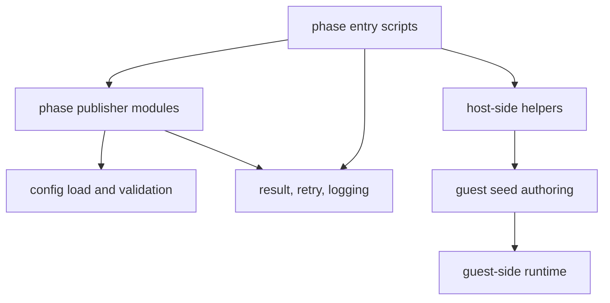
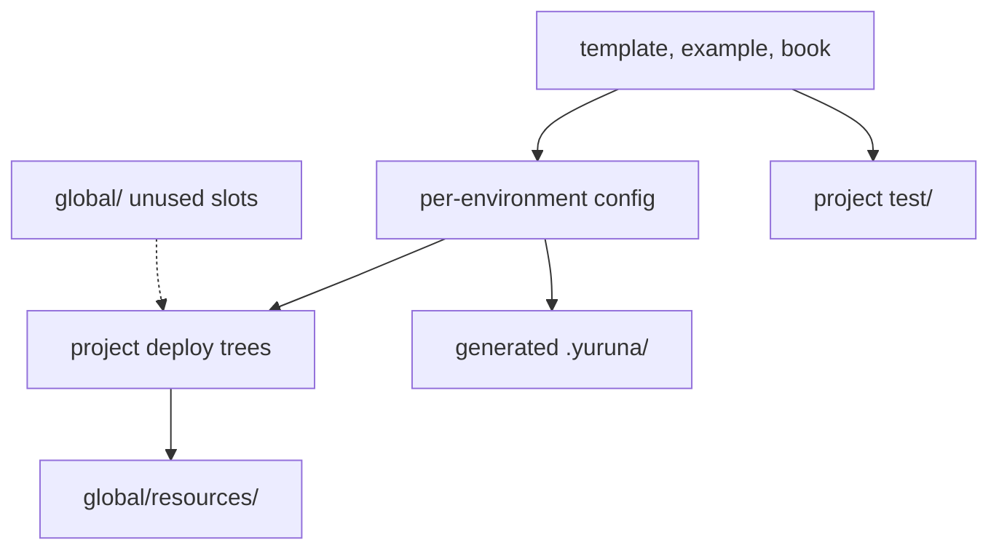
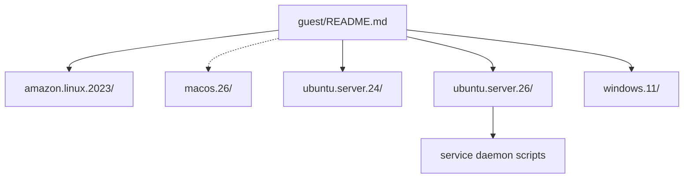
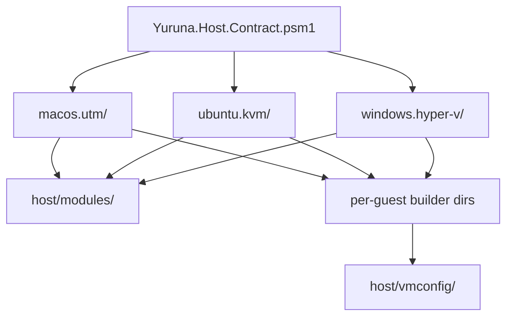
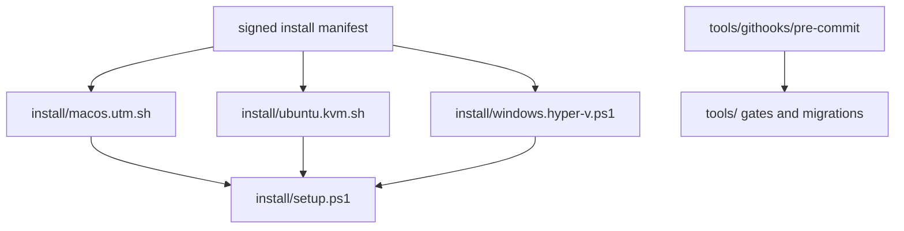
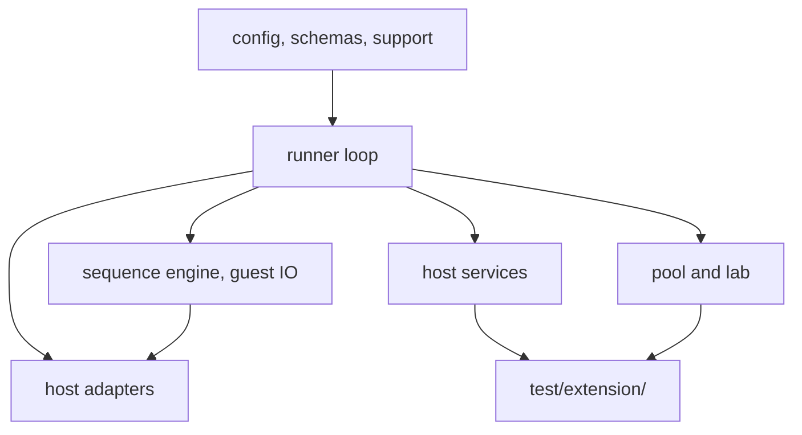
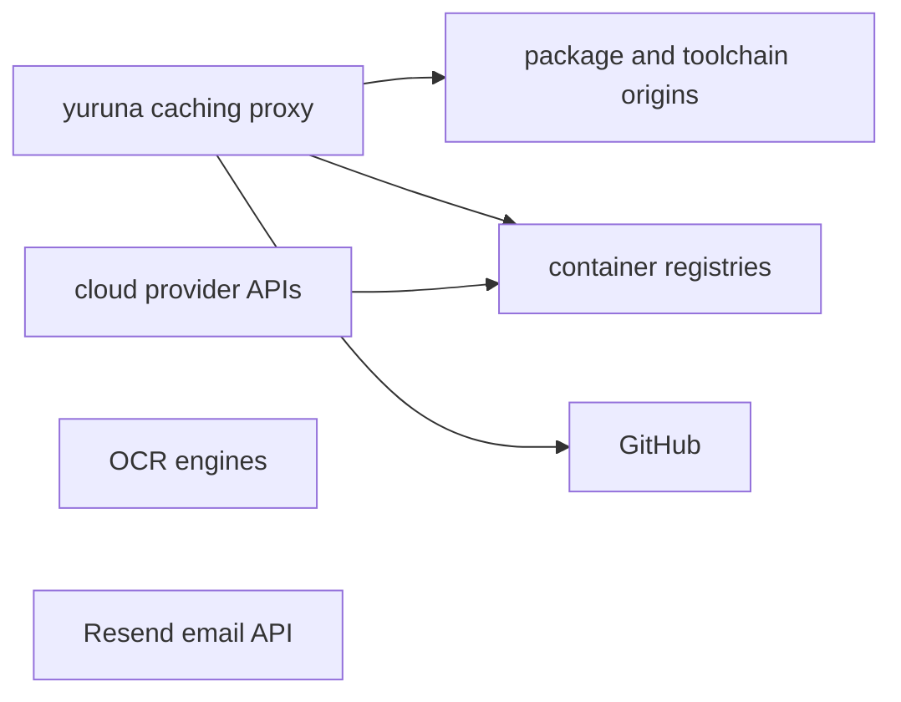

# Component breakdown

> One sentence: each of the seven top-level blocks opened into at most seven
> real children, with the exact file list behind every aggregate box.

See [Design overview](00-index.md) - [Context and components](01-context-and-components.md) -
[Yuruna Architecture](../architecture.md).

Sections follow the block order [doc 1](01-context-and-components.md) declares:
repository directory order, with the block that owns no directory last. Every
diagram holds seven boxes or fewer. Where a directory holds more children than
that, siblings are folded into a named aggregate chosen along a responsibility
boundary, and the fold is named with its member list underneath.

Only `*.psm1`, `*.ps1`, `*.sh` and data files are counted below. The 194
`test/modules/*.Tests.ps1` Pester suites are excluded throughout: they mirror
the modules they cover and are driven as one set by `tools/Invoke-TestSuite.ps1`.

## Deploy Engine -- `automation/`

```mermaid
flowchart TD
    entry-scripts["phase entry scripts"]
    phase-publishers["phase publisher modules"]
    config-load["config load and validation"]
    run-outcome["result, retry, logging"]
    host-helpers["host-side helpers"]
    guest-seed["guest seed authoring"]
    guest-runtime["guest-side runtime"]

    entry-scripts --> phase-publishers
    entry-scripts --> run-outcome
    entry-scripts --> host-helpers
    phase-publishers --> config-load
    phase-publishers --> run-outcome
    host-helpers --> guest-seed
    guest-seed --> guest-runtime
```

`automation/` holds 44 files, so all seven boxes are aggregates. The split is by
who calls whom, not by file extension: the entry scripts are the only files a
person or the harness invokes, the publishers are the only modules that shell
out to `tofu`, `docker`, `kubectl` and `helm`, and the last two boxes hold
artifacts that never execute on the host at all.

**`entry-scripts`** (8) -- `automation/yuruna.ps1` (the single dispatcher over
`requirements / clear / validate / resources / components / workloads`),
`automation/Set-Resource.ps1`, `automation/Set-Component.ps1`,
`automation/Set-Workload.ps1`, `automation/Invoke-Clear.ps1`,
`automation/Test-Configuration.ps1`, `automation/Test-Requirement.ps1`,
`automation/Test-Runtime.ps1`. The three `Set-*` scripts share an identical
prelude -- set the log level, resolve the root set, evict every `Yuruna.*`
module, import the one phase module -- which is why they are one box and not
three.

**`phase-publishers`** (8) -- `automation/Yuruna.Resource.psm1`,
`automation/Yuruna.Component.psm1`,
`automation/Yuruna.Component.Registry.psm1`,
`automation/Yuruna.CredentialProvider.psm1`,
`automation/Yuruna.Workload.psm1`, `automation/Yuruna.Clear.psm1`,
`automation/Yuruna.Requirement.psm1` and its data file
`automation/Yuruna.Requirement.yml`. The registry bridge and the credential
provider are folded in here because they exist only to supply the component
pipeline's `registryLogin` phase between `tag` and `push`.

**`config-load`** (5) -- `automation/Import.Yaml.psm1`,
`automation/Yuruna.Validation.psm1`,
`automation/Yuruna.VariableExpansion.psm1`,
`automation/Yuruna.DeploymentKind.psm1`,
`automation/Invoke-DynamicExpression.psm1`. Folded together because each one
turns declarative YAML into something executable: parse, gate, expand into
environment variables, resolve the deployment kind, then evaluate.

**`run-outcome`** (4) -- `automation/Yuruna.Result.psm1`,
`automation/Yuruna.Retry.psm1`, `automation/Yuruna.LogLevel.psm1`,
`automation/Yuruna.Log.psm1`. These decide what a run reports and how often a
step is reattempted; `Yuruna.Retry.psm1` is also imported from `host/modules/`
and `test/modules/`, so it is a shared policy rather than a deploy-only detail.

**`host-helpers`** (7) -- `automation/Yuruna.Common.psm1` (the 42-function
grab bag of address, memory, MAC and sudo helpers),
`automation/Yuruna.HostRedirect.psm1`, `automation/Yuruna.HostSetup.psm1`,
`automation/Set-HostAlias.ps1`, `automation/Get-SystemDiagnostic.ps1`,
`automation/Check-DependencyVersion.ps1`, `automation/context-copy.ps1`. None of
these are on the three-phase deploy path; they are imported from `host/**`,
`install/setup.ps1` and `test/modules/`.

**`guest-seed`** (5) -- `automation/Yuruna.CloudInitTemplate.psm1`,
`automation/Yuruna.GuestSeed.psm1`, `automation/Yuruna.GitHubSource.psm1`,
`automation/windows-guest-bootstrap.ps1`,
`automation/yuruna-host-locate.ps1`. Authored on the host, consumed in a guest:
the first three merge base seeds with overlays and fill placeholders, and the
last two are the Windows-side artifacts that merge emits into an answer file.

**`guest-runtime`** (7) -- `automation/fetch-and-execute.sh`,
`automation/yuruna-run.sh`, `automation/yuruna-retry.sh`,
`automation/yuruna-network.sh`, `automation/yuruna-host-locate.sh`,
`automation/yuruna-versions.sh`, `automation/Test-YurunaHost.ps1`. Every one of
these executes inside a guest after cloud-init base64-decodes it into
`/usr/local/lib/yuruna/`; `automation/yuruna-versions.sh` is the version pin
manifest that `automation/Check-DependencyVersion.ps1` reads back on the host.

## Project & Global Data -- `global/`, `yuruna-project/`

```mermaid
flowchart TD
    global-resources["global/resources/"]
    global-placeholders["global/ unused slots"]
    shipped-projects["template, example, book"]
    project-config["per-environment config"]
    project-trees["project deploy trees"]
    project-test["project test/"]
    project-work["generated .yuruna/"]

    shipped-projects --> project-config
    shipped-projects --> project-test
    project-config --> project-trees
    project-config --> project-work
    project-trees --> global-resources
    global-placeholders -.-> project-trees
    %% planned: no global fallback is implemented for components or workloads
```

Two roots share this block because they are the same contract seen from both
sides: `global/` is what the framework ships as a fallback, `yuruna-project/` is
what an operator supplies. Only the resource phase actually has a fallback.

**`global-resources`** (10 template directories) --
`global/resources/aws/eks-cluster/`, `global/resources/aws/registry/`,
`global/resources/azure/aks-cluster/`, `global/resources/azure/postgresql/`,
`global/resources/azure/registry/`, `global/resources/azure/resource-group/`,
`global/resources/azure/storage-share/`, `global/resources/azure/vm-linux/`,
`global/resources/localhost/context-copy/`,
`global/resources/localhost/registry/`. Folded into one box because they are
interchangeable at the same lookup point: a `template:` value in
`resources.yml` resolves against the project's own `resources/` first and this
tree second.

**`global-placeholders`** (3) -- `global/components/placeholder`,
`global/workloads/placeholder`, `global/config/gcp/gcp-access-key.json`. The
dashed edge records that the slots exist but nothing reads them:
`Yuruna.Component.psm1` resolves a build folder only under the project root, and
`Yuruna.Workload.psm1` resolves a chart only under the project root.

**`shipped-projects`** (5) -- `yuruna-project/template/` (the scaffold, with
`yuruna-project/template/config/localhost/` and the `yrn42template` build and
chart stubs), `yuruna-project/example/website/`,
`yuruna-project/example/text-to-sql/`, `yuruna-project/example/nested.host/`,
`yuruna-project/book/test/`. Folded because each is one project root; they
differ only in which of the boxes below they populate. `example/nested.host/`
and `book/` carry sequences and no deploy tree at all.

**`project-config`** -- one directory per target environment, holding
`resources.yml`, `components.yml`, `workloads.yml`, the generated
`resources.output.yml`, and an optional `secrets/`. Live instances:
`yuruna-project/example/website/config/aws/`,
`yuruna-project/example/website/config/azure/`,
`yuruna-project/example/website/config/localhost/`,
`yuruna-project/example/text-to-sql/config/localhost/`,
`yuruna-project/template/config/localhost/`.

**`project-trees`** (3 per project) -- `resources/` (project-local tofu
templates), `components/` (a build folder per component, each holding a
Dockerfile), `workloads/` (a helm chart per chart deployment). Concrete
instances include
`yuruna-project/example/website/components/frontend/website/` and
`yuruna-project/example/website/workloads/frontend/website/`.

**`project-test`** -- `yuruna-project/test/test.runner.yml` is the cycle plan,
and each project's own `test/` directory supplies the sequences the plan names:
`yuruna-project/example/website/test/`,
`yuruna-project/example/text-to-sql/test/`,
`yuruna-project/example/nested.host/test/`, `yuruna-project/book/test/`. Folded
into one box because the resolver treats them as one search set: every `test/`
directory found under the cloned project shadows the framework's
`test/sequences/` by file name.

**`project-work`** -- the generated `.yuruna/` tree under a project root, with
one subtree per phase, the timestamped input backups, the staged tofu work
folders, and the `*.stderr.log` / `*.rc` sidecar pairs. It is a box rather than a
footnote because it is the only place a post-mortem finds the tool output;
`automation/Get-SystemDiagnostic.ps1` scans for it with `-Force` precisely
because the dot-prefixed name hides it from an ordinary walk.

## Guest Workloads -- `guest/`

```mermaid
flowchart TD
    guest-readme["guest/README.md"]
    amazon-linux-2023["amazon.linux.2023/"]
    macos-26["macos.26/"]
    ubuntu-server-24["ubuntu.server.24/"]
    ubuntu-server-26["ubuntu.server.26/"]
    windows-11["windows.11/"]
    service-daemons["service daemon scripts"]

    guest-readme --> amazon-linux-2023
    guest-readme --> ubuntu-server-24
    guest-readme --> ubuntu-server-26
    guest-readme --> windows-11
    guest-readme -.-> macos-26
    %% planned: no host seeds a macOS guest and no sequence drives it
    ubuntu-server-26 --> service-daemons
```

Six of the seven boxes are real directories, so nothing is folded except the
service scripts. `guest/README.md` is the family index, and the dashed edge to
`macos.26/` records that the family is documented as manual: nothing installs
`automation/fetch-and-execute.sh` on a macOS guest and no sequence names it.

| Box | Files |
|---|---|
| `amazon.linux.2023/` | `guest/amazon.linux.2023/amazon.linux.2023.update.sh`, `.code.sh`, `.n8n.sh`, `.openclaw.sh`, `.postgresql.sh` |
| `macos.26/` | `guest/macos.26/macos.26.update.sh` |
| `ubuntu.server.24/` | `guest/ubuntu.server.24/ubuntu.server.24.update.sh`, `.code.sh`, `.k8s.sh`, `.n8n.sh`, `.openclaw.sh`, `.postgresql.sh` |
| `ubuntu.server.26/` | `guest/ubuntu.server.26/ubuntu.server.26.update.sh`, `.code.sh`, `.k8s.sh`, `.n8n.sh`, `.openclaw.sh`, `.postgresql.sh` |
| `windows.11/` | `guest/windows.11/windows.11.update.ps1`, `.code.ps1`, `.k8s.ps1` |
| `service-daemons` | `guest/ubuntu.server.26/ubuntu.server.26.stash-service.sh`, `.download-agent-service.sh`, `.pool-control-service.sh` |

**`service-daemons`** is split out of `ubuntu.server.26/` rather than left in it
because the three scripts are reached by a different mechanism and do a
different job: they are run by absolute path from a cloud-init bring-up unit
seeded by `host/vmconfig/stash-service.base.user-data`,
`host/vmconfig/download-agent-service.base.user-data` and
`host/vmconfig/pool-control-service.base.user-data`, and each compiles a Go
daemon out of `test/extension/` and installs it under systemd. The other six
`ubuntu.server.26` scripts are typed into a console or sent over SSH by the
harness and only install packages.

The workload names repeat across families, which is what makes the family
directories the right boxes: `update` exists in all five, `code` in four (all
but `macos.26`), `k8s` in three (`ubuntu.server.24`, `ubuntu.server.26`,
`windows.11`), and `n8n`, `openclaw`, `postgresql` in the three Linux families
other than `macos.26`. The `ubuntu.server.24` and `ubuntu.server.26` copies of
`update`, `code`, `n8n`, `openclaw` and `postgresql` are byte-identical; only
the `k8s` pair differs, and the 24.04 copy is the superset -- it defines a
`assert_tool_runnable` helper that gates the Helm and mkcert installs, which the
26.04 copy lacks.

## Host Provisioning -- `host/`

```mermaid
flowchart TD
    host-contract["Yuruna.Host.Contract.psm1"]
    macos-utm["macos.utm/"]
    host-modules["host/modules/"]
    ubuntu-kvm["ubuntu.kvm/"]
    vmconfig["host/vmconfig/"]
    windows-hyper-v["windows.hyper-v/"]
    guest-builders["per-guest builder dirs"]

    host-contract --> macos-utm
    host-contract --> ubuntu-kvm
    host-contract --> windows-hyper-v
    macos-utm --> host-modules
    ubuntu-kvm --> host-modules
    windows-hyper-v --> host-modules
    macos-utm --> guest-builders
    ubuntu-kvm --> guest-builders
    windows-hyper-v --> guest-builders
    guest-builders --> vmconfig
```

Boxes are declared in directory order. Three of them are literal files or
directories; the three provider boxes and the builder box are aggregates.

**`host-contract`** -- `host/Yuruna.Host.Contract.psm1`, a single file holding
the 38-verb driver contract and the coverage assertion each driver calls at the
bottom of its own module body. It is its own box because it is the interface
every other box in this section is measured against.

**`macos.utm/`**, **`ubuntu.kvm/`**, **`windows.hyper-v/`** -- one box per
provider. Each folds a driver module plus four operator scripts that share a
parameter contract and an exit convention:
`host/<provider>/modules/Yuruna.Host.psm1`,
`host/<provider>/Enable-TestAutomation.ps1`,
`host/<provider>/Disable-TestAutomation.ps1`,
`host/<provider>/Sync-HostConfiguration.ps1`,
`host/<provider>/Remove-OrphanedVMFiles.ps1`. Provider-only extras ride in the
same box: `host/ubuntu.kvm/modules/Yuruna.GuestRail.psm1` and
`host/ubuntu.kvm/yuruna-bridge-pin.sudoers`;
`host/macos.utm/Remove-StaleDhcpLease.ps1`,
`host/macos.utm/Start-CachingProxyServiceForwarder.ps1` and
`host/macos.utm/brew-doctor-fix.sh`. The folding is by platform because the
three driver modules implement the same 38 verbs against
`Hyper-V\*` cmdlets plus `netsh` and `pktmon`, against `virsh` plus `nmcli` and
`netplan`, and against `utmctl` plus `qemu-img` and `osascript` respectively --
there is no shared implementation to hoist out of them.

**`host-modules`** (7) -- `host/modules/Yuruna.HostProvision.psm1` (the shared
bodies of five contract verbs), `host/modules/Yuruna.HostDownload.psm1` (the
squid download stack), `host/modules/Yuruna.DownloadAgent.psm1` (the host-side
client for the pooled download agent, which deliberately imports nothing),
`host/modules/Yuruna.Image.psm1` (the checksum and signature gateway),
`host/modules/Yuruna.UbuntuImage.psm1` (the live-server ISO pipeline),
`host/modules/Yuruna.VMCleanup.psm1`, and the Pester suite
`host/modules/Yuruna.Image.Tests.ps1`. The pinned Ubuntu signing keys live
beside them at `host/modules/keys/ubuntu-image-signing-keys.asc`. Folded as one
box because all three drivers import them `-Global` at load and then rely on
name-based feature detection.

**`vmconfig`** (31 files) -- six seed families, each with a
`<family>.base.user-data`, a `<family>.meta-data` and one overlay per
hypervisor, plus the single shared `host/vmconfig/guest-dhcp.network-config`.
The families are `amazon.linux.2023`, `caching-proxy-service`,
`download-agent-service`, `pool-control-service`, `stash-service` and
`ubuntu.server`; the overlay suffixes are `.hyperv.overlay.yml`,
`.kvm.overlay.yml` and `.utm.overlay.yml`. They fold into one box because they
share one merge contract: `automation/Yuruna.CloudInitTemplate.psm1` substitutes
overlay sections into base anchors line by line, and an anchor with no matching
overlay section is a hard error in either direction.

**`guest-builders`** (25 directories) -- `host/<provider>/guest.<name>/`, each
holding a `Get-Image.ps1` and a `New-VM.ps1`. Eight guest names appear under all
three providers -- `guest.amazon.linux.2023`, `guest.caching-proxy-service`,
`guest.download-agent-service`, `guest.pool-control-service`,
`guest.stash-service`, `guest.ubuntu.server.24`, `guest.ubuntu.server.26`,
`guest.windows.11` -- and `host/macos.utm/guest.macos.26/` exists only under
UTM. Folded into one box rather than 25 because they are dispatched
identically: `Invoke-GetImage` and `Invoke-PerGuestNewVm` in
`host/modules/Yuruna.HostProvision.psm1` run each one as a child `pwsh`,
forwarding only the parameters the target script declares. Their per-guest data
files sit alongside: `config.plist.template` under every
`host/macos.utm/guest.*/`, and `vmconfig/autounattend.xml` under all three
`guest.windows.11` directories.

## Installers -- `install/`, `tools/`

```mermaid
flowchart TD
    macos-utm-sh["install/macos.utm.sh"]
    ubuntu-kvm-sh["install/ubuntu.kvm.sh"]
    windows-hyper-v-ps1["install/windows.hyper-v.ps1"]
    signed-manifest["signed install manifest"]
    setup-ps1["install/setup.ps1"]
    repo-gates["tools/ gates and migrations"]
    pre-commit["tools/githooks/pre-commit"]

    signed-manifest --> macos-utm-sh
    signed-manifest --> ubuntu-kvm-sh
    signed-manifest --> windows-hyper-v-ps1
    macos-utm-sh --> setup-ps1
    ubuntu-kvm-sh --> setup-ps1
    windows-hyper-v-ps1 --> setup-ps1
    pre-commit --> repo-gates
```

Boxes are declared in install phase order -- verify, bootstrap, configure --
then the repo-hygiene pair. Only two boxes are aggregates.

**`macos.utm.sh`**, **`ubuntu.kvm.sh`**, **`windows.hyper-v.ps1`** -- one box
each, because each is a single file with a platform-specific package set but a
shared contract: clone to `~/git/yuruna`, honour a version pin, tee a per-run
install log, preserve `test/status/` across an update, seed
`test/test.config.yml` from its template, and finish by pointing at
`host/<platform>/Enable-TestAutomation.ps1` rather than running it.

**`signed-manifest`** (4) -- `install/install.sha256`,
`install/install.sha256.sig`, `install/keys/yuruna-release-signing.pub.pem`,
`install/keys/yuruna-release-signing.pub.xml`, documented by
`install/keys/README.md`. Folded because they are one trust chain and cover
exactly one thing: the manifest lists the SHA-256 of the three bootstrappers
above and nothing else.

**`setup.ps1`** -- `install/setup.ps1` with its sample answer file
`install/setup.answers.standalone.yml`. Its own box because it installs and
clones nothing; it orchestrates scripts that already exist in the checkout --
`test/lab/Enable-TestAutomation.ps1`, `test/lab/New-LocalLabStorage.ps1`,
`test/lab/Set-LabToken.ps1`, the `test/service/Start-*ServiceVM.ps1` set,
`test/pool/New-Pool.ps1` and `test/pool/Test-PoolIntent.ps1`.

**`repo-gates`** (9) -- `tools/Invoke-GoTest.ps1`, `tools/Invoke-JsTest.ps1`,
`tools/Invoke-Lint.ps1`, `tools/Invoke-ShellCheck.ps1`,
`tools/Invoke-TestSuite.ps1` with its single-suite helper
`tools/_InvokeOneSuite.ps1`, `tools/Test-AsciiNoBom.ps1`,
`tools/Test-RegionAnchors.ps1`, `tools/Update-TestConfigNaming.ps1`. Folded
because every one of them selects its input from git (`git ls-files`, or the
staged set) and returns a pass or fail over the whole repository.
`tools/Update-YurunaReleasePins.ps1` is the exception and belongs with
`signed-manifest`: it is the writer of that manifest and its signature.

**`pre-commit`** -- `tools/githooks/pre-commit`, activated per clone through
`core.hooksPath` set in `.gitconfig.yuruna`. Kept out of `repo-gates` because it
is advisory rather than a gate: it skips with a warning when `pwsh` is absent,
blocks on only two of its three passes, and warns on the third.

## Test Harness -- `test/`

```mermaid
flowchart TD
    configuration["config, schemas, support"]
    runner["runner loop"]
    sequence-engine["sequence engine, guest IO"]
    host-adapters["host adapters"]
    host-services["host services"]
    extensions["test/extension/"]
    pool-lab["pool and lab"]

    configuration --> runner
    runner --> sequence-engine
    runner --> host-adapters
    runner --> host-services
    sequence-engine --> host-adapters
    host-services --> extensions
    runner --> pool-lab
    pool-lab --> extensions
```

`test/modules/` alone holds 95 modules, so every box here is an aggregate.
Boxes are declared in execution order: configuration is read before the runner
starts, the runner drives sequences, sequences reach the host and the guest, and
the last three boxes are the long-lived services the cycle depends on. The 95
modules partition exactly across the seven boxes with no module counted twice.

**`configuration`** (15 modules) -- `test/modules/Test.Config.psm1`,
`Test.ConfigValidator.psm1`, `Test.ConfigPreflight.psm1`,
`Test.ConfigNaming.psm1`, `Test.ConfigSync.psm1`, `Test.ConfigServiceCA.psm1`,
`Test.ConfigServiceSync.psm1`, `Test.Capability.psm1`, `Test.Prelude.psm1`,
`Test.YurunaDir.psm1`, `Test.Hash.psm1`, `Test.Assert.psm1`,
`Test.FrameworkSource.psm1`, `Test.RootArtifact.psm1`,
`Test.CredentialProvider.psm1`. Also `test/Test-Config.ps1`,
`test/test.config.yml.template`, and the 13 contracts in `test/schemas/`
(`vault`, `lab.vault`, `users`, `pools`, `pool-test-sets`,
`host.registration`, `sequence`, `orchestration-sequence`, `actions`,
`snippets`, `extension-config`, `notification.transports`,
`guests.compatibility`). Folded because all of it answers one question before a
cycle runs -- is this host's declared state well formed.

**`runner`** (22 modules) -- `test/modules/Test.RunnerOuterLoop.psm1`,
`Test.RunnerInnerLoop.psm1`, `Test.RunnerState.psm1`,
`Test.RunnerWatchdog.psm1`, `Test.RunnerHeartbeat.psm1`,
`Test.RunnerElevation.psm1`, `Test.SingleInstance.psm1`,
`Test.InnerSpawn.psm1`, `Test.Recovery.psm1`, `Test.WarmResume.psm1`,
`Test.GuestQuarantine.psm1`, `Test.Remediation.psm1`,
`Test.FailureTaxonomy.psm1`, `Test.Notify.psm1`, `Test.Perf.psm1`,
`Test.Provenance.psm1`, `Test.EventSchema.psm1`, `Test.StateFile.psm1`,
`Test.Log.psm1`, `Test.LogRotation.psm1`, `Test.LogLevel.psm1`,
`Test.Output.psm1`. Its three entry points are
`test/Start-TestRunner.ps1` (resident), `test/modules/Invoke-TestCycleRunner.ps1`
(one process per cycle) and `test/modules/Invoke-TestRunnerInnerLoop.ps1` (the
cycle body), with `test/Invoke-TestProject.ps1` as the single-cycle variant.
Failure classification, notification and quarantine are folded in here rather
than split out because they all read the same per-cycle failure record and are
what the loop consults to decide whether to run the next cycle.

**`sequence-engine`** (26 modules) -- the engine proper is
`test/modules/Test.SequenceEngine.psm1`, `Test.SequenceAction.psm1`,
`Test.SequenceHandler.psm1`, `Test.SequencePlanner.psm1`,
`Test.SequenceResolve.psm1`, `Test.SequenceRunner.psm1`,
`Test.SequenceVariable.psm1`, `Test.SequenceFailureState.psm1`,
`Test.Orchestrator.psm1`, `Test.Start-GuestOS.psm1`,
`Test.Start-GuestWorkload.psm1`, `Test.SnapshotManifest.psm1`,
`Test.Backoff.psm1`, `Test.Registry.psm1`. The guest I/O layer folded in with it
is `Test.HostIO.psm1` and its three backends `Test.HostIO.HyperV.psm1`,
`Test.HostIO.Kvm.psm1`, `Test.HostIO.Utm.psm1`, plus `Test.Transport.psm1`,
`Test.KeyCodeRegistry.psm1`, `Test.OcrEngine.psm1`, `Test.OcrMatch.psm1`,
`Test.Tesseract.psm1`, `Test.ScreenshotProvider.psm1`, `Test.VncProvider.psm1`
and `Test.Ssh.psm1`. The fold is deliberate: those twelve exist only to serve
sequence verbs -- a screenshot is taken so a `waitForText` can be judged, a
keystroke is sent because an `inputText` step asked for one -- and separating
them would cost a box without marking a real boundary. Data and drivers in the
same box: the 19 files under `test/sequences/` (17 sequences plus
`_snippets.yml` and `actions.yml`), the three OCR probes in `test/check/`, and
`test/Debug-TestSequence.ps1` and `test/test-localhost.sh`.

**`host-adapters`** (16 modules) -- `test/modules/Test.HostBootstrap.psm1`,
`Test.HostDetection.psm1`, `Test.HostContract.psm1`, `Test.HostCondition.psm1`
with `Test.HostCondition.Linux.psm1`, `Test.HostCondition.Mac.psm1` and
`Test.HostCondition.Windows.psm1`, `Test.HostFacts.psm1`,
`Test.HostIdentity.psm1`, `Test.HostGit.psm1`,
`Test.HostAutomationState.psm1`, `Test.HostAddressBeacon.psm1`,
`Test.VMUtility.psm1`, `Test.ServiceVm.psm1`, `Test.Diagnostic.psm1`,
`Test.PortOwner.psm1`. Scripts: `test/modules/Invoke-HostAddressBeacon.ps1`,
`test/Remove-TestVMFiles.ps1`, `test/New-LocalTestUser.ps1`. This box is where
the harness meets `host/`: `Test.HostBootstrap.psm1` is what picks a host type
and imports the matching `host/<provider>/modules/Yuruna.Host.psm1`, and
`Test.HostContract.psm1` is what checks the driver against
`host/Yuruna.Host.Contract.psm1`.

**`host-services`** (5 modules) -- `test/modules/Test.Status.psm1`,
`Test.StatusFirewall.psm1`, `Test.CachingProxyService.psm1`,
`Test.CachingProxyServiceLock.psm1`, `Test.DownloadAgentService.psm1`. The
lifecycle scripts are the 14 `Start-` and `Stop-` pairs plus
`Move-CachingProxyService.ps1` and
`Repair-CachingProxyServiceForwarder.ps1` in `test/service/`, and the served
tree is `test/status/` -- its pages (`index.html`, `config.html`,
`diagnostics.html`, `performance.html`, `share-cycle.html`) and its six state
directories (`runtime/`, `log/`, `perf/`, `extension/`, `ssh/`, `handoff/`).
Folded together because `test/service/Start-StatusService.ps1` and
`test/service/Start-ConfigService.ps1` are the two host-resident listeners, and
the four `Start-*ServiceVM.ps1` scripts differ from them only in that the
listener runs in a VM. `test/Test-CachingProxyService.ps1` is the operator probe
for the same set.

**`extensions`** (2 modules, 8 areas) -- `test/modules/Test.Extension.psm1` and
`Test.ExtensionService.psm1` are the loader and the service-block reader; the
areas themselves are `test/extension/authentication/`,
`test/extension/notification/`,
`test/extension/caching-proxy-parser-service/`,
`test/extension/download-agent-service/`,
`test/extension/pool-aggregator-service/`,
`test/extension/pool-control-service/`, `test/extension/stash-service/` and the
shared Go library `test/extension/extension-sdk/`. One box because every area
obeys the same two-file contract -- an `<area>.contract.yml` naming the required
verbs and an `<area>.config.yml` naming the active providers -- regardless of
whether the implementation is a PowerShell module or a Go daemon under
`server/`.

**`pool-lab`** (9 modules) -- `test/modules/Test.PoolAdmin.psm1`,
`Test.PoolNotifier.psm1`, `Test.PoolPlanner.psm1`, `Test.PoolPush.psm1`,
`Test.PoolStorage.psm1`, `Test.PoolSync.psm1`, `Test.PoolWorker.psm1`,
`Test.Lab.psm1`, `Test.LocalLabStorage.psm1`, with the detached workers
`test/modules/Invoke-PoolStorageDrain.ps1` and
`test/modules/Invoke-PoolPushForwarder.ps1`. The operator CLIs are the 13
scripts in `test/pool/` and the 9 in `test/lab/`. Folded as one box because both
sets edit the same two things -- the git-backed pool intent store and the two
network shares -- and `test/lab/` is simply the single-machine case of the pool
one.

## External Services -- clouds, registries, GitHub, OCR, email

```mermaid
flowchart LR
    caching-proxy["yuruna caching proxy"]
    package-origins["package and toolchain origins"]
    container-registries["container registries"]
    github["GitHub"]
    cloud-apis["cloud provider APIs"]
    ocr-engines["OCR engines"]
    resend-api["Resend email API"]

    caching-proxy --> package-origins
    caching-proxy --> container-registries
    caching-proxy --> github
    cloud-apis --> container-registries
```

This block owns no directory. The caching proxy is drawn with it because it
changes what "external" means for three of the six dependencies: it is an
internal VM, built from
`host/vmconfig/caching-proxy-service.base.user-data`, that terminates and caches
almost every byte a guest fetches. The three boxes with no inbound edge are
reached directly by host-side code and never go through it.

**`caching-proxy`** -- squid on 3128 plain and 3129 ssl-bump, an OCI
pull-through registry on 5000, and the CA that makes interception work. Guests
are pointed at it by the cloud-init seed above; hosts route image downloads
through it in `host/modules/Yuruna.HostDownload.psm1`
(`Get-CacheProxyForHostDownload`, `Invoke-HttpsViaSquidBump`); guests re-anchor
its CA through `yuruna_ca_selfheal` in `automation/yuruna-retry.sh`.

**`package-origins`** -- the distribution endpoints every install step reaches.
Distro archives and vendor repositories: the apt and dnf mirrors used by
`guest/ubuntu.server.24/ubuntu.server.24.update.sh` and
`guest/amazon.linux.2023/amazon.linux.2023.update.sh`,
`download.docker.com` and `pkgs.k8s.io` in
`guest/ubuntu.server.26/ubuntu.server.26.k8s.sh`,
`apt.postgresql.org` in `guest/ubuntu.server.26/ubuntu.server.26.postgresql.sh`,
`packages.microsoft.com` in `guest/ubuntu.server.26/ubuntu.server.26.code.sh`,
Homebrew in `install/macos.utm.sh`, and winget plus PSGallery in
`install/windows.hyper-v.ps1`. Toolchain publishers are folded into the same box
because they are the same kind of dependency reached the same way: `dot.net` in
`guest/ubuntu.server.24/ubuntu.server.24.code.sh`, `get.opentofu.org`,
`dl.filippo.io` and the Helm install script in
`guest/ubuntu.server.24/ubuntu.server.24.k8s.sh`,
`rpm.nodesource.com` in `guest/amazon.linux.2023/amazon.linux.2023.n8n.sh` and
the nvm installer in `guest/ubuntu.server.26/ubuntu.server.26.n8n.sh`,
`api.adoptium.net` in `guest/windows.11/windows.11.code.ps1`, and the OS image
publishers `releases.ubuntu.com` and `cdimage.ubuntu.com` reached by
`host/modules/Yuruna.UbuntuImage.psm1`, `cdn.amazonlinux.com` by
`host/ubuntu.kvm/guest.amazon.linux.2023/Get-Image.ps1`, `fedorapeople.org` for
virtio-win by `host/ubuntu.kvm/guest.windows.11/Get-Image.ps1`, and
`getutm.app` by `host/macos.utm/guest.windows.11/Get-Image.ps1`.

**`container-registries`** -- the image origins. `docker.io`,
`registry.k8s.io`, `public.ecr.aws`, `ghcr.io` and `mcr.microsoft.com` are
mirrored per-registry by the containerd `hosts.toml` written in
`guest/ubuntu.server.26/ubuntu.server.26.k8s.sh`; the push side is
`automation/Yuruna.Component.psm1`, which runs the component's `pushCommand`
after a login command resolved by `automation/Yuruna.Component.Registry.psm1`
from the provider table in `automation/Yuruna.CredentialProvider.psm1`. The
inbound edge from `cloud-apis` is real: the Azure, AWS and Google registry
endpoints in that table are cloud-managed resources, created by
`global/resources/azure/registry/` and `global/resources/aws/registry/` and
logged into with the cloud CLI.

**`github`** -- three distinct uses, all folded into one box because they hit
one host: `automation/Yuruna.GitHubSource.psm1` resolves the repository slug and
ref that `automation/fetch-and-execute.sh` falls back to when the host status
service is unreachable, using the Contents API with a token or
`raw.githubusercontent.com` without one;
`automation/Check-DependencyVersion.ps1` follows the `/releases/latest` redirect
to compare pins, deliberately never calling the API host; and the framework and
project repositories themselves are cloned by the guest `update` scripts and by
`install/ubuntu.kvm.sh` and its two peers.

**`cloud-apis`** -- Azure Resource Manager and the AWS APIs, reached by the
OpenTofu providers declared in `global/resources/azure/aks-cluster/` and
`global/resources/aws/eks-cluster/` and driven by `tofu init`, `tofu plan` and
`tofu apply` in `automation/Yuruna.Resource.psm1`. The same block also reaches
`az account show` from that module when `ARM_SUBSCRIPTION_ID` is unset, and
`az`, `aws` and `gcloud` from the authenticators in
`automation/Yuruna.CredentialProvider.psm1`.

**`ocr-engines`** -- three third-party engines behind one registry in
`test/modules/Test.OcrEngine.psm1`: Tesseract through
`test/modules/Test.Tesseract.psm1`, `Windows.Media.Ocr` through a Windows
PowerShell child process, and Apple Vision through a compiled Swift helper.
External to the codebase but local to the machine, which is why nothing routes
them through the proxy. Their operator probes are
`test/check/Test-TesseractOcr.ps1` and `test/check/Test-WinRtOcr.ps1`.

**`resend-api`** -- the transactional email API, the only network dependency of
the notification path. It is called from exactly one place,
`test/extension/notification/default.psm1`, with credentials read from the
transports file whose shape is fixed by
`test/schemas/notification.transports.schema.yml`.
