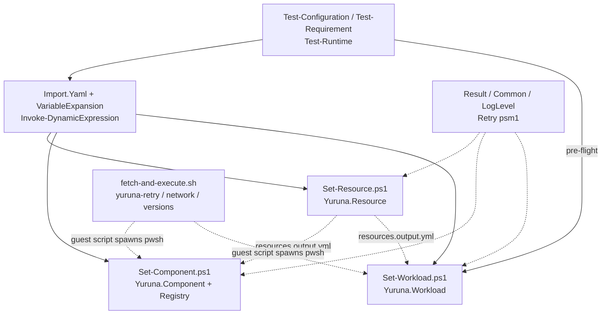
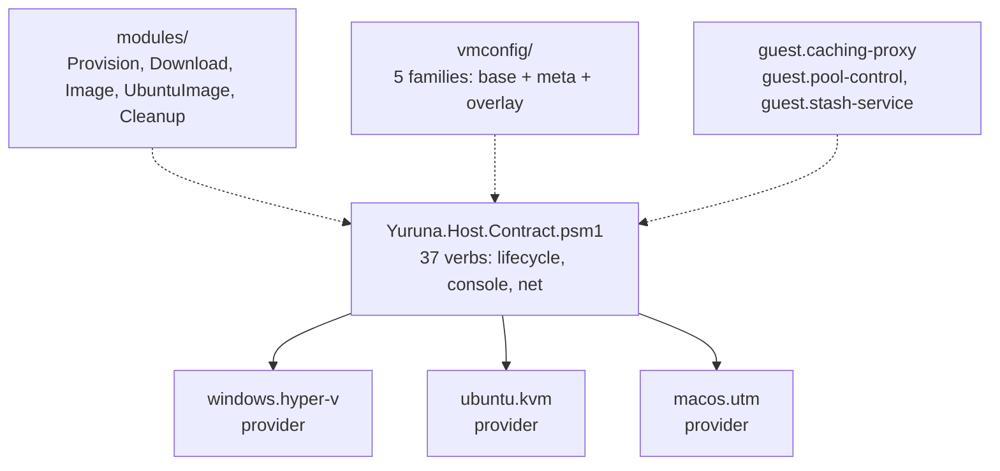
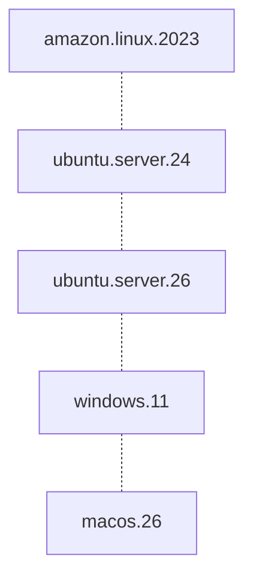
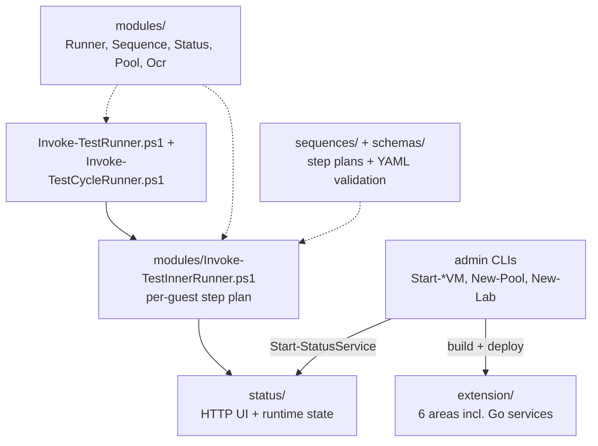
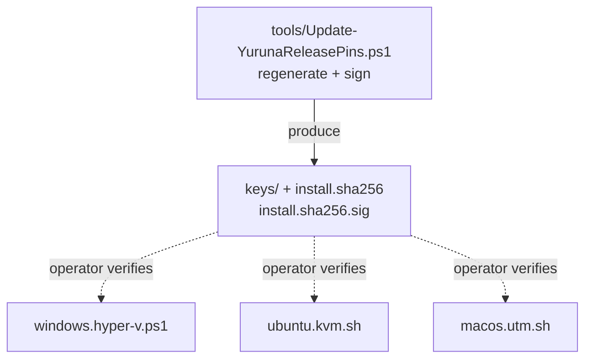
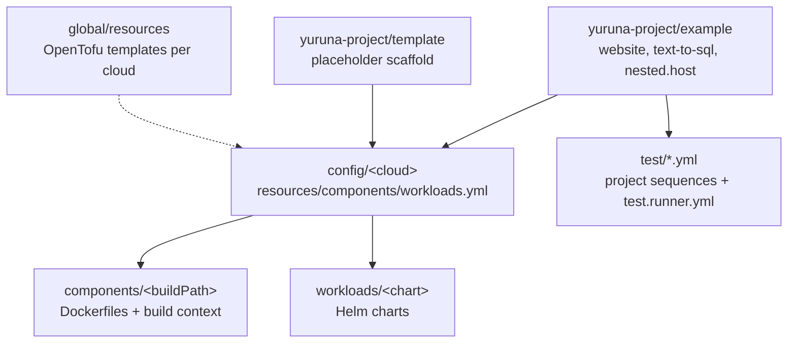
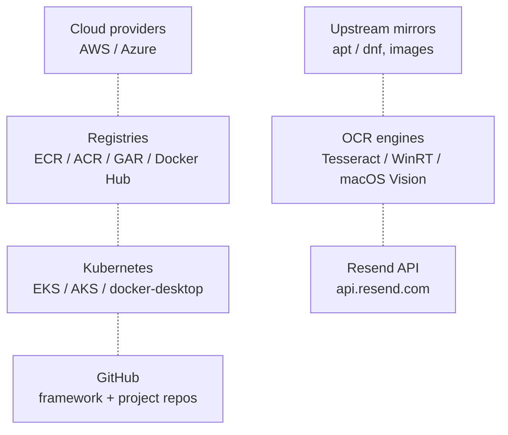

# Level-2 component breakdown

> One sentence: each Level-1 component expanded into at most seven real
> child scripts/modules/directories.

See [Design overview](00-index.md) · [Level-1 components](01-context-and-components.md) · [Yuruna Architecture](../architecture.md).

## Deploy Engine — `automation/`

```mermaid
flowchart TD
    set-resource[Set-Resource.ps1<br/>Yuruna.Resource]
    set-component[Set-Component.ps1<br/>Yuruna.Component + Registry]
    set-workload[Set-Workload.ps1<br/>Yuruna.Workload]
    validation[Test-Configuration / Test-Requirement<br/>Test-Runtime]
    config-parse[Import.Yaml + VariableExpansion<br/>Invoke-DynamicExpression]
    cross-cutting[Result / Common / LogLevel<br/>Retry psm1]
    guest-runtime[fetch-and-execute.sh<br/>yuruna-retry / network / versions]

    validation --> config-parse
    config-parse --> set-resource
    config-parse --> set-component
    config-parse --> set-workload
    validation -->|pre-flight| set-workload
    set-resource -.->|resources.output.yml| set-component
    set-resource -.->|resources.output.yml| set-workload
    cross-cutting -.-> set-resource
    cross-cutting -.-> set-component
    cross-cutting -.-> set-workload
    guest-runtime -.->|guest script spawns pwsh| set-component
    guest-runtime -.->|guest script spawns pwsh| set-workload
```

**The phases do not chain.** Each of `Set-Resource.ps1`, `Set-Component.ps1`
and `Set-Workload.ps1` calls exactly one `Publish-*List` and never invokes
another phase script; `automation/yuruna.ps1` runs exactly one branch of its
`switch -Exact ($operation)` per process (`requirements | clear | validate |
resources | components | workloads`). The only coupling between phases is the
generated `config/<cloud>/resources.output.yml` file, drawn as the dashed
edges. Ordering is the caller's job — the operator's command sequence, or a
project's in-guest workload script spawning one `pwsh` per phase.

Each `Publish-*List` re-runs its matching `Confirm-*List`
(`Yuruna.Validation.psm1`) before deploying, and `Set-Workload.ps1` is the one
place the engine auto-runs a validator: it invokes `Test-Runtime.ps1` as
pre-flight and exits 1 on failure. `Test-Runtime.ps1` itself parses no YAML —
it shells out to docker/kubectl/helm/mkcert and returns a bool.

`Yuruna.LogLevel.psm1` is imported `-Global -Force` as the first statement of
every entry point and owns `Resolve-YurunaRootSet`, which resolves the
yuruna/project/config roots and gates the run before any publisher loads.
`Yuruna.Result.psm1` and `Yuruna.Common.psm1` are the other genuinely
all-three dependencies. `Yuruna.Retry.psm1` reaches only the resource and
workload publishers, and `Yuruna.DeploymentKind.psm1` only the workload
publisher and validation. `Yuruna.Log.psm1` lives here but has no deploy-path
importer — it is used by the test harness.

Not drawn, in `automation/` but off the phase path:

- `Invoke-Clear.ps1` (`Yuruna.Clear`) — teardown via `tofu destroy`, driven by
  the deployed-resource keys in `resources.output.yml` rather than the forward
  `resources.yml`, so config drift after deploy never blocks cleanup.
- `Get-SystemDiagnostic.ps1` — read-only host/cluster diagnostic. No deploy
  phase calls it; the callers are the harness
  (`test/modules/Test.RunnerInnerLoop.psm1`, `test/modules/Test.Diagnostic.psm1`)
  and the status service.
- `Set-HostAlias.ps1`, `Test-YurunaHost.ps1`, `Check-DependencyVersion.ps1`,
  `context-copy.ps1` — standalone operator utilities.
- `Yuruna.Requirement.yml` — the editable manifest of probe commands and
  minimum versions that `Test-Requirement.ps1` reads.
- `Yuruna.CredentialProvider.psm1` — first-wins registry-login providers
  matched by URL pattern (`azurecr`, `ecr`, `gar`, `dockerhub`,
  `docker-generic`), behind the component push.
- Five host-provisioning helpers that serve other layers: `Yuruna.HostSetup`,
  `Yuruna.GuestSeed`, `Yuruna.CloudInitTemplate`, `Yuruna.HostRedirect`,
  `Yuruna.GitHubSource`.

## Host Provisioning — `host/`

```mermaid
flowchart TD
    windows-hyperv[windows.hyper-v<br/>provider]
    ubuntu-kvm[ubuntu.kvm<br/>provider]
    macos-utm[macos.utm<br/>provider]
    host-contract[Yuruna.Host.Contract.psm1<br/>37 verbs: lifecycle, console, net]
    host-modules[modules/<br/>Provision, Download, Image, UbuntuImage, Cleanup]
    vmconfig[vmconfig/<br/>5 families: base + meta + overlay]
    infra-guests[guest.caching-proxy<br/>guest.pool-control, guest.stash-service]

    host-contract --> windows-hyperv
    host-contract --> ubuntu-kvm
    host-contract --> macos-utm
    host-modules -.-> host-contract
    vmconfig -.-> host-contract
    infra-guests -.-> host-contract
```

`$script:YurunaHostContract` **declares** 37 verbs across eight groups — VM
lifecycle and inventory, disk snapshots, console open/restart, image
acquisition, input + capture (`Send-Text`, `Send-Key`, `Send-Click`,
`Get-VMScreenshot`, `Get-VMConsoleHandle`), guest networking probes, external
network and host port mapping, caching-proxy probes and host proxy
management. The coverage check is **warn-only**: each driver calls
`Assert-YurunaHostContractCoverage` and discards the result, and the function
only warns and returns `$false` — it never throws, so a missing verb produces
one warning and load continues. Each driver also passes a hand-maintained copy
of its export list rather than its own `Export-ModuleMember` block.

Each provider ships a driver `modules/Yuruna.Host.psm1`, three host-level
operator scripts (`Enable-TestAutomation.ps1`, `Sync-HostConfiguration.ps1`,
`Remove-OrphanedVMFiles.ps1` — the last being the only consumer of the
`Yuruna.VMCleanup` module), and one `guest.<key>/` folder per supported guest
holding `Get-Image.ps1` + `New-VM.ps1` + `README.md`. `macos.utm/` folders add
a `config.plist.template` UTM bundle template, and `macos.utm/` alone carries
`guest.macos.26`, `Start-CachingProxyForwarder.ps1` and `brew-doctor-fix.sh`.
Seven guest folders per provider, eight for `macos.utm`.

`host/vmconfig/` is flat: five guest families (`amazon.linux.2023`,
`caching-proxy`, `pool-control`, `stash-service`, `ubuntu.server`) × five
files each — `<family>.base.user-data`, `<family>.meta-data`, and one overlay
per hypervisor (`<family>.hyperv|kvm|utm.overlay.yml`). The base+overlay merge
is what makes the seed host-neutral, and `ubuntu.server.24` and
`ubuntu.server.26` share one base. There is no `windows.11` or `macos.26`
family: Windows guests seed from a per-guest
`guest.windows.11/vmconfig/autounattend.xml` burned into a seed ISO — labelled
`OEMDRV` on Hyper-V and UTM, `AUTOUNATTEND` on KVM, where Setup finds the file
by root-of-CD scan instead — and macOS 26 seeds from nothing.

`infra-guests` is a logical aggregate — those three directories live nested
under each provider, not at the `host/` root (see the
[≤7 rule](00-index.md#the-7-rule--grouping-decisions)).

## Guest Workloads — `guest/`

```mermaid
flowchart TD
    amazon-linux[amazon.linux.2023]
    ubuntu-24[ubuntu.server.24]
    ubuntu-26[ubuntu.server.26]
    windows-11[windows.11]
    macos-26[macos.26]

    amazon-linux -.- ubuntu-24 -.- ubuntu-26 -.- windows-11 -.- macos-26
```

Each holds in-guest workload scripts named `<guest>.<workload>.sh|ps1`. How
they arrive differs per guest:

- **Ubuntu / Amazon Linux** run
  `/usr/local/lib/yuruna/fetch-and-execute.sh guest/<name>/<name>.<workload>.sh` —
  the copy cloud-init bakes in from `automation/fetch-and-execute.sh`,
  alongside `yuruna-retry.sh` (sourced unconditionally by every fetcher-run
  Linux workload script; the pool-control and stash-service bring-up scripts
  source it behind an `if [ -r ... ]` guard because they run before
  `update.sh` has baked it in), `yuruna-network.sh` and `yuruna-versions.sh`.
- **Windows 11** has no automated path: `test/sequences/workload.guest.windows.11.yml`
  is a placeholder with `workload: []`, and the `irm | iex` one-liner in
  `guest/windows.11/README.md` is operator-run.
- **macOS 26** has no automated path either — Setup Assistant is not
  automated, so `macos.26.update.sh` is operator-run.
- The **pool-control** and **stash-service** guests bypass the fetcher: their
  cloud-init pulls `yuruna-archive.tar.gz` (falling back to `git clone`) and
  runs `bash .../guest/ubuntu.server.26/ubuntu.server.26.<svc>.sh` directly.

## Test Harness — `test/`

```mermaid
flowchart TD
    runner[Invoke-TestRunner.ps1 +<br/>Invoke-TestCycleRunner.ps1]
    inner[modules/Invoke-TestInnerRunner.ps1<br/>per-guest step plan]
    modules[modules/<br/>Runner, Sequence, Status, Pool, Ocr]
    plans[sequences/ + schemas/<br/>step plans + YAML validation]
    status[status/<br/>HTTP UI + runtime state]
    extensions[extension/<br/>6 areas incl. Go services]
    admin[admin CLIs<br/>Start-*VM, New-Pool, New-Lab]

    runner --> inner
    inner --> status
    modules -.-> runner
    modules -.-> inner
    plans -.-> inner
    admin -->|Start-StatusService| status
    admin -->|build + deploy| extensions
```

**Three processes, not two.** `Invoke-TestRunner.ps1` is a thin outer entry
point that calls `Invoke-RunnerOuterLoop`; it resolves
`Invoke-TestCycleRunner.ps1` and passes it as `CycleScript`, falling back to
in-process cycles only when that file is absent. The cycle runner runs
**exactly one cycle per fresh process**, so an edit to cycle logic lands on
the next cycle instead of needing a runner restart; it reports transient
outcomes through `runner.cycle.outcome.json`. It in turn spawns
`modules/Invoke-TestInnerRunner.ps1`, which drives the per-guest steps.

`test/modules/` is the implementation layer — 81 `.psm1` modules and 127
Pester files — including everything the runner boxes delegate to:
`Test.RunnerOuterLoop`, `Test.RunnerInnerLoop`, `Test.RunnerWatchdog`,
`Test.RunnerState`, `Invoke-Sequence`, `Test.OcrEngine` (built-in engines
`tesseract`, `winrt`, `macos-vision`), `Test.Status`, `Test.Extension`,
`Test.PoolAdmin` / `Test.PoolStorage` / `Test.PoolSync`.

`test/sequences/` is flat — 18 files, no `gui/` or `ssh/` subdirectories. The
distinction is per file: `keystrokeMechanism: gui` in the plain YAMLs and
`keystrokeMechanism: ssh` in the `.ssh.yml` filename variants. The cycle plan
the harness executes (`test.runner.yml`) and the project's own sequences live
in the **project** repo, not here.

`test/schemas/` holds 13 schemas covering more than sequences: sequence,
snippets, actions and orchestration-sequence (sequences); pools,
pool-test-sets, guests.compatibility, host.registration (pool);
extension-config, notification.transports (extensions); users, vault,
lab.vault (auth state). `test.config.yml` has no schema — `test/Test-Config.ps1`
validates it directly.

`test/extension/` has six areas. Five ship `<area>.contract.yml` +
`<area>.config.yml` and load through `Test.Extension.psm1`; `pool-control/`
ships neither — its only child is `server/`, a standalone Go daemon.
`test/pool/` holds `examples/` only (`pools.yml`,
`guests.compatibility.yml`); the live intent store is a separate git repo at
`pool.intentGitUrl`, which the 11 pool admin CLIs clone to
`<runtime>/pool-intent-admin` — the 8 mutating ones commit and push, while
`Get-PoolIntent`, `Get-PoolStatus` and `Test-PoolIntent` only read.
`New-Lab.ps1` creates a lab's storage folders, intent repository and lab
vault.

## Installers — `install/`, `tools/`

```mermaid
flowchart TD
    win-install[windows.hyper-v.ps1]
    kvm-install[ubuntu.kvm.sh]
    utm-install[macos.utm.sh]
    integrity[keys/ + install.sha256<br/>install.sha256.sig]
    release-pins[tools/Update-YurunaReleasePins.ps1<br/>regenerate + sign]

    release-pins -->|produce| integrity
    integrity -.->|operator verifies| win-install
    integrity -.->|operator verifies| kvm-install
    integrity -.->|operator verifies| utm-install
```

**No installer verifies itself.** The default one-liner path is unverified by
construction, as `install/README.md` states. Verification is a manual
pre-run snippet from that README (`RSACryptoServiceProvider.FromXmlString` +
`VerifyData` on Windows, `openssl dgst -sha256 -verify` elsewhere) — hence the
dashed, operator-labelled edges. `tools/Update-YurunaReleasePins.ps1`
regenerates `install/install.sha256`, signs it, self-verifies against
`install/keys/yuruna-release-signing.pub.pem`, and gates the release on
`test/Test-AsciiNoBom.ps1`.

The manifest and signature are **per release tag**, so they are expected to
be stale against a moving `main`: the verified-install path only works from
`refs/tags/<calver>`. `install/README.md` also carries the three one-liners,
the `?nocache=<timestamp>` convention, and the
`-PinVersion` / `PIN_VERSION` / `--pin-version` pinning path.

## Project & Global Data — `yuruna-project/`, `global/`

```mermaid
flowchart TD
    examples[yuruna-project/example<br/>website, text-to-sql, nested.host]
    template[yuruna-project/template<br/>placeholder scaffold]
    cloud-config[config/&lt;cloud&gt;<br/>resources/components/workloads.yml]
    components-dir[components/&lt;buildPath&gt;<br/>Dockerfiles + build context]
    workloads-dir[workloads/&lt;chart&gt;<br/>Helm charts]
    global-resources[global/resources<br/>OpenTofu templates per cloud]
    sequences[test/*.yml<br/>project sequences + test.runner.yml]

    examples --> cloud-config
    template --> cloud-config
    cloud-config --> components-dir
    cloud-config --> workloads-dir
    global-resources -.-> cloud-config
    examples --> sequences
```

`yuruna-project/template` **is** the scaffold — there is no
`template/<project>` level; only `example/` has one. Of its three examples,
`nested.host` is deliberately shaped differently: it carries only `README.md`
and `test/nested.host.yml` (the framework installing itself inside a nested VM
via `install/ubuntu.kvm.sh`), with no `config/`, `components/`, `workloads/`
or `resources/` tree at all.

Project `resources/` folders in the examples hold only placeholders, so
resource templates resolve to `global/resources/<template>` — a two-step
fallback implemented twice, in `Yuruna.Resource.psm1` and again in
`Yuruna.Validation.psm1`. `global/resources/` has `aws`, `azure` and
`localhost`; `global/config/` holds only `gcp` with a credential stub and no
matching templates, so `gcp` remains planned. `global/components/` and
`global/workloads/` hold placeholders.

Extension state is not project data and lives under `test/status/extension/`:
`vault.yml` (runtime-generated) and `users.yml` under `authentication/`,
`transports.yml` under `notification/`. All are git-ignored and seeded from
`*.template` files under `test/extension/`.

## External Services

```mermaid
flowchart TD
    clouds[Cloud providers<br/>AWS / Azure]
    registries[Registries<br/>ECR / ACR / GAR / Docker Hub]
    clusters[Kubernetes<br/>EKS / AKS / docker-desktop]
    github[GitHub<br/>framework + project repos]
    mirrors[Upstream mirrors<br/>apt / dnf, images]
    ocr[OCR engines<br/>Tesseract / WinRT / macOS Vision]
    email[Resend API<br/>api.resend.com]

    clouds -.- registries -.- clusters -.- github
    mirrors -.- ocr -.- email
```

Registry coverage follows the `Yuruna.CredentialProvider.psm1` provider list
(`azurecr`, `ecr`, `gar`, `dockerhub`, `docker-generic`), not just the two
managed clouds. GCP/GKE are planned, not available. The Resend edge is the
framework's only runtime email egress —
`test/extension/notification/default.psm1` POSTs to `https://api.resend.com/emails`
using `transports.resend.apiKey`.

---

LICENSEURI https://yuruna.link/license

Copyright (c) 2019-2026 by Alisson Sol et al.

Last review: 2026.07.26
