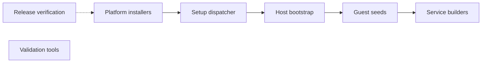
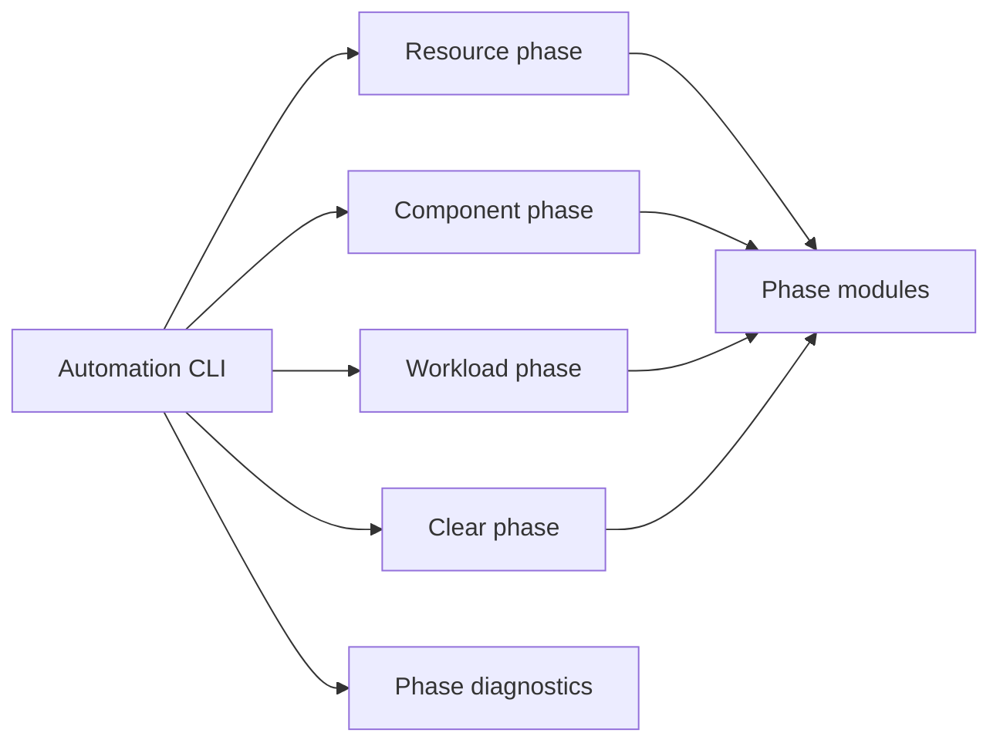
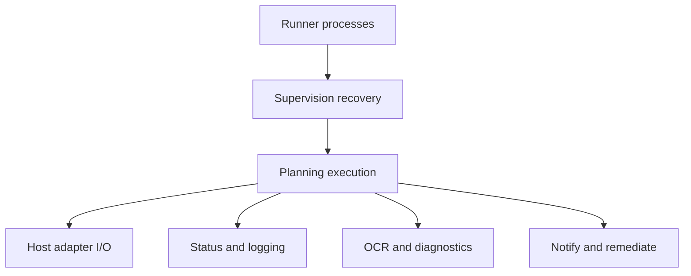
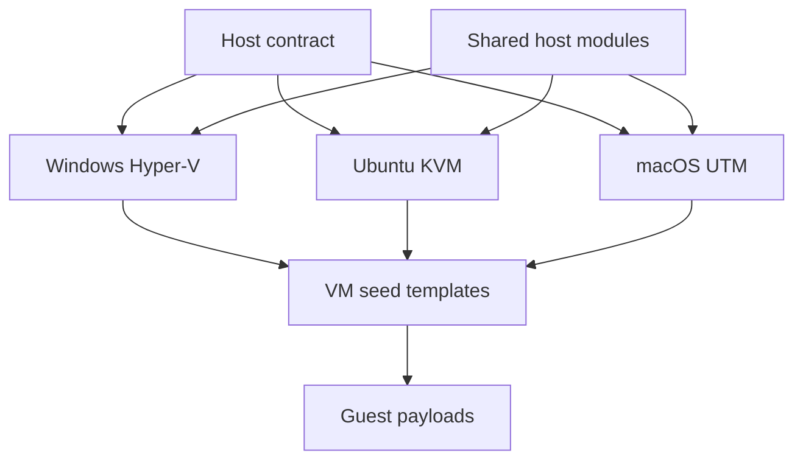
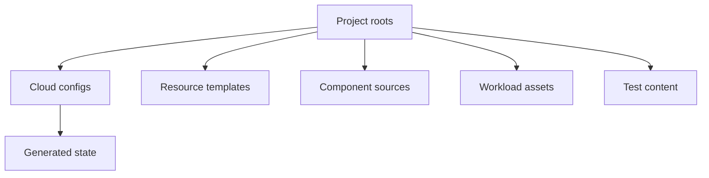
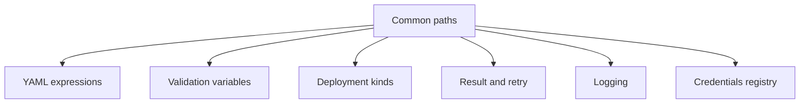
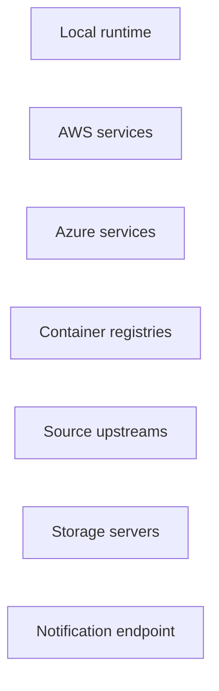

# Component breakdown

This level-2 view expands every level-1 block into seven or fewer current scripts, modules, directories, or named aggregates.

[Yuruna Architecture](../architecture.md) | [Design index](00-index.md) | [Context and components](01-context-and-components.md)

## Provisioning

```mermaid
flowchart LR
  %% optional -- signed release verification is user selected
  release-verification["Release verification"] -.-> platform-installers["Platform installers"]
  platform-installers --> setup-dispatcher["Setup dispatcher"]
  setup-dispatcher --> host-bootstrap["Host bootstrap"]
  host-bootstrap --> guest-seeds["Guest seeds"]
  guest-seeds --> service-builders["Service builders"]
  validation-tools["Validation tools"]
```

The boxes map, in order, to `install/install.sha256`,
`install/install.sha256.sig`, and `install/keys/`; the platform installers
`install/{macos.utm.sh,ubuntu.kvm.sh,windows.hyper-v.ps1}`; `install/setup.ps1`;
`automation/Yuruna.{HostSetup,HostRedirect}.psm1`; the
`CloudInitTemplate` and `GuestSeed` modules; provider folders named
`guest.{caching-proxy-service,stash-service,pool-control-service,download-agent-service}`;
and `tools/`. Service builders are folded across all three host implementations.

## Deploy Engine

```mermaid
flowchart LR
  automation-cli["Automation CLI"] --> resource-phase["Resource phase"]
  automation-cli --> component-phase["Component phase"]
  automation-cli --> workload-phase["Workload phase"]
  automation-cli --> clear-phase["Clear phase"]
  resource-phase --> phase-modules["Phase modules"]
  component-phase --> phase-modules
  workload-phase --> phase-modules
  clear-phase --> phase-modules
  automation-cli --> phase-diagnostics["Phase diagnostics"]
```

`automation/yuruna.ps1` dispatches the command surface. The four phase boxes map to
`Set-Resource.ps1`, `Set-Component.ps1`, `Set-Workload.ps1`, and
`Invoke-Clear.ps1`; their implementation aggregate is
`Yuruna.{Resource,Component,Workload,Clear}.psm1`. Diagnostics combines
`Test-{Configuration,Requirement,Runtime}.ps1`, `Check-DependencyVersion.ps1`, and
`Get-SystemDiagnostic.ps1`. The three deployment entry points are independent;
their caller supplies the Resources, Components, Workloads ordering shown in the
data-flow page.

## Test Harness

```mermaid
flowchart TD
  runner-processes["Runner processes"] --> supervision-recovery["Supervision recovery"]
  supervision-recovery --> planning-execution["Planning execution"]
  planning-execution --> host-adapter-io["Host adapter I/O"]
  planning-execution --> status-logging["Status and logging"]
  planning-execution --> ocr-diagnostics["OCR and diagnostics"]
  planning-execution --> notify-remediate["Notify and remediate"]
```

The role aggregates are grounded as follows:

- **Runner processes:** `test/Start-TestRunner.ps1`,
  `test/modules/Invoke-TestCycleRunner.ps1`, and
  `test/modules/Invoke-TestRunnerInnerLoop.ps1`.
- **Supervision recovery:** `Test.Runner{OuterLoop,Watchdog,Heartbeat,State}.psm1`
  and `Test.Recovery.psm1`.
- **Planning execution:** `Test.RunnerInnerLoop.psm1`, the
  `Test.Sequence{Planner,Runner,Engine}.psm1` modules, and the two
  `Test.Start-Guest*.psm1` modules.
- **Host adapter I/O:** `Test.Host{Contract,Bootstrap}.psm1`, `Test.HostIO*.psm1`,
  `Test.Transport.psm1`, and `Test.VMUtility.psm1`.
- **Status and logging:** `Test.Status.psm1`, `Test.Log.psm1`,
  `test/service/Start-StatusService.ps1`, and runtime `test/status/` data.
- **OCR and diagnostics:** `Test.Ocr{Engine,Match}.psm1`, `Test.Tesseract.psm1`,
  `Test.Diagnostic.psm1`, and `Test.Ssh.psm1`.
- **Notify and remediate:** `Test.Notify.psm1`, `Test.FailureTaxonomy.psm1`,
  `Test.Remediation.psm1`, and `test/extension/notification/`.

## Providers

```mermaid
flowchart TD
  host-contract["Host contract"] --> windows-hyper-v["Windows Hyper-V"]
  host-contract --> ubuntu-kvm["Ubuntu KVM"]
  host-contract --> macos-utm["macOS UTM"]
  shared-host-modules["Shared host modules"] --> windows-hyper-v
  shared-host-modules --> ubuntu-kvm
  shared-host-modules --> macos-utm
  windows-hyper-v --> vm-seed-templates["VM seed templates"]
  ubuntu-kvm --> vm-seed-templates
  macos-utm --> vm-seed-templates
  vm-seed-templates --> guest-payloads["Guest payloads"]
```

The seven children are `host/Yuruna.Host.Contract.psm1`, the three platform folders,
`host/modules/`, `host/vmconfig/`, and `guest/`. The guest aggregate contains the
current `amazon.linux.2023`, `ubuntu.server.24`, `ubuntu.server.26`, `windows.11`,
and `macos.26` payloads. macOS 26 builders exist only for the UTM provider; the
aggregate does not imply otherwise.

## Project Data

```mermaid
flowchart TD
  project-roots["Project roots"] --> cloud-configs["Cloud configs"]
  project-roots --> resource-templates["Resource templates"]
  project-roots --> component-sources["Component sources"]
  project-roots --> workload-assets["Workload assets"]
  project-roots --> test-content["Test content"]
  cloud-configs --> generated-state["Generated state"]
```

Deploy project roots are `yuruna-project/template/` and
`yuruna-project/example/{website,text-to-sql}`. Their children map to
`config/<environment>/` plus framework `global/config/`, `resources/` plus fallback
`global/resources/`, `components/` plus `global/components/`, `workloads/` plus
`global/workloads/`, and project-local `test/`, `book/test/`, plus
`yuruna-project/test/test.runner.yml`. The two non-resource global content folders
currently contain placeholders. Generated state is the
ignored `config/<environment>/resources.output.yml` and project `.yuruna/` work tree
written by the automation modules. Deployment record fields are expanded in the
data-model page. `yuruna-project/example/nested.host/` has no deployment folders; it
is a test-only fixture folded into Test Content.

## Shared Modules

```mermaid
flowchart TD
  common-paths["Common paths"] --> yaml-expressions["YAML expressions"]
  common-paths --> validation-variables["Validation variables"]
  common-paths --> deployment-kinds["Deployment kinds"]
  common-paths --> result-retry["Result and retry"]
  common-paths --> logging["Logging"]
  common-paths --> credentials-registry["Credentials registry"]
```

These seven boxes map to `automation/Yuruna.Common.psm1`;
`Import.Yaml.psm1` plus `Invoke-DynamicExpression.psm1`;
`Yuruna.{Validation,VariableExpansion}.psm1`; `Yuruna.DeploymentKind.psm1`;
`Yuruna.{Result,Retry}.psm1` plus `automation/yuruna-retry.sh`;
`Yuruna.{Log,LogLevel}.psm1`; and
`Yuruna.{CredentialProvider,Component.Registry}.psm1`.

## External Systems

```mermaid
flowchart LR
  local-runtime["Local runtime"]
  aws-services["AWS services"]
  azure-services["Azure services"]
  container-registries["Container registries"]
  source-upstreams["Source upstreams"]
  storage-servers["Storage servers"]
  notification-endpoint["Notification endpoint"]
```

The current call sites are the localhost templates under
`global/resources/localhost/`; AWS templates and credential handling under
`global/resources/aws/` and `Yuruna.CredentialProvider.psm1`; Azure equivalents
under `global/resources/azure/`; Docker push and Kubernetes image-pull paths in
`Yuruna.Component.psm1` and guest Kubernetes scripts; GitHub fetch logic in
`Yuruna.GitHubSource.psm1` and `automation/fetch-and-execute.sh`; SMB configuration
in `test/modules/Test.PoolStorage.psm1`; and notification dispatch in
`Test.Notify.psm1`. Google Artifact Registry login support exists in the credential
provider, but no GCP resource/provider tree exists, so no GCP service box is shown.
The tracked `global/config/gcp/gcp-access-key.json` is a credential placeholder, not
a deployable GCP resource template.
