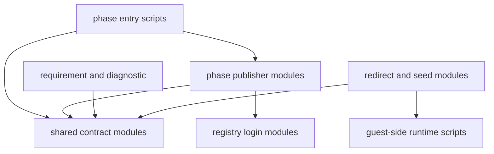
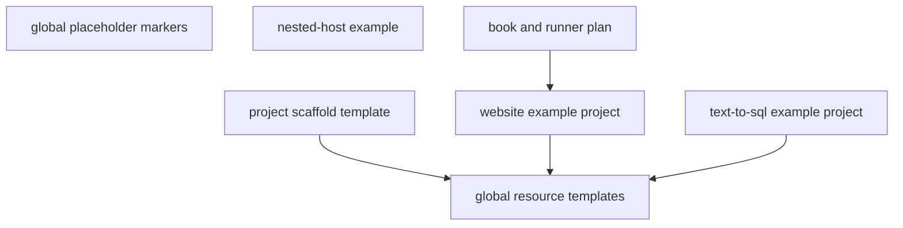
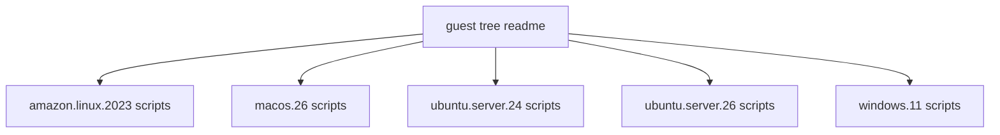
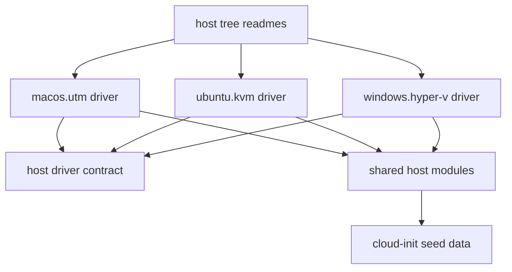
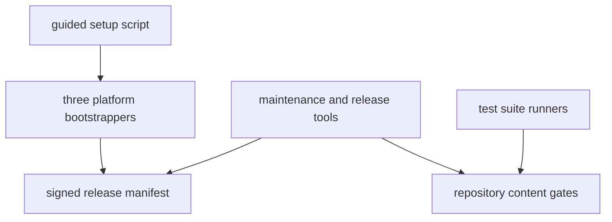
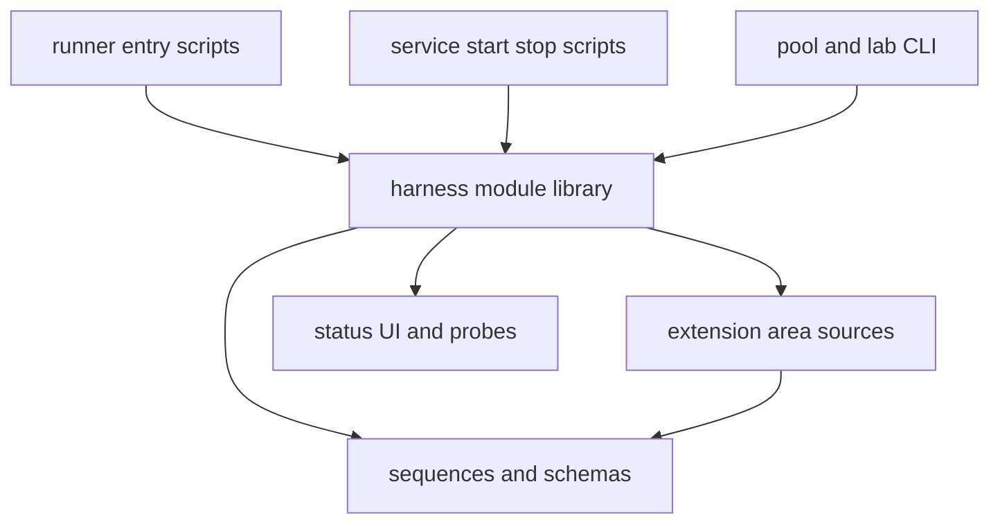
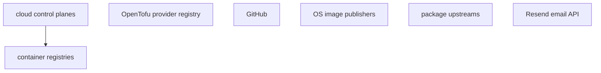

# Component breakdown

> One sentence: each of the seven level-1 blocks opened one level down, into at
> most seven real children, with the exact file list and count behind every
> aggregate box.

See [Design overview](00-index.md) - [Context and components](01-context-and-components.md) -
[Data flows](03-data-flows.md) - [Lifecycle state](04-lifecycle-state.md) -
[Configuration data model](05-data-model.md) - [Deployment topology](06-deployment.md) -
[Naming conventions](naming.md) - [Yuruna Architecture](../architecture.md).

Section order, section names and node ids come from the block taxonomy in
[Context and components](01-context-and-components.md): the six directory-owning
blocks in repository directory order of their first root (`automation/`,
`global/`, `guest/`, `host/`, `install/`, `test/`), then the block that owns no
directory last. Which paths fall outside all seven blocks, and why, is stated
there and is not repeated here.

**Counting rule.** Every count below is tracked files,
`git ls-tree -r --name-only HEAD <path> | wc -l`, taken from the working tree as
it stands. A box is drawn only when the directory or file behind it exists
today. Where a parent holds more than seven children, siblings are folded into a
named aggregate along a responsibility boundary, and the fold is spelled out
beneath the diagram as `aggregate-id -- N: member, member, ...`. Every box in
every section is an aggregate except three single files, each marked as such.

**Excluded throughout.** The Pester suites never get a box of their own. There
are 212 of them: 211 under `test/modules/` and one,
`host/modules/Yuruna.Image.Tests.ps1`, beside the module it covers. They are
counted inside the directory that holds them and are driven as one set by
`tools/Invoke-TestSuite.ps1`, whose `-Path` defaults to
`@('test/modules', 'host/modules')` (`:102`), which discovers suites through
`git ls-files` so a generated copy under `project/` or `test/status/runtime/`
cannot be swept in, and which spawns `tools/_InvokeOneSuite.ps1` once per suite
in its own process. One further exclusion applies only to `install/`:
`install/setup.answers.standalone.yml` exists in the working tree but is
untracked, so it is not in that directory's count of 10.

## Deploy Engine -- `automation/`

```mermaid
flowchart TD
    phase-entrypoints["phase entry scripts"]
    phase-modules["phase publisher modules"]
    shared-contract["shared contract modules"]
    registry-credentials["registry login modules"]
    host-seed-modules["redirect and seed modules"]
    requirement-diagnostic["requirement and diagnostic"]
    guest-side-runtime["guest-side runtime scripts"]

    phase-entrypoints --> phase-modules
    phase-entrypoints --> shared-contract
    phase-modules --> shared-contract
    phase-modules --> registry-credentials
    requirement-diagnostic --> shared-contract
    host-seed-modules --> shared-contract
    host-seed-modules --> guest-side-runtime
```

`automation/` is flat: 44 tracked files, no subdirectory. The fold is therefore
by role, and every one of the seven boxes is an aggregate. The two edges that
are easy to misread: `host-seed-modules --> guest-side-runtime` is not a call,
it is authoring -- `Get-YurunaGuestScriptBase64`
(`automation/Yuruna.CloudInitTemplate.psm1:166`, script paths at `:190-198`)
base64-bakes five of the shell scripts into a cloud-init seed, so the seed
carries them rather than the guest fetching them. And nothing points from `phase-modules` to
`guest-side-runtime`: the deploy phases are driven from *inside* a guest, by the
project's own workload script, long after `fetch-and-execute.sh` put it there.

**`phase-entrypoints`** -- 5: `automation/yuruna.ps1`, `automation/Set-Resource.ps1`,
`automation/Set-Component.ps1`, `automation/Set-Workload.ps1`,
`automation/Invoke-Clear.ps1`. `yuruna.ps1` is the single dispatcher; its
`switch -Exact` at `:97` covers six operations -- `requirements`, `clear`,
`validate`, `resources`, `components`, `workloads` -- each mapping to one
function in `phase-modules` or `requirement-diagnostic`. The three `Set-*`
wrappers share an identical prelude at `:50-84`: the same three parameters
(`project_root`, `config_subfolder`, a `ValidateSet` `logLevel`), a
`Resolve-YurunaRootSet` call that exports `Env:yuruna_root`, `Env:project_root`
and `Env:config_root`, a module eviction, a transcript, the publish call, and a
shared failure tail. `Set-Workload.ps1` alone adds a runtime gate ahead of the
publish (`:66-77`).

**`phase-modules`** -- 4: `automation/Yuruna.Resource.psm1` (382 lines,
`Publish-ResourceList` at `:333`), `automation/Yuruna.Component.psm1` (261,
`Publish-ComponentList` at `:38`), `automation/Yuruna.Workload.psm1` (432,
`Publish-WorkloadList` at `:294`), `automation/Yuruna.Clear.psm1` (103,
`Clear-Configuration` at `:25`). The first three read
`config/<subfolder>/{resources,components,workloads}.yml` under the project root
and return a result manifest; `Yuruna.Clear.psm1` returns a bare boolean and
reads `resources.output.yml` rather than `resources.yml`, because the deployed
names are the keys that file already holds (`:66-69`).

**`shared-contract`** -- 10: `automation/Import.Yaml.psm1`,
`automation/Invoke-DynamicExpression.psm1`, `automation/Yuruna.Common.psm1`,
`automation/Yuruna.DeploymentKind.psm1`, `automation/Yuruna.Log.psm1`,
`automation/Yuruna.LogLevel.psm1`, `automation/Yuruna.Result.psm1`,
`automation/Yuruna.Retry.psm1`, `automation/Yuruna.Validation.psm1`,
`automation/Yuruna.VariableExpansion.psm1`. This box is what makes the two edges
into it real rather than decorative: each publisher imports Validation and
Invoke-DynamicExpression at `:21-22`, Result and Common a few lines later
(`Yuruna.Resource.psm1:26,29`, `Yuruna.Component.psm1:23,26`,
`Yuruna.Workload.psm1:23,26`), and each entry script imports
`Yuruna.LogLevel.psm1` before anything else (`Set-Resource.ps1:58`,
`Test-Configuration.ps1:58`, `Test-Runtime.ps1:53`, `yuruna.ps1:70`).
`Yuruna.Common.psm1` is the outlier at 2259 lines and 42 exported names;
everything else in the box is a single-purpose leaf. `Yuruna.Retry.psm1` owns
the one transient-failure regex and the `tofu init` wrapper (`:319`), so the
network-facing first step of a resource run is retried under the same policy as
the rest.

**`registry-credentials`** -- 2: `automation/Yuruna.Component.Registry.psm1`,
`automation/Yuruna.CredentialProvider.psm1`. Split from `shared-contract`
because only the component phase reaches it
(`Yuruna.Component.psm1:35` imports the bridge, which imports the provider
registry). The provider registry is ordered and first-match-wins, with five
entries registered in this order: `azurecr` (`:99`), `ecr` (`:123`), `gar`
(`:154`), `dockerhub` (`:185`), `docker-generic` (`:217`, the catch-all,
registered last precisely so it loses every earlier match).

**`host-seed-modules`** -- 5: `automation/Yuruna.CloudInitTemplate.psm1`,
`automation/Yuruna.GitHubSource.psm1`, `automation/Yuruna.GuestSeed.psm1`,
`automation/Yuruna.HostRedirect.psm1`, `automation/Yuruna.HostSetup.psm1`.
None of the five is on a deploy path. They are the part of `automation/` that
exists for the blocks above it: `Yuruna.HostRedirect.psm1` resolves
`host/<platform>/<name>.ps1` and runs it in a child pwsh
(`Invoke-YurunaHostScript` at `:250`), taking the folder from `Get-HostFolder`
at `:167` -- a function it deliberately does not reimplement, importing
`test/modules/Test.HostDetection.psm1` on demand instead (`:127`) -- and it
imports `Yuruna.Common.psm1` at `:36`. `Yuruna.CloudInitTemplate.psm1` and
`Yuruna.GuestSeed.psm1` build the seed a per-guest builder hands to the
hypervisor.

**`requirement-diagnostic`** -- 7: `automation/Check-DependencyVersion.ps1`,
`automation/Get-SystemDiagnostic.ps1`, `automation/Test-Configuration.ps1`,
`automation/Test-Requirement.ps1`, `automation/Test-Runtime.ps1`,
`automation/Yuruna.Requirement.psm1`, `automation/Yuruna.Requirement.yml`. The
`.yml` is in this box rather than in a data block because it is read by exactly
two consumers, both of them here: `Confirm-RequirementList`
(`Yuruna.Requirement.psm1:40`, reached from `yuruna.ps1:99` and
`Test-Requirement.ps1:78`) and `Check-DependencyVersion.ps1:75`. It holds 20
`requirements[]` entries, each a `{tool, command, version, releases}` map, and
states its own floor rule at `:21-31`: a floor is the lowest version every
supported host's package source ships, not the newest upstream release.
`Yuruna.Requirement.psm1` reaches `shared-contract` through
`Invoke-DynamicExpression` (`:22`, used at `:66`), which is how an absent tool
becomes a MISSING row instead of a terminated report.

**`guest-side-runtime`** -- 11: `automation/context-copy.ps1`,
`automation/fetch-and-execute.sh`, `automation/Set-HostAlias.ps1`,
`automation/Test-YurunaHost.ps1`, `automation/windows-guest-bootstrap.ps1`,
`automation/yuruna-host-locate.ps1`, `automation/yuruna-host-locate.sh`,
`automation/yuruna-network.sh`, `automation/yuruna-retry.sh`,
`automation/yuruna-run.sh`, `automation/yuruna-versions.sh`. The membership test
for this box is where the file executes, not what language it is written in:
every one of the eleven runs on the machine being provisioned, never in the
runner process. That is why two `.ps1` files sit beside six `.sh` files.
`fetch-and-execute.sh` is the largest at 852 lines and is the only member with a
digest gate: it verifies a host-supplied SHA-256 before any byte reaches bash,
failing closed under `EXEC_REQUIRE_SHA256=1` (`:279-281`) and warning but
proceeding without it (`:283`). Five of the six shell scripts --
`yuruna-retry.sh`, `yuruna-versions.sh`, `fetch-and-execute.sh`,
`yuruna-network.sh`, `yuruna-host-locate.sh` -- are the exact set
`Get-YurunaGuestScriptBase64` bakes into a seed
(`Yuruna.CloudInitTemplate.psm1:190-198`); `yuruna-run.sh`, the supervisor that
keeps a payload alive past its ssh session, is not in that set and arrives by
other means.

## Project & Global Data -- `global/`, `yuruna-project/`

```mermaid
flowchart TD
    global-resources["global resource templates"]
    global-placeholders["global placeholder markers"]
    project-template["project scaffold template"]
    example-website["website example project"]
    example-text-to-sql["text-to-sql example project"]
    example-nested-host["nested-host example"]
    book-and-runner-plan["book and runner plan"]

    project-template --> global-resources
    example-website --> global-resources
    example-text-to-sql --> global-resources
    book-and-runner-plan --> example-website
```

Two roots, one namespace. `global/` holds 51 tracked files and the
`yuruna-project` repository holds 108 inside its four tracked directories (116
counting its 8 root files). The three edges into `global-resources` are the
resource-template fallback and nothing else: `Yuruna.Resource.psm1:103` looks
under `<project_root>/resources/<template>` first, and only when that path does
not exist does `:105` look under `<yuruna_root>/global/resources/<template>`;
`Yuruna.Validation.psm1:138-140` repeats the same two steps. The fallback is
resources-only -- components resolve under `<project_root>/components/`
(`Yuruna.Component.psm1:133`) and charts under `<project_root>/workloads/`
(`Yuruna.Workload.psm1:73`), with no global leg at either.

**`global-resources`** -- 48 files in 10 template directories under 3 provider
roots: `global/resources/aws/` (11 files, `eks-cluster`, `registry`),
`global/resources/azure/` (27 files, `aks-cluster`, `postgresql`, `registry`,
`resource-group`, `storage-share`, `vm-linux`), `global/resources/localhost/`
(10 files, `context-copy`, `registry`). The three edges above are not
theoretical: both example projects' own `resources/` directories contain nothing
but a `placeholder`, so every template their configs name resolves here. Two of
the ten declare no `output` block at all -- `aws/eks-cluster/` and
`azure/vm-linux/` -- which matters because `Publish-ResourceListHelper` throws
when `tofu output -json` returns `{}`. `localhost/registry/versions.tf` declares
no `required_providers` on purpose: the work folder's carried-forward
`.terraform.lock.hcl` is what pins them, and a constraint added later than a
host's lock would break `tofu init` on that host.

**`global-placeholders`** -- 3: `global/components/placeholder`,
`global/workloads/placeholder`, `global/config/gcp/gcp-access-key.json`. All
three are inert. A repository-wide search for `global/components` and
`global/workloads` finds no code reference; the only hits are
`.gitattributes:98-99`, declaring the two marker files `eol=lf`. The gcp file is
a tracked placeholder whose own first line tells the operator to replace it with
a downloaded service-account key, and nothing under `automation/` or `global/`
reads it -- there is no `global/resources/gcp/` to read it for.

**`project-template`** -- 7: `yuruna-project/template/README.md`,
`template/config/localhost/{components,resources,workloads}.yml`,
`template/components/yrn42template/placeholder`,
`template/resources/placeholder`,
`template/workloads/yrn42template/echoParams.ps1`. This is the scaffold shape a
new project is copied from: one `config/<cloud>/` directory holding exactly the
three deploy files, plus the three sibling trees the phases resolve against.

**`example-website`** -- 52: `README.md`, `config/` 9 (three files each under
`aws/`, `azure/`, `localhost/` -- the only shipped project with all three target
environments), `components/` 30 under `components/frontend/`, `workloads/` 5
under `workloads/frontend/website/`, `resources/` 1 (`placeholder`), `test/` 6.
The `test/` six are four sequence files and two guest scripts,
`test/ubuntu.server.24/ubuntu.server.24.workload.k8s.website.sh` and its
`ubuntu.server.26` peer. Those two shell scripts are the reverse edge
[Context and components](01-context-and-components.md) records from this block
back into the deploy engine: each runs
`pwsh ../../automation/Set-Resource.ps1`, then `Set-Component.ps1`, then
`Set-Workload.ps1` (`:263`, `:443`, `:446`), and reads
`config/localhost/resources.output.yml` between phase one and phase two
(`:265-266`).

**`example-text-to-sql`** -- 41: `README.md`, `config/` 3 (`localhost` only),
`components/` 26 under `components/frontend/`, `workloads/` 5 under
`workloads/frontend/text-to-sql-ui/`, `resources/` 1 (`placeholder`), `db/` 1
(`schema.sql`), `test/` 4 (two sequence files and two guest scripts under
`test/ubuntu.server.24/`).

**`example-nested-host`** -- 3: `yuruna-project/example/README.md`,
`example/nested.host/README.md`, `example/nested.host/test/nested.host.yml`. It
carries no `config/` directory at all, so no deploy phase can be pointed at it;
it is a sequence that installs Yuruna inside a guest and runs one inner cycle
there. The two `nested.host/` files are the entire contents of
`yuruna-project`'s `KEEP-PRIVATE.txt`, so they are stripped from the public
mirror; `example/README.md` is not.

**`book-and-runner-plan`** -- 5: `yuruna-project/book/test/ch01.website.example.yml`,
`book/test/ch01.website.example.no-break.yml`,
`book/test/ch02.website.k8s.dotnet.yml`,
`book/test/ch02.website.k8s.dotnet.no-break.yml`,
`yuruna-project/test/test.runner.yml`. The single file `test.runner.yml` is what
gives this box its edge to `example-website`: its `sequences:` list names
`ch01.website.example.no-break` (from `book/`),
`workload.guest.ubuntu.server.24.k8s.website` (from `example/website/test/`) and
`workload.guest.windows.11` (a framework sequence), and its `testSets:` block
names three operator-visible subsets over that list. The runner reads it at
cycle start to know which top-level sequences to run.

## Guest Workloads -- `guest/`

```mermaid
flowchart TD
    amazon-linux-2023["amazon.linux.2023 scripts"]
    macos-26["macos.26 scripts"]
    ubuntu-server-24["ubuntu.server.24 scripts"]
    ubuntu-server-26["ubuntu.server.26 scripts"]
    windows-11["windows.11 scripts"]
    guest-readme["guest tree readme"]

    guest-readme --> amazon-linux-2023
    guest-readme --> macos-26
    guest-readme --> ubuntu-server-24
    guest-readme --> ubuntu-server-26
    guest-readme --> windows-11
```

Six boxes, because `guest/` holds exactly five directories and one file at its
root -- no fold is needed. The 30 tracked files are 24 workload scripts and 6
`README.md` files, one per family plus the root. Every script is named by
repository-relative path and fetched over the host route: the harness types
`/usr/local/lib/yuruna/fetch-and-execute.sh guest/<family>/<script>` into the
guest, the fetch is gated on a SHA-256 the host supplied over the channel that
typed the command, and only then does the payload reach bash. The five
edges above are documentation ownership, not calls: `guest/README.md` is the
index over the five family directories, which never reference each other.

**`amazon-linux-2023`** -- 6: `guest/amazon.linux.2023/README.md`,
`amazon.linux.2023.code.sh`, `amazon.linux.2023.n8n.sh`,
`amazon.linux.2023.openclaw.sh`, `amazon.linux.2023.postgresql.sh`,
`amazon.linux.2023.update.sh`. It is the one family that derives its cache
address at run time rather than having it templated in, reading `$http_proxy`,
then `/etc/yuruna/host.env`, then the name `yuruna-caching-proxy-service`, and
probing before committing (`amazon.linux.2023.update.sh:46-60`). The probe is
deliberately non-fatal there: nothing in that script has yet been configured to
route exclusively through the cache, so an absent cache just means the upstreams
serve the guest directly.

**`macos-26`** -- 2: `guest/macos.26/README.md`, `macos.26.update.sh`. The
smallest family, and the only one whose builder directory exists on a single
hypervisor (`host/macos.utm/guest.macos.26/`).

**`ubuntu-server-24`** -- 7: `guest/ubuntu.server.24/README.md`,
`ubuntu.server.24.code.sh`, `ubuntu.server.24.k8s.sh`, `ubuntu.server.24.n8n.sh`,
`ubuntu.server.24.openclaw.sh`, `ubuntu.server.24.postgresql.sh`,
`ubuntu.server.24.update.sh`.

**`ubuntu-server-26`** -- 10: `guest/ubuntu.server.26/README.md`,
`ubuntu.server.26.code.sh`, `ubuntu.server.26.download-agent-service.sh`,
`ubuntu.server.26.k8s.sh`, `ubuntu.server.26.n8n.sh`,
`ubuntu.server.26.openclaw.sh`, `ubuntu.server.26.pool-control-service.sh`,
`ubuntu.server.26.postgresql.sh`, `ubuntu.server.26.stash-service.sh`,
`ubuntu.server.26.update.sh`. The three `*-service.sh` builders are the reason
this family is larger than the others: they are what turns a plain Ubuntu guest
into the stash, pool-control or download-agent service VM. Two paths reach the
same three scripts -- a service VM's cloud-init runs one by absolute path
(`host/vmconfig/stash-service.base.user-data:186`,
`host/vmconfig/pool-control-service.base.user-data:186`,
`host/vmconfig/download-agent-service.base.user-data:342`), while three
framework sequences drive two of them through `fetch-and-execute.sh` instead.
Both paths landing on one script is why those scripts are idempotent.

**`windows-11`** -- 4: `guest/windows.11/README.md`, `windows.11.code.ps1`,
`windows.11.k8s.ps1`, `windows.11.update.ps1`. The only family with no `.sh` at
all, and the only one whose scripts no tracked sequence in either repository
names.

**`guest-readme`** -- 1: `guest/README.md`. A single file, not an aggregate.

## Host Provisioning -- `host/`

```mermaid
flowchart TD
    host-contract["host driver contract"]
    macos-utm["macos.utm driver"]
    ubuntu-kvm["ubuntu.kvm driver"]
    windows-hyper-v["windows.hyper-v driver"]
    host-modules["shared host modules"]
    host-vmconfig["cloud-init seed data"]
    host-docs["host tree readmes"]

    macos-utm --> host-contract
    ubuntu-kvm --> host-contract
    windows-hyper-v --> host-contract
    macos-utm --> host-modules
    ubuntu-kvm --> host-modules
    windows-hyper-v --> host-modules
    host-modules --> host-vmconfig
    host-docs --> macos-utm
    host-docs --> ubuntu-kvm
    host-docs --> windows-hyper-v
```

`host/` holds 150 tracked files across five directories and three root files:
`46 + 30 + 32 + 8 + 31 + 3 = 150`. Seven boxes, so no sibling is folded away.
The edge to read carefully is `host-modules --> host-vmconfig`: nothing in
`host/vmconfig/` is code, and nothing in `host/` merges those seeds either. The
merge lives in the deploy engine (`Merge-CloudInitUserData` in
`automation/Yuruna.CloudInitTemplate.psm1`); a per-guest builder resolves the
three template paths itself and hands them over, for example at
`host/ubuntu.kvm/guest.ubuntu.server.26/New-VM.ps1:233-236`.

**`host-contract`** -- 1: `host/Yuruna.Host.Contract.psm1` (160 lines). A single
file, not an aggregate. `$script:YurunaHostContract` at `:57-98` is the verb
array: 38 names in 11 comment-labeled groups -- VM lifecycle, VM inventory,
disk snapshots, VM console, image acquisition, input and capture, guest
networking probes, external and shared network, host port mapping,
caching-proxy probes, host proxy management. `Assert-YurunaHostContractCoverage`
(`:111-158`) intersects a driver's declared list with the module's actual
`ExportedFunctions.Keys` (`:144-146`), so a verb declared but never exported
still counts as missing; it emits one warning naming every gap and returns a
boolean. The file exports only those two helpers (`:160`).

**`macos-utm`** -- 46: `host/macos.utm/modules/Yuruna.Host.psm1` (4550 lines);
9 root files (`Disable-TestAutomation.ps1`, `Enable-TestAutomation.ps1`,
`README.md`, `read.more.md`, `Remove-OrphanedVMFiles.ps1`,
`Remove-StaleDhcpLease.ps1`, `Start-CachingProxyServiceForwarder.ps1`,
`Sync-HostConfiguration.ps1`, `brew-doctor-fix.sh`); and 36 files across 9
`guest.*` builder directories (`guest.amazon.linux.2023` 5,
`guest.caching-proxy-service` 4, `guest.download-agent-service` 3,
`guest.macos.26` 4, `guest.pool-control-service` 3, `guest.stash-service` 3,
`guest.ubuntu.server.24` 4, `guest.ubuntu.server.26` 4, `guest.windows.11` 6).
It is the only driver with nine builder directories, because `guest.macos.26`
exists nowhere else, and the only one whose builders carry a
`config.plist.template` beside `Get-Image.ps1` and `New-VM.ps1`. Its declared
export list carries 39 names -- the 38 plus `Get-HostLanPrefix` (`:4526-4535`).

**`ubuntu-kvm`** -- 30: `host/ubuntu.kvm/modules/Yuruna.Host.psm1` (3843 lines)
and `host/ubuntu.kvm/modules/Yuruna.GuestRail.psm1`; 6 root files
(`Disable-TestAutomation.ps1`, `Enable-TestAutomation.ps1`, `README.md`,
`Remove-OrphanedVMFiles.ps1`, `Sync-HostConfiguration.ps1`,
`yuruna-bridge-pin.sudoers`); and 22 files across 8 `guest.*` directories
(`guest.amazon.linux.2023` 3, `guest.caching-proxy-service` 3,
`guest.download-agent-service` 2, `guest.pool-control-service` 2,
`guest.stash-service` 2, `guest.ubuntu.server.24` 3, `guest.ubuntu.server.26` 3,
`guest.windows.11` 4). It is the only driver with a second module in
`modules/`, and the only one shipping a sudoers fragment -- which is also what
gives the Installers block its edge here, since `install/ubuntu.kvm.sh:1023`
reads that file and installs it as `/etc/sudoers.d/yuruna-bridge-pin`. Its
declared export list carries 40 names: the 38 plus
`New-YurunaExternalNetwork` and `Get-YurunaExternalNetworkPlan` (`:3819-3828`).

**`windows-hyper-v`** -- 32: `host/windows.hyper-v/modules/Yuruna.Host.psm1`
(4776 lines); 6 root files (`Disable-TestAutomation.ps1`,
`Enable-TestAutomation.ps1`, `README.md`, `read.more.md`,
`Remove-OrphanedVMFiles.ps1`, `Sync-HostConfiguration.ps1`); and 25 files across
8 `guest.*` directories (`guest.amazon.linux.2023` 4,
`guest.caching-proxy-service` 3, `guest.download-agent-service` 2,
`guest.pool-control-service` 2, `guest.stash-service` 2,
`guest.ubuntu.server.24` 3, `guest.ubuntu.server.26` 3, `guest.windows.11` 6).
It is the only driver whose declared list is exactly the 38 canonical names
(`:4751-4762`), and the only one that carries a `vmconfig/README.md` beside a
per-guest `autounattend.xml`.

All three drivers are complete against the contract: no canonical verb is
missing from any export block, and every canonical verb has a definition in
every driver. What differs is everything outside the contract -- port-mapping
mechanism (`netsh portproxy`, socket-activated `systemd-socket-proxyd` units,
per-port pwsh listeners), console mechanism (vmconnect, `virt-viewer`, an RFB
port at `5900 + display`), and whether DHCP capture exists at all: the
`Start-/Stop-/Save-VMDhcpCapture` trio is present on hyper-v and kvm and absent
from macos.utm, which the load-time assertion cannot see because those are not
contract verbs.

**`host-modules`** -- 8: `host/modules/Yuruna.DownloadAgent.psm1`,
`Yuruna.HostDownload.psm1`, `Yuruna.HostProvision.psm1`, `Yuruna.Image.psm1`,
`Yuruna.Image.Tests.ps1`, `Yuruna.UbuntuImage.psm1`, `Yuruna.VMCleanup.psm1`,
`keys/ubuntu-image-signing-keys.asc`. The split inside the box is by consumer:
all three drivers import `Yuruna.HostDownload`, `Yuruna.DownloadAgent` and
`Yuruna.HostProvision` at the top of their `Yuruna.Host.psm1`, which is what
the three driver edges into this box mean; `Yuruna.Image`, `Yuruna.UbuntuImage`
and `Yuruna.VMCleanup` are not imported by the drivers at all and are used by
the per-guest image builders. The `.asc` keyring is the trust anchor for the
signature check `Yuruna.Image.psm1` runs over a published checksum file.
`Yuruna.Image.Tests.ps1` is the single Pester suite outside `test/modules/`.

**`host-vmconfig`** -- 31: 6 `*.base.user-data`, 6 `*.meta-data`, 18
`*.overlay.yml`, and `guest-dhcp.network-config`. The six seed families are
`amazon.linux.2023`, `ubuntu.server`, `caching-proxy-service`, `stash-service`,
`pool-control-service`, `download-agent-service`, each with one base, one
meta-data, and exactly three overlays (`hyperv`, `kvm`, `utm`) -- which is
`6 * 5 + 1 = 31`. There is no script anywhere in the directory. Overlay content
is addressed by `# === YURUNA_OVERLAY_<KEY> ===` anchors, and an empty section
emits nothing; `tools/Test-RegionAnchors.ps1` is the gate that every anchor
pairs between a base and its three overlays. `guest-dhcp.network-config` is
netplan-only and matches interfaces by name pattern rather than MAC, and warns
in its own header that a guest matching neither `en*` nor `eth*` ends with no
network configuration at all.

**`host-docs`** -- 2: `host/README.md`, `host/read.more.md`. The three edges out
of this box are documentation ownership, not calls: `host/README.md` links to
each driver's own `README.md` (`:6-8`), and the file states the split it applies
recursively -- `README.md` is the happy path, `read.more.md` is the gotcha
catalog and command reference, and every platform folder repeats the pair. That
is why `read.more.md` exists under `macos.utm/` and `windows.hyper-v/` and is
part of their counts, and why `ubuntu.kvm/` -- which ships only the `README.md`
half -- is one file lighter at that level.

## Installers -- `install/`, `tools/`

```mermaid
flowchart TD
    platform-bootstrappers["three platform bootstrappers"]
    guided-setup["guided setup script"]
    release-manifest["signed release manifest"]
    repo-gates["repository content gates"]
    suite-runners["test suite runners"]
    maintenance-tools["maintenance and release tools"]

    platform-bootstrappers --> release-manifest
    guided-setup --> platform-bootstrappers
    maintenance-tools --> release-manifest
    maintenance-tools --> repo-gates
    suite-runners --> repo-gates
```

Two roots, 24 tracked files, six boxes. The two directories are one block
because `tools/Update-YurunaReleasePins.ps1` produces the artifacts the
installers are verified against: it writes `install/install.sha256` (`:112`) and
`install/install.sha256.sig` (`:113`), builds its manifest input list starting
at `'install/macos.utm.sh'` (`:119`), and rewrites the verified-download tag
inside `install/README.md` (`:140`). The `platform-bootstrappers --> release-manifest`
edge is the verification direction, not the production direction: an operator
checks the signature over the manifest, then the installer's own hash against
the verified manifest.

**`platform-bootstrappers`** -- 3: `install/macos.utm.sh` (1287 lines),
`install/ubuntu.kvm.sh` (1313), `install/windows.hyper-v.ps1` (1558). One per
supported host platform, each fronted by a one-liner at `:7` in the shell pair.
`windows.hyper-v.ps1` must stay 7-bit ASCII with no BOM because PowerShell 5.1
parses an `irm | iex` stream byte for byte (`:22-24`). All three reach outside
this block twice: they read the version floors by running
`automation/Test-Requirement.ps1` and parsing its `REQUIREMENT-ISSUE:` lines,
and they print the `host/<platform>/Enable-TestAutomation.ps1` command rather
than running it -- so provisioning is a handoff, while the floor check is a real
call with a real answer read back.

**`guided-setup`** -- 1: `install/setup.ps1` (3532 lines). A single file, not an
aggregate, and its own box because it is the only member that drives other
blocks rather than preparing the machine for them. It has exactly two modes,
chosen at `:2483-2495` (`$isLab = ($setupType -eq 'lab')`), runs storage before
service VMs by design (`:41-44`), is re-runnable with an adopt-versus-rebuild
rule (`:46-54`), and writes `test/status/log/setup.<timestamp>.log`. It resolves
and runs `test/service/<Start|Stop>*.ps1`, runs `test/lab/Set-LabToken.ps1`
(`:3356`) in lab mode, and imports both `test/modules/*.psm1` and
`automation/Yuruna.{HostRedirect,Common}.psm1` (`:2322`, `:2325`). Its shipped
answer file, `install/setup.answers.standalone.yml`, is present in the tree but
untracked, so it is not in the count of 10 for `install/`.

**`release-manifest`** -- 6: `install/install.sha256`,
`install/install.sha256.sig`, `install/keys/yuruna-release-signing.pub.pem`,
`install/keys/yuruna-release-signing.pub.xml`, `install/keys/README.md`,
`install/README.md`. The manifest is three lines, one SHA-256 per bootstrapper.
The public key ships twice on purpose: PEM for the openssl path, and the same
key as a .NET `RSAKeyValue` XML for PowerShell 5.1 on .NET Framework 4.8, which
has no `RSA.ImportFromPem`. `install/keys/README.md:18-20` fixes the order --
check the signature over `install.sha256` first, then the installer's own hash
against that now-verified file -- and `:36` records that the private key is
never in the repository.

**`repo-gates`** -- 6: `tools/Invoke-Lint.ps1`, `tools/Invoke-ShellCheck.ps1`,
`tools/Test-AsciiNoBom.ps1`, `tools/Test-RegionAnchors.ps1`,
`tools/Invoke-Es5Check.ps1`, `tools/Invoke-A11yCheck.ps1`. These run against
every block, which is why they belong to the release path rather than to any one
block they inspect: `Test-AsciiNoBom.ps1:99` targets
`install/windows.hyper-v.ps1`, `Test-RegionAnchors.ps1:206` walks
`host/vmconfig`, and `Invoke-A11yCheck.ps1:114-117` targets the three service
web roots and `test/status`. `Invoke-Lint.ps1` and `Invoke-ShellCheck.ps1`
select through `git ls-files` -- tracked plus new, minus everything `.gitignore`
covers -- which is the same selector `Invoke-TestSuite.ps1` uses, so both gates
see one set of files.

**`suite-runners`** -- 4: `tools/Invoke-TestSuite.ps1`,
`tools/_InvokeOneSuite.ps1`, `tools/Invoke-GoTest.ps1`, `tools/Invoke-JsTest.ps1`.
`Invoke-TestSuite.ps1` requires Pester 5 or newer and fails fast without it
(`:116-120`), runs one process per suite through the sibling shim, and compares
against the tracked baseline `test/modules/suite-baseline.json` (`:129`).
`Invoke-GoTest.ps1:57` defaults to `test/extension`, where the seven Go modules
live; `Invoke-JsTest.ps1` runs the tracked JavaScript self-tests with node.

**`maintenance-tools`** -- 4: `tools/Export-GeneratedPages.ps1`,
`tools/Update-TestConfigNaming.ps1`, `tools/Update-YurunaReleasePins.ps1`,
`tools/githooks/pre-commit`. `Update-YurunaReleasePins.ps1` runs the ASCII and
no-BOM gate as a hard precondition before it will sign anything, which is the
`maintenance-tools --> repo-gates` edge. `Export-GeneratedPages.ps1` materializes
the HTML the Go daemons generate into files the browser gates can open, which is
what makes `Invoke-A11yCheck.ps1` and `Invoke-Es5Check.ps1` able to inspect
pages that otherwise exist only at run time. `pre-commit` is the hook file
itself, activated per clone rather than by being present.

## Test Harness -- `test/`

```mermaid
flowchart TD
    runner-entrypoints["runner entry scripts"]
    runner-modules["harness module library"]
    extension-areas["extension area sources"]
    sequence-schema-data["sequences and schemas"]
    service-scripts["service start stop scripts"]
    pool-lab-cli["pool and lab CLI"]
    status-ui-check["status UI and probes"]

    runner-entrypoints --> runner-modules
    runner-modules --> sequence-schema-data
    runner-modules --> extension-areas
    runner-modules --> status-ui-check
    service-scripts --> runner-modules
    pool-lab-cli --> runner-modules
    extension-areas --> sequence-schema-data
```

`test/` holds 646 tracked files across nine directories plus 11 files at its
root: `231 + 315 + 19 + 16 + 16 + 13 + 12 + 10 + 3 + 11 = 646`. Nine
directories plus a root file set is ten children, so three folds bring it to
seven: sequences with schemas, pool with lab, and status with check.

Three edges need a word. `runner-modules --> status-ui-check` is a serving
relationship rather than an import: the status service launches a detached pwsh
that serves the `test/status/` directory (`test/service/Start-StatusService.ps1:24`).
`runner-modules --> extension-areas` is a loader relationship:
`test/modules/Test.Extension.psm1:26` anchors on `test/extension` and imports an
area's provider module by directory basename. And the two edges pointing back
into `runner-modules` are ordinary imports, but they are not universal -- 13 of
the 15 `test/service/*.ps1` scripts and 21 of the 23 `test/pool/*.ps1` plus
`test/lab/*.ps1` scripts name a `Test.*.psm1`, so a handful in each are
standalone.

**`runner-entrypoints`** -- 11: `test/Debug-TestSequence.ps1`,
`test/Invoke-TestProject.ps1`, `test/New-LocalTestUser.ps1`, `test/README.md`,
`test/read.more.md`, `test/Remove-TestVMFiles.ps1`, `test/Start-TestRunner.ps1`,
`test/Test-CachingProxyService.ps1`, `test/Test-Config.ps1`,
`test/test-localhost.sh`, `test/test.config.yml.template`.
`Start-TestRunner.ps1` (404 lines) is the resident outer process that owns
`runner.pid` and never exits on its own; `Invoke-TestProject.ps1` (318) is the
one-shot peer that wipes and re-clones `project/` then runs a single cycle;
`Debug-TestSequence.ps1` (933) runs one sequence with its prerequisite chain
from a chosen step; `Test-Config.ps1` (2004) validates `test.config.yml` and
every `test/extension/*` config and fires a `config.smoke` notification with its
own subscriber list. `test.config.yml.template` is the tracked artifact: the
live `test/test.config.yml` holds credentials and is gitignored.

**`runner-modules`** -- 315: 97 `.psm1`, 211 `*.Tests.ps1`, 5 loose `.ps1`,
`README.md` and `suite-baseline.json`. The five loose scripts are the
long-running and detached members that cannot be modules because each needs its
own process: `Invoke-TestCycleRunner.ps1` (183 lines, one fresh pwsh per cycle),
`Invoke-TestRunnerInnerLoop.ps1` (1150, the inner runner),
`Invoke-HostAddressBeacon.ps1`, `Invoke-PoolPushForwarder.ps1`,
`Invoke-PoolStorageDrain.ps1`. The 97 modules, in directory order:
`Test.Assert`, `Test.Backoff`, `Test.CachingProxyService`,
`Test.CachingProxyServiceLock`, `Test.Capability`, `Test.Config`,
`Test.ConfigNaming`, `Test.ConfigPreflight`, `Test.ConfigServiceCA`,
`Test.ConfigServiceSync`, `Test.ConfigSync`, `Test.ConfigValidator`,
`Test.CredentialProvider`, `Test.Diagnostic`, `Test.DownloadAgentService`,
`Test.EventSchema`, `Test.Extension`, `Test.ExtensionService`,
`Test.FailureTaxonomy`, `Test.FrameworkSource`, `Test.GuestQuarantine`,
`Test.Hash`, `Test.HostAddressBeacon`, `Test.HostAutomationState`,
`Test.HostBootstrap`, `Test.HostCondition`, `Test.HostCondition.Linux`,
`Test.HostCondition.Mac`, `Test.HostCondition.Windows`, `Test.HostContract`,
`Test.HostDetection`, `Test.HostFacts`, `Test.HostGit`, `Test.HostIdentity`,
`Test.HostIO`, `Test.HostIO.HyperV`, `Test.HostIO.Kvm`, `Test.HostIO.Utm`,
`Test.InnerSpawn`, `Test.KeyCodeRegistry`, `Test.Lab`, `Test.LabHealth`,
`Test.LocalLabStorage`, `Test.Log`, `Test.LogLevel`, `Test.LogRotation`,
`Test.Notify`, `Test.OcrEngine`, `Test.OcrMatch`, `Test.OcrPath`,
`Test.Orchestrator`, `Test.Output`, `Test.Perf`, `Test.PoolAdmin`,
`Test.PoolNotifier`, `Test.PoolPlanner`, `Test.PoolPush`, `Test.PoolStorage`,
`Test.PoolSync`, `Test.PoolWorker`, `Test.PortOwner`, `Test.Prelude`,
`Test.Provenance`, `Test.Recovery`, `Test.Registry`, `Test.Remediation`,
`Test.RootArtifact`, `Test.RunnerElevation`, `Test.RunnerHeartbeat`,
`Test.RunnerInnerLoop`, `Test.RunnerOuterLoop`, `Test.RunnerState`,
`Test.RunnerWatchdog`, `Test.ScreenshotProvider`, `Test.SequenceAction`,
`Test.SequenceEngine`, `Test.SequenceFailureState`, `Test.SequenceHandler`,
`Test.SequencePlanner`, `Test.SequenceResolve`, `Test.SequenceRunner`,
`Test.SequenceVariable`, `Test.ServiceVm`, `Test.SingleInstance`,
`Test.SnapshotManifest`, `Test.Ssh`, `Test.Start-GuestOS`,
`Test.Start-GuestWorkload`, `Test.StateFile`, `Test.Status`,
`Test.StatusFirewall`, `Test.Tesseract`, `Test.Transport`, `Test.VMUtility`,
`Test.VncProvider`, `Test.WarmResume`, `Test.YurunaDir` (all `.psm1`). The two
largest carry the loops that the three entry processes are thin wrappers over:
`Test.RunnerOuterLoop.psm1` (2225 lines) and `Test.RunnerInnerLoop.psm1` (3894),
with `Test.SequenceEngine.psm1` (2666) third. Loop bodies live in modules rather
than in the scripts so that they are unit-testable, which is also why the
suite-to-module ratio in this directory is better than two to one.

**`extension-areas`** -- 231: nine area directories plus one loose file,
`test/extension/ui-pages.test.js`. Per area: `authentication` 4,
`caching-proxy-parser-service` 11, `caching-proxy-service` 15,
`download-agent-service` 47, `extension-sdk` 13, `notification` 4,
`pool-aggregator-service` 27, `pool-control-service` 54, `stash-service` 55.
Eight of the nine carry an `<area>.contract.yml` and `<area>.config.yml` pair;
`extension-sdk` carries neither because it is the shared Go library, holding
`beacon/`, `labgate/`, `mcp/`, `pool/`, `webui/`, a `go.mod` and a `README.md`.
Seven `go.mod` modules live under this box:
`caching-proxy-parser-service`, `caching-proxy-service`,
`download-agent-service/server`, `extension-sdk`, `pool-aggregator-service`,
`pool-control-service/server`, `stash-service/server`. The compiled binaries are
gitignored by name, so this block owns the source and never the artifact. Every
area also ships a `default.psm1`, and every area config declares
`active: [default]`; an area with a `service:` block is a daemon on the network,
an area without one is code the cycle loads.

**`sequence-schema-data`** -- 32: `test/sequences/` 19 and `test/schemas/` 13.
The sequences are `actions.yml`, `_snippets.yml`, seven `start.guest.*` files and
ten `workload.guest.*` files covering `amazon.linux.2023`,
`ubuntu.server.24`, `ubuntu.server.26` and `windows.11`, with the ssh variant a
separate `<name>.ssh.yml` file rather than a switch. `actions.yml` is a
documentation catalog only: its own header at `:12-16` names the registry that
the 21 `Register-SequenceAction` calls in
`test/modules/Test.SequenceHandler.psm1` populate as the source of truth for
which actions exist, which is why this box has no edge back into
`runner-modules`. The `extension-areas --> sequence-schema-data` edge is the
other document class: each of the eight area configs opens with a
`yaml-language-server` header naming `test/schemas/extension-config.schema.yml`,
and `test/Test-Config.ps1:915-921` walks every area directory that carries a
config and validates it against that schema. The 13 schemas are `actions`,
`extension-config`, `guests.compatibility`, `host.registration`, `lab.vault`,
`notification.transports`, `orchestration-sequence`, `pools`, `pool-test-sets`,
`sequence`, `snippets`, `users`, `vault`. Only seven of the thirteen have a
runtime validator call; the rest are contracts an editor enforces through the
`yaml-language-server` header on the documents they shape.

**`service-scripts`** -- 16: `test/service/README.md`,
`Move-CachingProxyService.ps1`, `Repair-CachingProxyServiceForwarder.ps1`,
`Start-CachingProxyServiceVM.ps1`, `Start-ConfigService.ps1`,
`Start-DownloadAgentServiceVM.ps1`, `Start-McpServer.ps1`,
`Start-PoolControlServiceVM.ps1`, `Start-StashServiceVM.ps1`,
`Start-StatusService.ps1`, `Stop-CachingProxyServiceVM.ps1`,
`Stop-ConfigService.ps1`, `Stop-DownloadAgentServiceVM.ps1`,
`Stop-PoolControlServiceVM.ps1`, `Stop-StashServiceVM.ps1`,
`Stop-StatusService.ps1`. Seven start scripts against six stop scripts, plus
one migration and one repair helper -- `Start-McpServer.ps1` is the one start
with no stop counterpart. Two members are not VM lifecycle at all:
`Start-StatusService.ps1` and `Start-ConfigService.ps1` start detached pwsh
listeners on the hypervisor host itself. `Start-McpServer.ps1` is the harness's
one out-of-band caller into the deploy engine: an operator-launched stdio MCP
server with no listener and no token, whose tool table at `:165-183` exposes ten
`automation/` entry points, each shelled out as a child pwsh at `:133`.

**`pool-lab-cli`** -- 28: `test/pool/` 16 and `test/lab/` 12.
`test/pool/` is 13 scripts (`Add-HostToPool.ps1`, `Convert-ToPoolWorker.ps1`,
`Get-PoolIntent.ps1`, `Get-PoolStatus.ps1`, `New-Pool.ps1`,
`Remove-HostFromPool.ps1`, `Remove-Pool.ps1`, `Remove-PoolHost.ps1`,
`Set-PoolDesiredState.ps1`, `Set-PoolTestSet.ps1`,
`Set-PoolTestSetDefinition.ps1`, `Sync-PoolDashboardOnProxy.ps1`,
`Test-PoolIntent.ps1`) plus `README.md` and two example documents,
`examples/pools.yml` and `examples/guests.compatibility.yml`. `test/lab/` is 10
scripts (`Clear-LocalLabStorage.ps1`, `Disable-TestAutomation.ps1`,
`Enable-TestAutomation.ps1`, `Invoke-HostAddressChurn.ps1`, `Lab-Diag.ps1`,
`New-Lab.ps1`, `New-LocalLabStorage.ps1`, `Remove-OrphanedVMFiles.ps1`,
`Set-LabToken.ps1`, `Sync-HostConfiguration.ps1`) plus `README.md` and
`yuruna-churn.sudoers`. `test/pool/examples/pools.yml` is named in the
repository's `KEEP-PRIVATE.txt` and is stripped from the public mirror.

**`status-ui-check`** -- 13: `test/status/` 10 (`config.html`,
`diagnostics.html`, `index.html`, `performance.html`, `share-cycle.html`,
`status-badges.test.js`, `status.json.template`, `yuruna.common.css`,
`yuruna.common.js`, `yuruna.common.test.js`) and `test/check/` 3 (`README.md`,
`Test-TesseractOcr.ps1`, `Test-WinRtOcr.ps1`). Only files at the `test/status/`
root are tracked: one `.gitignore` umbrella rule, `test/status/*/`, removes
every harness runtime subdirectory beneath it -- `runtime/`, `log/`, `perf/`,
`extension/`, `captures/`, `ssh/` -- so the live extension configuration and
every captured artifact are working-tree state, not source. `test/check/` holds
the two standalone OCR engine probes, which is why it folds with the UI here
rather than with `runner-modules`: both are things an operator opens or runs
directly rather than things a cycle imports.

## External Services -- no directory

```mermaid
flowchart TD
    cloud-control-planes["cloud control planes"]
    opentofu-provider-registry["OpenTofu provider registry"]
    container-registries["container registries"]
    github["GitHub"]
    os-image-publishers["OS image publishers"]
    package-upstreams["package upstreams"]
    resend-email-api["Resend email API"]

    cloud-control-planes --> container-registries
```

This is the one block that owns nothing on disk, so the rule that every box is a
real file or directory cannot apply: each box is an external system, and what is
verifiable in the tree is the call site that reaches it. Seven boxes, no fold.
The block is a sink -- no arrow leaves it toward any other block, because nothing
outside the system calls in. The single internal edge is real: a container
registry in two of the three cloud roots is created by the cloud control plane,
`azurerm_container_registry` at `global/resources/azure/registry/registry.tf:3`
and `aws_ecr_repository` at `global/resources/aws/registry/registry.tf:3`.

**`cloud-control-planes`** -- Azure Resource Manager and the AWS APIs, reached
through the OpenTofu providers the templates declare (`hashicorp/azurerm ~> 4.80`,
`hashicorp/aws ~> 6.54`) and driven by `tofu plan`
(`automation/Yuruna.Resource.psm1:253`), `tofu apply` (`:257`, `:261`),
`tofu output -json` (`:300`) and `tofu destroy`
(`automation/Yuruna.Clear.psm1:84`). The same box is also reached by CLI:
`az account show --query id --output tsv` when `ARM_SUBSCRIPTION_ID` is empty
(`Yuruna.Resource.psm1:219-229`), and `az`, `aws` and `gcloud` from the
authenticators in `automation/Yuruna.CredentialProvider.psm1`.

**`opentofu-provider-registry`** -- where `tofu init` resolves the
`source = "hashicorp/<name>"` constraints the `versions.tf` files declare. It is
its own box rather than folded into the clouds because it is reached at a
different moment, by a different command, with a different failure mode: the
init step is the only `tofu` call retried on any non-zero exit with no
predicate at all (`automation/Yuruna.Retry.psm1:307-321`). Downloads are cached
per project under `<project_root>/.yuruna/tofu-plugin-cache` when the operator
has not already set `TF_PLUGIN_CACHE_DIR` (`Yuruna.Resource.psm1:354-358`), and
the resolved versions are pinned by a `.terraform.lock.hcl` that is carried
across runs by the staging copy at `:141-146` and is never tracked.

**`container-registries`** -- the image origins the component phase pushes to.
Five are recognized by the ordered, first-match-wins provider registry in
`automation/Yuruna.CredentialProvider.psm1`: Azure Container Registry
(`\.azurecr\.io`, `:99`), Amazon ECR
(`\.dkr\.ecr\.[^.]+\.amazonaws\.com`, `:123`), Google Artifact Registry
(`-docker\.pkg\.dev`, `:154`), Docker Hub (`^(index\.)?docker\.io`, `:185`) and
a catch-all `docker-generic` (`:217`). Only two of the five have a matching
provisioning template under `global/resources/` -- `azure/registry` for
`azurecr` and `aws/registry` for `ecr`. `gar` is a login-only path to a registry
created elsewhere, and the shipped `localhost/registry` template publishes
`{"registryLocation":"localhost:5000"}`
(`global/resources/localhost/registry/localhost-registry-check.sh:26`), which
only the catch-all matches.

**`github`** -- reached three ways, all of them read-only.
`automation/fetch-and-execute.sh` falls back to
`https://api.github.com/repos/<repo>/contents/<path>?ref=<ref>` when a token is
present (`:168`) and to `https://raw.githubusercontent.com/<repo>/<ref>/<path>`
when it is not (`:170`), both pinned to a commit; the harness pulls the
framework and the project repository through `Invoke-GitPull`
(`test/modules/Test.HostGit.psm1:349`) and `Update-ProjectClone` (`:785`). The
unauthenticated leg warns rather than failing, because
`raw.githubusercontent.com` can only 404 a private repository -- the warning is
the diagnosis.

**`os-image-publishers`** -- the Ubuntu image origins.
`host/modules/Yuruna.Image.psm1:837` fetches
`https://cloud-images.ubuntu.com/<codename>/current/<codename>-server-cloudimg-<arch>.img`
and verifies it against a published checksum file whose GPG signature is checked
against `host/modules/keys/ubuntu-image-signing-keys.asc`.
`host/modules/Yuruna.UbuntuImage.psm1:96-103` resolves installer ISOs from
`releases.ubuntu.com` for amd64 stable and `cdimage.ubuntu.com` for arm64 stable
and for dailies of both architectures.

**`package-upstreams`** -- the distribution and vendor endpoints every guest
install step reaches. `guest/ubuntu.server.26/ubuntu.server.26.k8s.sh:75` fetches
the Docker signing key from `download.docker.com` and `:134` the Kubernetes key
from `pkgs.k8s.io`, then adds both as signed apt sources; each family's
`*.update.sh` installs from its own distribution repositories, and
`guest/windows.11/windows.11.update.ps1` is the Windows peer. Every one of these
fetches can be routed through the lab's caching proxy, and every one of them
still works when no proxy answers -- an empty cache address is a supported
topology, not a fault.

**`resend-email-api`** -- `https://api.resend.com/emails`, the transactional
mail endpoint. Exactly one place in either repository sends to it,
`test/extension/notification/default.psm1:100`; the only other reference is a
reachability probe that resolves the name and opens a TCP connection to port 443
without sending anything (`test/Test-Config.ps1:1905-1921`). It is the only
outbound network dependency of the failure-alert path, its credentials come from
the transports document whose shape
`test/schemas/notification.transports.schema.yml` fixes, and the delivery
outcome is persisted per cycle so a swallowed HTTP error is still visible
afterwards.
