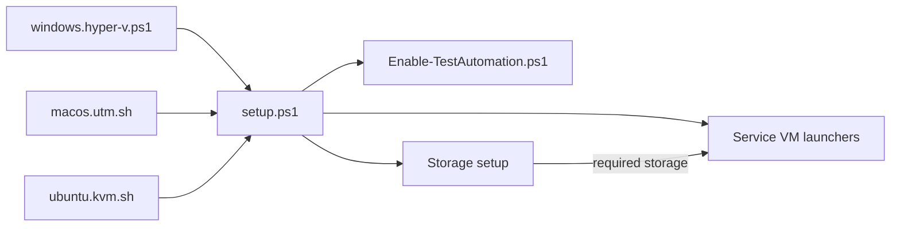
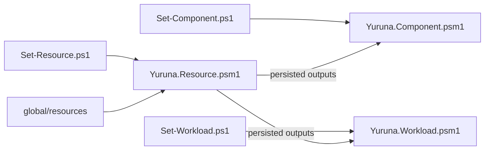
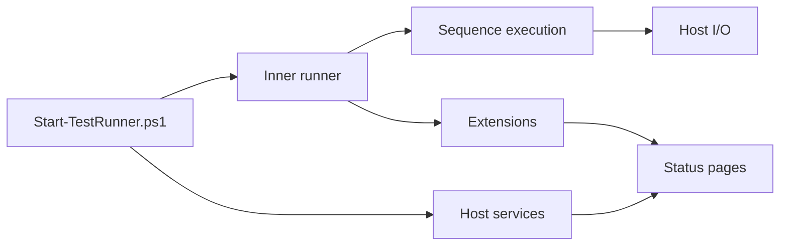
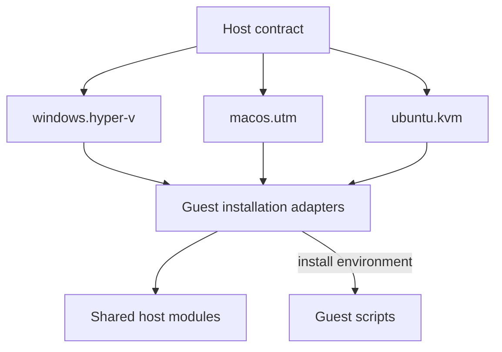
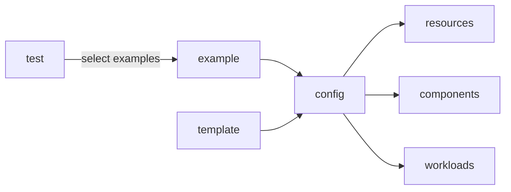
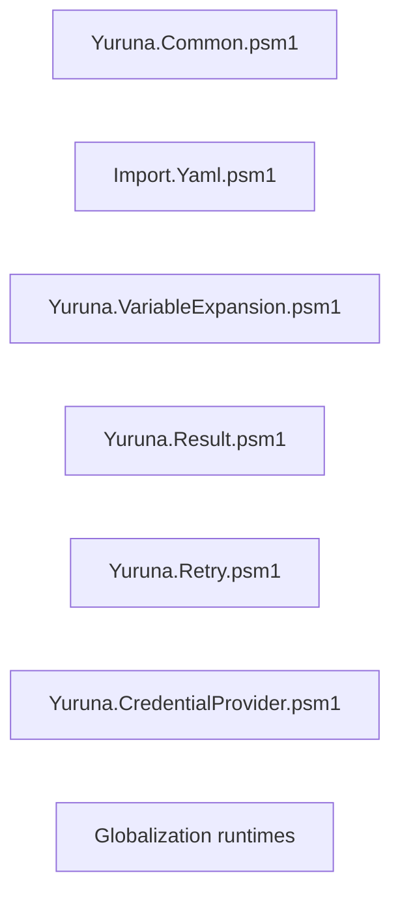
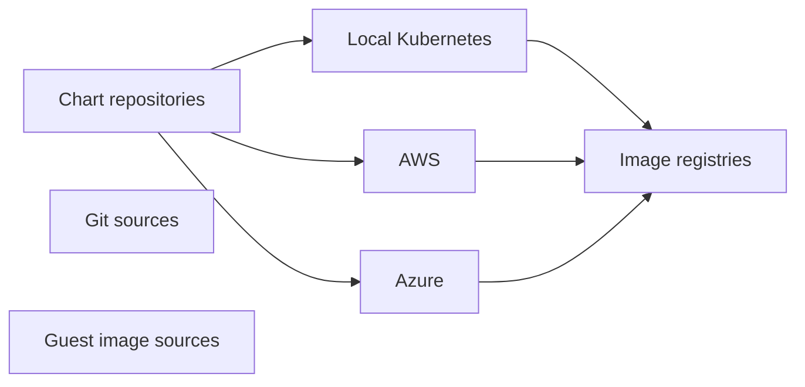

# Component breakdown

These seven views expand the context boundaries into concrete scripts, modules, directories, and external integrations.

Names and ordering match [Context and components](01-context-and-components.md).
Each diagram has at most seven child boxes; directory and module-family
aggregates are explained beside their source links. Edges show invocation,
consumption, or implementation dependencies, not network placement.

## Provisioning

```mermaid
flowchart LR
    windows-hyper-v["windows.hyper-v.ps1"]
    macos-utm["macos.utm.sh"]
    ubuntu-kvm["ubuntu.kvm.sh"]
    setup["setup.ps1"]
    enable-test-automation["Enable-TestAutomation.ps1"]
    test-lab["Storage setup"]
    test-service["Service VM launchers"]
    windows-hyper-v --> setup
    macos-utm --> setup
    ubuntu-kvm --> setup
    setup --> enable-test-automation
    setup --> test-lab
    setup --> test-service
    test-lab -->|required storage| test-service
```

The installer-to-setup edges denote setup progression, not a promise that every
installer invokes setup automatically. The bootstrappers are
[windows.hyper-v.ps1](../../install/windows.hyper-v.ps1),
[macos.utm.sh](../../install/macos.utm.sh), and
[ubuntu.kvm.sh](../../install/ubuntu.kvm.sh).
[setup.ps1](../../install/setup.ps1) calls the platform's
`Enable-TestAutomation.ps1`, prepares or mounts storage through
[Test.LocalLabStorage.psm1](../../test/modules/Test.LocalLabStorage.psm1) and
[Test.PoolStorage.psm1](../../test/modules/Test.PoolStorage.psm1), and invokes
[test/service](../../test/service) launchers. Storage precedes service seeds.
Standalone and lab modes select different service sets; health checks can adopt
existing service VMs, while `-Rebuild` requests recreation.

## Deploy engine

```mermaid
flowchart LR
    set-resource["Set-Resource.ps1"] --> yuruna-resource["Yuruna.Resource.psm1"]
    set-component["Set-Component.ps1"] --> yuruna-component["Yuruna.Component.psm1"]
    set-workload["Set-Workload.ps1"] --> yuruna-workload["Yuruna.Workload.psm1"]
    global-resources["global/resources"] --> yuruna-resource
    yuruna-resource -->|persisted outputs| yuruna-component
    yuruna-resource -->|persisted outputs| yuruna-workload
```

Sources: the three [Set- scripts](../../automation),
[Yuruna.Resource.psm1](../../automation/Yuruna.Resource.psm1),
[Yuruna.Component.psm1](../../automation/Yuruna.Component.psm1),
[Yuruna.Workload.psm1](../../automation/Yuruna.Workload.psm1), and
[global/resources](../../global/resources). The caller orders the phases;
`Set-Resource` does not call the other entry points. Project resource templates
can supplement global templates. Registry work delegates to
[Yuruna.Component.Registry.psm1](../../automation/Yuruna.Component.Registry.psm1).
[Data flows](03-data-flows.md#a-three-phase-deployment) details staging, tool
execution, outputs and failure behavior.

## Test harness

```mermaid
flowchart LR
    start-test-runner["Start-TestRunner.ps1"]
    invoke-test-runner-inner-loop["Inner runner"]
    test-sequence-runner["Sequence execution"]
    test-host-io["Host I/O"]
    test-service["Host services"]
    test-extension["Extensions"]
    test-status["Status pages"]
    start-test-runner --> invoke-test-runner-inner-loop
    start-test-runner --> test-service
    invoke-test-runner-inner-loop --> test-sequence-runner
    test-sequence-runner --> test-host-io
    invoke-test-runner-inner-loop --> test-extension
    test-service --> test-status
    test-extension --> test-status
```

[Start-TestRunner.ps1](../../test/Start-TestRunner.ps1) owns the resilient process
loop. Its diagram box also groups the fresh per-cycle supervisor,
[Invoke-TestCycleRunner.ps1](../../test/modules/Invoke-TestCycleRunner.ps1),
which reloads cycle logic before spawning the inner process.
[Invoke-TestRunnerInnerLoop.ps1](../../test/modules/Invoke-TestRunnerInnerLoop.ps1)
and [Test.RunnerInnerLoop.psm1](../../test/modules/Test.RunnerInnerLoop.psm1) own one
cycle. Sequence execution groups
[Test.SequencePlanner.psm1](../../test/modules/Test.SequencePlanner.psm1),
[Test.SequenceRunner.psm1](../../test/modules/Test.SequenceRunner.psm1),
[Test.SequenceEngine.psm1](../../test/modules/Test.SequenceEngine.psm1), and
[Test.Orchestrator.psm1](../../test/modules/Test.Orchestrator.psm1).
[Test.HostIO.psm1](../../test/modules/Test.HostIO.psm1),
[Test.Transport.psm1](../../test/modules/Test.Transport.psm1), and
[Test.OcrEngine.psm1](../../test/modules/Test.OcrEngine.psm1) supply console, SSH,
and screenshot/OCR paths.

[test/service](../../test/service) groups host status/config services and service
VM launchers; [test/extension](../../test/extension) groups authentication,
notification, caching, stash, downloads, pool control and telemetry. This
aggregate keeps the child set bounded as extensions grow.
[test/status](../../test/status) contains host pages; extensions supply data to
those pages and also serve their own UIs. State, watchdog and cleanup are
expanded in [Lifecycle](04-lifecycle-state.md), and daemon placement in
[Deployment](06-deployment.md).

## Providers

```mermaid
flowchart TB
    yuruna-host-contract["Host contract"]
    windows-hyper-v["windows.hyper-v"]
    macos-utm["macos.utm"]
    ubuntu-kvm["ubuntu.kvm"]
    host-guest["Guest installation adapters"]
    host-modules["Shared host modules"]
    guest["Guest scripts"]
    yuruna-host-contract --> windows-hyper-v
    yuruna-host-contract --> macos-utm
    yuruna-host-contract --> ubuntu-kvm
    windows-hyper-v --> host-guest
    macos-utm --> host-guest
    ubuntu-kvm --> host-guest
    host-guest --> host-modules
    host-guest -->|install environment| guest
```

The [contract](../../host/Yuruna.Host.Contract.psm1) is implemented by
[Hyper-V](../../host/windows.hyper-v/modules/Yuruna.Host.psm1),
[UTM](../../host/macos.utm/modules/Yuruna.Host.psm1), and
[KVM](../../host/ubuntu.kvm/modules/Yuruna.Host.psm1). Its operations cover image
acquisition, VM lifecycle, snapshots, console I/O, address discovery and
network setup. `host/<provider>/guest.<family>/Get-Image.ps1` and `New-VM.ps1`
are installation adapters, for example the
[KVM Ubuntu 26 adapter](../../host/ubuntu.kvm/guest.ubuntu.server.26/New-VM.ps1).
[host/modules](../../host/modules) centralizes image downloads, provenance and
cleanup; [host/vmconfig](../../host/vmconfig) supplies seeds and overlays, rendered
by [Yuruna.CloudInitTemplate.psm1](../../automation/Yuruna.CloudInitTemplate.psm1).

[guest](../../guest) holds Amazon Linux 2023, Ubuntu Server 24/26, Windows 11,
and macOS 26 scripts. This family inventory is not an all-to-all support
matrix: only existing provider/guest adapter directories represent implemented
installation combinations. Service-VM adapters use the same provider mechanism
but are distinct from workload guest families.

## Project data

```mermaid
flowchart LR
    example["example"]
    template["template"]
    test["test"]
    config["config"]
    resources["resources"]
    components["components"]
    workloads["workloads"]
    example --> config
    template --> config
    config --> resources
    config --> components
    config --> workloads
    test -->|select examples| example
```

Sources: yuruna-project's [example](https://github.com/alissonsol/yuruna-project/tree/main/example),
[template](https://github.com/alissonsol/yuruna-project/tree/main/template), and [test](https://github.com/alissonsol/yuruna-project/tree/main/test).
The template is itself a project root (`template/config`, not
`template/<project>/config`). Full application examples such as
[website](https://github.com/alissonsol/yuruna-project/tree/main/example/website) contain cloud configuration,
resource/image/chart inputs and tests; sequence-only examples need not contain
all four directories. Configuration points to those inputs.
[test.runner.yml](https://github.com/alissonsol/yuruna-project/blob/main/test/test.runner.yml) selects sequences
and named test sets; authentication uses extension-backed vault lookups.
[Data model](05-data-model.md) distinguishes runtime relationships from directory
containment.

## Shared modules

```mermaid
flowchart LR
    yuruna-common["Yuruna.Common.psm1"]
    import-yaml["Import.Yaml.psm1"]
    yuruna-variable-expansion["Yuruna.VariableExpansion.psm1"]
    yuruna-result["Yuruna.Result.psm1"]
    yuruna-retry["Yuruna.Retry.psm1"]
    yuruna-credential-provider["Yuruna.CredentialProvider.psm1"]
    globalization["Globalization runtimes"]
```

Sources: [Yuruna.Common.psm1](../../automation/Yuruna.Common.psm1),
[Import.Yaml.psm1](../../automation/Import.Yaml.psm1),
[Yuruna.VariableExpansion.psm1](../../automation/Yuruna.VariableExpansion.psm1),
[Yuruna.Result.psm1](../../automation/Yuruna.Result.psm1),
[Yuruna.Retry.psm1](../../automation/Yuruna.Retry.psm1), and
[Yuruna.CredentialProvider.psm1](../../automation/Yuruna.CredentialProvider.psm1).
These are representative modules, not an exhaustive list or an import chain;
`Yuruna.Common` is a dependency-free leaf. Logging/validation
and provider/harness helpers retain their source namespaces; `Test.*` denotes
harness code and `Yuruna.*` product automation. The separate globalization
aggregate includes [Test.Locale.psm1](../../test/modules/Test.Locale.psm1),
[Test.Message.psm1](../../test/modules/Test.Message.psm1), browser helpers and Go
catalog consumers, with [globalization](../../globalization) as their data
source. [Globalization](07-globalization.md) expands actual consumer coverage.

## External targets

```mermaid
flowchart LR
    global-resources-localhost["Local Kubernetes"]
    global-resources-aws["AWS"]
    global-resources-azure["Azure"]
    yuruna-component-registry["Image registries"]
    yuruna-workload["Chart repositories"]
    yuruna-github-source["Git sources"]
    yuruna-image["Guest image sources"]
    global-resources-localhost --> yuruna-component-registry
    global-resources-aws --> yuruna-component-registry
    global-resources-azure --> yuruna-component-registry
    yuruna-workload --> global-resources-localhost
    yuruna-workload --> global-resources-aws
    yuruna-workload --> global-resources-azure
```

Sources: [localhost](../../global/resources/localhost),
[aws](../../global/resources/aws), [azure](../../global/resources/azure),
[Yuruna.Component.Registry.psm1](../../automation/Yuruna.Component.Registry.psm1),
[Yuruna.Workload.psm1](../../automation/Yuruna.Workload.psm1),
[Yuruna.GitHubSource.psm1](../../automation/Yuruna.GitHubSource.psm1), and
[Yuruna.Image.psm1](../../host/modules/Yuruna.Image.psm1).
Cloud providers, OCI registries, Helm repositories, Git endpoints and image
publishers are aggregates of the integrations those sources consume. Git/image
sources feed installation and tests as well as deployment; those boxes have no
implied dependency on each other. GCP is omitted because no checked-in GCP
resource template implements that target.

---

Back to [Architecture](../architecture.md) · [Design overview](README.md)
