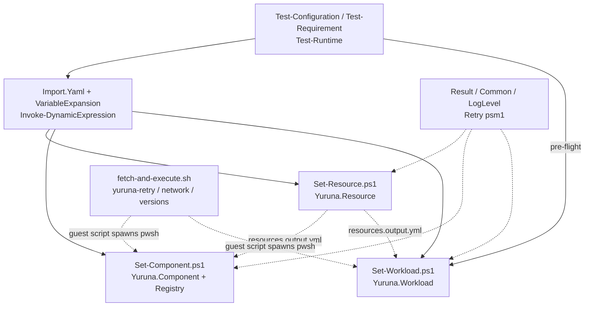
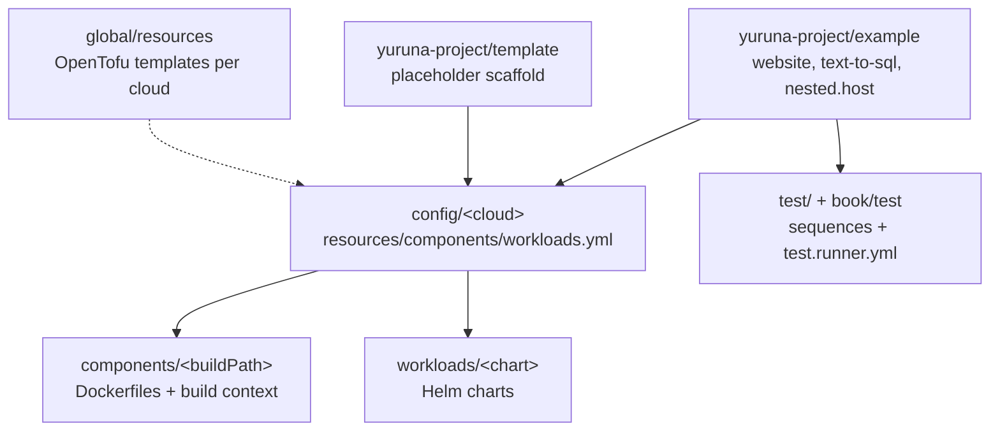
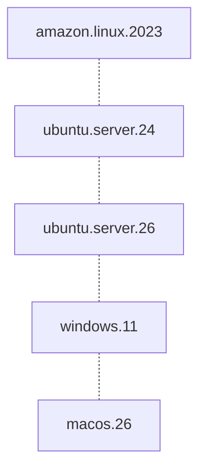
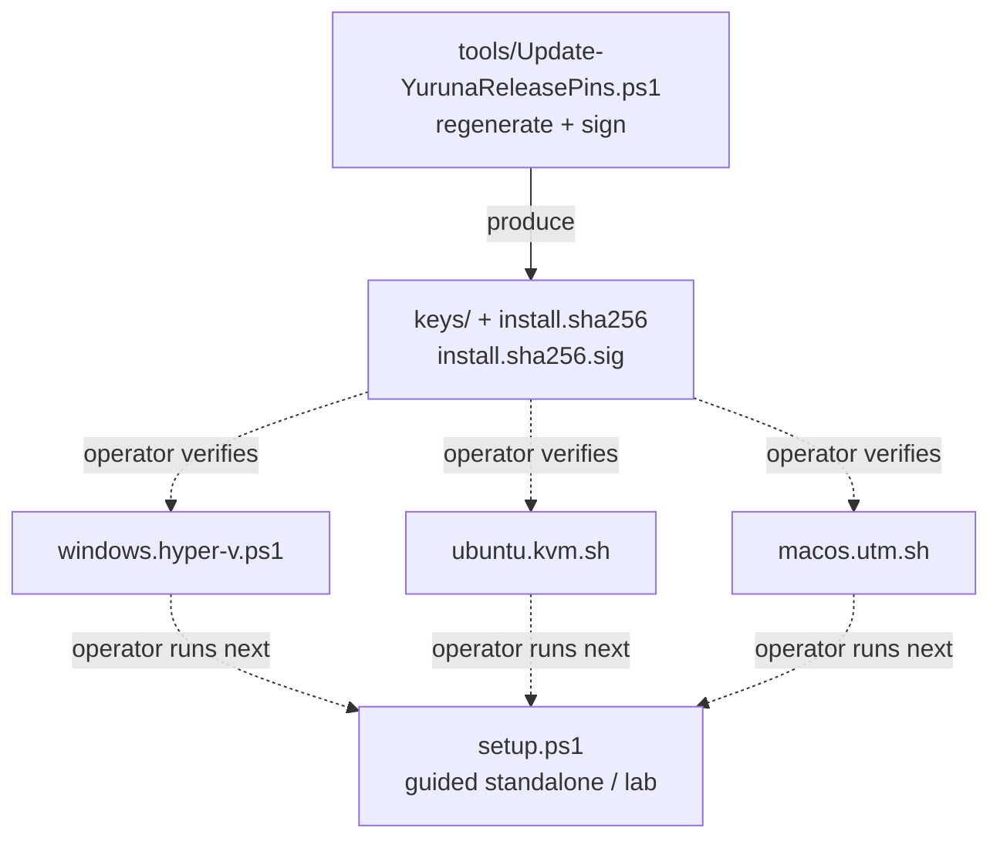
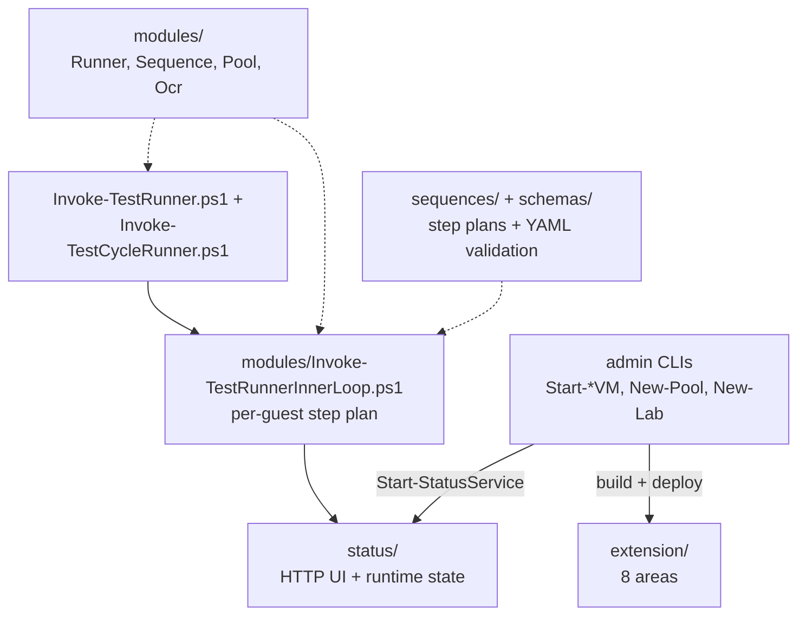
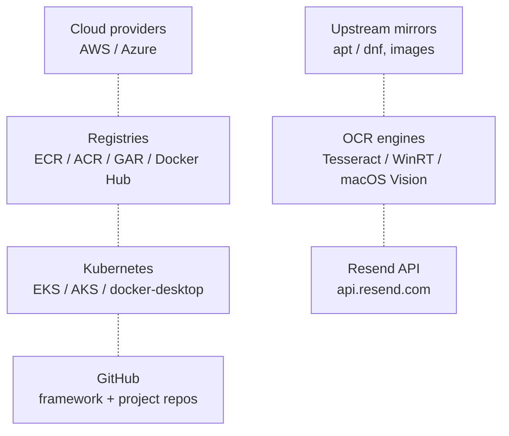

# Component breakdown

> One sentence: each of the seven top-level blocks opened up into at most seven
> real scripts, modules or directories.

See [Design overview](00-index.md) · [Context and components](01-context-and-components.md) ·
[Yuruna Architecture](../architecture.md).

One section per block, in the order [doc 1](01-context-and-components.md) draws
them. Where a block holds more than seven children, siblings are folded into a
named aggregate and the rest are named in prose rather than drawn.

## Deploy Engine — `automation/`

```mermaid
flowchart TD
    set-resource[Set-Resource.ps1<br/>Yuruna.Resource]
    set-component[Set-Component.ps1<br/>Yuruna.Component + Registry]
    set-workload[Set-Workload.ps1<br/>Yuruna.Workload]
    validation[Test-Configuration / Test-Requirement<br/>Test-Runtime]
    config-parse[Import.Yaml + VariableExpansion<br/>Invoke-DynamicExpression]
    cross-cutting[Result / Common / LogLevel<br/>Retry psm1]
    guest-runtime[fetch-and-execute.sh<br/>yuruna-retry / network / versions]

    validation --> config-parse
    config-parse --> set-resource
    config-parse --> set-component
    config-parse --> set-workload
    validation -->|pre-flight| set-workload
    set-resource -.->|resources.output.yml| set-component
    set-resource -.->|resources.output.yml| set-workload
    cross-cutting -.-> set-resource
    cross-cutting -.-> set-component
    cross-cutting -.-> set-workload
    guest-runtime -.->|guest script spawns pwsh| set-component
    guest-runtime -.->|guest script spawns pwsh| set-workload
```

**The phases do not chain.** Each of `Set-Resource.ps1`, `Set-Component.ps1`
and `Set-Workload.ps1` calls exactly one `Publish-*List` and never invokes
another phase script; `automation/yuruna.ps1` runs exactly one branch of its
`switch -Exact ($operation)` per process (`requirements | clear | validate |
resources | components | workloads`). The only coupling between phases is the
generated `config/<cloud>/resources.output.yml`, drawn as the dashed edges.
Ordering is the caller's job — the operator's command sequence, or a project's
in-guest workload script spawning one `pwsh` per phase.

Each `Publish-*List` re-runs its matching `Confirm-*List`
(`Yuruna.Validation.psm1`) before deploying, and `Set-Workload.ps1` is the one
place the engine auto-runs a validator: it invokes `Test-Runtime.ps1` as
pre-flight and exits 1 on failure. `Test-Runtime.ps1` itself parses no YAML —
it shells out to docker/kubectl/helm/mkcert and returns a bool.

`Yuruna.LogLevel.psm1` is imported `-Global -Force` as the first statement of
every entry point and owns `Resolve-YurunaRootSet`, which resolves the
yuruna/project/config roots and gates the run before any publisher loads.
`Yuruna.Result.psm1` and `Yuruna.Common.psm1` are the other all-three
dependencies. `Yuruna.Retry.psm1` reaches only the resource and workload
publishers, and `Yuruna.DeploymentKind.psm1` only the workload publisher and
validation. `Yuruna.Log.psm1` lives here but has no deploy-path importer — it is
used by the test harness.

Not drawn, of the 13 top-level `.ps1` and 22 `.psm1` files in `automation/`:

- `Invoke-Clear.ps1` (`Yuruna.Clear`) — teardown via `tofu destroy`, driven by
  the deployed-resource keys in `resources.output.yml` rather than the forward
  `resources.yml`, so config drift after deploy never blocks cleanup.
- `Get-SystemDiagnostic.ps1` — read-only host/cluster diagnostic. No deploy
  phase calls it; the callers are the harness
  (`test/modules/Invoke-TestRunnerInnerLoop.ps1`, `test/modules/Test.Diagnostic.psm1`)
  and the status service.
- `Set-HostAlias.ps1`, `Test-YurunaHost.ps1`, `Check-DependencyVersion.ps1`,
  `context-copy.ps1` — standalone operator utilities.
- `Yuruna.Requirement.yml` — the editable manifest of probe commands and minimum
  versions that `Test-Requirement.ps1` reads.
- `Yuruna.CredentialProvider.psm1` — first-wins registry-login providers matched
  by URL pattern (`azurecr`, `ecr`, `gar`, `dockerhub`, `docker-generic`),
  behind the component push.
- Five host-provisioning helpers that serve other layers: `Yuruna.HostSetup`,
  `Yuruna.GuestSeed`, `Yuruna.CloudInitTemplate`, `Yuruna.HostRedirect`,
  `Yuruna.GitHubSource`.

## Project & Global Data — `global/`, `yuruna-project/`

```mermaid
flowchart TD
    examples[yuruna-project/example<br/>website, text-to-sql, nested.host]
    template[yuruna-project/template<br/>placeholder scaffold]
    cloud-config[config/&lt;cloud&gt;<br/>resources/components/workloads.yml]
    components-dir[components/&lt;buildPath&gt;<br/>Dockerfiles + build context]
    workloads-dir[workloads/&lt;chart&gt;<br/>Helm charts]
    global-resources[global/resources<br/>OpenTofu templates per cloud]
    sequences[test/ + book/test<br/>sequences + test.runner.yml]

    examples --> cloud-config
    template --> cloud-config
    cloud-config --> components-dir
    cloud-config --> workloads-dir
    global-resources -.-> cloud-config
    examples --> sequences
```

`yuruna-project/template` **is** the scaffold — there is no `template/<project>`
level; only `example/` has one. Of its three examples, `nested.host` is
deliberately shaped differently: it carries only `README.md` and
`test/nested.host.yml` (the framework installing itself inside a nested VM via
`install/ubuntu.kvm.sh`), with no `config/`, `components/`, `workloads/` or
`resources/` tree at all.

The **sequences** box aggregates three roots that hold sequence YAML in that
repo: each project's own `test/` folder, the repo-level `test/test.runner.yml`
cycle plan, and `book/test/` — four narrated sequences (`ch01`/`ch02`, each with
a `.no-break` variant) that the shipped `test.runner.yml` names first.

Project `resources/` folders in the examples hold only placeholders, so resource
templates resolve to `global/resources/<template>` — a two-step fallback
implemented twice, in `Yuruna.Resource.psm1` and again in
`Yuruna.Validation.psm1`. `global/resources/` has `aws`, `azure` and
`localhost`; `global/config/` holds only `gcp` with a credential stub and no
matching templates, so `gcp` remains planned. `global/components/` and
`global/workloads/` hold placeholders.

Extension state is not project data and lives under `test/status/extension/`:
`vault.yml` (runtime-generated) and `users.yml` under `authentication/`,
`transports.yml` under `notification/`. All are git-ignored and seeded from
`*.template` files under `test/extension/`.

## Guest Workloads — `guest/`

```mermaid
flowchart TD
    amazon-linux[amazon.linux.2023]
    ubuntu-24[ubuntu.server.24]
    ubuntu-26[ubuntu.server.26]
    windows-11[windows.11]
    macos-26[macos.26]

    amazon-linux -.- ubuntu-24 -.- ubuntu-26 -.- windows-11 -.- macos-26
```

Each holds in-guest workload scripts named `<guest>.<workload>.sh|ps1`. The
common set is `update`, `code`, `k8s`, `n8n`, `openclaw`, `postgresql` — Amazon
Linux carries no `k8s`, Windows 11 carries `update`/`code`/`k8s` only, and
macOS 26 carries `update` alone. How they arrive differs per guest:

- **Ubuntu / Amazon Linux** run
  `/usr/local/lib/yuruna/fetch-and-execute.sh guest/<name>/<name>.<workload>.sh` —
  the copy cloud-init bakes in from `automation/fetch-and-execute.sh`, alongside
  `yuruna-retry.sh` (sourced unconditionally by every fetcher-run Linux workload
  script; the pool-control-service, stash-service and download-agent-service
  bring-up scripts source it behind an `if [ -r ... ]` guard because they run
  before `update.sh` has baked it in), `yuruna-network.sh` and
  `yuruna-versions.sh`.
- **Windows 11** has no automated path:
  `test/sequences/workload.guest.windows.11.yml` is a placeholder with
  `workload: []`, and the `irm | iex` one-liner in `guest/windows.11/README.md`
  is operator-run.
- **macOS 26** has no automated path either — Setup Assistant is not automated,
  so `macos.26.update.sh` is operator-run.
- The **pool-control-service**, **stash-service** and **download-agent-service**
  guests bypass the fetcher: their cloud-init pulls `yuruna-archive.tar.gz`
  (falling back to `git clone`) and runs
  `bash .../guest/ubuntu.server.26/ubuntu.server.26.<svc>.sh` directly. The
  **caching-proxy-service** guest has no script here at all — its seed pulls
  per-file Go source from `/yuruna-repo/` instead.

`ubuntu.server.26` is the only guest carrying service bring-up scripts, which is
why the three archive-fetching infra VMs are all Ubuntu 26 regardless of the
guests a cycle tests.

## Host Provisioning — `host/`

```mermaid
flowchart TD
    windows-hyperv[windows.hyper-v<br/>provider]
    ubuntu-kvm[ubuntu.kvm<br/>provider]
    macos-utm[macos.utm<br/>provider]
    host-contract[Yuruna.Host.Contract.psm1<br/>37 verbs, 11 groups]
    host-modules[modules/<br/>6 shared modules]
    vmconfig[vmconfig/<br/>6 seed families]
    infra-guests[guest.*-service/<br/>4 infra guests]

    host-contract --> windows-hyperv
    host-contract --> ubuntu-kvm
    host-contract --> macos-utm
    host-modules -.-> host-contract
    vmconfig -.-> host-contract
    infra-guests -.-> host-contract
```

`$script:YurunaHostContract` **declares** 37 verbs across eleven groups — VM
lifecycle, VM inventory, disk snapshots, console open/restart, image
acquisition, input + capture (`Send-Text`, `Send-Key`, `Send-Click`,
`Get-VMScreenshot`, `Get-VMConsoleHandle`), guest networking probes, external
network, host port mapping, caching-proxy-service probes, and host proxy
management. The coverage check is **warn-only**: each driver calls
`Assert-YurunaHostContractCoverage` and discards the result, and the function
warns and returns `$false` rather than throwing, so a missing verb produces one
warning and load continues. Each driver also passes a hand-maintained copy of
its export list rather than its own `Export-ModuleMember` block.

Each provider ships a driver `modules/Yuruna.Host.psm1`, four host-level
operator scripts (`Enable-TestAutomation.ps1`, `Disable-TestAutomation.ps1`,
`Sync-HostConfiguration.ps1`, `Remove-OrphanedVMFiles.ps1` — the last being the
only consumer of the `Yuruna.VMCleanup` module), and one `guest.<key>/` folder
per supported guest holding `Get-Image.ps1` + `New-VM.ps1` + `README.md`.
`macos.utm/` guest folders add a `config.plist.template` UTM bundle template,
and that provider alone carries `guest.macos.26`, `Remove-StaleDhcpLease.ps1`,
`Start-CachingProxyServiceForwarder.ps1` and `brew-doctor-fix.sh`. Eight guest
folders per provider, nine for `macos.utm`.

`host/modules/Yuruna.DownloadAgent.psm1` has the strictest load rule of the six
shared modules: it imports nothing and exports exactly three uniquely-named
functions (`Resolve-DownloadAgentEndpoint`, `Get-DownloadAgentImageMetadata`,
`Request-DownloadAgentImage`). The per-host drivers wrap `Save-CachedHttpUri` to
inject their own cache resolver and the image helpers resolve that wrapper *by
name*, so a module that re-exported it would silently take the command-table
slot and send every download direct. Nothing in the module throws either —
discovery collapses to `''` and the request protocol to an outcome string,
because every call sits in front of a `Get-Image.ps1` run whose fallback is the
plain origin path.

`host/vmconfig/` is flat: six guest families (`amazon.linux.2023`,
`caching-proxy-service`, `download-agent-service`, `pool-control-service`,
`stash-service`, `ubuntu.server`) × five files each — `<family>.base.user-data`,
`<family>.meta-data`, and one overlay per hypervisor
(`<family>.hyperv|kvm|utm.overlay.yml`) — plus one shared
`extension-service.network-config` the three service families seed from. The
base+overlay merge is what makes the seed host-neutral, and `ubuntu.server.24`
and `ubuntu.server.26` share one base. There is no `windows.11` or `macos.26`
family: Windows guests seed from a per-guest
`guest.windows.11/vmconfig/autounattend.xml` burned into a seed ISO — labelled
`OEMDRV` on Hyper-V and UTM, `AUTOUNATTEND` on KVM, where Setup finds the file
by root-of-CD scan instead — and macOS 26 seeds from nothing.

`infra-guests` is a logical aggregate — those four directories live nested under
each provider, not at the `host/` root (see the
[≤7 rule](00-index.md#the-7-rule--grouping-decisions)).

## Installers — `install/`, `tools/`

```mermaid
flowchart TD
    win-install[windows.hyper-v.ps1]
    kvm-install[ubuntu.kvm.sh]
    utm-install[macos.utm.sh]
    setup[setup.ps1<br/>guided standalone / lab]
    integrity[keys/ + install.sha256<br/>install.sha256.sig]
    release-pins[tools/Update-YurunaReleasePins.ps1<br/>regenerate + sign]

    release-pins -->|produce| integrity
    integrity -.->|operator verifies| win-install
    integrity -.->|operator verifies| kvm-install
    integrity -.->|operator verifies| utm-install
    win-install -.->|operator runs next| setup
    kvm-install -.->|operator runs next| setup
    utm-install -.->|operator runs next| setup
```

**Two stages, and only the first is signed.** The three bootstrappers install
packages and clone the repo, then stop — none of them invokes `setup.ps1`, so
those edges are operator actions the `install/README.md` quickstart prescribes,
not calls. `install/setup.ps1` runs afterwards and installs nothing — it asks
what it cannot infer, then orchestrates the scripts that already do each job
(`Enable-TestAutomation`, `New-LocalLabStorage`, the service-VM stop/start
pairs, `New-Pool`, `Set-LabToken`). It offers two modes, **Standalone host** and
**Lab**, is re-runnable (re-run it to resume a run interrupted halfway), and
logs every question, answer, step and child exit code to
`test/status/log/setup.<yyyy.MM.dd.HH.mm>.log`. Storage is configured *before*
the service VMs in both modes, because the stash service exits 1 without
configured storage and the caching proxy bakes storage into its guest seed at
build time. The service VMs are deliberately never "already true": each run
removes and rebuilds them so a re-run applies a change rather than preserving
what the change was meant to replace.

`install.sha256` covers exactly the three bootstrapper files — `setup.ps1` is
not in the manifest, because by the time it runs the operator already has a
verified checkout.

**No installer verifies itself.** The default one-liner path is unverified by
construction, as `install/README.md` states. Verification is a manual pre-run
snippet from that README (`RSACryptoServiceProvider.FromXmlString` +
`VerifyData` on Windows, `openssl dgst -sha256 -verify` elsewhere) — hence the
dashed, operator-labelled edges. `tools/Update-YurunaReleasePins.ps1`
regenerates `install/install.sha256`, signs it, self-verifies against
`install/keys/yuruna-release-signing.pub.pem`, and gates the release on
`test/Test-AsciiNoBom.ps1`.

The manifest and signature are **per release tag**, so they are expected to be
stale against a moving `main`: the verified-install path only works from
`refs/tags/<calver>`. `install/README.md` also carries the three one-liners, the
`?nocache=<timestamp>` convention, and the `-PinVersion` / `PIN_VERSION` /
`--pin-version` pinning path.

The other three `tools/` entries are development gates rather than release
artifacts, so they are not drawn: `Invoke-Lint.ps1` runs PSScriptAnalyzer over
`git ls-files --cached --others --exclude-standard` (tracked + new, minus
`.gitignore`) so a working tree the harness has run in does not drown the scan
in generated findings; `Sync-ExtensionSdk.ps1` mirrors the extension SDK;
`Update-TestConfigNaming.ps1` migrates `test.config.yml` key names.
`tools/githooks/pre-commit` is the local hook.

## Test Harness — `test/`

```mermaid
flowchart TD
    runner[Invoke-TestRunner.ps1 +<br/>Invoke-TestCycleRunner.ps1]
    inner[modules/Invoke-TestRunnerInnerLoop.ps1<br/>per-guest step plan]
    modules[modules/<br/>Runner, Sequence, Pool, Ocr]
    plans[sequences/ + schemas/<br/>step plans + YAML validation]
    status[status/<br/>HTTP UI + runtime state]
    extensions[extension/<br/>8 areas]
    admin[admin CLIs<br/>Start-*VM, New-Pool, New-Lab]

    runner --> inner
    inner --> status
    modules -.-> runner
    modules -.-> inner
    plans -.-> inner
    admin -->|Start-StatusService| status
    admin -->|build + deploy| extensions
```

**Three processes, not two.** `Invoke-TestRunner.ps1` is a thin outer entry
point that calls `Invoke-RunnerOuterLoop`; it resolves
`Invoke-TestCycleRunner.ps1` and passes it as `CycleScript`, falling back to
in-process cycles only when that file is absent. The cycle runner runs **exactly
one cycle per fresh process**, so an edit to cycle logic lands on the next cycle
instead of needing a runner restart; it reports transient outcomes through
`runner.cycle.outcome.json`. It in turn spawns
`modules/Invoke-TestRunnerInnerLoop.ps1`, which drives the per-guest steps. Two
more detached children are fired per cycle from the outer loop and never waited
on — `modules/Invoke-PoolStorageDrain.ps1` (archive replication) and
`modules/Invoke-PoolPushForwarder.ps1` (event push) — so a dead NAS or a dead
aggregator cannot slow a cycle.

`test/modules/` is the implementation layer — 91 `.psm1` modules, those three
`.ps1` entry points and 163 Pester files — including everything the runner boxes
delegate to: `Test.RunnerOuterLoop`, `Test.RunnerInnerLoop`,
`Test.RunnerWatchdog`, `Test.RunnerState`, `Test.SequenceEngine`,
`Test.OcrEngine` (built-in engines `tesseract`, `winrt`, `macos-vision`),
`Test.Status`, `Test.Extension`, `Test.ExtensionService`, `Test.PoolAdmin` /
`Test.PoolStorage` / `Test.PoolSync`.

`test/sequences/` is flat — 19 files, no `gui/` or `ssh/` subdirectories. The
distinction is per file: `keystrokeMechanism: gui` in the plain YAMLs and
`keystrokeMechanism: ssh` in the `.ssh.yml` filename variants. The cycle plan
the harness executes (`test.runner.yml`) and the project's own sequences live in
the **project** repo, not here.

`test/schemas/` holds 13 schemas covering more than sequences: sequence,
snippets, actions and orchestration-sequence (sequences); pools, pool-test-sets,
guests.compatibility, host.registration (pool); extension-config,
notification.transports (extensions); users, vault, lab.vault (auth state).
`test.config.yml` has no schema — `test/Test-Config.ps1` validates it directly.

`test/extension/` has eight areas. Seven ship `<area>.contract.yml` +
`<area>.config.yml` and load through `Test.Extension.psm1`; the eighth,
`extension-sdk/`, ships neither — it is a Go module, not a PowerShell extension.
Four of the seven (`download-agent-service`, `pool-aggregator-service`,
`pool-control-service`, `stash-service`) also declare a `service:` block in
their config, which is how `Test.ExtensionService.psm1` discovers a service's VM
name, health port, start and stop scripts, marker key and write gate without a
hardcoded roster — a new extension service is discovered by existing.
`pool-aggregator-service` is the one area whose manifest carries
`hostedIn: caching-proxy-service` instead of a `vmName`: it runs inside the
cache VM rather than owning one.

**`extension-sdk/` is copied, not imported.** Its three standard-library-only
packages — `beacon` (presence hello/re-announce/goodbye), `pool` (typed read
client for the aggregator) and `labgate` (the lab-token write gate) — are
mirrored byte-identically into `<area>/server/internal/yex/` by
`tools/Sync-ExtensionSdk.ps1`, which discovers targets by scanning for
`test/extension/<area>/server/go.mod`. Three areas match today
(`download-agent-service`, `pool-control-service`, `stash-service`);
`caching-proxy-parser-service` and `pool-aggregator-service` keep their `go.mod`
at the area root and are not mirror targets. Each daemon is compiled *inside its
own VM* from a build directory holding only `<area>/server/`, so a sibling
module would not be there when the compiler looks — the copy is what makes each
service independently buildable. `Test.ExtensionService.Tests.ps1` fails the
suite when a mirror drifts.

`test/pool/` holds `examples/` only (`pools.yml`, `guests.compatibility.yml`);
the live intent store is a separate git repo at `pool.intentGitUrl`, which the
11 pool admin CLIs clone to `<runtime>/pool-intent-admin` — the 8 that call
`Publish-YurunaPoolIntent` commit and push (`New-Pool`, `Remove-Pool`,
`Add-HostToPool`, `Remove-HostFromPool`, `Remove-PoolHost`,
`Set-PoolDesiredState`, `Set-PoolTestSet`, `Set-PoolTestSetDefinition`), while
`Get-PoolIntent`, `Get-PoolStatus` and `Test-PoolIntent` only read.
`Remove-PoolHost` is the widest of them: it also deletes the retired host's NAS
records. `New-Lab.ps1` creates a lab's storage folders, intent repository and
lab vault; on a second lab it reuses the storage root and the share credentials
the machine already holds, since the share accounts are machine-wide rather than
per-lab. `New-LocalLabStorage.ps1` wraps it for a machine that serves its own
storage, adding the OS accounts, SMB server, shares, loopback aliases, mounts,
and `networkStorage.*` config; `Clear-LocalLabStorage.ps1` is its withdrawal.
`Set-LabToken.ps1` is the joining side: it redeems the dashboard's rotating
6-character Lab token at the aggregator's `POST /api/v1/lab-token` and stores the
returned shared lab-auth-token in this host's vault, so the secret is never read
off the proxy or typed by hand. `Convert-ToPoolWorker.ps1` is the whole-machine
version of that join: it syncs the lab's configuration onto a standalone machine
and retires the local services the lab already provides.

Of the 46 top-level `.ps1` files, the ones outside the runner/pool/lab groups
are the service lifecycle pairs (`Start-`/`Stop-` for the status service, config
service, and the four service VMs), the one-shot developer entry points
(`Invoke-TestProject.ps1`, `Invoke-TestSequence.ps1`), the validators
(`Test-Config.ps1`, `Test-CachingProxyService.ps1`, `Test-TesseractOcr.ps1`,
`Test-WinRtOcr.ps1`, `Test-AsciiNoBom.ps1`) and the cache-VM utilities
(`Move-CachingProxyService.ps1`, which hands a warm squid cache to a replacement
VM through a temporary parent-child hierarchy, and
`Repair-CachingProxyServiceForwarder.ps1`).

## External Services

```mermaid
flowchart TD
    clouds[Cloud providers<br/>AWS / Azure]
    registries[Registries<br/>ECR / ACR / GAR / Docker Hub]
    clusters[Kubernetes<br/>EKS / AKS / docker-desktop]
    github[GitHub<br/>framework + project repos]
    mirrors[Upstream mirrors<br/>apt / dnf, images]
    ocr[OCR engines<br/>Tesseract / WinRT / macOS Vision]
    email[Resend API<br/>api.resend.com]

    clouds -.- registries -.- clusters -.- github
    mirrors -.- ocr -.- email
```

Registry coverage follows the `Yuruna.CredentialProvider.psm1` provider list
(`azurecr`, `ecr`, `gar`, `dockerhub`, `docker-generic`), not just the two
managed clouds. GCP/GKE are planned, not available. The Resend edge is the
framework's only runtime email egress —
`test/extension/notification/default.psm1` POSTs to
`https://api.resend.com/emails` using `transports.resend.apiKey`.

---

LICENSEURI https://yuruna.link/license

Copyright (c) 2019-2026 by Alisson Sol et al.

Last review: 2026.08.07
