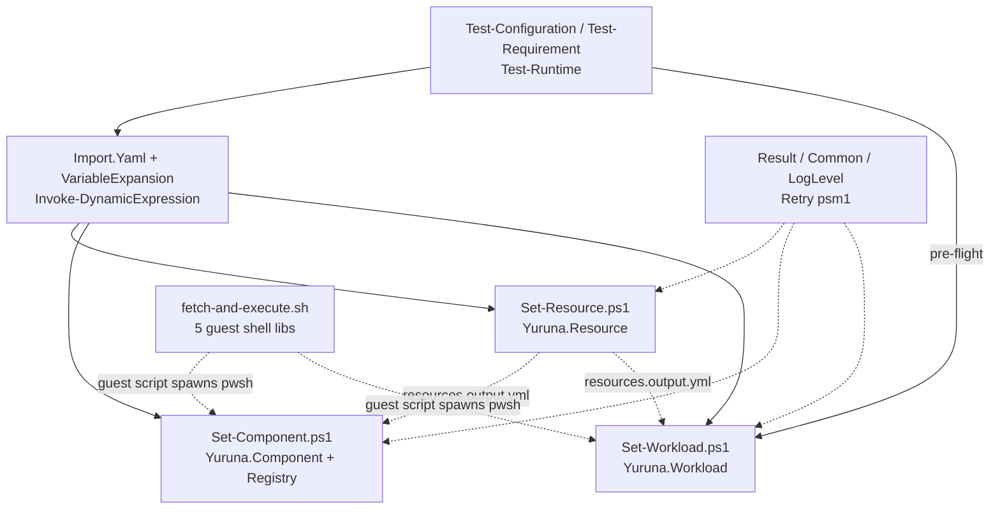
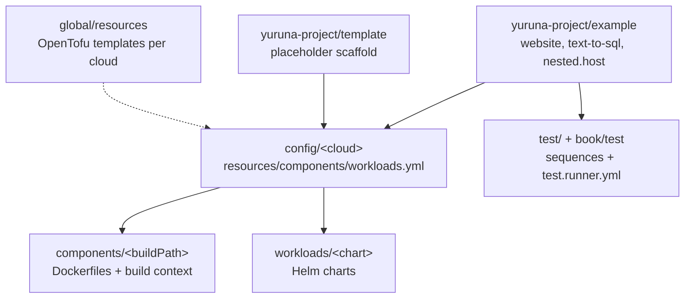
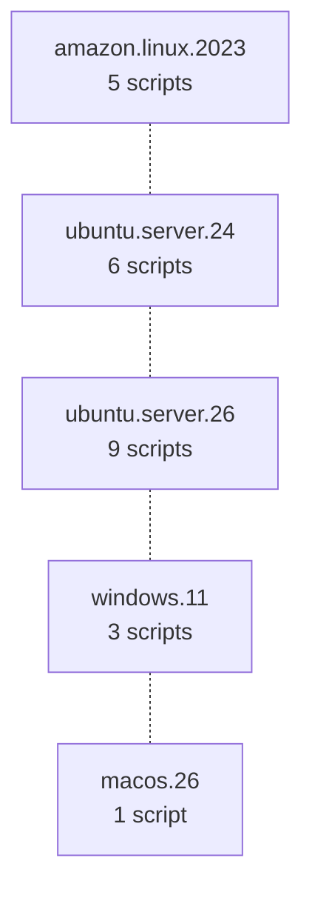
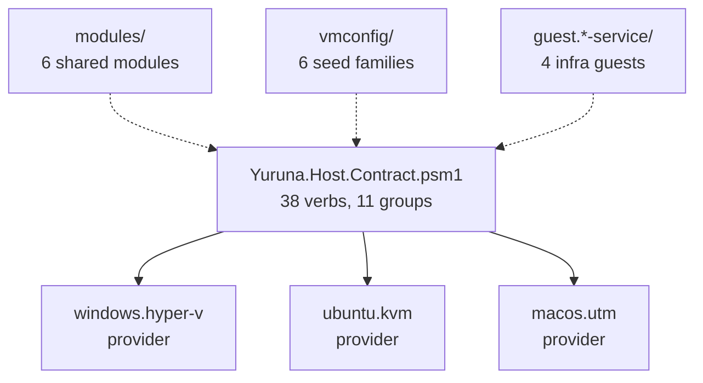
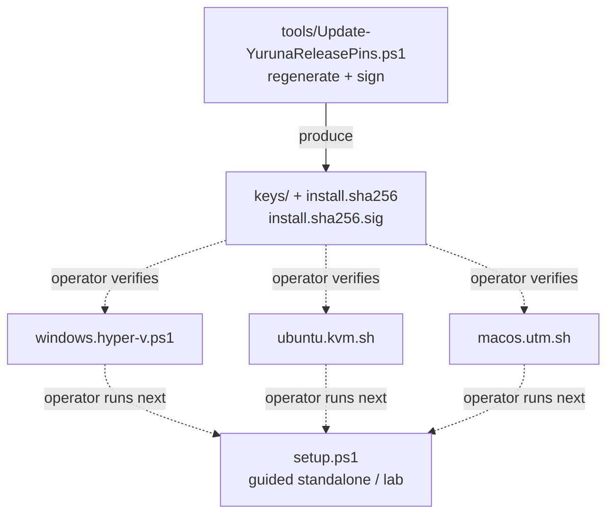
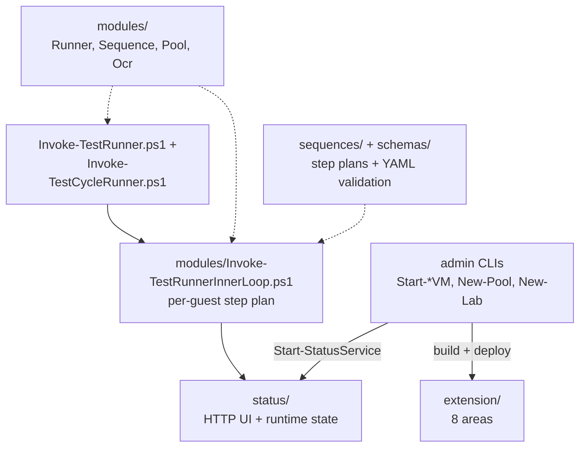
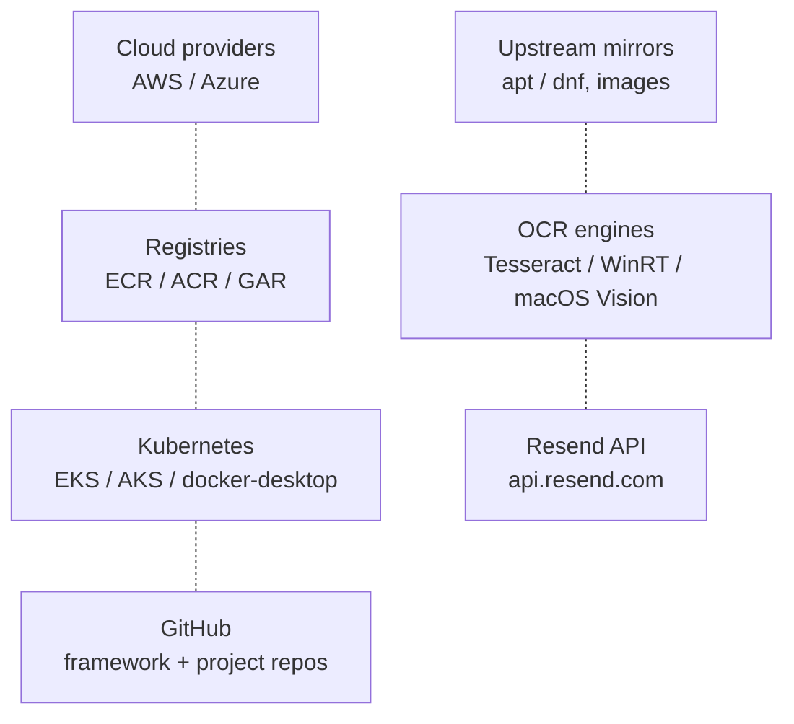

# Component breakdown

> One sentence: each of the seven top-level blocks opened up into at most seven
> real scripts, modules or directories.

See [Design overview](00-index.md) · [Context and components](01-context-and-components.md) ·
[Yuruna Architecture](../architecture.md).

One section per block, in the order [doc 1](01-context-and-components.md) draws
them. Each diagram is followed by a table mapping every box to the real paths it
stands for. Where a block holds more than seven children, siblings are folded
into a named aggregate and the fold is stated with its count.

## Deploy Engine — `automation/`

```mermaid
flowchart TD
    set-resource[Set-Resource.ps1<br/>Yuruna.Resource]
    set-component[Set-Component.ps1<br/>Yuruna.Component + Registry]
    set-workload[Set-Workload.ps1<br/>Yuruna.Workload]
    validation[Test-Configuration / Test-Requirement<br/>Test-Runtime]
    config-parse[Import.Yaml + VariableExpansion<br/>Invoke-DynamicExpression]
    cross-cutting[Result / Common / LogLevel<br/>Retry psm1]
    guest-runtime[fetch-and-execute.sh<br/>5 guest shell libs]

    validation --> config-parse
    config-parse --> set-resource
    config-parse --> set-component
    config-parse --> set-workload
    validation -->|pre-flight| set-workload
    set-resource -.->|resources.output.yml| set-component
    set-resource -.->|resources.output.yml| set-workload
    cross-cutting -.-> set-resource
    cross-cutting -.-> set-component
    cross-cutting -.-> set-workload
    guest-runtime -.->|guest script spawns pwsh| set-component
    guest-runtime -.->|guest script spawns pwsh| set-workload
```

| Box | Real paths | Responsibility |
|---|---|---|
| `set-resource` | `automation/Set-Resource.ps1`, `automation/Yuruna.Resource.psm1` | Two-pass OpenTofu per resource — plan into a saved planfile, then apply it — and write `tofu output -json` into `resources.output.yml`. |
| `set-component` | `automation/Set-Component.ps1`, `automation/Yuruna.Component.psm1`, `automation/Yuruna.Component.Registry.psm1` | Six ordered docker phases per component: `preProcessor` → `build` → `postProcessor` → `tag` → `registryLogin` → `push`. |
| `set-workload` | `automation/Set-Workload.ps1`, `automation/Yuruna.Workload.psm1` | Per kube context, per deployment: a Helm chart pipeline or a `kubectl` / `helm` / `shell` tool expression. |
| `validation` | `automation/Test-Configuration.ps1`, `automation/Test-Requirement.ps1`, `automation/Test-Runtime.ps1`, `automation/Yuruna.Validation.psm1`, `automation/Yuruna.Requirement.psm1` | The `Confirm-*` validators, the tool-version manifest probe, and the docker/kubectl/cluster/mkcert runtime check. |
| `config-parse` | `automation/Import.Yaml.psm1`, `automation/Yuruna.VariableExpansion.psm1`, `automation/Invoke-DynamicExpression.psm1` | Load YAML, walk a variable bag into env plus an optional sink, and run the one centrally-suppressed `Invoke-Expression`. |
| `cross-cutting` | `automation/Yuruna.Result.psm1`, `automation/Yuruna.Common.psm1`, `automation/Yuruna.LogLevel.psm1`, `automation/Yuruna.Retry.psm1` | Result manifests plus the shared exit tail, the neutral helper leaf, the logLevel/root-resolution prelude, and capped backoff with a shared transient classifier. |
| `guest-runtime` | `automation/fetch-and-execute.sh`, `automation/yuruna-retry.sh`, `automation/yuruna-network.sh`, `automation/yuruna-versions.sh`, `automation/yuruna-host-locate.sh`, `automation/yuruna-run.sh` | The shell layer cloud-init bakes into a guest: integrity-gated script fetch, retry wrapper, network helper, dependency pins, host-address resolver, and the detached payload supervisor. |

**The phases do not chain.** Each of `Set-Resource.ps1`, `Set-Component.ps1`
and `Set-Workload.ps1` calls exactly one `Publish-*List` and never invokes
another phase script; `automation/yuruna.ps1` runs exactly one branch of its
`switch -Exact ($operation)` per process (`requirements | clear | validate |
resources | components | workloads`). The only coupling between phases is the
generated `config/<cloud>/resources.output.yml`, drawn as the dashed edges.
Ordering is the caller's job — the operator's command sequence, or a project's
in-guest workload script spawning one `pwsh` per phase.

Each `Publish-*List` re-runs its matching `Confirm-*List`
(`Yuruna.Validation.psm1`) before deploying, and `Set-Workload.ps1` is the one
place the engine auto-runs a validator: it invokes `Test-Runtime.ps1` as
pre-flight and exits 1 on failure, reading the **last** element of its output
because the healthy path streams the `docker images` / `docker ps` tables to
stdout ahead of the verdict. `Test-Runtime.ps1` itself parses no YAML — it
shells out to docker/kubectl/helm/mkcert and returns a bool.

`Yuruna.LogLevel.psm1` is imported `-Global -Force` as the first statement of
every entry point and owns `Resolve-YurunaRootSet`, which resolves the
yuruna/project/config roots and gates the run before any publisher loads.
`Yuruna.Result.psm1` is the other all-three dependency. `Yuruna.Common.psm1` is
imported by all three publishers too, but only **one** of its 41 exported
functions — `New-YurunaTimestampedBackup` — is reachable from the deploy path;
the other 40 are host, network, memory and sudo helpers, and their consumers are
`host/`, `test/` and a third importer outside both — `install/setup.ps1`, which
imports the module directly for its service-VM memory sizing and sudo prompts.
Three of the 40 — `Get-PwshApplicationPath`, `Test-YurunaSudoRefusal`,
`Test-Ipv6Address` — have no caller anywhere outside the module itself.
`Yuruna.Retry.psm1` reaches only the resource and workload publishers,
and `Yuruna.DeploymentKind.psm1` — the single catalog of the four workload kinds
`chart`, `kubectl`, `helm`, `shell` — only the workload publisher and validation.
`Yuruna.Log.psm1` lives here but has **no automation-layer importer** at all; it
is imported only from `test/`.

Failure shape differs by cause, which is why the two dashed handoffs are the only
inter-phase contract: every **config** error returns a result manifest, while
every **tool** error `throw`s. `Set-Resource.ps1` has no `try`/`catch`, so a tofu
throw escapes past `Complete-YurunaRun` and the process exits 1 with a bare
PowerShell exception rather than the `{"success":false,…}` JSON the component and
workload phases emit.

**Fold:** `automation/` holds 44 files — 15 top-level `.ps1`, 22 `.psm1`, six
`.sh` and one `.yml`. The seven boxes draw 6 of the `.ps1`, 13 of the `.psm1`
and all six `.sh`. The remaining 9 `.ps1` and 9 `.psm1` are not drawn:

- `yuruna.ps1` — the single-process multiplexer over the six operations above.
  It imports all six phase modules and has no executable caller in either repo.
- `Invoke-Clear.ps1` (`Yuruna.Clear.psm1`) — teardown via `tofu destroy
  -auto-approve -refresh=false`, driven by the deployed-resource keys in
  `resources.output.yml` rather than the forward `resources.yml`, so config drift
  after deploy never blocks cleanup. It returns a bare bool, not a manifest.
- `Get-SystemDiagnostic.ps1` — read-only host/cluster diagnostic and the largest
  file in the folder. No deploy phase calls it; the callers are the harness
  (`test/modules/Invoke-TestRunnerInnerLoop.ps1`, `test/modules/Test.Diagnostic.psm1`)
  and the status service. It is the consumer of the `*.stderr.log` / `*.rc`
  sidecar pairs all three phases write.
- `Set-HostAlias.ps1`, `Test-YurunaHost.ps1`, `Check-DependencyVersion.ps1`,
  `context-copy.ps1` — standalone operator utilities.
- `windows-guest-bootstrap.ps1` and `yuruna-host-locate.ps1` — the Windows-guest
  peers of the shell runtime. The first is a **template**, not a runnable script:
  `New-WindowsGuestBootstrap` substitutes its `__NAME__` tokens and base64s it
  into the answer file. The second is the Windows peer of
  `yuruna-host-locate.sh`, written to the Windows PowerShell 5.1 surface and
  never throwing.
- `Yuruna.Requirement.yml` — the editable manifest of probe commands and minimum
  versions that `Test-Requirement.ps1` reads.
- `Yuruna.CredentialProvider.psm1` — first-wins registry-login providers matched
  by hostname pattern (`azurecr`, `ecr`, `gar`, `dockerhub`, `docker-generic`),
  reached only through `Yuruna.Component.Registry.psm1` behind the component push.
- `Yuruna.Log.psm1` and `Yuruna.DeploymentKind.psm1` — described above.
- Five host-provisioning helpers that serve other layers: `Yuruna.HostSetup`,
  `Yuruna.GuestSeed`, `Yuruna.CloudInitTemplate`, `Yuruna.HostRedirect`,
  `Yuruna.GitHubSource`.

## Project & Global Data — `global/`, `yuruna-project/`

```mermaid
flowchart TD
    examples[yuruna-project/example<br/>website, text-to-sql, nested.host]
    template[yuruna-project/template<br/>placeholder scaffold]
    cloud-config[config/&lt;cloud&gt;<br/>resources/components/workloads.yml]
    components-dir[components/&lt;buildPath&gt;<br/>Dockerfiles + build context]
    workloads-dir[workloads/&lt;chart&gt;<br/>Helm charts]
    global-resources[global/resources<br/>OpenTofu templates per cloud]
    sequences[test/ + book/test<br/>sequences + test.runner.yml]

    examples --> cloud-config
    template --> cloud-config
    cloud-config --> components-dir
    cloud-config --> workloads-dir
    global-resources -.-> cloud-config
    examples --> sequences
```

| Box | Real paths | Responsibility |
|---|---|---|
| `examples` | `yuruna-project/example/website/`, `yuruna-project/example/text-to-sql/`, `yuruna-project/example/nested.host/` | The three shipped projects the harness deploys end to end. |
| `template` | `yuruna-project/template/` (`config/`, `components/`, `workloads/`, `resources/`) | The placeholder scaffold a new project is copied from. |
| `cloud-config` | `yuruna-project/example/website/config/localhost/{resources,components,workloads}.yml` | The per-cloud deploy inputs each `Publish-*List` reads, plus the generated `resources.output.yml` beside them. |
| `components-dir` | `yuruna-project/example/website/components/<buildPath>/` | Build context and Dockerfile, probed as `Dockerfile` → `dockerfile` → `<projectName>-dockerfile`. |
| `workloads-dir` | `yuruna-project/example/website/workloads/frontend/website/` | Helm chart source copied into the work folder and rendered against a generated `values.yaml`. |
| `global-resources` | `global/resources/aws/`, `global/resources/azure/`, `global/resources/localhost/` | The OpenTofu template fallback a project's own `resources/<template>` resolves to. |
| `sequences` | `yuruna-project/example/*/test/`, `yuruna-project/test/test.runner.yml`, `yuruna-project/book/test/` | The harness-facing half of the data repo: per-project sequences, the cycle plan, and the narrated book sequences. |

`yuruna-project/template` **is** the scaffold — there is no `template/<project>`
level; only `example/` has one. Of its three examples, `nested.host` is
deliberately shaped differently: it carries only `README.md` and
`test/nested.host.yml` (the framework installing itself inside a nested VM via
`install/ubuntu.kvm.sh`), with no `config/`, `components/`, `workloads/` or
`resources/` tree at all.

**Fold:** the **sequences** box aggregates the three roots that hold sequence
YAML in that repo — each project's own `test/` folder, the repo-level
`yuruna-project/test/test.runner.yml` cycle plan, and `book/test/`, which holds
four narrated sequences (`ch01.website.example` and `ch02.website.k8s.dotnet`,
each with a `.no-break` variant) that the shipped `test.runner.yml` names first.
[Doc 5](05-data-model.md) gives them separate entities.

Project `resources/` folders in the examples hold only placeholders, so resource
templates resolve to `global/resources/<template>` — a two-step fallback
implemented twice, in `Yuruna.Resource.psm1` and again in
`Yuruna.Validation.psm1`. `global/resources/` has `aws`, `azure` and
`localhost`; `global/config/` holds only `gcp` with a credential stub and no
matching templates, so `gcp` remains planned. `global/components/` and
`global/workloads/` hold placeholders.

**Two of the ten templates cannot complete the resource phase**, and one of them
is referenced by a shipped example. `Publish-ResourceListHelper` treats an empty
`tofu output -json` as fatal — "this codebase requires every resource to define
at least one `output` block" — but `global/resources/aws/eks-cluster/` and
`global/resources/azure/vm-linux/` declare none, while the other eight declare
one to three each. `yuruna-project/example/website/config/aws/resources.yml`
names `aws/eks-cluster`, so that config throws on the apply pass as written. The
`localhost` and `azure` chains the harness actually exercises are unaffected.
`global/resources/aws/eks-cluster/cluster-import.ps1` is likewise unreferenced by
any `.tf` beside it, where its Azure peer is wired through a `local-exec`
provisioner.

The handoff between the boxes is one file. `resources.output.yml` carries a flat
`globalVariables` map plus one block per deployed resource, and
`Set-ExpandedResourcesOutput` flattens those resource leaves into **dotted**
environment keys (`Env:<resource>.<key>`, taking each leaf's `value`). That is
what lets `components.yml` use the dual indirection
`$([Environment]::GetEnvironmentVariable("${env:registryName}.registryLocation"))`
and lets a chart read `index .Values "componentsRegistry.registryLocation"`
without either file naming the registry.

Extension state is not project data and lives under `test/status/extension/`:
`vault.yml` (runtime-generated) and `users.yml` under `authentication/`,
`transports.yml` under `notification/`. All are git-ignored and seeded from
`*.template` files under `test/extension/`.

## Guest Workloads — `guest/`

```mermaid
flowchart TD
    amazon-linux[amazon.linux.2023<br/>5 scripts]
    ubuntu-24[ubuntu.server.24<br/>6 scripts]
    ubuntu-26[ubuntu.server.26<br/>9 scripts]
    windows-11[windows.11<br/>3 scripts]
    macos-26[macos.26<br/>1 script]

    amazon-linux -.- ubuntu-24 -.- ubuntu-26 -.- windows-11 -.- macos-26
```

| Box | Real path | Responsibility |
|---|---|---|
| `amazon-linux` | `guest/amazon.linux.2023/` | `update`, `code`, `n8n`, `openclaw`, `postgresql` — no `k8s`, which is out of scope for AL2023. |
| `ubuntu-24` | `guest/ubuntu.server.24/` | The full six: `update`, `code`, `k8s`, `n8n`, `openclaw`, `postgresql`. |
| `ubuntu-26` | `guest/ubuntu.server.26/` | The same six plus the three infra-service bring-ups (`stash-service`, `pool-control-service`, `download-agent-service`). |
| `windows-11` | `guest/windows.11/` | `update`, `code`, `k8s` as `.ps1`, all operator-run. |
| `macos-26` | `guest/macos.26/` | `macos.26.update.sh` alone, operator-run. |

Each family holds in-guest workload scripts named `<guest>.<workload>.sh|ps1`.
The common set is `update`, `code`, `k8s`, `n8n`, `openclaw`, `postgresql` —
Amazon Linux carries no `k8s`, Windows 11 carries `update`/`code`/`k8s` only, and
macOS 26 carries `update` alone. How they arrive differs per guest:

- **Ubuntu / Amazon Linux** run
  `/usr/local/lib/yuruna/fetch-and-execute.sh guest/<name>/<name>.<workload>.sh` —
  the copy cloud-init bakes in from `automation/fetch-and-execute.sh`, alongside
  `yuruna-retry.sh` (sourced unconditionally by every fetcher-run Linux workload
  script; the pool-control-service, stash-service and download-agent-service
  bring-up scripts source it behind an `if [ -r ... ]` guard because they run
  before `update.sh` has baked it in), `yuruna-network.sh` and
  `yuruna-versions.sh`.
- **Windows 11** has no automated path:
  `test/sequences/workload.guest.windows.11.yml` is a placeholder with
  `workload: []`, and the `irm | iex` one-liner in `guest/windows.11/README.md`
  is operator-run.
- **macOS 26** has no automated path either — Setup Assistant is not automated,
  so `macos.26.update.sh` is operator-run.
- The **pool-control-service**, **stash-service** and **download-agent-service**
  guests bypass the fetcher: their cloud-init pulls `yuruna-archive.tar.gz`
  (falling back to `git clone`) and runs
  `bash .../guest/ubuntu.server.26/ubuntu.server.26.<svc>.sh` directly. The
  **caching-proxy-service** guest has no script here at all — its seed pulls
  per-file Go source from `/yuruna-repo/` instead.

**No fold was needed** — `guest/` has exactly five family directories and all
five are drawn. The 24 scripts inside them are counted on their family box rather
than drawn, and the six `README.md` files are omitted. `ubuntu.server.26` is the
only family carrying service bring-up scripts, which is why the three
archive-fetching infra VMs are all Ubuntu 26 regardless of the guests a cycle
tests; splitting those three out as a sixth box would imply a directory that does
not exist.

## Host Provisioning — `host/`

```mermaid
flowchart TD
    windows-hyperv[windows.hyper-v<br/>provider]
    ubuntu-kvm[ubuntu.kvm<br/>provider]
    macos-utm[macos.utm<br/>provider]
    host-contract[Yuruna.Host.Contract.psm1<br/>38 verbs, 11 groups]
    host-modules[modules/<br/>6 shared modules]
    vmconfig[vmconfig/<br/>6 seed families]
    infra-guests[guest.*-service/<br/>4 infra guests]

    host-contract --> windows-hyperv
    host-contract --> ubuntu-kvm
    host-contract --> macos-utm
    host-modules -.-> host-contract
    vmconfig -.-> host-contract
    infra-guests -.-> host-contract
```

| Box | Real paths | Responsibility |
|---|---|---|
| `host-contract` | `host/Yuruna.Host.Contract.psm1` | Declares the verb list every driver must cover and exports `Get-YurunaHostContractVerb` + `Assert-YurunaHostContractCoverage`. |
| `windows-hyperv` | `host/windows.hyper-v/modules/Yuruna.Host.psm1` + 4 operator scripts + 8 `guest.<key>/` | The Hyper-V driver; seed ISOs via the ADK's `Oscdimg.exe`, extension base image as `vhdx`, arch hard-coded `amd64`. |
| `ubuntu-kvm` | `host/ubuntu.kvm/modules/Yuruna.Host.psm1`, `host/ubuntu.kvm/modules/Yuruna.GuestRail.psm1` + 4 operator scripts + 8 `guest.<key>/` | The libvirt/KVM driver; seed ISOs via `genisoimage`, arch read from `uname -m`. The only provider shipping a second module. |
| `macos-utm` | `host/macos.utm/modules/Yuruna.Host.psm1` + 6 operator scripts + 9 `guest.<key>/` | The UTM driver; seed ISOs via `hdiutil makehybrid`, arch hard-coded `arm64`, and the only provider with `guest.macos.26`. |
| `host-modules` | `host/modules/` — `Yuruna.DownloadAgent`, `Yuruna.HostDownload`, `Yuruna.HostProvision`, `Yuruna.Image`, `Yuruna.UbuntuImage`, `Yuruna.VMCleanup` | The provider-neutral image-acquisition, squid-download, provisioning and cleanup stack shared by all three drivers. |
| `vmconfig` | `host/vmconfig/` — 31 files | Cloud-init base + meta-data + per-hypervisor overlay per seed family, plus one shared `guest-dhcp.network-config`. |
| `infra-guests` | `host/<provider>/guest.{caching-proxy-service,download-agent-service,pool-control-service,stash-service}/` | The four service VMs' `Get-Image.ps1` + `New-VM.ps1` pairs, present under every provider. |

`$script:YurunaHostContract` **declares 38 verbs across eleven groups** — VM
lifecycle, VM inventory, disk snapshots, console open/restart, image
acquisition, input + capture (`Send-Text`, `Send-Key`, `Send-Click`,
`Get-VMScreenshot`, `Get-VMConsoleHandle`), guest networking probes, external
network, host port mapping, caching-proxy-service probes, and host proxy
management. The coverage check is **warn-only**: each driver calls
`Assert-YurunaHostContractCoverage` and discards the result, and the function
warns once naming every gap and returns `$false` rather than throwing, so a
missing verb produces one warning and load continues. Each driver passes **both**
a hand-maintained copy of its export list *and* its own module handle
(`-Module $ExecutionContext.SessionState.Module`), and the check intersects the
two: the declared list alone is a second copy of the contract and would pass even
after a verb was dropped from `Export-ModuleMember`, so a name that is declared
here but never published counts as missing. The declared lists are
`windows.hyper-v` exactly the 38, `ubuntu.kvm` 40 and `macos.utm`
39, the extras being provider-local exports.

Two verbs carry contract text worth repeating. `Get-VMName` **must distinguish
"no VMs" from "could not ask the host"**, because an empty list from an
unreachable CLI would let the orphan-file sweep delete registered bundles. And
`Update-GuestNeighborCache` is the **active** half of address discovery — on a
bridged network with no in-band agent, the passive `Get-VMIp` read only answers
while the neighbour cache still holds the guest, so every driver must implement
the active refresh and no shared caller needs a feature test.

Each provider ships a driver `modules/Yuruna.Host.psm1`, four host-level
operator scripts (`Enable-TestAutomation.ps1`, `Disable-TestAutomation.ps1`,
`Sync-HostConfiguration.ps1`, `Remove-OrphanedVMFiles.ps1` — the last being the
only consumer of the `Yuruna.VMCleanup` module), and one `guest.<key>/` folder
per supported guest holding `Get-Image.ps1` + `New-VM.ps1` + `README.md`.
`macos.utm/` guest folders add a `config.plist.template` UTM bundle template —
nine of them, one per guest folder, and the Ubuntu and AL2023 ones pin the QEMU
backend rather than Apple Virtualization so `-vnc` gives the harness
focus-independent capture and keystroke injection. That provider alone carries
`guest.macos.26` (Apple licensing forbids macOS on non-Apple virtualization),
plus `Remove-StaleDhcpLease.ps1`, `Start-CachingProxyServiceForwarder.ps1` and
`brew-doctor-fix.sh`, giving it six root scripts against the other two's four.
`ubuntu.kvm/modules/` is the only provider module folder with two entries: the
driver plus `Yuruna.GuestRail.psm1`, which would hand each guest a second stable
address on libvirt's NAT net for guest-to-guest traffic — **planned, and
deliberately not wired**. Its own header says so ("NOTHING CALLS THIS"), and a
repo-wide grep finds one reference, its own Pester suite: `Get-GuestRailAddress`
keys on the transient VM name, so reconnecting it as it stands would break VM
creation on the second guest of every cycle. It is kept for the derivation and
the tests, so no edge in this document runs through it.

`host/modules/Yuruna.DownloadAgent.psm1` has the strictest load rule of the six
shared modules: it imports nothing and exports exactly three uniquely-named
functions (`Resolve-DownloadAgentEndpoint`, `Get-DownloadAgentImageMetadata`,
`Request-DownloadAgentImage`). The per-host drivers wrap `Save-CachedHttpUri` to
inject their own cache resolver and the image helpers resolve that wrapper *by
name*, so a module that re-exported it would silently take the command-table
slot and send every download direct — which is why `ubuntu.kvm` and `macos.utm`
end their driver with a load-tail guard that warns if `Save-CachedHttpUri`
resolves to the shared implementation instead of their own two-parameter
wrapper. Nothing in the module throws either — discovery collapses to `''` and
the request protocol to an outcome string, because every call sits in front of a
`Get-Image.ps1` run whose fallback is the plain origin path.

`host/vmconfig/` is flat, 31 files: six guest families (`amazon.linux.2023`,
`caching-proxy-service`, `download-agent-service`, `pool-control-service`,
`stash-service`, `ubuntu.server`) × five files each — `<family>.base.user-data`,
`<family>.meta-data`, and one overlay per hypervisor
(`<family>.hyperv|kvm|utm.overlay.yml`) — plus one shared
`guest-dhcp.network-config` the three service families seed from. Overlays
are anchor-section files, not YAML documents: sections named
`# === YURUNA_OVERLAY_<NAME> ===` are merged into the base in base-file order and
an empty section emits nothing, which is why all three
`download-agent-service.*.overlay.yml` files are five-line comment-only
placeholders. That base+overlay merge is what makes the seed host-neutral, and
`ubuntu.server.24` and `ubuntu.server.26` share one base. There is no `windows.11`
or `macos.26` family: Windows guests seed from a per-guest
`guest.windows.11/vmconfig/autounattend.xml` burned into a seed ISO — labelled
`OEMDRV` on Hyper-V and UTM, `AUTOUNATTEND` on KVM, where Setup finds the file
by root-of-CD scan instead — and macOS 26 seeds from nothing.

**Two folds.** The **25 `guest.<key>/` folders** (8 + 8 + 9) collapse into a
count on their provider node rather than becoming children — they are nested one
level below `host/`, not siblings of it. And `infra-guests` is a **logical**
aggregate: those four directories exist as siblings inside *each* provider, 12
directories in all, so the box hangs off the contract with dotted edges rather
than sitting at the `host/` root (see the
[≤7 rule](00-index.md#the-7-rule--grouping-decisions)). The six shared
`host/modules/*.psm1` likewise collapse to one box, and the per-provider and
per-guest `README.md` / `read.more.md` pairs are omitted — `ubuntu.kvm/` is the
one provider that ships no `read.more.md` at any level.

## Installers — `install/`, `tools/`

```mermaid
flowchart TD
    win-install[windows.hyper-v.ps1]
    kvm-install[ubuntu.kvm.sh]
    utm-install[macos.utm.sh]
    setup[setup.ps1<br/>guided standalone / lab]
    integrity[keys/ + install.sha256<br/>install.sha256.sig]
    release-pins[tools/Update-YurunaReleasePins.ps1<br/>regenerate + sign]

    release-pins -->|produce| integrity
    integrity -.->|operator verifies| win-install
    integrity -.->|operator verifies| kvm-install
    integrity -.->|operator verifies| utm-install
    win-install -.->|operator runs next| setup
    kvm-install -.->|operator runs next| setup
    utm-install -.->|operator runs next| setup
```

| Box | Real paths | Responsibility |
|---|---|---|
| `win-install` | `install/windows.hyper-v.ps1` | Windows + Hyper-V bootstrap: install packages, clone the repo, seed `test/test.config.yml`. Must stay 7-bit ASCII with no BOM. |
| `kvm-install` | `install/ubuntu.kvm.sh` | Ubuntu KVM/libvirt bootstrap: qemu, libvirt, virtinst, genisoimage, pwsh, tesseract, clone, enable `libvirtd`. |
| `utm-install` | `install/macos.utm.sh` | macOS + UTM bootstrap, same shape via Homebrew. |
| `setup` | `install/setup.ps1` | Guided or answer-file-driven **Standalone host** / **Lab** setup; installs nothing, orchestrates the scripts that do. It writes `install/setup.answers.standalone.yml` as output — that file is gitignored, not shipped. |
| `integrity` | `install/install.sha256`, `install/install.sha256.sig`, `install/keys/yuruna-release-signing.pub.{pem,xml}` | The signed release manifest and the two public-key encodings needed to verify it on PowerShell 5.1 and on `openssl`. |
| `release-pins` | `tools/Update-YurunaReleasePins.ps1` | Regenerate the manifest from the live installers, sign it, self-verify, and gate on `tools/Test-AsciiNoBom.ps1`. |

**Two stages, and only the first is signed.** The three bootstrappers install
packages and clone the repo, then stop — none of them invokes `setup.ps1`, so
those edges are operator actions the `install/README.md` quickstart prescribes,
not calls. `install/setup.ps1` runs afterwards and installs nothing — it asks
what it cannot infer, then orchestrates the scripts that already do each job
(`Enable-TestAutomation`, `New-LocalLabStorage`, the service-VM stop/start
pairs, `New-Pool`, `Set-LabToken`). It offers two modes, **Standalone host** and
**Lab**, is re-runnable (re-run it to resume a run interrupted halfway), and
logs every question, answer, step and child exit code to
`test/status/log/setup.<yyyy.MM.dd.HH.mm>.log`. Storage is configured *before*
the service VMs in both modes, because the stash service exits 1 without
configured storage and the caching proxy bakes storage into its guest seed at
build time. The service VMs are deliberately never "already true": each run
removes and rebuilds them so a re-run applies a change rather than preserving
what the change was meant to replace.

`install.sha256` holds exactly three lines, one per bootstrapper
(`install/macos.utm.sh`, `install/ubuntu.kvm.sh`, `install/windows.hyper-v.ps1`)
— `setup.ps1` is not in the manifest, because by the time it runs the operator
already has a verified checkout.

**No installer verifies itself.** The default one-liner path is unverified by
construction, as `install/README.md` states. Verification is a manual pre-run
snippet from that README (`RSACryptoServiceProvider.FromXmlString` +
`VerifyData` on Windows, `openssl dgst -sha256 -verify` elsewhere) — hence the
dashed, operator-labelled edges, and why the public key ships in **two**
encodings: the `irm | iex` bootstrap runs on .NET Framework 4.8, which has no
`RSA.ImportFromPem`. `tools/Update-YurunaReleasePins.ps1` regenerates
`install/install.sha256`, signs it, self-verifies against
`install/keys/yuruna-release-signing.pub.pem`, and gates the release on
`tools/Test-AsciiNoBom.ps1`.

The manifest and signature are **per release tag**, so they are expected to be
stale against a moving `main`: the verified-install path only works from
`refs/tags/<calver>`. `install/README.md` also carries the three one-liners, the
`?nocache=<timestamp>` convention, and the `-PinVersion` / `PIN_VERSION` /
`--pin-version` pinning path.

**Fold:** `install/` holds 10 tracked files and `tools/` seven entries; six boxes draw
them. The two signature files and the three `keys/` entries collapse into the
single `integrity` box. The other five `tools/` entries are development gates
rather than shipped artifacts, so they stay in prose: `Invoke-Lint.ps1` runs
PSScriptAnalyzer over `git ls-files --cached --others --exclude-standard`
(tracked + new, minus `.gitignore`) so a working tree the harness has run in does
not drown the scan in generated findings; `Sync-ExtensionSdk.ps1` mirrors the
extension SDK into every discovered `test/extension/<area>/server/go.mod` target;
`Update-TestConfigNaming.ps1` migrates `test.config.yml` key names and converts
values whose unit changed; `Test-RegionAnchors.ps1` resolves every
`# --- REGION: https://yuruna.link/<slug>#<anchor>` pointer in the tree against a
real heading in the document that slug names, slugifying headings the way GitHub
does so a renamed heading turns up as a dead in-source link instead of staying
silent. It calls itself a CI gate and behaves like one — it exits non-zero on a
dangling pointer — but nothing invokes it: there is no CI configuration in the
repository and `githooks/pre-commit` runs only `Test-AsciiNoBom.ps1`, so it is a
gate an operator runs by hand. `tools/githooks/pre-commit` is the local, advisory
hook that blocks a BOM or non-ASCII byte reaching the bootstrappers — advisory
because it is skipped when `pwsh` is absent and bypassable with `--no-verify`,
which is why `Update-YurunaReleasePins.ps1` re-runs the same gate as a hard
precondition. `install/README.md` and `install/keys/README.md` are omitted.

## Test Harness — `test/`

```mermaid
flowchart TD
    runner[Invoke-TestRunner.ps1 +<br/>Invoke-TestCycleRunner.ps1]
    inner[modules/Invoke-TestRunnerInnerLoop.ps1<br/>per-guest step plan]
    modules[modules/<br/>Runner, Sequence, Pool, Ocr]
    plans[sequences/ + schemas/<br/>step plans + YAML validation]
    status[status/<br/>HTTP UI + runtime state]
    extensions[extension/<br/>8 areas]
    admin[admin CLIs<br/>Start-*VM, New-Pool, New-Lab]

    runner --> inner
    inner --> status
    modules -.-> runner
    modules -.-> inner
    plans -.-> inner
    admin -->|Start-StatusService| status
    admin -->|build + deploy| extensions
```

| Box | Real paths | Responsibility |
|---|---|---|
| `runner` | `test/Invoke-TestRunner.ps1`, `test/modules/Invoke-TestCycleRunner.ps1` | The forever-living outer entry point and the fresh per-cycle child it spawns and polls. |
| `inner` | `test/modules/Invoke-TestRunnerInnerLoop.ps1` | One cycle of work in one process: preamble phases, plan resolution, the per-guest step loop, finalization, exit 0/1. |
| `modules` | `test/modules/` — 94 `.psm1`, 5 non-test `.ps1`, 175 tracked `*.Tests.ps1` | The implementation layer everything else delegates to. |
| `plans` | `test/sequences/` (19 `.yml`), `test/schemas/` (13 `.yml`) | The step plans the sequence engine executes and the schemas that validate every YAML the harness reads. |
| `status` | `test/Start-StatusService.ps1`, `test/status/` | The `HttpListener` dashboard on port 8080, its five HTML pages, and the `runtime/` + `log/` state trees it serves. |
| `extensions` | `test/extension/` — 8 subdirectories | Seven loadable areas plus the Go `extension-sdk`; four areas declare a `service:` block, and the three that carry a `vmName` become VMs. |
| `admin` | `test/service/` (13), `test/pool/` (13), `test/lab/` (9), `test/check/` (2) | Operator CLIs: service-VM and daemon lifecycle pairs, pool intent mutation, lab creation and joining, OCR probes. |

**Three processes, not two.** `Invoke-TestRunner.ps1` is a thin outer entry
point that calls `Invoke-RunnerOuterLoop`; it resolves
`Invoke-TestCycleRunner.ps1` and passes it as `CycleScript`, falling back to
in-process cycles only when that file is absent. The cycle runner runs **exactly
one cycle per fresh process**, so an edit to cycle logic lands on the next cycle
instead of needing a runner restart; it reports transient outcomes through
`runner.cycle.outcome.json` rather than through its exit code, because the
exit-code space belongs to the inner runner. It in turn spawns
`modules/Invoke-TestRunnerInnerLoop.ps1` with the **call operator** — not
`Start-Process` — so the inner inherits the terminal, which is why the inner
neutralizes every prompt it can. Two more detached children are fired per cycle
from the outer loop and never waited on — `modules/Invoke-PoolStorageDrain.ps1`
(archive replication) and `modules/Invoke-PoolPushForwarder.ps1` (event push) —
so a dead NAS or a dead aggregator cannot slow a cycle. A third sidecar,
`modules/Invoke-HostAddressBeacon.ps1`, is status-service-lifetime rather than
per-cycle.

The outer also arms a watchdog around the spawn. `Test.RunnerWatchdog.psm1`
returns a `Start-Job` — a real child process, because an in-runspace monitor
cannot pump while the outer blocks on the call operator — which waits up to 180 s
for `runtime/inner.pid`, captures a **PID + StartTime identity**, and then polls
`runtime/runner.stepHeartbeat` against one of **two** bounds: the tight preamble
bound (default 600 s) while `runtime/runner.phase` exists, and the full step
bound (default 2700 s) once the inner clears it. On a stale heartbeat with the
identity still matching it kills the whole process tree, leaves
`runtime/runner.watchdog.lapsed` behind on any lapse path, and the outer
synthesizes a `last_failure.json` with `failureClass = wait_timeout` so the
gated auto-remediation can break the failure pause early.

`test/modules/` is the implementation layer — **94 `.psm1` modules**, those five
non-test `.ps1` entry points and **175 tracked Pester files** — including everything the
runner boxes delegate to: `Test.RunnerOuterLoop`, `Test.RunnerInnerLoop`,
`Test.RunnerWatchdog`, `Test.RunnerState`, `Test.SequenceEngine`,
`Test.SequenceAction` (the 21-verb registry), `Test.OcrEngine` (built-in engines
`tesseract`, `winrt`, `macos-vision`), `Test.Status`, `Test.Extension`,
`Test.ExtensionService`, `Test.PoolAdmin` / `Test.PoolStorage` / `Test.PoolSync`.
Counting the seven `extension/<area>/default.psm1` files, `test/` holds 101
`.psm1` in all.

`test/sequences/` is flat — 19 files, no `gui/` or `ssh/` subdirectories. The
distinction is per file: `keystrokeMechanism: gui` in the plain YAMLs and
`keystrokeMechanism: ssh` in the `.ssh.yml` filename variants. The cycle plan
the harness executes (`test.runner.yml`) and the project's own sequences live in
the **project** repo, not here.

`test/schemas/` holds 13 schemas covering more than sequences: sequence,
snippets, actions and orchestration-sequence (sequences); pools, pool-test-sets,
guests.compatibility, host.registration (pool); extension-config,
notification.transports (extensions); users, vault, lab.vault (auth state).
`test.config.yml` has no schema — `test/Test-Config.ps1` validates it directly.

`test/extension/` has eight areas. Seven ship `<area>.contract.yml` +
`<area>.config.yml` and load through `Test.Extension.psm1`; the eighth,
`extension-sdk/`, ships neither — it is a Go module, not a PowerShell extension.
Four of the seven (`download-agent-service`, `pool-aggregator-service`,
`pool-control-service`, `stash-service`) also declare a `service:` block in
their config, which is how `Test.ExtensionService.psm1` discovers a service's VM
name, health port, start and stop scripts, marker key and write gate without a
hardcoded roster — a new extension service is discovered by existing.
`pool-aggregator-service` is the one area whose manifest carries
`hostedIn: caching-proxy-service` instead of a `vmName`: it runs inside the
cache VM rather than owning one, which is why `Get-ExtensionServiceVmRoster`
returns three entries and not four.

**`extension-sdk/` is copied, not imported.** Its three standard-library-only
packages — `beacon` (presence hello/re-announce/goodbye), `pool` (typed read
client for the aggregator) and `labgate` (the lab-token write gate) — are
mirrored byte-identically into `<area>/server/internal/yex/` by
`tools/Sync-ExtensionSdk.ps1`, which discovers targets by scanning for
`test/extension/<area>/server/go.mod`. Three areas match today
(`download-agent-service`, `pool-control-service`, `stash-service`);
`caching-proxy-parser-service` and `pool-aggregator-service` keep their `go.mod`
at the area root and are not mirror targets. Each daemon is compiled *inside its
own VM* from a build directory holding only `<area>/server/`, so a sibling
module would not be there when the compiler looks — the copy is what makes each
service independently buildable. `Test.ExtensionService.Tests.ps1` fails the
suite when a mirror drifts.

`test/pool/` holds 13 CLIs plus `examples/` (`pools.yml`,
`guests.compatibility.yml`); the live intent store is a separate git repo at
`pool.intentGitUrl`, which the CLIs clone to `<runtime>/pool-intent-admin`. Eight
of them call `Publish-YurunaPoolIntent` and so commit and push — `New-Pool`,
`Remove-Pool`, `Add-HostToPool`, `Remove-HostFromPool`, `Remove-PoolHost`,
`Set-PoolDesiredState`, `Set-PoolTestSet`, `Set-PoolTestSetDefinition` — while
`Get-PoolIntent`, `Get-PoolStatus` and `Test-PoolIntent` only read, and
`Convert-ToPoolWorker.ps1` and `Sync-PoolDashboardOnProxy.ps1` act on machines
rather than on intent. `Remove-PoolHost` is the widest of the eight: it also
deletes the retired host's NAS records and best-effort POSTs
`/api/v1/forget-host` to the aggregator. `New-Lab.ps1` creates a lab's storage
folders, intent repository and lab vault; on a second lab it reuses the storage
root and the share credentials the machine already holds, since the share
accounts are machine-wide rather than per-lab. `New-LocalLabStorage.ps1` wraps it
for a machine that serves its own storage, adding the OS accounts, SMB server,
shares, loopback aliases, mounts, and `networkStorage.*` config;
`Clear-LocalLabStorage.ps1` is its withdrawal. `Set-LabToken.ps1` is the joining
side: it redeems the dashboard's rotating 6-character Lab token at the
aggregator's `POST /api/v1/lab-token` and stores the returned shared
lab-auth-token in this host's vault, so the secret is never read off the proxy or
typed by hand. `Convert-ToPoolWorker.ps1` is the whole-machine version of that
join: it syncs the lab's configuration onto a standalone machine and retires the
local services the lab already provides.

**Fold:** `test/` holds **50 tracked non-test `.ps1`**, 94 `.psm1` under
`test/modules/` and 175 tracked Pester files. Seven boxes cover the three runner
processes (the outer loop and its per-cycle child share one), the module layer,
`sequences/` + `schemas/` together, the status service, the extensions and the
admin CLIs. The `admin` box is the widest fold — it stands for four directories:
`test/service/` (13 scripts: the status-service and config-service stop pairs
plus start/stop pairs for the four service VMs, and the two cache-VM utilities
`Move-CachingProxyService.ps1`, which hands a warm squid cache to a replacement
VM through a temporary parent-child hierarchy, and
`Repair-CachingProxyServiceForwarder.ps1`), `test/pool/` (13), `test/lab/` (9)
and `test/check/` (2 OCR probes, `Test-TesseractOcr.ps1` and
`Test-WinRtOcr.ps1`). Of the eight top-level `test/*.ps1`, six are not drawn:
the one-shot developer entry points `Invoke-TestProject.ps1` and
`Invoke-TestSequence.ps1`, the validators `Test-Config.ps1` and
`Test-CachingProxyService.ps1`, alongside the two operator utilities
`New-LocalTestUser.ps1` and `Remove-TestVMFiles.ps1`. The 175 Pester suites are
counted, never drawn — they mirror the modules beside them, and drawing them
would double every node.

## External Services

```mermaid
flowchart TD
    clouds[Cloud providers<br/>AWS / Azure]
    registries[Registries<br/>ECR / ACR / GAR]
    clusters[Kubernetes<br/>EKS / AKS / docker-desktop]
    github[GitHub<br/>framework + project repos]
    mirrors[Upstream mirrors<br/>apt / dnf, images]
    ocr[OCR engines<br/>Tesseract / WinRT / macOS Vision]
    email[Resend API<br/>api.resend.com]

    clouds -.- registries -.- clusters -.- github
    mirrors -.- ocr -.- email
```

| Box | Reached from | Responsibility |
|---|---|---|
| `clouds` | `global/resources/aws/`, `global/resources/azure/`, `automation/Yuruna.Resource.psm1` | Where `tofu apply` provisions; the resource phase also shims `ARM_SUBSCRIPTION_ID` from `az account show` for `azure/*` templates. |
| `registries` | `automation/Yuruna.CredentialProvider.psm1`, `automation/Yuruna.Component.Registry.psm1` | Push targets, matched first-wins by hostname pattern to a login command. |
| `clusters` | `automation/Yuruna.Workload.psm1`, `automation/Test-Runtime.ps1` | The kube contexts the workload phase switches into and the cluster health the pre-flight asserts. |
| `github` | `test/modules/Test.RunnerOuterLoop.psm1`, `automation/Yuruna.GitHubSource.psm1`, `automation/fetch-and-execute.sh` | Framework and project remotes for the per-cycle pull, plus the guest's fallback fetch source when the host status service is unreachable. |
| `mirrors` | `host/modules/Yuruna.UbuntuImage.psm1`, `host/modules/Yuruna.Image.psm1`, `guest/*/*.update.sh` | Image publishers and apt/dnf archives, normally reached through the caching proxy. |
| `ocr` | `test/modules/Test.OcrEngine.psm1`, `test/check/Test-TesseractOcr.ps1`, `test/check/Test-WinRtOcr.ps1` | The three screen-reading providers the harness matches console text with. |
| `email` | `test/extension/notification/default.psm1` | The only runtime email egress, used for the `cycle.failure` and `pool.alert` notifications. |

Registry coverage follows the `Yuruna.CredentialProvider.psm1` provider list
(`azurecr`, `ecr`, `gar`, `dockerhub`, `docker-generic`), not just the two
managed clouds. GCP/GKE are planned, not available. Image integrity is enforced
against the mirrors rather than trusted: `Test-PublishedChecksumSignature`
verifies `SHA256SUMS.gpg` against **two pinned fingerprints** using an offline
keyring at `host/modules/keys/ubuntu-image-signing-keys.asc`, and a 403/404/410
on the checksum file is a documented soft pass while any other failure is not.
The Resend edge is the framework's only runtime email egress —
`test/extension/notification/default.psm1` POSTs to
`https://api.resend.com/emails` using `transports.resend.apiKey`.

**No fold was needed** — seven external dependencies, seven boxes. The dashed
chains carry no direction because these are peers, not a pipeline; the real
edges into them are drawn in [doc 1](01-context-and-components.md) and
[doc 6](06-deployment.md).

---

LICENSEURI https://yuruna.link/license

Copyright (c) 2019-2026 by Alisson Sol et al.

Last review: 2026.08.16
