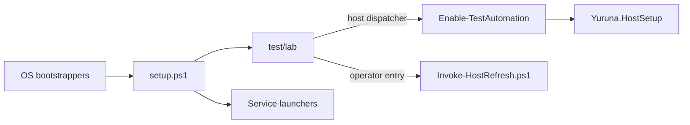
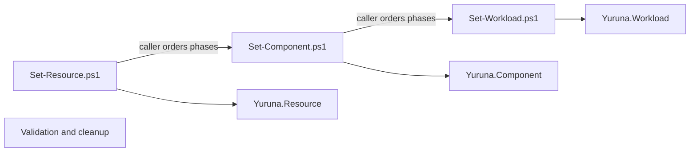
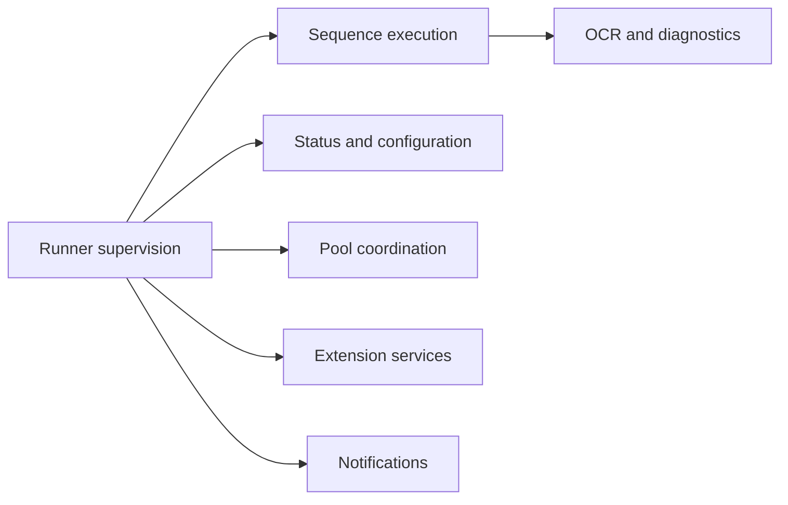
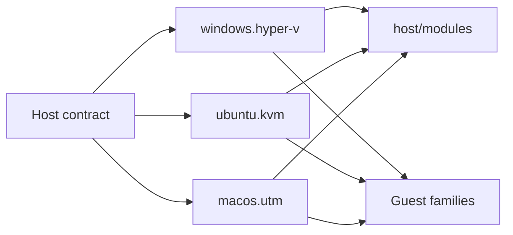
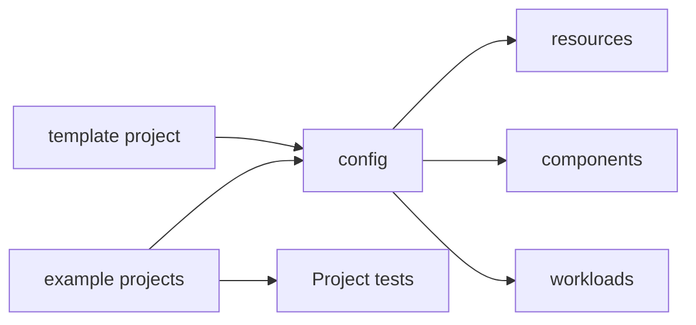
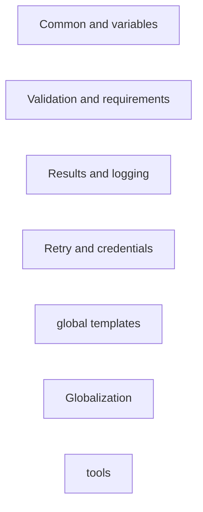
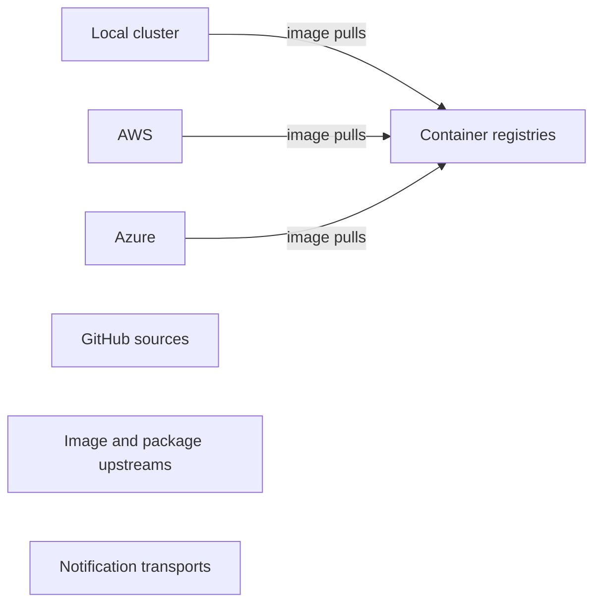

# Component breakdown

These flowcharts expand each L1 boundary into at most seven real scripts, modules, directories, or named aggregates.

Section order matches [Context and components](01-context-and-components.md).
A box containing a family stands for the listed code, not another service.

## Provisioning

```mermaid
flowchart LR
    install["OS bootstrappers"]
    setup-ps1["setup.ps1"]
    yuruna-hostsetup-psm1["Yuruna.HostSetup"]
    enable-testautomation-ps1["Enable-TestAutomation"]
    test-lab["test/lab"]
    test-service["Service launchers"]
    invoke-hostrefresh-ps1["Invoke-HostRefresh.ps1"]
    install --> setup-ps1
    setup-ps1 --> test-lab
    test-lab -->|host dispatcher| enable-testautomation-ps1
    enable-testautomation-ps1 --> yuruna-hostsetup-psm1
    setup-ps1 --> test-service
    test-lab -->|operator entry| invoke-hostrefresh-ps1
```

Sources: [install/](../../install/) contains the Windows, Ubuntu, and macOS
bootstrappers and [setup.ps1](../../install/setup.ps1). Setup invokes the
[lab dispatcher](../../test/lab/Enable-TestAutomation.ps1), which selects a
host script through [Yuruna.HostRedirect](../../automation/Yuruna.HostRedirect.psm1).
That host script imports [Yuruna.HostSetup](../../automation/Yuruna.HostSetup.psm1);
setup separately invokes [service launchers](../../test/service/).
The three `Enable-TestAutomation.ps1` implementations live in
[windows.hyper-v](../../host/windows.hyper-v/Enable-TestAutomation.ps1),
[ubuntu.kvm](../../host/ubuntu.kvm/Enable-TestAutomation.ps1), and
[macos.utm](../../host/macos.utm/Enable-TestAutomation.ps1).
The OS bootstrap scripts install dependencies and clone the repository; setup
then prepares storage before starting service VMs. Its standalone and lab modes
select different service sets.
The seventh box is the existing
[host-refresh entry point](../../test/lab/Invoke-HostRefresh.ps1). It delegates
admission, repair, and runner handoff to
[Test.HostRefresh](../../test/modules/Test.HostRefresh.psm1); the edge from
`test/lab` identifies its command family, not an automatic setup-time refresh.

## Deploy engine

```mermaid
flowchart LR
    set-resource-ps1["Set-Resource.ps1"]
    set-component-ps1["Set-Component.ps1"]
    set-workload-ps1["Set-Workload.ps1"]
    yuruna-resource-psm1["Yuruna.Resource"]
    yuruna-component-psm1["Yuruna.Component"]
    yuruna-workload-psm1["Yuruna.Workload"]
    test-configuration-ps1["Validation and cleanup"]
    set-resource-ps1 --> yuruna-resource-psm1
    set-component-ps1 --> yuruna-component-psm1
    set-workload-ps1 --> yuruna-workload-psm1
    set-resource-ps1 -->|caller orders phases| set-component-ps1
    set-component-ps1 -->|caller orders phases| set-workload-ps1
```

Sources: the [resource](../../automation/Set-Resource.ps1),
[component](../../automation/Set-Component.ps1), and
[workload](../../automation/Set-Workload.ps1) entry points import their respective
[Yuruna.Resource](../../automation/Yuruna.Resource.psm1),
[Yuruna.Component](../../automation/Yuruna.Component.psm1), and
[Yuruna.Workload](../../automation/Yuruna.Workload.psm1) modules.
The seventh box groups [Test-Configuration](../../automation/Test-Configuration.ps1),
[Test-Requirement](../../automation/Test-Requirement.ps1),
[Test-Runtime](../../automation/Test-Runtime.ps1), and
[Invoke-Clear](../../automation/Invoke-Clear.ps1).
Phase-order edges describe caller sequencing; the three entry points do not
call one another. For example, the project
[Ubuntu workload script](https://github.com/alissonsol/yuruna-project/blob/main/example/website/test/ubuntu.server.26/ubuntu.server.26.workload.k8s.website.sh)
invokes each entry point in that order.
The phase modules return structured
[result manifests](../../automation/Yuruna.Result.psm1); the entry points turn
failure into a nonzero process exit. The workload entry point also checks the
local runtime before publishing workloads.

## Test harness

```mermaid
flowchart LR
    start-testrunner-ps1["Runner supervision"]
    test-sequencerunner-psm1["Sequence execution"]
    test-ocrengine-psm1["OCR and diagnostics"]
    start-statusservice-ps1["Status and configuration"]
    test-pool["Pool coordination"]
    test-extension["Extension services"]
    test-notify-psm1["Notifications"]
    start-testrunner-ps1 --> test-sequencerunner-psm1
    test-sequencerunner-psm1 --> test-ocrengine-psm1
    start-testrunner-ps1 --> start-statusservice-ps1
    start-testrunner-ps1 --> test-pool
    start-testrunner-ps1 --> test-extension
    start-testrunner-ps1 --> test-notify-psm1
```

Sources and aggregate membership:

| Box | Code |
| --- | --- |
| Runner supervision | [Start-TestRunner.ps1](../../test/Start-TestRunner.ps1), [Test.RunnerOuterLoop](../../test/modules/Test.RunnerOuterLoop.psm1), [Invoke-TestCycleRunner](../../test/modules/Invoke-TestCycleRunner.ps1), [Invoke-TestRunnerInnerLoop](../../test/modules/Invoke-TestRunnerInnerLoop.ps1), [Test.RunnerInnerLoop](../../test/modules/Test.RunnerInnerLoop.psm1), [Test.RunnerWatchdog](../../test/modules/Test.RunnerWatchdog.psm1), and [Test.RunnerState](../../test/modules/Test.RunnerState.psm1). |
| Sequence execution | [Test.SequenceRunner](../../test/modules/Test.SequenceRunner.psm1), [Test.SequenceEngine](../../test/modules/Test.SequenceEngine.psm1), [Test.SequenceHandler](../../test/modules/Test.SequenceHandler.psm1), and [sequences/](../../test/sequences/). |
| OCR and diagnostics | [Test.OcrEngine](../../test/modules/Test.OcrEngine.psm1), [Test.OcrMatch](../../test/modules/Test.OcrMatch.psm1), [Test.Diagnostic](../../test/modules/Test.Diagnostic.psm1), and [Get-SystemDiagnostic](../../automation/Get-SystemDiagnostic.ps1). |
| Status and configuration | [Start-StatusService](../../test/service/Start-StatusService.ps1), [Start-ConfigService](../../test/service/Start-ConfigService.ps1), and the browser pages in [status/](../../test/status/). |
| Pool coordination | [pool/](../../test/pool/), [Test.PoolWorker](../../test/modules/Test.PoolWorker.psm1), [Test.PoolPush](../../test/modules/Test.PoolPush.psm1), and [Test.PoolStorage](../../test/modules/Test.PoolStorage.psm1). |
| Extension services | [extension/](../../test/extension/) contains authentication, caching proxy and parser, download agent, pool aggregator and control, stash, notification, and their shared SDK. |
| Notifications | [Test.Notify](../../test/modules/Test.Notify.psm1), [Test.PoolNotifier](../../test/modules/Test.PoolNotifier.psm1), and [notification/](../../test/extension/notification/). |

The extension aggregate exceeds seven implementations, so it stays collapsed
here. The service topology and individual runtime exchanges are expanded in
[Data flows](03-data-flows.md) and [Deployment](06-deployment.md).

Runner supervision also groups
[Test.SingleInstance](../../test/modules/Test.SingleInstance.psm1),
[Test.HostRefreshIntent](../../test/modules/Test.HostRefreshIntent.psm1), and
[Test.HostRefreshTrigger](../../test/modules/Test.HostRefreshTrigger.psm1).
They bind runner identities, refresh gates, and the optional automatic policy
to the same process chain. Sequence execution owns the decision to send input;
OCR supplies evidence and matching. In particular, `passwdPrompt` defaults to
bounded matching through `noSegmentMatch`, including per-engine frame history.

## Providers

```mermaid
flowchart LR
    yuruna-host-contract-psm1["Host contract"]
    windows-hyper-v["windows.hyper-v"]
    ubuntu-kvm["ubuntu.kvm"]
    macos-utm["macos.utm"]
    host-modules["host/modules"]
    guest["Guest families"]
    yuruna-host-contract-psm1 --> windows-hyper-v
    yuruna-host-contract-psm1 --> ubuntu-kvm
    yuruna-host-contract-psm1 --> macos-utm
    windows-hyper-v --> host-modules
    ubuntu-kvm --> host-modules
    macos-utm --> host-modules
    windows-hyper-v --> guest
    ubuntu-kvm --> guest
    macos-utm --> guest
```

Sources: [host contract](../../host/Yuruna.Host.Contract.psm1);
[Hyper-V driver](../../host/windows.hyper-v/modules/Yuruna.Host.psm1),
[KVM driver](../../host/ubuntu.kvm/modules/Yuruna.Host.psm1),
[UTM driver](../../host/macos.utm/modules/Yuruna.Host.psm1);
[host/modules](../../host/modules/); and [guest/](../../guest/).
Each provider has per-guest `Get-Image.ps1` and `New-VM.ps1` builders.
The guest aggregate contains `amazon.linux.2023`, `ubuntu.server.24`,
`ubuntu.server.26`, `windows.11`, and `macos.26`; this does not imply every
host supports every guest. Service guest builders are additional folders under
the host providers, and use the existing Ubuntu guest setup scripts.

## Project data

```mermaid
flowchart LR
    example["example projects"]
    template["template project"]
    config["config"]
    resources["resources"]
    components["components"]
    workloads["workloads"]
    test-runner-yml["Project tests"]
    example --> config
    template --> config
    config --> resources
    config --> components
    config --> workloads
    example --> test-runner-yml
```

Sources in `yuruna-project`:
[example/website](https://github.com/alissonsol/yuruna-project/tree/main/example/website),
[example/text-to-sql](https://github.com/alissonsol/yuruna-project/tree/main/example/text-to-sql),
[template](https://github.com/alissonsol/yuruna-project/tree/main/template),
[book](https://github.com/alissonsol/yuruna-project/tree/main/book), and
[test/test.runner.yml](https://github.com/alissonsol/yuruna-project/blob/main/test/test.runner.yml).
The last box groups the repository cycle plan and project/book sequence files.
`template/` itself contains `config/`, `resources/`, `components/`, and
`workloads/`; it does not add a project-name directory. Some examples, such as
`nested.host`, supply tests without the deployment directories.
The vault belongs to the harness, as shown in [Data model](05-data-model.md).

## Shared modules

```mermaid
flowchart LR
    yuruna-common-psm1["Common and variables"]
    yuruna-validation-psm1["Validation and requirements"]
    yuruna-result-psm1["Results and logging"]
    yuruna-retry-psm1["Retry and credentials"]
    global["global templates"]
    globalization["Globalization"]
    tools["tools"]
```

Sources: [Yuruna.Common](../../automation/Yuruna.Common.psm1),
[Yuruna.VariableExpansion](../../automation/Yuruna.VariableExpansion.psm1),
[Import.Yaml](../../automation/Import.Yaml.psm1),
[Yuruna.Validation](../../automation/Yuruna.Validation.psm1),
[Yuruna.Requirement](../../automation/Yuruna.Requirement.psm1),
[Yuruna.Result](../../automation/Yuruna.Result.psm1),
[Yuruna.Log](../../automation/Yuruna.Log.psm1),
[Yuruna.LogLevel](../../automation/Yuruna.LogLevel.psm1),
[Yuruna.Retry](../../automation/Yuruna.Retry.psm1),
[Yuruna.CredentialProvider](../../automation/Yuruna.CredentialProvider.psm1),
[global/](../../global/), [globalization/](../../globalization/), and
[tools/](../../tools/).
These seven boxes inventory related libraries and development tooling; they
do not prescribe a module-import order.
[Globalization](07-globalization.md) expands the common language contract.
The tools aggregate includes [Invoke-TestSuite](../../tools/Invoke-TestSuite.ps1)
and its [worker](../../tools/_InvokeOneSuite.ps1): they run isolated Pester
suites, retain worker diagnostics, and validate NUnit evidence before baseline
publication. This is a separate command from the continuous VM-cycle runner
under `test/`.

## External services

```mermaid
flowchart LR
    localhost["Local cluster"]
    aws["AWS"]
    azure["Azure"]
    yuruna-credentialprovider-psm1["Container registries"]
    yuruna-githubsource-psm1["GitHub sources"]
    yuruna-hostdownload-psm1["Image and package upstreams"]
    notification["Notification transports"]
    localhost -->|image pulls| yuruna-credentialprovider-psm1
    aws -->|image pulls| yuruna-credentialprovider-psm1
    azure -->|image pulls| yuruna-credentialprovider-psm1
```

Sources: [localhost resources](../../global/resources/localhost/),
[AWS resources](../../global/resources/aws/),
[Azure resources](../../global/resources/azure/),
[registry providers](../../automation/Yuruna.CredentialProvider.psm1),
[GitHub source resolution](../../automation/Yuruna.GitHubSource.psm1),
[host downloads](../../host/modules/Yuruna.HostDownload.psm1),
[guest setup scripts](../../guest/), and
[notification implementations](../../test/extension/notification/).
Local Docker/Kubernetes, AWS EKS/ECR, Azure resources/ACR, GitHub, image/package
origins, and configured notification destinations are integrations already
referenced by code. The registry box includes implemented GAR authentication;
it does not assert that GCP infrastructure templates exist.
The AWS box groups the implemented EKS/ECR templates. The
[EKS context import](../../global/resources/aws/eks-cluster/context.tf),
[cluster outputs](../../global/resources/aws/eks-cluster/outputs.tf), and
[ingress resources](../../global/resources/aws/eks-cluster/endpoints.tf)
are separate contracts: a Kubernetes API endpoint is not an application URL.

---

[Architecture](../architecture.md) | [Design overview](README.md)
