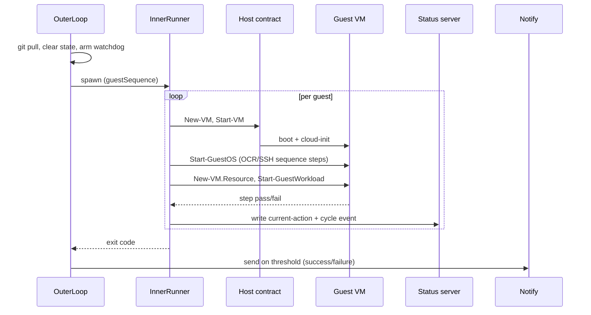
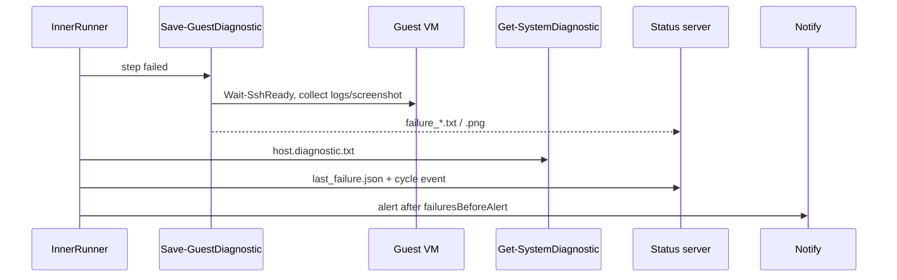

# Data flows

> One sentence: the most frequent runtime data flows, one sequence diagram each.

See [Design overview](00-index.md) · [Yuruna Architecture](../architecture.md).

Derived from `automation/Set-{Resource,Component,Workload}.ps1`,
`test/modules/{Test.RunnerOuterLoop,Test.RunnerInnerLoop,Invoke-Sequence}.psm1`,
and `automation/fetch-and-execute.sh`.

## A. Three-phase deployment

```mermaid
sequenceDiagram
    actor Operator
    participant Engine as Set-* (automation)
    participant Tofu as OpenTofu
    participant Docker
    participant Registry
    participant Cluster as Helm / kubectl

    Operator->>Engine: Set-Resource &lt;project&gt; &lt;cloud&gt;
    Engine->>Tofu: init / plan / apply (resources.yml)
    Tofu-->>Engine: resources.output.yml (cluster, registry, IPs)
    Operator->>Engine: Set-Component &lt;project&gt; &lt;cloud&gt;
    Engine->>Docker: build + tag (components.yml)
    Docker->>Registry: push image
    Operator->>Engine: Set-Workload &lt;project&gt; &lt;cloud&gt;
    Engine->>Cluster: helm install / kubectl apply (workloads.yml)
    Cluster-->>Engine: release status
```

## B. Test cycle (one guest)



## C. Guest repo / artifact fetch

```mermaid
sequenceDiagram
    participant Guest as fetch-and-execute.sh
    participant HostEnv as /etc/yuruna/host.env
    participant StatusSrv as Host status server
    participant Proxy as Caching proxy (squid)
    participant Upstream as GitHub / mirrors

    Guest->>HostEnv: read YURUNA_HOST_IP:PORT
    Guest->>StatusSrv: GET /livecheck
    alt host reachable
        Guest->>StatusSrv: GET /yuruna-repo/&lt;path&gt;
    else fallback
        Guest->>Upstream: GET raw.githubusercontent.com/...
    end
    Guest->>Proxy: apt/dnf, image pulls
    Proxy->>Upstream: miss → fetch + cache
    Upstream-->>Proxy: payload
    Proxy-->>Guest: cached payload
```

## D. Failure diagnostics & alert



---

Copyright (c) 2019-2026 by Alisson Sol et al.

Last review: 2026.06.30
