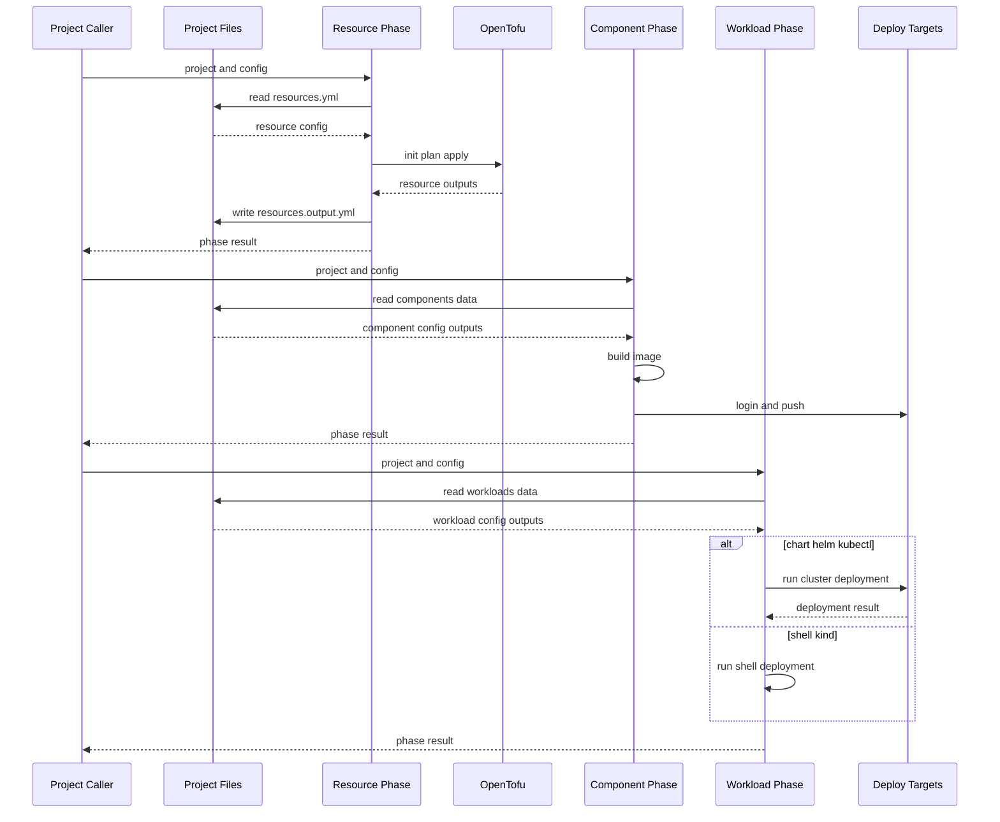
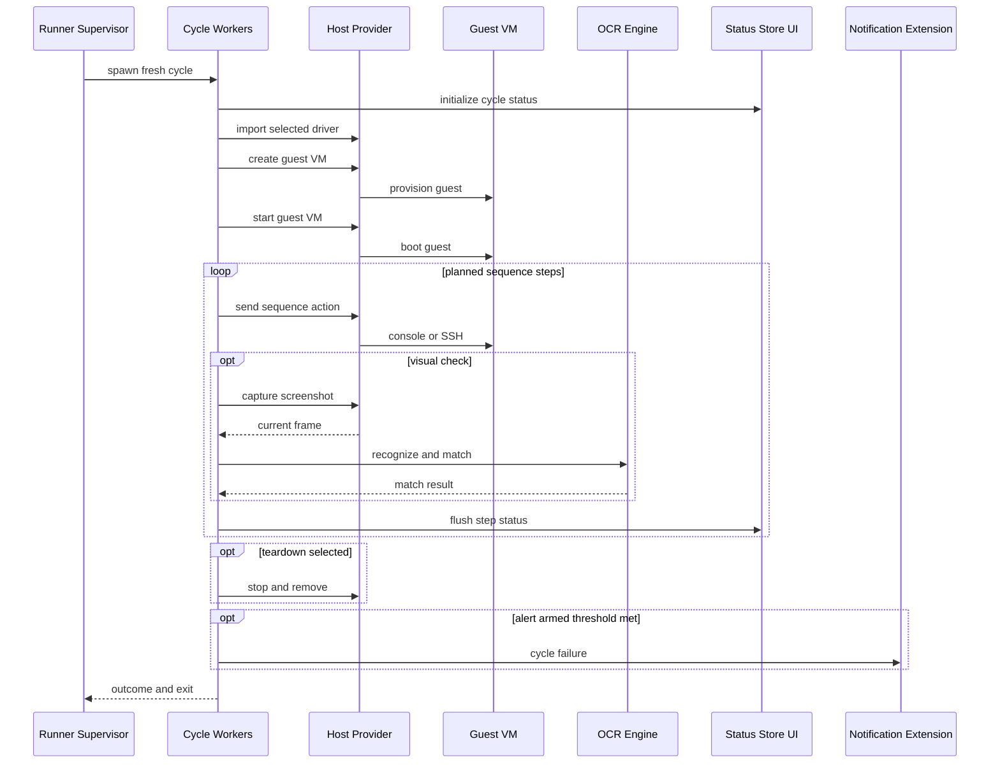
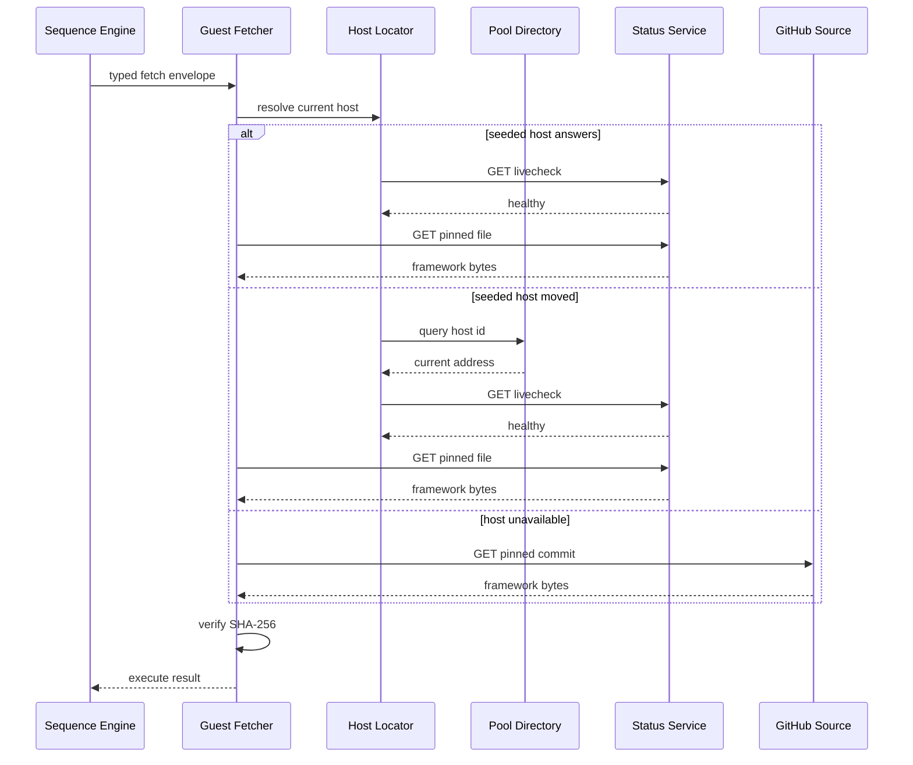
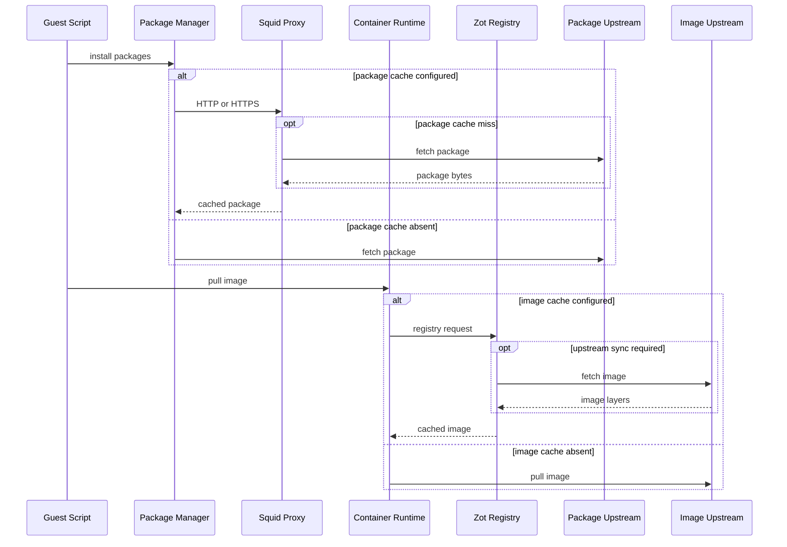
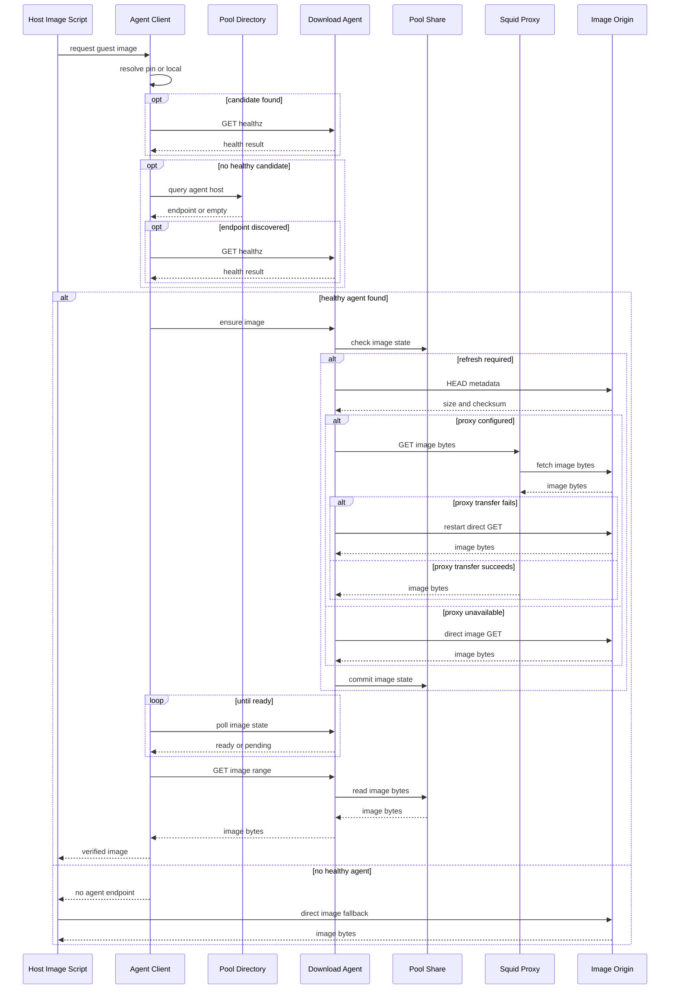
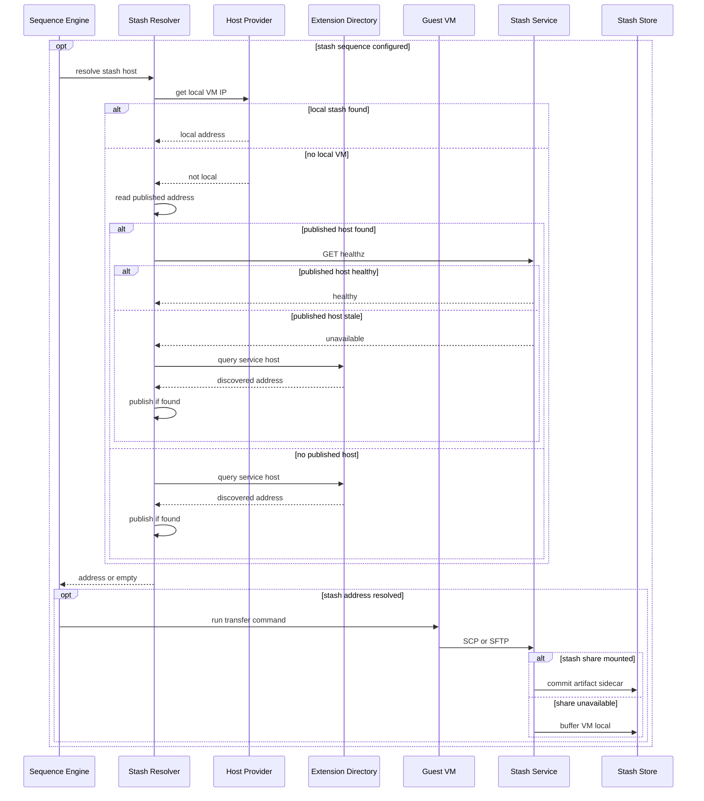
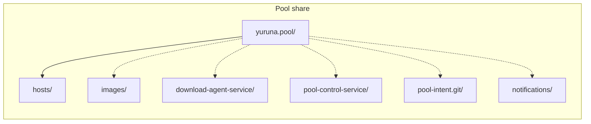
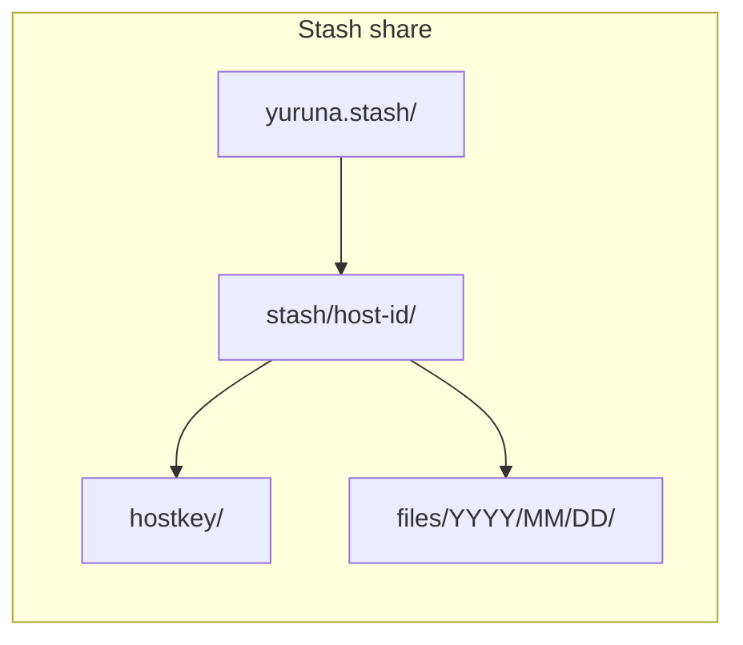

# Data flows

This page traces the current high-frequency deployment, runner, fetch, cache, stash, and storage exchanges without restating the architecture narrative.

[Yuruna Architecture](../architecture.md) | [Design index](00-index.md) | [Lifecycle state](04-lifecycle-state.md)

## A. Three-phase deployment

The caller, not one phase script, invokes the three independent entry points in
order. This is visible in project guest scripts such as
`yuruna-project/example/text-to-sql/test/ubuntu.server.24/ubuntu.server.24.workload.k8s.text-to-sql.sh`
and in the three `automation/Set-*.ps1` entry points.

```mermaid
sequenceDiagram
  participant project-caller as Project Caller
  participant project-files as Project Files
  participant resource-phase as Resource Phase
  participant opentofu as OpenTofu
  participant component-phase as Component Phase
  participant workload-phase as Workload Phase
  participant deploy-targets as Deploy Targets

  project-caller->>resource-phase: project and config
  resource-phase->>project-files: read resources.yml
  project-files-->>resource-phase: resource config
  resource-phase->>opentofu: init plan apply
  opentofu-->>resource-phase: resource outputs
  resource-phase->>project-files: write resources.output.yml
  resource-phase-->>project-caller: phase result
  project-caller->>component-phase: project and config
  component-phase->>project-files: read components data
  project-files-->>component-phase: component config outputs
  component-phase->>component-phase: build image
  component-phase->>deploy-targets: login and push
  component-phase-->>project-caller: phase result
  project-caller->>workload-phase: project and config
  workload-phase->>project-files: read workloads data
  project-files-->>workload-phase: workload config outputs
  alt chart helm kubectl
    workload-phase->>deploy-targets: run cluster deployment
    deploy-targets-->>workload-phase: deployment result
  else shell kind
    workload-phase->>workload-phase: run shell deployment
  end
  workload-phase-->>project-caller: phase result
```

`automation/Yuruna.Resource.psm1` resolves project resource templates before
`global/resources/`, stages the OpenTofu work folder atomically, and writes
`config/<environment>/resources.output.yml`. `Yuruna.Component.psm1` layers those
outputs with component variables before Docker build/tag/push.
`Yuruna.Workload.psm1` layers them with workload and deployment variables before
executing the current chart, kubectl, helm, or shell deployment kind.

## The `*.stderr.log` / `*.rc` sidecar contract

The phase modules write tool output and the last observed exit code beside each
other: `tofu.stderr.log`/`tofu.rc` in `Yuruna.Resource.psm1`,
`docker.stderr.log`/`docker.rc` in `Yuruna.Component.psm1`, and per-tool pairs such
as `helm.stderr.log`/`helm.rc` in `Yuruna.Workload.psm1`.
`automation/Get-SystemDiagnostic.ps1` scans these pairs and compares successful
tool exits with resulting project and cluster state. This is an artifact contract,
not another runtime participant, so it stays prose rather than adding boxes to the
phase sequence.

## B. Test cycle

```mermaid
sequenceDiagram
  participant runner-supervisor as Runner Supervisor
  participant cycle-workers as Cycle Workers
  participant host-provider as Host Provider
  participant guest-vm as Guest VM
  participant ocr-engine as OCR Engine
  participant status-store as Status Store UI
  participant notify-extension as Notification Extension

  runner-supervisor->>cycle-workers: spawn fresh cycle
  cycle-workers->>status-store: initialize cycle status
  cycle-workers->>host-provider: import selected driver
  cycle-workers->>host-provider: create guest VM
  host-provider->>guest-vm: provision guest
  cycle-workers->>host-provider: start guest VM
  host-provider->>guest-vm: boot guest
  loop planned sequence steps
    cycle-workers->>host-provider: send sequence action
    host-provider->>guest-vm: console or SSH
    %% optional -- visual checks are sequence controlled
    opt visual check
      cycle-workers->>host-provider: capture screenshot
      host-provider-->>cycle-workers: current frame
      cycle-workers->>ocr-engine: recognize and match
      ocr-engine-->>cycle-workers: match result
    end
    cycle-workers->>status-store: flush step status
  end
  %% optional -- failure policy can retain the guest for diagnosis
  opt teardown selected
    cycle-workers->>host-provider: stop and remove
  end
  %% optional -- notification requires both policy conditions
  opt alert armed threshold met
    cycle-workers->>notify-extension: cycle failure
  end
  cycle-workers-->>runner-supervisor: outcome and exit
```

The three process layers are `test/Start-TestRunner.ps1`,
`test/modules/Invoke-TestCycleRunner.ps1`, and
`test/modules/Invoke-TestRunnerInnerLoop.ps1`. Driver import and VM calls are in
`Test.HostBootstrap.psm1` and `Test.RunnerInnerLoop.psm1`; screenshot/OCR matching
is in `Test.SequenceEngine.psm1` and `Test.Ocr{Engine,Match}.psm1`; status writes
are in `Test.Status.psm1`; and threshold-gated notification dispatch is in
`Test.Notify.psm1` and `test/extension/notification/`. The status service serves
the file-backed view; it is not the OCR engine.

## C. Framework source fetch

```mermaid
sequenceDiagram
  participant sequence-engine as Sequence Engine
  participant guest-fetcher as Guest Fetcher
  participant host-locator as Host Locator
  participant pool-directory as Pool Directory
  participant status-service as Status Service
  participant github-source as GitHub Source

  sequence-engine->>guest-fetcher: typed fetch envelope
  guest-fetcher->>host-locator: resolve current host
  alt seeded host answers
    host-locator->>status-service: GET livecheck
    status-service-->>host-locator: healthy
    guest-fetcher->>status-service: GET pinned file
    status-service-->>guest-fetcher: framework bytes
  else seeded host moved
    %% optional -- pool lookup requires a seeded directory
    host-locator->>pool-directory: query host id
    pool-directory-->>host-locator: current address
    host-locator->>status-service: GET livecheck
    status-service-->>host-locator: healthy
    guest-fetcher->>status-service: GET pinned file
    status-service-->>guest-fetcher: framework bytes
  else host unavailable
    guest-fetcher->>github-source: GET pinned commit
    github-source-->>guest-fetcher: framework bytes
  end
  guest-fetcher->>guest-fetcher: verify SHA-256
  guest-fetcher-->>sequence-engine: execute result
```

The flow is implemented by `automation/fetch-and-execute.sh`, seeded
`automation/yuruna-host-locate.sh`, `test/service/Start-StatusService.ps1`, and the
pool lookup in `test/extension/pool-aggregator-service/`. The host route is tried
before the commit-pinned GitHub fallback, and payload integrity is verified before
execution.

## D. Cached dependency fetch

```mermaid
sequenceDiagram
  participant guest-script as Guest Script
  participant package-manager as Package Manager
  participant squid-proxy as Squid Proxy
  participant container-runtime as Container Runtime
  participant zot-registry as Zot Registry
  participant package-upstream as Package Upstream
  participant image-upstream as Image Upstream

  guest-script->>package-manager: install packages
  %% optional -- cached package routes require a configured proxy VM
  alt package cache configured
    package-manager->>squid-proxy: HTTP or HTTPS
    opt package cache miss
      squid-proxy->>package-upstream: fetch package
      package-upstream-->>squid-proxy: package bytes
    end
    squid-proxy-->>package-manager: cached package
  else package cache absent
    package-manager->>package-upstream: fetch package
  end
  guest-script->>container-runtime: pull image
  %% optional -- cached image routes require a configured proxy VM
  alt image cache configured
    container-runtime->>zot-registry: registry request
    opt upstream sync required
      zot-registry->>image-upstream: fetch image
      image-upstream-->>zot-registry: image layers
    end
    zot-registry-->>container-runtime: cached image
  else image cache absent
    container-runtime->>image-upstream: pull image
  end
```

Proxy environment and CA injection come from
`host/vmconfig/ubuntu.server.base.user-data`. Squid and Zot are configured by
`host/vmconfig/caching-proxy-service.base.user-data`. The containerd and Docker
mirror paths are used by `guest/ubuntu.server.24/ubuntu.server.24.k8s.sh` and the
corresponding Ubuntu 26 scripts. The direct branches are current supported
behavior when no caching proxy is configured.

## E. Download-agent image fetch

The host image path prefers a healthy download agent and falls back to the
origin when discovery or the agent protocol is unavailable. The agent itself
keeps image bytes and service state on the pool share.

```mermaid
sequenceDiagram
  participant host-image-script as Host Image Script
  participant agent-client as Agent Client
  participant pool-directory as Pool Directory
  participant download-agent as Download Agent
  participant pool-share as Pool Share
  participant squid-proxy as Squid Proxy
  participant image-origin as Image Origin

  host-image-script->>agent-client: request guest image
  agent-client->>agent-client: resolve pin or local
  opt candidate found
    agent-client->>download-agent: GET healthz
    download-agent-->>agent-client: health result
  end
  opt no healthy candidate
    agent-client->>pool-directory: query agent host
    pool-directory-->>agent-client: endpoint or empty
    opt endpoint discovered
      agent-client->>download-agent: GET healthz
      download-agent-->>agent-client: health result
    end
  end
  alt healthy agent found
    agent-client->>download-agent: ensure image
    download-agent->>pool-share: check image state
    alt refresh required
      download-agent->>image-origin: HEAD metadata
      image-origin-->>download-agent: size and checksum
      %% optional -- image bytes use the configured proxy first
      alt proxy configured
        download-agent->>squid-proxy: GET image bytes
        squid-proxy->>image-origin: fetch image bytes
        image-origin-->>squid-proxy: image bytes
        alt proxy transfer fails
          download-agent->>image-origin: restart direct GET
          image-origin-->>download-agent: image bytes
        else proxy transfer succeeds
          squid-proxy-->>download-agent: image bytes
        end
      else proxy unavailable
        download-agent->>image-origin: direct image GET
        image-origin-->>download-agent: image bytes
      end
      download-agent->>pool-share: commit image state
    end
    loop until ready
      agent-client->>download-agent: poll image state
      download-agent-->>agent-client: ready or pending
    end
    agent-client->>download-agent: GET image range
    download-agent->>pool-share: read image bytes
    pool-share-->>download-agent: image bytes
    download-agent-->>agent-client: image bytes
    agent-client-->>host-image-script: verified image
  else no healthy agent
    agent-client-->>host-image-script: no agent endpoint
    host-image-script->>image-origin: direct image fallback
    image-origin-->>host-image-script: image bytes
  end
```

Discovery, health proof, ensure/poll, ranged download, and checksum verification
are implemented by `host/modules/Yuruna.DownloadAgent.psm1`; the agent-first hook
and direct origin fallback are in
`host/modules/Yuruna.{UbuntuImage,Image}.psm1`. The server routes and durable image
state are under
`test/extension/download-agent-service/server/internal/{httpsrv,imagestore,state}`.
The Agent Client participant folds pinned-address and same-host VM discovery before
the directory lookup so the sequence remains at seven participants.
The image refresh path reads origin metadata directly, tries configured Squid for
the body, and restarts from the origin after any proxy or midstream failure. Pool
lookup is provided by `test/extension/pool-aggregator-service/`.

## F. Stash address and transfer

```mermaid
sequenceDiagram
  participant sequence-engine as Sequence Engine
  participant stash-resolver as Stash Resolver
  participant host-provider as Host Provider
  participant extension-directory as Extension Directory
  participant guest-vm as Guest VM
  participant stash-service as Stash Service
  participant stash-store as Stash Store

  %% optional -- this flow requires a stash-enabled sequence
  opt stash sequence configured
    sequence-engine->>stash-resolver: resolve stash host
    stash-resolver->>host-provider: get local VM IP
    alt local stash found
      host-provider-->>stash-resolver: local address
    else no local VM
      host-provider-->>stash-resolver: not local
      stash-resolver->>stash-resolver: read published address
      alt published host found
        stash-resolver->>stash-service: GET healthz
        alt published host healthy
          stash-service-->>stash-resolver: healthy
        else published host stale
          stash-service-->>stash-resolver: unavailable
          stash-resolver->>extension-directory: query service host
          extension-directory-->>stash-resolver: discovered address
          stash-resolver->>stash-resolver: publish if found
        end
      else no published host
        stash-resolver->>extension-directory: query service host
        extension-directory-->>stash-resolver: discovered address
        stash-resolver->>stash-resolver: publish if found
      end
    end
    stash-resolver-->>sequence-engine: address or empty
    %% optional -- transfer requires a resolved address
    opt stash address resolved
      sequence-engine->>guest-vm: run transfer command
      guest-vm->>stash-service: SCP or SFTP
      alt stash share mounted
        stash-service->>stash-store: commit artifact sidecar
      else share unavailable
        stash-service->>stash-store: buffer VM local
      end
    end
  end
```

Address ordering, the per-cycle published address, health probing, and pool/operator
fallback are in `test/extension/stash-service/default.psm1` and
`test/modules/Test.Extension.psm1`. Variable expansion is provided by
`Test.SequenceVariable.psm1`. The SCP/SFTP sink and filesystem store are under
`test/extension/stash-service/server/internal/{sshsrv,scp,store}`. No shipped
sequence currently calls the resolver, so the entire supported path is explicitly
optional in the diagram rather than presented as an unconditional cycle exchange.

## G. Pool storage

```mermaid
flowchart LR
  %% optional -- pool storage is independently configured
  subgraph pool-share["Pool share"]
    pool-root["yuruna.pool/"]
    host-records["hosts/"]
    image-store["images/"]
    download-agent-state["download-agent-service/"]
    pool-control-state["pool-control-service/"]
    pool-intent-store["pool-intent.git/"]
    %% optional -- the notifier controls this spool
    notification-state["notifications/"]

    pool-root --> host-records
    %% optional -- download agent owns image data
    pool-root -.-> image-store
    %% optional -- download agent owns service state
    pool-root -.-> download-agent-state
    %% optional -- pool control owns service state
    pool-root -.-> pool-control-state
    %% optional -- pool control owns intent data
    pool-root -.-> pool-intent-store
    %% optional -- notifier owns its spool
    pool-root -.-> notification-state
  end
```

`hosts/` folds the per-host identity records from
`test/modules/Test.HostIdentity.psm1`, cycle archives written by
`test/modules/Test.PoolStorage.psm1` and
`test/modules/Invoke-PoolStorageDrain.ps1`, and caching-service telemetry copied by
`host/vmconfig/caching-proxy-service.base.user-data`. Image data and agent state are defined by
`test/extension/download-agent-service/server/internal/{config,imagestore,state}`;
pool-control state and intent paths by
`test/extension/pool-control-service/server/internal/{state,intent}` and its guest
bring-up script
`guest/ubuntu.server.26/ubuntu.server.26.pool-control-service.sh`; notifications by
`test/modules/Test.PoolNotifier.psm1`.

Pool storage is optional and independently configured. The caching-proxy VM,
pool-control service, download agent, and runner mount only this share when their
respective features are enabled.

## H. Stash storage

```mermaid
flowchart LR
  %% optional -- stash storage is independently configured
  subgraph stash-share["Stash share"]
    stash-root["yuruna.stash/"]
    stash-host-root["stash/host-id/"]
    stash-host-keys["hostkey/"]
    stash-files["files/YYYY/MM/DD/"]

    stash-root --> stash-host-root
    stash-host-root --> stash-host-keys
    stash-host-root --> stash-files
  end
```

The separate stash layout is set by
`guest/ubuntu.server.26/ubuntu.server.26.stash-service.sh` and
`test/extension/stash-service/server/internal/config/config.go`. Its actual root is
`yuruna.stash/stash/<host-id>/{hostkey,files/YYYY/MM/DD}`. Metadata and the offline
buffer remain VM-local under `/var/lib/stash-service/`; neither is a share child.
The stash service does not write these artifacts into `yuruna.pool/`, and the
caching-proxy VM does not mount the stash share.
