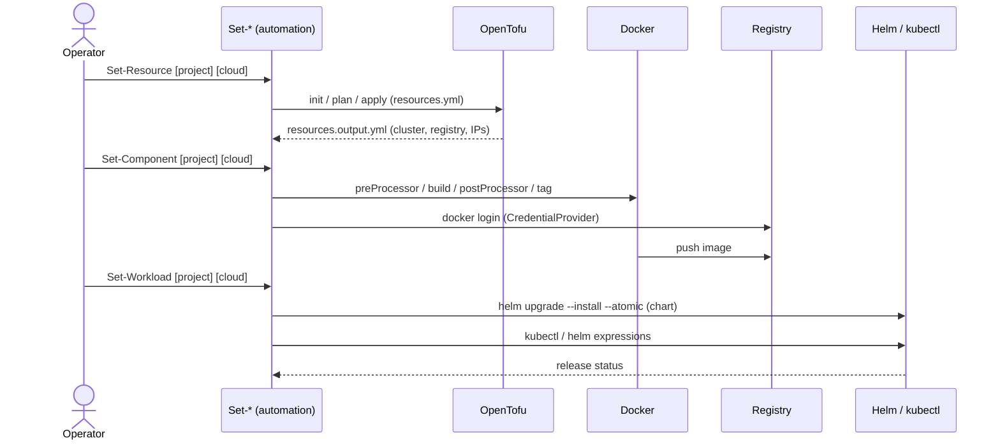
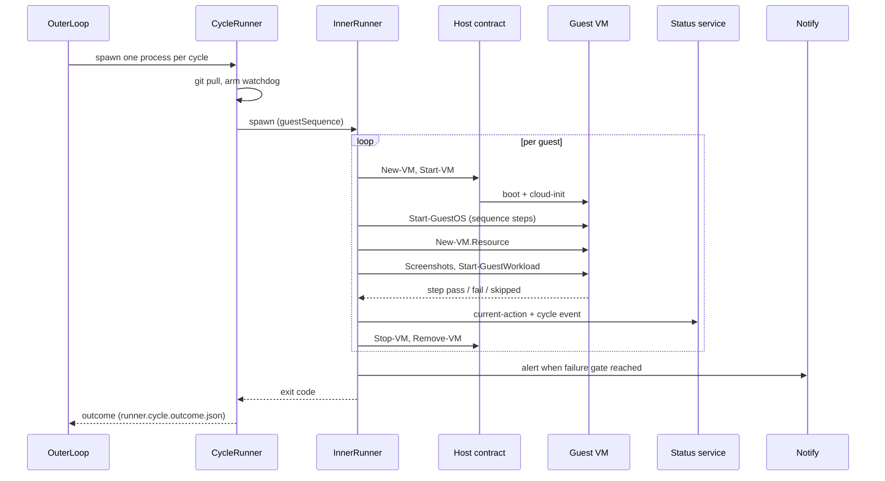
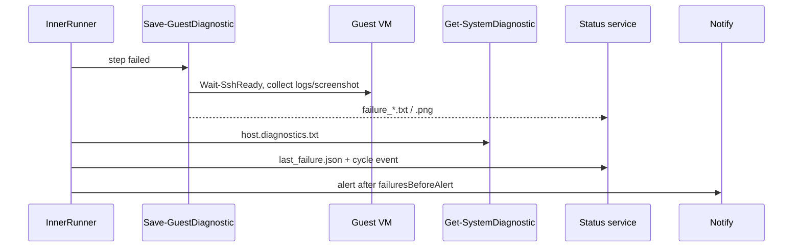
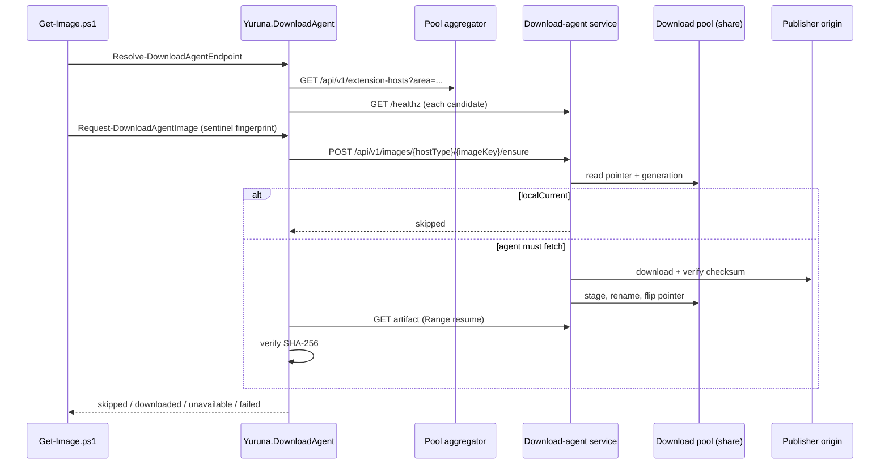
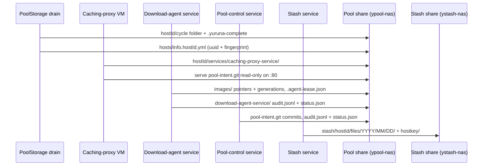

# Data flows

> One sentence: the most frequent runtime data flows, one sequence diagram each.

See [Design overview](00-index.md) · [Yuruna Architecture](../architecture.md).

Derived from `automation/Set-{Resource,Component,Workload}.ps1`,
`automation/Yuruna.{Component,Workload,DeploymentKind}.psm1`,
`automation/fetch-and-execute.sh`,
`test/modules/{Test.RunnerOuterLoop,Test.RunnerInnerLoop,Test.SequenceEngine,Test.SequenceHandler,Test.Notify,Test.PoolStorage,Test.HostIdentity}.psm1`,
`host/modules/Yuruna.DownloadAgent.psm1` with the `host/*/guest.*/Get-Image.ps1`
call sites, `host/vmconfig/caching-proxy-service.base.user-data`, and the
`test/extension/{download-agent-service,pool-control-service,stash-service}/server/`
daemons.

## A. Three-phase deployment


```mermaid
sequenceDiagram
    actor Operator
    participant Engine as Set-* (automation)
    participant Tofu as OpenTofu
    participant Docker
    participant Registry
    participant Cluster as Helm / kubectl

    Operator->>Engine: Set-Resource [project] [cloud]
    Engine->>Tofu: init / plan / apply (resources.yml)
    Tofu-->>Engine: resources.output.yml (cluster, registry, IPs)
    Operator->>Engine: Set-Component [project] [cloud]
    Engine->>Docker: preProcessor / build / postProcessor / tag
    Engine->>Registry: docker login (CredentialProvider)
    Docker->>Registry: push image
    Operator->>Engine: Set-Workload [project] [cloud]
    Engine->>Cluster: helm upgrade --install --atomic (chart)
    Engine->>Cluster: kubectl / helm expressions
    Cluster-->>Engine: release status
```

The operator runs the phases one by one; **nothing chains them**, and the
in-guest variant of this flow is the project's own workload script spawning one
`pwsh` per phase. `resources.output.yml` is the only hand-off: written by
`Set-Resource` from `tofu output -json`, layered into the environment by both
later phases. Each phase validates its YAML first (`Confirm-*List`), and
`Set-Workload` auto-runs `Test-Runtime.ps1` as pre-flight.

The component phase is six ordered steps through `Invoke-ComponentCommand` —
`preProcessor`, `build`, `postProcessor`, `tag`, `registryLogin`, `push` (the
pre/post hooks are optional). `registryLogin` dispatches through
`Yuruna.CredentialProvider.psm1`, whose providers are matched first-wins by URL
pattern.

The workload phase runs one of **four** registered deployment kinds — `chart`,
`kubectl`, `helm`, `shell` — detected by which field is present. The chart
pipeline is `helm lint .` then `helm upgrade --install --atomic <installName> .
--debug`, with a pending-release recovery via `helm rollback` / `helm uninstall`;
it never runs a bare `helm install`. A `shell:` deployment runs an arbitrary
command and need not target the cluster at all.

## B. Test cycle (one guest)


```mermaid
sequenceDiagram
    participant Outer as OuterLoop
    participant Cycle as CycleRunner
    participant Inner as InnerRunner
    participant Host as Host contract
    participant Guest as Guest VM
    participant Status as Status service
    participant Notify

    Outer->>Cycle: spawn one process per cycle
    Cycle->>Cycle: git pull, arm watchdog
    Cycle->>Inner: spawn (guestSequence)
    loop per guest
        Inner->>Host: New-VM, Start-VM
        Host->>Guest: boot + cloud-init
        Inner->>Guest: Start-GuestOS (sequence steps)
        Inner->>Guest: New-VM.Resource
        Inner->>Guest: Screenshots, Start-GuestWorkload
        Guest-->>Inner: step pass / fail / skipped
        Inner->>Status: current-action + cycle event
        Inner->>Host: Stop-VM, Remove-VM
    end
    Inner->>Notify: alert when failure gate reached
    Inner-->>Cycle: exit code
    Cycle-->>Outer: outcome (runner.cycle.outcome.json)
```

Three processes, each a fresh `pwsh`: the long-lived outer loop, one cycle
runner per cycle, and one inner runner inside it. The cycle runner reports
transient outcomes (`pull-error`, `spawn-failed`) through
`runner.cycle.outcome.json` rather than an exit code; only the inner's exit code
drives the fault path.

The per-guest step plan is derived per cycle by `Get-CycleStepNameList`:
`New-VM` → `Start-VM` → `Start-GuestOS` → `New-VM.Resource` → `Screenshots`
(only when a screenshot schedule exists) → `Start-GuestWorkload` (only when
workload sequences exist) → teardown. A plan with neither runs four steps. Three
steps have a third outcome besides pass/fail — `skipped`. Teardown is not a
formality: if a VM is still `running` after `Stop-VM`/`Remove-VM` and one retry,
the step is recorded as `Cleanup`, a `provisioning_failure` infra record is
written, and the guest loop breaks — so a guest can fail after every step
passed.

## C. Guest repo / artifact fetch


```mermaid
sequenceDiagram
    participant Harness as SequenceHandler
    participant Guest as fetch-and-execute.sh
    participant HostEnv as /etc/yuruna/host.env
    participant StatusSrv as Host status service
    participant Proxy as caching-proxy service (squid)
    participant Upstream as GitHub / mirrors

    Harness->>Guest: type cmd + E_SHA, E_FB_REPO/REF
    Guest->>HostEnv: source (HOST_IP/PORT, GITHUB_REPO/REF, ...)
    Guest->>StatusSrv: GET /livecheck (--no-proxy)
    alt host reachable
        Guest->>StatusSrv: GET /yuruna-repo/[path] (--no-proxy)
    else pinned repo + ref
        Guest->>Proxy: GET raw.githubusercontent / api.github.com
        Proxy->>Upstream: on miss, fetch + cache
        Upstream-->>Proxy: payload
    end
    Guest->>Guest: verify SHA-256 or refuse to run
    Guest->>Proxy: apt/dnf, image pulls
    Guest->>StatusSrv: POST /control/perf-checkpoints
```

**The digest gate is the point of this flow.** The fetched bytes are never
handed to `bash` until `verify_sha256` matches them against `E_SHA`. That digest
arrives *out of band*: `Test.SequenceHandler.psm1` regex-matches
`fetch-and-execute.sh <path>` on the command line it is about to type and
prepends `EXEC_REQUIRE_SHA256=1`, `E_SHA=<Get-FileHash SHA256>`, `E_RETRY_SHA`
and `E_FB_REPO/REF` — over the SSH or console channel, never over the HTTP the
bytes came from. A missing digest under `EXEC_REQUIRE_SHA256=1` fails closed; a
mismatch triggers exactly one re-fetch and re-verify (absorbing a concurrent-edit
race) and otherwise exits 3. The short names are a keystroke budget, not a style
choice — see
[the typed envelope](../definition.md#defining-the-fetch-and-execute-typed-envelope).
Both name generations stay live in the script so host and guest can skew in
either direction: `EXEC_REQUIRE_SHA256` keeps its long name because an older
guest image recognizes only that spelling and must fail closed, and the legacy
`EXEC_*` spellings are still read so a current guest works under an older host.

Proxy routing is the opposite of what it looks like. `--no-proxy` is set **only**
for the host route, so `/livecheck`, `/yuruna-repo/` and the perf-checkpoint POST
deliberately bypass squid, while the GitHub fallback inherits the guest-wide
`http_proxy`/`https_proxy` that cloud-init writes into `/etc/environment`,
`/etc/profile.d/yuruna-proxy.sh` and
`/etc/systemd/system.conf.d/yuruna-proxy.conf` — `github.com` is not in
`no_proxy`. The fallback is also conditional: with no pinned repo and ref (from
`E_FB_REPO/REF` or `host.env`) the script prints `NO FETCH SOURCE` and exits 2.
When `GH_TOKEN` is set the fallback uses the `api.github.com` Contents API with
the token in a 0600 `mktemp` wgetrc via `--config`, never a header; otherwise
`raw.githubusercontent.com`. An `EXEC_BASE_URL` operator override is the third
branch. `Yuruna.GitHubSource.psm1` is what makes the fallback sound: it answers
the repo slug, the exact commit the host is serving, and the token, so the
fallback lands on the same bytes the digest was taken from rather than on a
moving branch or a public mirror.

Two side effects the arrows understate: when
`/usr/local/lib/yuruna/yuruna-retry.sh` is unreadable the script re-fetches it
through the same digest gate and `sudo` installs it as root-owned library code;
and `/control/perf-checkpoints` is the only guest-to-host write on this flow,
sent when profiling is enabled and the host route was used. Both non-guest
participants originate in `host/vmconfig/ubuntu.server.base.user-data`, which
writes `host.env`, sets the proxy environment, and installs
`fetch-and-execute.sh` mode 0755.

The proxy leg is deliberately conservative about revalidation: `offline_mode on`
serves a stored object without asking the origin whether it changed, and long
`refresh_pattern` entries with `override-expire override-lastmod` pin `.deb`,
`.iso`, `.zip`, tarballs and registry blobs. That suppresses fetching only for
objects already stored — a MISS still goes upstream. The switch that actually
refuses upstream is a separate `/etc/squid/conf.d/yuruna-no-upstream.conf` the
operator writes on demand.

## D. Failure diagnostics & alert


```mermaid
sequenceDiagram
    participant Inner as InnerRunner
    participant Diag as Save-GuestDiagnostic
    participant Guest as Guest VM
    participant HostDiag as Get-SystemDiagnostic
    participant Status as Status service
    participant Notify

    Inner->>Diag: step failed
    Diag->>Guest: Wait-SshReady, collect logs/screenshot
    Diag-->>Status: failure_*.txt / .png
    Inner->>HostDiag: host.diagnostics.txt
    Inner->>Status: last_failure.json + cycle event
    Inner->>Notify: alert after failuresBeforeAlert
```

A watchdog kill takes the same path from the other side: the outer attributes the
kill and synthesizes `last_failure.json` with `failureClass=wait_timeout`,
`reason=watchdog_kill`, so failure-pause and auto-remediation classify it like
any other failure.

## E. Agent-first image acquisition


```mermaid
sequenceDiagram
    participant Image as Get-Image.ps1
    participant Client as Yuruna.DownloadAgent
    participant Agg as Pool aggregator
    participant Agent as Download-agent service
    participant Pool as Download pool (share)
    participant Origin as Publisher origin

    Image->>Client: Resolve-DownloadAgentEndpoint
    Client->>Agg: GET /api/v1/extension-hosts?area=...
    Client->>Agent: GET /healthz (each candidate)
    Image->>Client: Request-DownloadAgentImage (sentinel fingerprint)
    Client->>Agent: POST /api/v1/images/{hostType}/{imageKey}/ensure
    Agent->>Pool: read pointer + generation
    alt localCurrent
        Agent-->>Client: skipped
    else agent must fetch
        Agent->>Origin: download + verify checksum
        Agent->>Pool: stage, rename, flip pointer
        Client->>Agent: GET artifact (Range resume)
        Client->>Client: verify SHA-256
    end
    Client-->>Image: skipped / downloaded / unavailable / failed
```

**This flow can only ever save work, never cost a cycle.** Every rung of it
degrades to the plain publisher path: `Resolve-DownloadAgentEndpoint` collapses
to `''` when nothing answers, and `Request-DownloadAgentImage` collapses to an
`unavailable` or `failed` outcome instead of throwing — the caller proceeds
exactly as a lab running no agent would.

Discovery is a three-rung ladder in fixed order — the operator pin
(`YURUNA_EXTENSION_HOST_DOWNLOAD_AGENT_SERVICE`), then an agent VM on this host
via the driver's `Get-VMIp`, then the pool's record from the aggregator inside
the caching-proxy VM. The pin is first because it is the escape hatch for a lab
whose discovery is wrong. **Every candidate is proved with `/healthz` before it
is accepted**, on a two-second budget, so three dead rungs cannot noticeably
delay a cycle.

The ensure body is a fingerprint, not a hash: filename, byte count and an
almost-always-empty `sha256`. The host's 4-line image sentinel records filename /
URL / byte count / Last-Modified, and hashing a multi-gigabyte local artifact
just to ask a question would cost more than the download the question is trying
to avoid — so filename + byte count is exactly the comparison both sides can make
for free. `downloaded` is claimed only after the received bytes hash to the
agent's advertised SHA-256, and a staging file is removed on every other outcome
so a bogus artifact can never be promoted by a caller that only checks for the
file.

The `Agent->>Origin` arrow hides one asymmetry between guest families. Most
images have a stable publisher URL the agent fetches directly; the Windows 11
ISO does not, so the agent's resolver runs a pinned, hash-verified copy of Fido
in its own VM to mint a signed Microsoft URL — bounded at three minutes per
resolve, with one failure marking the Windows family for an hour so a scan pass
does not retry a broken resolve continuously. The same script is what a host runs
on its own when no agent answers, which is why "the agent cannot serve Windows"
degrades to the ordinary path rather than to no image.

Two directions of traffic are deliberately opposite. Byte transfers go through
squid first and fall back to direct on any proxy failure; **freshness probes and
resolver fetches always go direct**, because the proxy pins `.iso`/`.zip` with
`override-expire override-lastmod` and runs `offline_mode` after prewarm — a
proxied `HEAD` would return frozen prewarm-era headers as a success and certify
staleness as freshness forever.

## F. What lives on the shared storage


```mermaid
sequenceDiagram
    participant Drain as PoolStorage drain
    participant Cache as Caching-proxy VM
    participant Agent as Download-agent service
    participant Ctl as Pool-control service
    participant Stash as Stash service
    participant PoolNas as Pool share (ypool-nas)
    participant StashNas as Stash share (ystash-nas)

    Drain->>PoolNas: hostId/cycle folder + .yuruna-complete
    Drain->>PoolNas: hosts/info.hostId.yml (uuid + fingerprint)
    Cache->>PoolNas: hostId/services/caching-proxy-service/
    Cache->>PoolNas: serve pool-intent.git read-only on :80
    Agent->>PoolNas: images/ pointers + generations, .agent-lease.json
    Agent->>PoolNas: download-agent-service/ audit.jsonl + status.json
    Ctl->>PoolNas: pool-intent.git commits, audit.jsonl + status.json
    Stash->>StashNas: stash/hostId/files/YYYY/MM/DD/ + hostkey/
```

**Two shares, not one.** The pool share (`networkStorage.pool*`) and the stash
share (`networkStorage.stash*`) have their own path, their own account and their
own credential; the stash never touches the pool share. Both are optional and
both are off by default — empty paths are a complete no-op.

On-share layout, derived from `Test.PoolStorage.psm1`, `Test.HostIdentity.psm1`,
the download-agent's `internal/config`, the pool-control service's
`internal/state`, and `host/vmconfig/{caching-proxy-service,stash-service}.base.user-data`:

```
<pool share>/
  hosts/info.<hostId>.yml            host registry: uuid + hardware fingerprint
  <hostId>/<cycle>/                  one finished cycle, .yuruna-complete last
  <hostId>/services/caching-proxy-service/{loki,prometheus,grafana}/
  images/                            the Download pool
    .agent-lease.json                single-writer lease
    <hostType>/<imageKey>/current.<arch>.<variant>.json  servable pointer
    <hostType>/<imageKey>/<file>.<sha256[:12]>[.meta.json]
  download-agent-service/            audit.jsonl + status.json
  pool-intent.git                    pools.yml, test-sets.yml, compatibility map

<stash share>/
  stash/<hostId>/hostkey/            the SSH host key the sink presents
  stash/<hostId>/files/YYYY/MM/DD/   artifacts + .yuruna.meta.json sidecars
```

**Four writers, four different disciplines.** The drain copies immutable
finished cycle folders oldest-first, writes a `.yuruna-complete` sentinel last,
and only then records the cycle in a host-local ledger
(`runtime/poolstorage.state.json`) — the share is never consulted to decide what
has been replicated, so a partial copy is redone rather than trusted. The
download agent writes content-addressed generations and flips a tiny pointer file
last, so a refresh never renames over bytes a host is streaming. The
pool-control service commits to the git store the runners pull. The stash service
writes each artifact beside a JSON sidecar so the rich metadata survives a VM
reimage, while its SQLite index and its NAS-offline buffer stay VM-local —
SQLite locking is unreliable over SMB.

**The cache VM is the odd one out**: it both writes (its own Loki, Prometheus
and Grafana data, hourly, via `ypool-nas-replicate.timer` — Grafana through
`sqlite3 .backup` rather than an rsync of an open WAL database) and serves
(Apache aliases `/pool-intent.git` to the store on the same share, read-only, so
every runner clones the intent from the cache VM while the pool-control service
writes it through its own mount).

Nothing here is on the cycle's critical path. The drain and the event push are
detached children the outer loop never waits on; an unreachable NAS is detected
by a bounded `:445` probe, recorded, and left for the next cycle.

---

LICENSEURI https://yuruna.link/license

Copyright (c) 2019-2026 by Alisson Sol et al.

Last review: 2026.08.07
