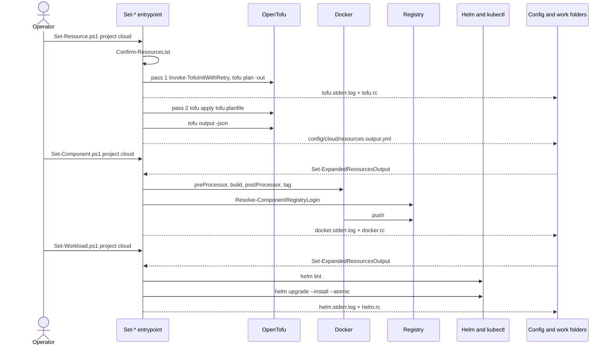
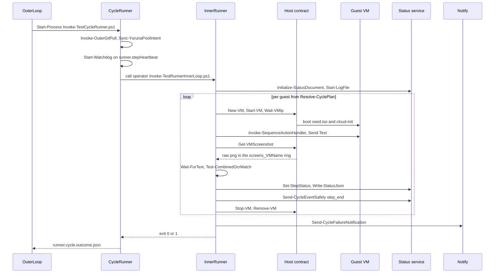
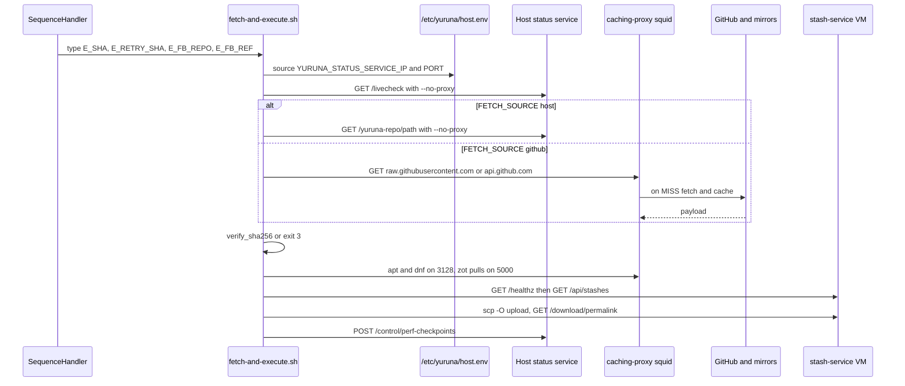
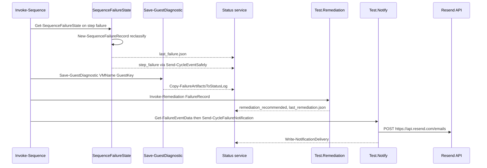
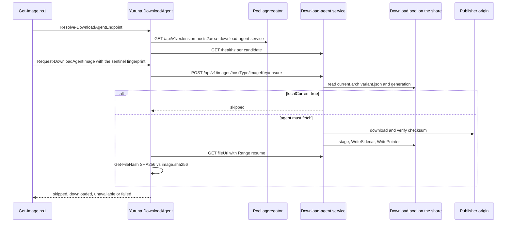
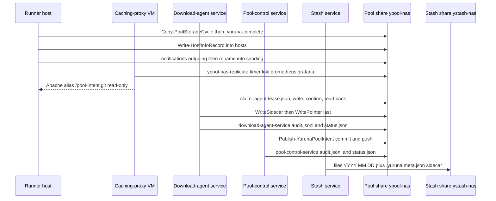

# Data flows

> One sentence: the most frequent runtime data flows, one sequence diagram each.

See [Design overview](00-index.md) · [Component breakdown](02-component-breakdown.md) · [Yuruna Architecture](../architecture.md).

Derived from `automation/Set-{Resource,Component,Workload}.ps1`,
`automation/Yuruna.{Resource,Component,Component.Registry,Workload,DeploymentKind,Retry,Result,VariableExpansion}.psm1`,
`automation/fetch-and-execute.sh`, `automation/Get-SystemDiagnostic.ps1`,
`test/modules/{Test.RunnerOuterLoop,Test.RunnerInnerLoop,Test.SequenceEngine,Test.SequenceAction,Test.SequenceFailureState,Test.SequencePlanner,Test.Status,Test.OcrEngine,Test.OcrMatch,Test.Diagnostic,Test.Remediation,Test.Notify,Test.PoolStorage,Test.PoolNotifier,Test.HostIdentity}.psm1`,
`host/modules/Yuruna.DownloadAgent.psm1` with the `host/*/guest.*/Get-Image.ps1`
call sites, `host/vmconfig/{ubuntu.server,caching-proxy-service}.base.user-data`,
and the `test/extension/{download-agent-service,pool-control-service,stash-service}/server/`
daemons.

Each diagram carries only the participants that actually exchange messages —
seven or fewer everywhere. Where reality has more actors than that, the fold is
named in the prose under the diagram.

## A. Three-phase deployment


```mermaid
sequenceDiagram
    actor Operator
    participant Engine as Set-* entrypoint
    participant Tofu as OpenTofu
    participant Docker
    participant Registry
    participant Cluster as Helm and kubectl
    participant Files as Config and work folders

    Operator->>Engine: Set-Resource.ps1 project cloud
    Engine->>Engine: Confirm-ResourceList
    Engine->>Tofu: pass 1 Invoke-TofuInitWithRetry, tofu plan -out
    Engine-->>Files: tofu.stderr.log + tofu.rc
    Engine->>Tofu: pass 2 tofu apply tofu.planfile
    Engine->>Tofu: tofu output -json
    Engine-->>Files: config/cloud/resources.output.yml

    Operator->>Engine: Set-Component.ps1 project cloud
    Files-->>Engine: Set-ExpandedResourcesOutput
    Engine->>Docker: preProcessor, build, postProcessor, tag
    Engine->>Registry: Resolve-ComponentRegistryLogin
    Docker->>Registry: push
    Engine-->>Files: docker.stderr.log + docker.rc

    Operator->>Engine: Set-Workload.ps1 project cloud
    Files-->>Engine: Set-ExpandedResourcesOutput
    Engine->>Cluster: helm lint .
    Engine->>Cluster: helm upgrade --install --atomic
    Engine-->>Files: helm.stderr.log + helm.rc
```

| Box | Real artifact |
|---|---|
| `Operator` | the project's own guest workload script, e.g. `yuruna-project/example/website/test/ubuntu.server.26/ubuntu.server.26.workload.k8s.website.sh` (three `pwsh ../../automation/Set-*.ps1` calls) |
| `Engine` | `automation/Set-Resource.ps1`, `Set-Component.ps1`, `Set-Workload.ps1` over `Yuruna.Resource.psm1`, `Yuruna.Component.psm1`, `Yuruna.Workload.psm1` |
| `Tofu` | `tofu` invoked through `Invoke-DynamicExpression.psm1` under `Yuruna.Retry.psm1` |
| `Docker` / `Registry` | `Invoke-ComponentCommand` inside `Yuruna.Component.psm1`; login resolved by `Yuruna.Component.Registry.psm1` → `Yuruna.CredentialProvider.psm1` |
| `Cluster` | `Invoke-WorkloadChartDeployment` / `Invoke-WorkloadToolDeployment` in `Yuruna.Workload.psm1` |
| `Files` | `<project_root>/config/<cloud>/*.yml` and `<project_root>/.yuruna/<cloud>/{resources,components,workloads}/` |

The operator runs the phases one by one; **nothing chains them**. No file under
`automation/` invokes another `Set-*.ps1` — the in-guest variant of this flow is
the project's own workload script spawning one `pwsh` per phase, and in the
website example the three calls are not even adjacent (a `kubectl config
rename-context` derived from the freshly written `resources.output.yml` sits
between phase 1 and phase 2). `resources.output.yml` is the only hand-off.

**The resource phase is two passes, not one.** `Publish-ResourceList` calls
`Publish-ResourceListHelper` twice. Pass 1 (`isInitialization = $true`) expands
`globalVariables` into a module-scope bag, runs `tofu init` and
`tofu plan -out=tofu.planfile`, and aborts with a `config_error` manifest if
`.terraform` already exists — the message points at `yuruna clear`. Pass 2
truncates and rewrites `resources.output.yml`, re-inits, applies the **saved
plan file**, and runs `tofu output -json` per resource. When the plan file is
missing, pass 2 falls back to a refreshing `tofu apply` that is deliberately
**not** retryable, because a refreshing apply is not the plan that was reviewed.

Each resource's work folder is staged atomically: the template is copied into
`<wf>.new`, `.terraform` / `.terraform.lock.hcl` / `tofu.planfile` are carried
over, `<wf>` moves to `<wf>.old`, `<wf>.new` moves into place, and a
`.workfolder.complete` marker is written last. A **SIGKILL-recovery guard** runs
before any other staging step: if `<wf>` is gone but `<wf>.old` survives, the
prior cycle died between the two moves and `.old` is restored — without it the
next `tofu apply` would run against a stateless folder and destroy live cloud
resources.

The component phase is six ordered steps through `Invoke-ComponentCommand` —
`preProcessor`, `build`, `postProcessor`, `tag`, `registryLogin`, `push` (the
pre/post hooks and the login are optional). `registryLogin` dispatches through
`Yuruna.CredentialProvider.psm1`, whose five providers (`azurecr`, `ecr`, `gar`,
`dockerhub`, `docker-generic`) are matched first-wins by hostname pattern; a
`$null` answer silently skips the phase.

The workload phase runs one of **four** registered deployment kinds — `chart`,
`kubectl`, `helm`, `shell` — resolved by `Resolve-YurunaDeploymentKind` from the
single catalog in `Yuruna.DeploymentKind.psm1`. The chart pipeline is
`helm lint .` (the explicit `.` is a helm 4 required argument) then
`helm upgrade --install --atomic <installName> . --debug`, with a pending-release
pre-flight that `helm rollback`s and, failing that, `helm uninstall`s a release
left `pending-*` by a prior-cycle SIGKILL. It never runs a bare `helm install`.
Only `kubectl` and `helm` expressions are retryable; `chart` and `shell` are not.

### The `.stderr.log` / `.rc` sidecar contract

Every phase captures tool output and the tool's exit code to a stable pair of
paths, so a post-mortem never depends on the transcript surviving:

| Phase | Log | Exit code | Written by |
|---|---|---|---|
| Resource | `.yuruna/<cloud>/resources/<resource>/tofu.stderr.log` | `…/tofu.rc` | `Invoke-WithYurunaRetry -LogPath -RcFile` for init, apply and output |
| Component | `.yuruna/<cloud>/components/docker.stderr.log` (all components append) | `.yuruna/<cloud>/components/docker.rc` (last phase wins) | `Invoke-ComponentCommand` |
| Workload chart | `.yuruna/<cloud>/workloads/<context>/<installName>/helm.stderr.log` | `…/helm.rc` | inline `Add-Content` / `Set-Content` in `Yuruna.Workload.psm1` |
| Workload tool | `.yuruna/<cloud>/workloads/<context>/<tool>.stderr.log` | `…/<tool>.rc` | retry `-LogPath` plus an inline `Set-Content` |

`Get-SystemDiagnostic.ps1` is the consumer: it globs `*.stderr.log` under the
repo root with `-Force` (needed for the dot-directory `.yuruna`), tails each to
64 KB, and derives the sidecar by rewriting `.stderr` to `.rc` so every dump is
annotated `(last rc=N)`. It also carries the
`GAP.tofu-state-without-helm-releases` heuristic — tfstate present but zero helm
releases means the workloads phase never ran.

**Failure shapes differ, and the diagram's uniform arrows hide it.** Every
*config* error returns a `New-YurunaResultManifest` with a `failureClass` from
`ok | config_error | cluster_unreachable | chart_invalid | tool_failed | unknown`;
every *tool* error inside the resource phase `throw`s. `Set-Resource.ps1` has no
try/catch, so a tofu throw escapes past `Stop-Transcript` and
`Complete-YurunaRun` — the process still exits 1, but it emits a bare PowerShell
exception rather than the `{"success":false,…}` JSON the component and workload
phases emit.

## B. Test cycle (one guest)


```mermaid
sequenceDiagram
    participant Outer as OuterLoop
    participant Cycle as CycleRunner
    participant Inner as InnerRunner
    participant Host as Host contract
    participant Guest as Guest VM
    participant Status as Status service
    participant Notify

    Outer->>Cycle: Start-Process Invoke-TestCycleRunner.ps1
    Cycle->>Cycle: Invoke-OuterGitPull, Sync-YurunaPoolIntent
    Cycle->>Cycle: Start-Watchdog on runner.stepHeartbeat
    Cycle->>Inner: call operator Invoke-TestRunnerInnerLoop.ps1
    Inner->>Status: Initialize-StatusDocument, Start-LogFile
    loop per guest from Resolve-CyclePlan
        Inner->>Host: New-VM, Start-VM, Wait-VMIp
        Host->>Guest: boot seed.iso and cloud-init
        Inner->>Guest: Invoke-SequenceActionHandler, Send-Text
        Inner->>Host: Get-VMScreenshot
        Host-->>Inner: raw png in the screens_VMName ring
        Inner->>Inner: Wait-ForText, Test-CombinedOcrMatch
        Inner->>Status: Set-StepStatus, Write-StatusJson
        Inner->>Status: Send-CycleEventSafely step_end
        Inner->>Host: Stop-VM, Remove-VM
    end
    Inner->>Notify: Send-CycleFailureNotification
    Inner-->>Cycle: exit 0 or 1
    Cycle-->>Outer: runner.cycle.outcome.json
```

| Box | Real artifact |
|---|---|
| `Outer` | `test/Invoke-TestRunner.ps1` + `test/modules/Test.RunnerOuterLoop.psm1` |
| `Cycle` | `test/modules/Invoke-TestCycleRunner.ps1` (a fresh process per cycle) |
| `Inner` | `test/modules/Invoke-TestRunnerInnerLoop.ps1` + `Test.RunnerInnerLoop.psm1`, `Test.SequenceEngine.psm1` |
| `Host` | `test/modules/Test.HostContract.psm1` `Initialize-YurunaHost` over `host/<host type>/modules/Yuruna.Host.psm1` |
| `Guest` | the `test-`-prefixed VM seeded from `host/vmconfig/<key>.base.user-data` |
| `Status` | `test/Start-StatusService.ps1` writing `test/status/runtime/status.json` via `Test.Status.psm1` |
| `Notify` | `test/modules/Test.Notify.psm1` → `test/extension/notification/default.psm1` |

**Three processes, not two**, each a fresh `pwsh`: the long-lived outer loop, one
cycle runner per cycle, and one inner runner inside it. The per-cycle child
exists so that the cycle logic and every module it imports is **re-read from disk
each cycle** — an operator edit lands on the next cycle without restarting the
runner. It is `Start-Process`-spawned and then *polled* (`WaitForExit(1000)` in a
loop) rather than waited on, which is what makes Ctrl+C observable mid-cycle. The
inner is spawned with the **call operator** so it inherits the terminal, and
reports transient outcomes (`pull-error`, `spawn-failed`, `cycle-aborted`,
`drain`, `shutdown`) through `runner.cycle.outcome.json` rather than an exit
code; only the inner's exit code drives the fault path.

Two participants are folded. `Host` stands for the whole 38-verb host contract
(`host/Yuruna.Host.Contract.psm1`) and the three drivers behind it, and the OCR
stack is drawn as a **self-message on `Inner`** rather than an eighth box —
correctly, because `Test.OcrEngine.psm1` runs in the inner process
(`tesseract` in-process, `winrt` through a persistent Windows PowerShell 5.1
worker, `macos-vision` through a cached `swiftc -O` binary). `Wait-ForText`
polls against a **wall-clock deadline**, not an iteration count: each poll takes
a fresh `Get-VMScreenshot`, ring-buffers it to `screens_<VM>/raw_<ts>.png` with a
`.txt` sidecar, and asks `Test-CombinedOcrMatch` in `Or` or `And` combine mode.

The per-guest step plan is derived per cycle by `Get-CycleStepNameList`:
`New-VM` → `Start-VM` → `Start-GuestOS` → `New-VM.Resource` → `Screenshots`
(only when a screenshot schedule exists) → `Start-GuestWorkload` (only when
workload sequences exist) → teardown. A plan with neither optional step runs
four. Three steps have a third outcome besides pass/fail — `skipped`. Teardown is
not a formality: if a VM is still `running` after `Stop-VM` / `Remove-VM` and one
retry, the step is recorded as `Cleanup`, a `provisioning_failure` record is
written by `Write-CycleInfraFailure`, and the guest loop breaks — so a guest can
fail after every step passed.

The guarding machinery is deliberately outside the loop. `Start-Watchdog` arms a
`Start-Job` child **before** the spawn and reads `runtime/runner.stepHeartbeat`,
under one of two bounds selected by whether `runtime/runner.phase` exists: the
tight preamble bound (default 600 s) while the inner is still in `bootstrap` /
`host-detect` / `host-network` / `service-vm-restore` / `caching-proxy-gate` /
`status-service`, and the full step bound (default 2700 s) after
`Clear-RunnerPhase`. A stale heartbeat kills the inner's **whole process tree**,
leaves `runtime/runner.watchdog.lapsed` behind, and the outer then synthesizes a
`last_failure.json` carrying `reason=watchdog_kill` and
`failureClass=wait_timeout`.

## C. Guest repo, proxy and stash fetch


```mermaid
sequenceDiagram
    participant Harness as SequenceHandler
    participant Guest as fetch-and-execute.sh
    participant HostEnv as /etc/yuruna/host.env
    participant StatusSrv as Host status service
    participant Proxy as caching-proxy squid
    participant Upstream as GitHub and mirrors
    participant Stash as stash-service VM

    Harness->>Guest: type E_SHA, E_RETRY_SHA, E_FB_REPO, E_FB_REF
    Guest->>HostEnv: source YURUNA_STATUS_SERVICE_IP and PORT
    Guest->>StatusSrv: GET /livecheck with --no-proxy
    alt FETCH_SOURCE host
        Guest->>StatusSrv: GET /yuruna-repo/path with --no-proxy
    else FETCH_SOURCE github
        Guest->>Proxy: GET raw.githubusercontent.com or api.github.com
        Proxy->>Upstream: on MISS fetch and cache
        Upstream-->>Proxy: payload
    end
    Guest->>Guest: verify_sha256 or exit 3
    Guest->>Proxy: apt and dnf on 3128, zot pulls on 5000
    Guest->>Stash: GET /healthz then GET /api/stashes
    Guest->>Stash: scp -O upload, GET /download/permalink
    Guest->>StatusSrv: POST /control/perf-checkpoints
```

| Box | Real artifact |
|---|---|
| `Harness` | `Get-FetchExecuteEnvPrefix` in `test/modules/Test.SequenceHandler.psm1` |
| `Guest` | `automation/fetch-and-execute.sh`, installed mode 0755 by cloud-init |
| `HostEnv` | `/etc/yuruna/host.env`, written by `host/vmconfig/ubuntu.server.base.user-data`; refreshed by `automation/yuruna-host-locate.sh` |
| `StatusSrv` | `test/Start-StatusService.ps1` on `statusService.port` (default 8080) |
| `Proxy` | the `yuruna-caching-proxy-service` VM from `host/vmconfig/caching-proxy-service.base.user-data` (squid 3128/3129, zot 5000) |
| `Upstream` | `raw.githubusercontent.com` / `api.github.com`, apt and dnf mirrors |
| `Stash` | `test/extension/stash-service/server/` — one process on `:22` (SCP/SFTP) and `:80` (UI/API) |

**The digest gate is the point of this flow.** The fetched bytes are never handed
to `bash` until `verify_sha256` matches them against `E_SHA`. That digest arrives
*out of band*: `Get-FetchExecuteEnvPrefix` hashes the working-tree copy of the
script the guest is about to fetch and types
`EXEC_REQUIRE_SHA256=1 E_SHA=… E_RETRY_SHA=… E_FB_REPO=<owner/repo> E_FB_REF=<12-hex>`
over the console or SSH channel, never over the HTTP the bytes came from. A
missing digest under `EXEC_REQUIRE_SHA256=1` fails closed; a mismatch triggers
exactly one re-fetch and re-verify (absorbing a concurrent-edit race) and
otherwise exits 3. The short names are a keystroke budget, not a style choice —
see [the typed envelope](../definition.md#defining-the-fetch-and-execute-typed-envelope).
Both name generations stay live so host and guest can skew in either direction:
`EXEC_REQUIRE_SHA256` keeps its long name because an older guest image
recognizes only that spelling and must fail closed, and the legacy `EXEC_*`
spellings are still read so a current guest works under an older host. `GH_TOKEN`
is never typed — the console is screenshotted and OCR'd into the published run
log — so the guest gets it from the cloud-init seed instead.

Proxy routing is the opposite of what it looks like. `--no-proxy` is set **only**
for the host route, so `/livecheck`, `/yuruna-repo/` and the perf-checkpoint POST
deliberately bypass squid, while the GitHub fallback inherits the guest-wide
`http_proxy` / `https_proxy` that cloud-init writes into `/etc/environment`,
`/etc/profile.d/yuruna-proxy.sh` and
`/etc/systemd/system.conf.d/yuruna-proxy.conf` — `github.com` is not in
`no_proxy`. The fallback is also conditional: with no pinned repo and ref (from
`E_FB_REPO` / `E_FB_REF` or `host.env`) the script prints `NO FETCH SOURCE` and
exits 2. When `GH_TOKEN` is set the fallback uses the `api.github.com` Contents
API with the token in a 0600 `mktemp` wgetrc via `--config`, never a header;
otherwise `raw.githubusercontent.com`. An `EXEC_BASE_URL` operator override is
the third branch. `automation/Yuruna.GitHubSource.psm1` is what makes the
fallback sound: it answers the repo slug, the exact commit the host is serving,
and the token, so the fallback lands on the same bytes the digest was taken from
rather than on a moving branch or a public mirror.

**The stash leg is a different contract from the proxy leg.** The proxy is
transparent — the guest sets no stash address of its own. The stash address is
resolved *by the harness* through `${ext:stash-service.ResolveHost(<vm>)}` in a
sequence's `variables:` block (`Resolve-Host` in
`test/extension/stash-service/default.psm1`, re-probed per cycle because a cycle
runs for tens of minutes), passed into the guest as an environment variable on
the `sshFetchAndExecute` command line, and used two ways by a project workload: a
builder guest proves `GET /healthz` **before** compiling and then `scp -O`s the
artifact to `:22`, and a consumer guest reads `GET /api/stashes?...&limit=1`,
takes the `permalink`, and downloads it under `/download/`. Both legs run
`--noproxy '*'`: the stash is on the LAN and squid has no business caching it.

Two side effects the arrows understate: when
`/usr/local/lib/yuruna/yuruna-retry.sh` is unreadable the script re-fetches it
through the same digest gate (that is what `E_RETRY_SHA` is for) and `sudo`
installs it as root-owned library code; and `/control/perf-checkpoints` is the
only guest-to-host write on the framework's own path, sent when profiling is
enabled and the host route was used. The separate `/log-upload/<rel>` sink exists
for a *failed install*, driven from the cloud-init seed rather than from this
script, which is why it is not an arrow here.

The proxy leg is deliberately conservative about revalidation: `offline_mode on`
serves a stored object without asking the origin whether it changed, and long
`refresh_pattern` entries with `override-expire override-lastmod` pin `.deb`,
`.iso`, `.zip`, tarballs and registry blobs. That suppresses fetching only for
objects already stored — a MISS still goes upstream. The switch that actually
refuses upstream is a separate `/etc/squid/conf.d/yuruna-no-upstream.conf` the
operator writes on demand.

## D. Failure, taxonomy and alert


```mermaid
sequenceDiagram
    participant Engine as Invoke-Sequence
    participant Fail as SequenceFailureState
    participant Diag as Save-GuestDiagnostic
    participant Status as Status service
    participant Remed as Test.Remediation
    participant Notify as Test.Notify
    participant Resend as Resend API

    Engine->>Fail: Get-SequenceFailureState on step failure
    Fail->>Fail: New-SequenceFailureRecord reclassify
    Fail-->>Status: last_failure.json
    Fail-->>Status: step_failure via Send-CycleEventSafely
    Engine->>Diag: Save-GuestDiagnostic VMName GuestKey
    Diag-->>Status: Copy-FailureArtifactsToStatusLog
    Engine->>Remed: Invoke-Remediation FailureRecord
    Remed-->>Status: remediation_recommended, last_remediation.json
    Engine->>Notify: Get-FailureEventData then Send-CycleFailureNotification
    Notify->>Resend: POST https://api.resend.com/emails
    Notify-->>Status: Write-NotificationDelivery
```

| Box | Real artifact |
|---|---|
| `Engine` | `Invoke-Sequence` in `test/modules/Test.SequenceEngine.psm1` |
| `Fail` | `test/modules/Test.SequenceFailureState.psm1` with the enum in `Test.FailureTaxonomy.psm1` |
| `Diag` | `Save-GuestDiagnostic` in `test/modules/Test.Diagnostic.psm1`; host side is `automation/Get-SystemDiagnostic.ps1` |
| `Status` | `test/status/log/<cycle>/` plus `runtime/status.json` and `cycle.events.ndjson` |
| `Remed` | `test/modules/Test.Remediation.psm1` |
| `Notify` | `test/modules/Test.Notify.psm1` |
| `Resend` | `test/extension/notification/default.psm1` reading `transports.resend.apiKey` |

**One record, two destinations, built once.** `New-SequenceFailureRecord` builds
the `last_failure.json` ordered dictionary *and* the matching `step_failure`
NDJSON record from the same live store, so the file and the stream can never
drift. It starts from the failing verb's registry entry in `Test.SequenceAction`
— all 21 verbs carry a `FailureClass`, `Severity` and `SuggestedRecoveries` — and
then applies **ordered reclassification**: a matched fail-pattern wins as
`pattern_matched_failure`, else an unresolved guest address becomes
`ip_not_discovered`, else a lost transport becomes `network_timeout`, else a lost
run becomes `instrumentation_failure`, else a missing payload becomes
`payload_unavailable`. The resulting `classificationSource` is one of `crash`,
`pattern-match`, `verb-registry`, `unresolved-verb`.

`Test.FailureTaxonomy.psm1` is the single source of truth for the 21 classes and
the three severities (`hard`, `soft`, `unknown`); `Test.EventSchema.psm1`
validates every emitted event
against it but **never rejects** — a violation emits a synthetic
`schema_violation` event naming the bad fields plus the original record, so a bug
in the emitter costs visibility rather than data.

The alert is gated, not immediate. A latch persisted in
`runtime/runner.gating.json` runs `Armed → (failuresBeforeAlert failures) →
Fired → (successesBeforeRearm successes) → Armed`, because each cycle is a fresh
process and an in-memory counter would reset every time.
`Invoke-Remediation` sits on the path but is **advisory only** — it computes a
recommendation, emits `remediation_recommended` and persists
`last_remediation.json`, and never acts; it is skipped entirely when the failure
is the planner's own (`FailedGuest -eq '(planner)'`).

A watchdog kill enters the same path from the other side. The outer detects that
the inner exited non-zero **and** `runner.stepHeartbeat` is older than the step
timeout, then synthesizes `last_failure.json` itself with `reason=watchdog_kill`,
`failureClass=wait_timeout`, `classificationSource=synthetic` and
`synthesizedBy=outer-watchdog` — only if the inner left none. That synthetic
class is exactly what lets the streak-capped auto-remediation break the failure
pause early instead of waiting the full human pause.

**A third entry needs no cycle at all.** `Test-OuterPoolStorageSpaceReady` runs
*before* the spawn, and when the projected archive will not fit it writes the
record itself — `Write-PoolStorageSpaceFailureRecord` with
`failureClass = pool_storage_full`, then `Send-PoolStorageSpaceNotification` —
and returns the `storage-full` outcome without ever starting an inner. The class
is deliberately **absent** from the auto-remediation allow-list the watchdog
class sits in: a full share does not clear on a retry, so this one holds the
full human pause on purpose. The ordering matters as much as the class — the
check sits after the `last_failure.json` wipe, because reading a stale transient
record from the previous cycle is exactly what would cut the pause short and walk
the runner back into the same wall minutes later.

## E. Agent-first image acquisition


```mermaid
sequenceDiagram
    participant Image as Get-Image.ps1
    participant Client as Yuruna.DownloadAgent
    participant Agg as Pool aggregator
    participant Agent as Download-agent service
    participant Pool as Download pool on the share
    participant Origin as Publisher origin

    Image->>Client: Resolve-DownloadAgentEndpoint
    Client->>Agg: GET /api/v1/extension-hosts?area=download-agent-service
    Client->>Agent: GET /healthz per candidate
    Image->>Client: Request-DownloadAgentImage with the sentinel fingerprint
    Client->>Agent: POST /api/v1/images/hostType/imageKey/ensure
    Agent->>Pool: read current.arch.variant.json and generation
    alt localCurrent true
        Agent-->>Client: skipped
    else agent must fetch
        Agent->>Origin: download and verify checksum
        Agent->>Pool: stage, WriteSidecar, WritePointer
        Client->>Agent: GET fileUrl with Range resume
        Client->>Client: Get-FileHash SHA256 vs image.sha256
    end
    Client-->>Image: skipped, downloaded, unavailable or failed
```

| Box | Real artifact |
|---|---|
| `Image` | `host/<provider>/guest.<key>/Get-Image.ps1` over `host/modules/Yuruna.UbuntuImage.psm1` / `Yuruna.Image.psm1` |
| `Client` | `host/modules/Yuruna.DownloadAgent.psm1` (exports exactly `Resolve-DownloadAgentEndpoint`, `Get-DownloadAgentImageMetadata`, `Request-DownloadAgentImage`) |
| `Agg` | `test/extension/pool-aggregator-service/main.go` on `:9400`, inside the caching-proxy VM |
| `Agent` | `test/extension/download-agent-service/server/` on `:80` |
| `Pool` | `<pool share>/images/` — `internal/imagestore/store.go`, `lease.go` |
| `Origin` | `releases.ubuntu.com`, `cdimage.ubuntu.com`, `cloud-images.ubuntu.com`, `cdn.amazonlinux.com`, and a pinned Fido for Windows 11 |

**This flow can only ever save work, never cost a cycle.** Every rung degrades to
the plain publisher path: `Yuruna.DownloadAgent.psm1` imports nothing and throws
nothing — `Resolve-DownloadAgentEndpoint` collapses to `''` when nothing answers,
and `Request-DownloadAgentImage` collapses to an `unavailable` or `failed`
outcome, so the caller proceeds exactly as a lab running no agent would. It also
exports only uniquely-named functions, so it can never take the command-table
slot a driver's cache-injecting `Save-CachedHttpUri` owns.

Discovery is a **three-rung ladder in fixed order**, folded here into one
aggregator arrow rather than three participants: the operator pin
(`YURUNA_EXTENSION_HOST_DOWNLOAD_AGENT_SERVICE`), then an agent VM named
`yuruna-download-agent-service` on this host via the driver's `Get-VMIp`, then
the pool's record from the aggregator. The pin is first because it is the escape
hatch for a lab whose discovery is wrong. **Every candidate is proved with
`/healthz` on a two-second budget** before it is accepted, so three dead rungs
cannot noticeably delay a cycle.

The ensure body is a fingerprint, not a hash: filename, byte count and an
almost-always-empty `sha256`. The host's 4-line image sentinel records filename /
source URL / byte count / `Last-Modified`, and hashing a multi-gigabyte local
artifact just to ask a question would cost more than the download the question is
trying to avoid. `downloaded` is claimed only after the received bytes hash to
the agent's advertised SHA-256; the staging file is removed on every other
outcome, so a bogus artifact can never be promoted by a caller that only checks
for a file. The byte route resumes with `Range: bytes=<offset>-`, and a `200`
answer to a ranged request forces `FileMode.Create` rather than `Append` — a
server that ignored the range must not have its bytes spliced onto a partial.

The `Agent->>Origin` arrow hides one asymmetry between guest families. Most
images have a stable publisher URL; the Windows 11 ISO does not, so the agent
runs a pinned, SHA-256-verified copy of Fido in its own VM to mint a signed
Microsoft URL. The same script is what a host runs on its own when no agent
answers, which is why "the agent cannot serve Windows" degrades to the ordinary
path rather than to no image.

Two directions of traffic are deliberately opposite. Byte transfers go through
squid first and fall back to direct on any proxy failure; **freshness probes and
resolver fetches always go direct**, because the proxy pins `.iso` / `.zip` with
`override-expire override-lastmod` and runs `offline_mode` after prewarm — a
proxied `HEAD` would return frozen prewarm-era headers as a success and certify
staleness as freshness forever.

## F. What lives on the shared storage


```mermaid
sequenceDiagram
    participant Runner as Runner host
    participant Cache as Caching-proxy VM
    participant Agent as Download-agent service
    participant Ctl as Pool-control service
    participant Stash as Stash service
    participant PoolNas as Pool share ypool-nas
    participant StashNas as Stash share ystash-nas

    Runner->>PoolNas: Copy-PoolStorageCycle then .yuruna-complete
    Runner->>PoolNas: Write-HostInfoRecord into hosts
    Runner->>PoolNas: notifications outgoing then rename into sending
    Cache->>PoolNas: ypool-nas-replicate.timer loki prometheus grafana
    Cache-->>Runner: Apache alias /pool-intent.git read-only
    Agent->>PoolNas: claim .agent-lease.json, write, confirm, read back
    Agent->>PoolNas: WriteSidecar then WritePointer last
    Agent->>PoolNas: download-agent-service audit.jsonl and status.json
    Ctl->>PoolNas: Publish-YurunaPoolIntent commit and push
    Ctl->>PoolNas: pool-control-service audit.jsonl and status.json
    Stash->>StashNas: files YYYY MM DD plus .yuruna.meta.json sidecar
```

| Box | Real artifact |
|---|---|
| `Runner` | `test/modules/Invoke-PoolStorageDrain.ps1` + `Test.PoolStorage.psm1`, `Test.HostIdentity.psm1`, and the in-process `Invoke-PoolNotifierCycle` from `Test.PoolNotifier.psm1` |
| `Cache` | `host/vmconfig/caching-proxy-service.base.user-data` (`ypool-nas-replicate.timer`, the Apache `Alias /pool-intent.git`) |
| `Agent` | `test/extension/download-agent-service/server/internal/{imagestore,state}` |
| `Ctl` | `test/extension/pool-control-service/server/internal/{intent,state}` + `test/modules/Test.PoolAdmin.psm1` |
| `Stash` | `test/extension/stash-service/server/internal/store` |
| `PoolNas` | `networkStorage.poolStorage{LocalPath,NetworkPath,NetworkUser}` |
| `StashNas` | `networkStorage.stashStorage{LocalPath,NetworkPath,NetworkUser}` |

`Runner` is a **≤7 fold**: the detached `Invoke-PoolStorageDrain.ps1` and the
in-process pool notifier are two different writers that happen to run on the same
machine, drawn as one participant so the two shares stay visible.

**Two shares, not one.** The pool tier and the stash tier have their own path,
their own SMB account, their own credential and their own mount point; the stash
never touches the pool share. Both are optional and both are off by default —
empty paths are a complete no-op. Only the pool tier has a replicate flag
(the three `networkStorage.poolStorage*` paths); the stash daemon writes files directly, so
`Get-YurunaStashStorageConfig` reports `Replicate = $false` always while keeping
the same shape so the generic mount helpers work unchanged.

On-share layout, derived from `Test.PoolStorage.psm1`, `Test.HostIdentity.psm1`,
`Test.PoolNotifier.psm1`, the download-agent's `internal/config` and
`internal/imagestore`, the pool-control service's `internal/state`, and
`host/vmconfig/{caching-proxy-service,stash-service}.base.user-data`:

```
<pool share>/
  hosts/info.<hostId>.yml            host registry: uuid + hardware fingerprint
  hosts/<hostId>/test-cycles/<cycle>/  one finished cycle, .yuruna-complete last
  hosts/<hostId>/services/caching-proxy-service/{loki,prometheus,grafana}/
  images/                            the Download pool
    .agent-lease.json                single-writer lease, at the images root
    <hostType>/<imageKey>/current.<arch>.<variant>.json  servable pointer
    <hostType>/<imageKey>/<file>.<sha256[:12]>[.meta.json]
    <hostType>/<imageKey>/.staging/  agent-private, swept at 24h
  download-agent-service/            audit.jsonl + status.json
  pool-control-service/              audit.jsonl + status.json
  pool-intent.git                    pools.yml, test-sets.yml, compatibility map
  notifications/{outgoing,sending,delivered,failed}/   pool-alert spool

<stash share>/
  stash/<hostId>/hostkey/            the SSH host key the sink presents
  stash/<hostId>/files/YYYY/MM/DD/   artifacts + .yuruna.meta.json sidecars
```

**Five writers, five different disciplines** — and none of them is a lock in the
usual sense:

- **The drain** writes only into its own `hosts/<hostId>/` namespace, so there is
  no cross-host contention at all. One directory carries both shapes on purpose:
  `hosts/` holds the `info.<hostId>.yml` registry *files* and the per-host
  *directories* side by side, and they cannot collide because the reclaim scanner
  enumerates with `-Filter 'info.*.yml' -File`. The aggregator points
  `-pool-archive-root` at that same `hosts/` directory, which is what lets it
  serve archived cycles it never wrote. Shares written before this unification
  keep a bare `<share>/<hostId>/` root: those are **frozen** — never read, never
  migrated — and `Remove-PoolHost.ps1` is their only sanctioned deleter.
  Its single-instance guard is a local
  `runtime/poolstorage.drain.lock` claimed with `CreateNew` and recording PID
  **plus process StartTime**, so PID reuse cannot make a stale lock look live.
  Per-cycle atomicity is the `.yuruna-complete` sentinel written last, and the
  authoritative ledger is host-local (`runtime/poolstorage.state.json`) — the
  share is never consulted to decide what has been replicated, so a destination
  folder without a sentinel is deleted and recopied rather than trusted.
- **The download agent** takes an `images/.agent-lease.json` lease, but
  correctness never depends on it: **content-addressed generations make
  concurrent writers safe**, and the lease only makes duplicate work rare. It is
  claimed by write → 500 ms confirm delay → read-back, because CIFS
  atomic-create is unproven here; a live foreign lease puts the agent in
  read-only mode rather than stopping it. `Store.Commit` writes the sidecar first
  and flips the tiny pointer file **last**, so a refresh never renames over bytes
  a host is streaming.
- **The pool-control service** relies on git itself: clone-or-fetch,
  `reset --hard FETCH_HEAD` (refused outright when a rebase is in progress or
  `merge-base --is-ancestor` disagrees), schema-validated write, then commit and
  push with a rebase-retry. An unpushed commit is reported as a hard error —
  "committed locally but NOT pushed" — because the change is not durable.
- **The pool notifier** claims a message by **renaming it into `sending/`**,
  which is the atomic operation; a message stranded there past a reclaim grace
  goes back to `outgoing/`, and terminal states are `delivered/` or `failed/`.
  Exactly one host self-elects, by having a `pool.alert` subscriber in its
  `transports.yml`.
- **The stash service** writes each artifact beside a JSON sidecar so the rich
  metadata survives a VM reimage, while its SQLite index and its 5 GB
  NAS-offline buffer stay VM-local — SQLite locking is unreliable over SMB/CIFS.

**The cache VM is the odd one out**: it both writes (its own Loki, Prometheus and
Grafana data, hourly, via `ypool-nas-replicate.timer` — Grafana through
`sqlite3 .backup` rather than an rsync of an open WAL database) and serves
(Apache aliases `/pool-intent.git` to the store on the same share, read-only, so
every runner clones the intent from the cache VM while the pool-control service
writes it through its own mount).

Deletes on the share go through `Remove-PoolStorageTree`, a deadline-bounded
retry loop, because SMB acknowledges child deletes before releasing directory
entries and a plain `Remove-Item -Recurse` fails with "directory is not empty" on
a directory that enumeration already reports as empty.

Nothing here is on the cycle's critical path. The drain and the event push are
detached children the outer loop never waits on, and `Connect-YurunaPoolStorage`
never throws and never blocks — every network-touching subprocess is wall-clock
bounded and its process tree killed on timeout. It also runs a **post-mount write
probe**, because a read-only share mounts cleanly and then fails at `git push`;
the verbatim reason is recorded and read back by `Get-PoolStorageLastMountError`,
so a bring-up gate reports what actually happened instead of blaming the
credential.

---

LICENSEURI https://yuruna.link/license

Copyright (c) 2019-2026 by Alisson Sol et al.

Last review: 2026.08.16
