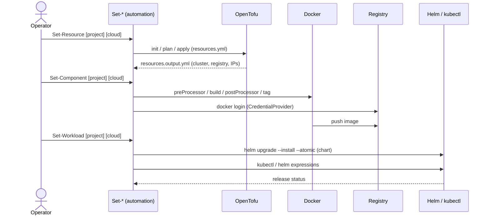
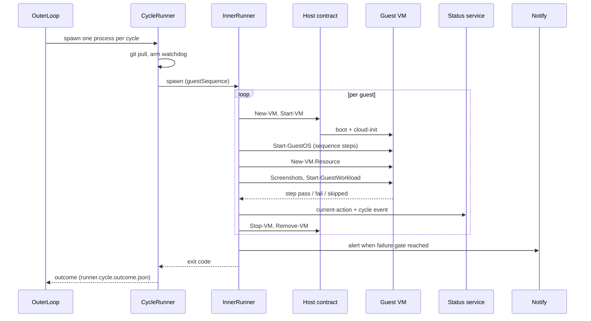
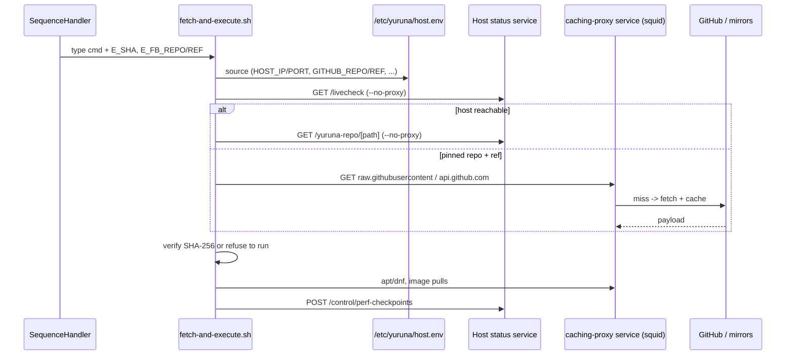
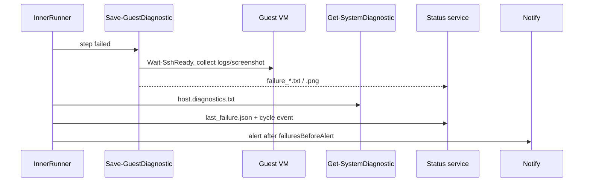

# Data flows

> One sentence: the most frequent runtime data flows, one sequence diagram each.

See [Design overview](00-index.md) · [Yuruna Architecture](../architecture.md).

Derived from `automation/Set-{Resource,Component,Workload}.ps1`,
`automation/Yuruna.{Component,Workload,DeploymentKind}.psm1`,
`test/modules/{Test.RunnerOuterLoop,Test.RunnerInnerLoop,Invoke-Sequence,Test.SequenceHandler,Test.Notify}.psm1`,
and `automation/fetch-and-execute.sh`.

## A. Three-phase deployment

```mermaid
sequenceDiagram
    actor Operator
    participant Engine as Set-* (automation)
    participant Tofu as OpenTofu
    participant Docker
    participant Registry
    participant Cluster as Helm / kubectl

    Operator->>Engine: Set-Resource [project] [cloud]
    Engine->>Tofu: init / plan / apply (resources.yml)
    Tofu-->>Engine: resources.output.yml (cluster, registry, IPs)
    Operator->>Engine: Set-Component [project] [cloud]
    Engine->>Docker: preProcessor / build / postProcessor / tag
    Engine->>Registry: docker login (CredentialProvider)
    Docker->>Registry: push image
    Operator->>Engine: Set-Workload [project] [cloud]
    Engine->>Cluster: helm upgrade --install --atomic (chart)
    Engine->>Cluster: kubectl / helm expressions
    Cluster-->>Engine: release status
```

The operator runs the phases one by one; **nothing chains them**, and the
in-guest variant of this flow is the project's own workload script spawning
one `pwsh` per phase. `resources.output.yml` is the only hand-off: written by
`Set-Resource` from `tofu output -json`, layered into the environment by both
later phases. Each phase validates its YAML first (`Confirm-*List`), and
`Set-Workload` auto-runs `Test-Runtime.ps1` as pre-flight.

The component phase is six ordered steps through `Invoke-ComponentCommand` —
`preProcessor`, `build`, `postProcessor`, `tag`, `registryLogin`, `push` (the
pre/post hooks are optional). `registryLogin` dispatches through
`Yuruna.CredentialProvider.psm1`, whose providers are matched first-wins by
URL pattern.

The workload phase runs one of **four** registered deployment kinds — `chart`,
`kubectl`, `helm`, `shell` — detected by which field is present. The chart
pipeline is `helm lint .` then `helm upgrade --install --atomic <installName>
. --debug`, with a pending-release recovery via `helm rollback` /
`helm uninstall`; it never runs a bare `helm install`. A `shell:` deployment
runs an arbitrary command and does not necessarily target the cluster at all.

## B. Test cycle (one guest)

```mermaid
sequenceDiagram
    participant Outer as OuterLoop
    participant Cycle as CycleRunner
    participant Inner as InnerRunner
    participant Host as Host contract
    participant Guest as Guest VM
    participant Status as Status service
    participant Notify

    Outer->>Cycle: spawn one process per cycle
    Cycle->>Cycle: git pull, arm watchdog
    Cycle->>Inner: spawn (guestSequence)
    loop per guest
        Inner->>Host: New-VM, Start-VM
        Host->>Guest: boot + cloud-init
        Inner->>Guest: Start-GuestOS (sequence steps)
        Inner->>Guest: New-VM.Resource
        Inner->>Guest: Screenshots, Start-GuestWorkload
        Guest-->>Inner: step pass / fail / skipped
        Inner->>Status: current-action + cycle event
        Inner->>Host: Stop-VM, Remove-VM
    end
    Inner->>Notify: alert when failure gate reached
    Inner-->>Cycle: exit code
    Cycle-->>Outer: outcome (runner.cycle.outcome.json)
```

Three processes, each a fresh `pwsh`: the long-lived outer loop, one cycle
runner per cycle, and one inner runner inside it. The cycle runner reports
transient outcomes (`pull-error`, `spawn-failed`) through
`runner.cycle.outcome.json` rather than an exit code; only the inner's exit
code drives the fault path.

The per-guest step plan is derived per cycle by `Get-CycleStepNameList`:
`New-VM` → `Start-VM` → `Start-GuestOS` → `New-VM.Resource` → `Screenshots`
(only when a screenshot schedule exists) → `Start-GuestWorkload` (only when
workload sequences exist) → teardown. A plan with neither runs four steps.
Three steps have a third outcome besides pass/fail — `skipped`. Teardown is
not a formality: if a VM is still `running` after `Stop-VM`/`Remove-VM` and
one retry, the step is recorded as `Cleanup`, a `provisioning_failure` infra
record is written, and the guest loop breaks — so a guest can fail after every
step passed.

## C. Guest repo / artifact fetch

```mermaid
sequenceDiagram
    participant Harness as SequenceHandler
    participant Guest as fetch-and-execute.sh
    participant HostEnv as /etc/yuruna/host.env
    participant StatusSrv as Host status service
    participant Proxy as caching-proxy service (squid)
    participant Upstream as GitHub / mirrors

    Harness->>Guest: type cmd + E_SHA, E_FB_REPO/REF
    Guest->>HostEnv: source (HOST_IP/PORT, GITHUB_REPO/REF, ...)
    Guest->>StatusSrv: GET /livecheck (--no-proxy)
    alt host reachable
        Guest->>StatusSrv: GET /yuruna-repo/[path] (--no-proxy)
    else pinned repo + ref
        Guest->>Proxy: GET raw.githubusercontent / api.github.com
        Proxy->>Upstream: miss -> fetch + cache
        Upstream-->>Proxy: payload
    end
    Guest->>Guest: verify SHA-256 or refuse to run
    Guest->>Proxy: apt/dnf, image pulls
    Guest->>StatusSrv: POST /control/perf-checkpoints
```

**The digest gate is the point of this flow.** The fetched bytes are never
handed to `bash` until `verify_sha256` matches them against `E_SHA`.
That digest arrives *out of band*: `Test.SequenceHandler.psm1` regex-matches
`fetch-and-execute.sh <path>` on the command line it is about to type and
prepends `EXEC_REQUIRE_SHA256=1`, `E_SHA=<Get-FileHash SHA256>`,
`E_RETRY_SHA` and `E_FB_REPO/REF` — over the SSH or console
channel, never over the HTTP the bytes came from. A missing digest under
`EXEC_REQUIRE_SHA256=1` fails closed; a mismatch triggers exactly one re-fetch
and re-verify (absorbing a concurrent-edit race) and otherwise exits 3. The
short names are a keystroke budget, not a style choice — see
[the typed envelope](../definition.md#defining-the-fetch-and-execute-typed-envelope).

Proxy routing is the opposite of what it looks like. `--no-proxy` is set
**only** for the host route, so `/livecheck`, `/yuruna-repo/` and the
perf-checkpoint POST deliberately bypass squid, while the GitHub fallback
inherits the guest-wide `http_proxy`/`https_proxy` that cloud-init writes into
`/etc/environment`, `/etc/profile.d/yuruna-proxy.sh` and
`/etc/systemd/system.conf.d/yuruna-proxy.conf` — `github.com` is not in
`no_proxy`. The fallback is also conditional: with no pinned repo and ref
(from `E_FB_REPO/REF` or `host.env`) the script prints
`NO FETCH SOURCE` and exits 2. When `GH_TOKEN` is set the fallback uses the
`api.github.com` Contents API with the token in a 0600 `mktemp` wgetrc via
`--config`, never a header; otherwise `raw.githubusercontent.com`. An
`EXEC_BASE_URL` operator override is the third branch.

Two side effects the arrows understate: when
`/usr/local/lib/yuruna/yuruna-retry.sh` is unreadable the script re-fetches it
through the same digest gate and `sudo` installs it as root-owned library
code; and `/control/perf-checkpoints` is the only guest-to-host write on this
flow, sent when profiling is enabled and the host route was used. Both
non-guest participants originate in
`host/vmconfig/ubuntu.server.base.user-data`, which writes `host.env`, sets
the proxy environment, and installs `fetch-and-execute.sh` mode 0755.

## D. Failure diagnostics & alert

```mermaid
sequenceDiagram
    participant Inner as InnerRunner
    participant Diag as Save-GuestDiagnostic
    participant Guest as Guest VM
    participant HostDiag as Get-SystemDiagnostic
    participant Status as Status service
    participant Notify

    Inner->>Diag: step failed
    Diag->>Guest: Wait-SshReady, collect logs/screenshot
    Diag-->>Status: failure_*.txt / .png
    Inner->>HostDiag: host.diagnostics.txt
    Inner->>Status: last_failure.json + cycle event
    Inner->>Notify: alert after failuresBeforeAlert
```

A watchdog kill takes the same path from the other side: the outer attributes
the kill and synthesizes `last_failure.json` with `failureClass=wait_timeout`,
`reason=watchdog_kill`, so failure-pause and auto-remediation classify it like
any other failure.

---

LICENSEURI https://yuruna.link/license

Copyright (c) 2019-2026 by Alisson Sol et al.

Last review: 2026.07.31
