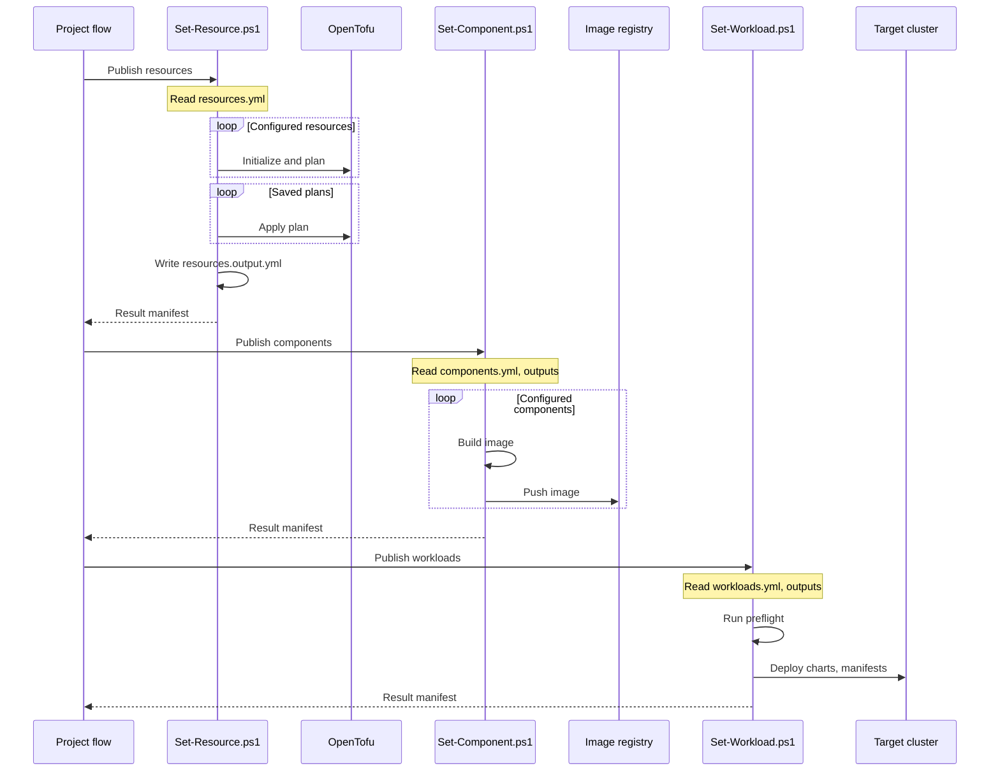
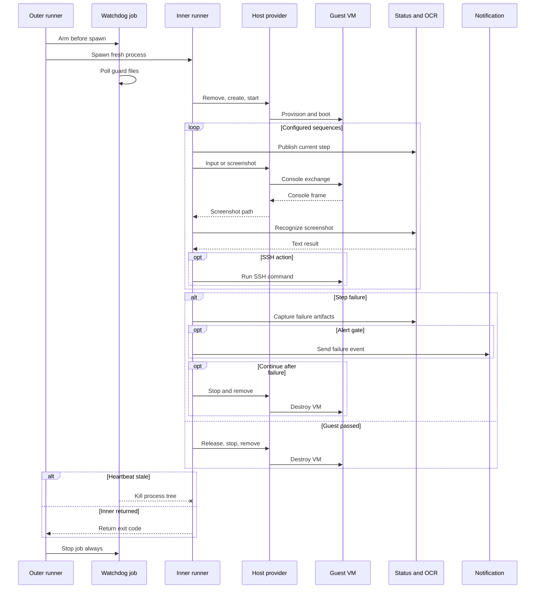
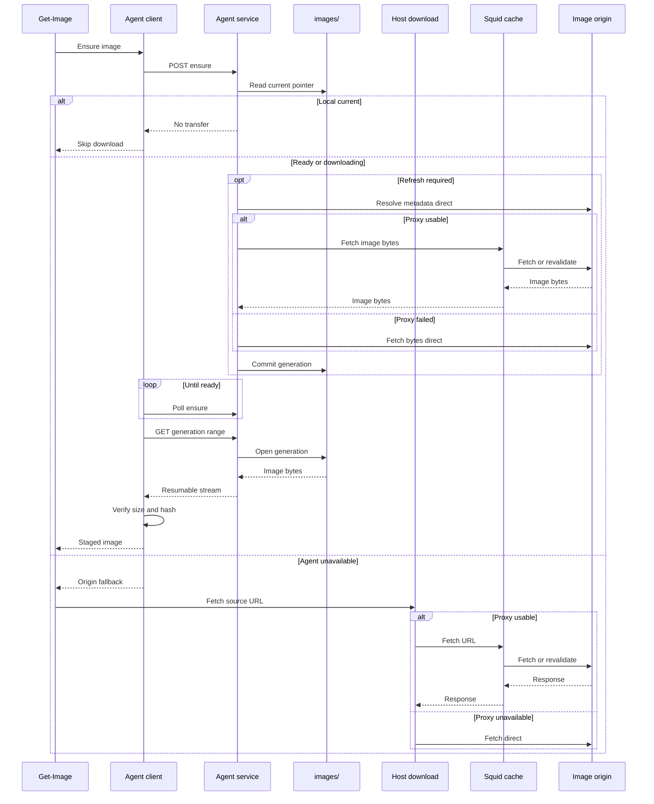
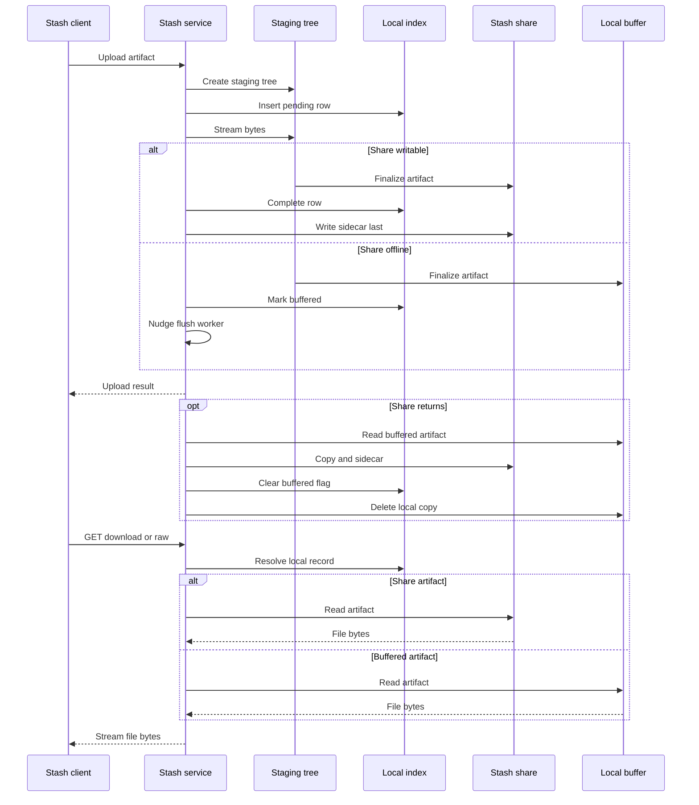
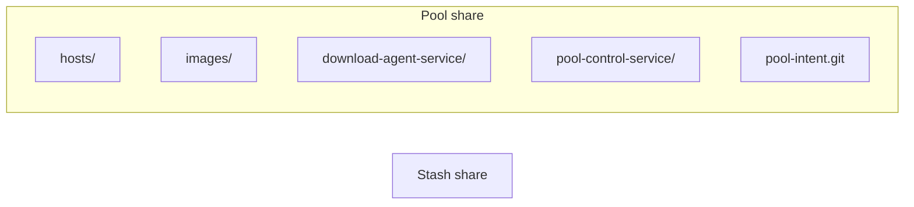

# Runtime data flows

Trace the current deployment, supervised test, image-fetch, stash, and shared-storage paths from their producers to their consumers.

## A. Three-phase deployment

The [architecture](../architecture.md#three-phase-deployment-model) defines the phase model. The three framework entry points are independent; a project flow, such as the [Ubuntu 24 website workload](https://github.com/alissonsol/yuruna-project/blob/main/example/website/test/ubuntu.server.24/ubuntu.server.24.workload.k8s.website.sh), invokes them in this order.

```mermaid
sequenceDiagram
    participant project-flow as Project flow
    participant set-resource as Set-Resource.ps1
    participant opentofu as OpenTofu
    participant set-component as Set-Component.ps1
    participant registry as Image registry
    participant set-workload as Set-Workload.ps1
    participant target-cluster as Target cluster
    project-flow->>set-resource: Publish resources
    Note over set-resource: Read resources.yml
    loop Configured resources
        set-resource->>opentofu: Initialize and plan
    end
    loop Saved plans
        set-resource->>opentofu: Apply plan
    end
    set-resource->>set-resource: Write resources.output.yml
    set-resource-->>project-flow: Result manifest
    project-flow->>set-component: Publish components
    Note over set-component: Read components.yml, outputs
    loop Configured components
        set-component->>set-component: Build image
        set-component->>registry: Push image
    end
    set-component-->>project-flow: Result manifest
    project-flow->>set-workload: Publish workloads
    Note over set-workload: Read workloads.yml, outputs
    set-workload->>set-workload: Run preflight
    set-workload->>target-cluster: Deploy charts, manifests
    set-workload-->>project-flow: Result manifest
```

Sources: [Set-Resource.ps1](../../automation/Set-Resource.ps1), [Set-Component.ps1](../../automation/Set-Component.ps1), [Set-Workload.ps1](../../automation/Set-Workload.ps1), [Yuruna.Resource.psm1](../../automation/Yuruna.Resource.psm1), [Yuruna.Component.psm1](../../automation/Yuruna.Component.psm1), [Yuruna.Workload.psm1](../../automation/Yuruna.Workload.psm1), and [Yuruna.DeploymentKind.psm1](../../automation/Yuruna.DeploymentKind.psm1). Resource publishing plans every configured resource before applying saved plans. Component and workload publishing each read `resources.output.yml` independently; shell workload deployments run locally through the deployment-kind module rather than through the cluster participant.

The architecture is canonical for [resource work-folder staging](../architecture.md#atomic-resource-work-folder-staging) and the [shared transient retry policy](../architecture.md#shared-transient-failure-retry-policy).

### The stderr.log / rc sidecar contract

Each producer records combined tool output and the latest exit code below `.yuruna/<cloud>/`. [Get-SystemDiagnostic.ps1](../../automation/Get-SystemDiagnostic.ps1) discovers the pairs recursively and correlates command results with deployment state.

| Producer | Folder below `.yuruna/<cloud>/` | Log / sidecar |
|---|---|---|
| Resource module | `resources/<resource>/` | `tofu.stderr.log` / `tofu.rc` |
| Component module | `components/` | `docker.stderr.log` / `docker.rc` |
| Workload chart | `workloads/<context>/<installName>/` | `helm.stderr.log` / `helm.rc` |
| Workload tool | `workloads/<context>/` | `<tool>.stderr.log` / `<tool>.rc` |

Resource logs reset per resource pass; component commands share one environment log. Workload tool names are `helm`, `kubectl`, and `shell`.

## B. Supervised test cycle

[Start-TestRunner.ps1](../../test/Start-TestRunner.ps1) keeps the outer process alive. Each dispatch starts a fresh [Invoke-TestCycleRunner.ps1](../../test/modules/Invoke-TestCycleRunner.ps1), so the next cycle reloads changed runner code. The outer-runner participant groups that launcher and per-cycle supervisor, which arms the watchdog and spawns the inner runner. The host-provider participant groups the platform implementations behind [Yuruna.Host.Contract.psm1](../../host/Yuruna.Host.Contract.psm1), while status and OCR group their file/status and recognition modules to keep seven participants.

```mermaid
sequenceDiagram
    participant outer-runner as Outer runner
    participant watchdog as Watchdog job
    participant inner-runner as Inner runner
    participant host-provider as Host provider
    participant guest-vm as Guest VM
    participant status-ocr as Status and OCR
    participant notification as Notification
    outer-runner->>watchdog: Arm before spawn
    outer-runner->>inner-runner: Spawn fresh process
    watchdog->>watchdog: Poll guard files
    inner-runner->>host-provider: Remove, create, start
    host-provider->>guest-vm: Provision and boot
    loop Configured sequences
        inner-runner->>status-ocr: Publish current step
        inner-runner->>host-provider: Input or screenshot
        host-provider->>guest-vm: Console exchange
        guest-vm-->>host-provider: Console frame
        host-provider-->>inner-runner: Screenshot path
        inner-runner->>status-ocr: Recognize screenshot
        status-ocr-->>inner-runner: Text result
        opt SSH action
            inner-runner->>guest-vm: Run SSH command
        end
    end
    alt Step failure
        inner-runner->>status-ocr: Capture failure artifacts
        opt Alert gate
            inner-runner->>notification: Send failure event
        end
        opt Continue after failure
            inner-runner->>host-provider: Stop and remove
            host-provider->>guest-vm: Destroy VM
        end
    else Guest passed
        inner-runner->>host-provider: Release, stop, remove
        host-provider->>guest-vm: Destroy VM
    end
    alt Heartbeat stale
        watchdog--xinner-runner: Kill process tree
    else Inner returned
        inner-runner-->>outer-runner: Return exit code
    end
    outer-runner->>watchdog: Stop job always
```

Sources: [Test.RunnerOuterLoop.psm1](../../test/modules/Test.RunnerOuterLoop.psm1), [Test.RunnerWatchdog.psm1](../../test/modules/Test.RunnerWatchdog.psm1), [Test.RunnerInnerLoop.psm1](../../test/modules/Test.RunnerInnerLoop.psm1), [Test.SequenceEngine.psm1](../../test/modules/Test.SequenceEngine.psm1), [Test.Status.psm1](../../test/modules/Test.Status.psm1), [Test.OcrEngine.psm1](../../test/modules/Test.OcrEngine.psm1), and [Test.Notify.psm1](../../test/modules/Test.Notify.psm1). The watchdog reads `inner.pid`, `runner.stepHeartbeat`, and `runner.phase`, verifies PID plus process start time, and uses the tighter preamble timeout only while the phase marker exists.

Failure artifacts are captured before notification or ordinary teardown. With `stopOnFailure`, the inner exits the guest sweep without cleanup; the VM may be absent, partly defined, off, or running according to the failed step. A watchdog kill bypasses inner cleanup entirely. The outer always stops the watchdog job in `finally`, restores the status service when needed, runs the storage hooks, and then handles the exit code; [the lifecycle page](04-lifecycle-state.md) shows those outcomes.

## C. Host image fetch

Agent-enabled `Get-Image` scripts first use the [download-agent client](../../host/modules/Yuruna.DownloadAgent.psm1). An agent may satisfy the request from the pool, populate a generation through Squid, or decline so the host's existing [download helper](../../host/modules/Yuruna.HostDownload.psm1) follows its proxy-first/direct fallback.

```mermaid
sequenceDiagram
    participant get-image as Get-Image
    participant agent-client as Agent client
    participant agent-service as Agent service
    participant pool-images as images/
    participant host-download as Host download
    participant squid-cache as Squid cache
    participant origin as Image origin
    get-image->>agent-client: Ensure image
    agent-client->>agent-service: POST ensure
    agent-service->>pool-images: Read current pointer
    alt Local current
        agent-service-->>agent-client: No transfer
        agent-client-->>get-image: Skip download
    else Ready or downloading
        opt Refresh required
            agent-service->>origin: Resolve metadata direct
            alt Proxy usable
                agent-service->>squid-cache: Fetch image bytes
                squid-cache->>origin: Fetch or revalidate
                origin-->>squid-cache: Image bytes
                squid-cache-->>agent-service: Image bytes
            else Proxy failed
                agent-service->>origin: Fetch bytes direct
            end
            agent-service->>pool-images: Commit generation
        end
        loop Until ready
            agent-client->>agent-service: Poll ensure
        end
        agent-client->>agent-service: GET generation range
        agent-service->>pool-images: Open generation
        pool-images-->>agent-service: Image bytes
        agent-service-->>agent-client: Resumable stream
        agent-client->>agent-client: Verify size and hash
        agent-client-->>get-image: Staged image
    else Agent unavailable
        agent-client-->>get-image: Origin fallback
        get-image->>host-download: Fetch source URL
        alt Proxy usable
            host-download->>squid-cache: Fetch URL
            squid-cache->>origin: Fetch or revalidate
            origin-->>squid-cache: Response
            squid-cache-->>host-download: Response
        else Proxy unavailable
            host-download->>origin: Fetch direct
        end
    end
```

The agent's `ensure` endpoint may start a download and report `downloading`; the client polls with backoff to its deadline. Generation downloads support HTTP Range, and the client promotes bytes only after byte-count and SHA-256 checks. Resolver probes bypass Squid so cached headers cannot certify stale content; bulk bytes use Squid first and fall back direct. Sources: agent [HTTP handlers](../../test/extension/download-agent-service/server/internal/httpsrv/handlers.go), [refresh pipeline](../../test/extension/download-agent-service/server/internal/imagestore/refresh.go), and [image store](../../test/extension/download-agent-service/server/internal/imagestore/store.go).

## D. Stash upload and fetch

SCP, SFTP, and browser uploads enter one staging pipeline. The target is fixed before bytes stream: a live writable stash share is preferred; otherwise the service uses its bounded VM-local buffer.

```mermaid
sequenceDiagram
    participant stash-client as Stash client
    participant stash-service as Stash service
    participant staging-tree as Staging tree
    participant local-index as Local index
    participant stash-share as Stash share
    participant local-buffer as Local buffer
    stash-client->>stash-service: Upload artifact
    stash-service->>staging-tree: Create staging tree
    stash-service->>local-index: Insert pending row
    stash-service->>staging-tree: Stream bytes
    alt Share writable
        staging-tree->>stash-share: Finalize artifact
        stash-service->>local-index: Complete row
        stash-service->>stash-share: Write sidecar last
    else Share offline
        staging-tree->>local-buffer: Finalize artifact
        stash-service->>local-index: Mark buffered
        stash-service->>stash-service: Nudge flush worker
    end
    stash-service-->>stash-client: Upload result
    opt Share returns
        stash-service->>local-buffer: Read buffered artifact
        stash-service->>stash-share: Copy and sidecar
        stash-service->>local-index: Clear buffered flag
        stash-service->>local-buffer: Delete local copy
    end
    stash-client->>stash-service: GET download or raw
    stash-service->>local-index: Resolve local record
    alt Share artifact
        stash-service->>stash-share: Read artifact
        stash-share-->>stash-service: File bytes
    else Buffered artifact
        stash-service->>local-buffer: Read artifact
        local-buffer-->>stash-service: File bytes
    end
    stash-service-->>stash-client: Stream file bytes
```

The pending row is inserted after the target's staging directory is created; the sequence groups both operations around the same staging tree. A share-side upload is successful only after its durable sidecar is written. Flush is copy-sidecar-index-delete and idempotent through a partial retry; deleting the old local copy is best effort. Local fetches resolve through SQLite, while another host's artifact is resolved from the on-share sidecar. Sources: stash [SSH server](../../test/extension/stash-service/server/internal/sshsrv/sshsrv.go), [browser ingest](../../test/extension/stash-service/server/internal/sshsrv/ingest.go), [flush worker](../../test/extension/stash-service/server/internal/sshsrv/flush.go), [HTTP handlers](../../test/extension/stash-service/server/internal/httpsrv/handlers.go), and [metadata](../../test/extension/stash-service/server/internal/meta/meta.go).

## E. Pool and stash storage

The diagram keeps the two configured storage tiers separate. `hosts/`, `images/`, service state, and pool intent belong to the pool share; stash artifacts and host keys belong to the stash share.

```mermaid
flowchart LR
    subgraph pool-share["Pool share"]
        direction TB
        hosts["hosts/"]
        images["images/"]
        download-agent-service["download-agent-service/"]
        pool-control-service["pool-control-service/"]
        pool-intent-git["pool-intent.git"]
    end
    stash-share["Stash share"]
```

| Storage path | Current contents and producer |
|---|---|
| `hosts/info.<hostId>.yml` | Per-host identity and last-seen data from [Test.HostIdentity.psm1](../../test/modules/Test.HostIdentity.psm1). |
| `hosts/<hostId>/test-cycles/<cycle>/` | Cycle logs and artifacts from [Test.PoolStorage.psm1](../../test/modules/Test.PoolStorage.psm1); `.yuruna-complete` is committed last. |
| `hosts/<hostId>/services/caching-proxy-service/` | Optional monitoring replication from the [proxy seed](../../host/vmconfig/caching-proxy-service.base.user-data); Squid and zot caches remain VM-local. |
| `images/<hostType>/<imageKey>/` | Content generations, metadata sidecars, `current.<arch>.<variant>.json`, `manual/`, and `.staging/`; `images/.agent-lease.json` coordinates the writer. |
| `download-agent-service/` | `audit.jsonl` and `status.json` from the [download-agent state package](../../test/extension/download-agent-service/server/internal/state/state.go). |
| `pool-control-service/` | `audit.jsonl` and `status.json` from the [pool-control state package](../../test/extension/pool-control-service/server/internal/state/state.go). |
| `pool-intent.git` | Versioned pool definitions and assignments used by [pool control setup](../../guest/ubuntu.server.26/ubuntu.server.26.pool-control-service.sh). |
| `<stash-mount>/stash/<hostId>/` | `files/YYYY/MM/DD/` artifacts and sidecars plus persistent `hostkey/`; configured by [stash setup](../../guest/ubuntu.server.26/ubuntu.server.26.stash-service.sh). |

When pool archiving is configured and `networkStorage.moveLogsToPoolStorage` is false, it runs as a detached, best-effort copy and retains local cycles. When the flag is true and all pool coordinates exist, the outer runs a synchronous bounded copy-verify-delete; insufficient share space prevents deletion and can turn an otherwise passing cycle into a failure. Stash uses separate `networkStorage.stashStorage*` coordinates. Its SQLite index remains at `/var/lib/stash-service/metadata/stash.sqlite`, and its outage buffer remains at `/var/lib/stash-service/buffer`; neither is pool-share content.

---

Back to [Architecture](../architecture.md) · [Design overview](README.md)
