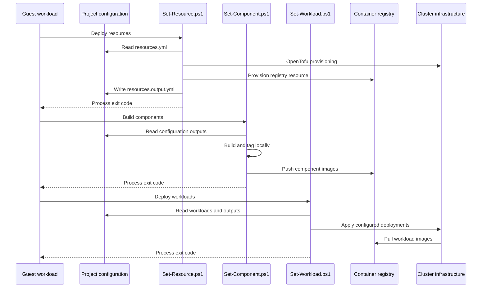
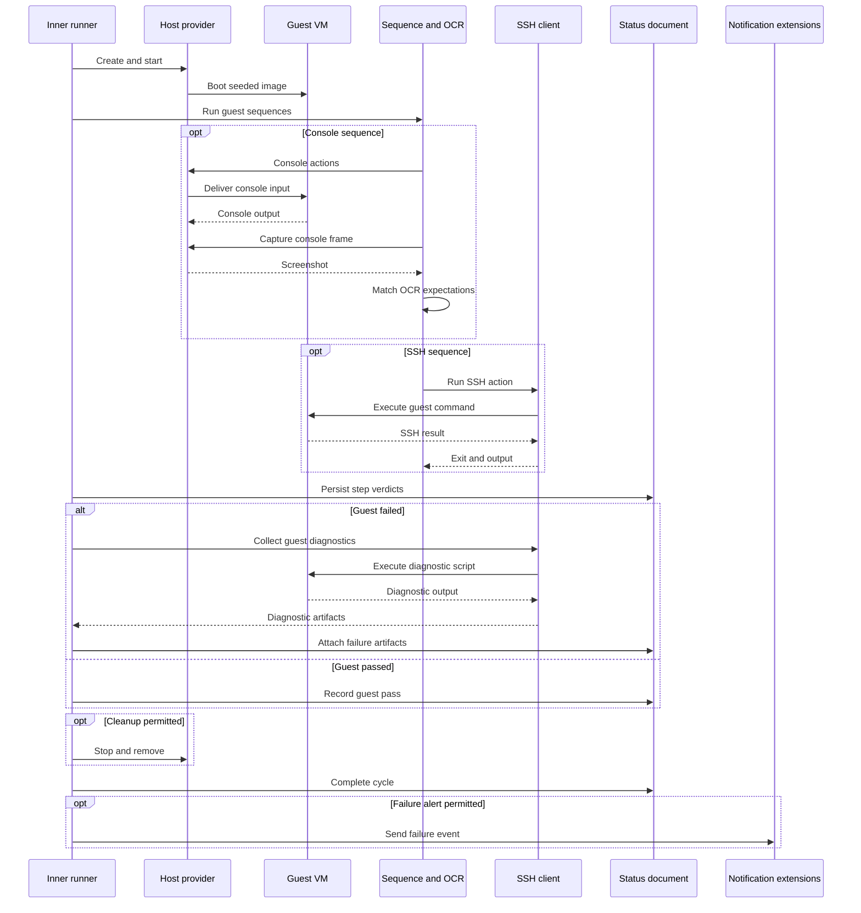
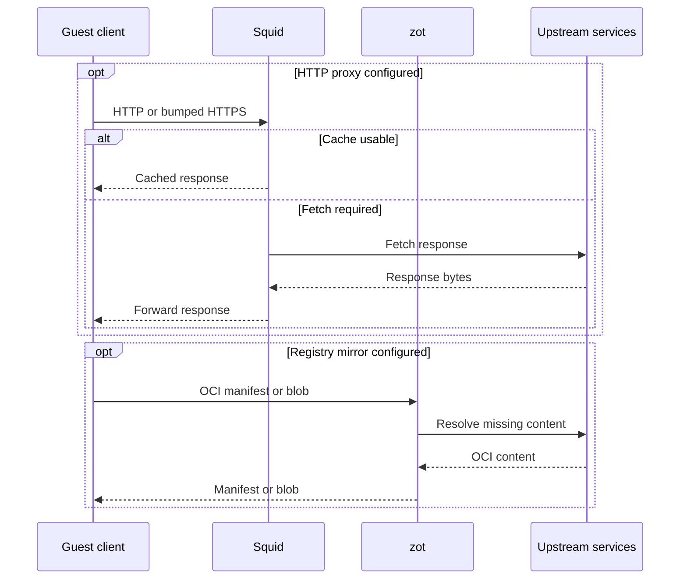
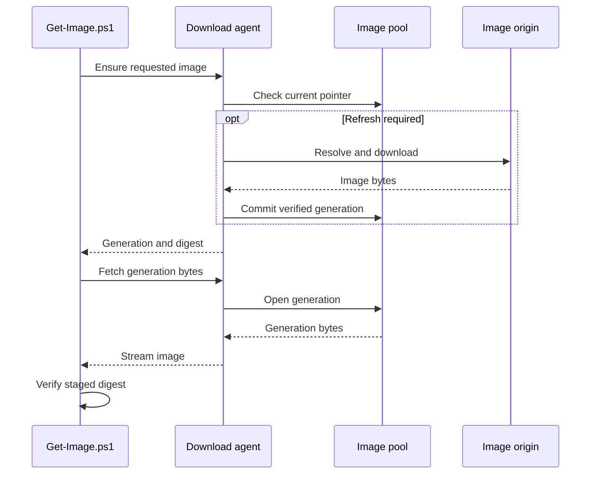
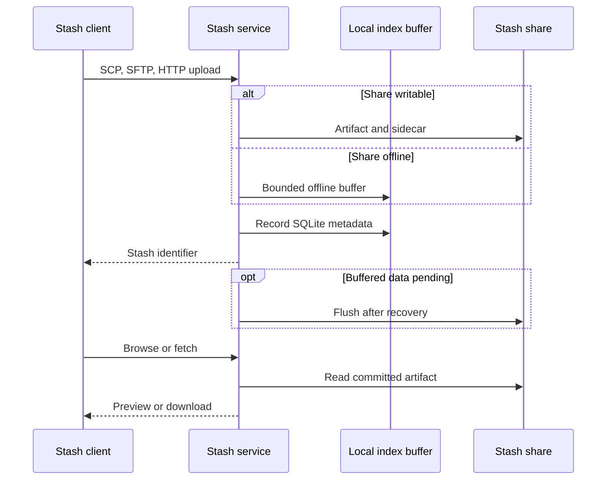
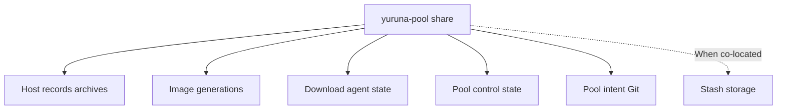

# Runtime data flows

These views trace deployment, test execution, artifact retrieval, and shared storage through the current producers and consumers.

The [canonical architecture](../architecture.md) defines the capabilities and phase model; these diagrams show the runtime exchanges.

## A. Three-phase deployment

The caller orders three separate commands; `Set-Resource.ps1` does not invoke the next two. The [website guest workload](https://github.com/alissonsol/yuruna-project/blob/main/example/website/test/ubuntu.server.24/ubuntu.server.24.workload.k8s.website.sh) is a concrete caller of the [localhost configuration](https://github.com/alissonsol/yuruna-project/tree/main/example/website/config/localhost).

```mermaid
sequenceDiagram
    participant website-workload as Guest workload
    participant project-config as Project configuration
    participant set-resource as Set-Resource.ps1
    participant set-component as Set-Component.ps1
    participant set-workload as Set-Workload.ps1
    participant registry as Container registry
    participant kubernetes as Cluster infrastructure
    website-workload->>set-resource: Deploy resources
    set-resource->>project-config: Read resources.yml
    set-resource->>kubernetes: OpenTofu provisioning
    set-resource->>registry: Provision registry resource
    set-resource->>project-config: Write resources.output.yml
    set-resource-->>website-workload: Process exit code
    website-workload->>set-component: Build components
    set-component->>project-config: Read configuration outputs
    set-component->>set-component: Build and tag locally
    set-component->>registry: Push component images
    set-component-->>website-workload: Process exit code
    website-workload->>set-workload: Deploy workloads
    set-workload->>project-config: Read workloads and outputs
    set-workload->>kubernetes: Apply configured deployments
    kubernetes->>registry: Pull workload images
    set-workload-->>website-workload: Process exit code
```

Seven participants aggregate OpenTofu's resources into the target cluster and its supporting infrastructure. Localhost reuses an existing Kubernetes context and creates its registry resource; the cloud templates can provision cluster infrastructure. Build/tag commands execute on the deploying machine, not the registry. This is the successful path: the shell caller stops on a nonzero exit. Sources: [Set-Resource.ps1](../../automation/Set-Resource.ps1), [Yuruna.Resource.psm1](../../automation/Yuruna.Resource.psm1), [Yuruna.Component.psm1](../../automation/Yuruna.Component.psm1), and [Yuruna.Workload.psm1](../../automation/Yuruna.Workload.psm1).

Resource staging first restores a stranded `.old` directory when live is absent, copies the template into `.new`, and carries forward `.terraform`, `.terraform.lock.hcl`, and `tofu.planfile`. It then moves live to `.old` and `.new` to live; a failed second move restores `.old`. `.workfolder.complete` is written after the swap. Template copies use terminating errors. The resource list makes an initialization/plan pass before its apply/output pass; empty output is an error, not a usable dependency result.

The [retry module](../../automation/Yuruna.Retry.psm1) classifies transient failures. Resource init, plan, saved-plan apply, and output have bounded retries; the refreshing apply fallback does not. Retryable Helm/kubectl commands must also match that classifier; local chart and shell deployments do not inherit unconditional retries.

### The `*.stderr.log` / `*.rc` sidecar contract

Tool logs retain command output and exit headings. Sidecars hold the most recently recorded exit code, not the complete phase history. Paths are relative to the project root; the phase modules above produce them.

| Producer | Directory | Pair |
|---|---|---|
| Resource tools | `.yuruna/<cloud>/resources/<resource>/` | `tofu.stderr.log`, `tofu.rc` |
| Component commands | `.yuruna/<cloud>/components/` | `docker.stderr.log`, `docker.rc` |
| Local chart | `.yuruna/<cloud>/workloads/<context>/<installName>/` | `helm.stderr.log`, `helm.rc` |
| Non-chart deployment | `.yuruna/<cloud>/workloads/<context>/` | `<tool>.stderr.log`, `<tool>.rc` |

[Get-SystemDiagnostic.ps1](../../automation/Get-SystemDiagnostic.ps1) scans logs and sidecars and compares recorded outcomes with actual deployment state. A zero sidecar alone does not prove that a workload exists.

## B. One test cycle

```mermaid
sequenceDiagram
    participant runner-inner-loop as Inner runner
    participant yuruna-host as Host provider
    participant guest as Guest VM
    participant sequence-engine as Sequence and OCR
    participant test-ssh as SSH client
    participant test-status as Status document
    participant test-notify as Notification extensions
    runner-inner-loop->>yuruna-host: Create and start
    yuruna-host->>guest: Boot seeded image
    runner-inner-loop->>sequence-engine: Run guest sequences
    opt Console sequence
        sequence-engine->>yuruna-host: Console actions
        yuruna-host->>guest: Deliver console input
        guest-->>yuruna-host: Console output
        sequence-engine->>yuruna-host: Capture console frame
        yuruna-host-->>sequence-engine: Screenshot
        sequence-engine->>sequence-engine: Match OCR expectations
    end
    opt SSH sequence
        sequence-engine->>test-ssh: Run SSH action
        test-ssh->>guest: Execute guest command
        guest-->>test-ssh: SSH result
        test-ssh-->>sequence-engine: Exit and output
    end
    runner-inner-loop->>test-status: Persist step verdicts
    alt Guest failed
        runner-inner-loop->>test-ssh: Collect guest diagnostics
        test-ssh->>guest: Execute diagnostic script
        guest-->>test-ssh: Diagnostic output
        test-ssh-->>runner-inner-loop: Diagnostic artifacts
        runner-inner-loop->>test-status: Attach failure artifacts
    else Guest passed
        runner-inner-loop->>test-status: Record guest pass
    end
    opt Cleanup permitted
        runner-inner-loop->>yuruna-host: Stop and remove
    end
    runner-inner-loop->>test-status: Complete cycle
    opt Failure alert permitted
        runner-inner-loop->>test-notify: Send failure event
    end
```

Seven participants separate host-side OCR from the status document: the HTTP status service serves the document and artifacts but does not perform OCR. SSH uses [Test.Ssh.psm1](../../test/modules/Test.Ssh.psm1) directly; the provider can discover an address but does not carry SSH commands. SSH-only sequences need not capture frames. Diagnostics are best-effort; watchdog termination cannot execute inner cleanup. Stop-on-failure can retain a failed guest for investigation and bypass the normal continuing-cycle notification tail. Guest preparation, readiness, and optional workload sequences are expanded in [Lifecycle](04-lifecycle-state.md).

Sources: [Test.RunnerInnerLoop.psm1](../../test/modules/Test.RunnerInnerLoop.psm1), [Test.SequenceEngine.psm1](../../test/modules/Test.SequenceEngine.psm1), [Test.SequenceHandler.psm1](../../test/modules/Test.SequenceHandler.psm1), [Test.Status.psm1](../../test/modules/Test.Status.psm1), [Test.Notify.psm1](../../test/modules/Test.Notify.psm1), and [Start-StatusService.ps1](../../test/service/Start-StatusService.ps1). Notification delivery uses configured extensions and failure/rearm thresholds; a failed cycle does not necessarily send another message.

## C. Caching and image retrieval

### HTTP and container downloads

```mermaid
sequenceDiagram
    participant guest as Guest client
    participant squid as Squid
    participant zot as zot
    participant upstream as Upstream services
    opt HTTP proxy configured
        guest->>squid: HTTP or bumped HTTPS
        alt Cache usable
            squid-->>guest: Cached response
        else Fetch required
            squid->>upstream: Fetch response
            upstream-->>squid: Response bytes
            squid-->>guest: Forward response
        end
    end
    opt Registry mirror configured
        guest->>zot: OCI manifest or blob
        zot->>upstream: Resolve missing content
        upstream-->>zot: OCI content
        zot-->>guest: Manifest or blob
    end
```

Four participants distinguish the HTTP cache from the OCI registry mirror. The [caching VM seed](../../host/vmconfig/caching-proxy-service.base.user-data) configures Squid and zot independently. HTTPS cache use requires the seeded proxy CA; direct-fetch paths remain available to callers without a configured/reachable proxy. Neither download path uploads to stash.

### Host image acquisition

```mermaid
sequenceDiagram
    participant get-image as Get-Image.ps1
    participant download-agent-service as Download agent
    participant images as Image pool
    participant upstream as Image origin
    get-image->>download-agent-service: Ensure requested image
    download-agent-service->>images: Check current pointer
    opt Refresh required
        download-agent-service->>upstream: Resolve and download
        upstream-->>download-agent-service: Image bytes
        download-agent-service->>images: Commit verified generation
    end
    download-agent-service-->>get-image: Generation and digest
    get-image->>download-agent-service: Fetch generation bytes
    download-agent-service->>images: Open generation
    images-->>download-agent-service: Generation bytes
    download-agent-service-->>get-image: Stream image
    get-image->>get-image: Verify staged digest
```

The agent streams pool content over HTTP, so this four-participant path needs no host SMB mount. Pending downloads are polled within a deadline. Unavailability permits origin fallback; corrupt served bytes are a failed acquisition. Origin verification and optional proxy-assisted byte transfer are separate operations. Sources: [Yuruna.DownloadAgent.psm1](../../host/modules/Yuruna.DownloadAgent.psm1), [agent routes](../../test/extension/download-agent-service/server/internal/httpsrv/handlers.go), and [image store](../../test/extension/download-agent-service/server/internal/imagestore/store.go).

## D. Stash ingest and retrieval

```mermaid
sequenceDiagram
    participant stash-client as Stash client
    participant stash-service as Stash service
    participant stash-local as Local index buffer
    participant stash-share as Stash share
    stash-client->>stash-service: SCP, SFTP, HTTP upload
    alt Share writable
        stash-service->>stash-share: Artifact and sidecar
    else Share offline
        stash-service->>stash-local: Bounded offline buffer
    end
    stash-service->>stash-local: Record SQLite metadata
    stash-service-->>stash-client: Stash identifier
    opt Buffered data pending
        stash-service->>stash-share: Flush after recovery
    end
    stash-client->>stash-service: Browse or fetch
    stash-service->>stash-share: Read committed artifact
    stash-service-->>stash-client: Preview or download
```

Four participants model stash independently of Squid. The share holds persistent host keys and `files/<year>/<month>/<day>/` artifacts with `.yuruna.meta.json` sidecars. SQLite metadata and the bounded outage buffer remain VM-local; buffered records can be read locally before flush. Sources: [ingest](../../test/extension/stash-service/server/internal/sshsrv/ingest.go), [flush](../../test/extension/stash-service/server/internal/sshsrv/flush.go), [HTTP handlers](../../test/extension/stash-service/server/internal/httpsrv/handlers.go), [store](../../test/extension/stash-service/server/internal/store/store.go), and [storage constants](../../test/extension/stash-service/server/internal/config/config.go).

## E. Pool storage contents

```mermaid
flowchart TB
    yuruna-pool["yuruna-pool share"]
    hosts["Host records archives"]
    images["Image generations"]
    download-agent-service["Download agent state"]
    pool-control-service["Pool control state"]
    pool-intent-git["Pool intent Git"]
    stash["Stash storage"]
    yuruna-pool --> hosts
    yuruna-pool --> images
    yuruna-pool --> download-agent-service
    yuruna-pool --> pool-control-service
    yuruna-pool --> pool-intent-git
    %% optional: stash storage can use a different share
    yuruna-pool -. "When co-located" .-> stash
```

Seven boxes group host registry files, cycle archives, and optional service archives under `hosts/`. The stash edge denotes optional co-location, not shared configuration.

| Relative path | Contents and producer |
|---|---|
| `hosts/info.<hostId>.yml` | Identity and last-seen data from [Test.HostIdentity.psm1](../../test/modules/Test.HostIdentity.psm1). |
| `hosts/<hostId>/test-cycles/<cycle>/` | Logs/artifacts with `.yuruna-complete` written last by [Test.PoolStorage.psm1](../../test/modules/Test.PoolStorage.psm1). |
| `hosts/<hostId>/services/caching-proxy-service/` | Optional monitoring replication from the [caching VM seed](../../host/vmconfig/caching-proxy-service.base.user-data); not Squid/zot byte caches. |
| `images/<hostType>/<imageKey>/` | Generations, `.meta.json`, `current.<arch>.<variant>.json`, `manual/`, and `.staging/`; [agent configuration](../../test/extension/download-agent-service/server/internal/config/config.go) places the writer lease at `images/.agent-lease.json`. |
| `download-agent-service/` | `audit.jsonl` and `status.json` from [agent state](../../test/extension/download-agent-service/server/internal/state/state.go). |
| `pool-control-service/` | `audit.jsonl` and `status.json` from [pool-control state](../../test/extension/pool-control-service/server/internal/state/state.go). |
| `pool-intent.git` | Versioned pool definitions and assignments, seeded by [pool-control setup](../../guest/ubuntu.server.26/ubuntu.server.26.pool-control-service.sh). |
| `<stash-mount>/stash/<hostId>/` | `hostkey/` and `files/`, configured independently by [stash setup](../../guest/ubuntu.server.26/ubuntu.server.26.stash-service.sh). |

Replication is conditional on configuration. Copy mode runs detached and retains local cycles; `networkStorage.moveLogsToPoolStorage` enables bounded copy-verify-delete. A space refusal in move mode prevents starting a cycle or marks its completed result failed. Unverified archives do not authorize local evidence deletion. The [outer loop](../../test/modules/Test.RunnerOuterLoop.psm1) owns archive handoffs and surfaces drain failures.

---

Back to [Architecture](../architecture.md) · [Design overview](README.md)
