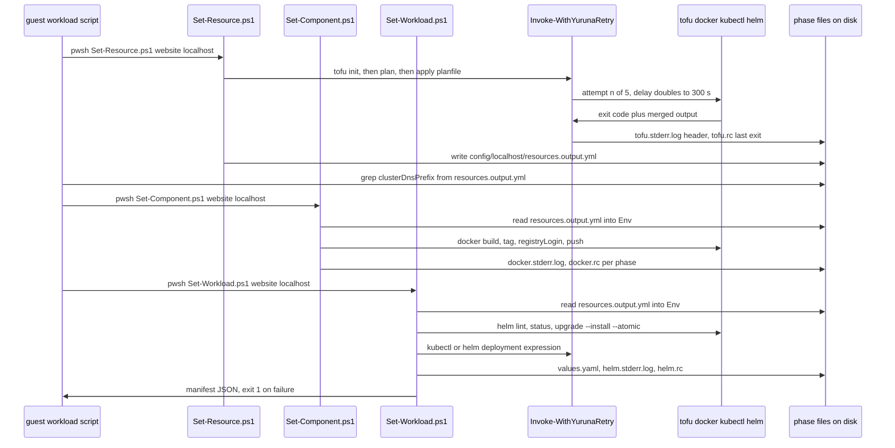
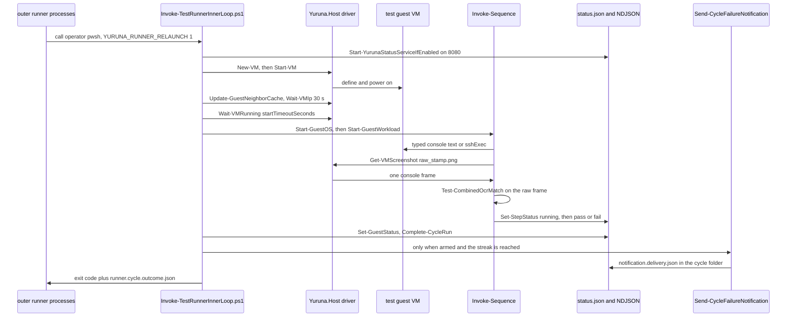
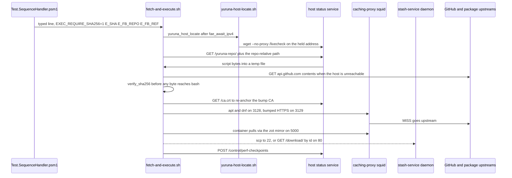
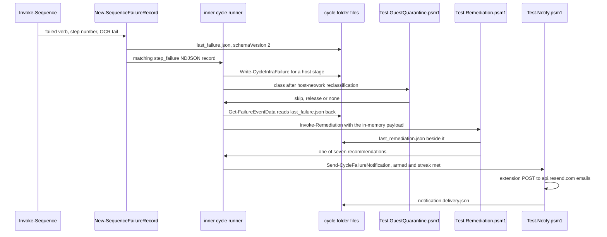
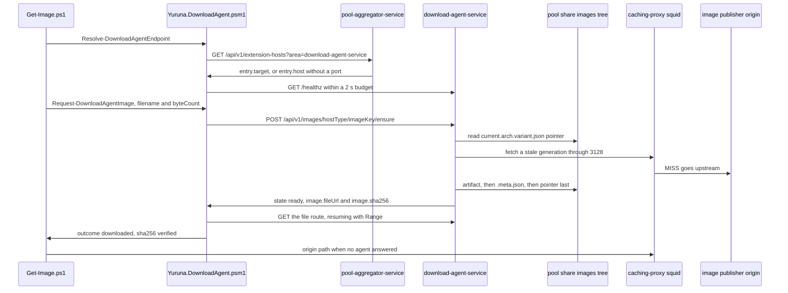
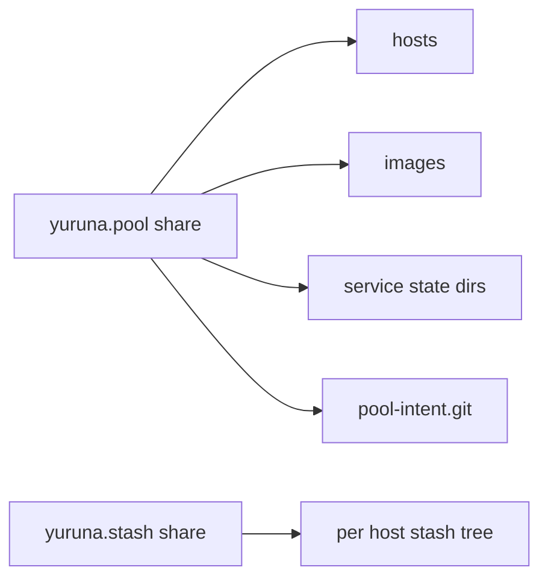
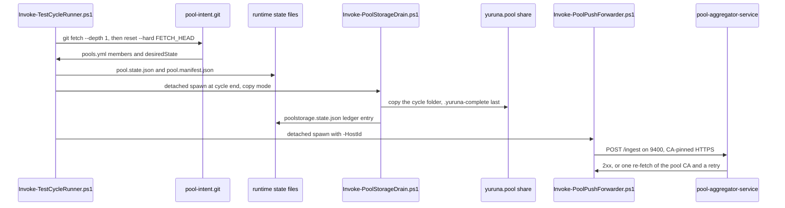

# Data flows

> One sentence: the seven highest-frequency runtime exchanges -- the three deploy
> phases, one test cycle, the guest fetch path, failure to alert, image
> acquisition, what the shared storage holds, and the per-cycle pool round trip.

See [Design overview](00-index.md) - [Context and components](01-context-and-components.md) -
[Component breakdown](02-component-breakdown.md) - [Lifecycle state](04-lifecycle-state.md) -
[Configuration data model](05-data-model.md) - [Deployment topology](06-deployment.md) -
[Naming conventions](naming.md) - [Yuruna Architecture](../architecture.md).

Derived from `automation/Set-Resource.ps1`, `automation/Set-Component.ps1`,
`automation/Set-Workload.ps1` and the
`automation/Yuruna.{Resource,Component,Workload,Retry,DeploymentKind,Result}.psm1`
modules behind them; `automation/Get-SystemDiagnostic.ps1`;
`automation/fetch-and-execute.sh` with `automation/yuruna-host-locate.sh` and
`automation/yuruna-retry.sh`; `test/Start-TestRunner.ps1`,
`test/modules/Invoke-TestCycleRunner.ps1`,
`test/modules/Invoke-TestRunnerInnerLoop.ps1` and the
`test/modules/Test.{RunnerOuterLoop,RunnerInnerLoop,SequenceEngine,SequenceHandler,SequenceFailureState,GuestQuarantine,Remediation,Notify,PoolStorage,PoolSync,PoolPush,HostIdentity,Status}.psm1`
modules; `host/modules/Yuruna.{DownloadAgent,HostDownload,UbuntuImage}.psm1` and
the per-guest `host/<platform>/guest.*/Get-Image.ps1` builders; and the Go
`internal/config` packages of the download-agent, pool-control and stash
services. The prose design lives in [Yuruna Architecture](../architecture.md)
and is not repeated here.

Every diagram carries only the actors that actually exchange a message, seven or
fewer. Where reality has more, the fold is named directly under the diagram with
its exact member list and real count.

## A. Three-phase deployment

```mermaid
sequenceDiagram
    participant caller as guest workload script
    participant set-resource as Set-Resource.ps1
    participant set-component as Set-Component.ps1
    participant set-workload as Set-Workload.ps1
    participant retry as Invoke-WithYurunaRetry
    participant tool as tofu docker kubectl helm
    participant files as phase files on disk
    caller->>set-resource: pwsh Set-Resource.ps1 website localhost
    set-resource->>retry: tofu init, then plan, then apply planfile
    retry->>tool: attempt n of 5, delay doubles to 300 s
    tool->>retry: exit code plus merged output
    retry->>files: tofu.stderr.log header, tofu.rc last exit
    set-resource->>files: write config/localhost/resources.output.yml
    caller->>files: grep clusterDnsPrefix from resources.output.yml
    caller->>set-component: pwsh Set-Component.ps1 website localhost
    set-component->>files: read resources.output.yml into Env
    set-component->>tool: docker build, tag, registryLogin, push
    set-component->>files: docker.stderr.log, docker.rc per phase
    caller->>set-workload: pwsh Set-Workload.ps1 website localhost
    set-workload->>files: read resources.output.yml into Env
    set-workload->>tool: helm lint, status, upgrade --install --atomic
    set-workload->>retry: kubectl or helm deployment expression
    set-workload->>files: values.yaml, helm.stderr.log, helm.rc
    set-workload->>caller: manifest JSON, exit 1 on failure
```

**Who the boxes are.** `caller` is a project script running inside a guest --
`example/website/test/ubuntu.server.24/ubuntu.server.24.workload.k8s.website.sh`
in `yuruna-project`, which runs under `set -euo pipefail` and calls the three
phases as plain `pwsh` invocations from `<home>/yuruna/project/example` at
`:263`, `:443` and `:446`. The three entry points are
`automation/Set-Resource.ps1`, `automation/Set-Component.ps1` and
`automation/Set-Workload.ps1`; `automation/yuruna.ps1` reaches the same three
publishers through its `resources` / `components` / `workloads` switch arms, and
no cycle path in `test/` calls a phase entry point directly. `retry` is
`Invoke-WithYurunaRetry` in `automation/Yuruna.Retry.psm1`.

**Two folds.** `tool` stands for four real binaries -- `tofu`, `docker`,
`kubectl`, `helm` (4). Only the first is named in the resource module; the
component module hardcodes no tool at all and runs whatever `buildCommand`,
`tagCommand` and `pushCommand` say through `Invoke-DynamicExpression`
(`automation/Yuruna.Component.psm1:106`), so `docker` is the shipped configs'
choice, not the engine's. `files` stands for the fourteen file names the three
phases write or read: `terraform.tfvars`, `tofu.planfile`, `tofu.stderr.log`,
`tofu.rc`, `.workfolder.complete`, `resources.output.yml`, `docker.stderr.log`,
`docker.rc`, `values.yaml`, `helm.stderr.log`, `helm.rc`,
`<toolName>.stderr.log`, `<toolName>.rc`, and the
`<phase>.<yyyy-MM-dd-HH-mm-ss>.yml` input backup each publisher takes (14).

**The easy edge to misread** is `caller->>files`. Between phase 1 and phase 2 it
is the guest script itself, not the engine, that reads phase 1 output: it greps
`clusterDnsPrefix` out of `resources.output.yml` and feeds
`kubectl config rename-context` before `Set-Component.ps1` is ever started
(`ubuntu.server.24.workload.k8s.website.sh:265-266`). The engine's own read of
that file happens separately inside each later publisher.

### The between-phase contract

`resources.output.yml` is the only file one phase writes for another to read.

| Fact | Where |
|---|---|
| Recreated with `New-Item -Force` on the apply pass, seeded with one `globalVariables` map | `automation/Yuruna.Resource.psm1:86-90` |
| One `<resourceName>: <tofu outputs>` block appended per templated resource | `automation/Yuruna.Resource.psm1:318-320` |
| Read by the components phase, values pushed to `Env:` with `-NoExpand` | `automation/Yuruna.Component.psm1:73-80` |
| Read by the workloads phase, with a `config/<cloud>/../resources.output.yml` fallback for phased deploys | `automation/Yuruna.Workload.psm1:327-344` |
| Read by teardown to learn which resources exist | `automation/Yuruna.Clear.psm1:44-46` |
| An absent file is valid; a present-but-null one is a failure | `automation/Yuruna.Validation.psm1:170-179` |

Every one of those readers passes `-NoExpand`: the leaves are tofu outputs, and
`ExpandString` would execute a `$(...)` subexpression echoed back inside a cloud
resource name or tag (`automation/Yuruna.Workload.psm1:340-343`). A resource
whose `template` is empty never appears in the file at all.

### The `.stderr.log` / `.rc` sidecar contract

| File | Folder | Writer | Reader |
|---|---|---|---|
| `tofu.stderr.log` | `.yuruna/<cloud>/resources/<resourceName>/` | cleared per run, then appended by `Invoke-WithYurunaRetry -LogPath` (`automation/Yuruna.Retry.psm1:205-217`) | `Get-TofuStderrTail` (`automation/Yuruna.Resource.psm1:42-51`) and the diagnostic |
| `tofu.rc` | same | `Invoke-WithYurunaRetry -RcFile` (`automation/Yuruna.Retry.psm1:262-268`) | the diagnostic |
| `tofu.planfile` | same | `tofu plan -out` (`automation/Yuruna.Resource.psm1:253`) | `tofu apply` (`:257`), carried across cycles by the staging copy (`:141`) |
| `terraform.tfvars` | same | rewritten per resource from globals then locals (`automation/Yuruna.Resource.psm1:171-193`) | `tofu` |
| `.workfolder.complete` | same | `Set-Content` after the staging swap (`automation/Yuruna.Resource.psm1:167-168`) | nothing in `automation/` |
| `docker.stderr.log` / `docker.rc` | `.yuruna/<cloud>/components/` | truncated at start, then `Invoke-ComponentCommand` (`automation/Yuruna.Component.psm1:92-95`, `:113-115`) | the diagnostic |
| `helm.stderr.log` / `helm.rc` | `.yuruna/<cloud>/workloads/<context>/<installName>/` | `automation/Yuruna.Workload.psm1:111-114`, `:123-125`, `:172-174` | the diagnostic |
| `<toolName>.stderr.log` / `<toolName>.rc` | `.yuruna/<cloud>/workloads/<context>/` | the retry helper's log, then `Set-Content` for the rc (`automation/Yuruna.Workload.psm1:269-272`) | the diagnostic |

Three properties hold across the whole set. The `.rc` file always carries the
LAST observed exit code and is always written with `Set-Content`, never
appended. The `.stderr.log` files carry a `==`-delimited header per attempt or
phase -- `== <utc> <label> attempt n/5 (exit=N) ==` from the retry helper
(`automation/Yuruna.Retry.psm1:207-209`), `== [<phase>] <command> (exit=N) ==`
from the component helper (`automation/Yuruna.Component.psm1:113`). And
`Get-SystemDiagnostic.ps1` is the reader that ties them together: it resolves
the repository root from `$PSScriptRoot/..`, enumerates with
`Get-ChildItem -Recurse -File -Force` filtered on `*.stderr.log` -- `-Force` is
load-bearing, because the logs live under the dot-directory `.yuruna/` -- seeks
the last 65536 bytes of any file over 64 KB, and derives the rc sibling from the
log name by rewriting a trailing `.stderr` to `.rc`
(`automation/Get-SystemDiagnostic.ps1:1896-1937`).

`<toolName>.stderr.log` is the one file that is never truncated, so repeated
deployments of the same tool in one `workloads.yml` append in declaration order.

### Retry gating

One shared policy and one shared classifier, both in
`automation/Yuruna.Retry.psm1` (`:51-56`, `:68`); the defaults and the matched
token set are in
[the shared retry policy](../architecture.md#shared-transient-failure-retry-policy).
`YURUNA_RETRY_MAX_ATTEMPTS` and `YURUNA_RETRY_DELAY_SECONDS` override the
attempt count and the initial delay per run (`:171`, `:174`). Which call site
sits behind which gate:

| Call site | Gate | Where |
|---|---|---|
| `tofu init` | no predicate -- retried on any non-zero | `automation/Yuruna.Retry.psm1:307-321` |
| `tofu plan`, `tofu apply <planfile>` | retryable flag AND the transient pattern | `automation/Yuruna.Resource.psm1:274-281` |
| refreshing `tofu apply` fallback | flag forced false -- runs exactly once | `automation/Yuruna.Resource.psm1:261-262` |
| `tofu output -json` | the transient classifier alone | `automation/Yuruna.Resource.psm1:296-300` |
| `kubectl` and `helm` tool deployments | the kind's `Retryable` AND the transient pattern | `automation/Yuruna.Workload.psm1:254`, `:263-269` |
| `shell` deployments | `Retryable = $false` -- never retried | `automation/Yuruna.DeploymentKind.psm1:254` |
| `helm lint`, `status`, `rollback`, `uninstall`, `upgrade --install` | not gated -- each runs bare, once | `automation/Yuruna.Workload.psm1:121`, `:138`, `:147`, `:156`, `:170` |
| every component phase | not gated | `automation/Yuruna.Component.psm1:106` |

The refreshing-apply exclusion is the load-bearing one: a saved-planfile apply
re-applies the same plan and is safe to repeat, while a refreshing apply
recomputes the plan, so retrying it after a partial apply is not idempotent
(`automation/Yuruna.Resource.psm1:245-262`). A `-ShouldRetry` predicate that
throws is treated as retryable, and a "not retryable" verdict emits
`retry_exhausted` with `Permanent = $true` (`automation/Yuruna.Retry.psm1:235-243`).

Failures leave by two different doors. Config-shaped failures return a manifest
carrying `failureClass = 'config_error'` and unwind normally. Tool-shaped
failures in the resources phase `throw` and are never caught -- there is no
`try`/`catch` in `Set-Resource.ps1` -- so the throw ends the script before
`Stop-Transcript` and `Complete-YurunaRun` can run. Everywhere else the manifest
reaches `Complete-YurunaRun`, which writes compact JSON plus the transcript to
stdout and calls `exit 1` (`automation/Yuruna.Result.psm1:206-210`); the guest
script's `set -e` stops there.

## B. One test cycle

```mermaid
sequenceDiagram
    participant outer as outer runner processes
    participant inner as Invoke-TestRunnerInnerLoop.ps1
    participant driver as Yuruna.Host driver
    participant guest as test guest VM
    participant engine as Invoke-Sequence
    participant status as status.json and NDJSON
    participant notify as Send-CycleFailureNotification
    outer->>inner: call operator pwsh, YURUNA_RUNNER_RELAUNCH 1
    inner->>status: Start-YurunaStatusServiceIfEnabled on 8080
    inner->>driver: New-VM, then Start-VM
    driver->>guest: define and power on
    inner->>driver: Update-GuestNeighborCache, Wait-VMIp 30 s
    inner->>driver: Wait-VMRunning startTimeoutSeconds
    inner->>engine: Start-GuestOS, then Start-GuestWorkload
    engine->>guest: typed console text or sshExec
    engine->>driver: Get-VMScreenshot raw_stamp.png
    driver->>engine: one console frame
    engine->>engine: Test-CombinedOcrMatch on the raw frame
    engine->>status: Set-StepStatus running, then pass or fail
    inner->>status: Set-GuestStatus, Complete-CycleRun
    inner->>notify: only when armed and the streak is reached
    notify->>status: notification.delivery.json in the cycle folder
    inner->>outer: exit code plus runner.cycle.outcome.json
```

**Three folds.** `outer runner processes` covers two files (2):
`test/Start-TestRunner.ps1`, the resident process that owns `runner.pid` and
never ends, and `test/modules/Invoke-TestCycleRunner.ps1`, a fresh `pwsh` per
cycle spawned with `Start-Process -NoLogo -NoProfile -NonInteractive -File
<cycle script> -Cycle N -NoNewWindow -PassThru`
(`test/modules/Test.RunnerOuterLoop.psm1:1806-1818`). It is the cycle child, not
the resident parent, that invokes the inner, and it does so with the call
operator `& $State.PwshExe @($State.ArgList)` (`:1372`) rather than a second
`Start-Process`, so the inner inherits the terminal.

`Invoke-Sequence` covers the four modules that drive a guest and read its screen
(4): `test/modules/Test.SequenceEngine.psm1`,
`test/modules/Test.SequenceHandler.psm1`, `test/modules/Test.OcrMatch.psm1` and
`test/modules/Test.OcrEngine.psm1`. `status.json and NDJSON` covers the status
document plus the per-cycle event stream and the per-cycle folder that holds it.

**What the driver box is.** One of three files, chosen by host type and imported
`-Global`: `host/windows.hyper-v/modules/Yuruna.Host.psm1`,
`host/ubuntu.kvm/modules/Yuruna.Host.psm1`,
`host/macos.utm/modules/Yuruna.Host.psm1`. All three export the 38 verbs
`host/Yuruna.Host.Contract.psm1:57-98` declares, and
`Assert-YurunaHostContractCoverage` checks the intersection with the module's
actual `ExportedFunctions` at load, so a verb declared but never exported still
counts as missing.

**The six dashboard steps.** `Get-CycleStepNameList`
(`test/modules/Test.RunnerInnerLoop.psm1:784-830`) emits four base names --
`New-VM`, `Start-VM`, `Start-GuestOS`, `New-VM.Resource` -- and appends
`Screenshots` only when some guest has a screenshot schedule and
`Start-GuestWorkload` only when the plan has a workload sequence, so the maximum
is six. The names are the dashboard tile labels; the HTML collapses the
`New-VM` / `Start-VM` / `New-VM.Resource` triplet into one tile.

**Cross-cutting work on every step**, in
`test/modules/Test.RunnerInnerLoop.psm1:3310-3885`:
`Assert-CachingProxyServiceStillReachable` runs before the step,
`Set-StepStatus -Status "running"` before and `pass` / `fail` / `skipped` after,
and `Sync-RunnerStepConfig` after, followed by a re-read of `StopOnFailure`,
`VmStartTimeoutSeconds` and `VmBootDelaySeconds` -- which is how a config edit
mid-cycle takes effect at the next step boundary.

**The watchdog is deliberately not a participant.** `Start-Watchdog`
(`test/modules/Test.RunnerWatchdog.psm1:89-311`) returns a `Start-Job` named
`yurunaWatchdog`, a separate `pwsh` process, and it exchanges no message with
anyone in this diagram: it reads three files in `$env:YURUNA_RUNTIME_DIR`
(`runner.stepHeartbeat`, `runner.phase`, `inner.pid`), appends to `outer.log`,
and on a lapse drops `runner.watchdog.lapsed` and signals the inner process
tree. Its kill surfaces here only as a non-zero inner exit.

**Where the OCR frames land.** `Get-VMScreenshot` writes
`<cycleFolder>/screens_<VMName>/raw_<yyyyMMddTHHmmssfffZ>.png`
(`test/modules/Test.SequenceEngine.psm1:937-939`); each frame gets a
`raw_<stamp>.txt` sidecar holding the per-engine OCR text via `Save-OcrSidecar`
(`:983`). The ring keeps five frames and evicts the `.txt` with its `.png` so
the two stay in lockstep (`:948-958`). On failure the frozen moment is copied to
`$YURUNA_LOG_DIR/failure_screenshot_<VMName>.png` and
`failure_ocr_<VMName>.txt`, and `Copy-FailureArtifactsToStatusLog`
(`test/modules/Test.RunnerInnerLoop.psm1:418`) copies the ring plus both into
`<cycleFolder>/<VMName>/`. The ring is deleted only on a guest pass (`:3843-3846`).

**The exit contract.** The inner returns an exit code; the cycle child writes
`runtime/runner.cycle.outcome.json` holding `{"outcome":...,"exitCode":...}`
before exiting with the same code
(`test/modules/Invoke-TestCycleRunner.ps1:168-183`), because the exit-code space
belongs to the inner and the outer needs to tell "the inner failed" from "the
cycle never got that far".

## C. Guest fetch through the caching proxy and the stash

```mermaid
sequenceDiagram
    participant handler as Test.SequenceHandler.psm1
    participant fae as fetch-and-execute.sh
    participant locate as yuruna-host-locate.sh
    participant statussvc as host status service
    participant squid as caching-proxy squid
    participant stash as stash-service daemon
    participant origin as GitHub and package upstreams
    handler->>fae: typed line, EXEC_REQUIRE_SHA256=1 E_SHA E_FB_REPO E_FB_REF
    fae->>locate: yuruna_host_locate after fae_await_ipv4
    locate->>statussvc: wget --no-proxy /livecheck on the held address
    fae->>statussvc: GET /yuruna-repo/ plus the repo-relative path
    statussvc->>fae: script bytes into a temp file
    fae->>origin: GET api.github.com contents when the host is unreachable
    fae->>fae: verify_sha256 before any byte reaches bash
    fae->>statussvc: GET /ca.crt to re-anchor the bump CA
    fae->>squid: apt and dnf on 3128, bumped HTTPS on 3129
    squid->>origin: MISS goes upstream
    fae->>squid: container pulls via the zot mirror on 5000
    %% optional
    fae-->>stash: scp to 22, or GET /download/ by id on 80
    fae->>statussvc: POST /control/perf-checkpoints
```

**What the host types.** The harness never uploads a script. It types a command
line whose prefix `Get-FetchExecuteEnvPrefix`
(`test/modules/Test.SequenceHandler.psm1:1021-1103`) builds:
`EXEC_REQUIRE_SHA256=1` unconditionally (`:1065`), `E_SHA` as the working-tree
SHA-256 of the payload (`:1076`), `E_RETRY_SHA` for the retry library when it is
present (`:1081`), and `E_FB_REPO` plus a short `E_FB_REF` for the GitHub
fallback (`:1103`). The expected digest therefore arrives over the channel that
TYPED the command, never over the HTTP the bytes came from.

**Address before source.** `fae_await_ipv4` runs before `resolve_fetch_source`
(`automation/fetch-and-execute.sh:386-387`), on a budget defaulting to 180 s
that is shared across both call sites and nudged at 60 s with
`yuruna_net_repair_ipv4`. A guest with no global IPv4 at all prints the
`GUEST HAS NO IPv4` block and goes straight to the `github` source rather than
spending a probe whose only answer is "no" (`:61-77`).

**Host location, in order** (`resolve_fetch_source`, `:29-153`): source
`/etc/yuruna/host.env`; let typed values override it for repo and ref; honor an
`EXEC_BASE_URL` override; source
`/usr/local/lib/yuruna/yuruna-host-locate.sh` and take `yuruna_host_locate`'s
success directly, with `HOST_BASE` becoming
`http://<ip>:<port>/yuruna-repo/` (`:99-107`); otherwise probe
`http://<ip>:<port>/livecheck` with `wget -q --no-proxy --timeout=2 --tries=2`
(`:117-118`) -- two tries, not one, because the verdict cannot be revisited;
otherwise print `HOST UNREACHABLE` and set the source to `github` (`:123-152`).
`yuruna_host_locate` itself is probe-first, asks the pool aggregator on 9400 at
`/api/v1/host-address?hostId=<id>` with `/api/v1/pool-status` as the
compatibility leg, rejects implausible answers (loopback, `localhost`, `::1`,
`0.0.0.0`, `169.254.*`, multicast), and on adoption persists to
`/etc/yuruna/host.env`, the `yuruna-host` line in `/etc/hosts` and the
`no_proxy` line in `/etc/wgetrc`
(`automation/yuruna-host-locate.sh:104-108`, `:126-162`, `:188-231`, `:244-311`).

**The three URL shapes** (`build_fetch_url`, `automation/fetch-and-execute.sh:160-174`):
`${HOST_BASE}${path}${QUERY_PARAMS}` for the host route,
`https://api.github.com/repos/<repo>/contents/<path>?ref=<ref>` when a token is
present, and `https://raw.githubusercontent.com/<repo>/<ref>/<path>` when it is
not. The query string rides only the host route -- a second `?` would corrupt
the API URL's `?ref=`.

**The gate.** `verify_sha256` (`:273-302`) refuses an empty expected digest when
`EXEC_REQUIRE_SHA256=1`, compares lowercased `sha256sum` output (falling back to
`shasum -a 256`), and on a non-empty-digest mismatch the caller re-fetches once
and re-verifies before exiting 3 (`:566-576`), which absorbs a host process
rewriting the served file inside the type-to-fetch window. Only after the gate
is the payload run as `/bin/bash -c "$script_content"` with output mirrored
byte-identically to the console -- the host matches OCR patterns against exactly
those bytes -- and a stamped copy written to
`/tmp/yuruna-last-fetch-and-execute.log`.

**The proxy leg is optional by design, and each family finds it differently.**
Ubuntu has the address templated into its cloud-init seed
(`CACHING_PROXY_URL_PLACEHOLDER`, `host/vmconfig/ubuntu.server.base.user-data:52`,
`:66-67`), with the whole block wrapped in a non-empty test. Amazon Linux 2023
derives it at run time -- `$http_proxy` first, then
`YURUNA_CACHING_PROXY_SERVICE_IP` out of `/etc/yuruna/host.env`, then the bare
name `yuruna-caching-proxy-service` -- and probes port 3128 before committing,
clearing `CACHE_HOST` when nothing answers
(`guest/amazon.linux.2023/amazon.linux.2023.update.sh:46-60`). The k8s guests
follow the same three-step derivation but gate on the registry
(`guest/ubuntu.server.26/ubuntu.server.26.k8s.sh:103-117`), and write
`registry-mirrors` plus `insecure-registries` pointing at
`http://<cache>:5000` only when a cache was found (`:118-127`). An empty
`CACHE_HOST` is a supported topology, not a fault.

**The CA self-heal edge is easy to misread.** `fae->>statussvc: GET /ca.crt`
goes to the HOST status service on 8080, not to the proxy VM, because that path
is plain HTTP and the ssl-bump is not in front of it
(`automation/yuruna-retry.sh:244-262`). The function is a hard no-op unless
`https_proxy` really names port 3129 and the bump is not already trusted, and it
answers three ways: 0 repaired, 1 nothing to repair, 2 tried and still untrusted
(`:213-221`). Host side, `/ca.crt` live-reads
`http://<cache>/yuruna-squid-ca.crt` and only falls back to the persisted copy
(`test/service/Start-StatusService.ps1:2619-2650`,
`test/modules/Test.CachingProxyService.psm1:1338-1377`).

**The stash edge is dashed because no shipped sequence walks it.** The stash
daemon is real and running -- SCP/SFTP on `0.0.0.0:22` and the UI plus JSON API
on `0.0.0.0:80`
(`test/extension/stash-service/server/internal/config/config.go:13,22`), with
`GET /download/...`, `GET /raw/...` and the short links `GET /v/{id}` and
`GET /{id}` in
`test/extension/stash-service/server/internal/httpsrv/handlers.go:34-74` -- and
the extension exposes `Resolve-Host` for a sequence's `variables:` block to
consume as `${ext:stash-service.ResolveHost(<vm>)}`
(`test/extension/stash-service/default.psm1:279-351`). A search of both
repositories finds that expression only inside
`test/extension/stash-service/default.psm1` and one comment in
`test/modules/Test.SequenceVariable.psm1:94`: no sequence in `test/sequences/`
and none in `yuruna-project` names it today. The two sequences that mention the
stash at all -- `workload.guest.ubuntu.server.26.stash-service.yml:50` and its
`.ssh.yml` peer at `:38` -- build the daemon rather than fetching from it.

**Perf checkpoints ride only the host route.** `${host_origin}` is
`HOST_BASE` with the trailing `/yuruna-repo/` stripped
(`automation/fetch-and-execute.sh:792`), and the POST to
`/control/perf-checkpoints` (`:840`) happens after the end marker,
best-effort, and only when the source was `host`.

## D. Failure, taxonomy, alert

```mermaid
sequenceDiagram
    participant engine as Invoke-Sequence
    participant builder as New-SequenceFailureRecord
    participant inner as inner cycle runner
    participant files as cycle folder files
    participant quarantine as Test.GuestQuarantine.psm1
    participant remediation as Test.Remediation.psm1
    participant notify as Test.Notify.psm1
    engine->>builder: failed verb, step number, OCR tail
    builder->>files: last_failure.json, schemaVersion 2
    builder->>inner: matching step_failure NDJSON record
    inner->>files: Write-CycleInfraFailure for a host stage
    inner->>quarantine: class after host-network reclassification
    quarantine->>inner: skip, release or none
    inner->>files: Get-FailureEventData reads last_failure.json back
    inner->>remediation: Invoke-Remediation with the in-memory payload
    remediation->>files: last_remediation.json beside it
    remediation->>inner: one of seven recommendations
    inner->>notify: Send-CycleFailureNotification, armed and streak met
    notify->>notify: extension POST to api.resend.com emails
    notify->>files: notification.delivery.json
```

**One fold.** `cycle folder files` stands for the four records this flow writes
or reads inside `<cycleFolder>` and `$env:YURUNA_LOG_DIR` (4):
`last_failure.json`, `last_remediation.json`, `notification.delivery.json`, and
`cycle.events.ndjson` where the `step_failure` and `guest_quarantined` records
land.

**The vocabulary.** `$script:FailureClassEnum`
(`test/modules/Test.FailureTaxonomy.psm1:28-40`) holds 24 values in declaration
order: `ocr_timeout`, `console_flooded`, `network_timeout`,
`credential_expired`, `host_io_blocked`, `pattern_matched_failure`,
`retry_exhausted`, `snapshot_restore_failed`, `script_error`, `wait_timeout`,
`extension_error`, `instrumentation_failure`, `provisioning_failure`,
`bootstrap_sync`, `plan_invalid`, `elevation_required`,
`project_access_denied`, `host_network_degraded`, `ip_not_discovered`,
`payload_unavailable`, `pool_storage_full`, `dhcp_identity_unbounded`,
`lab_dependency_down`, `unknown`. Severity is `hard` / `soft` / `unknown`
(`:41`). `Assert-FailureTaxonomyInSync` (`:65-93`) is order-sensitive and
warn-only, so a drifted copy surfaces at module load instead of aborting a cycle.

The deploy engine has its own, smaller enum -- `ok`, `config_error`,
`cluster_unreachable`, `chart_invalid`, `tool_failed`, `unknown`
(`automation/Yuruna.Result.psm1:41-42`) -- and
`ConvertTo-CanonicalFailureClass` (`:58-114`) maps it into the harness
vocabulary: `config_error` and `chart_invalid` both become `plan_invalid`,
`cluster_unreachable` becomes `network_timeout`, `tool_failed` becomes
`provisioning_failure`, anything unrecognized becomes `unknown`.

**Two record builders, one shape.** `New-SequenceFailureRecord`
(`test/modules/Test.SequenceFailureState.psm1:150`) returns
`@{File; Event}` so the on-disk record and the NDJSON record cannot drift. It
starts from the verb registry's declared class and then narrows on evidence --
a matched failure pattern wins and yields `pattern_matched_failure`, else a
console flood yields `console_flooded`, else an unresolved guest address yields
`ip_not_discovered`. `New-InfraFailureRecord` is the host-stage sibling,
reached through `Write-CycleInfraFailure`
(`test/modules/Test.RunnerInnerLoop.psm1:1808`), which classifies by stage:
`provisioning_failure` for `New-VM` / `Start-VM` / `New-VM.Resource` /
`Cleanup`, `network_timeout` for `GetImage`, `plan_invalid` for `folder-check`,
`project_access_denied` for `ProjectAccess`, `bootstrap_sync` for
`ProjectClone`, `dhcp_identity_unbounded` for `GuestAddressBound`,
`pool_storage_full` for the two pool-storage stages, `lab_dependency_down` for
the lab-health gate, and a synthetic `wait_timeout` when the outer attributes a
non-zero exit to a watchdog kill.

**The ordering invariant.** `Write-CycleInfraFailure` never overwrites an
existing record, which protects the richer engine-written record produced later
in the same cycle. The only legitimate clearing point is the first gate, before
any cycle work (`test/modules/Test.RunnerInnerLoop.psm1:2063-2075`).

**Quarantine is a per-guest circuit breaker, not an alert path.**
`Get-GuestQuarantineDecision` (`test/modules/Test.GuestQuarantine.psm1:89-133`)
is pure and returns `none`, `skip` or `release`; a new framework OR project
commit releases, because it may carry the fix. `host_network_degraded` is
host-scoped and exempt (`:35`): a host fault produces the identical class on
every network-touching guest at once and would quarantine them all, leaving a
green cycle over a broken host.

**Remediation is advisory.** `Invoke-Remediation`
(`test/modules/Test.Remediation.psm1:233`) routes on `failureClass` to a
registered handler and returns one of seven recommendations (`:75-83`):
`retry_immediately`, `retry_with_backoff`, `restart_from_snapshot`, `reconnect`,
`pause_and_inspect`, `operator_intervention_required`, `escalate`. A handler
that throws or answers outside that vocabulary is coerced to
`operator_intervention_required`. Acting on a recommendation is a separate,
default-off feature with its own 7-class allow-list (`:98-109`) and a per-cycle
attempt cap.

**The alert latch.** The gate is
`$AlertArmed -and $ConsecutiveFailures -ge $FailuresBeforeAlert`
(`test/modules/Test.RunnerInnerLoop.psm1:2969`). Code defaults for
`failuresBeforeAlert` and `successesBeforeRearm` are both 1 (`:1063-1064`); the
shipped template ships 2 and 5 (`test/test.config.yml.template:41-43`). Sending
disarms the latch, and a pass re-arms it after `successesBeforeRearm`
consecutive successes. `Send-CycleFailureNotification`
(`test/modules/Test.Notify.psm1:502-560`) calls
`Send-YurunaNotification -EventCode 'cycle.failure' -Synchronous`; the
`-Synchronous` is deliberate, because bootstrap failures call this immediately
before process exit and a fire-and-forget thread job would be killed first.
`Send-YurunaNotification` resolves each active extension's `Send-Notification`
by the loaded module's absolute path, not by name, because
`notification/default.psm1` and `authentication/default.psm1` both register as
module `default` (`:100-111`). The shipped transport POSTs to
`https://api.resend.com/emails` with a 30 s timeout
(`test/extension/notification/default.psm1:100`), and the delivery outcome is
persisted to `<cycleFolder>/notification.delivery.json` on both the synchronous
and the asynchronous branch so a swallowed HTTP 503 stays visible.

## E. Guest-image acquisition through the download agent

```mermaid
sequenceDiagram
    participant getimage as Get-Image.ps1
    participant client as Yuruna.DownloadAgent.psm1
    participant aggregator as pool-aggregator-service
    participant agent as download-agent-service
    participant share as pool share images tree
    participant squid as caching-proxy squid
    participant origin as image publisher origin
    getimage->>client: Resolve-DownloadAgentEndpoint
    client->>aggregator: GET /api/v1/extension-hosts?area=download-agent-service
    aggregator->>client: entry.target, or entry.host without a port
    client->>agent: GET /healthz within a 2 s budget
    getimage->>client: Request-DownloadAgentImage, filename and byteCount
    client->>agent: POST /api/v1/images/hostType/imageKey/ensure
    agent->>share: read current.arch.variant.json pointer
    agent->>squid: fetch a stale generation through 3128
    squid->>origin: MISS goes upstream
    agent->>share: artifact, then .meta.json, then pointer last
    agent->>client: state ready, image.fileUrl and image.sha256
    client->>agent: GET the file route, resuming with Range
    client->>getimage: outcome downloaded, sha256 verified
    getimage->>squid: origin path when no agent answered
```

**Who the boxes are on disk.** `getimage` is one of the 25 per-guest builders
`host/<platform>/guest.<key>/Get-Image.ps1`; the amd64 KVM example read for this
diagram is `host/ubuntu.kvm/guest.amazon.linux.2023/Get-Image.ps1:65-127`.
`client` is `host/modules/Yuruna.DownloadAgent.psm1`. `agent` is the Go daemon
in `test/extension/download-agent-service/server/`, listening on `0.0.0.0:80`
inside the `yuruna-download-agent-service` VM. `aggregator` is
`test/extension/pool-aggregator-service/`, which has no VM of its own and runs
inside the caching-proxy VM on port 9400.

**Feature detection comes first.** `Get-Image.ps1` checks that BOTH
`Resolve-DownloadAgentEndpoint` and `Request-DownloadAgentImage` are in the
command table before it does anything, so a caller with no driver loaded, or an
agent that is down, or a host with no pool, runs the origin path exactly as it
always has (`Get-Image.ps1:73-74`).

**The endpoint ladder has three rungs**, nearest first
(`Get-DownloadAgentEndpointCandidate`,
`host/modules/Yuruna.DownloadAgent.psm1:277-347`): the operator override
`$env:YURUNA_EXTENSION_HOST_DOWNLOAD_AGENT_SERVICE`; the driver's
`Get-VMIp -VMName 'yuruna-download-agent-service'`; and the pool, which resolves
the cache host and asks
`https://<cache>:9400/api/v1/extension-hosts?area=download-agent-service`,
falling back to `http` (`:251-254`). The pool rung prefers `entry.target` over
`entry.host` because only the target carries a published port (`:266-267`) --
which matters on a UTM Shared-NAT peer, where the agent is reached at host port
8082. Every candidate is normalized to `scheme://authority`, de-duplicated, and
then proved with `GET /healthz` on a 2 s budget; the first 200 wins and the
answer is memoized for the process.

**The fingerprint carries no hash on purpose.** The ensure body is
`{filename, byteCount, sha256}` with `sha256` empty
(`Invoke-DownloadAgentEnsure`, `host/modules/Yuruna.DownloadAgent.psm1:445-478`),
because re-hashing a multi-GB local artifact to ask a question would cost more
than the transfer the question avoids. The two values come from the local
4-line origin sentinel.

**Five answers, five outcomes** (`Request-DownloadAgentImage`, `:723-956`):
`body.localCurrent` true is `skipped` and nothing transfers -- freshness is
deliberately not consulted; `state == "failed"` is `failed`;
`state == "downloading"` polls with a 2 s to 30 s doubling backoff until the
`-DeadlineSeconds` budget (default 7200) expires; `state == "ready"` takes
`image.fileUrl` verbatim, streams it with `Save-DownloadAgentArtifact` which
resumes with `Range` rather than restarting, and verifies SHA-256 against
`image.sha256` -- a mismatch deletes the staging file and yields `failed`; and
HTTP 0 / 404 / 400 / 5xx or an unparseable body is `unavailable`. Back in
`Get-Image.ps1`, `skipped` exits 0, `downloaded` sets the served flag and writes
the image sentinel from the agent-supplied origin quadruple, and anything else
warns and falls through to the origin path.

**The write order on the share is the correctness argument.** The agent writes
the generation artifact, then its `.meta.json` sidecar, and the pointer
`current.<arch>.<variant>.json` LAST, because the pointer is the only file whose
replacement changes what is served
(`test/extension/download-agent-service/server/internal/config/config.go:72-75`).
The single-writer lease `.agent-lease.json` at the images root expires after
three missed scan intervals, and correctness never depends on it --
generation-addressed storage makes concurrent writers safe -- so an unreadable
lease leaves the agent writable.

**The origin fallback still goes through the cache.**
`Save-CachedHttpUri` (`host/modules/Yuruna.HostDownload.psm1:262`) with no
resolver closure does a plain `Invoke-WebRequest`. With one,
`Get-CacheProxyForHostDownload` (`:202-259`) returns `$null` for a non-http(s)
scheme or an empty cache address; `@{ Proxy = "http://<cache>:3128" }` for HTTP;
and for HTTPS it probes 3129 AND 80, and only then fetches
`http://<cache>/yuruna-squid-ca.crt` and returns
`@{ Proxy = "http://<cache>:3129"; CaPemPath = ... }`. Either probe failing
means a direct fetch.

## F. What the yuruna-pool share holds

This one is a layout, not an exchange, so it is a flowchart.

```mermaid
flowchart LR
    pool-share["yuruna.pool share"]
    hosts["hosts"]
    images["images"]
    service-state["service state dirs"]
    pool-intent-git["pool-intent.git"]
    stash-share["yuruna.stash share"]
    stash-host-tree["per host stash tree"]
    pool-share --> hosts
    pool-share --> images
    pool-share --> service-state
    pool-share --> pool-intent-git
    stash-share --> stash-host-tree
```

**Two shares, not one volume with two folders.** The two names are the two
directories `test/lab/New-Lab.ps1:210-211` creates under the lab root,
`yuruna.pool` and `yuruna.stash`. They have separate config triples
(`networkStorage.poolStorage{LocalPath,NetworkPath,NetworkUser}` and
`networkStorage.stashStorage{LocalPath,NetworkPath,NetworkUser}`,
`test/test.config.yml.template`), separate accounts, and separate mount points.
The pool share is mounted at `/mnt/ypool-nas` inside the caching-proxy VM and at
`/mnt/yuruna-pool` inside the download-agent and pool-control VMs
(`test/extension/download-agent-service/server/internal/config/config.go:47`).
Only `hostkey/` and `files/` live on the stash share.

**Four folds.** With the unfolded `pool-intent.git` box they account for all 15
rows of the table below.

- `hosts` stands for 4 rows: `hosts/info.<hostId>.yml`, `hosts/<hostId>/`,
  `hosts/<hostId>/test-cycles/<cycle>/` and
  `hosts/<hostId>/services/caching-proxy-service/`.
- `images` stands for 5 rows: `images/`, `images/.agent-lease.json`,
  `images/<hostType>/<imageKey>/current.<arch>.<variant>.json`,
  `.../.staging/` and `.../manual/<arch>.<variant>/`.
- `service state dirs` stands for the two per-service state directories that sit
  at the pool root (2): `download-agent-service/` and `pool-control-service/`,
  each holding `audit.jsonl` and `status.json`. They sit beside `images/` rather
  than inside it so the images tree stays artifacts-only (`config.go:80-83`).
- `per host stash tree` stands for 3 rows:
  `<hostId>/hostkey/stash_host_ed25519`, `<hostId>/files/<YYYY>/<MM>/<DD>/` and
  the `.yuruna.meta.json` sidecar beside each artifact.

| Area on the share | Named in | Written by | Read by |
|---|---|---|---|
| `hosts/info.<hostId>.yml` | `Write-HostInfoRecord`, `test/modules/Test.HostIdentity.psm1:574-585` | the host, once per successful drain | `Find-PriorHostIdentity` (`:620-632`), enumerating with `-Filter 'info.*.yml' -File` |
| `hosts/<hostId>/` | `Get-PoolStorageHostFolderPath`, `test/modules/Test.PoolStorage.psm1:2638-2650` | the host, folder create only | every consumer of the two subtrees below |
| `hosts/<hostId>/test-cycles/<NNNNNN.date.time.hostId>/` | `Get-PoolStorageCycleRootPath`, same module `:2659` | `Copy-PoolStorageCycle` (`:2065`), driven by `test/modules/Invoke-PoolStorageDrain.ps1`, writing `.yuruna-complete` LAST (`:2066`) | the aggregator's `/archive/` route and the dashboard cycle deep links |
| `hosts/<hostId>/services/caching-proxy-service/` | `host/vmconfig/caching-proxy-service.base.user-data:3775` | the caching-proxy guest's replicate unit, rsyncing `/var/lib/{loki,prometheus,grafana}` | a manual restore path |
| `images/` | `ImagesDirName`, `test/extension/download-agent-service/server/internal/config/config.go:56` | the download-agent daemon | every host's `Get-Image.ps1` |
| `images/.agent-lease.json` | `LeaseFileName`, same file `:70` | the agent holding the single-writer lease | other agents, which stand down read-only |
| `images/<hostType>/<imageKey>/current.<arch>.<variant>.json` | `PointerFileFormat`, same file `:75` | the agent, LAST in the write order | hosts resolving a generation |
| `images/<hostType>/<imageKey>/.staging/` | `StagingDirName`, same file `:60` | the agent, PID-suffixed; dot-prefixed so pool walkers skip it | the agent only |
| `images/<hostType>/<imageKey>/manual/<arch>.<variant>/` | `ManualDirName`, same file `:67` | a human, deliberately NOT dot-prefixed so it is visible in a file manager | adopted by the agent on its next scan |
| `download-agent-service/audit.jsonl` and `status.json` | `ServiceStateDirName`, same file `:83` | the agent's state store | operators and the `/healthz` route |
| `pool-control-service/audit.jsonl` and `status.json` | `STATE_DIR` at `guest/ubuntu.server.26/ubuntu.server.26.pool-control-service.sh:94` | the pool-control daemon | operators and its `/healthz` route |
| `pool-intent.git/` | `INTENT_STORE` at the same script `:100`; Apache alias at `host/vmconfig/caching-proxy-service.base.user-data:137` | the pool-control daemon and the 13 `test/pool/*.ps1` CLIs, which commit and push | every runner's per-cycle pull |
| `<hostId>/hostkey/stash_host_ed25519` on the stash share | `HostKeyDirName` and `HostKeyFileName`, `test/extension/stash-service/server/internal/config/config.go:116-120` | the stash daemon | itself, across VM rebuilds |
| `<hostId>/files/<YYYY>/<MM>/<DD>/` on the stash share | `FilesDirName`, same file `:117` | the stash daemon, renaming out of `<id>.staging/` | the browser UI, pool-wide, through `httpsrv/poolindex.go:186` |
| `<...>.yuruna.meta.json` beside each artifact | `SidecarExtension`, same file `:103` | the stash daemon | index rebuild on a fresh VM |

**Logs and results are the `test-cycles/` subtree.** The cycle folder name is
`<NNNNNN>.<YYYY-MM-DD>.<HH-mm-ss>.<hostId>` with the cycle number zero-padded to
six and the fourth segment the OPAQUE host id, never the hostname, because the
name surfaces in the aggregator's public cycle URL
(`Format-CycleFolderBaseName`, `test/modules/Test.Log.psm1:86`). The archive commit
order is verify, then sentinel, then ledger, then delete: `Copy-PoolStorageCycle`
deletes any pre-existing destination that lacks a sentinel before recopying, and
the count-and-bytes comparison runs BEFORE the sentinel is written, because the
sentinel lives inside the destination and a count taken afterwards is always off
by one (`test/modules/Test.PoolStorage.psm1:2039-2095`).

**Three deliberate absences carry as much weight as the folders.**

- **The stash index is not on the share.** `stash.sqlite` and the offline buffer
  live VM-local under `/var/lib/stash-service/metadata` and `.../buffer`,
  because SQLite locking is unreliable over SMB/CIFS
  (`test/extension/stash-service/server/internal/config/config.go:110-129`). The
  buffer stops accepting uploads at 5 GB rather than filling the VM disk
  (`:131-136`). A fresh VM rebuilds the index from the on-share sidecars, which
  is why the sidecar is durable and the database is not.
- **The drain ledger is not on the share.** `runtime/poolstorage.state.json` on
  the host's own disk is the source of truth for what has been replicated, and
  the share is never consulted to decide. Losing it re-drains a small local
  backlog -- wasted work, never lost or duplicated data, because copies are
  idempotent onto immutable folders.
- **Neither tier holds the other's data.** There is no stash data on the pool
  share and no pool data on the stash share. A bare `<hostId>/` directory at the
  pool root is a pre-unification layout: frozen, never read, never migrated,
  with `test/pool/Remove-PoolHost.ps1` as its only sanctioned deleter
  (`test/modules/Test.PoolStorage.psm1:2636`).

## G. The per-cycle pool round trip

This flow is here because it runs at the same rate as flow B: once per cycle,
at both cycle boundaries, from the same cycle child. The intent pull is the
first thing `Invoke-RunnerOuterCycle` does after the `cycle-start` transition
(`test/modules/Test.RunnerOuterLoop.psm1:1172-1180`), and the drain and the
event push are the last things it does before returning
(`:1466-1524`).

```mermaid
sequenceDiagram
    participant cyclechild as Invoke-TestCycleRunner.ps1
    participant intent as pool-intent.git
    participant state as runtime state files
    participant drain as Invoke-PoolStorageDrain.ps1
    participant share as yuruna.pool share
    participant push as Invoke-PoolPushForwarder.ps1
    participant aggregator as pool-aggregator-service
    cyclechild->>intent: git fetch --depth 1, then reset --hard FETCH_HEAD
    intent->>cyclechild: pools.yml members and desiredState
    cyclechild->>state: pool.state.json and pool.manifest.json
    cyclechild->>drain: detached spawn at cycle end, copy mode
    drain->>share: copy the cycle folder, .yuruna-complete last
    drain->>state: poolstorage.state.json ledger entry
    cyclechild->>push: detached spawn with -HostId
    push->>aggregator: POST /ingest on 9400, CA-pinned HTTPS
    aggregator->>push: 2xx, or one re-fetch of the pool CA and a retry
```

**The pull is bounded and fails safe.** `Sync-YurunaPoolIntent`
(`test/modules/Test.PoolSync.psm1:427-487`) clones or fetches the bare intent
repo under one wall-clock deadline -- the fetch and the reset derive their
timeouts from a single budget so the pair cannot run to twice the intended
bound -- parses `pools.yml`, finds this host in `members[]` by host id, persists
the derived pool id and desired state, and returns the pool object or `$null`.
It never throws. With the remote unreachable it falls back to the last-good
cached `pools.yml`; with nothing cached it behaves as a single host.
`Resolve-YurunaPoolDesiredState` returns `run` for a `$null` pool, an absent
field, or an unrecognized value.

**Two desired states end the cycle before any VM is touched.** `drain` returns
outcome `drain` and requests shutdown at the cycle boundary; `paused` writes the
`paused` runner state and returns without spawning the inner
(`test/modules/Test.RunnerOuterLoop.psm1:1183-1210`). Both leave the runner
state at `cycle-start` with no further transition.

**Three gates decide whether any of this runs.** The intent pull needs
`pool.enabled` true AND a non-blank `pool.intentGitUrl`
(`Get-YurunaPoolConfig`, `test/modules/Test.PoolSync.psm1`); the shipped
template has `pool.enabled: false` and an empty URL
(`test/test.config.yml.template`). The pool-storage tier is off unless all three
of `poolStorageNetworkPath`, `poolStorageNetworkUser` and `poolStorageLocalPath`
are non-blank, and `moveLogsToPoolStorage` selects the MODE, never whether
archiving happens -- it is coerced through `ConvertTo-PoolStorageBool` because a
bare `[bool]'false'` cast is `$true` in PowerShell and this key gates deletion
of the only local copy. The push forwarder self-gates on a configured internal
authentication key and a reachable caching proxy.

**Copy mode and move mode differ in who waits.** In copy mode the drain is a
detached one-shot process, so a slow or absent NAS never delays the cycle loop.
In move mode the mover runs in-process, because its verdict has to be able to
fail the cycle, and it waits on the push forwarder PROCESS -- not on its lock
file -- for a default 120 s before anything is deleted
(`test/modules/Test.RunnerOuterLoop.psm1:1526-1552`). The lock is taken well
into the child's own startup, so a wait-for-release would observe "released"
before the child had ever taken it.

**The push is pinned, not trusted.** `Invoke-PoolEventPush`
(`test/modules/Test.PoolPush.psm1:210-250`) reads `cycle.events.ndjson` from the
cycle folder, batches it at 1000 lines, and POSTs to
`https://<proxy>:9400/ingest` against a CA fetched from
`http://<proxy>/yuruna-pool-ca.crt`. With no CA available it does not push at
all, because it would have to send the bearer token unpinned. On a non-2xx it
re-fetches the published CA exactly once -- covering a pool CA rotated by a
proxy rebuild -- and retries the batch before giving up.
