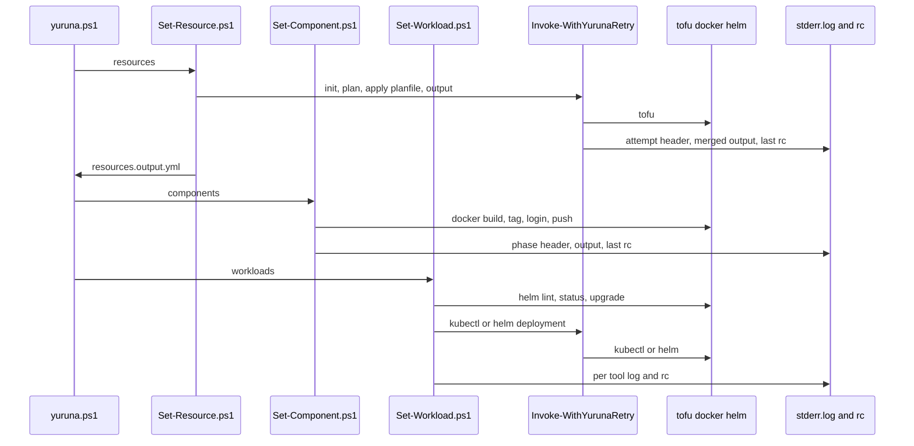
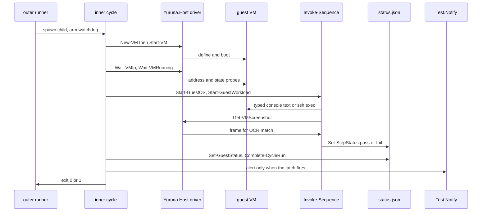
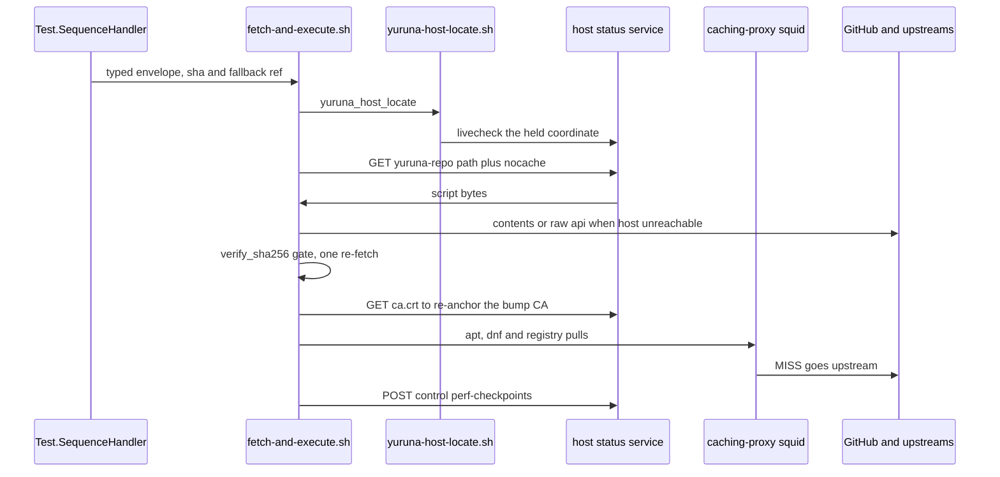
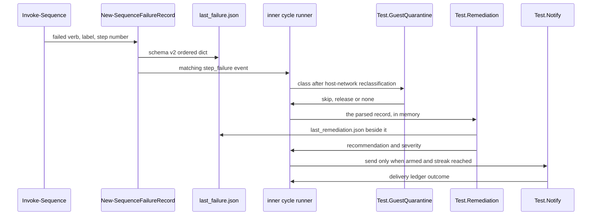
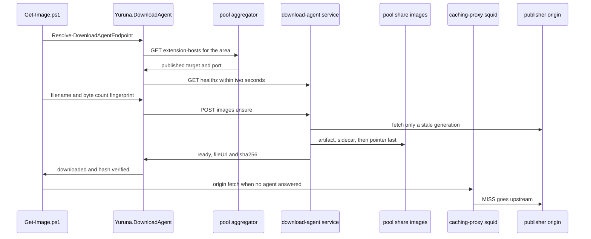
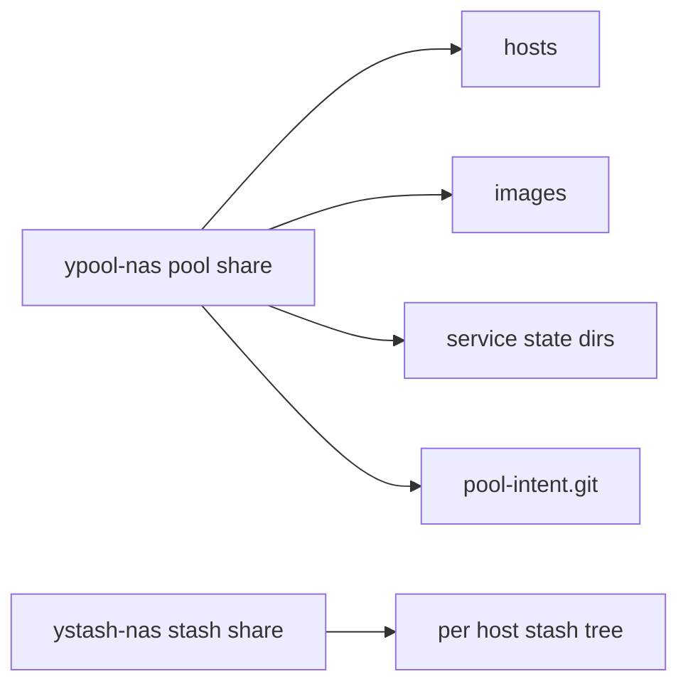

# Data flows

> One sentence: the six highest-frequency runtime flows -- the deploy phases, one
> test cycle, the guest fetch path, failure to alert, image acquisition, and what
> the shared storage holds.

See [Design overview](00-index.md) - [Lifecycle state](04-lifecycle-state.md) -
[Yuruna Architecture](../architecture.md).

Derived from `automation/Set-{Resource,Component,Workload}.ps1` and the
`automation/Yuruna.{Resource,Component,Workload,Retry,DeploymentKind,Result}.psm1`
modules behind them, `automation/Get-SystemDiagnostic.ps1`,
`automation/fetch-and-execute.sh` with `automation/yuruna-{retry,host-locate}.sh`,
`test/modules/Test.{RunnerOuterLoop,RunnerInnerLoop,SequenceEngine,SequenceHandler,SequenceFailureState,GuestQuarantine,Remediation,Notify,PoolStorage,HostIdentity}.psm1`,
`host/modules/Yuruna.{DownloadAgent,UbuntuImage,HostDownload,HostProvision}.psm1`,
`host/vmconfig/{ubuntu.server,caching-proxy-service}.base.user-data`, and the Go
`internal/config` and `internal/state` packages of the download-agent and stash
services.

Every diagram carries only the actors that actually exchange a message, seven or
fewer. Where reality has more, the fold is named in the prose directly under the
diagram.

## A. Three-phase deployment

```mermaid
sequenceDiagram
    participant cli as yuruna.ps1
    participant resource as Set-Resource.ps1
    participant component as Set-Component.ps1
    participant workload as Set-Workload.ps1
    participant retry as Invoke-WithYurunaRetry
    participant tool as tofu docker helm
    participant sidecar as stderr.log and rc
    cli->>resource: resources
    resource->>retry: init, plan, apply planfile, output
    retry->>tool: tofu
    retry->>sidecar: attempt header, merged output, last rc
    resource->>cli: resources.output.yml
    cli->>component: components
    component->>tool: docker build, tag, login, push
    component->>sidecar: phase header, output, last rc
    cli->>workload: workloads
    workload->>tool: helm lint, status, upgrade
    workload->>retry: kubectl or helm deployment
    retry->>tool: kubectl or helm
    workload->>sidecar: per tool log and rc
```

`automation/yuruna.ps1` is a single `switch -Exact` dispatcher over
`requirements / clear / validate / resources / components / workloads`; each of
the three phase entry points is equally runnable on its own, and the test project
scripts call them directly rather than through the dispatcher. All three share
the same prelude -- `Set-YurunaLogLevel`, then `Resolve-YurunaRootSet` to publish
`Env:yuruna_root` / `project_root` / `config_root`, then module eviction, then a
`-Force` import of the phase module -- and all three end in
`Complete-YurunaRun`, which is the only thing that turns a failure manifest into
`exit 1`. `Set-Workload.ps1` adds one pre-flight the others do not have: it runs
`automation/Test-Runtime.ps1` and inspects the **last** element of its output,
because the healthy path streams `docker images` tables ahead of the boolean.

The `tofu docker helm` participant folds the three external CLIs into one lane;
`az` / `aws` / `gcloud` / `docker login` sit behind it too, reached only through
`Resolve-ComponentRegistryLogin` (`automation/Yuruna.Component.Registry.psm1`)
resolving a provider out of `automation/Yuruna.CredentialProvider.psm1`.

**Resource phase** (`automation/Yuruna.Resource.psm1`) runs
`Publish-ResourceListHelper` twice against the same module-scope
`$globalVariables`: pass one expands the globals and produces
`tofu.planfile`; pass two, entered only if pass one's manifest reports success,
applies that planfile and then reads `tofu output -json` into
`resources.output.yml`. Three fail-fast throws guard that read -- a non-zero
exit, empty output, and an outputs object with zero properties -- because a
silently-failed `null_resource` provisioner otherwise produces a green run with
no infrastructure.

**Component phase** (`automation/Yuruna.Component.psm1`) walks
`preProcessor -> build -> postProcessor -> tag -> registryLogin -> push`, each
through the nested `Invoke-ComponentCommand`, which coerces an unset
`$LASTEXITCODE` to `0` so a pure-PowerShell command chain is not read as a
failure.

**Workload phase** (`automation/Yuruna.Workload.psm1`) resolves each deployment
to a kind through `automation/Yuruna.DeploymentKind.psm1`. `chart` goes to
`Invoke-WorkloadChartDeployment` (lint gate, then a `pending-*` recovery via
rollback or uninstall, then `helm upgrade --install --atomic`); `kubectl`,
`helm` and `shell` go to `Invoke-WorkloadToolDeployment`. Context switching is
wrapped in a bare `try`/`finally` with no `catch`, so a
`YurunaCycleRestart` control-flow marker propagates instead of being swallowed.

### Retry gating -- which call sites are retried

Matching the transient classifier in `automation/Yuruna.Retry.psm1` is
necessary but not sufficient; each call site also declares whether re-running it
is safe.

| Call site | Gate |
|---|---|
| `tofu init` via `Invoke-TofuInitWithRetry` | retried on **any** non-zero -- no predicate |
| `tofu plan`, `tofu apply <planfile>` | `$retryableTofu -and Test-YurunaTransientFailure` |
| refreshing `tofu apply` fallback (no planfile) | goes through the helper with `$retryableTofu = $false`, so it runs once |
| `tofu output -json` | transient classifier only |
| `kubectl` / `helm` tool deployments | `$kind.Retryable -and` the transient pattern; `Retryable` is `$true` for `kubectl` and `helm` |
| `shell` deployments | `Retryable` is `$false` -- never retried |
| `helm lint`, `status`, `rollback`, `uninstall`, `upgrade --install` | **not gated at all**, each runs bare, once |
| every docker phase in `Invoke-ComponentCommand` | **not gated at all** |

### The `.stderr.log` / `.rc` sidecar contract

Every phase writes its tool output to a stable pair of files under
`<project_root>/.yuruna/<config_subfolder>/`, so a post-mortem never depends on
the transcript surviving the run.

| Phase | Log | RC | Writer |
|---|---|---|---|
| resources | `resources/<resourceName>/tofu.stderr.log` | `resources/<resourceName>/tofu.rc` | created and cleared in `Publish-ResourceListHelper`, then written by `Invoke-WithYurunaRetry -LogPath -RcFile` across `init`, `plan`/`apply` and `output` |
| components | `components/docker.stderr.log` | `components/docker.rc` | truncated at run start, appended by `Invoke-ComponentCommand` -- one pair per environment, every component and phase shares it |
| workloads, chart | `workloads/<contextName>/<installName>/helm.stderr.log` | `.../helm.rc` | truncated at chart entry, appended by `Invoke-WorkloadChartDeployment` |
| workloads, tool | `workloads/<contextName>/<toolName>.stderr.log` | `.../<toolName>.rc` | `<toolName>` is `$kind.ToolName`; log by the retry helper, rc by `Set-Content -NoNewline` |

Header formats, verbatim from source:

- `Invoke-WithYurunaRetry`: `== <utc stamp> <label> attempt <n>/<max> (exit=<rc>) ==`,
  the stamp being `yyyy-MM-ddTHH:mm:ssZ`; an exception appends `[exception] <message>`.
- `Invoke-ComponentCommand`: `== [<phase>] <command> (exit=<rc>) ==`, where the
  phase is one of `preProcessor[
]`, `build[
]`, `postProcessor[
]`,
  `tag[
]`, `registryLogin[
]`, `push[
]`.
- chart deploy: `== helm lint (exit=N) ==`,
  `== pre-flight helm status (state=<s>; recovering) ==`,
  `== helm rollback <name> 0 (exit=N) ==`,
  `== helm uninstall <name> --no-hooks (exit=N) ==`,
  `== helm upgrade --install --atomic <name> --debug (exit=N) ==`.

The `.rc` file always holds the **last** observed exit code and is always written
with `Set-Content`, never appended, so a re-attempt overwrites it.

`automation/Get-SystemDiagnostic.ps1` is the consumer. It resolves the repo root
from `$PSScriptRoot/..`, then enumerates with
`Get-ChildItem -Recurse -File -Force` filtered on `*.stderr.log` -- `-Force` is
load-bearing, because the logs live under the dot-directory `.yuruna/` and the
whole scan finds nothing without it. Files over 64 KB are seeked to their last
65536 bytes. The rc sidecar is *derived from the log name* rather than looked up
separately, by stripping the extension and rewriting a trailing `.stderr` to
`.rc`, and is rendered inline as ` (last rc=<value>)`. Two other sections read
the same artifacts: the project walk greps `.yuruna/` working folders for
error/fail/warning lines, and the first gap heuristic counts `tofu.tfstate`
files against `helm list -A -o json` and, on state-without-releases, raises
`GAP.tofu-state-without-helm-releases` with text pointing the reader back at the
`helm.stderr.log` files.

### Atomic resource work-folder staging

A resource template is never refreshed in place. `Publish-ResourceListHelper`
stages into `<workFolder>.new`, swaps through `<workFolder>.old`, and marks the
result complete last:

1. **SIGKILL recovery, before anything else** -- if the live folder is absent but
   `.old` exists, `.old` is moved back. A kill landing between the two swap moves
   leaves only `.old`, and the rollback `catch` never runs; without this guard
   the next `tofu apply` would run against a folder with no provider state.
2. Remove any stale `.new`, then create it.
3. `Copy-Item "<template>/*" -> .new -Recurse -Container -ErrorAction Stop`. The
   `-ErrorAction Stop` is the rule: a partial copy must abort rather than feed
   tofu a truncated template.
4. Carry `.terraform`, `.terraform.lock.hcl` and `tofu.planfile` over from the
   live folder into `.new`, also with `-ErrorAction Stop`.
5. Remove any stale `.old`, then move live -> `.old`.
6. Move `.new` -> live inside a `try`; the `catch` moves `.old` back to live and
   rethrows. That is the rollback branch.
7. Remove `.old`.
8. Write `.workfolder.complete` holding a round-trip UTC timestamp.

The invariant the marker buys: a watchdog kill before the marker write leaves
either no work folder or the previous cycle's unchanged copy, never a
half-applied template.

## B. Test cycle (one guest)

```mermaid
sequenceDiagram
    participant outer as outer runner
    participant inner as inner cycle
    participant driver as Yuruna.Host driver
    participant guest as guest VM
    participant engine as Invoke-Sequence
    participant status as status.json
    participant notify as Test.Notify
    outer->>inner: spawn child, arm watchdog
    inner->>driver: New-VM then Start-VM
    driver->>guest: define and boot
    inner->>driver: Wait-VMIp, Wait-VMRunning
    driver->>guest: address and state probes
    inner->>engine: Start-GuestOS, Start-GuestWorkload
    engine->>guest: typed console text or ssh exec
    engine->>driver: Get-VMScreenshot
    driver->>engine: frame for OCR match
    engine->>status: Set-StepStatus pass or fail
    inner->>status: Set-GuestStatus, Complete-CycleRun
    inner->>notify: alert only when the latch fires
    inner->>outer: exit 0 or 1
```

Two folds. `outer runner` covers both resident
`Invoke-RunnerOuterLoop` (`test/modules/Test.RunnerOuterLoop.psm1`) and the
fresh-per-cycle child `test/modules/Invoke-TestCycleRunner.ps1`; they are
separate processes that write the same `runner.state.json`, and the split is
drawn in [Lifecycle state](04-lifecycle-state.md). `Yuruna.Host driver` stands
for whichever of the three `host/*/modules/Yuruna.Host.psm1` implementations
`Initialize-YurunaHost` loaded; all three satisfy the same 38-verb contract in
`host/Yuruna.Host.Contract.psm1`.

The step list is derived per cycle by `Get-CycleStepNameList`
(`test/modules/Test.RunnerInnerLoop.psm1`): the base four are `New-VM`,
`Start-VM`, `Start-GuestOS` and `New-VM.Resource`, with `Screenshots` and
`Start-GuestWorkload` appended only when a guest actually has a schedule or a
workload sequence, so the dashboard renders exactly the tiles the cycle will run.
`Invoke-GuestProvisionIteration` owns the per-guest body and returns control
through an `IterState.Control` field of `proceed` / `continue` / `break` rather
than a bare loop keyword.

Three things happen around every step, not just the failing one:
`Assert-CachingProxyServiceStillReachable` before it, `Set-StepStatus` on both
sides of it, and `Sync-RunnerStepConfig` after it, which re-reads
`StopOnFailure` and the two VM timeouts so an operator edit lands mid-cycle.

Validation is one of two shapes and both funnel into the same pass/fail slot.
The OCR shape is `Wait-ForText` in `test/modules/Test.SequenceEngine.psm1`,
which polls against a wall-clock deadline, calls the driver's `Get-VMScreenshot`
and hands the frame to `Test-CombinedOcrMatch`
(`test/modules/Test.OcrMatch.psm1`), running the engines registered in
`test/modules/Test.OcrEngine.psm1` sequentially and short-circuiting on the
combine mode. The ssh shape is the `sshWaitReady` / `sshExec` /
`sshFetchAndExecute` verbs reaching `Invoke-GuestSsh`
(`test/modules/Test.Ssh.psm1`), which runs detached under a derived token so a
reconnect re-attaches rather than re-running. In both shapes the step result is
normalized to a strict `[bool]` before it is believed, and an unregistered verb
is a warning plus a failure -- a YAML typo can never pass.

The notification arrow is gated, not unconditional; the latch is section D.

## C. Guest repo, proxy and stash fetch

```mermaid
sequenceDiagram
    participant harness as Test.SequenceHandler
    participant fae as fetch-and-execute.sh
    participant locate as yuruna-host-locate.sh
    participant statussvc as host status service
    participant squid as caching-proxy squid
    participant origin as GitHub and upstreams
    harness->>fae: typed envelope, sha and fallback ref
    fae->>locate: yuruna_host_locate
    locate->>statussvc: livecheck the held coordinate
    fae->>statussvc: GET yuruna-repo path plus nocache
    statussvc->>fae: script bytes
    fae->>origin: contents or raw api when host unreachable
    fae->>fae: verify_sha256 gate, one re-fetch
    fae->>statussvc: GET ca.crt to re-anchor the bump CA
    fae->>squid: apt, dnf and registry pulls
    squid->>origin: MISS goes upstream
    fae->>statussvc: POST control perf-checkpoints
```

**What is asked for.** The harness never uploads the script. It types a command
line built by `Get-FetchExecuteEnvPrefix`
(`test/modules/Test.SequenceHandler.psm1`) that carries
`EXEC_REQUIRE_SHA256=1`, the working-tree digest of the payload (`E_SHA`), the
digest of the retry library (`E_RETRY_SHA`), and an owner/repo plus 12-hex
commit fallback (`E_FB_REPO`, `E_FB_REF`). `GH_TOKEN` is deliberately never
typed, because the console is screenshotted and OCR'd into the published run log.
`fetch-and-execute.sh` itself was seeded by cloud-init, not fetched: the base64
placeholders in `host/vmconfig/ubuntu.server.base.user-data` drop it,
`yuruna-retry.sh`, `yuruna-versions.sh`, `yuruna-network.sh` and
`yuruna-host-locate.sh` into `/usr/local/lib/yuruna/`.

**Who serves it.** `resolve_fetch_source()` prefers the host: it sources
`/etc/yuruna/host.env`, and either a successful `yuruna_host_locate` (its
success *is* the livecheck evidence) or a direct
`wget --no-proxy --timeout=2 --tries=2` against `/livecheck` selects
`http://<ip>:<port>/yuruna-repo/`, served by `test/service/Start-StatusService.ps1`
behind a deny-list that keeps `test.config.yml`, vault files and ssh keys out of
the tree. With no global IPv4 the resolver skips the probe entirely and goes
straight to GitHub.

**The fallback to origin.** `build_fetch_url()` composes
`https://api.github.com/repos/<repo>/contents/<path>?ref=<ref>` when a token
exists -- passed in a 0600 temporary wgetrc via `--config=`, never `--header`,
which would be visible in `ps` -- and `raw.githubusercontent.com/<repo>/<ref>/<path>`
when it does not. Both pin the commit. Either way the bytes land in a temp file
and pass `verify_sha256` before anything runs; an empty digest with
`EXEC_REQUIRE_SHA256=1` is refused, and a mismatch buys exactly one re-fetch and
re-verify to absorb the type-to-fetch concurrent-edit race.

**The cache-buster.** `QUERY_PARAMS` is `EXEC_QUERY_PARAMS` when set, else
`?nocache=<YurunaCacheContent>` when that variable is non-empty, and it is
appended only to the host and base legs -- the GitHub legs already pin a commit,
so there is nothing to bust. The same `${YurunaCacheContent:+?nocache=...}` idiom
appears on nearly thirty upstream URLs across `guest/**/*.sh`, which is how an
operator forces a fresh pull through squid for one cycle.

**The proxy leg.** Package and image bytes do not use this path at all: they go
through the squid instance in the caching-proxy VM, seeded system-wide as
`http_proxy` on 3128 and `https_proxy` on 3129, with the container registry
mirrored at port 5000. Because 3129 is `ssl-bump`, the guest needs the proxy CA;
`yuruna_ca_selfheal` in `automation/yuruna-retry.sh` re-fetches it from
`http://<status ip>:<port>/ca.crt` and reinstalls it, which is what lets a guest
whose seed was baked CA-less recover on its own.

**The stash is not on this path.** No guest script fetches from the stash
service; it is a write sink reached over `scp`/`sftp` on port 22 from a LAN
client, and it holds no pool data. It is drawn in section F instead, where its
separate share is the point.

## D. Failure, taxonomy and alert

```mermaid
sequenceDiagram
    participant engine as Invoke-Sequence
    participant builder as New-SequenceFailureRecord
    participant record as last_failure.json
    participant runner as inner cycle runner
    participant quarantine as Test.GuestQuarantine
    participant remediation as Test.Remediation
    participant notify as Test.Notify
    engine->>builder: failed verb, label, step number
    builder->>record: schema v2 ordered dict
    builder->>runner: matching step_failure event
    runner->>quarantine: class after host-network reclassification
    quarantine->>runner: skip, release or none
    runner->>remediation: the parsed record, in memory
    remediation->>record: last_remediation.json beside it
    remediation->>runner: recommendation and severity
    runner->>notify: send only when armed and streak reached
    notify->>runner: delivery ledger outcome
```

**Classification.** The vocabulary is the 23-value `$script:FailureClassEnum` in
`test/modules/Test.FailureTaxonomy.psm1`, with severity `hard` / `soft` /
`unknown`. Each verb declares its own class statically at registration -- for
example `waitForText` is `ocr_timeout` / hard, `sshWaitReady` is
`network_timeout` / soft, `loadDiskSnapshot` is `snapshot_restore_failed` /
hard. `Test.SequenceAction.psm1` keeps a literal copy of the enum in a
`ValidateSet` (an attribute argument must be a constant) and asserts it back
against the taxonomy at module load, warn-only, so drift is visible without
taking a cycle down.

**The record.** The failure record is built once, by
`New-SequenceFailureRecord` in `test/modules/Test.SequenceFailureState.psm1`,
which returns both the on-disk ordered dict and the matching NDJSON event from
the same call, so file and stream can never disagree about the class. It is
captured at the outer call site rather than inside the retry loop, so a
transient attempt leaves no stale `last_failure.json`. Stages that fail
*outside* the sequence engine -- git sync, planning, VM provisioning, cleanup --
have no engine record to write, so `Write-CycleInfraFailure`
(`test/modules/Test.RunnerInnerLoop.psm1`) lands an equivalent schema-v2 record,
writing only when `last_failure.json` is absent so it can never clobber the
richer engine-written one.

**Quarantine.** `test/modules/Test.GuestQuarantine.psm1` is a per-guest circuit
breaker keyed on a *same-class consecutive* streak; a class change resets the
count to one. Before any fail is registered the runner passes the class through
`Resolve-HostNetworkFailureClass`, and host-scoped classes count for nothing and
leave an existing streak standing -- otherwise one broken host would quarantine
every network-touching guest at once and the pool would read green. A clean pass
drops the record entirely. The decision function returns `none` / `skip` /
`release`, releasing on a new framework or project commit or an exhausted skip
budget.

**Remediation is advisory.** `Invoke-Remediation`
(`test/modules/Test.Remediation.psm1`) routes on `failureClass` through a
registry of built-in handlers, preferring `innerFailureClass` when the record
carries one and that class has its own handler -- otherwise an exhausted retry
would collapse every cause into `retry_exhausted`. It writes a durable
`last_remediation.json` and emits `remediation_recommended`, and **performs
nothing**. Actual automatic action happens in exactly one other place: the
outer failure pause consults a separate allow-list and, when the class is on it
and the per-cycle attempt cap has not been reached, ends the pause early.

**The gate.** The latch is Armed -> N failures -> Fired -> M successes -> Armed,
with the counters persisted to `runner.gating.json` so they survive the
per-cycle respawn. A pass zeroes the failure streak and re-arms once the success
threshold is met; a fail zeroes the success streak; a notification ships only
when the latch is armed **and** the failure streak has reached
`notification.failuresBeforeAlert`, after which it disarms itself. Pre-cycle
failures route through the same latch, so an unfixed host alerts once per
streak instead of once per respawn. Dispatch is `Send-YurunaNotification`
(`test/modules/Test.Notify.psm1`) -- named that way, and not `Send-Notification`,
because extensions load `-Global` and a same-named dispatcher would be shadowed
by the first transport to load. Delivery is asynchronous by default and every
outcome is appended to `notification.delivery.json`, so a reader can tell
whether the escalation channel actually received the alert.

## E. Agent-first image acquisition

```mermaid
sequenceDiagram
    participant getimage as Get-Image.ps1
    participant client as Yuruna.DownloadAgent
    participant aggregator as pool aggregator
    participant agent as download-agent service
    participant share as pool share images
    participant squid as caching-proxy squid
    participant origin as publisher origin
    getimage->>client: Resolve-DownloadAgentEndpoint
    client->>aggregator: GET extension-hosts for the area
    aggregator->>client: published target and port
    client->>agent: GET healthz within two seconds
    getimage->>client: filename and byte count fingerprint
    client->>agent: POST images ensure
    agent->>origin: fetch only a stale generation
    agent->>share: artifact, sidecar, then pointer last
    agent->>client: ready, fileUrl and sha256
    client->>getimage: downloaded and hash verified
    getimage->>squid: origin fetch when no agent answered
    squid->>origin: MISS goes upstream
```

**The agent is asked before the origin is touched at all.** In
`Save-UbuntuServerImage` (`host/modules/Yuruna.UbuntuImage.psm1`) the agent rungs
are feature-detected by command name, so a caller with no driver loaded simply
skips them; only after they decline does the script resolve the upstream index,
consult the local sentinel, and download.

**Endpoint discovery** (`Resolve-DownloadAgentEndpoint` in
`host/modules/Yuruna.DownloadAgent.psm1`) walks three rungs, memoized per
process: the operator pin `YURUNA_EXTENSION_HOST_DOWNLOAD_AGENT_SERVICE` always
first, so discovery can never beat it; then an agent VM on this host via the
driver's `Get-VMIp`; then the pool, by asking the aggregator riding inside the
caching-proxy VM on port 9400 for `/api/v1/extension-hosts?area=download-agent-service`
and preferring the record's `target`, which is the only field carrying a
published port. Every candidate is proved with a `/healthz` probe on a two-second
budget before it is accepted, and every failure shape collapses to an empty
string -- nothing in this module throws, because each call sits in front of a
`Get-Image` run whose fallback is the origin. The single `aggregator` arrow folds
those three rungs.

**Per image**, `Request-DownloadAgentImage` POSTs
`/api/v1/images/{hostType}/{imageKey}/ensure` with a fingerprint of filename and
byte count -- deliberately no hash, since hashing a multi-gigabyte local artifact
would cost more than the transfer it saves, and the four-line sentinel supplies
those two fields free. `localCurrent: true` returns `skipped` with no resolve, no
HEAD and no transfer; `state: downloading` polls with backoff from 2 s to 30 s;
`state: ready` yields metadata whose advertised `fileUrl` is used verbatim and
resumed with `Range` requests across up to five attempts.

**Verification** is not optional. The fetched bytes are hashed with
`Get-FileHash` against the agent's published SHA-256; a missing published hash is
a refusal rather than a pass, and a mismatch deletes the staging file and returns
`failed`. On the origin path the equivalent gate is
`Test-UbuntuServerImageChecksum`, which fetches `SHA256SUMS` **to disk** (a
`.Content` read would hand back a byte array whose string form is decimal),
distinguishes a 403/404/410 "not published" soft pass from an unverifiable
transient failure, and runs the signature check
(`Test-PublishedChecksumSignature`, `host/modules/Yuruna.Image.psm1`) against
pinned Ubuntu keys -- `bad` aborts, `unverified` warns and proceeds on the hash.

**Writes on the share are ordered so a reader never sees a torn generation:** the
artifact and its `.meta.json` sidecar land first, and the
`current.<arch>.<variant>.json` pointer is replaced last. Replacing that pointer
is the only thing that changes what hosts are served.

The agent's own byte downloads run through squid too, with
`--proxy-http=http://<cache>:3128` and `--proxy-https=http://<cache>:3129` pinned
to `/etc/yuruna/yuruna-squid-ca.crt`.

## F. What lives on the shared storage

This one is a layout, not a message exchange, so it is a flowchart.

```mermaid
flowchart LR
    pool-nas["ypool-nas pool share"]
    hosts["hosts"]
    images["images"]
    service-state["service state dirs"]
    intent-git["pool-intent.git"]
    stash-nas["ystash-nas stash share"]
    stash-tree["per host stash tree"]
    pool-nas --> hosts
    pool-nas --> images
    pool-nas --> service-state
    pool-nas --> intent-git
    stash-nas --> stash-tree
```

Two shares, two accounts, two mount points -- they are separate tiers, not one
volume with two folders. `service state dirs` folds the two per-service state
directories that sit at the pool root, listed individually below.

| Folder on the share | Confirmed in | Written by | Read by |
|---|---|---|---|
| `hosts/info.<hostId>.yml` | `Write-HostInfoRecord`, `test/modules/Test.HostIdentity.psm1` | the host, once per successful drain | the reimage-reclaim scanner, which enumerates `-Filter 'info.*.yml' -File` so sibling directories are invisible to it |
| `hosts/<hostId>/` | `Get-PoolStorageHostFolderPath`, `test/modules/Test.PoolStorage.psm1` | the host | the host's own serving fallback |
| `hosts/<hostId>/test-cycles/<NNNNNN.date.time.hostId>/` | `Get-PoolStorageCycleRootPath`, same module | `test/modules/Invoke-PoolStorageDrain.ps1`, oldest first, writing `.yuruna-complete` **last** | the aggregator's archive route and the dashboard cycle deep links |
| `hosts/<hostId>/services/caching-proxy-service/` | `ypool-nas-replicate.sh` in `host/vmconfig/caching-proxy-service.base.user-data` | the caching-proxy VM, rsyncing loki, prometheus and grafana | manual restore only |
| `images/` | `ImagesDirName`, `test/extension/download-agent-service/server/internal/config/config.go` | the download-agent service | every host's `Get-Image` path |
| `images/.agent-lease.json` | `LeaseFileName`, same file | the agent holding the single-writer lease | other agents, which stand down read-only |
| `images/<hostType>/<imageKey>/current.<arch>.<variant>.json` | `PointerName`, same file | the agent, **last** in the write order | hosts resolving an image generation |
| `images/<hostType>/<imageKey>/.staging/` | `StagingDirName`, same file | the agent, PID-suffixed; dot-prefixed so pool walkers skip it | the agent only |
| `images/<hostType>/<imageKey>/manual/<arch>.<variant>/` | `ManualDirName`, same file | a human, deliberately not dot-prefixed so it is visible in a file manager | adopted into the pool on the next scan |
| `download-agent-service/` | `StateDirFor`, same file | the agent -- beside `images/`, not inside it, so the images tree stays artifacts-only | operators and the status route |
| `pool-control-service/` | `STATE_DIR` in `guest/ubuntu.server.26/ubuntu.server.26.pool-control-service.sh` | the pool-control service | operators and its diagnostics route |
| `pool-intent.git/` | `INTENT_STORE`, same script | the pool-control service, which commits and pushes | every runner, read-only over Apache's dumb-HTTP alias |
| `stash/<hostId>/hostkey/stash_host_ed25519` | `HostKeyDirName` and `HostKeyFileName`, `test/extension/stash-service/server/internal/config/config.go` | the stash service | itself, across rebuilds |
| `stash/<hostId>/files/yyyy/mm/dd/` | `FilesDirName`, same file | the stash service | the browser UI, pool-wide |
| `stash/<hostId>/files/.../<name>.yuruna.meta.json` | `SidecarExtension`, same file | the stash service | index rebuild on a fresh VM |

Three deliberate absences are as load-bearing as the folders.

- **The stash index is not on the share.** `stash.sqlite` and the offline buffer
  live VM-local under `/var/lib/stash-service/`, because SQLite locking is
  unreliable over CIFS. On a fresh VM the index is rebuilt from the on-share
  sidecars, which is why the sidecar is durable and the database is not.
- **The drain ledger is not on the share.** `runtime/poolstorage.state.json` on
  the host is the source of truth for what has already been replicated; the
  share is never consulted to decide.
- **There is no stash data on the pool share, and no pool data on the stash
  share.** A bare `<hostId>/` directory at the pool root is a pre-unification
  layout: frozen, never read, never migrated, with `test/pool/Remove-PoolHost.ps1`
  as its only sanctioned deleter.
