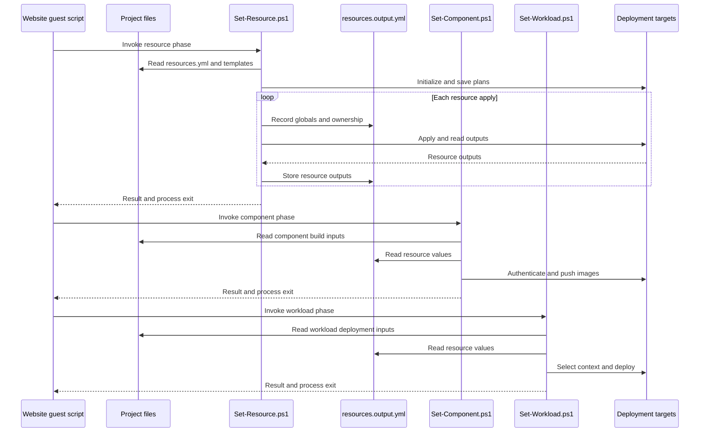
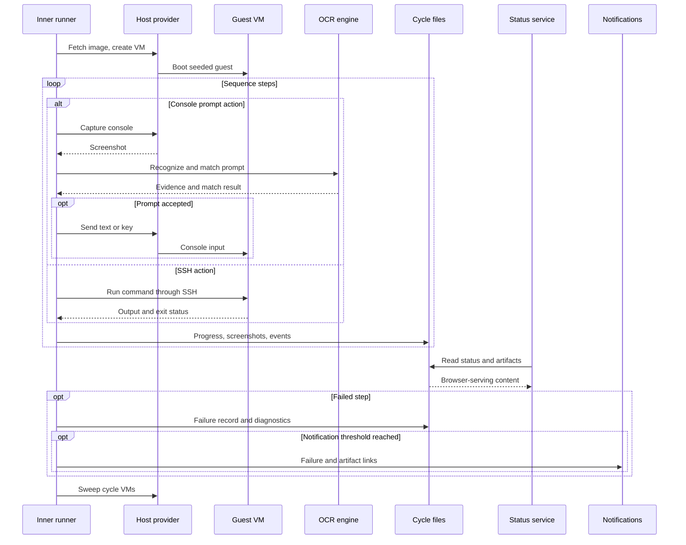
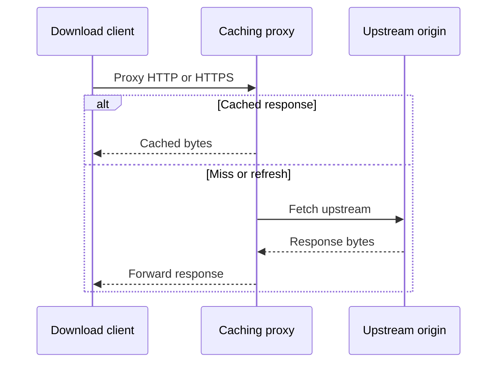
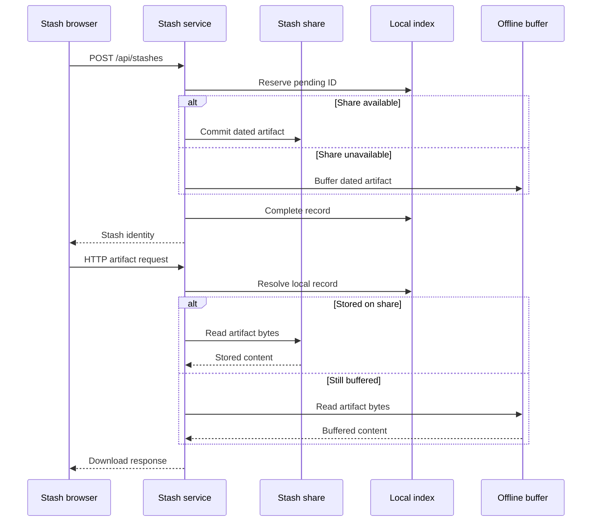
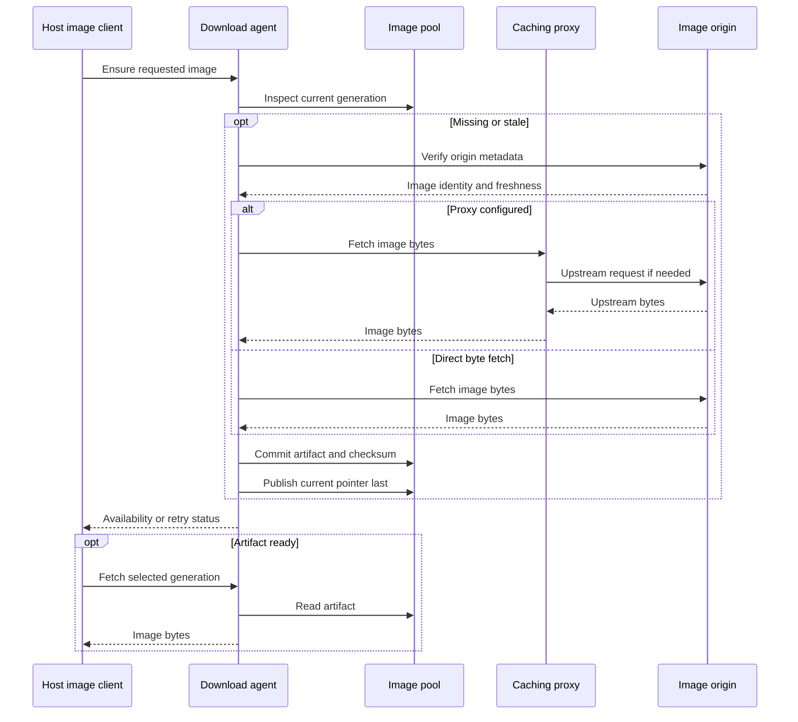
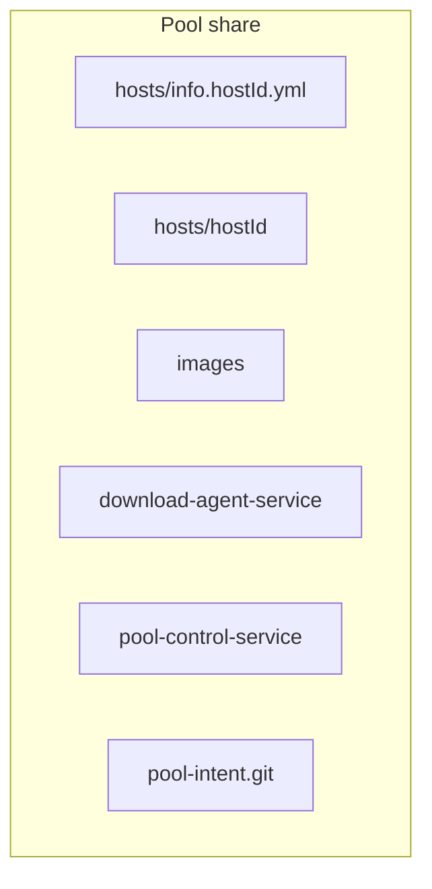
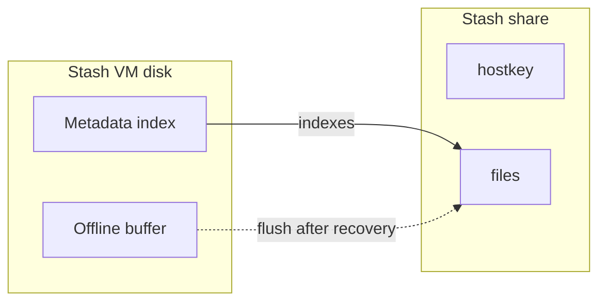
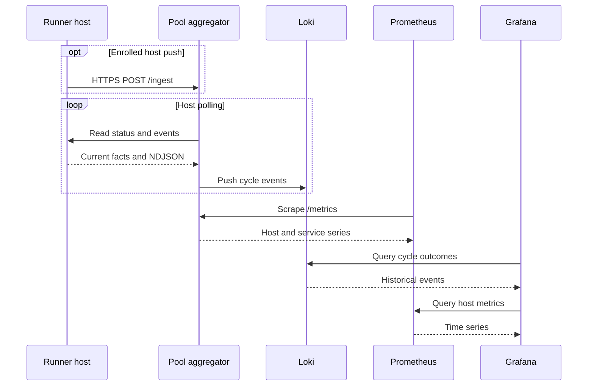

# Data flows

These diagrams trace deployment, test execution, service requests, and the storage exchanged by the current implementation.

Each sequence has at most seven participants. A participant can group the
modules behind one runtime role; storage participants represent file access.
The [architecture](../architecture.md) explains the three capabilities and
phase model, while these views show their actual exchanges.

## A. Three-phase deployment

```mermaid
sequenceDiagram
    participant ubuntu-server-26-workload-k8s-website-sh as Website guest script
    participant config-cloud as Project files
    participant set-resource-ps1 as Set-Resource.ps1
    participant resources-output-yml as resources.output.yml
    participant set-component-ps1 as Set-Component.ps1
    participant set-workload-ps1 as Set-Workload.ps1
    participant deployment-targets as Deployment targets
    ubuntu-server-26-workload-k8s-website-sh->>set-resource-ps1: Invoke resource phase
    set-resource-ps1->>config-cloud: Read resources.yml and templates
    set-resource-ps1->>deployment-targets: Initialize and save plans
    loop Each resource apply
        set-resource-ps1->>resources-output-yml: Record globals and ownership
        set-resource-ps1->>deployment-targets: Apply and read outputs
        deployment-targets-->>set-resource-ps1: Resource outputs
        set-resource-ps1->>resources-output-yml: Store resource outputs
    end
    set-resource-ps1-->>ubuntu-server-26-workload-k8s-website-sh: Result and process exit
    ubuntu-server-26-workload-k8s-website-sh->>set-component-ps1: Invoke component phase
    set-component-ps1->>config-cloud: Read component build inputs
    set-component-ps1->>resources-output-yml: Read resource values
    set-component-ps1->>deployment-targets: Authenticate and push images
    set-component-ps1-->>ubuntu-server-26-workload-k8s-website-sh: Result and process exit
    ubuntu-server-26-workload-k8s-website-sh->>set-workload-ps1: Invoke workload phase
    set-workload-ps1->>config-cloud: Read workload deployment inputs
    set-workload-ps1->>resources-output-yml: Read resource values
    set-workload-ps1->>deployment-targets: Select context and deploy
    set-workload-ps1-->>ubuntu-server-26-workload-k8s-website-sh: Result and process exit
```

Sources: the project's
[website guest script](https://github.com/alissonsol/yuruna-project/blob/main/example/website/test/ubuntu.server.26/ubuntu.server.26.workload.k8s.website.sh),
[Set-Resource](../../automation/Set-Resource.ps1),
[Set-Component](../../automation/Set-Component.ps1),
[Set-Workload](../../automation/Set-Workload.ps1),
[Yuruna.Resource](../../automation/Yuruna.Resource.psm1),
[Yuruna.Component](../../automation/Yuruna.Component.psm1), and
[Yuruna.Workload](../../automation/Yuruna.Workload.psm1).
Deployment targets group the infrastructure selected by the templates, the
image registry, and the Kubernetes context. These targets can be local.

This is the successful caller path: the phase scripts do not invoke one
another. Resource initialization plans the resources before the apply pass;
each apply first writes an ownership entry to
`config/<cloud>/resources.output.yml`, then replaces it with collected outputs.
The output file can therefore describe a partial deployment. Components and
workloads read it independently; workloads also support the parent
configuration directory's output file. Failed phase manifests produce a
nonzero process exit, and the guest script stops before subsequent phases.

[Variable expansion](../../automation/Yuruna.VariableExpansion.psm1) supplies
resource outputs to downstream commands. Workload values layer resource
outputs, workload globals, workload variables, and deployment variables;
later values win. Chart deployments write `values.yaml`, run `helm lint`,
and deploy with `helm upgrade --install --atomic`. Other deployments use
configured `kubectl`, `helm`, or shell commands. See the architecture's
[work-folder staging](../architecture.md#atomic-resource-work-folder-staging)
and [retry policy](../architecture.md#shared-transient-failure-retry-policy)
for those contracts.

### The stderr.log / rc sidecar contract

The phase modules above and [Yuruna.Retry](../../automation/Yuruna.Retry.psm1)
write tool output and the last recorded exit code beside their work folders.
[Get-SystemDiagnostic](../../automation/Get-SystemDiagnostic.ps1) reads these
paths relative to the project root:

| Producer | Log and exit-code paths |
| --- | --- |
| Resources | `.yuruna/<cloud>/resources/<name>/tofu.stderr.log` and `tofu.rc`. |
| Components | `.yuruna/<cloud>/components/docker.stderr.log` and `docker.rc`. |
| Chart workloads | `.yuruna/<cloud>/workloads/<context>/<installName>/helm.stderr.log` and `helm.rc`. |
| Tool workloads | `.yuruna/<cloud>/workloads/<context>/<tool>.stderr.log` and `<tool>.rc`. |

Component commands share the component-phase log. Each `.rc` records the most
recent captured command outcome; phase result manifests remain authoritative
for overall success.

## B. Test cycle

```mermaid
sequenceDiagram
    participant test-runnerinnerloop-psm1 as Inner runner
    participant yuruna-host-psm1 as Host provider
    participant guest-vm as Guest VM
    participant test-ocrengine-psm1 as OCR engine
    participant cycle-files as Cycle files
    participant start-statusservice-ps1 as Status service
    participant test-notify-psm1 as Notifications
    test-runnerinnerloop-psm1->>yuruna-host-psm1: Fetch image, create VM
    yuruna-host-psm1->>guest-vm: Boot seeded guest
    loop Sequence steps
        alt Console prompt action
            test-runnerinnerloop-psm1->>yuruna-host-psm1: Capture console
            yuruna-host-psm1-->>test-runnerinnerloop-psm1: Screenshot
            test-runnerinnerloop-psm1->>test-ocrengine-psm1: Recognize and match prompt
            test-ocrengine-psm1-->>test-runnerinnerloop-psm1: Evidence and match result
            opt Prompt accepted
                test-runnerinnerloop-psm1->>yuruna-host-psm1: Send text or key
                yuruna-host-psm1->>guest-vm: Console input
            end
        else SSH action
            test-runnerinnerloop-psm1->>guest-vm: Run command through SSH
            guest-vm-->>test-runnerinnerloop-psm1: Output and exit status
        end
        test-runnerinnerloop-psm1->>cycle-files: Progress, screenshots, events
    end
    start-statusservice-ps1->>cycle-files: Read status and artifacts
    cycle-files-->>start-statusservice-ps1: Browser-serving content
    opt Failed step
        test-runnerinnerloop-psm1->>cycle-files: Failure record and diagnostics
        opt Notification threshold reached
            test-runnerinnerloop-psm1->>test-notify-psm1: Failure and artifact links
        end
    end
    test-runnerinnerloop-psm1->>yuruna-host-psm1: Sweep cycle VMs
```

Sources: [Test.RunnerInnerLoop](../../test/modules/Test.RunnerInnerLoop.psm1),
[Test.SequenceRunner](../../test/modules/Test.SequenceRunner.psm1),
[Test.SequenceEngine](../../test/modules/Test.SequenceEngine.psm1),
[Test.SequenceHandler](../../test/modules/Test.SequenceHandler.psm1),
[Test.Ssh](../../test/modules/Test.Ssh.psm1),
[host contract](../../host/Yuruna.Host.Contract.psm1),
[Test.OcrEngine](../../test/modules/Test.OcrEngine.psm1),
[Test.OcrMatch](../../test/modules/Test.OcrMatch.psm1),
[Test.Status](../../test/modules/Test.Status.psm1),
[Start-StatusService](../../test/service/Start-StatusService.ps1), and
[Test.Notify](../../test/modules/Test.Notify.psm1).

The runner groups its sequence modules; OCR groups recognition and matching.
Console waits inspect screenshots, while SSH actions validate command output
without OCR. Status serves harness-written files rather than receiving each
step as an HTTP request. Notifications depend on configuration and failure
gating. Normal completion attempts cleanup before pausing or delaying;
interruption can leave VMs for the next sweep. See
[Lifecycle state](04-lifecycle-state.md) for supervision and restart behavior.

## C. Caching-proxy fetch

```mermaid
sequenceDiagram
    participant yuruna-hostdownload-psm1 as Download client
    participant caching-proxy-service as Caching proxy
    participant upstream-origin as Upstream origin
    yuruna-hostdownload-psm1->>caching-proxy-service: Proxy HTTP or HTTPS
    alt Cached response
        caching-proxy-service-->>yuruna-hostdownload-psm1: Cached bytes
    else Miss or refresh
        caching-proxy-service->>upstream-origin: Fetch upstream
        upstream-origin-->>caching-proxy-service: Response bytes
        caching-proxy-service-->>yuruna-hostdownload-psm1: Forward response
    end
```

Sources: [Yuruna.HostDownload](../../host/modules/Yuruna.HostDownload.psm1),
[Test.CachingProxyService](../../test/modules/Test.CachingProxyService.psm1),
[caching-proxy service](../../test/extension/caching-proxy-service/), and
[proxy provisioning](../../host/vmconfig/caching-proxy-service.base.user-data).
The configured proxy path uses Squid; HTTPS interception also requires the
proxy CA. The download helper can select a direct request when proxy discovery
or CA setup is unavailable. Guest setup also uses configured proxy endpoints.
Cache behavior depends on request policy; the stash is a separate service.

## D. Stash upload and fetch

```mermaid
sequenceDiagram
    participant new-html as Stash browser
    participant stash-service as Stash service
    participant store-go as Stash share
    participant metadata-index as Local index
    participant offline-buffer as Offline buffer
    new-html->>stash-service: POST /api/stashes
    stash-service->>metadata-index: Reserve pending ID
    alt Share available
        stash-service->>store-go: Commit dated artifact
    else Share unavailable
        stash-service->>offline-buffer: Buffer dated artifact
    end
    stash-service->>metadata-index: Complete record
    stash-service-->>new-html: Stash identity
    new-html->>stash-service: HTTP artifact request
    stash-service->>metadata-index: Resolve local record
    alt Stored on share
        stash-service->>store-go: Read artifact bytes
        store-go-->>stash-service: Stored content
    else Still buffered
        stash-service->>offline-buffer: Read artifact bytes
        offline-buffer-->>stash-service: Buffered content
    end
    stash-service-->>new-html: Download response
```

Sources: [upload page](../../test/extension/stash-service/server/internal/httpsrv/web/new.html),
[HTTP handlers](../../test/extension/stash-service/server/internal/httpsrv/handlers.go),
[ingest pipeline](../../test/extension/stash-service/server/internal/sshsrv/ingest.go),
[store](../../test/extension/stash-service/server/internal/store/store.go), and
[metadata index](../../test/extension/stash-service/server/internal/meta/).
This shows a browser creating and fetching a stash on its own host. The local
index records a pending ID before the artifact is finalized; when the share is
unavailable, the artifact and index still live on the VM. The same ingest path
also serves SCP/SFTP through the
[SSH listener](../../test/extension/stash-service/server/internal/sshsrv/).
Buffered uploads move to the share when it recovers: the
[flush worker](../../test/extension/stash-service/server/internal/sshsrv/flush.go)
copies them after recovery. The
[discovery extension](../../test/extension/stash-service/default.psm1) resolves
the service endpoint; it does not store artifact bytes.

## E. Download-agent image path

```mermaid
sequenceDiagram
    participant yuruna-downloadagent-psm1 as Host image client
    participant download-agent-service as Download agent
    participant images as Image pool
    participant caching-proxy-service as Caching proxy
    participant image-origin as Image origin
    yuruna-downloadagent-psm1->>download-agent-service: Ensure requested image
    download-agent-service->>images: Inspect current generation
    opt Missing or stale
        download-agent-service->>image-origin: Verify origin metadata
        image-origin-->>download-agent-service: Image identity and freshness
        alt Proxy configured
            %% optional: proxy settings select the cache-capable byte path.
            download-agent-service->>caching-proxy-service: Fetch image bytes
            caching-proxy-service->>image-origin: Upstream request if needed
            image-origin-->>caching-proxy-service: Upstream bytes
            caching-proxy-service-->>download-agent-service: Image bytes
        else Direct byte fetch
            download-agent-service->>image-origin: Fetch image bytes
            image-origin-->>download-agent-service: Image bytes
        end
        download-agent-service->>images: Commit artifact and checksum
        download-agent-service->>images: Publish current pointer last
    end
    download-agent-service-->>yuruna-downloadagent-psm1: Availability or retry status
    opt Artifact ready
        yuruna-downloadagent-psm1->>download-agent-service: Fetch selected generation
        download-agent-service->>images: Read artifact
        download-agent-service-->>yuruna-downloadagent-psm1: Image bytes
    end
```

Sources: [Yuruna.DownloadAgent](../../host/modules/Yuruna.DownloadAgent.psm1),
[download-agent entry point](../../test/extension/download-agent-service/server/main.go),
[image resolver](../../test/extension/download-agent-service/server/internal/imagestore/resolve.go),
[refresh pipeline](../../test/extension/download-agent-service/server/internal/imagestore/refresh.go),
[image store](../../test/extension/download-agent-service/server/internal/imagestore/store.go),
and [guest setup](../../guest/ubuntu.server.26/ubuntu.server.26.download-agent-service.sh).

Origin checks bypass the cache-capable byte client. Checksum metadata records
whether verification succeeded or the publisher supplied no checksum; a
published generation does not imply every family supports checksum verification.
Artifacts and metadata precede the current-pointer update, keeping a prior
generation readable during refresh. An unavailable share or queued image does
not yield ready bytes; the client polls within its deadline and validates the
artifact it receives.

## F. Pool and stash storage

```mermaid
flowchart TB
    subgraph yuruna-pool["Pool share"]
        hosts-info["hosts/info.hostId.yml"]
        hosts["hosts/hostId"]
        images["images"]
        download-agent-service["download-agent-service"]
        pool-control-service["pool-control-service"]
        pool-intent-git["pool-intent.git"]
    end
```

The six children plus the share boundary make seven boxes. `hosts/hostId`
groups cycle archives and service data. Each service-state directory groups
its audit stream and status snapshot.

| Share-relative path | Writer and contents |
| --- | --- |
| `hosts/info.<hostId>.yml` | [Test.HostIdentity](../../test/modules/Test.HostIdentity.psm1): stable UUID and hardware fingerprint used for identity and reclaim. |
| `hosts/<hostId>/test-cycles/<cycle>/` | [Test.PoolStorage](../../test/modules/Test.PoolStorage.psm1): cycle artifacts, verified and committed with `.yuruna-complete`. |
| `hosts/<hostId>/services/caching-proxy-service/` | [Proxy provisioning](../../host/vmconfig/caching-proxy-service.base.user-data): persistent Loki, Prometheus, and Grafana data when pool storage is configured. |
| `images/` | [Image store](../../test/extension/download-agent-service/server/internal/imagestore/store.go): agent lease, host-type/image directories, artifact generations, checksum metadata, current pointers, `.staging/`, and `manual/` imports. |
| `download-agent-service/` | [Download-agent state](../../test/extension/download-agent-service/server/internal/state/state.go): `audit.jsonl` and `status.json`. |
| `pool-control-service/` | [Pool-control state](../../test/extension/pool-control-service/server/internal/state/state.go): `audit.jsonl` and `status.json`. |
| `pool-intent.git/` | [Pool-control setup](../../guest/ubuntu.server.26/ubuntu.server.26.pool-control-service.sh): default bare Git repository for `pools.yml` and related intent; a configured intent Git URL can replace it. |

The [pool-control guest](../../guest/ubuntu.server.26/ubuntu.server.26.pool-control-service.sh)
and [download-agent guest](../../guest/ubuntu.server.26/ubuntu.server.26.download-agent-service.sh)
mount the pool at `/mnt/yuruna-pool`. The
[caching-proxy seed](../../host/vmconfig/caching-proxy-service.base.user-data)
uses `/mnt/ypool-nas` for monitoring replication and the intent Git endpoint.
Hosts use `networkStorage.poolStorageLocalPath`. The network share's actual name is
configurable. The replication ledger `runtime/poolstorage.state.json` stays
on the host. Copy mode retains local cycle artifacts; move mode removes local
copies only after archive verification, and a failed move can fail the cycle.

```mermaid
flowchart LR
    subgraph ystash-nas["Stash share"]
        hostkey["hostkey"]
        files["files"]
    end
    subgraph stash-service["Stash VM disk"]
        metadata["Metadata index"]
        buffer["Offline buffer"]
    end
    metadata -->|indexes| files
    %% optional: uploads buffer while the share is unavailable.
    buffer -.->|flush after recovery| files
```

Sources: [stash guest setup](../../guest/ubuntu.server.26/ubuntu.server.26.stash-service.sh),
[stash entry point](../../test/extension/stash-service/server/main.go),
[store](../../test/extension/stash-service/server/internal/store/store.go), and
[flush worker](../../test/extension/stash-service/server/internal/sshsrv/flush.go).
This six-box view includes both storage boundaries. Stash uses separate
`networkStorage.stashStorage*` settings. Its `stash/<hostId>/` root holds
`hostkey/` and dated `files/YYYY/MM/DD/` artifacts with sidecars. The SQLite
index and offline buffer remain on the VM's local disk, outside the pool share.
Without configured stash storage, the guest script selects a local share
fallback instead of mounting the stash share.

## G. Pool telemetry and dashboards

```mermaid
sequenceDiagram
    participant start-statusservice-ps1 as Runner host
    participant pool-aggregator-service as Pool aggregator
    participant loki as Loki
    participant prometheus as Prometheus
    participant grafana as Grafana
    opt Enrolled host push
        start-statusservice-ps1->>pool-aggregator-service: HTTPS POST /ingest
    end
    loop Host polling
        pool-aggregator-service->>start-statusservice-ps1: Read status and events
        start-statusservice-ps1-->>pool-aggregator-service: Current facts and NDJSON
        pool-aggregator-service->>loki: Push cycle events
    end
    prometheus->>pool-aggregator-service: Scrape /metrics
    pool-aggregator-service-->>prometheus: Host and service series
    grafana->>loki: Query cycle outcomes
    loki-->>grafana: Historical events
    grafana->>prometheus: Query host metrics
    prometheus-->>grafana: Time series
```

Sources: [Test.PoolPush](../../test/modules/Test.PoolPush.psm1),
[push forwarder](../../test/modules/Invoke-PoolPushForwarder.ps1),
[Start-StatusService](../../test/service/Start-StatusService.ps1),
[aggregator](../../test/extension/pool-aggregator-service/main.go),
[dashboard](../../test/extension/pool-aggregator-service/grafana-pool-dashboard.json),
and [monitoring provisioning](../../host/vmconfig/caching-proxy-service.base.user-data).
The runner-host participant groups the status reader and detached push writer.
Push reduces event latency; polling retrieves host facts and backfills events.
Prometheus scrapes metrics, while the aggregator sends events to Loki. These
telemetry exchanges are separate from the SMB cycle-archive copy. Rendering a
Grafana page does not prove the collector is healthy: collector availability
comes from the aggregator's metrics endpoint.

---

[Architecture](../architecture.md) | [Design overview](README.md)
