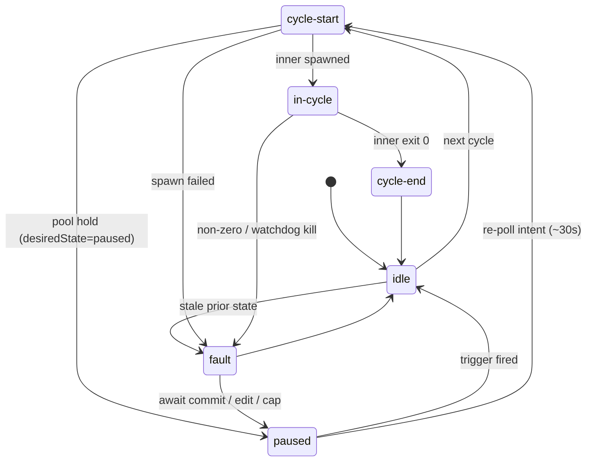
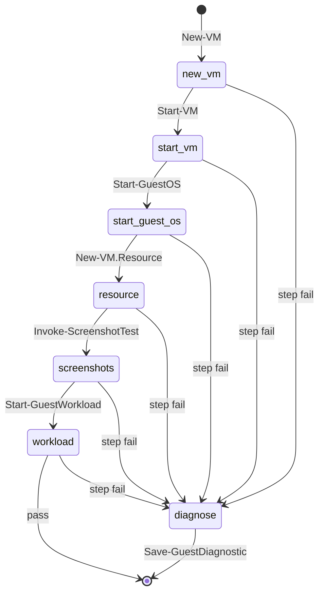

# Lifecycle state

> One sentence: the explicit outer-runner state machine and the per-guest
> step lifecycle it drives.

See [Design overview](00-index.md) · [Yuruna Architecture](../architecture.md).

Derived from `test/modules/Test.RunnerState.psm1` (states + valid
transitions, mirrored in [runner-state.md](../runner-state.md)), the base
step plan in `test/modules/Test.RunnerInnerLoop.psm1`, and the kill side
in `test/modules/Test.RunnerWatchdog.psm1`.

## Outer runner — six states

State `runner.state.json` is written atomically on every transition and
each emits a `runner_state_transition` NDJSON event. The validator never
rejects an unknown pair — it warns and writes anyway (catch drift loudly,
never lose telemetry).

## Per-guest step lifecycle (within `in-cycle`)

Each step touches `runner.stepHeartbeat`; the out-of-process watchdog
reads its mtime, re-verifies the inner PID's identity, and kills a
runspace wedged longer than `stepTimeoutMinutes` (the inner process tree,
never the VM), forcing the `in_cycle --> fault` transition above. The
outer then attributes the kill and synthesizes `last_failure.json` with
`failureClass=wait_timeout`, `reason=watchdog_kill` so failure-pause and
auto-remediation can classify it.

---

LICENSEURI https://yuruna.link/license

Copyright (c) 2019-2026 by Alisson Sol et al.

Last review: 2026.07.17
