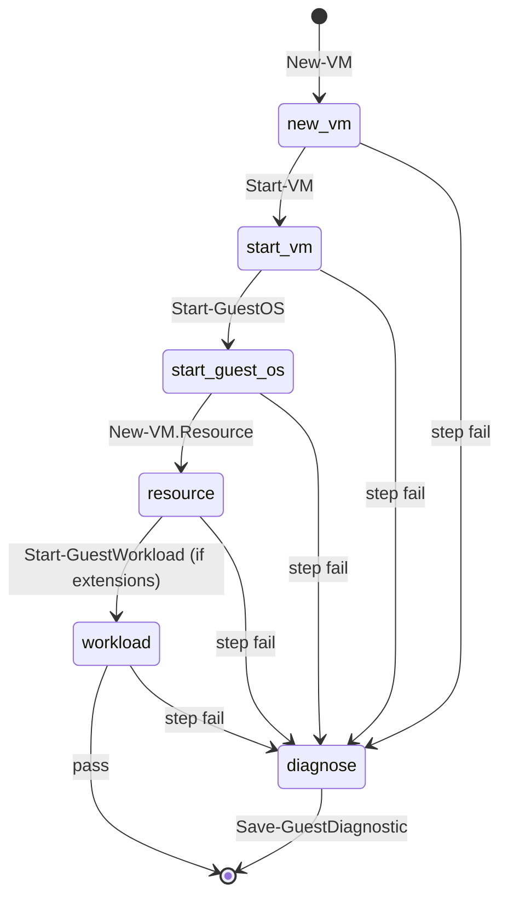

# Lifecycle state

> One sentence: the explicit outer-runner state machine and the per-guest
> step lifecycle it drives.

See [Design overview](00-index.md) · [Yuruna Architecture](../architecture.md).

Derived from `test/modules/Test.RunnerState.psm1` (states + valid
transitions, mirrored in [runner-state.md](../runner-state.md)) and the
base step plan in `test/modules/Test.RunnerInnerLoop.psm1`.

## Outer runner — six states

```mermaid
stateDiagram-v2
    [*] --> idle
    idle --> cycle-start : next cycle
    idle --> fault : stale prior state
    cycle-start --> in-cycle : inner spawned
    cycle-start --> fault : spawn failed
    in-cycle --> cycle-end : inner exit 0
    in-cycle --> fault : non-zero / watchdog kill
    cycle-end --> idle
    fault --> paused : await commit / edit / cap
    fault --> idle
    paused --> idle : trigger fired
```

State `runner.state.json` is written atomically on every transition and
each emits a `runner_state_transition` NDJSON event. The validator never
rejects an unknown pair — it warns and writes anyway (catch drift loudly,
never lose telemetry).

## Per-guest step lifecycle (within `in-cycle`)



Each step touches `runner.stepHeartbeat`; the out-of-process watchdog
reads its mtime and kills a runspace wedged longer than
`stepTimeoutMinutes`, forcing the `in_cycle --> fault` transition above.

---

Copyright (c) 2019-2026 by Alisson Sol et al.

Last review: 2026.06.19
