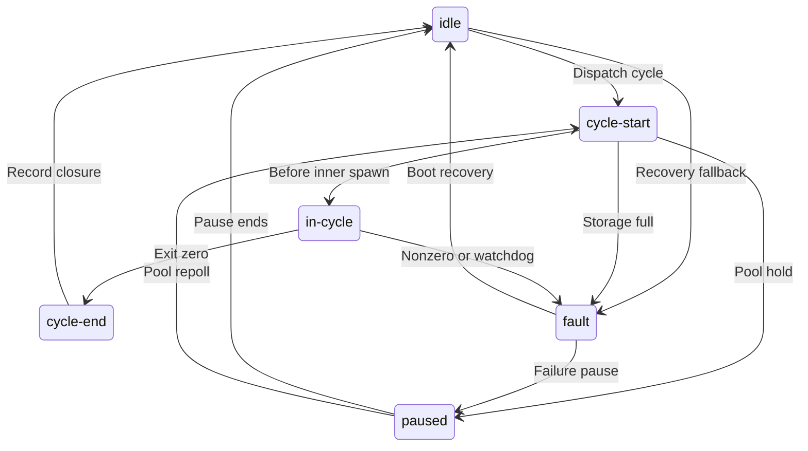
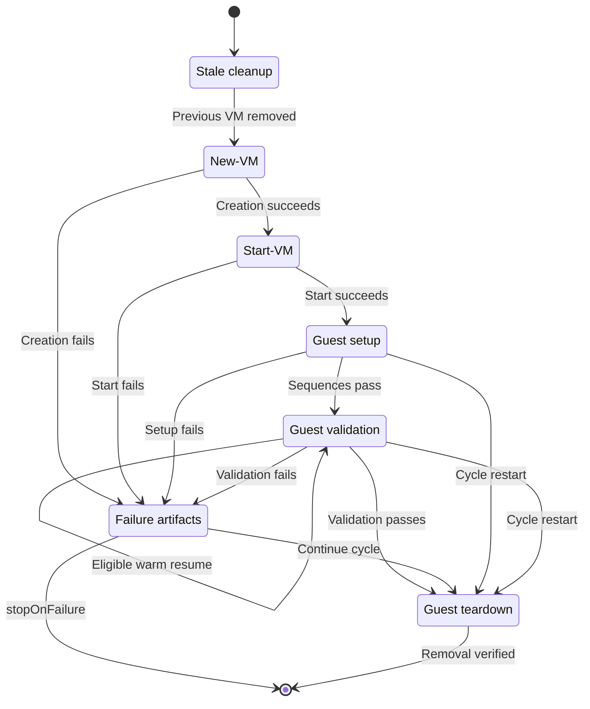

# Runner and VM lifecycle

Show the persisted outer-runner states and the actual provision, failure, restart, and cleanup paths within one guest iteration.

## Persisted runner states

[Test.RunnerState.psm1](../../test/modules/Test.RunnerState.psm1) defines six values in `runner.state.json`; [Test.RunnerOuterLoop.psm1](../../test/modules/Test.RunnerOuterLoop.psm1) writes them. State identifiers use underscores only because Mermaid state aliases do not accept the source names' hyphens.

```mermaid
stateDiagram-v2
    state "idle" as idle
    state "cycle-start" as cycle_start
    state "in-cycle" as in_cycle
    state "cycle-end" as cycle_end
    state "fault" as fault
    state "paused" as paused
    idle --> cycle_start: Dispatch cycle
    idle --> fault: Recovery fallback
    cycle_start --> in_cycle: Before inner spawn
    cycle_start --> fault: Storage full
    cycle_start --> paused: Pool hold
    in_cycle --> cycle_end: Exit zero
    in_cycle --> fault: Nonzero or watchdog
    cycle_end --> idle: Record closure
    fault --> paused: Failure pause
    fault --> idle: Boot recovery
    paused --> idle: Pause ends
    paused --> cycle_start: Pool repoll
```

The diagram is the module's declared adjacency. The validator warns on an unknown pair but still persists any known target, so transition drift remains observable. On startup, a non-idle state from an earlier run produces synthetic `<prior> -> fault -> idle` events before fresh `idle` state is written. Current early-return paths can expose that guard: a pull error may be followed by `cycle-start -> cycle-start`, a spawn failure by `in-cycle -> cycle-start`, and the pre-spawn storage-full path by `fault -> fault` before failure pause.

The runtime order is more specific than the state labels suggest:

1. The outer writes `cycle-start`, pulls the framework, synchronizes pool intent, clears stale guard files, and performs the optional move-mode space gate.
2. It arms [Test.RunnerWatchdog.psm1](../../test/modules/Test.RunnerWatchdog.psm1), writes `in-cycle`, then invokes a fresh inner process.
3. It always stops the watchdog in `finally`. Cycle-end storage, push, and notifier hooks run while persisted state is still `in-cycle`.
4. Only after those hooks return does exit zero produce `cycle-end -> idle`. A nonzero exit, watchdog kill, or move-mode storage-full verdict produces `fault -> paused`.

Pool `desiredState=paused` follows `cycle-start -> paused -> cycle-start` while intent is repolled. `desiredState=drain` stops the outer at a cycle boundary and has no seventh persisted state. Pull, spawn, and pre-outcome aborts use short interruptible holds rather than new state values. Failure pause ends after a framework or project commit, a local configuration edit, a UI restart request, the time cap, or an allowed capped auto-remediation retry; it then writes `idle` before redispatch.

## Guest iteration

[Invoke-GuestProvisionIteration](../../test/modules/Test.RunnerInnerLoop.psm1) executes guests sequentially. These seven groups retain the source ordering: `Start-GuestOS` precedes `Wait-VMRunning`, screenshot checks, and `Start-GuestWorkload`, which are grouped as validation.

```mermaid
stateDiagram-v2
    state "Stale cleanup" as stale_cleanup
    state "New-VM" as new_vm
    state "Start-VM" as start_vm
    state "Guest setup" as guest_setup
    state "Guest validation" as guest_validation
    state "Failure artifacts" as failure_artifacts
    state "Guest teardown" as guest_teardown
    [*] --> stale_cleanup
    stale_cleanup --> new_vm: Previous VM removed
    new_vm --> start_vm: Creation succeeds
    start_vm --> guest_setup: Start succeeds
    guest_setup --> guest_validation: Sequences pass
    guest_validation --> guest_validation: Eligible warm resume
    guest_validation --> guest_teardown: Validation passes
    new_vm --> failure_artifacts: Creation fails
    start_vm --> failure_artifacts: Start fails
    guest_setup --> failure_artifacts: Setup fails
    guest_validation --> failure_artifacts: Validation fails
    failure_artifacts --> [*]: stopOnFailure
    failure_artifacts --> guest_teardown: Continue cycle
    guest_setup --> guest_teardown: Cycle restart
    guest_validation --> guest_teardown: Cycle restart
    guest_teardown --> [*]: Removal verified
```

Sources: [Test.RunnerInnerLoop.psm1](../../test/modules/Test.RunnerInnerLoop.psm1), [Test.Start-GuestOS.psm1](../../test/modules/Test.Start-GuestOS.psm1), [Test.Start-GuestWorkload.psm1](../../test/modules/Test.Start-GuestWorkload.psm1), [Test.WarmResume.psm1](../../test/modules/Test.WarmResume.psm1), and [Yuruna.Host.Contract.psm1](../../host/Yuruna.Host.Contract.psm1).

Every ordinary step failure copies available artifacts before branching. With `stopOnFailure=false`, cleanup stops and removes any partial or complete VM and the sweep continues. With `stopOnFailure=true`, the sweep ends at the failure-artifact state; depending on where failure occurred, there may be no VM, a partial definition, an off VM, or a running VM left for investigation. Warm resume is default-enabled but configurable and applies only to eligible workload failures on the same live VM; unsafe replay without a usable restore boundary is refused.

Successful teardown deletes the screenshot ring, requests guest DHCP release, force-stops and removes the VM, verifies that it is no longer running, and retries removal once. A VM still running after that retry fails the cycle and blocks the next guest. An operator `control.cycle-restart` exception performs best-effort cleanup of the active VM, seals the cycle as aborted, and returns control for a fresh outer dispatch. An unhandled inner exception also attempts emergency cleanup.

## Watchdog termination

The watchdog polls `runner.stepHeartbeat` independently, using the tighter preamble limit while `runner.phase` exists and the normal step limit after it clears. Before acting, it proves the target with both PID and process start time. A stale heartbeat causes a forced inner-process-tree kill, so no inner `finally` or guest teardown is assumed to run.

When control returns, the outer records the nonzero outcome, may synthesize `last_failure.json` with `failureClass=wait_timeout` when the killed inner could not write one, re-ensures the status service, and enters failure pause. If the watchdog cannot prove the inner identity or its job fails, it records a lapse and lets the cycle continue unguarded; that lapse alone does not create a runner state transition.

[Test.SequenceEngine.psm1](../../test/modules/Test.SequenceEngine.psm1) checks `control.step-pause` at sequence and step boundaries. The inner loop checks `control.cycle-pause` at cycle boundaries. These control files, `control.cycle-restart`, pool `drain`, and watchdog lapse markers are operational signals rather than persisted runner states.

---

Back to [Architecture](../architecture.md) · [Design overview](README.md)
