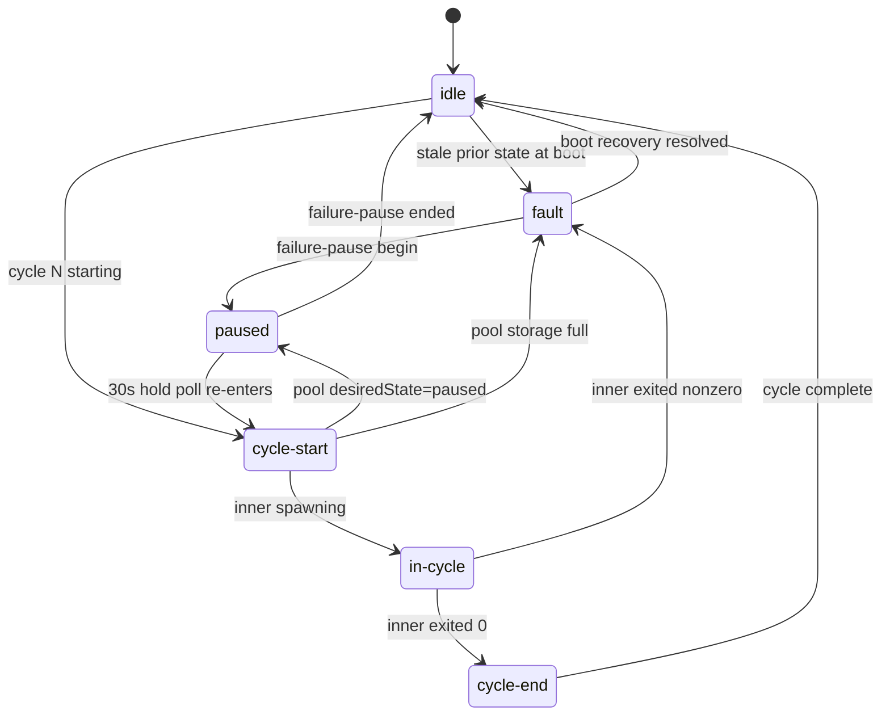
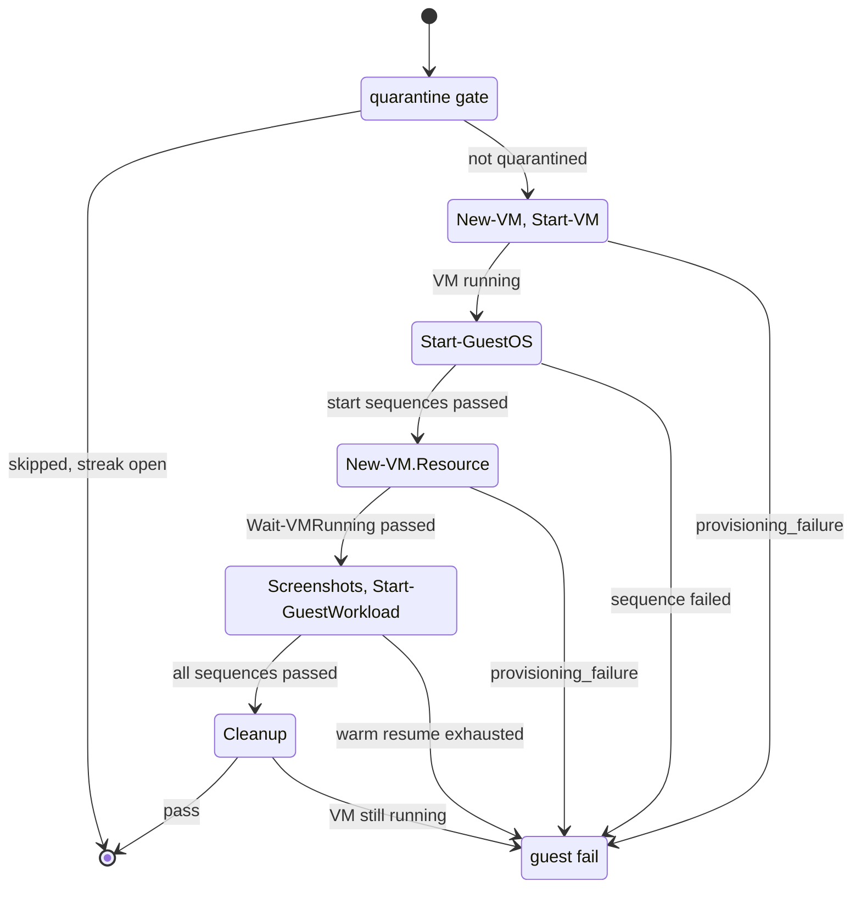
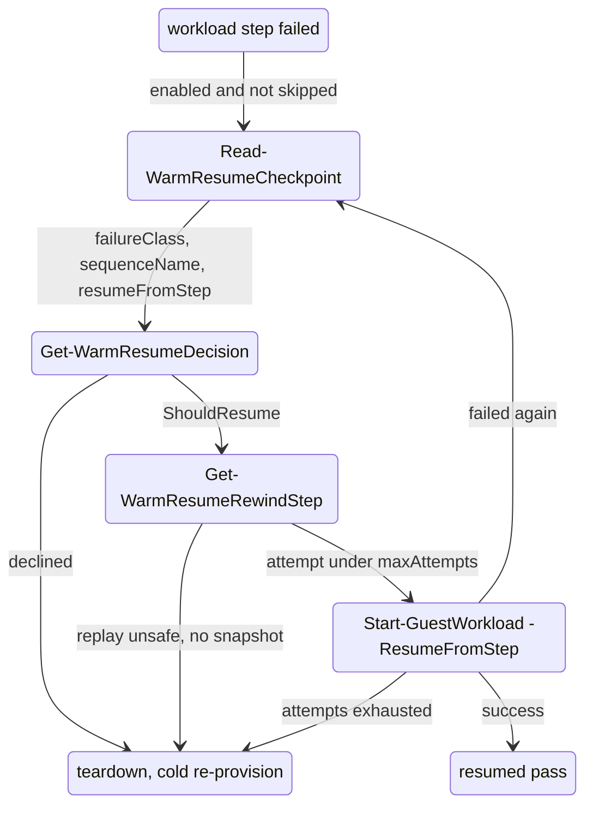

# Lifecycle state

> One sentence: the named states the runner moves through, and what one guest does inside a single cycle.

See [Design overview](00-index.md) - [Data flows](03-data-flows.md) -
[Yuruna Architecture](../architecture.md).

Grounded in `test/modules/Test.RunnerState.psm1` (the enum and the validator),
`test/modules/Test.RunnerOuterLoop.psm1` (every product `Set-RunnerState` call
site), `test/modules/Test.RunnerWatchdog.psm1`,
`test/modules/Test.RunnerInnerLoop.psm1` and `test/modules/Test.WarmResume.psm1`.

## Outer runner -- 6 states

`$script:StateEnum` in `test/modules/Test.RunnerState.psm1` declares exactly six
names, and the diagram uses them verbatim:
`idle`, `cycle-start`, `in-cycle`, `cycle-end`, `fault`, `paused`.

```mermaid
stateDiagram-v2
    state "idle" as idle
    state "cycle-start" as cycle_start
    state "in-cycle" as in_cycle
    state "cycle-end" as cycle_end
    state "fault" as fault
    state "paused" as paused

    [*] --> idle
    idle --> fault : stale prior state at boot
    fault --> idle : boot recovery resolved
    idle --> cycle_start : cycle N starting
    cycle_start --> paused : pool desiredState=paused
    cycle_start --> fault : pool storage full
    cycle_start --> in_cycle : inner spawning
    in_cycle --> cycle_end : inner exited 0
    cycle_end --> idle : cycle complete
    in_cycle --> fault : inner exited nonzero
    fault --> paused : failure-pause begin
    paused --> idle : failure-pause ended
    paused --> cycle_start : 30s hold poll re-enters
```

Six boxes, no aggregation -- the enum has exactly six members. `[*]` is the
process-start marker, not a state.

**`idle`.** The resting state. Written fresh by `Initialize-RunnerState` at
outer startup (`Test.RunnerState.psm1`) and again by `Invoke-RunnerOuterLoop`
after every clean cycle. It exits when the next iteration of the outer loop
calls `Invoke-RunnerOuterCycle`, which writes `cycle-start` before it does
anything else.

**`cycle-start`.** The cycle child has begun: the framework git pull, the pool
intent pull, the pre-spawn wipe of `inner.pid` / `runner.stepHeartbeat` /
`runner.phase` / `last_failure.json`, and the pre-spawn pool-storage space check
all run here. Three exits, all in `Invoke-RunnerOuterCycle`: a pulled
`desiredState` of `paused` from `Resolve-YurunaPoolDesiredState`
(`test/modules/Test.PoolSync.psm1`) goes to `paused`; a refusal from
`Test-OuterPoolStorageSpaceReady` goes to `fault`; otherwise the watchdog is
armed and the state becomes `in-cycle` immediately before the call-operator
spawn of the inner.

**`in-cycle`.** The inner runner owns the machine. The outer is blocked in the
call operator (in the cycle child) while the resident parent polls the child
process. Nothing writes state here; the exit is decided by the exit code the
dispatch returns, and both exit writes come from `Invoke-RunnerOuterLoop` in the
resident parent.

**`cycle-end`.** A pure punctuation state, occupied for one statement. It is
written and then immediately followed by `idle` in the same statement pair so a
streaming consumer sees clean closure explicitly rather than inferring it from
the absence of a fault event.

**`fault`.** The cycle produced a verdict of failure -- either a non-zero inner
exit or the storage refusal. The state lands here before the failure-pause loop
runs, so a dashboard shows `fault` the moment the inner exits rather than after
the status-service re-ensure. It exits to `paused` when the pause loop begins.

**`paused`.** Two different holds share this name. The healthy pool hold sits
here while `desiredState=paused`, waiting 30 seconds in
`Wait-OuterInterruptible` and re-entering at `cycle-start` on the next
iteration. The failure pause sits here for up to an hour and exits to `idle`
through the loop's `finally`. Both edges are in the adjacency map precisely so
the healthy hold does not log two drift warnings per poll.

Two mapped edges have no live `Set-RunnerState` call site. `idle -> fault` and
`fault -> idle` are the boot-recovery pair: `Initialize-RunnerState` writes them
directly as two synthetic NDJSON `runner_state_transition` events (reasons
`boot_recovery_detected_stale_state` and `boot_recovery_resolved`) and seeds them
as the first two `history` entries, because the crash they describe is
unobservable after the fact.

The validator never rejects. An unrecognized target name warns and skips the
write; a recognized target on an unmapped edge warns
("recording anyway so the drift is visible") and writes. That is deliberate: a
telemetry channel that drops events to enforce a model is worse than one that
records the model being wrong. The storage-full path exercises this -- the cycle
child writes `fault`, returns exit code 1, and the parent's failure branch writes
`fault` again, so `fault -> fault` logs the drift warning every time.

State lands in `$env:YURUNA_RUNTIME_DIR/runner.state.json`
(`Get-RunnerStatePath`, falling back to `[System.IO.Path]::GetTempPath()` because
`$env:TEMP` is null off Windows), written by `Write-YurunaStateFileJson` in
`test/modules/Test.StateFile.psm1` as a temp file plus an atomic
`[System.IO.File]::Move(..., $true)`. Shape: `current`, `since`, `runId`,
`writerPid`, and a `history` array capped at 20 entries.

### The watchdog path into `fault`

`test/modules/Test.RunnerWatchdog.psm1` runs as a `Start-Job` named
`yurunaWatchdog` -- a separate pwsh process, not a ThreadJob, because the cycle
child is blocked inside the call operator and an in-runspace monitor cannot pump
while that wait is outstanding. `Start-Watchdog` is called just before the inner
spawn; `Stop-Watchdog` runs in a `finally`.

It watches four files in the runtime dir. `runner.stepHeartbeat` is the staleness
signal, touched from the runspace at the top of each step by `Invoke-Sequence`
(`test/modules/Test.SequenceEngine.psm1`) -- deliberately not
`runner.heartbeat`, which a `System.Threading.Timer` on a threadpool thread keeps
ticking through a wedged runspace. `runner.phase` selects the bound and is
re-read every poll, never cached. `inner.pid` is the kill target. Lapses and
kills are appended to `outer.log`, and any lapse also drops the durable
`runner.watchdog.lapsed` sentinel.

Two bounds, both re-read every cycle with `Read-TestConfig -NoCache` so an
operator edit takes effect at the next spawn without a restart, and both
overridable per pool by a `config.testCycle` block:

| Bound | Config key | Default | Resolver |
|---|---|---|---|
| step timeout | `testCycle.stepTimeoutSeconds` | 2700 s | `Get-OuterStepTimeoutSeconds` |
| preamble timeout | `testCycle.preambleTimeoutSeconds` | 600 s | `Get-OuterPreambleTimeoutSeconds` |

Defaults live in `test/Start-TestRunner.ps1` as
`$script:StepTimeoutSecondsDefault` and `$script:PreambleTimeoutSecondsDefault`.
The step timeout accepts `-gt 0`; the preamble timeout accepts `-ge 0`, because
0 is the meaningful opt-out that applies the step bound everywhere. A
non-numeric value warns and keeps the default rather than throwing -- a typo in
a tuning knob must not take the runner down.

Selection inside the job is one line: the preamble bound applies only when it is
both positive and tighter than the step bound, and
`$effectiveThreshold = if ($phase) { $preambleSeconds } else { $thresholdSeconds }`.
An absent or unreadable `runner.phase` always falls to the looser bound, so the
failure direction is never "kill sooner than intended". Poll interval is 30
seconds.

The inner writes six phases in order via `Write-RunnerPhase`
(`test/modules/Test.RunnerHeartbeat.psm1`): `bootstrap`, `host-detect`,
`host-network`, `service-vm-restore`, `caching-proxy-gate`, `status-service`.
`Clear-RunnerPhase` is called exactly once, immediately before
`Invoke-RunnerInnerCycle` in `test/modules/Invoke-TestRunnerInnerLoop.ps1`; it
verifies the delete and retries up to five times with 200 ms backoff, because
the watchdog's own read handle can block it, then refreshes the step heartbeat so
the restored looser bound starts from a fresh mark.

Arming waits up to 180 s for `inner.pid`, then captures identity as the PID plus
its `StartTime` in round-trip UTC over up to three probes. Any failure calls the
lapse reporter and returns, and the cycle runs unguarded rather than the watchdog
guessing at a target.

On expiry the watchdog re-verifies identity, and only if it still matches logs
`step heartbeat stale <n>s` naming the bound (and the preamble phase when one is
present) and kills the whole tree: `taskkill /PID <pid> /T /F` plus a
`Stop-Process -Force` backstop on Windows; on POSIX it builds the descendant set
from `/bin/ps -eo pid=,ppid=` and kills leaves first. Identity confirmed gone
across three spaced probes disarms without killing; a transiently failing probe
neither kills nor disarms, and it keeps polling.

The watchdog writes no runner state of its own. The kill makes the inner exit
non-zero, so the ordinary path applies: `in-cycle -> fault`, then
`fault -> paused`. Back in `Invoke-RunnerOuterCycle`, a non-zero exit whose
`runner.stepHeartbeat` age exceeds the step timeout is attributed to the
watchdog, and -- only when the inner left none -- a synthetic schema-v2
`last_failure.json` is written with `reason = 'watchdog_kill'`,
`failureClass = 'wait_timeout'`, `severity = 'hard'`,
`classificationSource = 'synthetic'` and `synthesizedBy = 'outer-watchdog'`. A
SIGKILL leaves no application-level record, so without this the streak-capped
auto-remediation would have nothing to classify and every hang would escalate
straight to the full hour.

### Cycle outcomes that leave the machine hanging

`Invoke-RunnerOuterCycle` returns `Outcome` from
`completed | pull-error | paused | drain | spawn-failed | storage-full`;
`Invoke-OuterCycleDispatch` adds `shutdown` and `cycle-aborted`. Only
`completed` carries a test verdict. The rest are the shapes where the cycle
either never ran or ran and produced nothing to judge:

| Outcome | What happened | What the loop does |
|---|---|---|
| `pull-error` | the outer's own git pull failed | hold `OuterPullErrorSleepSeconds` (30 s), `continue` |
| `spawn-failed` | `Start-Process` on the cycle child itself failed | hold `InnerSpawnErrorSleepSeconds` (30 s), `continue` |
| `cycle-aborted` | no outcome file, non-zero exit, and the child ran under 30 s | hold 30 s, `continue` |
| `paused` | pool intent says hold | hold 30 s, `continue` |
| `drain` | pool intent says stop at the boundary | set shutdown requested, `break` |
| `shutdown` | Ctrl+C killed the child mid-cycle | the loop condition ends the run |
| `storage-full` | the pre-spawn space check refused | falls to the failure branch, full pause |

The `cycle-aborted` heuristic is the interesting one: `$script:CycleAbortSeconds`
is 30, well under the inner's own 600 s preamble budget, so "died almost
immediately with no outcome file" distinguishes a console that broke under the
child from a real test failure. The child reports through
`runtime/runner.cycle.outcome.json` rather than an exit code precisely because
the exit-code space belongs to the inner and a sentinel value could collide with
a genuine failure.

`storage-full` is deliberately excluded from the transient hold list. Retrying
every 30 seconds would burn the day rediscovering that nobody has deleted
anything yet, so it takes the full pause, which ends early only on the two things
that plausibly change it -- a config edit or a new commit.

### Leaving `paused` -- the break-out triggers

The failure pause sleeps in 5-second slices (with a `Write-Progress` render
wrapped in try/catch, because it throws on tmux and sshd PTYs with no resolvable
TERM), polls every `FailureCommitPollSeconds` (5 min), and gives up after
`FailurePauseMaxSeconds` (60 min). Baselines for the comparisons are captured
once at pause start by `Get-OuterCommitSha`, `Get-OuterProjectUrl` +
`Get-OuterRemoteSha`, and `Get-OuterConfigMtime`.

1. **New framework commit.** `Test-OuterNewCommitsAvailable` against the captured
   baseline SHA.
2. **New project commit.** `Get-OuterRemoteSha` on `repositories.projectUrl`.
   Requires both the current and the baseline SHA to be non-null, so an
   `ls-remote` that fails on the network cannot fire it spuriously.
3. **Local `test.config.yml` edit.** A nullable `-ne` on the mtime, which catches
   changed, created and deleted in one comparison.
4. **Status UI start-cycle.** `runtime/control.cycle-restart` present; the flag is
   consumed on the spot so the next spawn does not re-fire on it.
5. **Gated auto-remediation.** Only while `Get-OuterAutoRemediation` reports
   enabled (`testCycle.autoRemediation.enabled`, default off) and the streak
   counter is under `maxAttemptsPerCycle` (default 2). The class from
   `Get-OuterLastFailureClass` is checked against
   `$script:AutoRemediationAllowList` in `test/modules/Test.Remediation.psm1`
   via `Test-AutoRemediationAllowed`; if that module cannot be loaded the answer
   is no, because an unclassifiable failure is the one that should stop and be
   looked at. On allow it emits `auto_remediation_applied` with
   `action = 'end_failure_pause_early'` and breaks.
6. **Cap elapsed, or Ctrl+C.** The `while` condition itself.

The streak counter lives in `Invoke-RunnerOuterLoop` in the resident parent, not
the per-cycle child -- a fresh process would reset it every cycle and the cap
would never be reached. A passing cycle resets it to zero.

All six leave through the same `finally`, which dismisses the progress bar and
writes `paused -> idle` with reason `failure-pause ended`. From the state
machine's point of view every one of them means the same thing: ready to try
again.

## Per-guest step lifecycle

Owner: `Invoke-GuestProvisionIteration` in `test/modules/Test.RunnerInnerLoop.psm1`,
dispatched from the guest `foreach` in `Invoke-RunnerInnerCycle`. The helper never
uses a bare `break` or `continue` -- absent a loop of its own those would escape
the guest sweep -- so it signals through `$IterState.Control`, which is
`proceed`, `continue` or `break`.

```mermaid
stateDiagram-v2
    state "quarantine gate" as quarantine
    state "New-VM, Start-VM" as provision
    state "Start-GuestOS" as guestos
    state "New-VM.Resource" as vmresource
    state "Screenshots, Start-GuestWorkload" as workload
    state "Cleanup" as cleanup
    state "guest fail" as failed

    [*] --> quarantine
    quarantine --> [*] : skipped, streak open
    quarantine --> provision : not quarantined
    provision --> guestos : VM running
    provision --> failed : provisioning_failure
    guestos --> vmresource : start sequences passed
    guestos --> failed : sequence failed
    vmresource --> workload : Wait-VMRunning passed
    vmresource --> failed : provisioning_failure
    workload --> cleanup : all sequences passed
    workload --> failed : warm resume exhausted
    cleanup --> [*] : pass
    cleanup --> failed : VM still running
```

Seven boxes. Two are aggregates: `New-VM, Start-VM` folds the two provisioning
steps (`New-VM` through the Yuruna.Host driver, then `Start-VM` followed by
`Update-GuestNeighborCache` and `Wait-VMIp -TimeoutSeconds 30`), and
`Screenshots, Start-GuestWorkload` folds the optional screenshot step
(`Invoke-ScreenshotTest`, present only when the guest declares screenshots) with
the workload step. `[*]` is the guest-loop entry and exit, not a state.

The step names in the diagram are the literal `-StepName` values passed to
`Set-StepStatus`, which is what the dashboard and the failure record carry.

**quarantine gate.** `Invoke-GuestQuarantineGate`
(`test/modules/Test.GuestQuarantine.psm1`), consulted only when
`testCycle.guestQuarantine.enabled` is on (code default true, shipped false). A
skip sets the guest status to `skipped`, marks it quarantined on the dashboard,
and continues to the next guest. Before the gate runs, the iteration also checks
whether shutdown was requested (`Control = 'break'`) and whether this guest key
already failed this cycle (`Control = 'continue'`).

**`New-VM` / `Start-VM`.** `New-VM` cascades `Username`, `Hostname`,
`MemoryStartupBytes` and `Cores` from the plan and forwards the runner-detected
caching-proxy URL. `Start-VM` refreshes the neighbor cache and waits briefly for
an address, printing either the IP or `(pending)`. Both classify a failure as
`provisioning_failure`.

**`Start-GuestOS`.** `test/modules/Test.Start-GuestOS.psm1` runs the merged
`startSequences` through `Invoke-GuestSequenceList -PhaseLabel 'Start'` with the
cascade variable map. This step supports a `skipped` result.

**`New-VM.Resource`.** `Wait-VMRunning` with the configured VM start timeout and
boot delay. Also `provisioning_failure`.

**`Screenshots` / `Start-GuestWorkload`.**
`test/modules/Test.Start-GuestWorkload.psm1` runs the workload sequences through
`Invoke-GuestSequenceList -PhaseLabel 'Workload'`. On a failure the runner first
reclassifies host-network faults, then enters the warm-resume loop below, and
only the final result reaches the fail branch.

**`Cleanup`.** On a pass: delete the per-VM pre-OCR screen ring, ask for the DHCP
lease back with `Invoke-GuestDhcpRelease` while there is still a guest to ask
(the force-stop that follows is invisible to the guest's own shutdown unit), then
`Stop-VM -Force`, `Remove-VM`, and verify with `Get-VMState` plus one retry.
`Remove-VM`'s own return cannot answer this -- its status output folds into the
bool cast -- so the state is probed directly. A VM still `running` after the
retry is a `Cleanup` failure with class `provisioning_failure` and
`Control = 'break'`, because the next guest must not cold-start onto a host still
carrying this one.

Cross-cutting on every step: `Assert-CachingProxyServiceStillReachable` before it,
`Set-StepStatus` to `running` before and `pass`/`fail`/`skipped` after, and
`Sync-RunnerStepConfig` after, which re-reads `StopOnFailure`,
`VmStartTimeoutSeconds` and `VmBootDelaySeconds` from disk so a mid-cycle edit is
picked up.

Every failure edge does the same work before it branches: `Set-StepStatus` to
`fail`, `Set-GuestStatus` to `fail`, populate the four `$IterState` failure
fields, and `Copy-FailureArtifactsToStatusLog` -- placed before the branch so
both paths get the debug folder. Then `StopOnFailure` decides:
`Control = 'break'` leaves the VM running for investigation on `Start-GuestOS`,
`New-VM.Resource`, `Screenshots` and `Start-GuestWorkload`, but tears it down on
`New-VM` and `Start-VM` to free the memory reservation; otherwise
`Remove-GuestVMQuietly` runs and `Control = 'continue'`.

## Warm resume

The in-place retry, decided by `test/modules/Test.WarmResume.psm1`, driven by the
loop in `Test.RunnerInnerLoop.psm1`, and executed by
`Invoke-Sequence -StartStep`. It exists so an eligible transient failure re-runs
the failed sequence from its last good step on the same still-alive VM instead of
redoing the whole install from a cold provision.

```mermaid
stateDiagram-v2
    state "workload step failed" as wl_failed
    state "Read-WarmResumeCheckpoint" as checkpoint
    state "Get-WarmResumeDecision" as decision
    state "Get-WarmResumeRewindStep" as rewind
    state "Start-GuestWorkload -ResumeFromStep" as attempt
    state "resumed pass" as resumed
    state "teardown, cold re-provision" as cold

    wl_failed --> checkpoint : enabled and not skipped
    checkpoint --> decision : failureClass, sequenceName, resumeFromStep
    decision --> cold : declined
    decision --> rewind : ShouldResume
    rewind --> cold : replay unsafe, no snapshot
    rewind --> attempt : attempt under maxAttempts
    attempt --> resumed : success
    attempt --> checkpoint : failed again
    attempt --> cold : attempts exhausted
```

Seven boxes, no aggregation.

**Eligible classes.** `$script:WarmResumeEligibleClass` holds exactly six:
`network_timeout`, `wait_timeout`, `instrumentation_failure`, `host_io_blocked`,
`ip_not_discovered`, `payload_unavailable`. The predicate is
`Test-WarmResumeEligibleClass`. The last two earn their place on the same
ground: a step that never resolved an address, or never received a payload,
never reached the guest, so nothing it might have done is in question and
replaying it is as sound as replaying a timeout. Hard and deterministic classes
-- `script_error`, `provisioning_failure`, `pattern_matched_failure` -- are never
resumed.

**Checkpoint.** `Read-WarmResumeCheckpoint -LogDir ... -NotBeforeUtc $wlStartUtc`
reads `$env:YURUNA_LOG_DIR/last_failure.json` and pulls `failureClass`,
`sequenceName` and `repro.resumeFromStep`. The `NotBeforeUtc` staleness guard (2
second clock tolerance) is what stops a prior phase's record from triggering a
resume; a missing, stale or unparseable file yields `ResumeFromStep = 0`, which
the decision treats as "do not resume".

**Attempt counter.** `testCycle.warmResume.enabled` (code default true) and
`testCycle.warmResume.maxAttempts` (code default 2) surface as
`$cfg.WarmResumeEnabled` and `$cfg.WarmResumeMaxAttempts` through
`Get-RunnerReloadableConfig`. Shipped `test/test.config.yml` sets
`enabled: true`, `maxAttempts: 2`. The loop condition is
`while (-not $wrDone -and $wrAttempt -lt [int]$cfg.WarmResumeMaxAttempts)`, and
each iteration re-reads the checkpoint, so a second failure at a different step
resumes from the new one.

**Decline reasons.** `Get-WarmResumeDecision` returns `ShouldResume`, `Reason`
and `ResumeSequence`, declining with `disabled`,
`class-not-eligible (<class>)`, `no-resume-step`, `no-sequence-name`, or
`sequence-not-in-workload (<name>)`. Sequence matching is exact or by base name
with a `.yml`/`.yaml` suffix stripped.

**Rewind.** The checkpoint names the step that *failed*, and its work may be
half-applied -- transient says why it stopped, not how far it got. So
`Get-WarmResumeStepAction` reads the resolved sequence's 1-based action list and
`Get-WarmResumeRewindStep` scans backwards for the nearest `loadDiskSnapshot`
boundary, resuming there and replaying the intervening steps against restored
state. With no boundary at or before the checkpoint,
`Test-WarmResumeReplayIsSafe` decides: if the checkpoint step runs guest work,
the resume is declined with a warning naming the missing `loadDiskSnapshot`,
leaving the original result -- and the real failure with it -- untouched.
Replaying there would land on the residue the failed attempt already created and
report that instead of the transient.

**Observability.** `New-WarmResumeEvent` emits a `warm_resume` NDJSON record
carrying `checkpointStep` whenever it differs from the step actually resumed, so
a rewind is visible rather than inferred.

**Fallback.** Exhausted attempts, or any decline, leaves the original result in
place. That flows into the normal `Start-GuestWorkload` fail branch, teardown,
and a cold re-provision on the next cycle. The teardown firing only on the final
result is exactly what keeps the VM alive across attempts.

## What is deliberately not drawn

**The notification latch.** Armed -> N failures -> Fired -> M successes ->
Armed, with counters persisted in `runtime/runner.gating.json`. It is a state
machine, but it is a property of the *alerting* channel rather than of the
runner, and it advances at cycle granularity -- one transition per cycle, driven
entirely by the pass/fail the diagrams above already produce. Drawing it here
would duplicate the outcome edges with different labels.

**The guest quarantine circuit breaker.** `none` / `skip` / `release` from
`Get-GuestQuarantineDecision`, with a per-guest same-class failure streak, a
skip-cycle budget, and release on a framework or project commit change. Its
lifetime spans cycles, so it does not fit either the per-cycle or the per-guest
frame; the per-guest diagram shows only where the gate is consulted.

**The remediation dispatcher's recommendation vocabulary.** Seven values from
`retry_immediately` through `escalate`. `Invoke-Remediation` is advisory -- it
writes `last_remediation.json` and emits an event, and performs nothing -- so it
has no states, only a classification. The one place a recommendation changes
runner behavior is the gated auto-remediation break-out, which is drawn as
trigger 5.

**Boot recovery's own sequence.** `Invoke-YurunaBootRecovery` sweeps stale
pidfiles, a stale `break-active.json`, stale pause flags and orphan `.incomplete`
cycle folders. It runs once, before the state machine is initialized, and is
strictly ordered rather than branching, so it is a data flow rather than a
lifecycle.

**Host and service-VM lifecycles.** The caching-proxy, stash, pool-control and
download-agent VMs each have their own start/health/stop shape driven from
`test/service/`. They live outside the cycle: the runner gates on their
readiness during the preamble but does not own their transitions.
