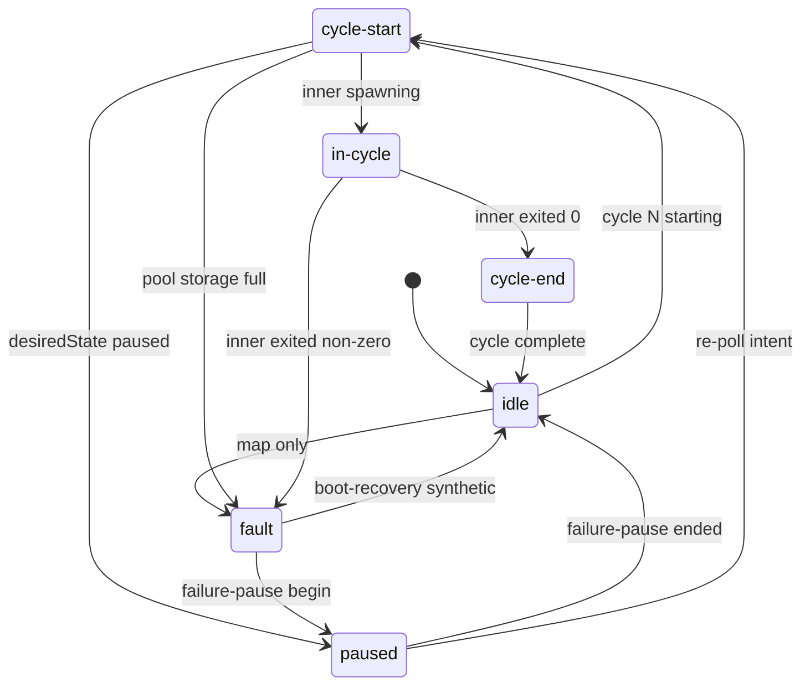
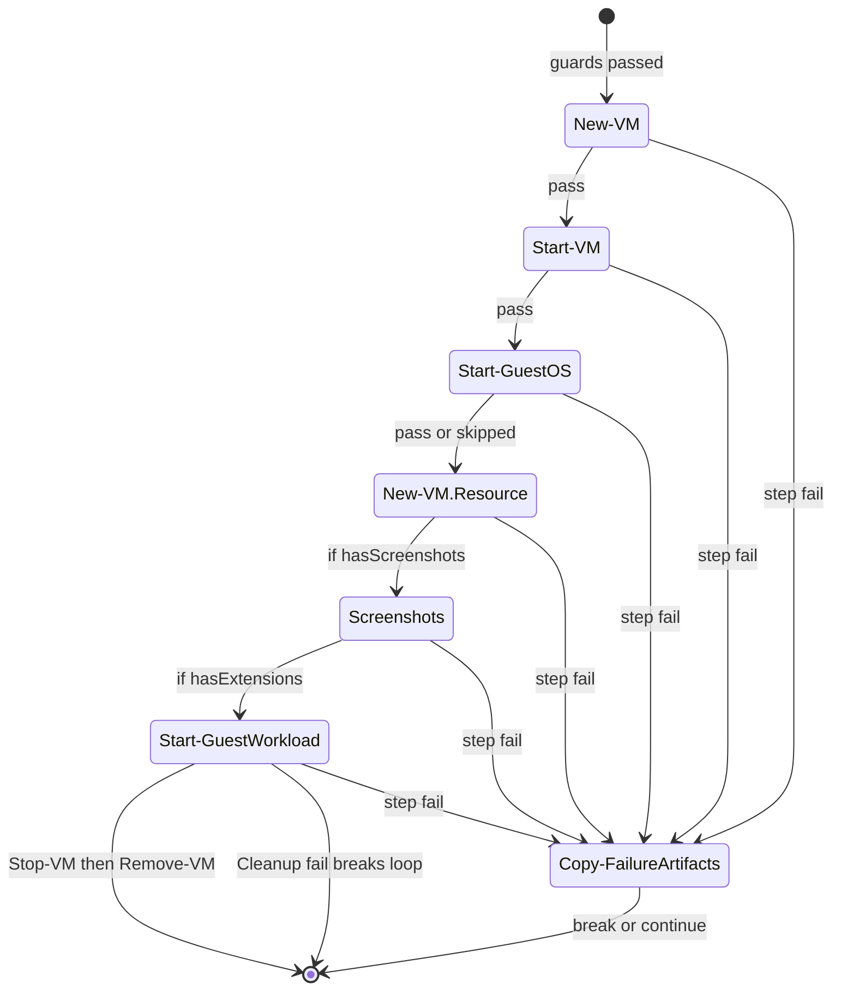
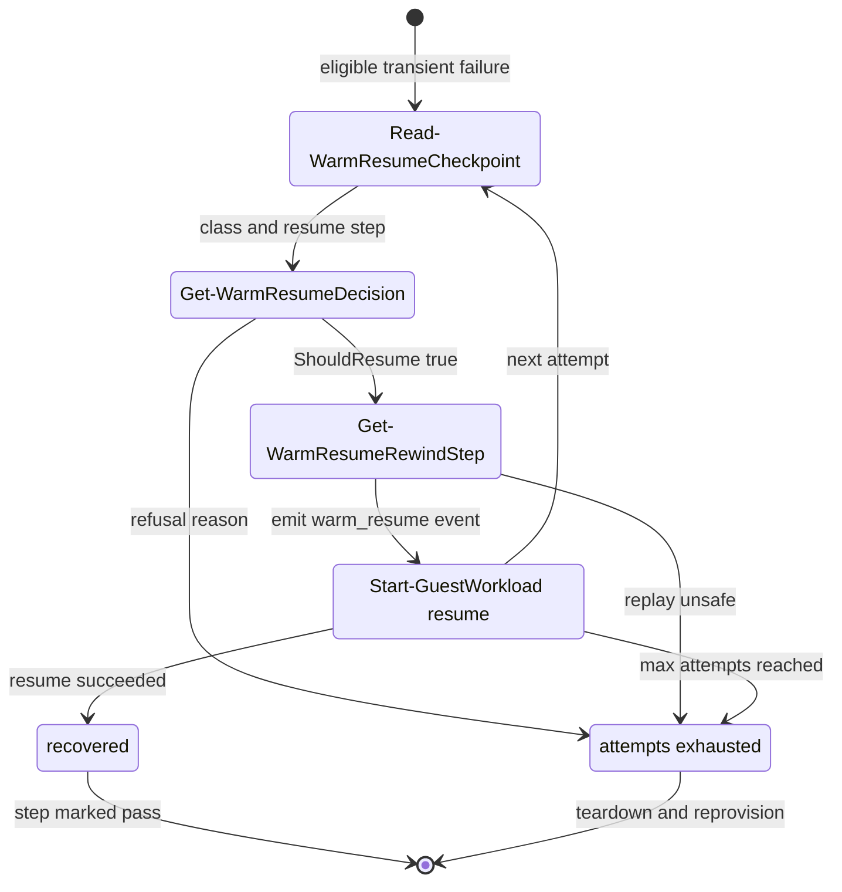

# Lifecycle state

> One sentence: the explicit outer-runner state machine, the per-guest step
> lifecycle it drives, and the warm-resume retry nested inside one of those steps.

See [Design overview](00-index.md) - [Yuruna Architecture](../architecture.md).

Derived from `test/modules/Test.RunnerState.psm1` (`$script:StateEnum` and
`$script:ValidTransition`, mirrored in
[runner-outer-loop.md](../runner-outer-loop.md#runner-state-machine)),
`test/modules/Test.RunnerOuterLoop.psm1` (every transition writer, the cycle
dispatch and the failure-pause loop), `test/modules/Invoke-TestCycleRunner.ps1`,
`test/modules/Test.RunnerInnerLoop.psm1` (`Get-CycleStepNameList` and
`Invoke-GuestProvisionIteration`), `test/modules/Test.WarmResume.psm1`,
`test/modules/Test.RunnerWatchdog.psm1`, and the phase labels in
`test/modules/Invoke-TestRunnerInnerLoop.ps1`.

Three state machines, drawn separately because they nest rather than compose:
the outer machine is the only one persisted to disk, the per-guest one lives
entirely inside a single `in-cycle` span, and warm resume lives inside a single
`Start-GuestWorkload` step.

## Outer runner — six states

```mermaid
stateDiagram-v2
    state "cycle-start" as cycle_start
    state "in-cycle" as in_cycle
    state "cycle-end" as cycle_end
    [*] --> idle
    idle --> cycle_start : cycle N starting
    idle --> fault : map only
    cycle_start --> in_cycle : inner spawning
    cycle_start --> fault : pool storage full
    cycle_start --> paused : desiredState paused
    in_cycle --> cycle_end : inner exited 0
    in_cycle --> fault : inner exited non-zero
    cycle_end --> idle : cycle complete
    fault --> paused : failure-pause begin
    fault --> idle : boot-recovery synthetic
    paused --> idle : failure-pause ended
    paused --> cycle_start : re-poll intent
```

Six boxes, no aggregation: the diagram is exactly
`$script:StateEnum = @('idle', 'cycle-start', 'in-cycle', 'cycle-end', 'fault', 'paused')`
and all twelve edges of `$script:ValidTransition`. The table below has thirteen
rows for those twelve edges: `cycle-start -> fault` is the one edge with two
independent writers, a real pre-spawn refusal and a synthetic boot-recovery
record, and the diagram labels it with the one an operator actually hits.

| From | To | Trigger and literal `-Reason` | Code location |
|---|---|---|---|
| `[*]` | `idle` | Outer startup writes a fresh state file; no reason, direct write | `Test.RunnerState.psm1:232`, written at `:258` |
| `idle` | `cycle-start` | First statement of the cycle, **before** the git pull -- `"cycle $cycle starting"` | `Test.RunnerOuterLoop.psm1:1142` |
| `idle` | `fault` | **In the adjacency map only.** The module's doc comment attributes it to boot recovery, but that path is guarded on `$prior['current'] -ne 'idle'`, so nothing ever emits it | `Test.RunnerState.psm1:86-93` (map), `:208` (the guard) |
| `cycle-start` | `in-cycle` | After `Start-Watchdog` is armed, immediately before the call operator -- `"inner spawning"` | `Test.RunnerOuterLoop.psm1:1354` |
| `cycle-start` | `fault` | The pre-spawn storage refusal: `Test-OuterPoolStorageSpaceReady` projected that this cycle's archive would not fit -- `'pool storage full'`. Guarded on `Get-Command Set-RunnerState`, so an in-process fallback without the module still returns the outcome | `Test.RunnerOuterLoop.psm1:1267` |
| `cycle-start` | `fault` | Also synthetic: a prior runner crashed while `current` was `cycle-start` -- `reason = 'boot_recovery_detected_stale_state'`, `synthetic = $true` | `Test.RunnerState.psm1:222` |
| `cycle-start` | `paused` | `Sync-YurunaPoolIntent` returned `desiredState = paused` -- `"pool desiredState=paused (cycle $cycle)"` | `Test.RunnerOuterLoop.psm1:1202` |
| `in-cycle` | `cycle-end` | Inner exited zero -- `"inner exited 0"` | `Test.RunnerOuterLoop.psm1:1977` |
| `in-cycle` | `fault` | Inner exited non-zero, including every watchdog kill -- `"inner exited $exitCode"` | `Test.RunnerOuterLoop.psm1:1991` |
| `cycle-end` | `idle` | Emitted immediately after the `cycle-end` write -- `"cycle complete"` | `Test.RunnerOuterLoop.psm1:1978` |
| `fault` | `paused` | Start of the failure-pause loop -- `"failure-pause begin"` | `Test.RunnerOuterLoop.psm1:2055` |
| `fault` | `idle` | Synthetic only: the recovery half of the boot-recovery pair -- `reason = 'boot_recovery_resolved'` | `Test.RunnerState.psm1:253` |
| `paused` | `idle` | The failure-pause `finally`, on **every** exit path -- `"failure-pause ended"` | `Test.RunnerOuterLoop.psm1:2180` |
| `paused` | `cycle-start` | Next loop iteration after the pool hold re-enters the cycle -- `"cycle $cycle starting"` | `Test.RunnerOuterLoop.psm1:1142` |

`runner.state.json` is written atomically on every transition
(`Write-YurunaStateFileJson`) and each one also emits a
`runner_state_transition` NDJSON event through `Send-CycleEventSafely`. The
in-file transition log is capped at `$script:HistoryDepth = 20`; that trailing
slice is a "what just happened" cache for `/control/runner-status`, and the
NDJSON stream is the canonical history.

**Two processes write this machine.** `cycle-start`, the pool-hold `paused`, the
storage-refusal `fault` and `in-cycle` are written by the per-cycle child
(`Invoke-TestCycleRunner.ps1` -> `Invoke-RunnerOuterCycle`, lines 1091-1706);
`cycle-end`, `idle`, the inner-exit `fault` and the
failure-pause `paused`/`idle` pair are written by the long-lived parent's
`Invoke-RunnerOuterLoop` (line 1870 onward). Because the run id is per-process,
`runner.state.json`'s `runId` and `writerPid` alternate between two PIDs within a
single run -- the cycle runner deliberately skips `Initialize-RunnerState` so this
never trips the stale-runId crash synthesis.

**The `paused --> cycle_start` edge is in the map for a reason.** The healthy
pool-hold loop enters each iteration at `cycle-start` (set before the intent
pull) and, on a pulled `desiredState=paused`, moves to `paused`, then re-enters
`cycle-start` on the next 30-second poll. Both edges are legitimate; without them
every hold iteration would log two adjacency warnings and flood the outer log for
the duration of the hold.

### Cycle outcomes that leave the machine hanging

`Invoke-OuterCycleDispatch` returns one of eight outcomes, and only three of them
reach a terminal transition. Four `continue` after a bounded hold, leaving
`current` where the child left it, and `drain` breaks the loop outright -- so the
*next* cycle's `cycle-start` write is a pair the adjacency map does not list, and
`Set-RunnerState` logs one drift warning and records it anyway.

| Outcome | State left behind | Next transition attempted | On the map? | Code location |
|---|---|---|---|---|
| `completed` | `in-cycle` | `cycle-end` or `fault` | yes | `Test.RunnerOuterLoop.psm1:1705` |
| `pull-error` | `cycle-start` | `cycle-start` | **no** -- warns | `:1156` |
| `drain` | `cycle-start` | none; loop breaks, shutdown requested | -- | `:1194` |
| `paused` | `paused` | `cycle-start` | yes | `:1209` |
| `storage-full` | `fault` | `paused` -- the full failure pause | yes | `:1271` |
| `spawn-failed` | `in-cycle` when the call operator threw inside the child; unchanged when `Start-Process` itself failed | `cycle-start` | **no** in the first case | `:1409`, `:1821` |
| `cycle-aborted` | `cycle-start` or `in-cycle` | `cycle-start` | **no** -- warns | `:1865` |
| `shutdown` | whatever it was | `cycle-end` then `idle` | depends | `:1829` |

`cycle-aborted` is the child dying in under `$script:CycleAbortSeconds = 30`
(`:705`) with no `runner.cycle.outcome.json`: the cycle never ran, so it is
reported as its own thing rather than folded into a test verdict. `shutdown` is
the one surprise -- it carries `ExitCode = 0`, so the zero-exit branch still writes
`cycle-end -> idle` on the way out even though the child tree was killed.

`storage-full` is the only outcome that both writes a state **and** carries
`ExitCode = 1`, so it routes through two processes: the child sets `fault` before
returning, and the parent's non-zero branch then enters the failure pause. It is
deliberately excluded from the short-hold list the other four transient outcomes
share (`:1941-1956`) -- a full share does not clear in thirty seconds, and holding
for the full pause is the point. The pre-spawn check runs *after* the
`last_failure.json` wipe so the pause classifies on `pool_storage_full` rather
than on the previous cycle's record, which a host with auto-remediation on would
have used to cut the pause short and re-enter the same wall minutes later.

**The validator has two rejection cases, not one.** A target state outside the
canonical enum is refused outright -- one warning
(`"...is not in the canonical state enum...; refusing the write."`), `$null`
returned, nothing written and no event emitted. A pair whose states are both in
the enum but which is absent from the adjacency map warns
(`"...is not in the canonical adjacency map; recording anyway so the drift is visible."`),
then writes and emits normally, so drift is loud but never lost. The enum is
duplicated as `$script:RunnerStateEnum` in `test/modules/Test.EventSchema.psm1`,
whose own policy is never to reject a record: an out-of-enum
`runnerState`/`fromState`/`toState` warns, emits a sibling `schema_violation`
event, and the original is still written. Adding a state means editing both files.

### The watchdog path into `fault`

`Start-Watchdog` (`Test.RunnerWatchdog.psm1`) is armed *before* the spawn and torn
down in a `finally`; it is a `Start-Job` child because an in-runspace monitor
cannot pump while the outer is blocked on the call operator. It is not a state of
the machine above -- it is the mechanism that forces `in-cycle -> fault`.

| Stage | Behavior | Code location |
|---|---|---|
| Arm | Poll every 2 s for up to **180 s** for `runtime/inner.pid`; absent -> write `runtime/runner.watchdog.lapsed` and return | `Test.RunnerWatchdog.psm1:172-177` |
| Arm | Capture PID **+ `StartTime` identity**, retried 3x at 2 s; still null -> lapse. Arm line logged at `:214` | `:180-198` |
| Bound | `runtime/runner.phase` PRESENT -> `$preambleSeconds` (default 600); ABSENT -> `$thresholdSeconds` (default 2700). Re-read every poll, never cached | `:132`, `:239` |
| Kill | `$age > $effectiveThreshold` and identity re-verified -> kill the whole tree: `taskkill /PID N /T /F` plus a `Stop-Process` backstop on Windows; on POSIX a ppid map from `/bin/ps -eo pid=,ppid=`, BFS, then `Stop-Process` **leaves-first** | `:254-298` |
| Disarm | `$sameInnerConfirmedGone` -- identity gone across 3 spaced probes, negative-only, a single positive short-circuits. Checked each poll and again instead of a kill | `:206` (predicate), `:220`, `:300` |
| Attribute | Outer sees non-zero exit **and** `runner.stepHeartbeat` older than `stepTimeoutSeconds` -> warns "watchdog likely killed the inner" | `Test.RunnerOuterLoop.psm1:1647` |
| Attribute | Synthesizes `last_failure.json` only when the inner left none: `reason='watchdog_kill'`, `failureClass='wait_timeout'`, `classificationSource='synthetic'`, `synthesizedBy='outer-watchdog'` | `:1655-1690` |
| Restart | `in-cycle -> fault`, then `fault -> paused`; the next cycle re-spawns | `:1991`, `:2055` |

The six preamble labels, in order, are `'bootstrap'`, `'host-detect'`,
`'host-network'`, `'service-vm-restore'`, `'caching-proxy-gate'`,
`'status-service'`, then `Clear-RunnerPhase` immediately before
`Invoke-RunnerInnerCycle`
(`Invoke-TestRunnerInnerLoop.ps1:293, 367, 439, 684, 758, 931, 974`). The
synthetic `wait_timeout` class is what lets the streak-capped auto-remediation
break the failure pause early instead of waiting the full human pause.

### Leaving `paused` — five break-out triggers

The failure-pause loop sleeps in 5-second slices to a
`FailurePauseMaxSeconds` deadline and re-polls every `FailureCommitPollSeconds`.
Any of five conditions ends it early; all of them land on the same
`paused -> idle` write in the `finally`.

| # | Trigger | Probe | Code location |
|---|---|---|---|
| 1 | Framework commit | `Test-OuterNewCommitsAvailable` -- bounded `git fetch` + `rev-parse @{u}` **plus** `rev-list --count HEAD..@{u} > 0` | `Test.RunnerOuterLoop.psm1:2084` |
| 2 | Project commit | `Get-OuterRemoteSha` differs from the baseline, both non-null | `:2096` |
| 3 | Local config edit | `Get-OuterConfigMtime` differs from the baseline | `:2108` |
| 4 | Status-UI request | `runtime/control.cycle-restart` exists; **consumed here** | `:2123` |
| 5 | Gated auto-remediation | `testCycle.autoRemediation.enabled` (default **off**) and `$remediationAutoSkips < MaxAttempts` and `Get-OuterLastFailureClass` in `wait_timeout`, `instrumentation_failure`, `network_timeout`, `host_io_blocked` | `:2146-2163` |

`$remediationAutoSkips` is the one piece of cross-cycle state the outer holds
that the per-cycle child cannot; it resets to zero on a passing cycle.

## Per-guest step lifecycle (within `in-cycle`)

```mermaid
stateDiagram-v2
    state "New-VM" as new_vm
    state "Start-VM" as start_vm
    state "Start-GuestOS" as start_guest_os
    state "New-VM.Resource" as resource
    state "Screenshots" as screenshots
    state "Start-GuestWorkload" as workload
    state "Copy-FailureArtifacts" as diagnose
    [*] --> new_vm : guards passed
    new_vm --> start_vm : pass
    start_vm --> start_guest_os : pass
    start_guest_os --> resource : pass or skipped
    resource --> screenshots : if hasScreenshots
    screenshots --> workload : if hasExtensions
    workload --> [*] : Stop-VM then Remove-VM
    workload --> [*] : Cleanup fail breaks loop
    new_vm --> diagnose : step fail
    start_vm --> diagnose : step fail
    start_guest_os --> diagnose : step fail
    resource --> diagnose : step fail
    screenshots --> diagnose : step fail
    workload --> diagnose : step fail
    diagnose --> [*] : break or continue
```

Seven boxes. The six step names are the literal contents of
`$BaseSteps = @("New-VM", "Start-VM", "Start-GuestOS", "New-VM.Resource")` plus
the two conditional appends in `Get-CycleStepNameList`
(`Test.RunnerInnerLoop.psm1:765-779`): `"Screenshots"` when any guest has a
screenshot schedule, `"Start-GuestWorkload"` when the plan has any workload
sequence. The seventh box is the shared failure capture -- `diagnose` keeps its
node id but displays the literal entry point `Copy-FailureArtifactsToStatusLog`,
which in turn drives `Save-GuestDiagnostic` (`Test.Diagnostic.psm1:1193`).

| From | To | Trigger | Code location |
|---|---|---|---|
| `[*]` | `New-VM` | Shutdown not requested and the guest is not in `$FailedGuests`; quarantine is gated one level up | `Test.RunnerInnerLoop.psm1:3147-3159`, gate at `:2641-2651` |
| `New-VM` | `Start-VM` | `$r.success` from `New-VM @newVmArgs` | `:3321` |
| `Start-VM` | `Start-GuestOS` | `$r.success` from `Start-VM`, then `Update-GuestNeighborCache` and `Wait-VMIp -TimeoutSeconds 30` | `:3354` |
| `Start-GuestOS` | `New-VM.Resource` | `$r.success` or `$r.skipped` from the `start.guest.*` sequences | `:3423-3425` |
| `New-VM.Resource` | `Screenshots` | `Wait-VMRunning` passed **and** `$hasScreenshots` | `:3468`, `:3471` |
| `Screenshots` | `Start-GuestWorkload` | `Invoke-ScreenshotTest` passed or skipped **and** `$hasExtensions` | `:3479-3481`, `:3500` |
| `Start-GuestWorkload` | `[*]` | Pass: `Set-GuestStatus pass`, drop `screens_<VM>/`, `Stop-VM -Force`, `Remove-VM` | `:3605`, `:3641-3661` |
| `Start-GuestWorkload` | `[*]` | Cleanup fail: still `running` after one retry -> `FailedStep = "Cleanup"`, `Write-CycleInfraFailure -Stage 'Cleanup' -FailureClass 'provisioning_failure'`, `Control='break'` | `:3678-3679` |
| any step | `Copy-FailureArtifacts` | `Set-StepStatus fail` + `Set-GuestStatus fail` + the four `$IterState` fields, then `Copy-FailureArtifactsToStatusLog` | `:3328`, `:3380`, `:3430`, `:3454`, `:3485`, `:3610` |
| `Copy-FailureArtifacts` | `[*]` | `$StopOnFailure` -> `Control='break'`; otherwise `Remove-GuestVMQuietly` then `Control='continue'` | same six branches |

**The conditional steps are plan-derived, not per-guest.** `$hasScreenshots` and
`$hasExtensions` are computed once for the whole cycle, so a plan with no
screenshot schedule and no workload sequences runs the four base steps and the
`resource` box exits straight to teardown. `Start-GuestOS`, `Screenshots` and
`Start-GuestWorkload` each have a third outcome, `skipped`, which is neither a
pass edge nor a failure edge -- it sets `Set-StepStatus -Status "skipped"` and
falls through.

**Teardown is drawn as the exit transition rather than an eighth state**, so its
failure path is the `Cleanup` edge *out* of the machine rather than an edge into
`diagnose` (see the [<=7 rule](00-index.md#the-7-rule--grouping-decisions)). That
asymmetry is real: unlike the six step-failure paths, the `Cleanup` path captures
no guest diagnostics. `Cleanup` is a `FailedStep` value only -- it is not in
`$BaseSteps` and gets no dashboard tile.

**Two failure shapes, not one.** On `New-VM` and `Start-VM` the `continue` branch
tears the VM down to release its Startup RAM reservation. On `Start-GuestOS`,
`New-VM.Resource`, `Screenshots` and `Start-GuestWorkload` the `break` branch
prints `"VM '<name>' left running for investigation."`
(`:3435`, `:3460`, `:3490`, `:3631`). Only the four infra steps
(`New-VM`, `Start-VM`, `New-VM.Resource`, `Cleanup`) write a
`Write-CycleInfraFailure` record; the two sequence-driven steps already have an
engine record.

**`New-VM.Resource` is the post-prep verification** (`Wait-VMRunning` with
`VmStartTimeoutSeconds` / `VmBootDelaySeconds`), kept distinct from the `New-VM`
definition step even though the dashboard HTML collapses the `New-VM` /
`Start-VM` / `New-VM.Resource` triplet into a single tile.

**Config is re-read at every step boundary.** `Sync-RunnerStepConfig -State $cfg`
runs after each of the six steps (`:3318`, `:3351`, `:3420`, `:3448`, `:3476`,
`:3600`), so an operator edit to `StopOnFailure`, `VmStartTimeoutSeconds` or
`VmBootDelaySeconds` takes effect mid-guest.

**The heartbeat is not per step.** Only the two sequence-engine steps
(`Start-GuestOS`, `Start-GuestWorkload`) refresh `runner.stepHeartbeat`, because
`Test.SequenceEngine.psm1` touches it at the top of each sequence step -- plus the
retry-backoff and cycle-pause keep-alive loops. `New-VM`, `Start-VM`,
`New-VM.Resource` and `Screenshots` write it nowhere; they run under the mtime
left by the outer's pre-spawn force-touch or the inner's startup seed, so each
one's whole duration counts against the same staleness budget. That is the
budget the watchdog above reads.

**One guest at a time.** On a host with `[Environment]::ProcessorCount -le 4` and
more than one VM in the map, the iteration force-stops every *other* cycle VM
still running before provisioning this one (`:3218`) -- scoped to `$VMNames`, so
infra VMs like the caching proxy are never touched.

## Warm resume — the nested retry inside `Start-GuestWorkload`

```mermaid
stateDiagram-v2
    %% entered only when testCycle warmResume is enabled
    state "Read-WarmResumeCheckpoint" as checkpoint
    state "Get-WarmResumeDecision" as decision
    state "Get-WarmResumeRewindStep" as rewind
    state "Start-GuestWorkload resume" as resume_run
    state "recovered" as recovered
    state "attempts exhausted" as exhausted
    [*] --> checkpoint : eligible transient failure
    checkpoint --> decision : class and resume step
    decision --> rewind : ShouldResume true
    decision --> exhausted : refusal reason
    rewind --> resume_run : emit warm_resume event
    rewind --> exhausted : replay unsafe
    resume_run --> recovered : resume succeeded
    resume_run --> checkpoint : next attempt
    resume_run --> exhausted : max attempts reached
    recovered --> [*] : step marked pass
    exhausted --> [*] : teardown and reprovision
```

Six boxes. The five `Get-WarmResumeDecision` refusal reasons are aggregated into
the single `exhausted` state; they are enumerated in the table below rather than
drawn, because each is a distinct string on one return path, not a distinct place
the loop can sit. The **sixth** way out is drawn, because it is a different
origin: a decision that says resume, followed by a rewind that finds no restore
point in front of a step whose replay is not provably safe, declines rather than
replaying.

This machine runs only on a **failed, non-skipped** `Start-GuestWorkload`, and
only when `$cfg.WarmResumeEnabled` -- a config gate, so the whole diagram is a
conditional sub-path of the `workload` box above. The loop is deliberately
break-free: `$wrDone` carries the stop condition, because a bare `break` would
escape the enclosing guest `foreach`.

| From | To | Trigger | Code location |
|---|---|---|---|
| `[*]` | `Read-WarmResumeCheckpoint` | `-not $r.success -and -not $r.skipped` and `$cfg.WarmResumeEnabled`; entered after `Write-CycleHostNetworkReclassification` re-files a host fault | `Test.RunnerInnerLoop.psm1:3509`, `:3518-3519` |
| `Read-WarmResumeCheckpoint` | `Get-WarmResumeDecision` | Reads `last_failure.json`, refusing a record older than the workload phase start; yields `FailureClass`, `SequenceName`, `ResumeFromStep` from `repro.resumeFromStep` | `Test.WarmResume.psm1` `Read-WarmResumeCheckpoint`; call at `:3526` |
| `Get-WarmResumeDecision` | `Get-WarmResumeRewindStep` | `ShouldResume = $true`, `Reason = 'resume'` -- the class is in `$script:WarmResumeEligibleClass` and the sequence is in the workload list | `Test.WarmResume.psm1:185` |
| `Get-WarmResumeDecision` | `attempts exhausted` | `ShouldResume = $false` with `Reason` one of `'disabled'`, `"class-not-eligible ($FailureClass)"`, `'no-resume-step'`, `'no-sequence-name'`, `"sequence-not-in-workload ($SequenceName)"` -> `$wrDone = $true` | `Test.WarmResume.psm1:170-188`; `$wrDone` at `:3530` |
| `Get-WarmResumeRewindStep` | `Start-GuestWorkload resume` | Scans **backwards** for the nearest `loadDiskSnapshot` at or before the checkpoint; no boundary leaves the checkpoint unchanged. Emits `New-WarmResumeEvent` as NDJSON `warm_resume` | `Test.WarmResume.psm1` `Get-WarmResumeRewindStep`; guard at `:3542`, call at `:3554`, event at `:3584` |
| `Get-WarmResumeRewindStep` | `attempts exhausted` | **Replay would be unsound.** The rewind found no `loadDiskSnapshot` at or before the checkpoint (`$wrBoundary -le 0`) *and* `Test-WarmResumeReplayIsSafe` says the failed step runs guest work -- so a replay would land on the state the failed attempt already created and report *that* instead of the transient class. The predicate also answers false when the action list is empty or the step index is out of range, so an unresolvable sequence declines too. Declines with `$wrDone = $true`, leaving `$r` exactly as the original attempt left it | `Test.WarmResume.psm1:342`; branch at `:3567-3575` |
| `Start-GuestWorkload resume` | `recovered` | `$r.success` -> `$wrDone = $true`, prints `"WARM-RESUME: '<seq>' recovered after N attempt(s)."` | `:3593-3594` |
| `Start-GuestWorkload resume` | `Read-WarmResumeCheckpoint` | Still failing and `$wrAttempt -lt $cfg.WarmResumeMaxAttempts` -- the loop re-reads the checkpoint each iteration | `:3525` (loop head) |
| `Start-GuestWorkload resume` | `attempts exhausted` | `$wrAttempt -ge $cfg.WarmResumeMaxAttempts` -> loop exits with `$r.success` still false | `:3525` |
| `recovered` | `[*]` | `Set-StepStatus -Status "pass"`; the guest continues to teardown | `:3605` |
| `attempts exhausted` | `[*]` | Falls through to the normal `Start-GuestWorkload` failure branch: teardown plus a cold re-provision next cycle | `:3610` |

The eligible set is the literal
`$script:WarmResumeEligibleClass = @('network_timeout', 'wait_timeout', 'instrumentation_failure', 'host_io_blocked', 'ip_not_discovered', 'payload_unavailable')`
(`Test.WarmResume.psm1:28-45`), and `Test-WarmResumeEligibleClass` is the
predicate. `ip_not_discovered` and `payload_unavailable` are in the list on the
same ground as a timeout: the step never reached the guest, so nothing it might
have done is in question.

**The rewind is why this is a machine and not a retry counter.** The checkpoint
names the step that *failed*, and that step's work may be half-applied -- transient
says why it stopped, not how far it got. `Get-WarmResumeRewindStep` walks back to
the restore point before it so replayed steps run against the state they were
written for. Inside `Invoke-GuestSequenceList`, sequences before the resume target
are skipped ("Skipping (passed before warm-resume point)"), the target starts at
`$ResumeFromStep`, and the rest start at 1.

## What is deliberately not drawn

- **The inner-cycle crash counter.** `$MaxConsecutiveCrashes = 3`
  (`Test.RunnerInnerLoop.psm1:1862`) with its capped exponential auto-retry
  backoff is a counter and a sleep, not a state -- the states it moves between are
  already `in-cycle` and `fault` above. Any cycle that reaches finalization, pass
  **or** guest-failure, resets it to zero.
- **The `YurunaCycleRestart` abort.** `Invoke-Sequence`'s per-step gate throws a
  message-prefixed exception that escapes retry blocks to
  `Invoke-RunnerInnerCycle`'s catch, which routes it as a *normal* abort:
  no crash counter increment, no banner, `$script:CycleRestartHandled = $true`
  (`:2865-2891`). It ends the cycle rather than changing the machine's shape.
- **The notification gating latch** (`Armed -> Fired -> Armed`, persisted in
  `runtime/runner.gating.json`) and the host-network total-loss streak
  (`$HostNetworkTotalLossCycles = 3`, `runtime/runner.hostNetwork.json`). Both are
  independent two- and three-value latches that ride alongside the cycle rather
  than gating its transitions.
- **The sequence engine's three per-step gates** (pause, cycle-restart,
  post-failure) in `Test.SequenceEngine.psm1`. They are blocking checks inside a
  single per-guest step, one level below the warm-resume machine.
- **Per-step status values.** `"running"`, `"pass"`, `"fail"`, `"skipped"` are
  written by `Set-StepStatus` into `runtime/status.json`; they annotate each box
  above rather than forming a machine of their own.

---

LICENSEURI https://yuruna.link/license

Copyright (c) 2019-2026 by Alisson Sol et al.

Last review: 2026.08.19
