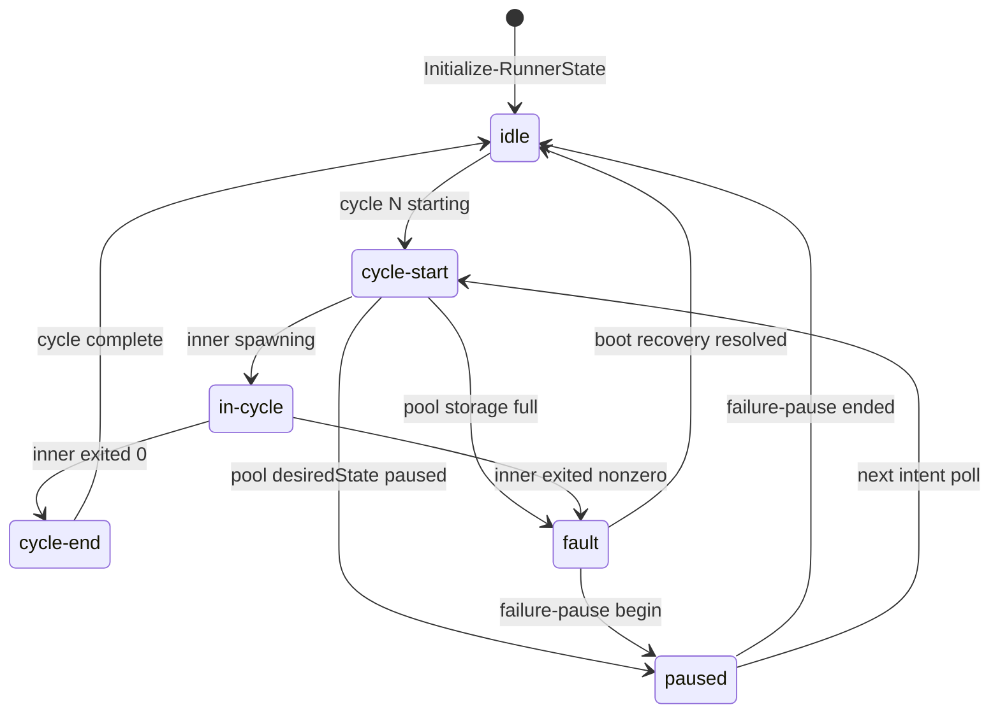
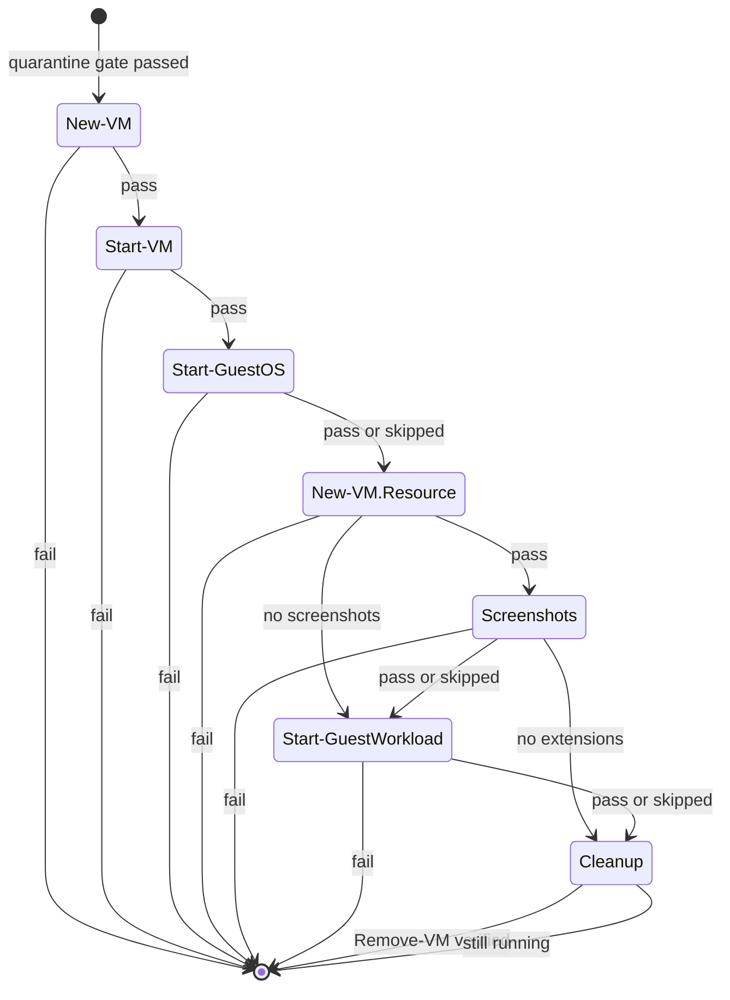
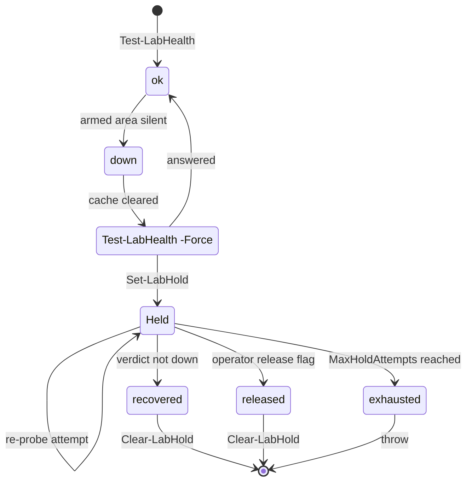
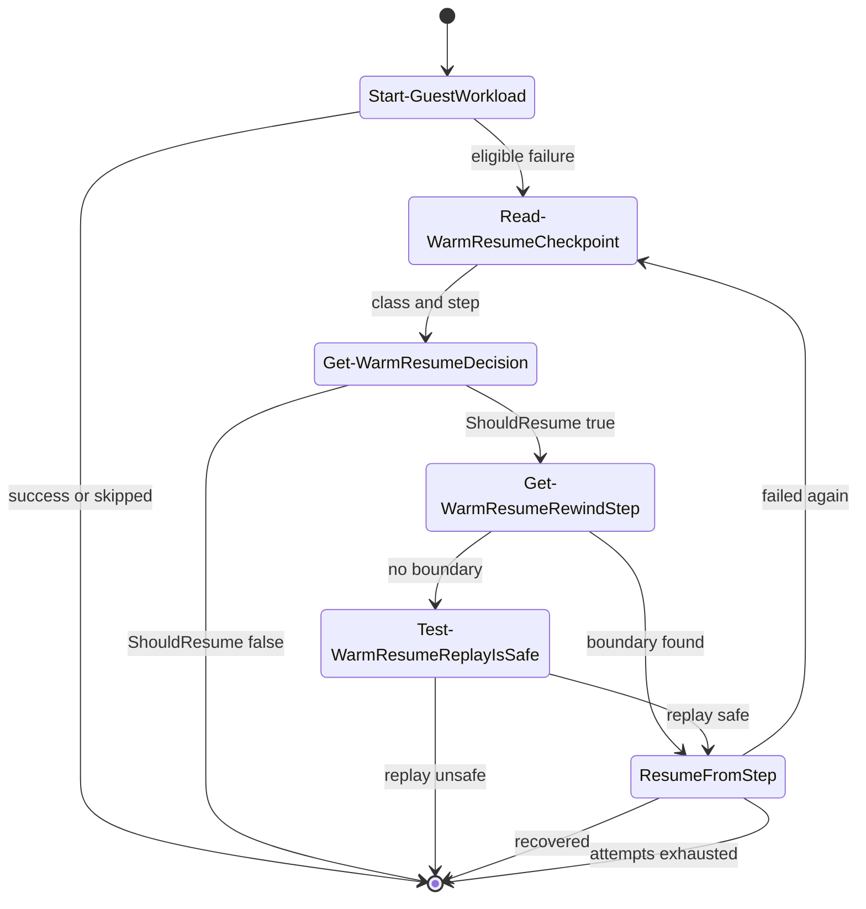

# Lifecycle state

> One sentence: the named states the runner moves through, and what one guest does inside a single cycle.

See [Design overview](00-index.md) - [Context and components](01-context-and-components.md) -
[Component breakdown](02-component-breakdown.md) - [Data flows](03-data-flows.md) -
[Configuration data model](05-data-model.md) - [Deployment topology](06-deployment.md) -
[Naming conventions](naming.md) - [Yuruna Architecture](../architecture.md).

Grounded in `test/modules/Test.RunnerState.psm1` (the enum, the adjacency map and
the boot-recovery synthetics), `test/modules/Test.RunnerOuterLoop.psm1` (every
product `Set-RunnerState` call site and the failure pause),
`test/modules/Test.RunnerWatchdog.psm1`, `test/modules/Test.RunnerInnerLoop.psm1`
(the guest sweep and the warm-resume loop), `test/modules/Test.WarmResume.psm1`
and `test/modules/Test.LabHealth.psm1`. Bounds are quoted from
`test/Start-TestRunner.ps1` and `test/test.config.yml.template`.

Four state machines follow, each with at most seven states.

## Outer runner -- 6 states

`$script:StateEnum` in `test/modules/Test.RunnerState.psm1` declares six names and
the diagram spells them exactly as the source does:
`idle`, `cycle-start`, `in-cycle`, `cycle-end`, `fault`, `paused`.

```mermaid
stateDiagram-v2
    state "idle" as idle
    state "cycle-start" as cycle_start
    state "in-cycle" as in_cycle
    state "cycle-end" as cycle_end
    state "fault" as fault
    state "paused" as paused

    [*] --> idle : Initialize-RunnerState
    idle --> cycle_start : cycle N starting
    cycle_start --> in_cycle : inner spawning
    cycle_start --> fault : pool storage full
    cycle_start --> paused : pool desiredState paused
    in_cycle --> cycle_end : inner exited 0
    in_cycle --> fault : inner exited nonzero
    cycle_end --> idle : cycle complete
    fault --> paused : failure-pause begin
    fault --> idle : boot recovery resolved
    paused --> idle : failure-pause ended
    paused --> cycle_start : next intent poll
```

Six boxes and no fold -- the enum has exactly six members, so nothing is
aggregated. `[*]` is the process-start marker of the resident outer, not a state.

The states map to two processes, not one. `test/Start-TestRunner.ps1` is the
resident outer that owns `runner.pid` and never exits; each cycle runs in a fresh
`pwsh` started from `test/modules/Invoke-TestCycleRunner.ps1`, which is where
`cycle-start`, `paused` on a pool hold, `fault` on storage, and `in-cycle` are
written. `cycle-end`, `idle`, `fault` on a non-zero exit and the two failure-pause
writes come from the resident parent. The shared record is
`$env:YURUNA_RUNTIME_DIR/runner.state.json`, replaced atomically through
`Write-YurunaStateFileJson` in `test/modules/Test.StateFile.psm1`.

### Every transition, with its trigger and its bound

Rows are in the declaration order of `$script:ValidTransition`. The reason column
holds the `-Reason` string the call site passes verbatim; `<n>` stands for the
cycle number the caller interpolates.

| From -> To | `-Reason` literal | Trigger in code | Bound, key, default |
|---|---|---|---|
| `idle` -> `cycle-start` | `cycle <n> starting` | first statement of `Invoke-RunnerOuterCycle`, ahead of the framework git pull | pull bounded 60 s in `Invoke-OuterGitPull` |
| `cycle-start` -> `in-cycle` | `inner spawning` | `Start-Watchdog` armed, immediately before the call-operator spawn | watchdog kill after `testCycle.stepTimeoutSeconds`, default 2700 s; `testCycle.preambleTimeoutSeconds`, default 600 s, while `runner.phase` exists |
| `cycle-start` -> `fault` | `pool storage full` | `Test-OuterPoolStorageSpaceReady` answered `ok=$false` before the spawn | none; the outcome is `storage-full` and takes the full failure pause |
| `cycle-start` -> `paused` | `pool desiredState=paused (cycle <n>)` | `Resolve-YurunaPoolDesiredState` returned `paused` | 30 s hold, the `default` arm of the outcome switch |
| `in-cycle` -> `cycle-end` | `inner exited 0` | child exit code 0 | none |
| `in-cycle` -> `fault` | `inner exited <code>` | child exit code non-zero | none |
| `cycle-end` -> `idle` | `cycle complete` | written in the same statement pair as `cycle-end` | none |
| `fault` -> `paused` | `failure-pause begin` | entry to the failure-pause `try` | cap `$script:FailurePauseMaxSeconds` = 3600 s; poll `$script:FailureCommitPollSeconds` = 300 s; sleep sliced at 5 s |
| `fault` -> `idle` | `boot_recovery_resolved` | `Initialize-RunnerState` on a stale prior state file | none |
| `paused` -> `idle` | `failure-pause ended` | the pause loop's `finally`, taken on every exit path | none |
| `paused` -> `cycle-start` | `cycle <n> starting` | the next outer iteration after the 30 s pool hold | 30 s |

`$script:FailurePauseMaxSeconds`, `$script:FailureCommitPollSeconds`,
`$script:StepTimeoutSecondsDefault` (2700) and
`$script:PreambleTimeoutSecondsDefault` (600) are hardcoded at the top of
`test/Start-TestRunner.ps1` rather than being config keys, and restated in
`test/modules/Invoke-TestCycleRunner.ps1` for the cycle child. The two watchdog
bounds are the only pair a config key can move:
`Get-OuterStepTimeoutSeconds` and `Get-OuterPreambleTimeoutSeconds` in
`test/modules/Test.RunnerOuterLoop.psm1` re-read them uncached every cycle, accept
a pool-level override, and treat `preambleTimeoutSeconds: 0` as the opt-out that
applies the step bound everywhere.

The adjacency map holds one pair the diagram omits: `idle` -> `fault`. It is legal
so the validator stays quiet if it ever happens, but no call site produces it
today -- every `fault` write happens from `cycle-start` or `in-cycle`.

`Set-RunnerState` rejects in two tiers. A target outside the enum is refused with
a warning and nothing is written. A target inside the enum on an unmapped edge is
warned about and written anyway, because the map exists to make drift visible, not
to lose telemetry. Each write appends to a `history` array capped at
`$script:HistoryDepth` = 20 entries and emits a `runner_state_transition` NDJSON
record.

### Boot recovery -- the synthetic pair

`Initialize-RunnerState` runs once, from `test/Start-TestRunner.ps1`, and is
deliberately not re-run per cycle: a fresh `runId` every cycle would break run
continuity on the event stream. On a prior state file whose `runId` differs from
this run's and whose `current` is not `idle`, it emits two synthetic
`runner_state_transition` events and seeds them as the first two `history`
entries: `<stale> -> fault` with reason `boot_recovery_detected_stale_state`
carrying `priorWriterPid` and `priorRunId`, then `fault -> idle` with reason
`boot_recovery_resolved`. Both carry `synthetic = $true`.

The first synthetic edge starts from whatever was on disk, so it can leave any
non-`idle` state -- including `cycle-end` -> `fault` and `paused` -> `fault`, which
are not in the adjacency map. They pass unremarked because the synthetics are
written straight to the event stream and the history array rather than through
`Set-RunnerState`.

### The watchdog path into `fault`

`Start-Watchdog` in `test/modules/Test.RunnerWatchdog.psm1` returns a `Start-Job`
named `yurunaWatchdog` -- a separate `pwsh` process, because the outer is blocked
inside the call-operator wait and an in-runspace monitor cannot pump. It is armed
immediately before the `cycle-start` -> `in-cycle` write and stopped in the
enclosing `finally`.

The watchdog writes no runner state at all. Its path into `fault` is indirect:

1. Arm. Wait up to 180 s for `inner.pid` to appear, read it, then capture identity
   as PID plus `StartTime` over up to 3 probes 2 s apart. A failure at any of those
   three points drops `runner.watchdog.lapsed` and exits, and the cycle runs
   unguarded.
2. Poll every `$script:WatchdogPollSeconds` = 30 s. Pick the bound first and never
   cache it: `runner.phase` present selects the preamble bound, absent or
   unreadable selects the looser step bound.
3. Measure staleness as the mtime age of `runner.stepHeartbeat`, or age from arm
   time when that file does not exist yet. A transient read failure counts as
   not-stale for that poll.
4. Over the bound, re-verify identity, then kill: `taskkill /PID <pid> /T /F` plus
   a `Stop-Process -Force` backstop on Windows; on POSIX build the descendant set
   from `/bin/ps -eo pid=,ppid=` and kill leaves first.
5. The killed inner exits non-zero, the outer takes `in-cycle` -> `fault`, then
   `fault` -> `paused`.

Identity confirmed gone across 3 probes 5 s apart disarms without killing; a
probe that merely fails neither kills nor disarms and polling continues.

Two heartbeat files exist and only one is the watchdog signal.
`runner.heartbeat` is written by a compiled `Yuruna.HeartbeatWriter` timer on a
threadpool thread at 30000 ms due and period, which keeps ticking through a wedged
runspace. `runner.stepHeartbeat` is touched from the runspace itself at each step
boundary in `test/modules/Test.SequenceEngine.psm1`, so it is the one that goes
stale when work stops.

`Write-RunnerPhase` in `test/modules/Test.RunnerHeartbeat.psm1` writes
`runner.phase` and refreshes `runner.stepHeartbeat` in the same call, so slow but
progressing preamble work is not read as a stall.
`test/modules/Invoke-TestRunnerInnerLoop.ps1` writes six phases in call order --
`bootstrap`, `host-detect`, `host-network`, `service-vm-restore`,
`caching-proxy-gate`, `status-service` -- and calls `Clear-RunnerPhase` exactly
once, immediately before `Invoke-RunnerInnerCycle`. The outer wipes `runner.phase`
pre-spawn and warns if the wipe failed, because a surviving marker would apply the
tight 600 s bound to the whole cycle.

Back in the outer, a non-zero exit whose `runner.stepHeartbeat` age exceeds the
step bound is attributed to the watchdog. Only when the inner left no record does
the outer synthesize a schema-version-2 `last_failure.json` with
`reason = 'watchdog_kill'`, `failureClass = 'wait_timeout'`,
`severity = 'hard'`, `classificationSource = 'synthetic'` and
`synthesizedBy = 'outer-watchdog'`.

### Cycle outcomes that write no transition

`Invoke-RunnerOuterCycle` returns one of six outcome strings --
`completed`, `pull-error`, `paused`, `drain`, `spawn-failed`, `storage-full` --
and `Invoke-OuterCycleDispatch` adds two more, `shutdown` and `cycle-aborted`.
Only some of them coincide with a state write.

- `pull-error` and `drain` return after `cycle-start` was written and produce no
  further transition, so the machine sits in `cycle-start` through the hold.
- `spawn-failed` returns after `in-cycle` was already written.
- `shutdown` kills the cycle process tree with a 15000 ms grace and writes nothing.
- `cycle-aborted` is a heuristic, not an exit code: no outcome file, non-zero child
  exit, and the child ran for less than `$script:CycleAbortSeconds` = 30 s. The
  child reports through `runtime/runner.cycle.outcome.json` rather than an exit
  code, because the exit-code space belongs to the inner.

Four of those outcomes take a short hold and re-enter rather than pausing:
`pull-error`, `paused`, `spawn-failed` and `cycle-aborted`. The hold is
`$script:OuterPullErrorSleepSeconds` = 30 s for `pull-error`,
`$script:InnerSpawnErrorSleepSeconds` = 30 s for `spawn-failed` and
`cycle-aborted`, and the switch's `default` of 30 s for `paused`.
`storage-full` is deliberately outside that set and falls through to the full
failure pause -- a full share is not momentary.

Aborting mid-cycle is also available from inside a step. The cycle-restart gate in
`test/modules/Test.SequenceEngine.psm1` throws a `RuntimeException` tagged
`Data['YurunaCycleRestart'] = $true` with the message prefix
`YurunaCycleRestart: `. `test/modules/Test.RunnerInnerLoop.psm1` handles it as a
normal cycle ending rather than a crash: no crash-counter increment, no postmortem
banner, cycle finalized as `fail`. That is distinct from the crash path, where
`$MaxConsecutiveCrashes` = 3 aborts the loop and each earlier crash sleeps
`min(300, 30 * 2^(crashes-1))` seconds with 25 percent jitter, in 1 s slices that
refresh `runner.stepHeartbeat` so the watchdog does not kill the backoff.

### Leaving `paused` -- six break-out triggers

The failure pause captures three baselines once at entry: framework HEAD from
`Get-OuterCommitSha`, project remote HEAD from `Get-OuterProjectUrl` plus
`Get-OuterRemoteSha`, and the config mtime from `Get-OuterConfigMtime`. It then
polls every `$script:FailureCommitPollSeconds` = 300 s, sleeping in 5 s slices so
Ctrl+C stays observable.

Six things end it, and all six leave through the single `finally` that writes
`paused` -> `idle`. The `paused` -> `idle` edge in the diagram is that fold; its
exact members and real count are:

1. **New framework commit.** `Test-OuterNewCommitsAvailable` requires
   `git rev-list --count HEAD..@{u}` above zero, not merely a differing tip,
   because a clone holding an unpushed local commit differs permanently.
2. **New project commit.** `Get-OuterRemoteSha` against `repositories.projectUrl`,
   requiring both the current and the baseline SHA to be non-null so a network
   failure cannot fire it.
3. **Local `test.config.yml` edit.** A nullable `-ne` on the mtime, which catches
   changed, created and deleted in one comparison.
4. **Status-UI start cycle.** `runtime/control.cycle-restart` present; the flag is
   consumed on the spot so the next spawn does not re-fire on it.
5. **Gated auto-remediation.** Enabled by `testCycle.autoRemediation.enabled`
   (default false, template false) and capped by
   `testCycle.autoRemediation.maxAttemptsPerCycle` (default 2, template 2). The
   class from `Get-OuterLastFailureClass` must pass `Test-AutoRemediationAllowed`
   in `test/modules/Test.Remediation.psm1`; an unavailable module answers no. On
   allow it emits `auto_remediation_applied` with
   `action = 'end_failure_pause_early'`.
6. **Cap elapsed, or shutdown requested.** The `while` condition itself, bounded by
   `$script:FailurePauseMaxSeconds` = 3600 s.

Six triggers, one edge. The `$remediationAutoSkips` counter that caps trigger 5
lives in `Invoke-RunnerOuterLoop` in the resident parent, not in the per-cycle
child -- a fresh process would reset it every cycle and the cap would never be
reached. A passing cycle resets it to zero.

## Per-guest step lifecycle inside one cycle

`Invoke-RunnerInnerCycle` in `test/modules/Test.RunnerInnerLoop.psm1` runs its body
in a `do { ... } while ($false)` -- exactly one pass, because per-cycle iteration
belongs to the outer. Inside it, one `foreach` walks the guest list and calls
`Invoke-GuestProvisionIteration` per guest. The states below are the literal
`-StepName` values that function passes to `Set-StepStatus`, plus the `Cleanup`
stage name its teardown reports.

```mermaid
stateDiagram-v2
    state "New-VM" as new_vm
    state "Start-VM" as start_vm
    state "Start-GuestOS" as start_guest_os
    state "New-VM.Resource" as new_vm_resource
    state "Screenshots" as screenshots
    state "Start-GuestWorkload" as start_guest_workload
    state "Cleanup" as cleanup

    [*] --> new_vm : quarantine gate passed
    new_vm --> start_vm : pass
    new_vm --> [*] : fail
    start_vm --> start_guest_os : pass
    start_vm --> [*] : fail
    start_guest_os --> new_vm_resource : pass or skipped
    start_guest_os --> [*] : fail
    new_vm_resource --> screenshots : pass
    new_vm_resource --> start_guest_workload : no screenshots
    new_vm_resource --> [*] : fail
    screenshots --> start_guest_workload : pass or skipped
    screenshots --> cleanup : no extensions
    screenshots --> [*] : fail
    start_guest_workload --> cleanup : pass or skipped
    start_guest_workload --> [*] : fail
    cleanup --> [*] : Remove-VM verified
    cleanup --> [*] : still running
```

Seven states, which is the cap, so three things are folded onto edges rather than
drawn. The exact members and real counts:

- **The entry gates fold onto `[*] --> New-VM`.** Three checks run before the first
  step, in this order. `Invoke-GuestQuarantineGate` runs in the guest `foreach`
  itself when `testCycle.guestQuarantine.enabled` is true (default true, template
  true); a skip sets guest status `skipped`, raises the dashboard quarantine flag
  against the current framework commit, and moves to the next guest without
  entering the iteration function at all. Inside the function, a requested
  shutdown sets `Control='break'` with `FailedStep="shutdown"`, and a guest already
  in `$FailedGuests` sets `Control='continue'`.
- **The per-guest preparation folds onto the same edge.** Four actions, all before
  `New-VM`: create the per-guest cycle data folder eagerly and record its URL so
  the dashboard tile is clickable mid-cycle; delete stale
  `failure_screenshot_<VM>.png` and `failure_ocr_<VM>.txt` from the log root;
  on a host with `ProcessorCount` of 4 or fewer running more than one VM this
  cycle, force-stop every other running cycle VM; and
  `Remove-GuestVMQuietly -SkipStop`.
- **The failure handling folds onto each `fail` edge.** Five actions run before any
  branch: `Set-StepStatus fail`, `Set-GuestStatus fail`, populate the four
  `$IterState` fields, `Write-CycleInfraFailure` where the step has an infra class,
  and `Copy-FailureArtifactsToStatusLog`. The artifact copy is placed ahead of the
  `StopOnFailure` branch so both paths get the debug folder. Only then does
  `testCycle.stopOnFailure` (default false, template false) decide:
  true leaves the VM as-is and sets `Control='break'`; false runs
  `Remove-GuestVMQuietly` and sets `Control='continue'`, which is what actually
  releases the memory reservation for the next guest.

Each state, what it runs, and its bound:

| State | Driver | Bound, key, default | Infra failure class |
|---|---|---|---|
| `New-VM` | `New-VM` with cascaded `Username`, `Hostname`, `MemoryStartupBytes`, `Cores` | none | `provisioning_failure` |
| `Start-VM` | `Start-VM`, then `Update-GuestNeighborCache` and `Wait-VMIp` | `Wait-VMIp -TimeoutSeconds 30`, hardcoded | `provisioning_failure` |
| `Start-GuestOS` | `Start-GuestOS` over the plan's `startSequences` | per-step `vmCommunication.timeoutSeconds`, default 180, template 180 | none; supports `skipped` |
| `New-VM.Resource` | `Wait-VMRunning` | `vmStart.startTimeoutSeconds`, default 120, template 120; `vmStart.bootDelaySeconds`, default 15, template 15 | `provisioning_failure` |
| `Screenshots` | `Invoke-ScreenshotTest` | per-step `vmCommunication.timeoutSeconds` | none; supports `skipped` |
| `Start-GuestWorkload` | `Start-GuestWorkload` over `workloadSequences` | per-step `vmCommunication.timeoutSeconds`; warm resume on top | none directly; writes `Set-LastFailureSummary` from `Get-FailureEventData` |
| `Cleanup` | teardown: DHCP release, `Stop-VM -Force`, `Remove-VM`, `Get-VMState` verify | one retry, no timeout | `provisioning_failure` |

Three edges are easy to misread.

**The two bypass edges are cycle-wide, not per-guest.** `$hasScreenshots` is a
single OR computed once by `Get-CycleStepNameList` for the whole cycle, so
`New-VM.Resource --> Start-GuestWorkload` is taken only when no guest in the cycle
schedules screenshots. A guest that merely has no schedule of its own still enters
`Screenshots` and reports `skipped`, which is why the step stays visible on the
dashboard instead of vanishing. `Screenshots --> Cleanup` is the same shape for
`$hasExtensions`.

**`Cleanup` is reached only on a pass.** `Set-GuestStatus pass` is written before
it, then the per-VM `screens_<VM>/` ring is deleted, then
`Invoke-GuestDhcpRelease` asks for the lease back while there is still a guest to
ask -- the `Stop-VM -Force` that follows is invisible to the guest's own shutdown
unit. A VM still `running` after `Remove-VM` and one retry becomes a `Cleanup`
failure that sets the four `$IterState` fields, writes
`Write-CycleInfraFailure -Stage 'Cleanup' -FailureClass 'provisioning_failure'`
and breaks regardless of `stopOnFailure`. It writes no `Set-StepStatus` and no
`Set-GuestStatus` and copies no artifacts, so the guest keeps the `pass` written
one step earlier. `Cleanup` is not a dashboard tile.

**Every state boundary carries two cross-cutting calls the diagram cannot show.**
`Assert-CachingProxyServiceStillReachable` runs before each of the six dashboard
steps with a 3000 ms TCP cap; it never holds the cycle, it only emits a coherent
transition log -- one loud `LOST` warning on the down edge, terse notes during a
sustained outage, and a note on recovery. After each step,
`Sync-RunnerStepConfig` re-reads the config and the three mirrors
`StopOnFailure`, `VmStartTimeoutSeconds` and `VmBootDelaySeconds` are refreshed,
so an operator edit lands at the next step boundary rather than the next cycle.

After the iteration returns, `Register-GuestQuarantineOutcome` folds the outcome
into the per-guest circuit breaker in `test/modules/Test.GuestQuarantine.psm1`. A
pass clears the entry; a failure extends the same-class streak and trips
quarantine at `testCycle.guestQuarantine.failuresToQuarantine` (default 3,
template 3) for `testCycle.guestQuarantine.skipCycles` (default 5, template 5)
cycles or until a new framework or project commit. Classes in
`$script:HostScopedFailureClass`, which today holds only
`host_network_degraded`, never start or extend a streak: a host fault produces
the identical class on every network-touching guest at once and would quarantine
them all.

## Holding for a lab service that stopped answering

`Wait-LabHealthy` in `test/modules/Test.LabHealth.psm1` is the hold, and
`Invoke-LabHealthGate` wraps it. The gate is called at sequence start and at the
top of every step from `test/modules/Test.SequenceEngine.psm1`, and once per
orchestration chain entry from `test/modules/Test.Orchestrator.psm1`. Every call
site is `Get-Command`-guarded so a module set without `Test.LabHealth` runs
ungated.

States below are the verdict literals `Test-LabHealth` returns and the `Outcome`
literals `Wait-LabHealthy` returns.

```mermaid
stateDiagram-v2
    state "ok" as ok
    state "down" as down
    state "Test-LabHealth -Force" as confirm
    state "Held" as held
    state "recovered" as recovered
    state "released" as released
    state "exhausted" as exhausted

    [*] --> ok : Test-LabHealth
    ok --> down : armed area silent
    down --> confirm : cache cleared
    confirm --> ok : answered
    confirm --> held : Set-LabHold
    held --> held : re-probe attempt
    held --> recovered : verdict not down
    held --> released : operator release flag
    held --> exhausted : MaxHoldAttempts reached
    recovered --> [*] : Clear-LabHold
    released --> [*] : Clear-LabHold
    exhausted --> [*] : throw
```

Seven states, which is the cap. Every box is a literal from
`test/modules/Test.LabHealth.psm1`: `ok` and `down` are values of the `Verdict`
field `Test-LabHealth` returns, `Held` and the three terminals `recovered`,
`released` and `exhausted` are values of the `Held` and `Outcome` fields
`Wait-LabHealthy` returns, and `Test-LabHealth -Force` is the confirmation call
made verbatim.

The third verdict value, `unknown`, is folded into `ok` on the diagram because the hold treats them identically: `Wait-LabHealthy`
returns its idle result for any verdict that is not `down`. The real verdict set
is three values -- `ok`, `down`, `unknown`.

The probe set is derived, never configured: `Get-LabHealthProbeSet` walks
`Get-ExtensionServiceManifestAll` and keeps every area whose `HealthPort` is above
zero. Per area, an armed area is probed at its recorded `lastAddress` first with
no discovery at all; only on failure, or with no address on record, is discovery
re-asked through `Resolve-LabHealthAddress`, because a rebuilt service normally
returns on a different address. The verdict is `ok` when something answered, else
`down` when the area is armed or named in `testCycle.labHealth.require`, else
`unknown`.

Arming is a change of condition, not absolute state. `Test-LabHealthArmed`
requires a parseable `lastOkUtc` no older than `testCycle.labHealth.armWindowHours`
(default 24, template 24). A stamp in the future arms too -- clock skew is not
evidence the service is absent. An area that has never answered is never `down`
unless the operator names it in `testCycle.labHealth.require`.

Each transition, with its bound:

| From -> To | Trigger in code | Bound, key, default |
|---|---|---|
| `[*]` -> `ok` | `Test-LabHealth`, gated on `testCycle.labHealth.enabled` (default true, template true) | per attempt `$script:ProbeAttempts` = 1 and `$script:ProbeTimeoutSeconds` = 3; verdict cached for `testCycle.labHealth.minIntervalSeconds` (default 30, template 30) when armed or required, `testCycle.labHealth.discoveryIntervalSeconds` (default 600, template 600) when not |
| `ok` -> `down` | an armed or required area answered nothing | same probe budget |
| `down` -> `Test-LabHealth -Force` | `Clear-LabHealthVerdictCache` then a forced re-probe | same probe budget |
| `Test-LabHealth -Force` -> `ok` | the confirmation probe answered; result is `Outcome = 'none'` and no hold is raised | none |
| `Test-LabHealth -Force` -> `Held` | still `down`; `Set-LabHold` plus a `lab_health_change` event carrying `ok -> down` | none |
| `Held` -> `Held` | one re-probe attempt after the poll delay | `Get-LabHoldPollDelay` delegates to `Get-PollDelay` in `test/modules/Test.Backoff.psm1`: `min(59, 2^(n-1))` seconds minus up to 25 percent jitter, flat 5000 ms fallback |
| `Held` -> `recovered` | a probe answered; `lab_health_change` carrying `down -> ok` | none |
| `Held` -> `released` | `control.lab-hold-release` present, read by `Test-LabHoldReleaseRequested`; `lab_health_released` with `releasedBy = 'operator'` | none |
| `Held` -> `exhausted` | attempts reached `MaxHoldAttempts`; `lab_health_exhausted` | `testCycle.labHealth.maxHoldAttempts`, default 999, template 999, clamped to the compiled ceiling `$script:MaxHoldAttemptsCeiling` = 999 with a floor of 1 |
| any terminal -> `[*]` | `Clear-LabHold` on every exit path | none |

Three details are easy to misread.

**The confirmation probe is not redundant.** The gate runs on a single-attempt
3 s probe at every step boundary, so one dropped packet is enough to produce
`down` on a service that is up. The cache is cleared and the probe re-run with
`-Force` before the cycle is parked, because parking a cycle on a dropped packet
is worse than the failure being prevented.

**The hold stays interruptible.** Every iteration runs the caller's `CheckAbort`,
which is the cycle-restart gate, so a restart aborts a held cycle exactly as it
aborts a running one, and yields to `WaitWhilePaused` so an operator pause stops
the re-probing rather than racing it. Each attempt re-asks discovery rather than
replaying a candidate list.

**Only `exhausted` is a failure.** `Invoke-LabHealthGate` writes
`Write-CycleInfraFailure` with `FailureClass 'lab_dependency_down'`,
`Severity 'hard'` and `GuestKey '(orchestration)'` before throwing, then throws a
`RuntimeException` tagged `Data['YurunaLabDependencyDown'] = $true` with the
message prefix `YurunaLabDependencyDown: `. Both markers exist so a caller can
tell it from a code crash -- no stack banner, no crash-streak increment -- and so
the caller's generic handler does not overwrite the classified record. A bad
verdict never clears the `lab-health.json` record, which would disarm the gate at
exactly the moment it is needed. `Set-LabHold` writes the sidecar `lab-hold.json`
first and the `control.lab-hold` flag second, so no reader can see a raised hold
with no explanation beside it.

The watchdog does not know a hold is in progress. Nothing in the hold path
refreshes `runner.stepHeartbeat`, and the gate runs ahead of the per-step refresh.
Whichever ceiling arrives first ends the hold: the watchdog's
`testCycle.stepTimeoutSeconds` of 2700 s, or the gate's own `maxHoldAttempts`.

## Warm-resume retry loop

The decision core is `test/modules/Test.WarmResume.psm1`; the loop that drives it
sits inside the `Start-GuestWorkload` region of `Invoke-GuestProvisionIteration`
in `test/modules/Test.RunnerInnerLoop.psm1`. It re-runs a failed sequence from its
last-good step on the same still-alive VM, because the teardown fires only on the
final result.

```mermaid
stateDiagram-v2
    state "Start-GuestWorkload" as workload
    state "Read-WarmResumeCheckpoint" as checkpoint
    state "Get-WarmResumeDecision" as decision
    state "Get-WarmResumeRewindStep" as rewind
    state "Test-WarmResumeReplayIsSafe" as replay_safe
    state "ResumeFromStep" as resume

    [*] --> workload
    workload --> [*] : success or skipped
    workload --> checkpoint : eligible failure
    checkpoint --> decision : class and step
    decision --> [*] : ShouldResume false
    decision --> rewind : ShouldResume true
    rewind --> resume : boundary found
    rewind --> replay_safe : no boundary
    replay_safe --> [*] : replay unsafe
    replay_safe --> resume : replay safe
    resume --> [*] : recovered
    resume --> checkpoint : failed again
    resume --> [*] : attempts exhausted
```

Six states, no fold. Four of the boxes are functions in
`test/modules/Test.WarmResume.psm1` and carry their exact names.
`Start-GuestWorkload` is the entry point in
`test/modules/Test.Start-GuestWorkload.psm1`, and the `ResumeFromStep` box is the
same function re-invoked as
`Start-GuestWorkload -ResumeFromSequence <entry> -ResumeFromStep <n>`;
`ResumeFromStep` is also the field name the checkpoint and the rewind both return.

The loop is break-free -- `$wrDone` carries the stop condition, because a bare
`break` absent a loop of its own would escape the caller's guest `foreach`.

Entry is gated on four conditions together: `testCycle.warmResume.enabled`
(default true, template true), the result not successful, the result not skipped,
and `Read-WarmResumeCheckpoint` resolvable. Before the decision reads the record,
`Write-CycleHostNetworkReclassification` re-files host-network faults against the
host, because on a host whose bridge carries nothing every attempt would get the
same answer and a resume would only spend the cycle budget reproducing it.

| From -> To | Trigger in code | Bound, key, default |
|---|---|---|
| `Start-GuestWorkload` -> `Read-WarmResumeCheckpoint` | the four entry gates above | loop bound `testCycle.warmResume.maxAttempts`, default 2, template 2 |
| `Read-WarmResumeCheckpoint` -> `Get-WarmResumeDecision` | reads `$YURUNA_LOG_DIR/last_failure.json` for `failureClass`, `sequenceName` and `repro.resumeFromStep` | staleness guard `-NotBeforeUtc` set to the workload start, with a 2 s clock tolerance |
| `Get-WarmResumeDecision` -> `[*]` | `ShouldResume` false | none |
| `Get-WarmResumeDecision` -> `Get-WarmResumeRewindStep` | `ShouldResume` true; `ResumeSequence` is the workload-list entry verbatim | none |
| `Get-WarmResumeRewindStep` -> `ResumeFromStep` | a `loadDiskSnapshot` found at or before the checkpoint | none |
| `Get-WarmResumeRewindStep` -> `Test-WarmResumeReplayIsSafe` | `BoundaryStep` of 0 or less | none |
| `Test-WarmResumeReplayIsSafe` -> `[*]` | the step to replay hands work to the guest | none |
| `Test-WarmResumeReplayIsSafe` -> `ResumeFromStep` | no guest-state verb at the checkpoint | none |
| `ResumeFromStep` -> `[*]` | `$r.success` after the re-invocation | none |
| `ResumeFromStep` -> `Read-WarmResumeCheckpoint` | failed again with attempts remaining | `testCycle.warmResume.maxAttempts` |
| `ResumeFromStep` -> `[*]` | attempts reached `maxAttempts` | same |

The eligible classes are `$script:WarmResumeEligibleClass`, exactly six, in
declaration order: `network_timeout`, `wait_timeout`, `instrumentation_failure`,
`host_io_blocked`, `ip_not_discovered`, `payload_unavailable`. Anything else takes
the `class-not-eligible` decline.

`Get-WarmResumeDecision` has five decline reasons, evaluated in this order:
`disabled`, `class-not-eligible (<class>)`, `no-resume-step` when
`ResumeFromStep` is below 1, `no-sequence-name`, and
`sequence-not-in-workload (<name>)`. Matching against the workload list is exact
or by base name with `\.ya?ml$` stripped. A missing, stale or unparseable
checkpoint file yields `ResumeFromStep = 0`, which the decision reads as
`no-resume-step`.

Three details are easy to misread.

**The rewind exists because the checkpoint names the step that failed.** That
step's work may be half applied -- transient says why it stopped, not how far it
got. `Get-WarmResumeStepAction` reads the resolved sequence through
`Read-SequenceFile` and takes each step's lead action via `Get-StepLeadAction`, so
a restore nested inside a `retry` block is still found.
`Get-WarmResumeRewindStep` then scans backwards from the checkpoint for the
nearest `loadDiskSnapshot` and returns `ResumeFromStep`, `Rewound` and
`BoundaryStep`.

**The replay-safety guard only runs when no boundary exists.** Its unsafe verbs
are `$script:WarmResumeGuestStateVerbs`, exactly three: `fetchAndExecute`,
`sshFetchAndExecute`, `sshExec`. A null or empty action list, or a checkpoint
outside it, answers unsafe. On unsafe the resume is declined with a warning naming
the missing `loadDiskSnapshot`, and `$r` -- with the real failure inside it -- is
left exactly as the original attempt wrote it.

**Each iteration re-reads the checkpoint.** A second failure at a different step
resumes from the new one. On a resume the loop emits a `warm_resume` NDJSON record
from `New-WarmResumeEvent` carrying `checkpointStep` and `rewoundSteps` whenever
they differ from the step actually resumed, then re-invokes `Start-GuestWorkload`
with `-ResumeFromSequence` and `-ResumeFromStep`. Once an attempt has run, `$r` has
been reassigned, so what reaches the fail branch afterwards is the last attempt's
result.

## What is deliberately not drawn

- **The sequence-step machine.** `Invoke-Sequence` in
  `test/modules/Test.SequenceEngine.psm1` dispatches each step's verb through the
  registry populated by `Register-SequenceAction` in
  `test/modules/Test.SequenceHandler.psm1`. It is a dispatch table, not a state
  machine, and the number of verbs is far past seven.
- **The failure taxonomy.** `$script:FailureClassEnum` in
  `test/modules/Test.FailureTaxonomy.psm1` holds 24 values and
  `$script:RecommendationEnum` in `test/modules/Test.Remediation.psm1` holds 7.
  Neither is a lifecycle, and the classification-to-alert path is a flow, shown in
  [Data flows](03-data-flows.md).
- **The notification latch.** `AlertArmed` with `ConsecutiveFailures` and
  `ConsecutiveSuccesses`, persisted in `runtime/runner.gating.json`, is a counter
  pair rather than a named-state machine.
- **The pool desired state.** `run`, `paused` and `drain` are read from pool intent
  and consumed by the outer; the two that matter here already appear as the
  `cycle-start` -> `paused` edge and the `drain` outcome that writes no transition.
