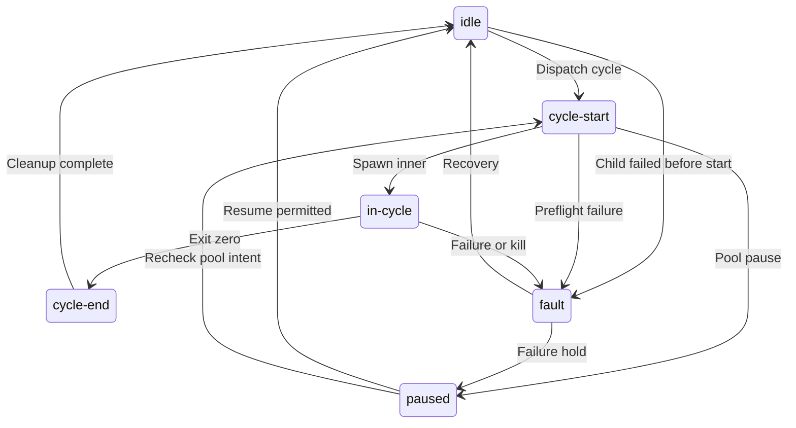
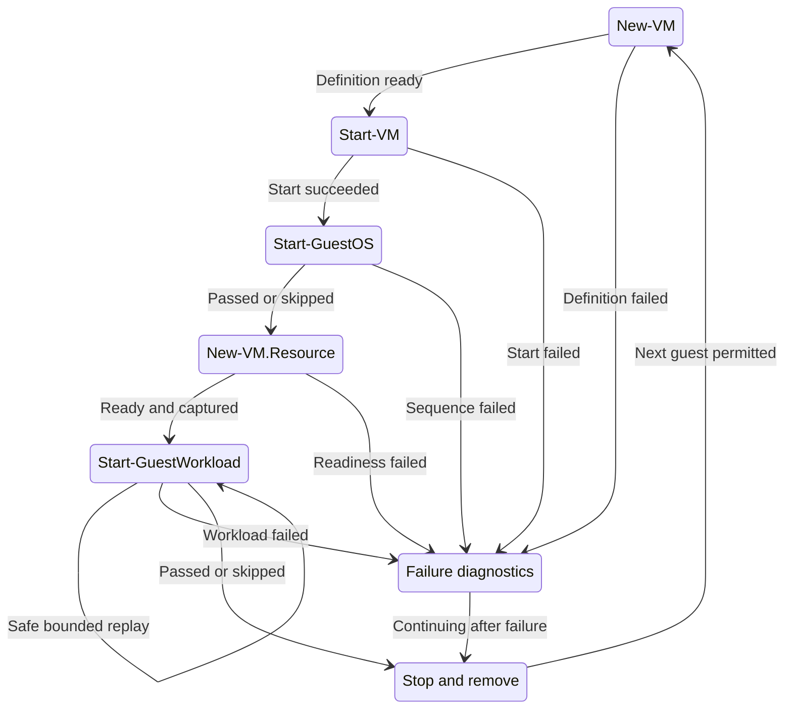
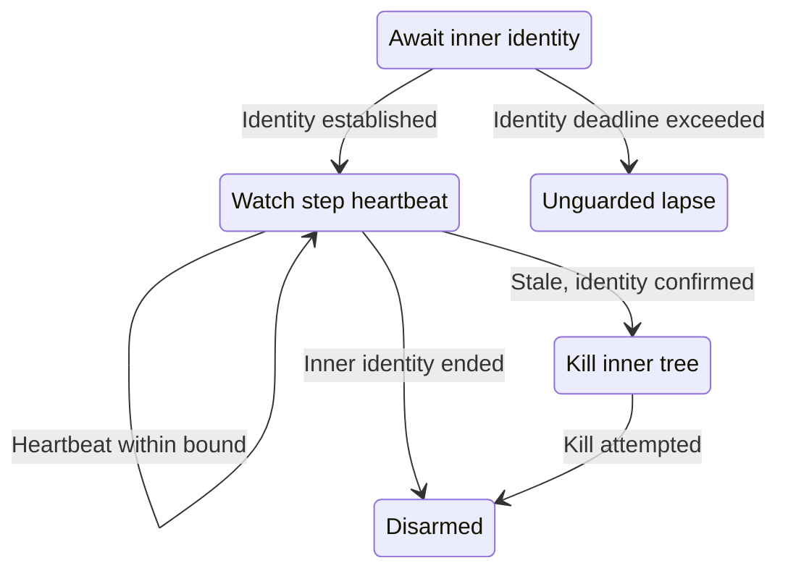

# Runner and VM lifecycle

These state views distinguish persisted runner states, per-guest execution stages, and watchdog behavior.

The [canonical architecture](../architecture.md) explains the test-harness capability; [data flows](03-data-flows.md) shows the messages exchanged within these lifecycles.

## Persisted runner states

```mermaid
stateDiagram-v2
    state "idle" as idle
    state "cycle-start" as start
    state "in-cycle" as cycle
    state "cycle-end" as finish
    state "fault" as fault
    state "paused" as paused
    idle --> start: Dispatch cycle
    idle --> fault: Child failed before start
    start --> cycle: Spawn inner
    start --> fault: Preflight failure
    start --> paused: Pool pause
    cycle --> finish: Exit zero
    cycle --> fault: Failure or kill
    finish --> idle: Cleanup complete
    fault --> paused: Failure hold
    fault --> idle: Recovery
    paused --> idle: Resume permitted
    paused --> start: Recheck pool intent
```

All six displayed names are the persisted enum in [Test.RunnerState.psm1](../../test/modules/Test.RunnerState.psm1). The single-word Mermaid aliases `start`, `cycle`, and `finish` are diagram-only identifiers, not additional runtime states. The module atomically writes `runner.state.json` and emits transition events. Unexpected transitions warn but are still recorded; this telemetry validator is not an execution gate.

[Start-TestRunner.ps1](../../test/Start-TestRunner.ps1) retains the outer dispatch loop. [Invoke-TestCycleRunner.ps1](../../test/modules/Invoke-TestCycleRunner.ps1) runs each cycle in a fresh process, and [Test.RunnerOuterLoop.psm1](../../test/modules/Test.RunnerOuterLoop.psm1) pulls the framework, synchronizes optional pool intent, checks storage, arms the watchdog, and spawns the inner runner. The fresh child loads current code without requiring an outer restart.

Operational branches are deliberately not invented enum states:

- `pull-error`, `spawn-failed`, and `cycle-aborted` produce short interruptible retry holds. A configured pool pause repeatedly checks intent without spawning guest work.
- Pool `drain` stops at a cycle boundary. Ctrl+C requests shutdown and the dispatcher stops the active process tree; neither means a successful cycle, although a Ctrl+C-killed cycle is reported as exit zero, so `cycle-end` is still recorded.
- A failed cycle enters a bounded failure pause. New framework/project commits, configuration changes, or `control.cycle-restart` can end that wait early. Eligible transient failures may use the configured auto-remediation retry budget; permanent failures retain the normal hold.
- Startup recovery detects a prior run's stale state and records a fault/recovery transition. A successful cycle resets the auto-remediation budget.

The source of these decisions is the outer-loop module, not the adjacency map alone. An outer success starts its next dispatch after the inner has completed its own configured cycle delay and cleanup.

## Per-guest execution stages

```mermaid
stateDiagram-v2
    state "New-VM" as provision
    state "Start-VM" as boot
    state "Start-GuestOS" as prepare
    state "New-VM.Resource" as ready
    state "Start-GuestWorkload" as workload
    state "Failure diagnostics" as diagnostics
    state "Stop and remove" as cleanup
    provision --> boot: Definition ready
    provision --> diagnostics: Definition failed
    boot --> prepare: Start succeeded
    boot --> diagnostics: Start failed
    prepare --> ready: Passed or skipped
    prepare --> diagnostics: Sequence failed
    ready --> workload: Ready and captured
    ready --> diagnostics: Readiness failed
    workload --> workload: Safe bounded replay
    workload --> diagnostics: Workload failed
    workload --> cleanup: Passed or skipped
    diagnostics --> cleanup: Continuing after failure
    cleanup --> provision: Next guest permitted
```

Seven states summarize `Invoke-GuestProvisionIteration` in [Test.RunnerInnerLoop.psm1](../../test/modules/Test.RunnerInnerLoop.psm1); they are execution stages, not the hypervisor's power-state enum. The resource stage polls VM readiness and waits the boot delay; the optional `Screenshots` step, folded into that state, compares captures against trained references and fails the guest on mismatch before any workload sequences. The planner may supply no preparation or workload sequences, so a skipped optional stage is not a failure. Guest selection and variable cascading come from [Test.SequencePlanner.psm1](../../test/modules/Test.SequencePlanner.psm1).

The iteration runs guests serially. It cleans stale test VMs before creation and releases the guest DHCP lease before normal force-stop/removal. After a passing guest's teardown it probes the VM, retries removal once if still running, and blocks the next guest if that VM remains running. Failure diagnostics are best-effort and preserve console/OCR, execution, and available SSH diagnostic artifacts before cleanup.

Warm resume is conditional: the failed workload must satisfy the configured transient-failure policy and attempt budget. A snapshot-backed replay rewinds to a suitable restore boundary; unsafe replay of guest work without a restore boundary is refused. Repeated equivalent guest failures can trigger quarantine, which skips that guest before provisioning until the configured cycle bound or a source change permits another attempt. Stop-on-failure can retain a failed VM for investigation instead of taking the diagnostics-to-cleanup edge, and prevents advancing to another guest.

## Watchdog supervision

```mermaid
stateDiagram-v2
    state "Await inner identity" as waiting
    state "Watch step heartbeat" as armed
    state "Kill inner tree" as terminate
    state "Disarmed" as disarmed
    state "Unguarded lapse" as lapsed
    waiting --> armed: Identity established
    waiting --> lapsed: Identity deadline exceeded
    armed --> armed: Heartbeat within bound
    armed --> terminate: Stale, identity confirmed
    armed --> disarmed: Inner identity ended
    terminate --> disarmed: Kill attempted
```

These five conceptual watchdog stages derive from [Test.RunnerWatchdog.psm1](../../test/modules/Test.RunnerWatchdog.psm1); they are not additional runner-state values. The watchdog runs in a separate PowerShell job, outside the thread blocked waiting for the inner process. It monitors `runner.stepHeartbeat`, not the background liveness heartbeat. `runner.phase` selects the tighter preamble bound until the inner finishes its startup preamble and enters the cycle body.

Before killing, the watchdog checks both PID and process start time. A transient identity-probe failure causes another poll, not a kill of an unproven process. When initial identity cannot be established, the job writes `runner.watchdog.lapsed` and exits without killing; the outer later reports that the cycle ran unguarded. Watchdog cleanup runs in the outer's `finally`.

A forced process-tree kill cannot guarantee inner `finally` execution or VM removal. The outer handles the nonzero result, records missing failure context where possible, re-ensures the status service, and enters failure pause; the next cycle's start sweep performs orphan cleanup. Cooperative `control.step-pause`, `control.cycle-pause`, and restart markers are handled at their respective boundaries by the [sequence engine](../../test/modules/Test.SequenceEngine.psm1) and inner runner, rather than being watchdog power states.

---

Back to [Architecture](../architecture.md) · [Design overview](README.md)
