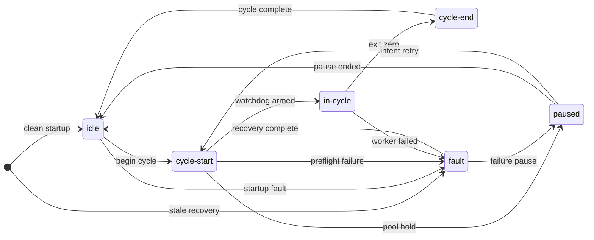
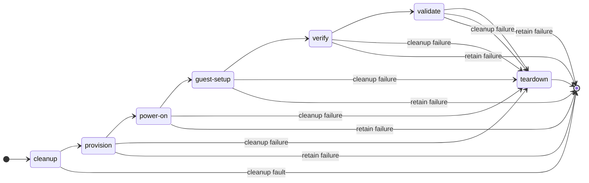

# Runner lifecycle state

These state diagrams separate the six persisted runner states from the seven guest-provisioning stages executed inside a cycle.

[Yuruna Architecture](../architecture.md) | [Design index](00-index.md) | [Data flows](03-data-flows.md)

## Persisted runner state

```mermaid
stateDiagram-v2
  direction LR

  state "idle" as idle
  state "cycle-start" as cycle_start
  state "in-cycle" as in_cycle
  state "cycle-end" as cycle_end
  state "fault" as fault
  state "paused" as paused

  [*] --> idle: clean startup
  [*] --> fault: stale recovery
  idle --> cycle_start: begin cycle
  idle --> fault: startup fault
  cycle_start --> in_cycle: watchdog armed
  cycle_start --> paused: pool hold
  cycle_start --> fault: preflight failure
  in_cycle --> cycle_end: exit zero
  in_cycle --> fault: worker failed
  cycle_end --> idle: cycle complete
  fault --> paused: failure pause
  fault --> idle: recovery complete
  paused --> idle: pause ended
  paused --> cycle_start: intent retry
```

The enum and allowed adjacency are defined in
`test/modules/Test.RunnerState.psm1`: `idle`, `cycle-start`, `in-cycle`,
`cycle-end`, `fault`, and `paused`. `Test.RunnerOuterLoop.psm1` writes
`cycle-start` before pool and preflight work, `in-cycle` after the watchdog is
armed, `cycle-end` then `idle` on exit zero, and `fault` then `paused` on a failed
cycle. A pool hold moves from `cycle-start` to `paused`; a later intent poll can
return directly to `cycle-start`.

Startup recovery is shown as a second initial path because the state module emits
synthetic `<prior-state> -> fault -> idle` events for a stale prior runner; a clean
process starts in `idle`. The `idle` to `fault` edge is also part of the module's
declared adjacency for this recovery case.

A source-pull error can leave `cycle-start` in place before the next pull attempt,
and a requested pool drain can exit with that state still persisted. A worker-spawn
failure after `in-cycle` is written can make a later loop attempt the noncanonical
`in-cycle` to `cycle-start` pair. These are operational drift cases, not declared
state-machine edges: `Test.RunnerState.psm1` warns about an unexpected pair but
still preserves its telemetry.

The Mermaid IDs `cycle_start`, `in_cycle`, and `cycle_end` use underscores solely
because the state-diagram grammar reserves hyphens in transition expressions;
their labels and persisted values retain the source spelling.

## Guest provisioning lifecycle

```mermaid
stateDiagram-v2
  direction LR

  state "cleanup" as cleanup
  state "provision" as provision
  state "power-on" as power_on
  state "guest-setup" as guest_setup
  state "verify" as verify
  state "validate" as validate
  state "teardown" as teardown

  [*] --> cleanup
  cleanup --> provision
  provision --> power_on
  power_on --> guest_setup
  guest_setup --> verify
  verify --> validate
  validate --> teardown
  teardown --> [*]
  cleanup --> [*]: cleanup fault
  provision --> teardown: cleanup failure
  power_on --> teardown: cleanup failure
  guest_setup --> teardown: cleanup failure
  verify --> teardown: cleanup failure
  validate --> teardown: cleanup failure
  %% optional -- stopOnFailure retains the guest for diagnosis
  provision --> [*]: retain failure
  power_on --> [*]: retain failure
  guest_setup --> [*]: retain failure
  verify --> [*]: retain failure
  validate --> [*]: retain failure
```

These seven states are operational groups, not persisted runner enum values. They
fold `Invoke-GuestProvisionIteration` in
`test/modules/Test.RunnerInnerLoop.psm1`:

1. **Cleanup** removes stale guests and serializes access to the selected provider.
2. **Provision** calls `New-VM` with the planned guest settings.
3. **Power-on** calls `Start-VM` and discovers the guest address.
4. **Guest-setup** runs the selected guest-OS sequence.
5. **Verify** waits for `New-VM.Resource` readiness.
6. **Validate** runs screenshot checks and guest workloads when configured.
7. **Teardown** stops and removes the guest after success or a handled failure.

With `stopOnFailure` disabled, a failed active stage cleans up and continues to the
next guest through `teardown`. With it enabled, the stage retains the VM for
diagnosis and returns immediately, represented by the `retain failure` terminal
edges. Cleanup faults also terminate the sweep. Any cycle-failing result or
unhandled exception returns nonzero, driving the persisted `in-cycle` to `fault`
edge above. `Copy-FailureArtifactsToStatusLog` records diagnostics before the
policy branch; diagnosis is a status/artifact side effect, not an eighth state.

## Watchdog and restart

`test/modules/Test.RunnerWatchdog.psm1` verifies the inner PID plus process start
time and polls `runner.stepHeartbeat`. A stale, still-matching process tree is
killed; the watchdog does not write runner state itself. The resulting nonzero
worker exit drives `in-cycle` to `fault`, then the outer loop enters `paused`.
Missing or unverifiable process identity emits a lapsed-watchdog event and leaves
the worker running. Pause exit conditions in `Test.RunnerOuterLoop.psm1` include
source/config changes, a UI restart request, auto-remediation, the configured cap,
or cancellation; a later cycle starts through `idle` or the pool-intent retry edge.
