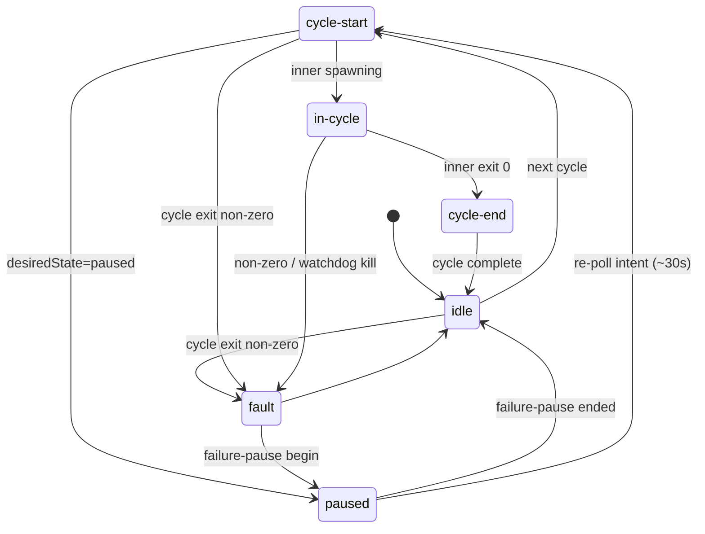
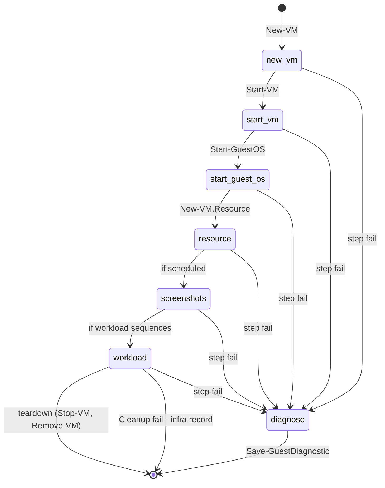

# Lifecycle state

> One sentence: the explicit outer-runner state machine and the per-guest
> step lifecycle it drives.

See [Design overview](00-index.md) · [Yuruna Architecture](../architecture.md).

Derived from `test/modules/Test.RunnerState.psm1` (`$script:StateEnum` and
`$script:ValidTransition`, mirrored in
[runner-outer-loop.md](../runner-outer-loop.md#runner-state-machine)),
`test/modules/Test.RunnerOuterLoop.psm1` (every transition writer),
`test/Invoke-TestCycleRunner.ps1`, the step plan in
`test/modules/Test.RunnerInnerLoop.psm1`, and the kill side in
`test/modules/Test.RunnerWatchdog.psm1`.

## Outer runner — six states

```mermaid
stateDiagram-v2
    state "cycle-start" as cycle_start
    state "in-cycle" as in_cycle
    state "cycle-end" as cycle_end
    [*] --> idle
    idle --> cycle_start : next cycle
    idle --> fault : cycle exit non-zero
    cycle_start --> in_cycle : inner spawning
    cycle_start --> fault : cycle exit non-zero
    cycle_start --> paused : desiredState=paused
    in_cycle --> cycle_end : inner exit 0
    in_cycle --> fault : non-zero / watchdog kill
    cycle_end --> idle : cycle complete
    fault --> paused : failure-pause begin
    fault --> idle
    paused --> idle : failure-pause ended
    paused --> cycle_start : re-poll intent (~30s)
```

The six states and all twelve edges are exactly `$script:StateEnum` and
`$script:ValidTransition`. `runner.state.json` is written atomically on every
transition and each emits a `runner_state_transition` NDJSON event.

**Two processes write this machine.** `cycle-start`, the pool-hold `paused`
and `in-cycle` are written by the per-cycle child
(`Invoke-TestCycleRunner.ps1` → `Invoke-RunnerOuterCycle`); `cycle-end`,
`idle`, `fault` and the failure-pause `paused`/`idle` pair are written by the
long-lived parent's `Invoke-RunnerOuterLoop`. Because the run id is
per-process, `runner.state.json`'s `runId` and `writerPid` alternate between
two PIDs within a single run — the cycle runner deliberately skips
`Initialize-RunnerState` so this never trips the stale-runId crash synthesis.

**The only writer of `fault`** is the non-zero-inner-exit path; there is no
separate "spawn failed" or "stale state" fault. A spawn failure is a
*transient outcome*, not a transition: the state is already `in-cycle` when
the spawn is attempted, the failure is held for the spawn-error sleep, and the
loop continues. A `pull-error` is held the same way from `cycle-start`. Both
leave the state where it was, so the next cycle's `cycle-start` write is a
repeat or an `in-cycle → cycle-start` pair that the adjacency map does not
list — each logs one drift warning and is recorded anyway.

**Boot recovery** is a separate, synthetic pair. When the prior `current` is
not `idle`, `Initialize-RunnerState` emits `<stale non-idle state> → fault`
then `fault → idle`, seeds both into history, and always leaves `current` at
`idle`. The from-state is the stale state, never `idle`.

**The validator has two rejection cases, not one.** A target state outside the
canonical enum is refused outright — one warning, `$null` returned, nothing
written and no event emitted (writing it would wedge the validator on every
later transition). A pair whose states are both in the enum but which is
absent from the adjacency map warns and then writes and emits normally, so
drift is loud but never lost. The enum is duplicated in
`test/modules/Test.EventSchema.psm1`, whose own policy is never to reject a
record: an out-of-enum `runnerState`/`fromState`/`toState` warns, emits a
sibling `schema_violation` event, and the original is still written. Adding a
state means editing both files.

## Per-guest step lifecycle (within `in-cycle`)

```mermaid
stateDiagram-v2
    [*] --> new_vm : New-VM
    new_vm --> start_vm : Start-VM
    start_vm --> start_guest_os : Start-GuestOS
    start_guest_os --> resource : New-VM.Resource
    resource --> screenshots : if scheduled
    screenshots --> workload : if workload sequences
    workload --> [*] : teardown (Stop-VM, Remove-VM)
    workload --> [*] : Cleanup fail - infra record
    new_vm --> diagnose : step fail
    start_vm --> diagnose : step fail
    start_guest_os --> diagnose : step fail
    resource --> diagnose : step fail
    screenshots --> diagnose : step fail
    workload --> diagnose : step fail
    diagnose --> [*] : Save-GuestDiagnostic
```

The plan is derived per cycle by `Get-CycleStepNameList`, so `Screenshots` and
`Start-GuestWorkload` are conditional — a plan with no screenshot schedule and
no workload sequences runs four steps. `Start-GuestOS`, `Screenshots` and
`Start-GuestWorkload` each have a third outcome, `skipped`. Teardown is drawn
as the exit transition rather than its own state (see the
[≤7 rule](00-index.md#the-7-rule--grouping-decisions)). It can still fail the
guest: a VM still `running` after `Stop-VM`/`Remove-VM` and one retry records
the step as `Cleanup` and writes a `provisioning_failure` infra record
(`last_failure.json`, an NDJSON event, the dashboard summary), then breaks the
guest loop. That path is the second exit transition, not an edge into
`diagnose` — unlike the six step-failure paths it captures no guest
diagnostics.

**The heartbeat is not per step.** Only the two sequence-engine steps
(`Start-GuestOS`, `Start-GuestWorkload`) refresh `runner.stepHeartbeat`,
because `Test.SequenceEngine.psm1` touches it at the top of each sequence step —
plus the retry-backoff and cycle-pause keep-alive loops. `New-VM`,
`Start-VM`, `New-VM.Resource` and `Screenshots` write it nowhere; they run
under the mtime left by the outer's pre-spawn force-touch or the inner's
startup seed, so each one's whole duration counts against the same staleness
budget.

The out-of-process watchdog reads that mtime, re-verifies the inner PID's
identity, and kills a runspace wedged longer than `stepTimeoutSeconds` — the
inner process tree, never the VM — forcing the `in_cycle --> fault`
transition above.

---

LICENSEURI https://yuruna.link/license

Copyright (c) 2019-2026 by Alisson Sol et al.

Last review: 2026.07.31
