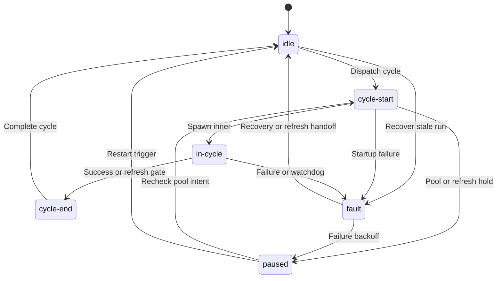
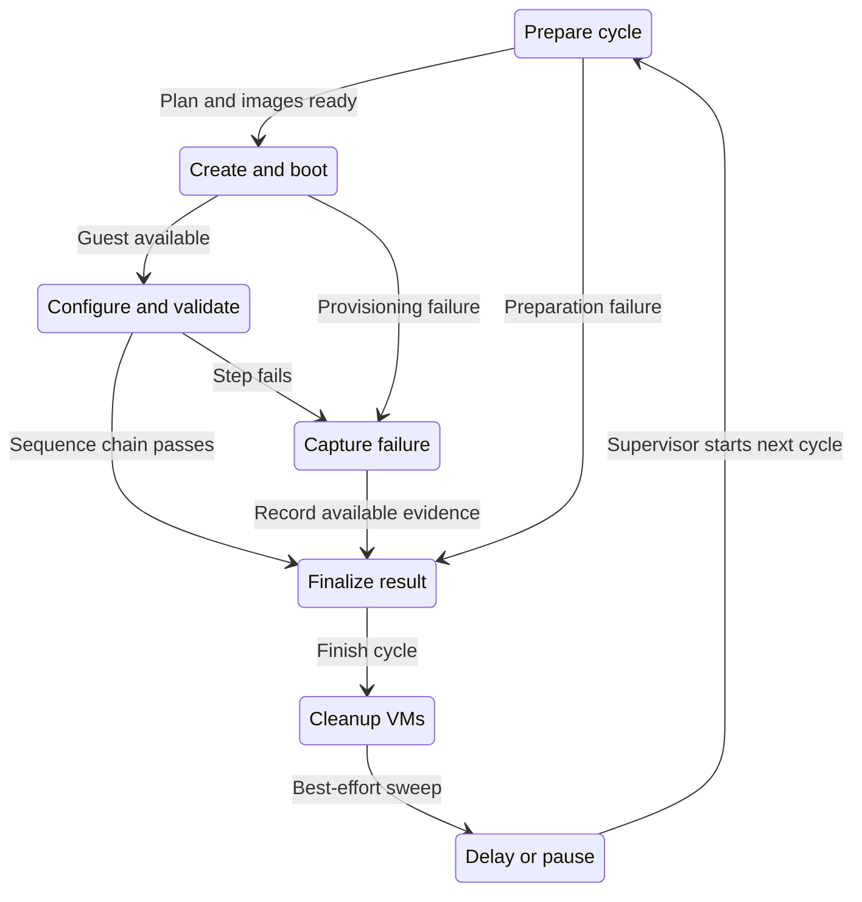

# Lifecycle state

These diagrams show the runner's persisted states and the VM work supervised within each cycle.

## Persisted runner states

```mermaid
stateDiagram-v2
    state "idle" as idle
    state "cycle-start" as cycle_start
    state "in-cycle" as in_cycle
    state "cycle-end" as cycle_end
    state "fault" as fault
    state "paused" as paused
    [*] --> idle
    idle --> cycle_start: Dispatch cycle
    idle --> fault: Recover stale run
    cycle_start --> in_cycle: Spawn inner
    cycle_start --> paused: Pool or refresh hold
    cycle_start --> fault: Startup failure
    in_cycle --> cycle_end: Success or refresh gate
    in_cycle --> fault: Failure or watchdog
    cycle_end --> idle: Complete cycle
    fault --> paused: Failure backoff
    fault --> idle: Recovery or refresh handoff
    paused --> cycle_start: Recheck pool intent
    paused --> idle: Restart trigger
```

Sources: [Test.RunnerState](../../test/modules/Test.RunnerState.psm1) defines
these six persisted names and their adjacency map;
[Test.RunnerOuterLoop](../../test/modules/Test.RunnerOuterLoop.psm1) performs
the transitions. The diagram has six named states and one initial marker.
State aliases use underscores for Mermaid grammar compatibility; displayed
names retain the exact source spelling.

`runner.state.json` records the current state, and
`runner_state_transition` NDJSON events record changes. The validator warns
about an unexpected transition but still writes it. Startup recovery can
synthesize a fault from any stale, non-idle prior state before returning to
idle; the idle-to-fault edge abbreviates that recovery entry.

[Start-TestRunner](../../test/Start-TestRunner.ps1) runs the resident
supervisor. It dispatches
[Invoke-TestCycleRunner](../../test/modules/Invoke-TestCycleRunner.ps1) in a
fresh process; that worker arms the watchdog and starts
[Invoke-TestRunnerInnerLoop](../../test/modules/Invoke-TestRunnerInnerLoop.ps1)
in another process. The outer module retains an in-process fallback when the
cycle-worker script is absent. These process roles share the state machine.

An inner runner stopped by a refresh gate returns through `cycle-end` and
`idle` without normal success/failure accounting. A resident supervisor held
before dispatch waits without starting a test cycle. A refresh preflight
uses the process chain to establish readiness without running an ordinary
cycle or its archive and notification hooks.

## VM work inside a cycle

```mermaid
stateDiagram-v2
    state "Prepare cycle" as initialize_cycle_gating_state
    state "Create and boot" as invoke_guest_provision_iteration
    state "Configure and validate" as test_start_guest_os_psm1
    state "Capture failure" as copy_failure_artifacts_to_status_log
    state "Finalize result" as complete_cycle_run
    state "Cleanup VMs" as remove_cycle_teardown_orphan_vm
    state "Delay or pause" as invoke_runner_inner_cycle
    initialize_cycle_gating_state --> invoke_guest_provision_iteration: Plan and images ready
    initialize_cycle_gating_state --> complete_cycle_run: Preparation failure
    invoke_guest_provision_iteration --> test_start_guest_os_psm1: Guest available
    invoke_guest_provision_iteration --> copy_failure_artifacts_to_status_log: Provisioning failure
    test_start_guest_os_psm1 --> complete_cycle_run: Sequence chain passes
    test_start_guest_os_psm1 --> copy_failure_artifacts_to_status_log: Step fails
    copy_failure_artifacts_to_status_log --> complete_cycle_run: Record available evidence
    complete_cycle_run --> remove_cycle_teardown_orphan_vm: Finish cycle
    remove_cycle_teardown_orphan_vm --> invoke_runner_inner_cycle: Best-effort sweep
    invoke_runner_inner_cycle --> initialize_cycle_gating_state: Supervisor starts next cycle
```

This seven-state view summarizes control flow; it is not a second persisted
enum. Sources: [Test.RunnerInnerLoop](../../test/modules/Test.RunnerInnerLoop.psm1)
owns preparation, guest iteration, finalization, cleanup, and delay;
[Test.Start-GuestOS](../../test/modules/Test.Start-GuestOS.psm1) and
[Test.Start-GuestWorkload](../../test/modules/Test.Start-GuestWorkload.psm1)
execute selected sequences through
[Test.SequenceEngine](../../test/modules/Test.SequenceEngine.psm1);
[host contract](../../host/Yuruna.Host.Contract.psm1) defines VM operations;
[Test.Diagnostic](../../test/modules/Test.Diagnostic.psm1) captures failure
evidence; and [Remove-TestVMFiles](../../test/Remove-TestVMFiles.ps1) implements
the cleanup sweep. Provider create/boot actions and guest configure/validate
actions are grouped to stay within seven states.

Sequence definitions determine the actions inside a guest iteration. Managed
warm-baseline sequences can restore a snapshot instead of reinstalling.
Stop-on-failure can end guest iteration before per-guest removal, but ordinary
cycle completion still attempts a prefix cleanup sweep before delaying or
pausing. Shutdown, provider errors, and watchdog termination can leave
survivors for the next cycle's orphan sweep. Watchdog termination returns to
the supervisor's fault path even if inner finalization never ran.

The outer worker also handles completed-cycle storage. With pool move mode
enabled, a failed archive move can turn a successful inner exit into a failed
cycle; an archive-space check can hold a new cycle before VM creation. See
[Test.RunnerOuterLoop](../../test/modules/Test.RunnerOuterLoop.psm1),
[Test.PoolStorage](../../test/modules/Test.PoolStorage.psm1), and
[pool storage flow](03-data-flows.md#f-pool-and-stash-storage).

## Watchdog, restart, and exit behavior

| Trigger | Implemented behavior and source |
| --- | --- |
| Stale step progress | [Test.RunnerWatchdog](../../test/modules/Test.RunnerWatchdog.psm1) watches `runner.stepHeartbeat`, verifies the inner PID and start identity, writes failure evidence, and terminates the inner process tree. The supervisor takes the fault path. |
| Stalled preamble | The same watchdog uses the tighter configured bound while `runner.phase` identifies startup work. A timer-written `runner.heartbeat` does not prove step progress. |
| Intentional pause | [Test.RunnerInnerLoop](../../test/modules/Test.RunnerInnerLoop.psm1) refreshes step heartbeat during a deliberate cycle pause, avoiding a false stall classification. |
| Start-cycle control | [Start-StatusService](../../test/service/Start-StatusService.ps1) and sequence gates use `control.cycle-restart` and `YurunaCycleRestart:`. The inner records an aborted cycle, unwinds, and permits the supervisor to restart. |
| Failure backoff ends | [Test.RunnerOuterLoop](../../test/modules/Test.RunnerOuterLoop.psm1) checks framework commits, project commits, configuration mtime, the start-cycle flag, and the pause deadline. Configured automatic remediation can also allow an early retry. |
| Pool hold or drain | The outer cycle reads desired state at the boundary. `paused` holds and rechecks intent; `drain` ends dispatch. |
| Shutdown | Ctrl+C or shutdown stops child work and exits supervision. Shutdown and drain are exit conditions, not additional persisted runner states. |

## Host Refresh

[Invoke-HostRefresh](../../test/lab/Invoke-HostRefresh.ps1),
[Test.HostRefresh](../../test/modules/Test.HostRefresh.psm1), and
[Test.HostRefreshIntent](../../test/modules/Test.HostRefreshIntent.psm1)
implement a separate admitted request, repair ladder, recovery journal, and
runner handoff. Host Refresh is not another value in the runner's six-state
enum. Its public request states include `queued`, `running`,
`recovery_pending`, `completed`, `refused`, and `abandoned`.

| Provider | Declared manual repair rungs |
| --- | --- |
| [Windows Hyper-V](../../host/windows.hyper-v/modules/Yuruna.Host.psm1) | `probe`, `reclaim`, and `start-if-stopped`. |
| [Ubuntu KVM](../../host/ubuntu.kvm/modules/Yuruna.Host.psm1) | `probe`, `reclaim`, and `start-if-stopped`; the provider distinguishes monolithic and modular libvirt layouts before acting. |
| [macOS UTM](../../host/macos.utm/modules/Yuruna.Host.psm1) | `probe` and `reclaim`; runner reclaim requires a desktop session. |

The source capability table in
[Test.HostRefresh](../../test/modules/Test.HostRefresh.psm1) also checks the
executor, platform lock qualification, runner protocol, and runtime admission
conditions. Declared availability does not override missing permissions or an
unresolved host state. Higher repair rungs remain unavailable; KVM's enabled
start-if-stopped path does not enable restart of a hung daemon.

Automatic repair has a separate qualification table in
[Test.HostRefreshTrigger](../../test/modules/Test.HostRefreshTrigger.psm1).
All three providers are currently unqualified, and
`testCycle.autoRefreshAfterStalls` defaults to `0` in the
[configuration template](../../test/test.config.yml.template). The automatic
trigger's presence and the availability of manual refresh do not enable
unattended repair.

Refresh gates protect spawns, Git pulls, and VM/control sweeps. An unreadable
gate holds work. A validated token admits only the designated preflight
process chain; the inner probes virtualization and acknowledges process
identities without ordinary Git, VM, or status-document work. The first
ordinary cycle honors preserved pause controls before VM mutation. These
boundaries are implemented in
[Test.SingleInstance](../../test/modules/Test.SingleInstance.psm1),
[Test.RunnerOuterLoop](../../test/modules/Test.RunnerOuterLoop.psm1), and
[Test.RunnerInnerLoop](../../test/modules/Test.RunnerInnerLoop.psm1).

The [runner guide](../runner-outer-loop.md) and
[test sequence guide](../test-sequences.md) describe the operator controls.

---

[Architecture](../architecture.md) | [Design overview](README.md)
