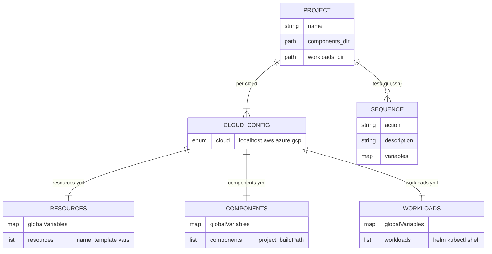
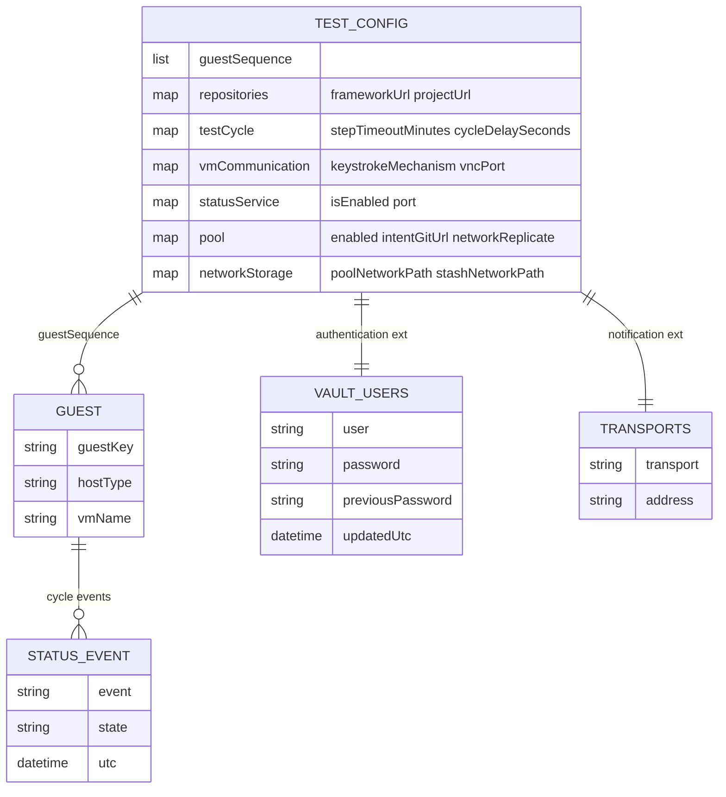

# Configuration data model

> One sentence: the YAML schema the engine and harness read — project deploy
> data and test-harness runtime data — as two entity-relationship views.

See [Design overview](00-index.md) · [Yuruna Architecture](../architecture.md).

Derived from `yuruna-project/{example,template}/<project>/`,
`automation/Set-*` (which read `config/<cloud>/*.yml`), `test/test.config.yml`,
and the `test/extension/authentication` + `notification` vault templates.
No secret values appear here — only field names.

## Project deploy data model

## Test-harness runtime data model

---

Copyright (c) 2019-2026 by Alisson Sol et al.

Last review: 2026.06.19
