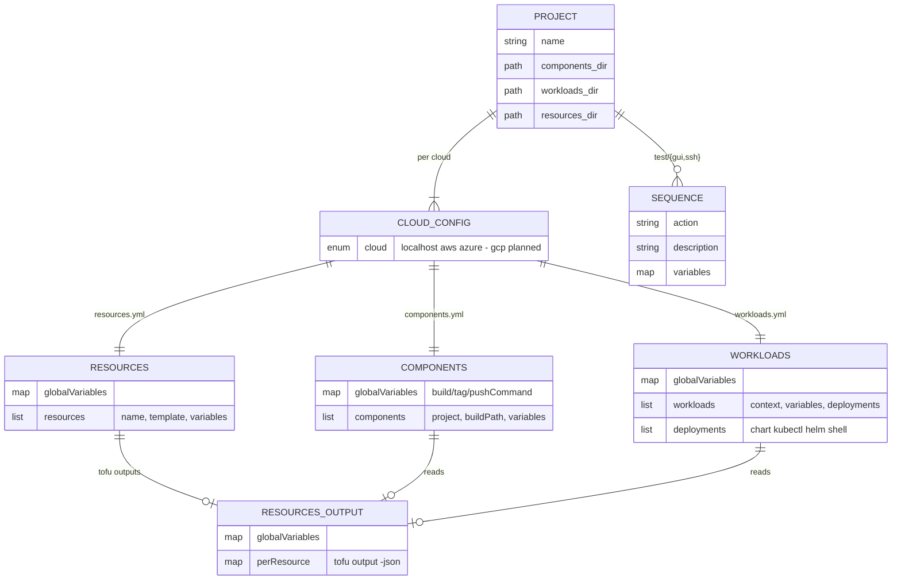
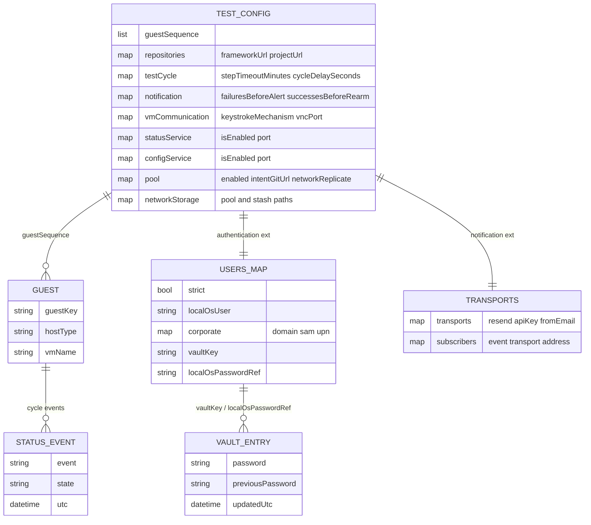

# Configuration data model

> One sentence: the YAML schema the engine and harness read — project deploy
> data and test-harness runtime data — as two entity-relationship views.

See [Design overview](00-index.md) · [Yuruna Architecture](../architecture.md).

Derived from `yuruna-project/{example,template}/<project>/`, the parsing
code in `automation/Yuruna.{Resource,Component,Workload,Validation,DeploymentKind}.psm1`,
`test/test.config.yml.template`, and the `test/extension/{authentication,notification}`
configs validated by `test/schemas/{users,vault,notification.transports}.schema.yml`.
No secret values appear here — only field names.

## Project deploy data model

The relationships the engine relies on: a resource's `template` resolves
to `resources/<template>` with fallback to `global/resources/<template>`;
a component's `buildPath` (default: its `project`) must hold a
`Dockerfile` under `components/<buildPath>`; a deployment's `chart`
resolves under `workloads/<chart>` and requires `variables.installName`.
Deployment kind is detected by which field is present — one of
`chart | kubectl | helm | shell` (`Yuruna.DeploymentKind.psm1`).
`RESOURCES_OUTPUT` is the generated `config/<cloud>/resources.output.yml`:
`Set-Resource` writes it, and both later phases layer it into the
environment (variable precedence: resources output → file
`globalVariables` → item `variables` → deployment `variables`).

## Test-harness runtime data model

`USERS_MAP` (`users.yml`) maps each logical sequence username to a login
identity; its `vaultKey` / `localOsPasswordRef` resolve into `VAULT_ENTRY`
(`vault.yml`, runtime-generated and git-ignored under
`test/status/extension/authentication/`). `TRANSPORTS` (`transports.yml`)
pairs provider credentials (`transports.resend`) with per-event-code
`subscribers` (`cycle.failure`, `config.smoke`, `pool.alert`). Both views
stay within the [≤7 rule](00-index.md#the-7-rule--grouping-decisions):
seven entities in the deploy view, six in the runtime view.

---

LICENSEURI https://yuruna.link/license

Copyright (c) 2019-2026 by Alisson Sol et al.

Last review: 2026.07.22
