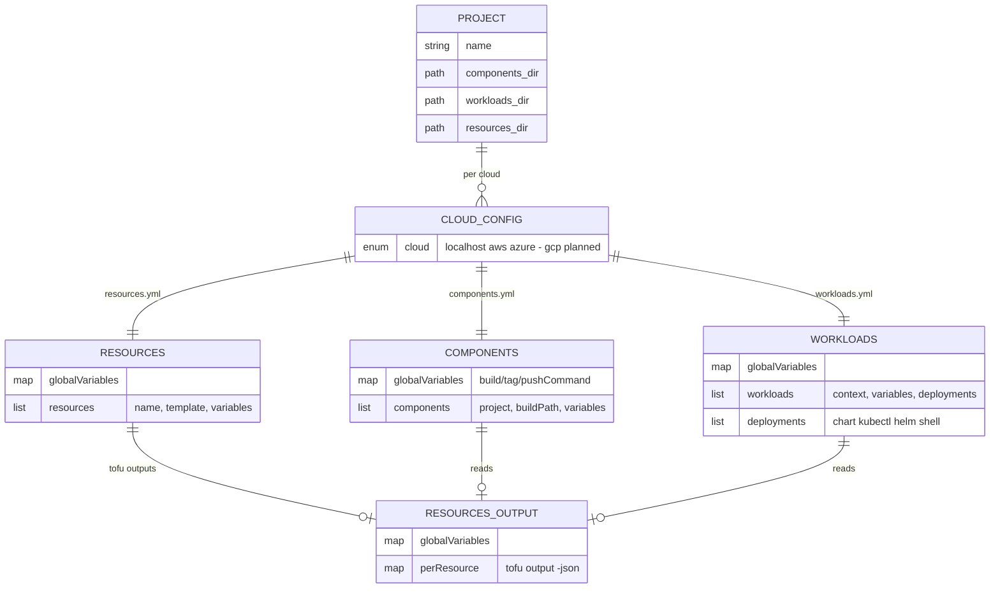
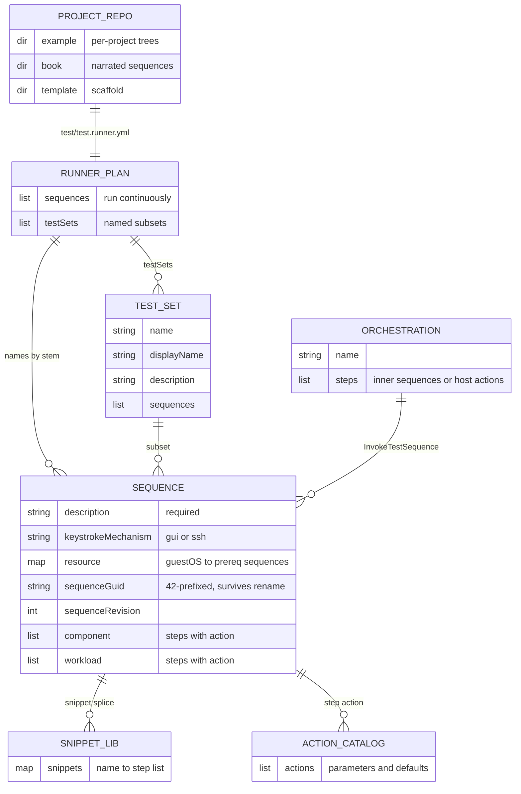
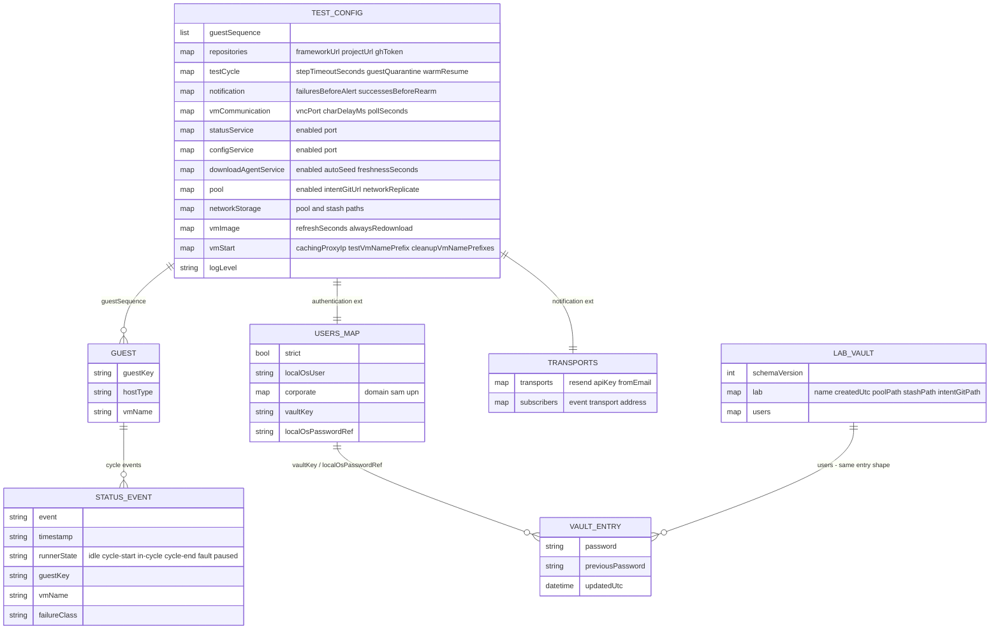
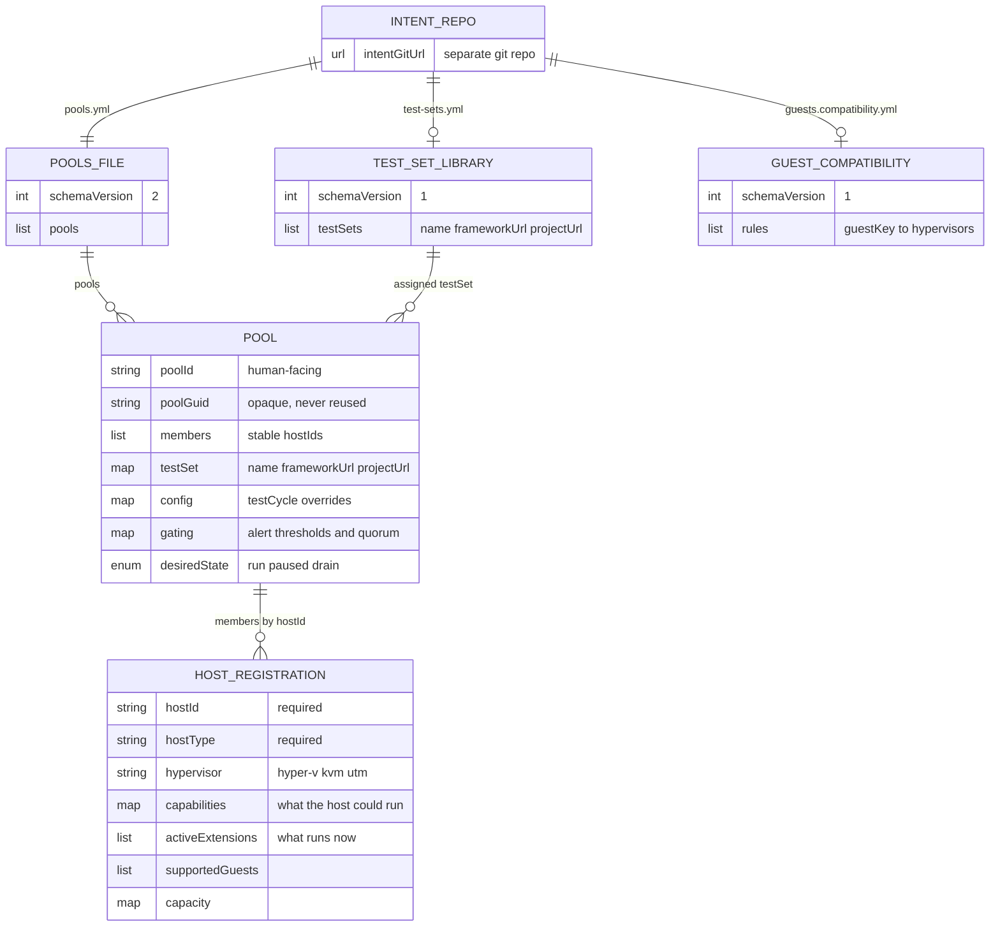

# Configuration data model

> One sentence: the YAML the engine and harness read — project deploy data, the
> project's own cycle plan, harness runtime state, and pool intent — as four
> entity-relationship views.

See [Design overview](00-index.md) · [Yuruna Architecture](../architecture.md).

Derived from `yuruna-project/{example,template,book,test}`, the parsing code in
`automation/Yuruna.{Resource,Component,Workload,Validation,DeploymentKind,VariableExpansion}.psm1`
and `automation/Import.Yaml.psm1`, `test/test.config.yml.template`,
`test/modules/{Test.SequencePlanner,Test.PoolPlanner,Test.Capability}.psm1`, and
the schemas under `test/schemas/`. No secret values appear here — only field
names.

## Project deploy data

```mermaid
erDiagram
    PROJECT ||--o{ CLOUD_CONFIG : "per cloud"
    CLOUD_CONFIG ||--|| RESOURCES : "resources.yml"
    CLOUD_CONFIG ||--|| COMPONENTS : "components.yml"
    CLOUD_CONFIG ||--|| WORKLOADS : "workloads.yml"
    RESOURCES ||--o| RESOURCES_OUTPUT : "tofu outputs"
    COMPONENTS ||--o| RESOURCES_OUTPUT : reads
    WORKLOADS ||--o| RESOURCES_OUTPUT : reads

    PROJECT {
        string name
        path components_dir
        path workloads_dir
        path resources_dir
    }
    CLOUD_CONFIG {
        enum cloud "localhost aws azure - gcp planned"
    }
    RESOURCES {
        map globalVariables
        list resources "name, template, variables"
    }
    COMPONENTS {
        map globalVariables "build/tag/pushCommand"
        list components "project, buildPath, variables"
    }
    WORKLOADS {
        map globalVariables
        list workloads "context, variables, deployments"
        list deployments "chart kubectl helm shell"
    }
    RESOURCES_OUTPUT {
        map globalVariables
        map perResource "tofu output -json"
    }
```

`PROJECT ||--o{ CLOUD_CONFIG` is zero-or-more on purpose: `example/nested.host`
is a shipped, sequence-only project with no `config/` tree at all.
`yuruna-project/template` is itself the scaffold — there is no
`template/<project>` level.

The relationships the engine relies on: a resource's `template` resolves to
`resources/<template>` with fallback to `global/resources/<template>`; a
component's `buildPath` (default: its `project`) must hold a `Dockerfile` under
`components/<buildPath>`; a deployment's `chart` resolves under
`workloads/<chart>` and requires `variables.installName`. Deployment kind is
detected by which field is present — one of `chart | kubectl | helm | shell`.

`RESOURCES_OUTPUT` is the generated `config/<cloud>/resources.output.yml`.
`Yuruna.VariableExpansion.psm1` flattens it into the environment with two rules:
keys under `globalVariables` land under their bare key, while every other
top-level key `R` becomes `R.<outputName>` taking the leaf's `value`. That
flattened `<resource>.<output>` form is what the shipped configs depend on —
`example/website/config/localhost/components.yml` resolves its registry via
`"${env:registryName}.registryLocation"`.

Those top-level keys are also the **deployed-resource inventory**, and teardown
is the third consumer of the file: `Yuruna.Clear.psm1` walks every key except
`globalVariables` and runs `tofu destroy` in the matching
`.yuruna/<cloud>/resources/<resourceName>` work folder. A resource declared with
an empty `template` never appears here — it only names an already-existing
resource and owns no work folder — so the key set is exactly what can be torn
down. There is no `resources:` list in this file; that shape belongs to the
forward `resources.yml`. Teardown deliberately proceeds even when forward
`resources.yml` validation fails, warning instead of stopping: config drift after
deploy must not strand cloud resources.

**Variable precedence differs by phase**, and the two chains differ in their
final layer:

| Phase | Precedence (last wins) |
|---|---|
| Workloads | resources output → workloads `globalVariables` → workload `variables` → deployment `variables` |
| Components | resources output → components `globalVariables` → component `variables` → engine-forced `project` / `buildPath` / `dockerfile` |

The component phase has no deployment layer, and its final layer is
engine-forced: a component that sets `project` under its own `variables:` is
silently overridden.

`Import.Yaml.psm1` is the parse boundary for the resources/components/workloads
entities and their generated output — `ConvertFrom-YAML -Ordered`, throwing when
`powershell-yaml` is absent. Ordered parsing is load-bearing for the precedence
chains, which accumulate into `[ordered]` sinks.

## Project cycle plan and sequences

```mermaid
erDiagram
    PROJECT_REPO ||--|| RUNNER_PLAN : "test/test.runner.yml"
    RUNNER_PLAN ||--o{ TEST_SET : testSets
    RUNNER_PLAN ||--o{ SEQUENCE : "names by stem"
    TEST_SET ||--o{ SEQUENCE : "subset"
    ORCHESTRATION ||--o{ SEQUENCE : InvokeTestSequence
    SEQUENCE ||--o{ SNIPPET_LIB : "snippet splice"
    SEQUENCE ||--o{ ACTION_CATALOG : "step action"

    PROJECT_REPO {
        dir example "per-project trees"
        dir book "narrated sequences"
        dir template "scaffold"
    }
    RUNNER_PLAN {
        list sequences "run continuously"
        list testSets "named subsets"
    }
    TEST_SET {
        string name
        string displayName
        string description
        list sequences
    }
    SEQUENCE {
        string description "required"
        string keystrokeMechanism "gui or ssh"
        map resource "guestOS to prereq sequences"
        string sequenceGuid "42-prefixed, survives rename"
        int sequenceRevision
        list component "steps with action"
        list workload "steps with action"
    }
    ORCHESTRATION {
        string name
        list steps "inner sequences or host actions"
    }
    SNIPPET_LIB {
        map snippets "name to step list"
    }
    ACTION_CATALOG {
        list actions "parameters and defaults"
    }
```

`SEQUENCE` files require `description`, `keystrokeMechanism` and `resource`, and
are `additionalProperties: false`. There is no `gui/` or `ssh/` directory
anywhere: the `ssh` variant of a sequence is a distinct `<name>.ssh.yml` file
carrying `keystrokeMechanism: ssh`. `action` is a **step-level** key inside the
`component:`/`workload:` arrays, not a top-level one, and `sequence.schema.yml`
follows it with a per-action `allOf` chain so each action's own required fields
are enforced (`callExtension` requires `method`, `inputTextAndEnter` requires
`text`, and so on).

The file **name** is a lookup key, not a label: `resource:` prerequisites and
orchestration steps reference sequences by stem, so a rename breaks every chain
that names it. `sequenceGuid` is what survives a rename — `Test.Perf.psm1` stamps
every step row with it so cross-host and cross-cycle analytics still join, and
`sequenceRevision` segments those rows by sequence shape.

`RUNNER_PLAN` is the project repo's `test/test.runner.yml`: the ordered
`sequences:` the runner works through cycle after cycle, plus optional named
`testSets:` — the implicit set `all` always exists and is never declared. A
pooled host can be assigned one named set instead of the whole list.
`ORCHESTRATION` is the local one-shot shape `Invoke-TestSequence.ps1` detects (no
`baseline:`, `InvokeTestSequence` steps) and hands to `Test.Orchestrator`, which
runs every inner sequence under one `status.json` cycle.

`SEQUENCE` files do **not** go through `Import.Yaml.psm1`:
`test/modules/Test.SequenceResolve.psm1` reads them and the snippet library with
a direct `ConvertFrom-Yaml -Ordered`, so they never get that missing-module
throw. A snippet step has the same shape as a sequence step, so snippets may
reference other snippets; both `test/sequences/_snippets.yml` and a project's own
`_snippets.yml` are libraries of the same shape.

## Test-harness runtime data

```mermaid
erDiagram
    TEST_CONFIG ||--o{ GUEST : guestSequence
    TEST_CONFIG ||--|| USERS_MAP : "authentication ext"
    TEST_CONFIG ||--|| TRANSPORTS : "notification ext"
    USERS_MAP ||--o{ VAULT_ENTRY : "vaultKey / localOsPasswordRef"
    LAB_VAULT ||--o{ VAULT_ENTRY : "users - same entry shape"
    GUEST ||--o{ STATUS_EVENT : "cycle events"

    TEST_CONFIG {
        list guestSequence
        map repositories "frameworkUrl projectUrl ghToken"
        map testCycle "stepTimeoutSeconds guestQuarantine warmResume"
        map notification "failuresBeforeAlert successesBeforeRearm"
        map vmCommunication "vncPort charDelayMs pollSeconds"
        map statusService "enabled port"
        map configService "enabled port"
        map downloadAgentService "enabled autoSeed freshnessSeconds"
        map pool "enabled intentGitUrl networkReplicate"
        map networkStorage "pool and stash paths"
        map vmImage "refreshSeconds alwaysRedownload"
        map vmStart "cachingProxyIp testVmNamePrefix cleanupVmNamePrefixes"
        string logLevel
    }
    GUEST {
        string guestKey
        string hostType
        string vmName
    }
    USERS_MAP {
        bool strict
        string localOsUser
        map corporate "domain sam upn"
        string vaultKey
        string localOsPasswordRef
    }
    VAULT_ENTRY {
        string password
        string previousPassword
        datetime updatedUtc
    }
    LAB_VAULT {
        int schemaVersion
        map lab "name createdUtc poolPath stashPath intentGitPath"
        map users
    }
    TRANSPORTS {
        map transports "resend apiKey fromEmail"
        map subscribers "event transport address"
    }
    STATUS_EVENT {
        string event
        string timestamp
        string runnerState "idle cycle-start in-cycle cycle-end fault paused"
        string guestKey
        string vmName
        string failureClass
    }
```

`USERS_MAP` (`users.yml`) maps each logical sequence username to a login
identity; its `vaultKey` / `localOsPasswordRef` resolve into `VAULT_ENTRY`
(`vault.yml`, runtime-generated). Both live under
`test/status/extension/authentication/`. `TRANSPORTS` (`transports.yml`) is
**not** their companion — it is the notification extension's own config (provider
credentials plus per-event-code `subscribers` such as `cycle.failure`,
`config.smoke`, `pool.alert`) and lives under
`test/status/extension/notification/`.

`LAB_VAULT` is a second, differently-shaped vault document written by
`test/New-Lab.ps1` as `lab.<Name>.vault.yml` into that same authentication
folder. It is **not** interchangeable with `vault.yml`: `vault.schema.yml` is
`additionalProperties: false` with `required: [users]`, so a `lab:` node cannot
be added to it; `lab.vault.schema.yml` requires `[schemaVersion, lab, users]`.
Its `users` entries carry the same `password`/`previousPassword`/`updatedUtc`
shape, which is why it is drawn against `VAULT_ENTRY`.

The two are nonetheless expected to **agree on any credential they share**.
`vault.yml` is authoritative — it is what the harness reads — so when a machine
already holds a credential for one of the share accounts, `New-Lab` copies that
value into the new `LAB_VAULT` instead of generating one. The accounts are
machine-wide, so a second lab that minted its own password would produce a lab
vault disagreeing with the OS account, the SMB server, and every machine the
earlier vault was copied to. The vault is also where `Set-LabToken.ps1` deposits
the shared lab-auth-token this host redeemed from the dashboard's rotating code.

`STATUS_EVENT` is the `cycle.events.ndjson` envelope — required fields
`timestamp` and `event` (`timestamp`, not `utc`), with the state fields validated
against the six-value runner enum. The authentication extension writes a
*different* shape to its own `events.log` (`ts`, `event`, `outcome`).

`TEST_CONFIG` has no schema under `test/schemas/`; `test/Test-Config.ps1`
validates it directly, and applies `extension-config.schema.yml` to the committed
`test/extension/{authentication,notification}/*.config.yml` and
`{users,vault,notification.transports}.schema.yml` to the runtime state under
`test/status/extension/`. The service-declaring areas' configs are read by
`Test.ExtensionService.psm1` rather than validated by `Test-Config.ps1`, and
every read there is best-effort and file-only: a malformed manifest reports
nothing rather than throwing, because a discovery nicety must never be able to
fail a bring-up. `lab.vault.schema.yml` documents the lab-vault shape but is
applied by no code path — `New-Lab.ps1` hand-writes that YAML without validating
it.

`extension-config.schema.yml` lets an area's config carry a `service:` block
(`displayName`, `vmName` *or* `hostedIn`, `healthPort`, `healthPath`,
`startScript`, `stopScript`, `markerBaseUrlKey`, `beaconInterval`, `writeGate`).
That block is a **declaration, not runtime state** — it is what lets
`Test.ExtensionService.psm1` enumerate the services a host can start, restart or
paint a dashboard row for without a hardcoded roster. Four areas declare one
today; the rest are code the cycle loads, and returning nothing for those is the
answer rather than a failure.

The `downloadAgentService` block — `enabled`, `autoSeed`, `freshnessSeconds`,
`prefetchLeadSeconds`, `scanIntervalSeconds` — configures a *pool-wide* service
rather than this host, and the pool share is where its data lives. That on-share
layout is in [03-data-flows.md](03-data-flows.md#f-what-lives-on-the-shared-storage);
none of it is in a repo, so none of it is drawn as an entity here.

## Pool intent

```mermaid
erDiagram
    INTENT_REPO ||--|| POOLS_FILE : pools.yml
    INTENT_REPO ||--o| TEST_SET_LIBRARY : test-sets.yml
    INTENT_REPO ||--o| GUEST_COMPATIBILITY : guests.compatibility.yml
    POOLS_FILE ||--o{ POOL : pools
    POOL ||--o{ HOST_REGISTRATION : "members by hostId"
    TEST_SET_LIBRARY ||--o{ POOL : "assigned testSet"

    INTENT_REPO {
        url intentGitUrl "separate git repo"
    }
    POOLS_FILE {
        int schemaVersion "2"
        list pools
    }
    POOL {
        string poolId "human-facing"
        string poolGuid "opaque, never reused"
        list members "stable hostIds"
        map testSet "name frameworkUrl projectUrl"
        map config "testCycle overrides"
        map gating "alert thresholds and quorum"
        enum desiredState "run paused drain"
    }
    TEST_SET_LIBRARY {
        int schemaVersion "1"
        list testSets "name frameworkUrl projectUrl"
    }
    GUEST_COMPATIBILITY {
        int schemaVersion "1"
        list rules "guestKey to hypervisors"
    }
    HOST_REGISTRATION {
        string hostId "required"
        string hostType "required"
        string hypervisor "hyper-v kvm utm"
        map capabilities "what the host could run"
        list activeExtensions "what runs now"
        list supportedGuests
        map capacity
    }
```

`pool.intentGitUrl` points at a **separate git repo**, the live intent store —
`test/pool/` in this repo holds only `examples/`. Membership is one-directional:
`members[]` is the single source of truth for which hosts belong to a pool, and a
host finds its pool by locating its own `hostId` there. At schemaVersion 2 a pool
carries one `testSet` — a *framework/project repo pair*, not a list of sequence
manifests — and `test-sets.yml` is the reusable library the pool-control UI
authors those pairs into. The runner reads only `pools.yml`.

**Registration is not in that repo.** Each host publishes its own record as
`runtime/host.registration.json` over its status service, and the aggregator
polls it; that is why the relationship is drawn from `POOL` to
`HOST_REGISTRATION` rather than the record living under `INTENT_REPO`.
`host.registration.schema.yml` is `additionalProperties: true` — every field past
the required `schemaVersion`/`hostId`/`hostType` set is additive and nullable,
which is how the record also carries `activeExtensions` and `extensionTargets`.
Those two are distinct from `capabilities.extensions`: capabilities says what a
host *could* run and is true of every host, while `activeExtensions` is built by
looping over the per-service runtime markers a host writes at bring-up and
removes at teardown, so it says what is running *now*. That loop is what lets the
dashboard's Extension hosts table populate without the aggregator mounting the
NAS or holding an address store of its own.

`GUEST_COMPATIBILITY` is permissive by construction: a guest with no rule is
allowed everywhere, and folder existence plus capability checks still gate. All
four schemas are in `test/schemas/`; samples are in `test/pool/examples/`.

---

LICENSEURI https://yuruna.link/license

Copyright (c) 2019-2026 by Alisson Sol et al.

Last review: 2026.08.07
