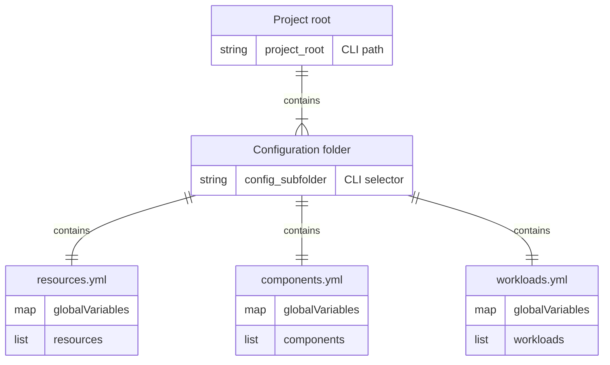
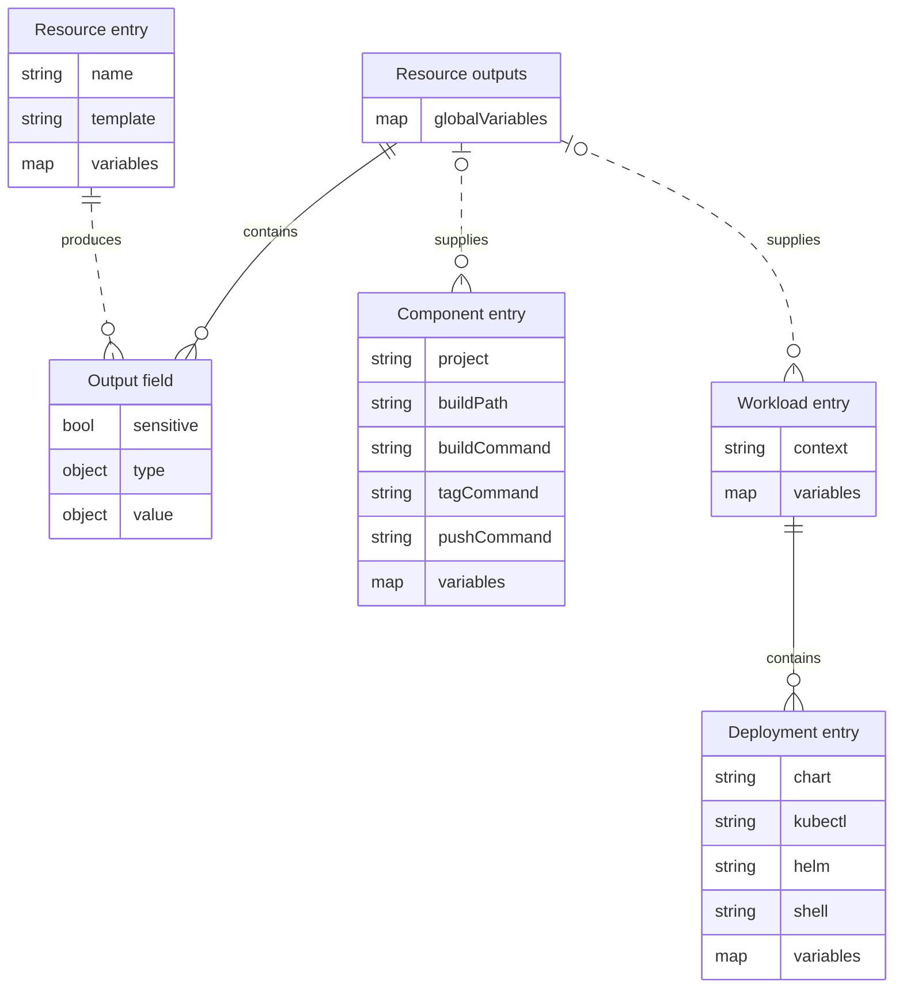
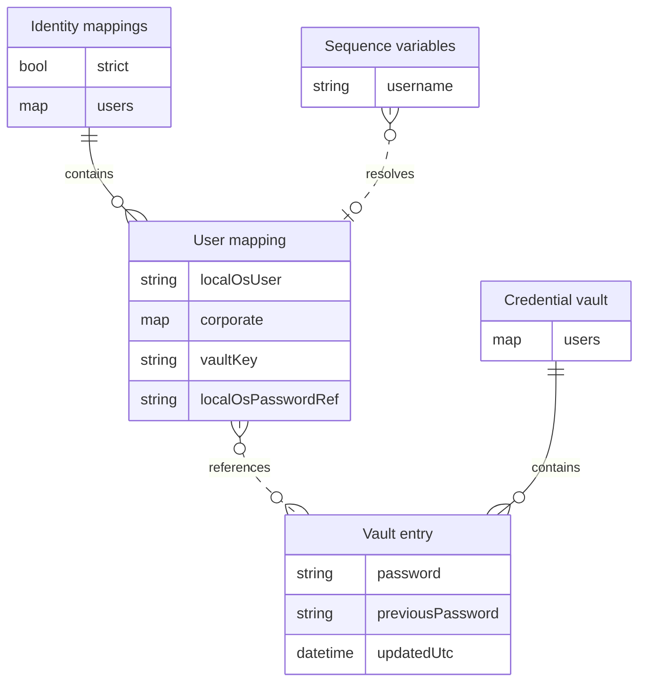

# Configuration data model

This page maps the current project files, deployment keys, generated outputs, and authentication records to their consumers.

The [architecture](../architecture.md) supplies the system-level concepts. These
ER views describe directories, YAML maps, and runtime lookups, not database
tables: solid edges denote file containment; dashed edges denote derived or
lookup relationships. No edge implies a database foreign-key constraint.

## Project and configuration files

The deployment examples live at `yuruna-project/example/<project>/`; the
scaffold itself is `yuruna-project/template/`, without an extra project-name
directory. The website example supplies `localhost`, `aws`, and `azure`
configuration directories. The text-to-sql example and template supply
`localhost`. `example/nested.host/` instead supplies a test sequence; not every
example is a three-phase deployment project. No GCP configuration is present.

```mermaid
erDiagram
    project-root["Project root"] {
        string project_root "CLI path"
    }
    config-subfolder["Configuration folder"] {
        string config_subfolder "CLI selector"
    }
    resources-yml["resources.yml"] {
        map globalVariables
        list resources
    }
    components-yml["components.yml"] {
        map globalVariables
        list components
    }
    workloads-yml["workloads.yml"] {
        map globalVariables
        list workloads
    }
    project-root ||--|{ config-subfolder : contains
    config-subfolder ||--|| resources-yml : contains
    config-subfolder ||--|| components-yml : contains
    config-subfolder ||--|| workloads-yml : contains
```

`project_root` and `config_subfolder` are script arguments, not additional YAML
fields. The three files are required by `Confirm-Configuration`; their contents
are validated by PowerShell code, not by a project JSON Schema. This view groups
the parallel cloud directories into one entity and shows five entities total.

Sources: [website configuration](https://github.com/alissonsol/yuruna-project/tree/main/example/website/config),
[text-to-sql configuration](https://github.com/alissonsol/yuruna-project/tree/main/example/text-to-sql/config),
[template configuration](https://github.com/alissonsol/yuruna-project/tree/main/template/config),
[nested-host sequence](https://github.com/alissonsol/yuruna-project/blob/main/example/nested.host/test/nested.host.yml),
[Test-Configuration.ps1](../../automation/Test-Configuration.ps1), and
[Yuruna.Validation.psm1](../../automation/Yuruna.Validation.psm1).

## Deployment entries and output keys

The six entities below expand the configuration lists and the generated
`config/<cloud>/resources.output.yml`. `name`, `project`, and `context` are the
respective entry identifiers; the validator rejects duplicate raw and expanded
values within the relevant list. They are not foreign keys joining the three
lists: commands and variable expressions carry their runtime dependencies.

```mermaid
erDiagram
    resources["Resource entry"] {
        string name
        string template
        map variables
    }
    resources-output-yml["Resource outputs"] {
        map globalVariables
    }
    resource-output["Output field"] {
        bool sensitive
        object type
        object value
    }
    components["Component entry"] {
        string project
        string buildPath
        string buildCommand
        string tagCommand
        string pushCommand
        map variables
    }
    workloads["Workload entry"] {
        string context
        map variables
    }
    deployments["Deployment entry"] {
        string chart
        string kubectl
        string helm
        string shell
        map variables
    }
    resources ||..o{ resource-output : produces
    resources-output-yml ||--o{ resource-output : contains
    resources-output-yml |o..o{ components : supplies
    resources-output-yml |o..o{ workloads : supplies
    workloads ||--o{ deployments : contains
```

An output field is persisted beneath the expanded resource name and output name:
`<resourceName>: { <outputName>: { sensitive, type, value } }`. Neither name is an
extra leaf field. The file also retains expanded `globalVariables`. Consumers
expose each output value as the environment key `<resourceName>.<outputName>`;
global variable keys remain unprefixed. Output values are imported verbatim,
without evaluating them as PowerShell expressions. Components read the selected
configuration's output file; workloads additionally support a parent-directory
output file when the selected one is absent. The optional cardinality reflects
that consumers permit an absent output file, although expressions can still
require its values to perform useful work.

The source locations are resolved by these concrete fields:

| Field | Consumer resolution |
|---|---|
| Resource `template` | `<project>/resources/<template>` first, then `yuruna/global/resources/<template>`. |
| Component `buildPath` | `<project>/components/<buildPath>`; the publisher falls back to `project` when omitted. |
| Workload `context` | Expanded name of an existing Kubernetes context; it also selects the workload work directory. |
| Deployment `chart` | `<project>/workloads/<chart>` copied into an `<installName>` folder under the workload work directory. |
| Deployment `variables.installName` | Required Helm release name for a chart; duplicates within one context are rejected. |

Component build, tag, and push commands may be supplied on the entry or inherited
from its file's `globalVariables`. Its merged variable bag layers resource
outputs, component globals, and component locals. Workload rendering layers
resource outputs, workload globals, workload locals, and deployment locals.
Later layers replace earlier values. The four deployment command fields in the
diagram are alternatives, not four required fields. The current kind resolver
selects `chart` when present; otherwise the last populated kind in registration
order (`kubectl`, `helm`, `shell`) wins. YAML declaration order preserves the
deployment sequence.

Sources: [website resources](https://github.com/alissonsol/yuruna-project/blob/main/example/website/config/localhost/resources.yml),
[website components](https://github.com/alissonsol/yuruna-project/blob/main/example/website/config/localhost/components.yml),
[website workloads](https://github.com/alissonsol/yuruna-project/blob/main/example/website/config/localhost/workloads.yml),
[Yuruna.Resource.psm1](../../automation/Yuruna.Resource.psm1),
[Yuruna.Component.psm1](../../automation/Yuruna.Component.psm1),
[Yuruna.Workload.psm1](../../automation/Yuruna.Workload.psm1),
[Yuruna.VariableExpansion.psm1](../../automation/Yuruna.VariableExpansion.psm1),
[Yuruna.DeploymentKind.psm1](../../automation/Yuruna.DeploymentKind.psm1), and
[Yuruna.Validation.psm1](../../automation/Yuruna.Validation.psm1).

## Secrets and authentication are separate contracts

Deployment configuration has optional `config/<cloud>/secrets/*.txt` files;
workload validation also checks `config/secrets/*.txt`. Existing whitespace-only
files block workload validation, while resource validation only reports them.
These checks do not turn files into authentication-vault records or implicitly
inject their contents into every deployment. Project-specific variable
expressions and commands remain responsible for consuming secret material. For
example, the website workload explicitly creates Kubernetes TLS and registry
secrets through its `kubectl` deployment entries.

The harness authentication extension has a separate pair of persisted YAML
maps, `test/status/extension/authentication/users.yml` and `vault.yml`. The
committed `test/extension/authentication/users.yml.template` initializes the
identity map. This five-entity view shows the lookup boundary; the diagram does
not assert that project deployment entries own these credentials.

```mermaid
erDiagram
    sequence-variables["Sequence variables"] {
        string username
    }
    users-yml["Identity mappings"] {
        bool strict
        map users
    }
    user-mapping["User mapping"] {
        string localOsUser
        map corporate
        string vaultKey
        string localOsPasswordRef
    }
    vault-yml["Credential vault"] {
        map users
    }
    vault-entry["Vault entry"] {
        string password
        string previousPassword
        datetime updatedUtc
    }
    users-yml ||--o{ user-mapping : contains
    sequence-variables }o..o| user-mapping : resolves
    user-mapping }o..o{ vault-entry : references
    vault-yml ||--o{ vault-entry : contains
```

The identity-map key is the logical sequence username; the vault-map key is the
resolved credential key. Both are YAML map keys, not extra fields within an
entry. The optional mapping edge reflects the non-strict local-user fallback;
strict configuration validation requires declarations and populated `vaultKey`
credentials. `corporate` contains `domain`, `sam`, and `upn`; the resolver prefers
`domain\sam`, then a bare `sam`, then UPN, then the local identity when
constructing `loginUser`.

`Get-Password` uses `vaultKey`, falling back to the logical username when empty.
It may create a missing fallback credential but refuses to invent a password for
an explicit `vaultKey`. `Get-LocalOsPassword` independently uses
`localOsPasswordRef`, also falling back to the logical username; this function
can generate a missing local-OS credential even for an explicit reference.
Consequently one mapping can reference two different entries, and multiple
users can share an entry. `previousPassword` records a prior value after an
explicit rotation. The runtime retains the plaintext vault across cycles;
initialization reuses it rather than wiping it after a successful cycle.

Sources: [project secret validation](../../automation/Yuruna.Validation.psm1),
[website secret commands](https://github.com/alissonsol/yuruna-project/blob/main/example/website/config/localhost/workloads.yml),
[users schema](../../test/schemas/users.schema.yml),
[vault field schema](../../test/schemas/vault.schema.yml),
[identity-map template](../../test/extension/authentication/users.yml.template),
[authentication implementation](../../test/extension/authentication/default.psm1),
[sequence identity substitution](../../test/modules/Test.SequenceEngine.psm1), and
[cycle completion](../../test/modules/Test.RunnerInnerLoop.psm1).

---

Back to [Architecture](../architecture.md) | [Design overview](README.md)
