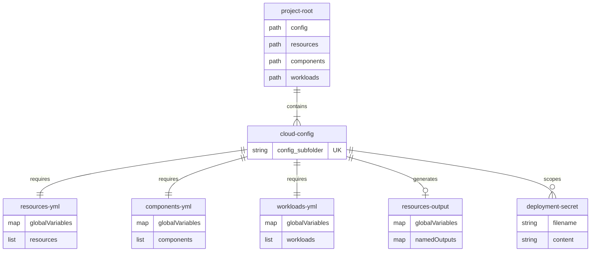
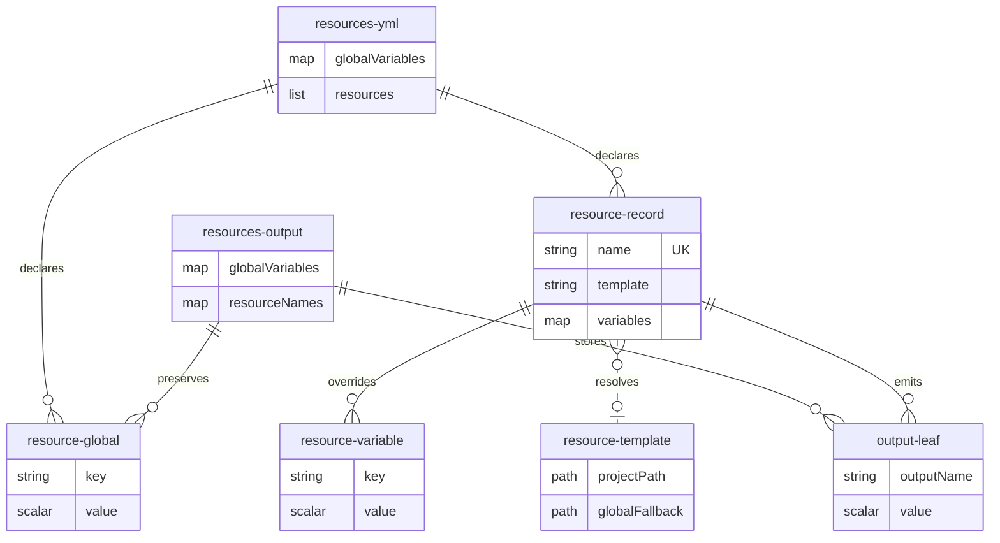
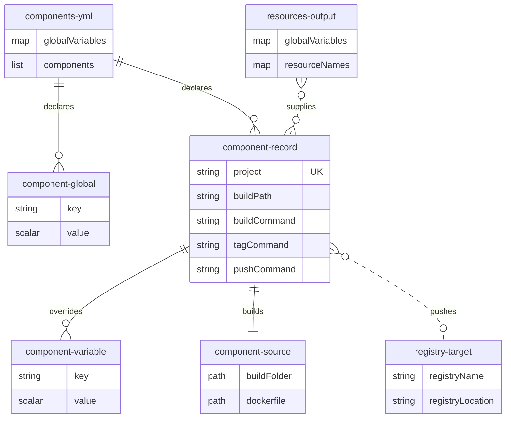
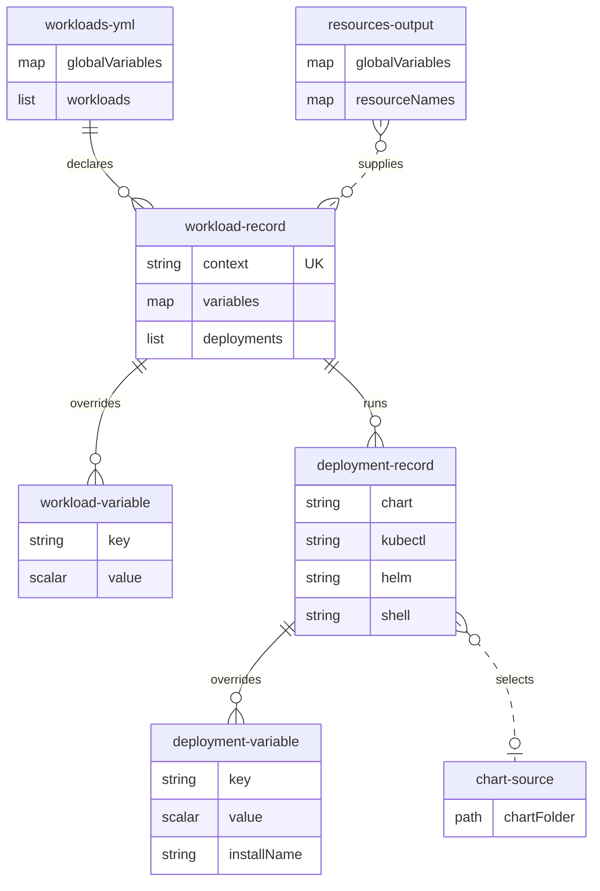
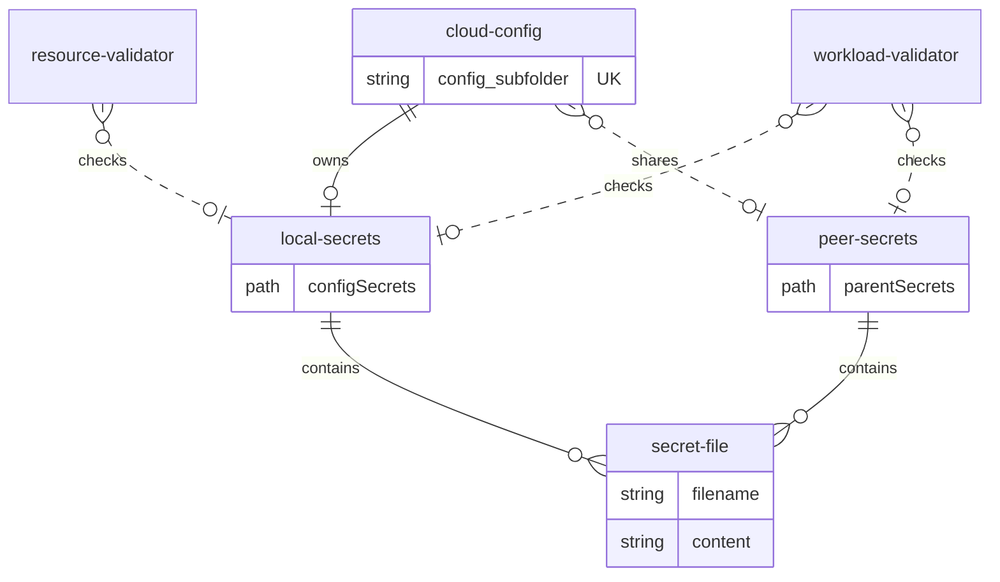
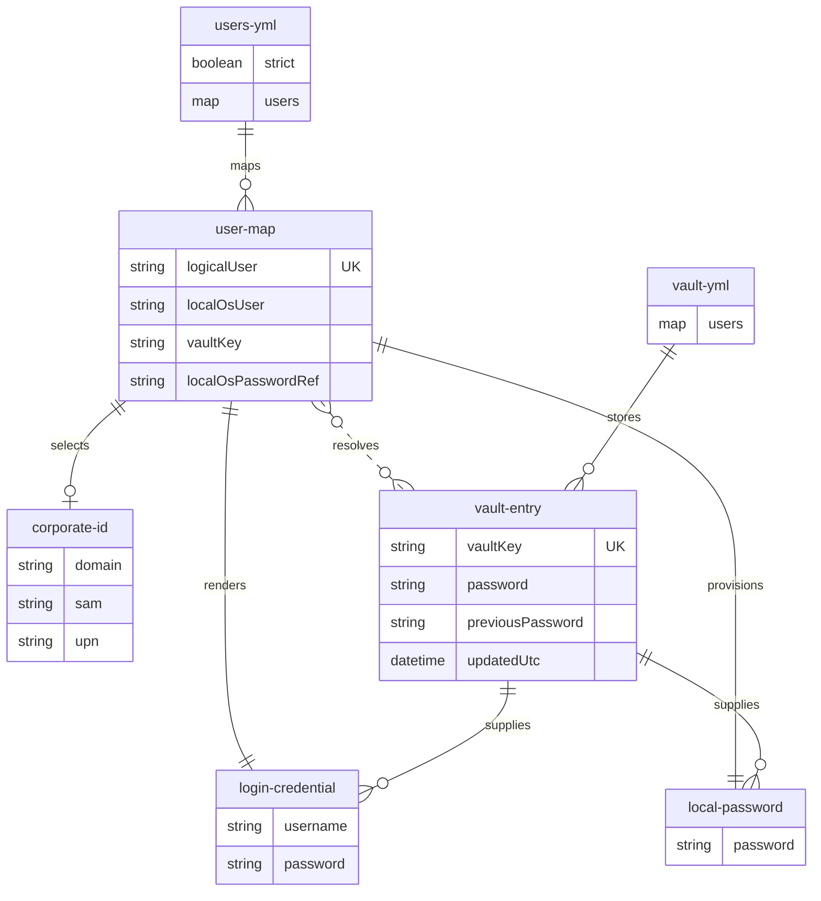

# Configuration data model

This page maps the current project configuration, generated resource outputs, deployment-secret checks, and test-authentication credential lookups.

Phase-record attributes name keys read by the validators and publishers.
Directory, output, secret-file, and resolved-credential entities describe logical
fields rather than additional authored YAML keys. Entity identifiers use stable
kebab-case source names, which Mermaid accepts directly, and every diagram stays
within the seven-entity limit.

## Project and environment

```mermaid
erDiagram
    project-root ||--|{ cloud-config : contains
    cloud-config ||--|| resources-yml : requires
    cloud-config ||--|| components-yml : requires
    cloud-config ||--|| workloads-yml : requires
    cloud-config ||--o| resources-output : generates
    cloud-config ||--o{ deployment-secret : scopes

    project-root {
        path config
        path resources
        path components
        path workloads
    }
    cloud-config {
        string config_subfolder UK
    }
    resources-yml {
        map globalVariables
        list resources
    }
    components-yml {
        map globalVariables
        list components
    }
    workloads-yml {
        map globalVariables
        list workloads
    }
    resources-output {
        map globalVariables
        map namedOutputs
    }
    deployment-secret {
        string filename
        string content
    }
```

Each entry point resolves a project root and one existing
`config/<config_subfolder>` directory. Full validation then expects
`resources.yml`, `components.yml`, and `workloads.yml`; the resource phase can
create `resources.output.yml` beside them. The project source directories are
separate peers selected by paths inside those YAML records. Sources:
[root resolution](../../automation/Yuruna.LogLevel.psm1),
[configuration validation](../../automation/Yuruna.Validation.psm1),
[project scaffold](https://github.com/alissonsol/yuruna-project/tree/main/template),
and the scaffold's [localhost configuration](https://github.com/alissonsol/yuruna-project/tree/main/template/config/localhost).

`config_subfolder` is not a hard-coded cloud enum. The checked-in project
configurations cover localhost, AWS, and Azure, while the framework's shared
resource templates also contain only those three families. GCP's current
checked-in capability is narrower: a GCP credential placeholder exists and the
registry provider can log in to Google Artifact Registry, but there is no GCP
project configuration or shared GCP resource-template family. Thus GCP registry
authentication is implemented, while out-of-box GCP infrastructure deployment
is not. Sources: [website configurations](https://github.com/alissonsol/yuruna-project/tree/main/example/website/config),
[text-to-SQL configurations](https://github.com/alissonsol/yuruna-project/tree/main/example/text-to-sql/config),
[shared resource templates](../../global/resources),
[GCP credential placeholder](../../global/config/gcp/gcp-access-key.json), and
[registry providers](../../automation/Yuruna.CredentialProvider.psm1).

## Resource records

```mermaid
erDiagram
    resources-yml ||--o{ resource-global : declares
    resources-yml ||--o{ resource-record : declares
    resource-record ||--o{ resource-variable : overrides
    resource-record }o..o| resource-template : resolves
    resources-output ||--o{ resource-global : preserves
    resources-output ||--o{ output-leaf : stores
    resource-record ||--o{ output-leaf : emits

    resources-yml {
        map globalVariables
        list resources
    }
    resource-global {
        string key
        scalar value
    }
    resource-record {
        string name UK
        string template
        map variables
    }
    resource-variable {
        string key
        scalar value
    }
    resource-template {
        path projectPath
        path globalFallback
    }
    resources-output {
        map globalVariables
        map resourceNames
    }
    output-leaf {
        string outputName
        scalar value
    }
```

`resources` must be present, every record needs a `name`, and raw and expanded
names must be unique. `template` selects `resources/<template>` in the project
first and `global/resources/<template>` second; an empty template represents a
named pre-existing resource. Optional record variables must have non-empty
values. Sources: [resource validation](../../automation/Yuruna.Validation.psm1)
and the project [resource scaffold](https://github.com/alissonsol/yuruna-project/blob/main/template/config/localhost/resources.yml).

The publisher expands globals once, overlays each resource's variables, writes
the merged values to `terraform.tfvars`, and stages a separate work directory
under `.yuruna/<config>/resources/<name>`. A templated resource must expose at
least one OpenTofu output. The generated `resources.output.yml` preserves the
expanded globals and stores each resource's raw output object under its expanded
resource name. Sources: [resource publisher](../../automation/Yuruna.Resource.psm1)
and [localhost templates](../../global/resources/localhost).

Downstream readers flatten a non-global output as
`<resourceName>.<outputName>` and use its `value`; output values are transferred
without another PowerShell expansion. `globalVariables` remains flat. Source:
[variable expansion](../../automation/Yuruna.VariableExpansion.psm1).

## Component records

```mermaid
erDiagram
    components-yml ||--o{ component-global : declares
    components-yml ||--o{ component-record : declares
    component-record ||--o{ component-variable : overrides
    resources-output }o..o{ component-record : supplies
    component-record ||--|| component-source : builds
    component-record }o..o| registry-target : pushes

    components-yml {
        map globalVariables
        list components
    }
    component-global {
        string key
        scalar value
    }
    component-record {
        string project UK
        string buildPath
        string buildCommand
        string tagCommand
        string pushCommand
    }
    component-variable {
        string key
        scalar value
    }
    resources-output {
        map globalVariables
        map resourceNames
    }
    component-source {
        path buildFolder
        path dockerfile
    }
    registry-target {
        string registryName
        string registryLocation
    }
```

Every component record requires a unique `project`. `buildPath` defaults to
`project`; the publisher resolves it below `components/` and accepts
`Dockerfile`, `dockerfile`, or `<project>-dockerfile`. Effective `buildCommand`,
`tagCommand`, and `pushCommand` values are required, with record values taking
precedence over globals. `preProcessor` and `postProcessor` are optional values
resolved from component variables first and globals second. Sources:
[component validation](../../automation/Yuruna.Validation.psm1),
[component publisher](../../automation/Yuruna.Component.psm1), and the project
[component scaffold](https://github.com/alissonsol/yuruna-project/blob/main/template/config/localhost/components.yml).

For each component, the effective environment is layered in this order:
resource output, component globals, component variables, then the derived
`project`, `buildPath`, and `dockerfile` values. The registry target is obtained
through `registryName` and the flattened
`<registryName>.registryLocation` resource output before the image push. Sources:
[component publisher](../../automation/Yuruna.Component.psm1),
[variable expansion](../../automation/Yuruna.VariableExpansion.psm1), and
[registry dispatch](../../automation/Yuruna.Component.Registry.psm1).

## Workload records

```mermaid
erDiagram
    workloads-yml ||--o{ workload-record : declares
    workload-record ||--o{ workload-variable : overrides
    workload-record ||--o{ deployment-record : runs
    deployment-record ||--o{ deployment-variable : overrides
    deployment-record }o..o| chart-source : selects
    resources-output }o..o{ workload-record : supplies

    workloads-yml {
        map globalVariables
        list workloads
    }
    workload-record {
        string context UK
        map variables
        list deployments
    }
    workload-variable {
        string key
        scalar value
    }
    deployment-record {
        string chart
        string kubectl
        string helm
        string shell
    }
    deployment-variable {
        string key
        scalar value
        string installName
    }
    chart-source {
        path chartFolder
    }
    resources-output {
        map globalVariables
        map resourceNames
    }
```

Each workload requires a unique expanded `context` and contains an ordered
deployment list. Authored configurations use one non-empty `chart`, `kubectl`,
`helm`, or `shell` key per deployment. If several are present, the resolver
chooses `chart`; otherwise the last registered non-chart key wins. Chart
deployments resolve `workloads/<chart>` and require
`variables.installName`; release names must be unique within their context.
The other three keys hold the command text that the matching tool runner
executes. Sources: [workload validation](../../automation/Yuruna.Validation.psm1),
[deployment-kind catalog](../../automation/Yuruna.DeploymentKind.psm1), and the
project [workload scaffold](https://github.com/alissonsol/yuruna-project/blob/main/template/config/localhost/workloads.yml).

Workload values layer resource output, workload globals, workload variables,
and deployment variables, with the later layer winning. The normal resource
output is adjacent to `workloads.yml`; when absent, the publisher can reuse the
parent configuration's `resources.output.yml`. Chart values are rendered to
`values.yaml`; command deployments receive the same merged values through the
environment. Source: [workload publisher](../../automation/Yuruna.Workload.psm1).

## Deployment secret files

```mermaid
erDiagram
    cloud-config ||--o| local-secrets : owns
    cloud-config }o..o| peer-secrets : shares
    local-secrets ||--o{ secret-file : contains
    peer-secrets ||--o{ secret-file : contains
    resource-validator }o..o| local-secrets : checks
    workload-validator }o..o| local-secrets : checks
    workload-validator }o..o| peer-secrets : checks

    cloud-config {
        string config_subfolder UK
    }
    local-secrets {
        path configSecrets
    }
    peer-secrets {
        path parentSecrets
    }
    secret-file {
        string filename
        string content
    }
```

The validator scans immediate `*.txt` children of
`config/<config_subfolder>/secrets`. Resource validation reports empty content
but continues; workload validation rejects empty or whitespace-only content and
also checks `config/<config_subfolder>/../secrets` for a shared parent-level
set. Missing secret directories are valid. The validator also marks discovered
files `assume-unchanged`. Source: [secret validation](../../automation/Yuruna.Validation.psm1).

These files currently have a validation relationship only. The three
publishers build their effective values from phase YAML, generated resource
output, and derived fields; none implicitly maps a secret filename or its
content into the phase environment. Any command that reads a file must name
that behavior explicitly. Sources: [resource publisher](../../automation/Yuruna.Resource.psm1),
[component publisher](../../automation/Yuruna.Component.psm1),
[workload publisher](../../automation/Yuruna.Workload.psm1), and
[variable expansion](../../automation/Yuruna.VariableExpansion.psm1).

## Authentication vault

```mermaid
erDiagram
    users-yml ||--o{ user-map : maps
    user-map ||--o| corporate-id : selects
    user-map }o..o{ vault-entry : resolves
    vault-yml ||--o{ vault-entry : stores
    user-map ||--|| login-credential : renders
    user-map ||--|| local-password : provisions
    vault-entry ||--o{ login-credential : supplies
    vault-entry ||--o{ local-password : supplies

    users-yml {
        boolean strict
        map users
    }
    user-map {
        string logicalUser UK
        string localOsUser
        string vaultKey
        string localOsPasswordRef
    }
    corporate-id {
        string domain
        string sam
        string upn
    }
    vault-yml {
        map users
    }
    vault-entry {
        string vaultKey UK
        string password
        string previousPassword
        datetime updatedUtc
    }
    login-credential {
        string username
        string password
    }
    local-password {
        string password
    }
```

`users.yml` maps a sequence-level logical user to a local OS user, an optional
corporate identity, and two independent vault references. Login identity prefers
`DOMAIN\\sam`, then `sam`, then `upn`, and finally the local OS name. In strict
mode, configuration validation rejects sequence users missing from the map and
populated `vaultKey` values missing from the vault. Sources:
[users schema](../../test/schemas/users.schema.yml),
[users template](../../test/extension/authentication/users.yml.template),
[mapping implementation](../../test/extension/authentication/default.psm1), and
[configuration gate](../../test/Test-Config.ps1).

An empty `vaultKey` resolves to the logical user key and permits lazy password
generation; a populated `vaultKey` requires an operator-supplied entry and
throws if it is absent. `localOsPasswordRef` independently selects the password
seeded into the guest's local account; an empty reference again uses the logical
key, and this local path may generate a missing value. `Get-LoginCredential`
combines the resolved login identity and login password. Sources:
[authentication extension](../../test/extension/authentication/default.psm1)
and [vault schema](../../test/schemas/vault.schema.yml).

Each vault entry stores `password`, `updatedUtc`, and an optional
`previousPassword`; password rotation moves the outgoing value into that prior
field. The current runner intentionally preserves `vault.yml` across cycles,
despite the older per-cycle wording still present in the schema description.
Sources: [vault writes](../../test/extension/authentication/default.psm1),
[runner completion](../../test/modules/Test.RunnerInnerLoop.psm1), and
[vault schema](../../test/schemas/vault.schema.yml).

The authentication vault is separate from project deployment-secret folders:
the authentication extension consumes `users.yml` and `vault.yml`, while deploy
validation only inspects the project `*.txt` files. There is no implicit
credential transfer between the two models. Sources:
[authentication extension](../../test/extension/authentication/default.psm1)
and [deployment validation](../../automation/Yuruna.Validation.psm1).

---

[Architecture](../architecture.md) | [Design overview](README.md)
