# Configuration data model

> One sentence: every YAML and JSON document the deploy engine and the test
> harness actually parse, as fourteen entity-relationship views across five areas.

See [Design overview](00-index.md) - [Context and components](01-context-and-components.md) -
[Component breakdown](02-component-breakdown.md) - [Data flows](03-data-flows.md) -
[Lifecycle state](04-lifecycle-state.md) - [Deployment topology](06-deployment.md) -
[Naming conventions](naming.md) - [Yuruna Architecture](../architecture.md).

Derived from the deploy parsers `automation/Yuruna.Resource.psm1`,
`automation/Yuruna.Component.psm1`, `automation/Yuruna.Workload.psm1`,
`automation/Yuruna.Validation.psm1`, `automation/Yuruna.DeploymentKind.psm1`,
`automation/Yuruna.VariableExpansion.psm1`, `automation/Yuruna.Result.psm1` and
`automation/Import.Yaml.psm1`; the version-floor list
`automation/Yuruna.Requirement.yml` with its reader
`automation/Yuruna.Requirement.psm1`; the project trees under `yuruna-project/`;
`test/test.config.yml.template` with its reader `test/modules/Test.Config.psm1`;
the plan reader `test/modules/Test.SequencePlanner.psm1`; the runtime writers
`test/modules/Test.RunnerState.psm1`, `test/modules/Test.Log.psm1`,
`test/modules/Test.Perf.psm1`, `test/modules/Test.Capability.psm1`,
`test/modules/Test.PoolSync.psm1`, `test/modules/Test.PoolStorage.psm1`,
`test/modules/Test.HostIdentity.psm1`,
`test/modules/Test.SequenceFailureState.psm1`,
`test/modules/Test.GuestQuarantine.psm1`, `test/modules/Test.LabHealth.psm1` and
the atomic-write primitive `test/modules/Test.StateFile.psm1`; the vault provider
`test/extension/authentication/default.psm1`; and the thirteen JSON Schemas under
`test/schemas/`. Only field names appear here, never a value from a live vault or
secrets file.

**How to read the diagrams.** A solid edge is containment or generation that one
parser enforces on its own. A dashed edge is a cross-store join -- two documents
that agree by name or through an environment variable, with no single parser
checking both ends. Cardinality is crow's foot: `||` exactly one, `|{` one or
more, `o{` zero or more, `o|` zero or one. Boxes carry artifact names; the path
each box maps to is named in the prose under the diagram. A key appears in a
Fields table only when a parser reads it, and the reading module is named beside
it.

## Project deploy data

A project is one directory in the `yuruna-project` data repository.
`yuruna-project/template/` is the scaffold an operator copies;
`yuruna-project/example/website/`, `yuruna-project/example/text-to-sql/` and
`yuruna-project/example/nested.host/` are the shipped examples, and
`yuruna-project/book/` carries chapter sequences. Only three of those five hold a
deploy tree: `find` over the repository returns exactly
`example/website/config/`, `example/text-to-sql/config/` and `template/config/`,
so the three deploy phases never run for `example/nested.host/` or `book/`.

**The config folder.** Everything the three phase scripts read is addressed as
`<project_root>/config/<config_subfolder>/<file>`, with both halves supplied on
the command line.

```mermaid
erDiagram
    Project ||--o{ ConfigEnv : "one folder per cloud"
    ConfigEnv ||--|| resources_yml : "requires"
    ConfigEnv ||--|| components_yml : "requires"
    ConfigEnv ||--|| workloads_yml : "requires"
    ConfigEnv ||--o| resources_output_yml : "apply pass generates"
    ConfigEnv ||--o| SecretsFolder : "may hold"
    resources_output_yml }o..o| components_yml : "supplies env values"
    resources_output_yml }o..o| workloads_yml : "supplies env values"
    %% the two dashed joins are unchecked: no parser verifies that an
    %% env reference names a leaf the resources phase actually produced
```

Boxes on disk. `Project` is `<project_root>/`, defaulting to the current
directory. `ConfigEnv` is `<project_root>/config/<config_subfolder>/`; the
shipped values are `aws`, `azure` and `localhost`, and the name is free-form
because it is only a path segment. `resources_yml`, `components_yml` and
`workloads_yml` are `resources.yml`, `components.yml` and `workloads.yml` in that
folder. `resources_output_yml` is the generated `resources.output.yml` beside
them; the workload publisher also falls back to
`config/<cloud>/../resources.output.yml` so a phased deployment can share one
output file. `SecretsFolder` is `config/<cloud>/secrets/*.txt`, with a peer
`config/secrets/*.txt` that the workload validator checks as well; no project in
`yuruna-project` ships either folder today, which is why the validator treats an
absent one as success.

### Relationships

| From | To | Cardinality | What the parser does |
|---|---|---|---|
| Project | ConfigEnv | 1 to 0..N | `Confirm-FolderList` (`automation/Yuruna.Validation.psm1`) rejects a null or empty root and requires `config/<subfolder>` to resolve. One folder per target cloud: `example/website/config/` holds `aws`, `azure` and `localhost`; `example/text-to-sql/config/` and `template/config/` hold `localhost` only. |
| ConfigEnv | resources_yml | 1 to exactly 1 | The join is fixed, not configurable. `Confirm-ResourceList` and `Publish-ResourceListHelper` both build `config/$config_subfolder/resources.yml`; an absent file returns a manifest with `failureClass = config_error`. |
| ConfigEnv | components_yml | 1 to exactly 1 | Same fixed join in `Confirm-ComponentList` and `Publish-ComponentList`; absent is `config_error`. |
| ConfigEnv | workloads_yml | 1 to exactly 1 | Same in `Confirm-WorkloadList` and `Publish-WorkloadList`. |
| ConfigEnv | resources_output_yml | 1 to 0..1 | Created with `New-Item -Force` on the apply pass only, then appended to per resource. `Confirm-ResourceOutputList` returns valid when the file is absent, so a components-only or workloads-only run legitimately has none. |
| ConfigEnv | SecretsFolder | 1 to 0..1 | `Invoke-SecretFolderValidation` returns success when the folder does not exist. Whitespace-only content is informational for resources and blocking for workloads, which pass `-RequireNonEmpty`. |
| resources_output_yml | components_yml, workloads_yml | cross-store | `Set-ExpandedResourcesOutput` pushes every flattened leaf to `Env:` before the later variable layers run. No parser checks that a `${env:...}` reference in a command string names a leaf that exists; a miss expands to the empty string. |

### Fields

| Field | Type | Read or written by |
|---|---|---|
| `-project_root` | string (command line) | All three publishers and `Confirm-FolderList`; `Resolve-YurunaRootSet` exports `Env:yuruna_root`, `Env:project_root` and `Env:config_root` for the tofu and helm child processes. |
| `-config_subfolder` | string (command line) | The same three publishers; it is the only variable segment in every deploy path. |
| `globalVariables` | map string to string | `Confirm-GlobalVariableList` (`automation/Yuruna.Validation.psm1`) rejects any empty value in all three files. |
| `resources` | list | `automation/Yuruna.Resource.psm1`. |
| `components` | list | `automation/Yuruna.Component.psm1`. |
| `workloads` | list | `automation/Yuruna.Workload.psm1`. |
| `<secret>.txt` body | string (raw) | `Invoke-SecretFolderValidation` reads it with `Get-Content -Raw` and runs `git update-index --assume-unchanged` on each file so a locally edited secret makes no `git status` noise. |

There is no JSON Schema for the three deploy files. `Yuruna.Validation.psm1` is
the whole contract, which is why it restates every rule the publishers rely on.
`ConvertFrom-File` in `automation/Import.Yaml.psm1` is the single YAML entry
point for the deploy engine (`ConvertFrom-YAML -Ordered`, with a throwing guard
when `powershell-yaml` is missing), and its `Find-KeyValue` returns `$null`
rather than the empty string for an absent key so "absent" stays distinguishable
from "empty".

Every publisher returns the same result manifest from `New-YurunaResultManifest`
(`automation/Yuruna.Result.psm1`): `success` (bool), `skipped` (bool),
`errorMessage` (string), `failureClass` (validated set
`ok`, `config_error`, `cluster_unreachable`, `chart_invalid`, `tool_failed`,
`unknown`), `exitCode` (int), `durationMs` (long) and `artifacts`
(hashtable array).

**Resources.** The first phase turns declarations into OpenTofu runs and writes
their outputs back as the only channel into the other two phases.

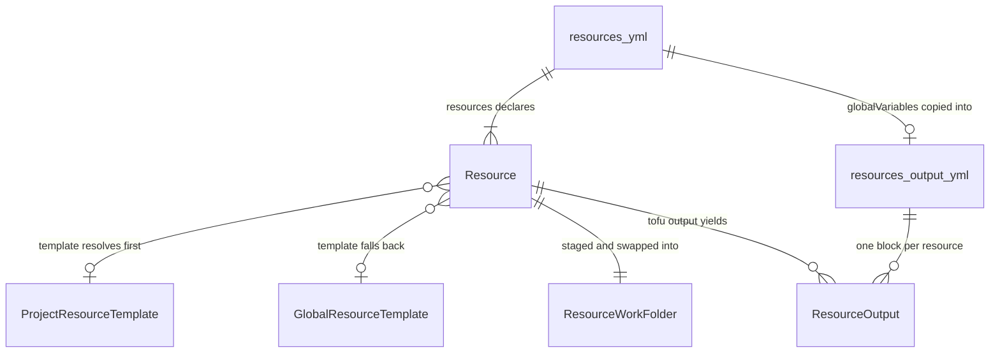
```mermaid
erDiagram
    resources_yml ||--|{ Resource : "resources declares"
    Resource }o--o| ProjectResourceTemplate : "template resolves first"
    Resource }o--o| GlobalResourceTemplate : "template falls back"
    Resource ||--|| ResourceWorkFolder : "staged and swapped into"
    Resource ||--o{ ResourceOutput : "tofu output yields"
    resources_output_yml ||--o{ ResourceOutput : "one block per resource"
    resources_yml ||--o| resources_output_yml : "globalVariables copied into"
```

Boxes on disk. `ProjectResourceTemplate` is
`<project_root>/resources/<template>`; `GlobalResourceTemplate` is
`<yuruna_root>/global/resources/<template>`. The shipped global set is ten
directories under three provider roots: `aws/eks-cluster`, `aws/registry`,
`azure/aks-cluster`, `azure/postgresql`, `azure/registry`,
`azure/resource-group`, `azure/storage-share`, `azure/vm-linux`,
`localhost/context-copy` and `localhost/registry`. Both example projects'
`resources/` directories contain nothing but a `placeholder` file, so every
template they name resolves from the global fallback.

`ResourceWorkFolder` is
`<project_root>/.yuruna/<cloud>/resources/<resourceName>/`, holding
`.workfolder.complete` (a UTC round-trip timestamp written after the staging
swap), `terraform.tfvars`, `tofu.stderr.log`, `tofu.rc`, `tofu.planfile` and the
carried-over `.terraform/` plus `.terraform.lock.hcl`. Its siblings
`<resourceName>.new` and `<resourceName>.old` are the staging and swap-backup
folders: when `<resourceName>` is absent and `.old` exists, the helper moves
`.old` back first, because a kill between the two swap moves would otherwise
leave `tofu apply` running against a stateless folder. The provider cache
defaults to `<project_root>/.yuruna/tofu-plugin-cache/`.

### Relationships

| From | To | Cardinality | What the parser does |
|---|---|---|---|
| resources_yml | Resource | 1 to 1..N | `Confirm-ResourceList` fails with a null-or-empty message and `config_error` when `resources` is null, and the validator gate runs before the publisher, so a file that validates has at least one entry. The publisher alone is laxer: it returns `skipped = $true`. |
| Resource | ProjectResourceTemplate | N to 0..1 | `<project_root>/resources/<template>` is probed first. One template folder can serve many resources. Zero when `template` is empty -- that entry only names an already-existing resource, so no folder is copied and no tofu runs. |
| Resource | GlobalResourceTemplate | N to 0..1 | `<yuruna_root>/global/resources/<template>` is probed only when the project copy is missing; project wins. Neither found is `config_error`. |
| Resource | ResourceWorkFolder | 1 to exactly 1 | The path is built from the expanded `name`, which is why `Confirm-ResourceList` rejects duplicates: a collision would stage two resources into one folder and the second apply would overwrite the first's carried-over state. |
| Resource | ResourceOutput | 1 to 0..N | The apply pass runs `tofu output -json` per templated resource. Zero only for a template-less entry: an empty result throws ("requires every resource to define at least one output block"), and a `{}` result throws separately as a silent-provisioner signal. |
| resources_output_yml | ResourceOutput | 1 to 0..N | The generated file is a `globalVariables` block followed by one appended block per resource name, written as the apply loop progresses. |
| resources_yml | resources_output_yml | 1 to 0..1 | The init pass expands `globalVariables` once and the apply pass seeds the output file with the expanded map, so the later phases reuse the expansion instead of re-running it. |

### Fields

| Field | Type | Read or written by |
|---|---|---|
| `globalVariables` | map string to string | `Publish-ResourceListHelper` (`automation/Yuruna.Resource.psm1`) expands each value once on the init pass, writes `Env:<key>`, writes the expanded value back into the YAML node, and adds it to the module-scope map that seeds `resources.output.yml`. |
| `resources` | list | `Confirm-ResourceList` (`automation/Yuruna.Validation.psm1`), required; `Publish-ResourceListHelper`. |
| `resources[].name` | string | `Publish-ResourceListHelper` expands it, then uses it verbatim as `Env:resourceName` and as the work-folder path segment. `Confirm-ResourceList` keeps two `HashSet[string]` with an ordinal comparer -- one over the raw name, one over the expanded name -- and rejects a repeat in either. |
| `resources[].template` | string | `Publish-ResourceListHelper`, as `<cloud>/<dir>` relative to `resources/`. Empty is legal and means "name an existing resource". |
| `resources[].variables` | map string to string | `Confirm-ResourceList` rejects an empty value; `Publish-ResourceListHelper` merges it after `globalVariables` into `terraform.tfvars` as `key = "value"` and into `Env:`. |
| `<resource>.<output>.value` | scalar | `Set-ExpandedResourcesOutput` (`automation/Yuruna.VariableExpansion.psm1`) takes `value` out of each `{ value:, sensitive: }` leaf. A leaf of any other shape falls back to the raw scalar and raises `Write-Warning`, rather than dereferencing a missing `.value` into a silent empty string. |

Two passes, one contract. `Publish-ResourceList` calls the helper with
`-isInitialization $true` (tofu init plus `tofu plan -out`) and then, only when
that manifest is ok, with `$false` (apply the saved planfile, or a refreshing
apply when the planfile is gone -- a fallback marked non-retryable). Every call
site that pushes resource outputs passes `-NoExpand`, because those leaves are
tofu outputs and `ExpandString` would execute a `$(...)` subexpression echoed
back by a cloud resource name or tag. Timestamped copies of the source file come
from `New-YurunaTimestampedBackup` (`automation/Yuruna.Common.psm1`) as
`<prefix>.<yyyy-MM-dd-HH-mm-ss>.yml` with a retention of twenty per prefix; all
three publishers call it with the prefixes `resources`, `components` and
`workloads`.

**Components.** The second phase builds, tags and pushes one container image per
declared project.

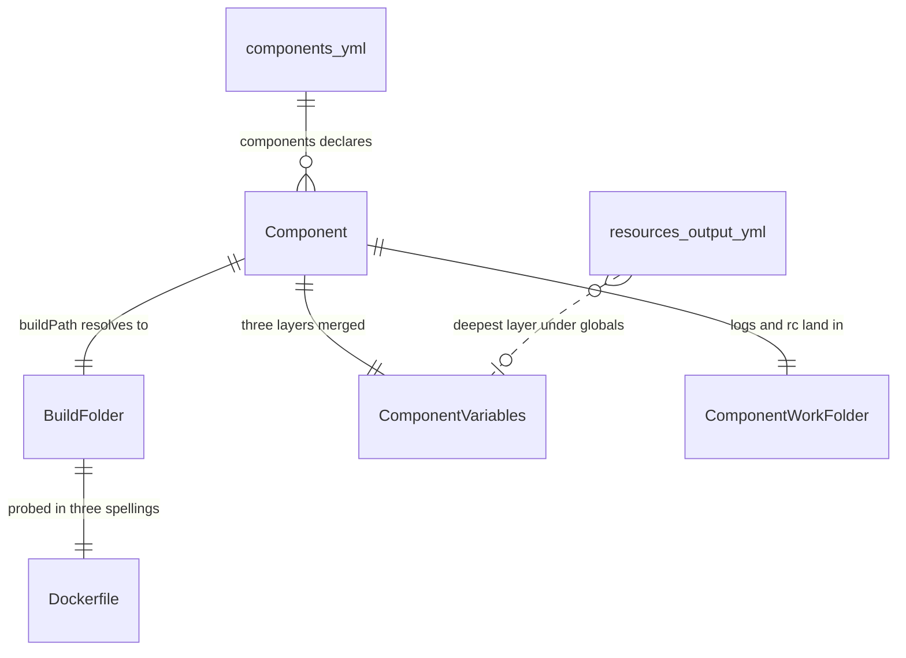
```mermaid
erDiagram
    components_yml ||--o{ Component : "components declares"
    Component ||--|| BuildFolder : "buildPath resolves to"
    BuildFolder ||--|| Dockerfile : "probed in three spellings"
    Component ||--|| ComponentVariables : "three layers merged"
    resources_output_yml }o..o| ComponentVariables : "deepest layer under globals"
    Component ||--|| ComponentWorkFolder : "logs and rc land in"
```

Boxes on disk. `BuildFolder` is `<project_root>/components/<buildPath>`, resolved
with `Resolve-Path`; a missing folder is `config_error`. `Dockerfile` is probed
in `<buildFolder>` as `Dockerfile`, then `dockerfile`, then
`<projectName>-dockerfile`, and none found is `config_error`.
`ComponentWorkFolder` is `<project_root>/.yuruna/<cloud>/components/`, holding
one shared `docker.stderr.log` that every component appends to with a
`== [<phase>] <cmd> (exit=N) ==` header, a `docker.rc` rewritten after each
phase, and the timestamped `components.<yyyy-MM-dd-HH-mm-ss>.yml` backup.
`ComponentVariables` is not a file: it is the in-memory bag the publisher builds
and mirrors into `Env:`, shown as a box because it is what every command string
expands against.

### Relationships

| From | To | Cardinality | What the parser does |
|---|---|---|---|
| components_yml | Component | 1 to 0..N | A null `components` list is `skipped = $true` in `Publish-ComponentList` and an information line in `Confirm-ComponentList`, not a failure -- a project may legitimately deploy resources and workloads only. |
| Component | BuildFolder | 1 to exactly 1 | `buildPath` defaults to `project` when empty, is expanded, and is then resolved under `components/`. Two components sharing a `project` are rejected by `Confirm-ComponentList`, which keeps ordinal hash sets over the raw and the expanded value, because they would build, tag and push to the same image identity. |
| BuildFolder | Dockerfile | 1 to exactly 1 | The three-name probe runs in order and the first hit wins; the resolved path is injected into the variable bag as `dockerfile` and reached from the build command as `${env:dockerfile}`. |
| Component | ComponentVariables | 1 to exactly 1 | One bag per component, rebuilt from scratch each iteration so one component's locals cannot leak into the next. |
| resources_output_yml | ComponentVariables | cross-store | The resources output is the first and shallowest layer. Nothing verifies that a name a command string references was ever produced. |
| Component | ComponentWorkFolder | 1 to exactly 1 | One folder per config subfolder, shared by every component in the run; the log is append-only and the rc file is last-write-wins. |

### Fields

| Field | Type | Read or written by |
|---|---|---|
| `globalVariables` | map | `Publish-ComponentList` pushes it verbatim with `-NoExpand`, because component layering happens at the YAML level. It is also the fallback source for `buildCommand`, `tagCommand`, `pushCommand`, `preProcessor` and `postProcessor`. |
| `components[].project` | string | `Publish-ComponentList` expands it into `Env:projectName`; it is also the last Dockerfile-probe name. Required. |
| `components[].buildPath` | string | `Publish-ComponentList`; optional, defaulting to `project`. |
| `components[].variables` | map | `Set-ExpandedVariableHashtable -NoExpand` into the bag; the third and deepest layer. May carry `preProcessor` and `postProcessor`. |
| `components[].buildCommand` | string | `Publish-ComponentList`; required per component or in `globalVariables`. Missing in both is `config_error`. |
| `components[].tagCommand` | string | Same rule, same reader. |
| `components[].pushCommand` | string | Same rule, same reader. |

Layering into the bag, deepest wins, all `-NoExpand`: the `resources.output.yml`
leaves, then `components.globalVariables`, then `component.variables`. The
publisher then injects three derived keys -- `project`, `buildPath` and
`dockerfile` -- and every key is also written to `Env:<key>`. Phases run in a
fixed order through `Invoke-ComponentCommand`: `preProcessor` (optional), build,
`postProcessor` (optional), tag, registry login (only when
`Resolve-ComponentRegistryLogin` returns a command) and push. Any non-zero exit
is `failureClass = tool_failed` carrying the exit code. A phase that ran only
PowerShell leaves `$LASTEXITCODE` as `$null`, which the helper coerces to 0 so
"no native command ran" reads as success rather than as an unknown failure.

**Workloads.** The third phase installs into a Kubernetes context, either as a
helm chart or as one tool expression per deployment.

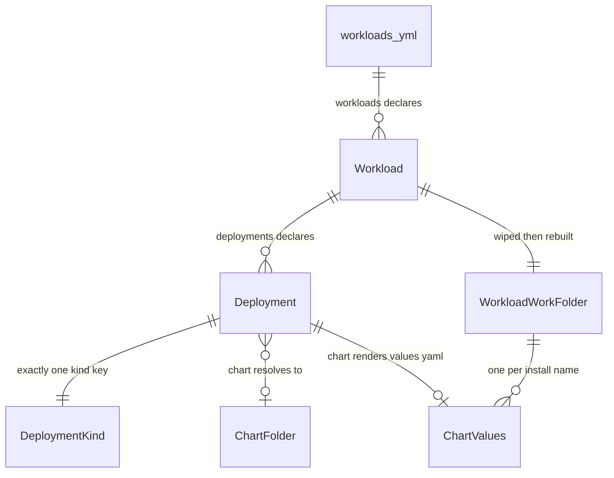
```mermaid
erDiagram
    workloads_yml ||--o{ Workload : "workloads declares"
    Workload ||--o{ Deployment : "deployments declares"
    Workload ||--|| WorkloadWorkFolder : "wiped then rebuilt"
    Deployment ||--|| DeploymentKind : "exactly one kind key"
    Deployment }o--o| ChartFolder : "chart resolves to"
    Deployment ||--o| ChartValues : "chart renders values yaml"
    WorkloadWorkFolder ||--o{ ChartValues : "one per install name"
```

One box is folded out. The merged variable bag every command string expands
against is not drawn -- it is memory, not a document -- so its four layers appear
in the prose and the Fields table below instead: the `resources.output.yml`
leaves, `workloads.globalVariables`, `workload.variables` and
`deployment.variables`, four layers, real count four.

Boxes on disk. `ChartFolder` is `<project_root>/workloads/<chart>`; a missing
folder is `config_error`. `WorkloadWorkFolder` is
`<project_root>/.yuruna/<cloud>/workloads/<contextName>/`, wiped at the start of
each workload and then rebuilt, holding `<toolName>.stderr.log` and
`<toolName>.rc` per tool (`kubectl`, `helm` or `shell`) plus one
`<installName>/` subfolder per chart deployment. `ChartValues` is the generated
`values.yaml` inside that subfolder: the chart's own committed `values.yaml` is
overwritten and never reaches helm. The timestamped `workloads.<stamp>.yml`
backup sits one level up, in
`<project_root>/.yuruna/<cloud>/workloads/`.

`DeploymentKind` is a code catalog rather than YAML
(`automation/Yuruna.DeploymentKind.psm1`), held in a
`$global:__YurunaDeploymentKindCatalog` ordered dictionary so a `-Force`
re-import cannot clear it. Registration order is the precedence order:

| Name | Field | IsChart | ToolName | CommandPrefix | Retryable |
|---|---|---|---|---|---|
| `chart` | `chart` | true | `helm` | (unused) | false |
| `kubectl` | `kubectl` | false | `kubectl` | `kubectl ` | true |
| `helm` | `helm` | false | `helm` | `helm ` | true |
| `shell` | `shell` | false | `shell` | (empty) | false |

### Relationships

| From | To | Cardinality | What the parser does |
|---|---|---|---|
| workloads_yml | Workload | 1 to 0..N | A null `workloads` list is `skipped = $true` in the publisher and an information line in the validator. |
| Workload | Deployment | 1 to 0..N | `Confirm-WorkloadList` deduplicates the raw and the expanded `context` with ordinal hash sets, because the publisher wipes `.yuruna/<cloud>/workloads/<context>` at the start of each workload -- a repeated context would delete the first one's rendered charts and logs. |
| Workload | WorkloadWorkFolder | 1 to exactly 1 | `Env:workFolder` is set to this folder before each expression is expanded, which is what lets the shipped configs write `$(Join-Path -Path ${env:workFolder} -ChildPath "website-tls.crt")`. |
| Deployment | DeploymentKind | 1 to exactly 1 | `Resolve-YurunaDeploymentKind` treats a kind as applying when its `Field` is present and non-empty. `chart` wins if present; otherwise the last present non-chart kind wins, mirroring the publisher's sequential (non-`elseif`) chain. No kind present is `config_error` in both the validator and the publisher, and both messages share the phrase generated by `Get-YurunaDeploymentKindExpectedText`. |
| Deployment | ChartFolder | N to 0..1 | Zero for every non-chart kind. One chart folder can serve several deployments; `Confirm-WorkloadList` keeps a third hash set keyed `"<contextName>\n<installNameExpanded>"` and rejects two chart deployments that would target the same helm release in the same context. |
| Deployment | ChartValues | 1 to 0..1 | Written only on the chart path, from the merged bag as `key: "value"` with backslashes stripped (a helm `--set` limitation), plus a synthesized `contextName: "<context>"`. |
| WorkloadWorkFolder | ChartValues | 1 to 0..N | One `<installName>/values.yaml` per chart deployment in the context. The folder is wiped at the start of each workload, so a rendered `values.yaml` never outlives the run that produced it. |

### Fields

| Field | Type | Read or written by |
|---|---|---|
| `globalVariables` | map | `Publish-WorkloadList` expands it once with `-CacheExpanded` so the per-deployment pass does not re-expand it. |
| `workloads[].context` | string | `Publish-WorkloadList` expands it into `Env:contextName`. Existence is probed non-mutatingly with `kubectl config get-contexts <name>`; a non-zero exit is `cluster_unreachable`. `kubectl config use-context` then activates it, and a `finally` restores the operator's original context when it was read successfully. |
| `workloads[].variables` | map | `Set-ExpandedVariableHashtable`, expanded, pushed to `Env:` and merged into the deployment bag. |
| `workloads[].deployments` | list | `Publish-WorkloadList`; each item must carry exactly one registered kind key. |
| `deployments[].chart` | string | `Invoke-WorkloadChartDeployment`; a chart deployment with an empty value is `config_error`. |
| `deployments[].kubectl`, `.helm`, `.shell` | string | `Invoke-WorkloadToolDeployment` builds `<CommandPrefix><value>`, expands it, and runs it under `Invoke-WithYurunaRetry`, retrying only when the kind is `Retryable` and the output matches `Get-YurunaTransientPattern`. |
| `deployments[].variables` | map | The deepest layer, expanded with `-WarnOnEmpty`. |
| `deployments[].variables.installName` | string | `Invoke-WorkloadChartDeployment` expands it into the helm release name and the `<installName>` work-folder segment. Required for `chart`, and every chart variable value must be non-empty. |

Deployment variable layering, deepest wins: the `resources.output.yml` leaves
(`-NoExpand`), then `workloads.globalVariables` (expanded), then
`workload.variables` (expanded), then `deployment.variables` (expanded,
`-WarnOnEmpty`). The chart pipeline copies `workloads/<chart>/*` into the work
folder, renders `values.yaml`, runs `helm lint .` (failure is `chart_invalid`),
probes with `helm status` and rolls back or `helm uninstall --no-hooks` a
`pending-*` release left by a prior kill, then runs one
`helm upgrade --install --atomic <installName> . --debug`. Failure is a non-zero
exit or any output line matching `^Error: ` or `(INSTALLATION|UPGRADE) FAILED`,
because helm can report both while exiting zero.

**Host tool floors.** One more YAML belongs to the deploy engine rather than to
any project: the single source of host-tool version floors.

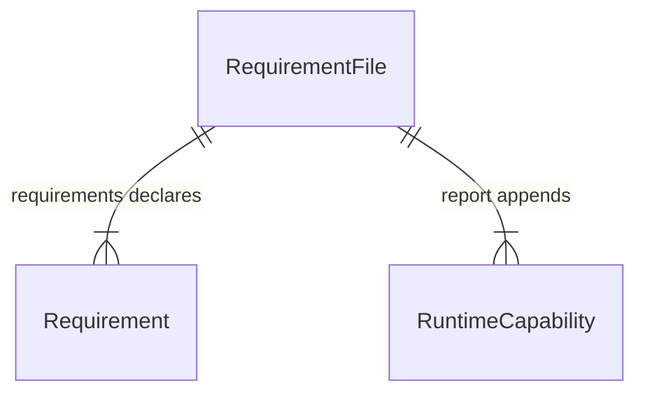
```mermaid
erDiagram
    RequirementFile ||--|{ Requirement : "requirements declares"
    RequirementFile ||--|{ RuntimeCapability : "report appends"
```

`RequirementFile` is `automation/Yuruna.Requirement.yml`. `Requirement` is one
entry of its root `requirements[]` list; there are twenty today.
`RuntimeCapability` is not in the file at all -- it is the `Runtime capabilities`
section `Confirm-RequirementList` appends after the tool rows, carrying one row
today.

### Relationships

| From | To | Cardinality | What the parser does |
|---|---|---|---|
| RequirementFile | Requirement | 1 to 1..N | `Confirm-RequirementList` (`automation/Yuruna.Requirement.psm1`) iterates `requirements[]` and reads four keys per entry. `-Tool` narrows the report to named tools by matching `tool`, and the loop variable is deliberately not named `$tool` because PowerShell variable names are case-insensitive and would shadow the parameter. |
| RequirementFile | RuntimeCapability | 1 to 1..N | Appended by `Get-RuntimeCapability`, not read from YAML: a host can meet every version floor and still lack an algorithm. The one row is `AES-GCM`, probed with `[System.Security.Cryptography.AesGcm]::IsSupported`, and a probe that throws is treated as present. |

### Fields

| Field | Type | Read or written by |
|---|---|---|
| `requirements[].tool` | string | `Confirm-RequirementList`, as the row label and the `-Tool` filter key. |
| `requirements[].command` | string (PowerShell expression) | `Confirm-RequirementList` runs it through `Invoke-DynamicExpression`; a `CommandNotFoundException` is caught so an absent tool becomes a `MISSING` row instead of aborting the report. |
| `requirements[].version` | string | The floor. Both sides are reduced to their first dotted-number token and compared as `[version]`, so a decorated string such as `curl 8.18.0` compares correctly. |
| `requirements[].releases` | string | Printed under a failing row so the operator has the upgrade source. |

The twenty floors, in file order: PowerShell `7.6.4 (Core)`, git `2.53.0`,
python3 `3.14.4`, OpenTofu `1.12.5`, Helm `v4.2.4`, Docker `29.6.2`,
Docker buildx `v0.35.0`, containerd `v2.3.3`, Kubernetes `v1.36.3`,
Visual Studio Code `1.132.0`, mkcert `v1.4.4`, node `v24.19.0`, npm `11.17.0`,
curl `curl 8.18.0`, wget `GNU Wget 1.25.0`, tesseract `tesseract 5.5.0`,
qemu-img `qemu-img version 10.2.1`, AWS cli `aws-cli/2.36.18`,
Azure cli `2.89.0`, Google Cloud `Google Cloud SDK 579.0.0`. The file's own
header states the selection rule: a floor is the lowest version every supported
host's package source ships, never the newest upstream release, because a floor
above what a platform can deliver reports a defect on a correctly provisioned
machine on every run. The list is reached from `yuruna requirements`
(`automation/yuruna.ps1`), from `automation/Test-Requirement.ps1` -- which the
three bootstrap installers shell out to rather than parsing the YAML themselves
-- and from `automation/Check-DependencyVersion.ps1`.

## Project cycle plan and sequences

**The cycle plan.** A cloned project publishes what the runner should execute,
one cycle after another.

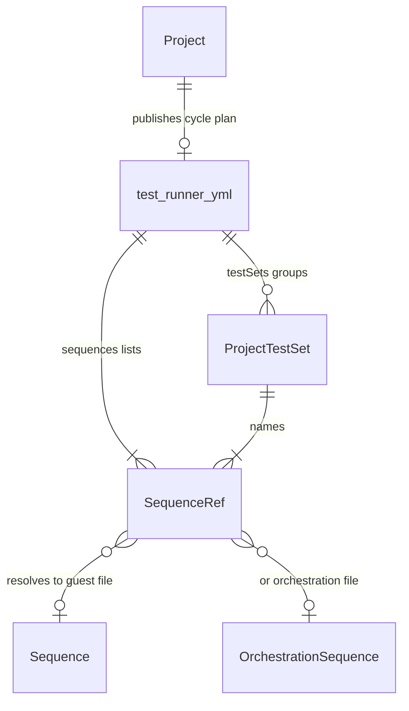
```mermaid
erDiagram
    Project ||--o| test_runner_yml : "publishes cycle plan"
    test_runner_yml ||--|{ SequenceRef : "sequences lists"
    test_runner_yml ||--o{ ProjectTestSet : "testSets groups"
    ProjectTestSet ||--|{ SequenceRef : "names"
    SequenceRef }o--o| Sequence : "resolves to guest file"
    SequenceRef }o--o| OrchestrationSequence : "or orchestration file"
```

Boxes on disk. `test_runner_yml` is `<RepoRoot>/project/test/test.runner.yml`,
returned by `Get-CycleConfigPath` (`test/modules/Test.SequencePlanner.psm1`); the
shipped example is `yuruna-project/test/test.runner.yml`, whose `sequences:`
names `ch01.website.example.no-break`, `workload.guest.windows.11` and
`workload.guest.ubuntu.server.24.k8s.website`, and whose `testSets:` declares
`smoke`, `windows` and `kubernetes`. `ProjectTestSet` is one entry of that list
plus the implicit set. `Sequence` is a guest sequence file resolved by bare name
under `<repo>/project/**/test/` and then under the framework `test/sequences/`.
`OrchestrationSequence` is a manifest of `InvokeTestSequence` steps, shaped by
`test/schemas/orchestration-sequence.schema.yml`.

### Relationships

| From | To | Cardinality | What the parser does |
|---|---|---|---|
| Project | test_runner_yml | 1 to 0..1 | The path is fixed and the clone is the project, so at most one plan is live. `Get-CycleConfig` throws when the file is missing, naming `repositories.projectUrl` as the setting to fix. |
| test_runner_yml | SequenceRef | 1 to 1..N | `sequences:` is required and non-empty; `Get-CycleConfig` throws otherwise. A `.yml`, `.yaml` or `.json` suffix on an entry is stripped. |
| test_runner_yml | ProjectTestSet | 1 to 0..N | `testSets:` is optional. `Get-ProjectTestSet` always emits the implicit set `all` first, with `displayName: 'All sequences'` and every entry of `sequences[]`, and skips a declared set named `all` with a warning because that name is reserved for the whole-project fallback. |
| ProjectTestSet | SequenceRef | 1 to 1..N | A set listing no sequences is skipped with a warning rather than emitted. Every rejection in the loop -- non-mapping entry, missing name, reserved name, a name failing the case-sensitive `^[a-z0-9][a-z0-9._-]*$`, a duplicate -- is a `Write-Warning`, never a throw, because this read happens inside a live cycle. |
| SequenceRef | Sequence | N to 0..1 | Names are not resolved when the plan is read. A name that resolves to nothing surfaces later, at plan time, as `PlannerFatal`. |
| SequenceRef | OrchestrationSequence | N to 0..1 | An entry may instead resolve to an orchestration manifest, detected by shape rather than by a key: no `resource:` block and steps carrying `action: InvokeTestSequence`. |

### Fields

| Field | Type | Read or written by |
|---|---|---|
| `sequences` | string array | `Get-CycleConfig` (`test/modules/Test.SequencePlanner.psm1`); required and non-empty. |
| `testSets[].name` | string | `Get-ProjectTestSet`; matched case-sensitively with `-cnotmatch` against `^[a-z0-9][a-z0-9._-]*$`, precisely because the JSON Schema pattern that the pool test-set library applies later is case-sensitive and a mismatch would surface far from its cause. |
| `testSets[].displayName` | string | `Get-ProjectTestSet`; the label a non-technical operator sees on the pool-control board. |
| `testSets[].description` | string | `Get-ProjectTestSet`; one line under `displayName`. |
| `testSets[].sequences` | string array | `Get-ProjectTestSet`; suffixes stripped and empty entries dropped, and a set left with none is skipped. |
| `name` | string | `test/schemas/orchestration-sequence.schema.yml`, required, `^[a-z0-9][a-z0-9._-]*$`. |
| `continueOnError` | bool | Same schema, optional, default false: stop at the first failure and mark the rest skipped. |
| `steps[].action` | const `InvokeTestSequence` | Same schema; the only orchestration verb. |
| `steps[].sequence` | string | Same schema, `^[A-Za-z0-9._-]+$`, with a trailing `.yml` or `.yaml` accepted and stripped. |

There is no JSON Schema for `test.runner.yml`; `Get-CycleConfig` and
`Get-ProjectTestSet` are its whole contract.

**The sequence file.** One file drives one guest through one scenario and names
its own prerequisites.

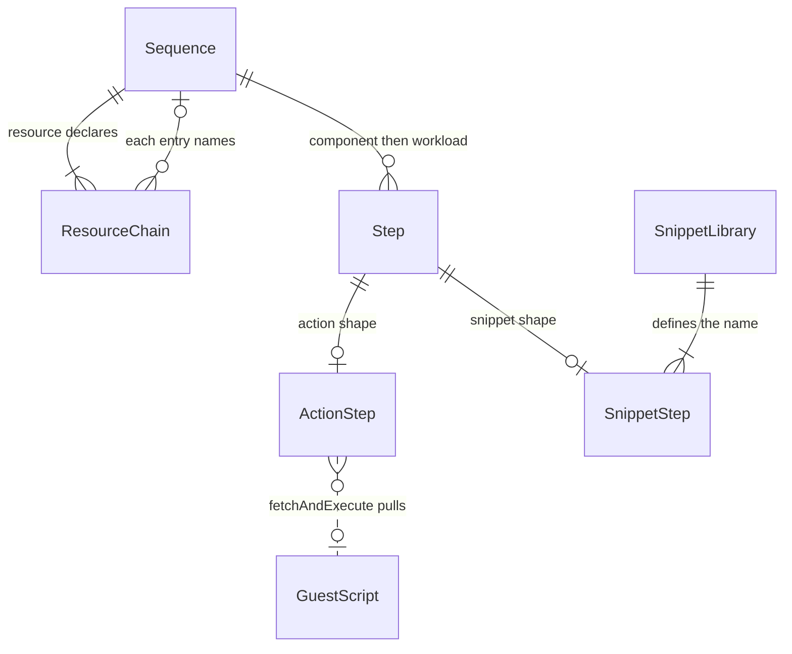
```mermaid
erDiagram
    Sequence ||--|{ ResourceChain : "resource declares"
    ResourceChain }o--o| Sequence : "each entry names"
    Sequence ||--o{ Step : "component then workload"
    Step ||--o| ActionStep : "action shape"
    Step ||--o| SnippetStep : "snippet shape"
    SnippetLibrary ||--|{ SnippetStep : "defines the name"
    ActionStep }o..o| GuestScript : "fetchAndExecute pulls"
```

Boxes on disk. `Sequence` is one YAML file shaped by
`test/schemas/sequence.schema.yml`; the framework corpus is `test/sequences/`,
which holds nineteen files -- seventeen sequences plus `_snippets.yml` and
`actions.yml`. The project corpus is `yuruna-project/book/test/` (four),
`yuruna-project/example/website/test/` (four),
`yuruna-project/example/text-to-sql/test/` (two) and
`yuruna-project/example/nested.host/test/` (one). `SnippetLibrary` is
`test/sequences/_snippets.yml` for the framework and `<...>/test/_snippets.yml`
for a project, shaped by `test/schemas/snippets.schema.yml`. `GuestScript` is a
`guest/**` path a `fetchAndExecute` step names, fetched and run inside the guest.

### Relationships

| From | To | Cardinality | What the parser does |
|---|---|---|---|
| Sequence | ResourceChain | 1 to 1..N | `resource` is in the root `required` set with `minProperties: 1`: a mapping of guest-OS key to an ordered list of prerequisite sequence names, each matching `^[A-Za-z0-9._-]+$`. |
| ResourceChain | Sequence | N to 0..1 | Each entry is a bare file name resolved the same way a plan entry is, so the file name is a lookup key rather than a label. `sequenceGuid` is what survives a rename, for the perf join. Zero when the chain names a sequence that does not resolve, which the planner reports as fatal. |
| Sequence | Step | 1 to 0..N | The executed list is `component` concatenated with `workload`. Both keys are optional; the root is `additionalProperties: false`, and the retired `baseline:` key and the flat top-level `steps:` list are rejected at load with a migration error. |
| Step | ActionStep | 1 to 0..1 | `step` is a `oneOf` over the two shapes, so exactly one applies. `actionStep` requires `action` from a twenty-one value enum and leaves `additionalProperties` open so per-action parameters pass. |
| Step | SnippetStep | 1 to 0..1 | `snippetStep` requires `snippet` matching `^[A-Za-z][A-Za-z0-9_-]*$`, allows an optional `description`, and is `additionalProperties: false` -- which is what makes the two shapes distinguishable under `oneOf`. |
| SnippetLibrary | SnippetStep | 1 to 1..N | `snippets.schema.yml` is a root map with `minProperties: 1`, keys matching the same pattern, each mapping to a non-empty array of `sequence.schema.yml#/$defs/step`. A snippet may therefore reference another snippet. |
| ActionStep | GuestScript | cross-store | Unchecked by any schema: the `fetchAndExecute` payload path is a string. The guest-side fetcher `automation/fetch-and-execute.sh` gates the download on a host-supplied SHA-256 before any byte reaches bash. |

### Fields

| Field | Type | Read or written by |
|---|---|---|
| `description` | string | `test/schemas/sequence.schema.yml`, required; one line. |
| `keystrokeMechanism` | enum `gui`, `ssh` | Same schema, required. There is no machine-global setting: the ssh variant of a sequence is a separate `<name>.ssh.yml` file selected by naming it. |
| `resource` | map | Same schema, required, `minProperties: 1`. |
| `sequenceGuid` | string | Same schema, optional, `^42[0-9a-fA-F]{6}-...` -- the rename-surviving join key `test/modules/Test.Perf.psm1` stamps on every row. |
| `sequenceRevision` | integer, minimum 1 | Same schema, optional; author-bumped when steps are added, removed or reordered. |
| `variables` | map to string, number or boolean | Same schema, optional. The runner adds `${vmName}`, `${hostType}` and `${guestKey}`, which a sequence must not redeclare. |
| `requiresSnapshot.id` | string | Same schema, required inside the block. Two runtime effects: the VM name becomes `id` instead of `test-<guestKey>`, and a snapshot hit skips the whole resource chain. |
| `component[]`, `workload[]` | step arrays | Same schema, optional; the VM-setup phase and the verification phase. |
| `action` | enum, 21 values | Same schema. Per-action required fields are expressed as nineteen `if`/`then` branches: `callExtension`, `fetchAndExecute`, `pressKey`, `retry`, `inputText`, the pair `inputTextAndEnter`/`typeAndEnter`, `passwdPrompt`, `saveSystemDiagnostic`, `saveDiskSnapshot`, `loadDiskSnapshot`, `break`, `takeScreenshot`, `sshExec`, `sshFetchAndExecute`, `sshWaitReady`, `tapOn`, `waitForAndEnter`, `waitForSeconds` and `waitForText`. |

Three action sets are close but not equal, and the difference is the point. The
`action` enum in `sequence.schema.yml` holds twenty-one values, including the
deprecated alias `typeAndEnter`. The prose catalog `test/sequences/actions.yml`
documents twenty and omits that alias. `test/modules/Test.SequenceHandler.psm1`
makes twenty-one `Register-SequenceAction` calls, dropping `typeAndEnter` and
adding `recoverFromSnapshot`, which no schema names. The runner never reads
`actions.yml` -- the live action set is whatever `Register-SequenceAction`
registers, and the catalog's `yaml-language-server` header means its consumer is
the editor.

## Test-harness runtime data

**Host configuration.** One file per machine, normally read through
`test/modules/Test.Config.psm1`.

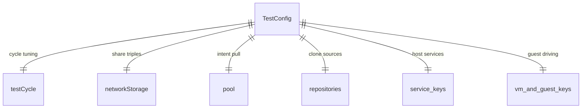
```mermaid
erDiagram
    TestConfig ||--|| testCycle : "cycle tuning"
    TestConfig ||--|| networkStorage : "share triples"
    TestConfig ||--|| pool : "intent pull"
    TestConfig ||--|| repositories : "clone sources"
    TestConfig ||--|| service_keys : "host services"
    TestConfig ||--|| vm_and_guest_keys : "guest driving"
```

`TestConfig` is the live `test/test.config.yml`, gitignored host state; the
committed artifact is `test/test.config.yml.template`, which has exactly thirteen
top-level keys. Four of the six children are those keys verbatim -- `testCycle`,
`networkStorage`, `pool` and `repositories`. The other two are aggregates, and
here is the fold: `service_keys` stands for the four service blocks
`configService`, `downloadAgentService`, `notification` and `statusService`;
`vm_and_guest_keys` stands for `guestSequence`, `logLevel`, `vmCommunication`,
`vmImage` and `vmStart`. Four plus four plus five is thirteen, the real count.

The file is not only read. `Update-TestConfigFromTemplate`
(`test/modules/Test.ConfigSync.psm1`) runs at
`test/modules/Invoke-TestRunnerInnerLoop.ps1` before the first read, overlaying
the live file on the template, so the template is the schema source of truth and
a host that skipped releases picks up new keys without hand-editing.

### Relationships

| From | To | Cardinality | What the parser does |
|---|---|---|---|
| TestConfig | testCycle | 1 to exactly 1 | One YAML document, one block per key, no repetition. `Read-TestConfig` rejects a root that is not an `IDictionary` and supplies no defaults of its own, so an absent block reads as "all defaults" and each consuming call site carries its own fallback. |
| TestConfig | networkStorage | 1 to exactly 1 | `Get-YurunaPoolStorageConfig` (`test/modules/Test.PoolStorage.psm1`) returns `$null` unless all three of `poolStorageNetworkPath`, `poolStorageNetworkUser` and `poolStorageLocalPath` are non-blank -- populating the triple is the opt-in. `Get-YurunaStashStorageConfig` is the identical shape over the `stashStorage*` triple. |
| TestConfig | pool | 1 to exactly 1 | `Get-YurunaPoolConfig` (`test/modules/Test.PoolSync.psm1`) returns `$null` unless `pool` is a mapping with a non-blank `intentGitUrl`, and unless `enabled` is true or the caller passed `-IgnoreEnabled` for pre-flight. The returned object carries no pool id: membership lives only in `pools.yml`. |
| TestConfig | repositories | 1 to exactly 1 | Read at cycle start to refresh the framework and project clones. A pool's `testSet` overrides `frameworkUrl` and `projectUrl` for the cycle; `ghToken` never travels through pool intent. |
| TestConfig | service_keys | 1 to exactly 1 | Each service block is read by its own starter, so an absent block leaves that service on its compiled default rather than failing the parse. |
| TestConfig | vm_and_guest_keys | 1 to exactly 1 | Same rule. `Test.Transport.psm1` re-reads `vmCommunication` mid-cycle by design, so a change to those knobs takes effect without a restart. |

The sharp edge on "absent reads as default": sixteen keys were renamed and
`Read-TestConfig` does not migrate them, so a value under a retired spelling
reads as absent and silently takes the default.
`Get-RetiredConfigKeyMap` (`test/modules/Test.ConfigNaming.psm1`) is the ordered
old-to-new table, each entry carrying a `Factor` -- 1 for a pure rename, 60 for
`testCycle.stepTimeoutMinutes` to `testCycle.stepTimeoutSeconds`, 3600 for
`vmImage.refreshHours` to `vmImage.refreshSeconds` -- and
`tools/Update-TestConfigNaming.ps1` is what rewrites a config with it.

### Fields

| Field | Type | Read or written by |
|---|---|---|
| `testCycle` | map | `test/Start-TestRunner.ps1` (`stepTimeoutSeconds`), `test/modules/Test.RunnerInnerLoop.psm1`. Leaves: `autoRemediation{enabled, maxAttemptsPerCycle}`, `cycleDelaySeconds`, `guestQuarantine{enabled, failuresToQuarantine, skipCycles}`, `labHealth{enabled, minIntervalSeconds, discoveryIntervalSeconds, armWindowHours, maxHoldAttempts, require[]}`, `perfLog.enabled`, `recentDisplayCount`, `stopOnFailure`, `stepTimeoutSeconds`, `preambleTimeoutSeconds`, `warmResume{enabled, maxAttempts}`. |
| `networkStorage` | map of strings and one bool | `test/modules/Test.PoolStorage.psm1`. Leaves: `poolStorage{LocalPath, NetworkPath, NetworkUser}`, `moveLogsToPoolStorage`, `stashStorage{LocalPath, NetworkPath, NetworkUser}`. |
| `pool` | map | `test/modules/Test.PoolSync.psm1`. Leaves: `enabled` (bool), `intentGitUrl`, `localClonePath` (defaulting to `<runtimeDir>/pool-intent`), `pullTimeoutSeconds` (int). |
| `repositories` | map of strings | `test/modules/Test.HostGit.psm1` for the clone refresh. Leaves: `frameworkUrl`, `ghToken`, `projectUrl`. |
| `configService` | map | `test/service/Start-ConfigService.ps1` reads `port`; `host/<platform>/guest.caching-proxy-service/New-VM.ps1` reads it to template the guest. Leaves: `enabled`, `port` (8443). |
| `statusService` | map | `test/service/Start-StatusService.ps1` reads `port`; `Get-YurunaStatusServiceSeed` (`test/modules/Test.Config.psm1`) returns `@{Port; Config; ConfigPath}` with a default port of 8080. Leaves: `enabled`, `port`. |
| `downloadAgentService` | map | `host/<platform>/guest.download-agent-service/New-VM.ps1` templates `scanIntervalSeconds`, `freshnessSeconds`, `prefetchLeadSeconds` and `autoSeed` into the daemon's flags; `install/setup.ps1` reads `downloadAgentService.enabled` through `Get-TestConfigValue`. |
| `notification` | map of ints | `test/modules/Test.RunnerInnerLoop.psm1`. Leaves: `failuresBeforeAlert`, `successesBeforeRearm`. |
| `guestSequence` | string array | `Get-GuestSequence` (`test/modules/Test.HostDetection.psm1`); the fallback list used when the cycle planner cannot read `test.runner.yml`. |
| `logLevel` | string | The runner entry points, forwarded to every child as `-logLevel`. |
| `vmCommunication` | map of ints | `test/modules/Test.Transport.psm1` and `test/modules/Test.SequenceEngine.psm1`. Leaves: `charDelayMs`, `pollSeconds`, `timeoutSeconds`, `vncPort`. |
| `vmImage` | map | `test/modules/Test.RunnerInnerLoop.psm1` and `test/Test-Config.ps1`. Leaves: `alwaysRedownload` (bool), `refreshSeconds` (int, falling back to 86400 in code). |
| `vmStart` | map | `Resolve-CleanupVmNamePrefix` (`test/modules/Test.Config.psm1`), `test/Debug-TestSequence.ps1` and `test/modules/Test.Orchestrator.psm1`. Leaves: `bootDelaySeconds`, `cachingProxyIp`, `startTimeoutSeconds`, `testVmNamePrefix` (`test-`), `cleanupVmNamePrefixes[]`. |

Three reader behaviors are load-bearing. The cache is a
`[Hashtable]::new([StringComparer]::Ordinal)` keyed by resolved absolute path and
validated by `LastWriteTimeUtc` plus a SHA-256 of the first 64 KB, FIFO-capped at
sixty-four entries; the ordinal comparer exists so two case-distinct paths on a
case-sensitive filesystem cannot share a slot. Every successful parse publishes
`<runtimeDir>/.test.config.snapshot.<12-hex-of-path>.json` through a temp plus
rename, carrying `sourcePath`, `sourceMtime`, `sourceHash`, `publishedAt`,
`publisherPid` and `config`; `Read-TestConfigOrSnapshot` uses it only when path,
hash and mtime all still match, and a source path under
`extension/authentication/` is never snapshotted so no copy of `vault.yml` lands
under a name the status service's deny-list does not cover. And
`ConvertTo-PoolStorageBool` accepts `true`, `yes`, `on` or `1` for
`moveLogsToPoolStorage`, because a bare `[bool]'false'` cast is `$true` in
PowerShell and that key gates deletion of the only local copy.
`downloadAgentService.enabled` is deliberately left unstated in the template so
it resolves by mode rather than by a value someone copied. Precedence when a pool
is in play is pool intent over host config over code default.

**Runtime state.** Everything the runner keeps between processes lives as small
files under `$env:YURUNA_RUNTIME_DIR`.

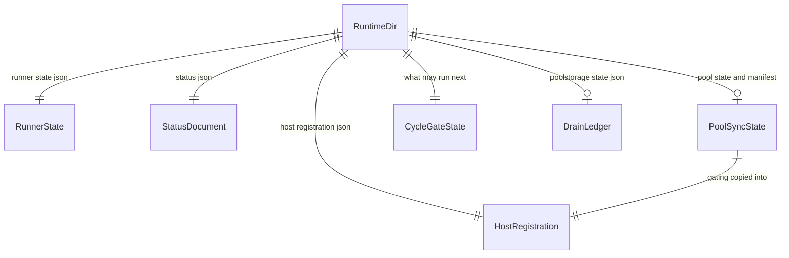
```mermaid
erDiagram
    RuntimeDir ||--|| RunnerState : "runner state json"
    RuntimeDir ||--|| StatusDocument : "status json"
    RuntimeDir ||--|| HostRegistration : "host registration json"
    RuntimeDir ||--o| PoolSyncState : "pool state and manifest"
    RuntimeDir ||--|| CycleGateState : "what may run next"
    RuntimeDir ||--o| DrainLedger : "poolstorage state json"
    PoolSyncState ||--|| HostRegistration : "gating copied into"
```

Boxes on disk, and the fold. `RunnerState` is `runtime/runner.state.json`,
`StatusDocument` is `runtime/status.json` (seeded from
`test/status/status.json.template`), `HostRegistration` is
`runtime/host.registration.json`, `DrainLedger` is
`runtime/poolstorage.state.json`. Two boxes are aggregates. `PoolSyncState`
stands for the two files the pool pull writes, `runtime/pool.state.json` and
`runtime/pool.manifest.json` -- two files, both written by
`test/modules/Test.PoolSync.psm1`. `CycleGateState` stands for the three files
that decide whether the next cycle, the next guest or the next step may run:
`runtime/runner.gating.json` (the notification latch, read back at
`test/modules/Test.RunnerInnerLoop.psm1`), `runtime/runner.quarantine.json`
(`test/modules/Test.GuestQuarantine.psm1`) and `runtime/lab-health.json`
(`test/modules/Test.LabHealth.psm1`) -- three files, real count three.

### Relationships

| From | To | Cardinality | What the parser does |
|---|---|---|---|
| RuntimeDir | RunnerState | 1 to exactly 1 | `Get-RunnerStatePath` resolves exactly one file per runtime dir, and both the resident outer process and the per-cycle child write it -- which is why the record carries `writerPid` and `runId` beside `current`. |
| RuntimeDir | StatusDocument | 1 to exactly 1 | One `status.json` per host, served by the status service. The template ships every key present with a null or empty value, so a consumer never has to distinguish "absent" from "not yet set". |
| RuntimeDir | HostRegistration | 1 to exactly 1 | `Write-HostRegistrationRecord` (`test/modules/Test.Capability.psm1`) writes it once per cycle at runner startup, on the main runspace, best-effort and never throwing, through a temp plus `Move-Item -Force`. |
| RuntimeDir | PoolSyncState | 1 to 0..1 | Both files exist only when the pool-intent pull ran. `Write-YurunaPoolManifest` deletes any stale manifest when the pool is null or has no `testSet` triple, so the inner runner falls back to the host's own `repositories` rather than to a previous pool's. |
| RuntimeDir | CycleGateState | 1 to exactly 1 | Each of the three is created on demand and read with a parse fallback; a missing file means "no latch, no quarantine, nothing ever seen healthy", which is the safe direction in all three cases. |
| RuntimeDir | DrainLedger | 1 to 0..1 | Written only when the pool-storage tier is configured. It is deliberately not on the share: the host's own ledger is the source of truth for what has been replicated, so losing it re-drains a small local backlog -- wasted work, never lost or duplicated data, because copies land on immutable folders. |
| PoolSyncState | HostRegistration | 1 to exactly 1 | The registration writer reads `poolId`, `poolGuid` and `gating` out of `pool.state.json` rather than re-deriving them, because it runs in the fresh inner process that does not inherit the outer's globals -- the filesystem is the only cross-process channel, and reading one copy stops the runner and the aggregator disagreeing within a cycle. |

### Fields

| Field | Type | Read or written by |
|---|---|---|
| `current`, `since`, `runId`, `writerPid` | string, string, string, int | `Set-RunnerState` (`test/modules/Test.RunnerState.psm1`). `current` is one of `idle`, `cycle-start`, `in-cycle`, `cycle-end`, `fault`, `paused`. |
| `history[]` | array of `{from, to, at, reason}` | Same writer, trimmed to `$script:HistoryDepth = 20`. The NDJSON stream is the canonical history; this is a cheap "what just happened" cache. |
| `lastCycleStartUtc`, `lastCycleNumber` | string, int | Carried forward by `Set-RunnerState` from the prior file so one read of `runner.state.json` carries the most recent cycle metadata without a join. |
| `schemaVersion`, `host`, `hostname`, `cycleStartUtc`, `startedAt`, `finishedAt`, `overallStatus`, `stepPaused`, `cyclePaused`, `gitCommits[]`, `lastGetImageAt`, `cycle`, `guests[]`, `nested{}`, `history[]` | mixed | `test/status/status.json.template` and `test/modules/Test.Status.psm1`; the template's fifteen keys are the whole document. |
| `schemaVersion`, `hostId`, `hostType` | int, string, string | `Write-HostRegistrationRecord`; the three keys `test/schemas/host.registration.schema.yml` marks required. `hostId` matches `^42[0-9a-fA-F]{30}$`. |
| `hypervisor` | enum `hyper-v`, `kvm`, `utm` | Same writer, derived by stripping `^host\.[^.]+\.` from `hostType`. |
| `poolId`, `poolGuid`, `gating` | nullable string, string, object | Same writer, copied from `pool.state.json`; null when unpooled or when intent has not been pulled. |
| `capabilities` | object | `Get-HostCapabilityMatrix` returns `@{hostType; hostIO[]; ocr[]; vncReconnect; screenshotProvider; extensions}`, where `extensions` is an ordered area-to-active map discovered by directory presence under `test/extension/`. |
| `activeExtensions[]`, `extensionTargets{}` | array, object | `Get-ActiveExtensionService` (`test/modules/Test.ExtensionService.psm1`), driven by the per-service runtime markers a host writes when it brings a service up -- one loop over the markers, so a new service needs no edit to the writer. |
| `projectUrl`, `projectCommit`, `testSets`, `projectAccess`, `network` | string, string, array, object, object | Same writer, from the project clone, `runtime/project.access.json` and `runtime/host-network.json`; `network` is emitted only when the marker says `degraded`. |
| `runId`, `pid`, `statusPort`, `writtenAtUtc` | string, int, nullable int, string | Same writer. |
| `capacity`, `ipPool`, `disk`, `supportedGuests` | all null | Same writer; reserved and always null today, which is why the schema declares them nullable and `additionalProperties: true`. |
| `poolId`, `poolGuid`, `desiredState`, `intentOk`, `gating`, `lastSyncUtc` | string, string, string, bool, object, string | `Write-YurunaPoolState` (`test/modules/Test.PoolSync.psm1`). |
| `poolId`, `poolGuid`, `testSet{name, frameworkUrl, projectUrl}`, `config`, `writtenAtUtc` | mixed | `Write-YurunaPoolManifest`. `testSet.sequences[]` is added only when non-empty, so an absent key keeps the manifest byte-identical to what older runners parse and means "run the whole plan". |
| `replicated`, `lastAttemptUtc`, `lastConnectOk`, `lastError`, `pendingCount`, `lastCopied`, `recentArchivedBytes[]`, `movedRecent[]`, `lastMove{utc, moved, deleted, spaceShort, freeBytes, requiredBytes}` | mixed | `Write-PoolStorageLedger` (`test/modules/Test.PoolStorage.psm1`); `replicated` maps a stable cycle identity to an ISO UTC stamp. |
| `consecutiveFailures`, `consecutiveSuccesses`, `consecutiveCrashes`, `alertArmed` | int, int, int, bool | `test/modules/Test.RunnerInnerLoop.psm1`; the notification counters that must survive the single-cycle respawn. |
| `guests.<guestKey>{failureClass, consecutiveFailures, quarantined, quarantinedAtCommit, quarantinedAtProjectCommit, skipCyclesRemaining, quarantinedAtUtc}` | object | `test/modules/Test.GuestQuarantine.psm1`; a clean pass drops the entry entirely, so a recovered guest starts every streak from zero. |
| `schemaVersion`, `areas.<area>{lastOkUtc, lastAddress, verdict}` | int, object | `test/modules/Test.LabHealth.psm1`. A `lastOkUtc` inside `armWindowHours` is what arms a hold, so a service this host has never reached can never hold a cycle. |

Every one of these files is written through `test/modules/Test.StateFile.psm1`.
`Write-YurunaStateFile` writes a per-writer unique temp
`"$Path.$PID-<guidN>.tmp"` and then `[System.IO.File]::Move($tmp, $Path, $true)`:
an atomic replace, where `Move-Item -Force` is delete-then-rename and would
expose a gap to a concurrent reader. The default encoding is UTF-8 without BOM,
and a failed rename removes the orphan temp and returns `$false`.
`Write-YurunaStateFileJson` serializes and delegates.

The runner state machine deserves its own note because the adjacency map is not
a validator. `Set-RunnerState` refuses a target outside the six-state enum with a
warning and no write, but an unrecognized transition is warned about and written
anyway, so drift stays visible in telemetry instead of being lost. The
map is `idle` to `{cycle-start, fault}`, `cycle-start` to
`{in-cycle, fault, paused}`, `in-cycle` to `{cycle-end, fault}`, `cycle-end` to
`{idle}`, `fault` to `{paused, idle}`, `paused` to `{idle, cycle-start}`. The
last row exists because a healthy pool hold re-enters `cycle-start` on every
poll, and without it each hold iteration logged two warnings.

The same directory also holds, outside the diagram: `host.uuid` (the stable
per-machine identity `hostId` comes from), `runner.pid` with its `runner.start`
sidecar, `inner.pid`, `runner.heartbeat`, `runner.stepHeartbeat`,
`current-action.json`, the parsed-config snapshots
`.test.config.snapshot.<tag>.json`, the two markers the registration record folds
in (`project.access.json`, `host-network.json`), `host.pre-automation.json`, and
one `<area>.json` marker per running extension service.

**Per-cycle results.** Each cycle gets one folder under `$env:YURUNA_LOG_DIR`.

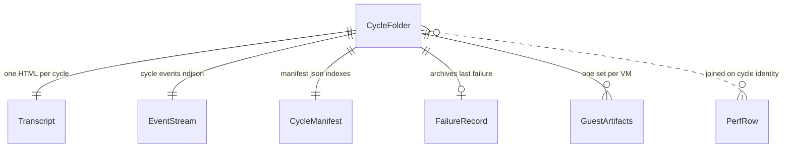
```mermaid
erDiagram
    CycleFolder ||--|| Transcript : "one HTML per cycle"
    CycleFolder ||--|| EventStream : "cycle events ndjson"
    CycleFolder ||--|| CycleManifest : "manifest json indexes"
    CycleFolder ||--o| FailureRecord : "archives last failure"
    CycleFolder ||--o{ GuestArtifacts : "one set per VM"
    CycleFolder }o..o{ PerfRow : "joined on cycle identity"
```

One box is folded out. The manifest's `artifacts[]` entries are not drawn as
their own entity; each carries five fields (`path`, `kind`, `sizeBytes`,
`sha256`, `modifiedUtc`) and they are listed in the Fields table below.

Boxes on disk. `CycleFolder` is
`test/status/log/<NNNNNN>.<YYYY-MM-DD>.<HH-mm-ss>.<HOSTID>` with a lifecycle
suffix: `.incomplete` while running, bare after a clean close,
`.aborted.<UTC>` once boot recovery adopts an orphan. The fourth segment is the
opaque hostId, never the hostname, because the folder name surfaces in the
aggregator's public cycle deep-link; a missing host identity yields
`unknown-host`, and a non-ISO timestamp yields `unknown-date` and `unknown-time`
so the four-segment shape the rotation and recovery patterns require is
preserved. `Transcript` is `<base>.html`, rendered by `Start-LogFile` itself.
`EventStream` is `cycle.events.ndjson` with its sentinel sibling
`cycle.events.gaps`. `CycleManifest` is `manifest.json`. `FailureRecord` is
`last_failure.json`. `GuestArtifacts` is the fold: per VM, the data folder
`<vmName>/` (`Get-CycleGuestDataFolder`) and the screen ring
`screens_<vmName>/` (`Get-CycleScreenDir`) -- two directories per guest, created
lazily. `PerfRow` lives outside the folder entirely, in
`test/status/perf/cycles/` as one JSONL file per cycle named
`<cycleStartUtc with colons replaced>__<4-hex>.jsonl`.

### Relationships

| From | To | Cardinality | What the parser does |
|---|---|---|---|
| CycleFolder | Transcript | 1 to exactly 1 | `Start-LogFile` (`test/modules/Test.Log.psm1`) creates one `<base>.html` and anchors the log proxy to it. It is not a PowerShell transcript -- the module renders the HTML. |
| CycleFolder | EventStream | 1 to exactly 1 | One JSON object per line. Every record stamps the bare `<base>` as its `cycleFolder` regardless of the on-disk suffix, so a streaming consumer joins across both renames. A failed write appends an `ndjson_write_gap` record to `cycle.events.gaps` rather than dropping the fact silently. |
| CycleFolder | CycleManifest | 1 to exactly 1 | `Write-CycleManifest` enumerates every file in the folder and excludes itself. It runs before the `.incomplete` marker is deleted, so a crash between the two reads as "ended ambiguously" rather than as a complete cycle with a missing index. |
| CycleFolder | FailureRecord | 1 to 0..1 | `last_failure.json` is written at the log-directory root during the cycle and archived into the folder on close, so a passing cycle has none. Its sibling `last_remediation.json` is archived on the same close only when its `runId` matches this run. |
| CycleFolder | GuestArtifacts | 1 to 0..N | Created on demand per VM name, so a cycle that never reached a guest has none. |
| CycleFolder | PerfRow | cross-store | Rows are appended with `[File]::AppendAllText` -- one line, no read-modify-write -- which is what makes concurrent writers on one cycle file safe. They join back on `cycleStartUtc` and `hostUuid`. `Write-PerfStepRow` no-ops silently when the cycle or sequence context is unset, so a cycle that crashes before perf init writes zero rows rather than failing. |

### Fields

| Field | Type | Read or written by |
|---|---|---|
| `.incomplete` marker `{cycleStartUtc, cycleNumber, cycleFolder, startedAtUtc, pid, hostname}` | object | `Start-LogFile`; the forensic detail behind the suffix, written atomically and best-effort, because a lost marker only means boot recovery will not flag this cycle as crashed -- the safe direction. |
| `cycleFolder`, `cycleStartUtc`, `runId`, `hostId` | strings | `Write-CycleNdjsonEvent` stamps each only when the caller did not already set it. `runId` is minted once per process at module load and survives a `-Force` re-import; with `(hostId, runId, cycleStartUtc)` a pool consumer joins events to one cycle on one host without trusting hostname uniqueness. |
| `timestamp`, `event`, `cycleFolder`, `droppedEvent`, `droppedAction`, `ndjsonPath`, `writeError` | strings | The `cycle.events.gaps` sentinel record, same writer. |
| `schemaVersion`, `cycleFolder`, `writtenAtUtc`, `artifactCount`, `artifacts[]` | int, string, string, int, array | `Write-CycleManifest`. |
| `kind` | enum, 18 values | Same writer, assigned by a wildcard switch over the relative path: `transcript`, `ndjson`, `ndjson-gaps`, `failure`, `remediation`, `screenshot-failure`, `ocr-failure`, `diagnostic-host`, `diagnostic-guest`, `screenshot`, `ocr`, `screenshot-raw`, `ocr-raw`, `fetch-and-execute-log`, `fetch-and-execute-profile`, `perf`, `notification-delivery`, `other`. The two fetch-and-execute patterns carry a leading wildcard because both land in the per-guest subfolder, never at the cycle root. |
| `sha256` | hex string or null | Same writer; deliberately skipped for the four bulky ring-buffer kinds (`screenshot`, `screenshot-raw`, `ocr`, `ocr-raw`), because hashing hundreds of polling frames at cycle end cost seconds and told an operator nothing. Null also means a read failure. |
| `schemaVersion`, `reason`, `stepNumber`, `totalSteps`, `action`, `description`, `vmName`, `guestKey`, `timestamp` | mixed | `New-SequenceFailureRecord` (`test/modules/Test.SequenceFailureState.psm1`), which returns `@{File; Event}` from one builder so the on-disk record and the `step_failure` NDJSON record cannot drift. `reason` is `step` or `crash`. |
| `failureClass`, `severity`, `suggestedRecoveries[]`, `actionVerb`, `classificationSource` | string, string, array, string, string | Same builder. `suggestedRecoveries` is always an array, never null. `classificationSource` is one of six: `crash`, `pattern-match`, `verb-registry` and `unresolved-verb` from the sequence engine, plus `infra-stage` and `synthetic` from the host-stage sibling and the outer loop. |
| `repro{command, runnerScript, entrypoint, sequenceName, resumeFromStep}` | object | Same builder; a copy-paste command that re-runs the failing sequence. It omits a start-step flag on purpose, and every interpolated name is stripped of quote, backtick, dollar and newline characters so the command line cannot be broken out of. |
| `lastSucceededStepNumber`, `innerActionVerb`, `innerFailureClass`, `innerSeverity`, `innerSuggestedRecoveries[]` | mixed | Same builder; the replay boundary and the cause underneath an exhausted `retry`, carried on crash records too. |
| `context` | object | Same builder, two shapes. A step record carries `hostType`, `matchedFailurePattern`, `sequencePath`, `cycleFolder`, `failureScreenshotPath`, `failureOcrPath` and a `causeDetail` block; a crash record replaces the last four with `crash{error, origin, stack}`. |
| `schema`, `cycleStartUtc`, `cycleStartedAtUtc`, `hostUuid`, `hostname`, `hostPlatform`, `hostInfoHash`, `harnessCommit`, `projectCommit` | mixed | `Write-PerfStepRow` (`test/modules/Test.Perf.psm1`); the cycle identity, `schema` currently 1. |
| `sequenceName`, `sequenceGuid`, `sequenceRevision`, `sequenceContentHash`, `guestKey`, `vmName`, `guestInfoHash` | strings | Same writer; the sequence and guest identity. `sequenceGuid` is what lets a row survive a file rename. |
| `stepOrdinal`, `stepOccurrence`, `stepName`, `stepKind`, `parentStepOrdinal`, `parentAction`, `startedAtUtc`, `endedAtUtc`, `durationMs`, `outcome`, `attempts`, `retryCount` | mixed | Same writer; `outcome` is `pass`, `fail`, `skipped` or `timeout`. Twenty-eight fields in all, emitted in this order. |

Reclassification inside the failure builder runs highest-first and is what stops
a verb-static class hiding the real cause: a matched failure pattern becomes
`pattern_matched_failure` with `pause_and_inspect`; otherwise a console flood
becomes `console_flooded` with the same recovery; otherwise an unresolved guest
address becomes `ip_not_discovered` with `retry_with_backoff`. The shared failure
state the engine and the SSH and OCR handlers both write lives in a registry-backed
global rather than a `$script:` slot, because a slot written from a handler module
would land in a scope the engine never reads.

Rotation is code policy, deliberately not a config key
(`test/modules/Test.Log.psm1`): a trigger of 120 cycle folders, a keep count of
30, and a limit of 1000, with rotated cycles moved into `history.YYYY-MM-DD/`
buckets. Perf content is deduplicated by hash: `Get-PerfContentHash` writes
`test/status/perf/hostinfo/`, `guestinfo/` and `sequences/` files named
`sha256-<hex>`, so the same host dump across many cycles collapses to one file
and rows carry only the tag. `test/status/perf/checkpoints/` beside them is
written by the status service from guest uploads, not by the perf module.

## Pool intent and host identity

**The intent store.** A bare git repository that every host pulls read-only each
cycle and that the pool-control service and the `test/pool/*.ps1` CLIs push to.

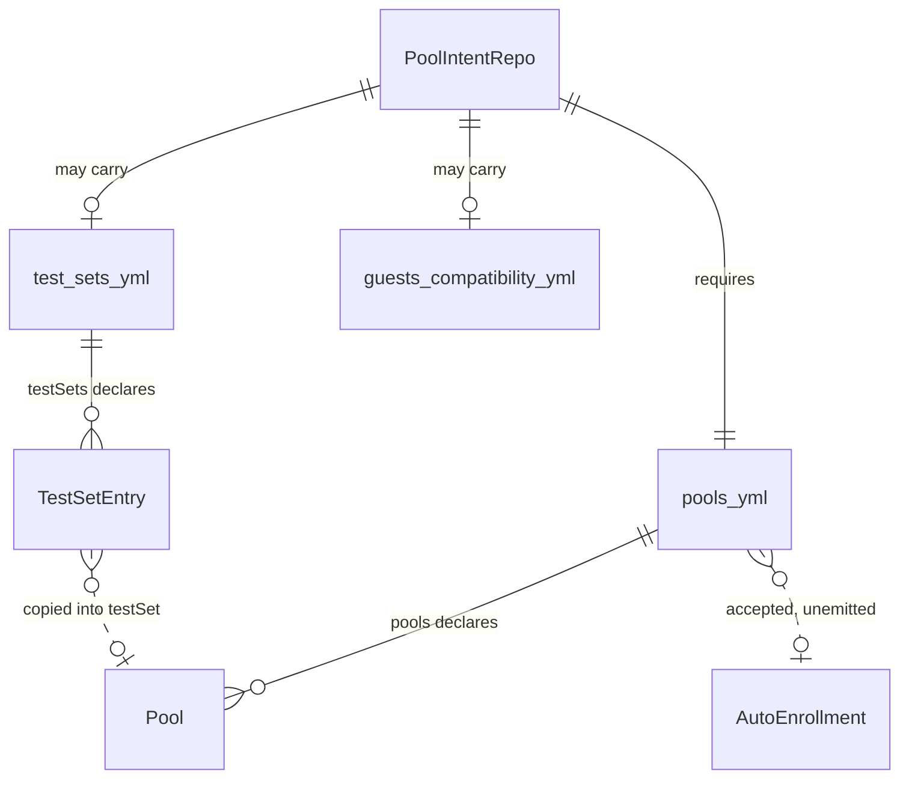
```mermaid
erDiagram
    PoolIntentRepo ||--|| pools_yml : "requires"
    PoolIntentRepo ||--o| test_sets_yml : "may carry"
    PoolIntentRepo ||--o| guests_compatibility_yml : "may carry"
    pools_yml ||--o{ Pool : "pools declares"
    test_sets_yml ||--o{ TestSetEntry : "testSets declares"
    TestSetEntry }o..o| Pool : "copied into testSet"
    pools_yml }o..o| AutoEnrollment : "accepted, unemitted"
    %% planned -- no writer emits autoEnrollment yet; the schema declares it so
    %% every older checkout accepts a document that contains it
```

Boxes on disk. `PoolIntentRepo` is the bare repository, canonically
`<pool share>/pool-intent.git`; the name is fixed, hardcoded by
`Get-PoolIntentSeedUrl` and by the web server alias.
`New-YurunaPoolIntentStore` (`test/modules/Test.PoolAdmin.psm1`) seeds a fresh
bare repo with a `pools.yml` containing exactly `schemaVersion: 2` and an empty
`pools` list. Inside a clone, `pools_yml` is `<IntentDir>/pools.yml`,
`test_sets_yml` is `<IntentDir>/test-sets.yml`, and
`guests_compatibility_yml` is `<IntentDir>/guests.compatibility.yml`. Here is the
fold: the individual `rules[]` entries of the compatibility file are folded into
that one box rather than shown as a `GuestCompatRule` entity; there is exactly
one rule shape and it is spelled out in the Fields table below.

### Relationships

| From | To | Cardinality | What the parser does |
|---|---|---|---|
| PoolIntentRepo | pools_yml | 1 to exactly 1 | `test/pool/Test-PoolIntent.ps1` validates it with `-Required`: an absent `pools.yml` must fail rather than read as success, because runners pull whatever is committed and would otherwise silently run unpooled. |
| PoolIntentRepo | test_sets_yml | 1 to 0..1 | Optional. `test/schemas/pool-test-sets.schema.yml` describes a reusable library for the pool-control board; the runner reads only `pools.yml`. |
| PoolIntentRepo | guests_compatibility_yml | 1 to 0..1 | Optional; `Test-PoolIntent.ps1` skips it when absent, and an absent rule set is permissive in `test/modules/Test.PoolPlanner.psm1`. |
| pools_yml | Pool | 1 to 0..N | `test/schemas/pools.schema.yml` requires `[schemaVersion, pools]` with `schemaVersion` a const 2, and each pool requires `[poolId, poolGuid]`. |
| test_sets_yml | TestSetEntry | 1 to 0..N | Requires `[schemaVersion, testSets]` with `schemaVersion` a const 1; each entry requires `[name, frameworkUrl, projectUrl]`. `name` is the sole upsert and delete key in `test/pool/Set-PoolTestSetDefinition.ps1`, which is why discovered entries are project-scoped as `<project-slug>.<setName>`: every project reports an implicit set called `all`, and a bare name would have one project's `all` overwrite every other's. |
| TestSetEntry | Pool | cross-store | A library entry is copied into a pool's single embedded `testSet` block by `test/pool/Set-PoolTestSet.ps1`. Nothing keeps the copy in sync afterwards; the embedded block is what the cycle reads. |
| pools_yml | AutoEnrollment | cross-store, planned | Declared in the schema, emitted by no writer. The root is `additionalProperties: false` and every admin write re-validates the whole document against the writing checkout's own schema copy, so shipping the declaration everywhere has to come first or a newer writer would break pool administration on every older machine. The same reason explains the accepted-but-unemitted `testSet.sequences[]`. |

### Fields

| Field | Type | Read or written by |
|---|---|---|
| `schemaVersion` | integer, const 2 | `test/schemas/pools.schema.yml`, enforced through `Test-YurunaPoolDocValid` (`test/modules/Test.PoolAdmin.psm1`). |
| `pools[].poolId` | string, `^[a-z0-9][a-z0-9-]{0,62}$` | Same schema; the Loki and Prometheus label value, treated as immutable once telemetry has accumulated under it, because renaming it forks the history. |
| `pools[].poolGuid` | string, 42-prefixed GUID | Same schema; the opaque identifier the dashboard shows, kept distinct from `poolId` so the human-facing value and the telemetry label can evolve independently. |
| `pools[].displayName` | string | Same schema, optional, default empty. |
| `pools[].members[]` | string array, `^42[0-9a-fA-F]{30}$` | Same schema; the single source of truth for membership. `Resolve-YurunaPoolForHost` (`test/modules/Test.PoolSync.psm1`) collects every pool listing this hostId with an ordinal-exact comparison, returns the first and warns when more than one matched -- the "at most one pool" invariant is a cross-array rule JSON Schema cannot express, so `Test-PoolIntent.ps1` and `Add-HostToPool.ps1` enforce it. A member may be a bare string or a mapping carrying `hostId` or `name`; the resolver normalizes both. |
| `pools[].testSet{name, frameworkUrl, projectUrl}` | object | Same schema, `additionalProperties: false`, all three required when present. Overrides `repositories.frameworkUrl` and `repositories.projectUrl` for the cycle. |
| `pools[].config.testCycle` | object, `additionalProperties: true` | Same schema; merged over the host's `test.config.yml` for the cycle. It mirrors the host block deliberately, so a pool can tighten a timeout fleet-wide without editing every host. |
| `pools[].gating{failuresBeforeAlert, successesBeforeRearm, quorum{healthyThreshold, degradedAfterSeconds}}` | object | Same schema; advisory only, and authoring even an empty block opts the pool into alerting. `ConvertTo-PoolGatingRecord` copies only the known numeric knobs and drops extras, and an empty `gating: {}` yields an empty ordered record rather than null, because null is reserved for "the pool authored no gating at all". |
| `pools[].desiredState` | enum `run`, `paused`, `drain` | Same schema, default `run`. `Resolve-YurunaPoolDesiredState` fails safe: a null pool, an absent field or an unrecognized value all return `run`. |
| `testSets[].sequences[]`, `.displayName`, `.description`, `.discovered` | array, string, string, bool | `test/schemas/pool-test-sets.schema.yml`, all optional. |
| `rules[].guestKey` | string, `^[A-Za-z0-9._-]+$` | `test/schemas/guests.compatibility.schema.yml`, required. |
| `rules[].hypervisors[]` | array of `hyper-v`, `kvm`, `utm`, `minItems: 1` | Same schema, required. |
| `rules[].notes` | string | Same schema, optional. |

Validation mechanics are shared. `Test-YurunaPoolDocValid` converts the YAML
schema to JSON at depth 20 and calls `Test-Json`, returning Ok when `Test-Json`
is unavailable, and `Save-YurunaPoolDoc -IntentDir -RelPath -Doc -SchemaName`
re-validates the whole document before writing. Git children in the pull path
(`test/modules/Test.PoolSync.psm1`) run with `GIT_TERMINAL_PROMPT=0`, empty
`GIT_ASKPASS` and `SSH_ASKPASS`, `GCM_INTERACTIVE=never` and stdin closed, and
are killed with the whole process tree on timeout, so an unattended host can
never be blocked by a credential prompt.

**Host identity.** What a pool names, and how a host proves it is the same
machine as last week.

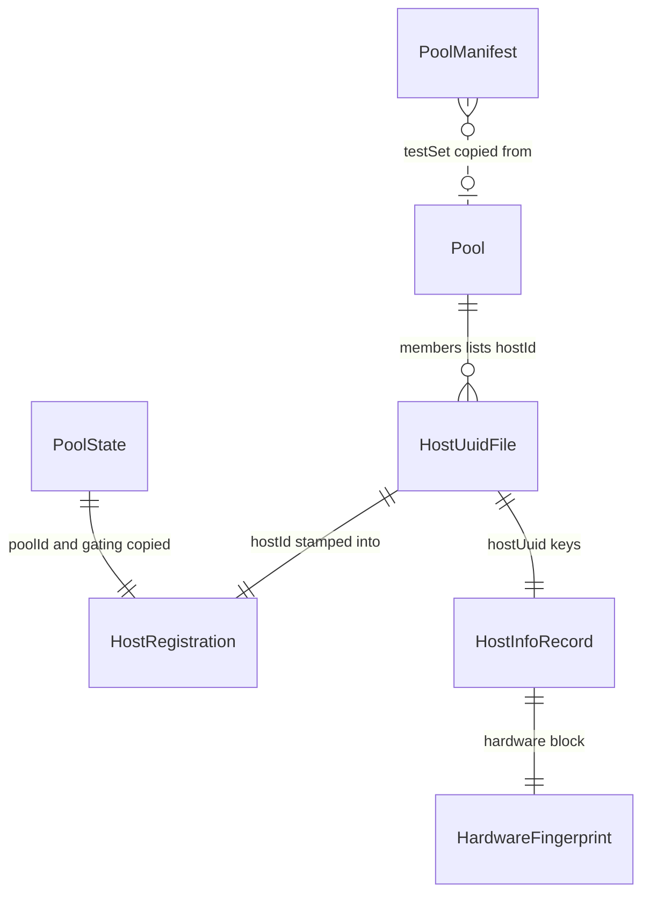
```mermaid
erDiagram
    HostUuidFile ||--|| HostRegistration : "hostId stamped into"
    HostUuidFile ||--|| HostInfoRecord : "hostUuid keys"
    Pool ||--o{ HostUuidFile : "members lists hostId"
    PoolState ||--|| HostRegistration : "poolId and gating copied"
    PoolManifest }o..o| Pool : "testSet copied from"
    HostInfoRecord ||--|| HardwareFingerprint : "hardware block"
```

Boxes on disk. `HostUuidFile` is `<runtimeDir>/host.uuid`, a 42-prefixed 32-hex
string created on first use by `Get-YurunaHostId`
(`test/modules/Test.YurunaDir.psm1`) and shared with `Get-PerfHostUuid`, which
falls back to `<testRoot>/status/runtime/host.uuid`. Removing the runtime
directory re-keys the host, matching how the rest of that folder behaves.
`HostInfoRecord` is `<pool share>/hosts/info.<hostId>.yml`, published by
`Write-HostInfoRecord` (`test/modules/Test.HostIdentity.psm1`).
`HardwareFingerprint` is the `hardware` sub-map inside it.
`HostRegistration`, `PoolState` and `PoolManifest` are the runtime files already
described above.

### Relationships

| From | To | Cardinality | What the parser does |
|---|---|---|---|
| HostUuidFile | HostRegistration | 1 to exactly 1 | The entry point caches the value on a process global, so the NDJSON hot path and the registration writer read memory rather than disk. The schema pins the format with `^42[0-9a-fA-F]{30}$`. |
| HostUuidFile | HostInfoRecord | 1 to exactly 1 | One `info.<hostId>.yml` per host on the share. `hosts/` deliberately holds both these files and per-host directories: the reclaim scanner enumerates with `-Filter 'info.*.yml' -File`, so the directories are invisible to it. |
| Pool | HostUuidFile | 1 to 0..N | Membership is the operator-authored `members[]` array. The `poolId` echoed back in `host.registration.json` is derived from it, so the intent side is authoritative and a host never asserts its own pool. |
| PoolState | HostRegistration | 1 to exactly 1 | One read, one copy: the writer takes `poolId`, `poolGuid` and `gating` from the file rather than re-deriving them. |
| PoolManifest | Pool | cross-store | Written from the resolved pool's `testSet`, and deleted when the pool is null or the triple is missing. It also refuses a `testSet` on the auto-enrollment target pool with a warning, as defense in depth for a hand-edited store: a host that lands in that pool automatically must keep running its own project. |
| HostInfoRecord | HardwareFingerprint | 1 to exactly 1 | `ConvertFrom-HostInfoRecord` lifts the record back to a flat fingerprint hashtable and tolerates a missing `hardware` subtree, so an older record still scores against a candidate. |

### Fields

| Field | Type | Read or written by |
|---|---|---|
| `host.uuid` body | string, 42-prefixed 32-hex | `Get-YurunaHostId` (`test/modules/Test.YurunaDir.psm1`) and `Get-PerfHostUuid` (`test/modules/Test.Perf.psm1`); one file, two readers, by design. |
| `hostUuid` | string | `New-HostInfoRecordObject` (`test/modules/Test.HostIdentity.psm1`). |
| `hostname`, `hostType`, `platform`, `lastSeenUtc` | strings | Same writer; refreshed after each pool-storage drain. |
| `hardware.smbiosUuid`, `.baseboardSerial`, `.cpuModel` | strings | Same writer; the identity evidence `Get-HostIdentityMatchScore` ranks a candidate on. |
| `hardware.cpuCount` | int | Same writer. |
| `hardware.ramBytes` | int64 | Same writer; typed explicitly because a 32-bit int overflows on any real host. |
| `hardware.macAddresses` | string array | Same writer, normalized through `ConvertTo-NormalizedMacList` so a formatting difference between platforms is not read as a different machine. |

## Credentials and extension configuration

**The vault and the users mapping.** What the host holds locally and never
publishes.

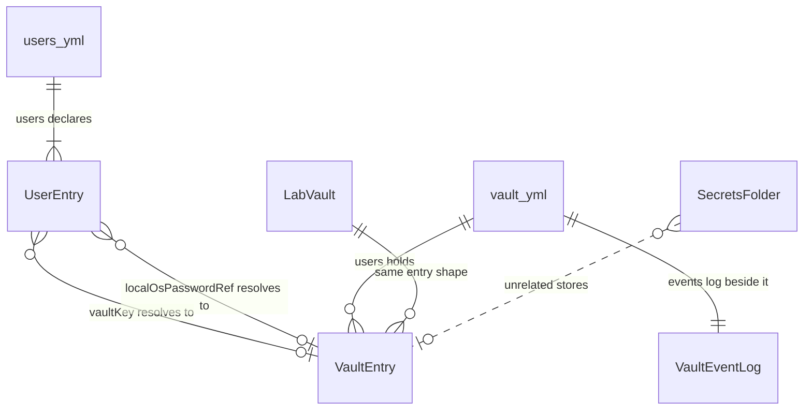
```mermaid
erDiagram
    users_yml ||--|{ UserEntry : "users declares"
    UserEntry }o--o| VaultEntry : "vaultKey resolves to"
    UserEntry }o--o| VaultEntry : "localOsPasswordRef resolves to"
    vault_yml ||--o{ VaultEntry : "users holds"
    vault_yml ||--|| VaultEventLog : "events log beside it"
    LabVault ||--o{ VaultEntry : "same entry shape"
    SecretsFolder }o..o| VaultEntry : "unrelated stores"
    %% optional -- the deploy secrets folder is a separate, project-side store;
    %% no code moves a value between the two
```

Boxes on disk. `users_yml` is
`test/status/extension/authentication/users.yml`, bootstrapped from the committed
`test/extension/authentication/users.yml.template`. `vault_yml` is
`test/status/extension/authentication/vault.yml`. `VaultEventLog` is
`events.log` in the same directory. `LabVault` is
`lab.<name>.vault.yml` beside them. `SecretsFolder` is the project-side
`config/<cloud>/secrets/*.txt` from the deploy view above, drawn here only to
make the separation explicit. All three runtime files sit under
`test/status/extension/authentication/` on purpose, so they inherit the
`test/status/*/` gitignore rule and the status service's `extension/*` HTTP
deny-list entry.

### Relationships

| From | To | Cardinality | What the parser does |
|---|---|---|---|
| users_yml | UserEntry | 1 to 1..N | `test/schemas/users.schema.yml` requires `[users]` and is `additionalProperties: false`; entry names match `^[A-Za-z0-9._-]+$`. The bundled template declares nine logical users: `yuuser24`, `yuuser26`, `yauser1`, `ywuser1`, `caching-proxy-service-admin`, `pool-control-service-admin`, `stash-admin`, `download-agent-service-admin` and `internal-auth-key`. |
| UserEntry | VaultEntry | N to 0..1 (via `vaultKey`) | `Get-Password` (`test/extension/authentication/default.psm1`) resolves `vaultKey` with `AutoGenerate = $false`, so a populated key whose vault entry is missing throws and the config gate blocks the cycle rather than minting a password a directory would reject. An empty `vaultKey` falls back to the logical name and auto-generates on first reference. |
| UserEntry | VaultEntry | N to 0..1 (via `localOsPasswordRef`) | `Get-LocalOsPassword` resolves `localOsPasswordRef`, or the logical name when it is empty, and always auto-generates -- that account is the harness's own. The asymmetry with the row above is deliberate. |
| vault_yml | VaultEntry | 1 to 0..N | `test/schemas/vault.schema.yml` requires `[users]`, is `additionalProperties: false`, and each entry requires `[password, updatedUtc]`. `Read-VaultUnlocked` returns an empty ordered users map for a missing or blank file and throws on malformed YAML. |
| vault_yml | VaultEventLog | 1 to exactly 1 | `Write-VaultEvent` appends one JSON line per operation and never logs a password value. Rotation is byte-bounded: a 1 MB live file with `.1` through `.10` archives. |
| LabVault | VaultEntry | 1 to 0..N | `test/schemas/lab.vault.schema.yml` reuses the same entry shape, so a host reads a lab credential through the existing `Get-Password` path once the entries are merged. |
| SecretsFolder | VaultEntry | cross-store, none | Drawn to be explicit: the deploy-side secrets folder and the harness vault are separate stores with separate readers. No code path copies a value between them. |

### Fields

| Field | Type | Read or written by |
|---|---|---|
| `strict` | bool | `test/schemas/users.schema.yml` declares `default: false`, but `test/Test-Config.ps1` initializes the variable to `$true` and overrides it only when the key is present -- so an absent `strict` is enforced as strict by the config gate. |
| `users.<logical>.localOsUser` | string | `test/extension/authentication/default.psm1`; optional. |
| `users.<logical>.corporate{domain, sam, upn}` | object of strings | Same reader; `additionalProperties: false`. `test/Test-Config.ps1` rejects a half-populated block, because a `sam` without a `domain` is almost always an operator mistake. |
| `users.<logical>.vaultKey` | string | `Get-Password`; see the asymmetry above. |
| `users.<logical>.localOsPasswordRef` | string | `Get-LocalOsPassword`; see the asymmetry above. |
| `users.<vaultKey>.password` | string, `minLength: 1` | `test/extension/authentication/default.psm1`. Field name only; no value is recorded anywhere in this document. |
| `users.<vaultKey>.previousPassword` | string, no minimum length | Same reader; the empty default has to stay valid, which is why the length floor is absent here and present above. |
| `users.<vaultKey>.updatedUtc` | string, `format: date-time` | Same reader, required. |
| `ts`, `event`, `outcome`, `username`, `detail` | strings | `Write-VaultEvent`; `event` is validated against `init`, `get`, `generate`, `set`, `vaultkey` and `outcome` against `hit`, `miss`, `ok`, `error`. |
| `schemaVersion` | integer, const 1 | `test/schemas/lab.vault.schema.yml`. |
| `lab.name` | string, `^[a-z0-9][a-z0-9-]{0,62}$` | Same schema; the same charset as a pool id. |
| `lab.createdUtc` | string, date-time | Same schema, required with `name`. |
| `lab.poolPath`, `.stashPath`, `.intentGitPath` | strings | Same schema, optional. `test/modules/Test.Lab.psm1` infers the storage root from `lab.poolPath`. |

Two write-path details are load-bearing. `Invoke-WithVaultLock` serializes
read-modify-write on a named .NET mutex derived from the SHA-1 of the lowercased
vault path with a thirty-second wait, so parallel guest provisioning cannot race
and two checkouts under different paths get distinct mutexes.
`Write-VaultUnlocked` writes `<path>.tmp` and then force-moves it. The generated
password alphabet excludes quote characters, and the leading character is drawn
from alphanumerics only, because a leading YAML indicator would be single-quoted
on write and then substituted unquoted into the cloud-init `password:` line. The
lab vault is deliberately plain text: the file exists to be copied to the lab's
other hosts, which DPAPI-bound `Export-Clixml` or `ConvertFrom-SecureString`
would defeat. Template bootstrap copies `users.yml.template` only when the
runtime file is absent; afterwards `Merge-UsersTemplateEntry` appends template
entries the live file has never seen, but only credential-free ones and only when
`users:` is the last top-level key -- the append is textual, so operator comments
and ordering survive.

**Extension area configuration.** Which providers an area loads, and which areas
front a service VM.

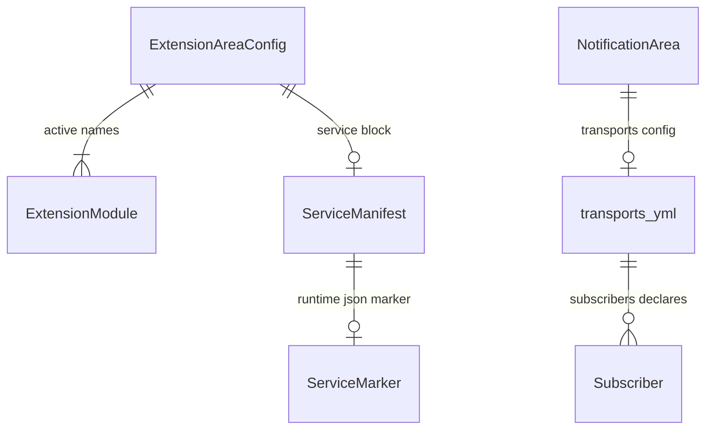
```mermaid
erDiagram
    ExtensionAreaConfig ||--|{ ExtensionModule : "active names"
    ExtensionAreaConfig ||--o| ServiceManifest : "service block"
    ServiceManifest ||--o| ServiceMarker : "runtime json marker"
    NotificationArea ||--o| transports_yml : "transports config"
    transports_yml ||--o{ Subscriber : "subscribers declares"
```

Boxes on disk. `ExtensionAreaConfig` is
`test/extension/<area>/<area>.config.yml`, shaped by
`test/schemas/extension-config.schema.yml`. `ExtensionModule` is a sibling
`<name>.psm1`. `ServiceManifest` is the optional `service` block inside the
config. `ServiceMarker` is `<runtimeDir>/<area>.json`, written when a host brings
the service up and removed when it stops it. `NotificationArea` is the
`notification` area specifically; `transports_yml` is
`test/status/extension/notification/transports.yml`, from the committed
`test/extension/notification/transports.yml.template`.

Nine directories live under `test/extension/`; eight carry a config, because
`extension-sdk` is a shared Go library and carries none. All eight declare
`active: [default]`. Five carry a `service` block:

| Area | vmName | healthPort | healthPath | markerBaseUrlKey | beaconInterval |
|---|---|---|---|---|---|
| `caching-proxy-service` | `yuruna-caching-proxy-service` | 3128 | (none) | `cachingProxyServiceBaseUrl` | `2m` |
| `download-agent-service` | `yuruna-download-agent-service` | 80 | `/healthz` | `downloadAgentServiceBaseUrl` | `2m` |
| `pool-aggregator-service` | (none; `hostedIn: caching-proxy-service`) | 9400 | `/healthz` | (none) | (none) |
| `pool-control-service` | `yuruna-pool-control-service` | 80 | `/healthz` | `poolControlServiceBaseUrl` | `2m` |
| `stash-service` | `yuruna-stash-service` | 80 | `/healthz` | `stashBaseUrl` | `2m` |

The three without a `service` block -- `authentication`,
`caching-proxy-parser-service` and `notification` -- are code the cycle loads
rather than services on the network. Five plus three is eight, the real count.

### Relationships

| From | To | Cardinality | What the parser does |
|---|---|---|---|
| ExtensionAreaConfig | ExtensionModule | 1 to 1..N | `active[]` is required with `minItems: 1` and each entry matches `^[A-Za-z0-9._-]+$`, naming a sibling `.psm1` base name. `Import-Extension` (`test/modules/Test.Extension.psm1`) throws when the named module file is absent. |
| ExtensionAreaConfig | ServiceManifest | 1 to 0..1 | Optional, `additionalProperties: false`, `required: [displayName]`. An area with no block is code the cycle loads; an area with `hostedIn` and no `vmName` is deliberately kept out of the host's startable-VM roster. |
| ServiceManifest | ServiceMarker | 1 to 0..1 | Present only while the service is up on this host. `Get-ActiveExtensionService` reads the markers to build `activeExtensions[]` and `extensionTargets{}` for the registration record, so the pool board can list extension hosts without mounting a share. |
| NotificationArea | transports_yml | 1 to 0..1 | Absent means no transport is configured and nothing is delivered. |
| transports_yml | Subscriber | 1 to 0..N | `test/schemas/notification.transports.schema.yml` requires `[transports, subscribers]` and is `additionalProperties: false`; `subscribers.<eventCode>` is an array of `{transport, address}`. |

Cardinality note for `active[]`: `Import-Extension -RequireSingle` throws when
the list holds anything other than exactly one entry. The `authentication` area
is imported that way, so an area config listing two providers fails the config
gate rather than being silently narrowed; the `notification` area iterates its
whole list instead.

### Fields

| Field | Type | Read or written by |
|---|---|---|
| `active[]` | string array, `minItems: 1` | `Get-ActiveExtensionName` and `Import-Extension` (`test/modules/Test.Extension.psm1`); also `Get-CapabilityExtensionArea` (`test/modules/Test.Capability.psm1`), which reads only this key and folds an unreadable config to an empty array. |
| `service.displayName` | string | `test/modules/Test.ExtensionService.psm1`; the only required key in the block. |
| `service.vmName` | string, `^[A-Za-z0-9._-]+$` | Same module; its presence is what puts the area on the host's startable-VM roster. |
| `service.hostedIn` | string | Same module; names the area whose VM hosts this service instead. |
| `service.healthPort` | integer 1..65535 | Same module; the lab-health gate derives its probe set from every area's declared port, which is why no probe list appears in `test.config.yml`. |
| `service.healthPath` | string, `^/` | Same module; absent for `caching-proxy-service`, which answers as a proxy rather than on an HTTP health route. |
| `service.startScript`, `.stopScript` | string, `^[A-Za-z0-9._-]+\.ps1$` | Same module; resolved under `test/service/`. |
| `service.markerBaseUrlKey` | string, `^[A-Za-z0-9_]+$` | Same module; the key under which the host advertises the service's base URL. |
| `service.beaconInterval` | string, `^[0-9]+(ns\|us\|ms\|s\|m\|h)$` | Same module; a Go duration, because the daemon parses it. |
| `service.writeGate` | enum `lab-token`, `none` | Same module, defaulting to `lab-token` when absent. |
| `transports.resend{apiKey, fromEmail}` | object of strings | `test/schemas/notification.transports.schema.yml`; both required when the block is present. Field names only. |
| `subscribers.<eventCode>[].transport` | enum `email` | Same schema; the only transport a subscriber may name today. |
| `subscribers.<eventCode>[].address` | string | Same schema, required with `transport`. |

**How the schemas are enforced.** Thirteen files live in `test/schemas/`, and
they fall into two groups. Seven are validated at runtime. Four go through
`Test-AgainstSchema` (`test/modules/Test.ConfigValidator.psm1`) from
`test/Test-Config.ps1`: `extension-config.schema.yml` for every area directory
that carries a config, `notification.transports.schema.yml`, `vault.schema.yml`
and `users.schema.yml`. Three more go through the pool CLIs'
`Save-YurunaPoolDoc` and `Test-YurunaPoolIntentFile`: `pools.schema.yml`,
`pool-test-sets.schema.yml` and `guests.compatibility.schema.yml`. The
remaining six are contracts without a runtime validator call:
`sequence.schema.yml`,
`snippets.schema.yml` and `actions.schema.yml` are enforced by editors through
the `yaml-language-server` header their documents carry;
`orchestration-sequence.schema.yml` describes a shape detected in code;
`host.registration.schema.yml` is the contract between the PowerShell writer and
the Go reader in `test/extension/pool-aggregator-service/main.go`; and
`lab.vault.schema.yml` documents a file written line by line by
`test/lab/New-Lab.ps1`. `Test-AgainstSchema` parses the document through
`Read-TestConfig -ThrowOnError` -- so schema validation reuses the hardened
cached reader -- converts both sides with `ConvertTo-Json -Depth 32`, and calls
`Test-Json`. When `Test-Json` is unavailable it degrades to a parse-only pass: it
never blocks a cycle on missing tooling, only on real content errors. A missing
schema file is a warning; a missing document is a failure.
