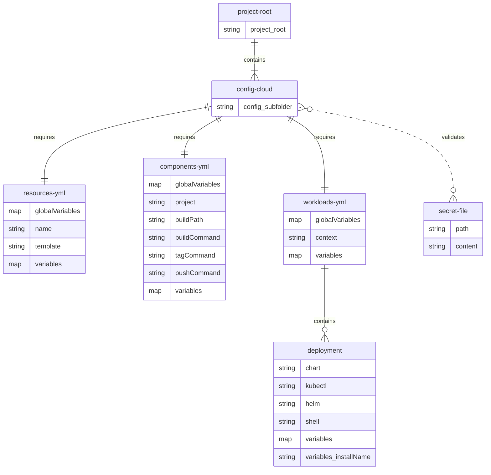
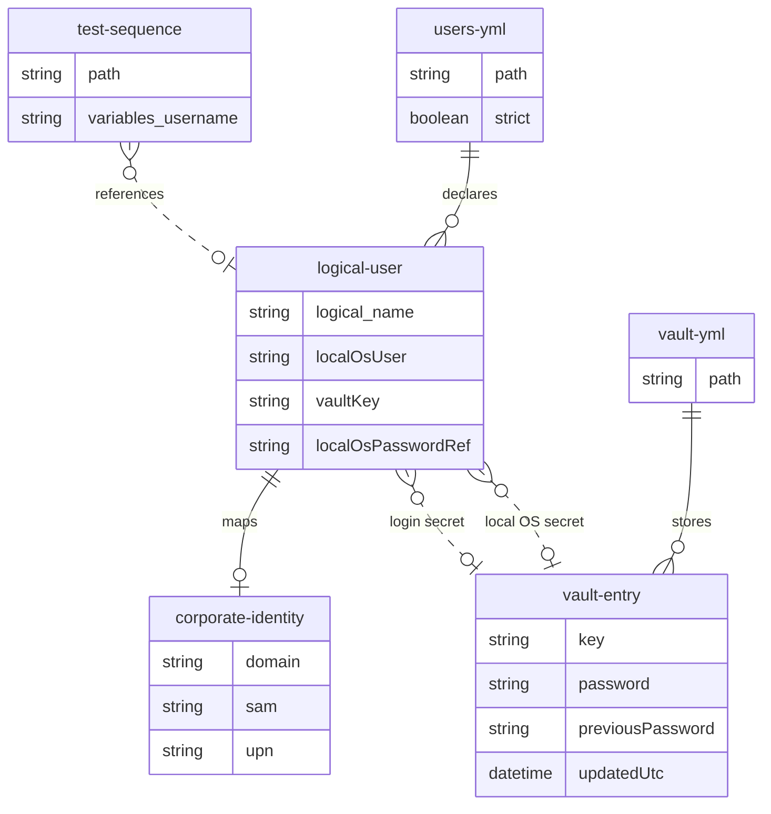

# Configuration data model

This page models the deployment-project records and the separate test-authentication records that current code reads and writes.

[Yuruna Architecture](../architecture.md) | [Design index](00-index.md) | [Data flows](03-data-flows.md)

## Deployment project

```mermaid
erDiagram
  project-root ||--|{ config-cloud : contains
  config-cloud ||--|| resources-yml : requires
  config-cloud ||--|| components-yml : requires
  config-cloud ||--|| workloads-yml : requires
  workloads-yml ||--o{ deployment : contains
  %% optional -- secret files are supported but absent from current examples
  config-cloud }o..o{ secret-file : validates

  project-root {
    string project_root
  }
  config-cloud {
    string config_subfolder
  }
  resources-yml {
    map globalVariables
    string name
    string template
    map variables
  }
  components-yml {
    map globalVariables
    string project
    string buildPath
    string buildCommand
    string tagCommand
    string pushCommand
    map variables
  }
  workloads-yml {
    map globalVariables
    string context
    map variables
  }
  deployment {
    string chart
    string kubectl
    string helm
    string shell
    map variables
    string variables_installName
  }
  secret-file {
    string path
    string content
  }
```

The tracked examples live at `yuruna-project/example/<project>/`; the scaffold is
the project root `yuruna-project/template/`. Each environment folder contains
`resources.yml`, `components.yml`, and `workloads.yml`. Current tracked environments
are localhost, AWS, and Azure; config-folder selection in
`automation/Yuruna.LogLevel.psm1` is generic, but no GCP project/provider tree is
implemented.

There is no separate schema file for the three deployment documents. Their current
contract is enforced by `automation/Yuruna.Validation.psm1` and consumed by
`Yuruna.{Resource,Component,Workload}.psm1`. Each file entity folds its repeated
record collection together with document-level `globalVariables` so this view
stays within seven entities:

- Resource entries require a unique `name`; `template` can select a project
  `resources/` folder or the `global/resources/` fallback, and `variables` is
  optional. The phase generates `config/<environment>/resources.output.yml`.
- Component entries require a unique `project`; `buildPath` and `variables` are
  optional, while effective build, tag, and push commands must resolve from local
  or global variables.
- Workload entries require a unique `context` and hold ordered `deployments`.
  Deployment kind is resolved from nonempty command keys rather than stored in a
  `kind` field: `chart` wins when present; otherwise the last present non-chart key
  in registration order (`kubectl`, `helm`, `shell`) wins. Chart deployments also
  require `variables.installName`, unique after expansion within their context.
- Secret files are optionally supported at `config/<environment>/secrets/*.txt` or
  shared `config/secrets/*.txt`. Workload validation requires nonblank content, but
  the phase modules do not automatically inject that content.

Resource outputs are flattened into the variable environment, then layered before
component and workload locals by `Yuruna.VariableExpansion.psm1`,
`Yuruna.Component.psm1`, and `Yuruna.Workload.psm1`. That file-based handoff is
shown in [Data flows](03-data-flows.md#a-three-phase-deployment) instead of adding
an eighth entity here.

## Test authentication

```mermaid
erDiagram
  %% optional -- only sequences declaring a logical user create this reference
  test-sequence }o..o| logical-user : references
  users-yml ||--o{ logical-user : declares
  %% optional -- corporate mapping and explicit vault references may be empty
  logical-user ||--o| corporate-identity : maps
  logical-user }o..o| vault-entry : "login secret"
  logical-user }o..o| vault-entry : "local OS secret"
  vault-yml ||--o{ vault-entry : stores

  test-sequence {
    string path
    string variables_username
  }
  users-yml {
    string path
    boolean strict
  }
  logical-user {
    string logical_name
    string localOsUser
    string vaultKey
    string localOsPasswordRef
  }
  corporate-identity {
    string domain
    string sam
    string upn
  }
  vault-yml {
    string path
  }
  vault-entry {
    string key
    string password
    string previousPassword
    datetime updatedUtc
  }
```

The committed contract is
`test/extension/authentication/{authentication.config.yml,authentication.contract.yml,users.yml.template,default.psm1}`
plus `test/schemas/{users.schema.yml,vault.schema.yml}`. Runtime `users.yml` and
`vault.yml` live under `test/status/extension/authentication/` and are gitignored;
no vault file belongs to `yuruna-project`.

Project tests such as
`yuruna-project/example/website/test/workload.guest.ubuntu.server.24.k8s.website.yml`
reference logical users. `test/Test-Config.ps1` scans those references when strict
validation is enabled. An empty `vaultKey` falls back to the logical name and can be
generated lazily; a populated key must already exist. `localOsPasswordRef` selects
the vault entry used for the guest-OS password, which may be distinct from the
login entry. The vault schema requires `password` and `updatedUtc` and permits
`previousPassword`.

The harness vault does not supply cloud or component-registry credentials. Those
are resolved separately by `automation/Yuruna.CredentialProvider.psm1` and
`automation/Yuruna.Component.Registry.psm1`, so no vault-to-cloud or
vault-to-registry edge is present.
