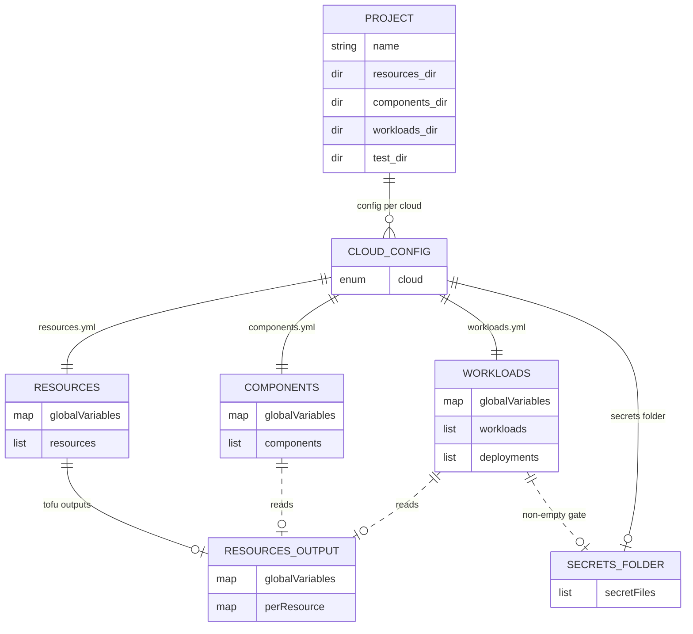
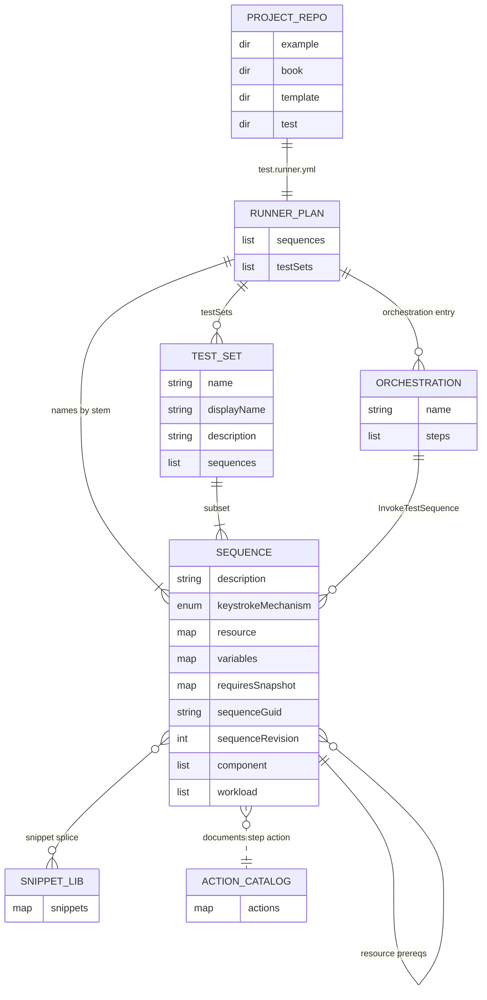
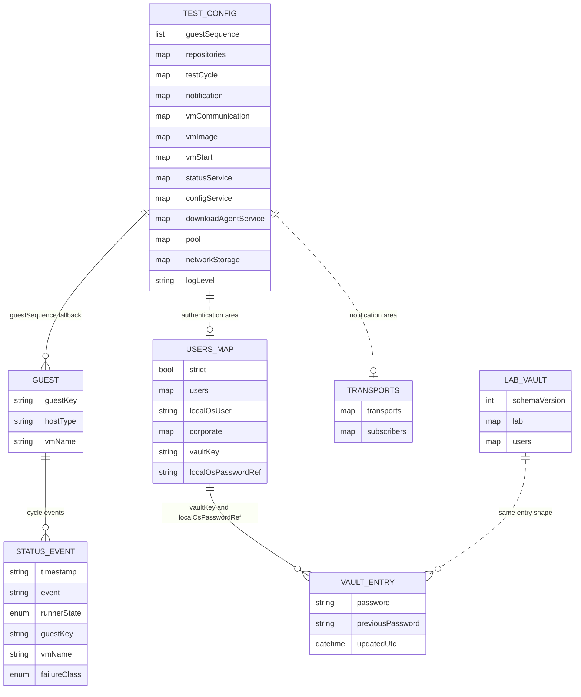
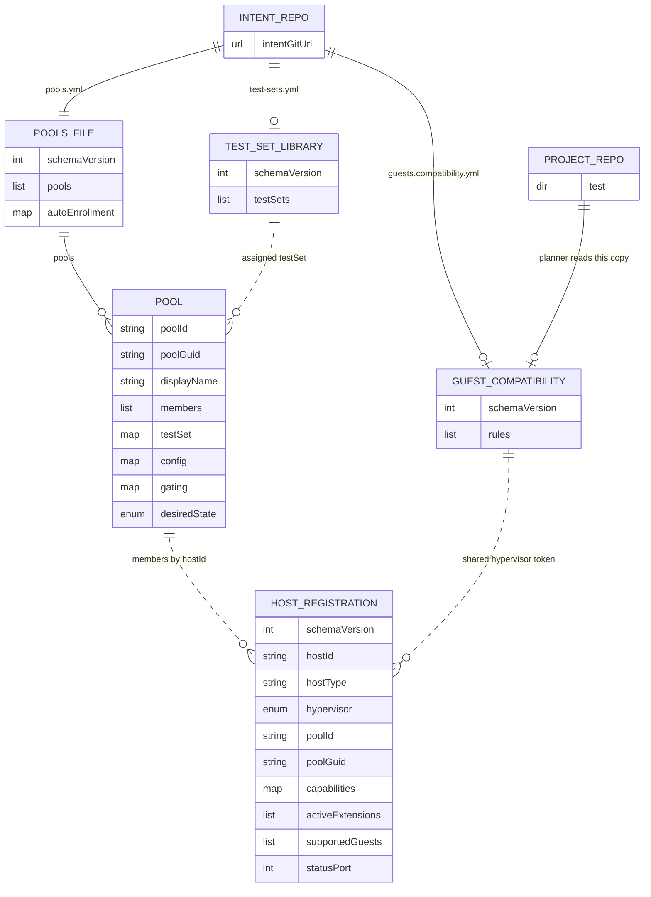

# Configuration data model

> One sentence: the YAML the engine and harness read — project deploy data, the
> project's own cycle plan, harness runtime state, and pool intent — as four
> entity-relationship views.

See [Design overview](00-index.md) · [Yuruna Architecture](../architecture.md).

Derived from `yuruna-project/{example,template,book,test}`, the parsing code in
`automation/Yuruna.{Resource,Component,Workload,Validation,DeploymentKind,VariableExpansion}.psm1`
and `automation/Import.Yaml.psm1`, `test/test.config.yml.template`,
`test/modules/{Test.SequenceResolve,Test.SequencePlanner,Test.RunnerInnerLoop,Test.HostDetection,Test.PoolPlanner,Test.Capability}.psm1`,
`test/Test-Config.ps1`, and the schemas under `test/schemas/`. No secret values
appear here — only field names.

**How to read the diagrams.** A solid edge (`--`) means the child file or record
is contained by, or generated from, its parent. A dashed edge (`..`) means a
cross-store join or a documentation-only reference that no code enforces. Each
diagram is followed by a **relationships** table marking every drawn edge either
*engine* (the phase or cycle fails without it) or *convention* (the code
tolerates its absence), then a **fields** table naming the schema file or module
that defines each attribute.

## Project deploy data

```mermaid
erDiagram
    PROJECT ||--o{ CLOUD_CONFIG : "config per cloud"
    CLOUD_CONFIG ||--|| RESOURCES : "resources.yml"
    CLOUD_CONFIG ||--|| COMPONENTS : "components.yml"
    CLOUD_CONFIG ||--|| WORKLOADS : "workloads.yml"
    CLOUD_CONFIG ||--o| SECRETS_FOLDER : "secrets folder"
    RESOURCES ||--o| RESOURCES_OUTPUT : "tofu outputs"
    COMPONENTS ||..o| RESOURCES_OUTPUT : "reads"
    WORKLOADS ||..o| RESOURCES_OUTPUT : "reads"
    WORKLOADS ||..o| SECRETS_FOLDER : "non-empty gate"
    %% planned: a gcp CLOUD_CONFIG parses, but global/resources/gcp ships no templates

    PROJECT {
        string name
        dir resources_dir
        dir components_dir
        dir workloads_dir
        dir test_dir
    }
    CLOUD_CONFIG {
        enum cloud
    }
    RESOURCES {
        map globalVariables
        list resources
    }
    COMPONENTS {
        map globalVariables
        list components
    }
    WORKLOADS {
        map globalVariables
        list workloads
        list deployments
    }
    RESOURCES_OUTPUT {
        map globalVariables
        map perResource
    }
    SECRETS_FOLDER {
        list secretFiles
    }
```

Seven boxes. The generated per-resource work-folder tree under
`.yuruna/<cloud>/resources/<name>/` is deliberately **not** an entity — it is
build state, not configuration, and its shape is drawn in
[03-data-flows.md](03-data-flows.md).

### Relationships

| Edge | Cardinality | Verdict | What happens without it |
|---|---|---|---|
| `PROJECT` → `CLOUD_CONFIG` | 1 : 0..n | convention | A project with no `config/` tree is legal and shipped: `example/nested.host` and `book/` carry only `test/`. Only a `Set-*` run needs one. |
| `CLOUD_CONFIG` → `RESOURCES` | 1 : 1 | **engine** | `Confirm-ResourceList` fails on a missing `resources.yml` *and* on a null `resources:` list; `Publish-ResourceList` returns a `config_error` manifest either way. |
| `CLOUD_CONFIG` → `COMPONENTS` | 1 : 1 | **engine** (file only) | A missing `components.yml` is `config_error`. A present file whose `components:` is null returns success with `skipped: $true` — the file must exist, its content need not. |
| `CLOUD_CONFIG` → `WORKLOADS` | 1 : 1 | **engine** (file only) | Same rule as components: missing file fails, null `workloads:` skips. |
| `CLOUD_CONFIG` → `SECRETS_FOLDER` | 1 : 0..1 | convention | `Invoke-SecretFolderValidation` returns true immediately when the folder is absent, and no example project ships one. |
| `WORKLOADS` ⇢ `SECRETS_FOLDER` | 1 : 0..1 | **engine** when present | The workloads validator walks the folder with `-RequireNonEmpty`, so a single whitespace-only `.txt` blocks the phase. The resources validator runs the same walk *without* the switch — there the same file is informational only. |
| `RESOURCES` → `RESOURCES_OUTPUT` | 1 : 0..1 | **engine** for teardown | Pass 2 of `Publish-ResourceListHelper` recreates the file with `-Force`; without it `Clear-Configuration` returns `$false` and destroys nothing. |
| `COMPONENTS` ⇢ `RESOURCES_OUTPUT` | 1 : 0..1 | convention, then **engine** | The read is `Test-Path` gated, so absence passes validation. The shipped configs then resolve their registry through it, so a build that needs one fails at the docker command rather than at validation. |
| `WORKLOADS` ⇢ `RESOURCES_OUTPUT` | 1 : 0..1 | convention, then **engine** | Same, plus a documented fallback to `config/<cloud>/../resources.output.yml` so a phased deployment can reuse an upper-level output. |

### Fields

| Entity . field | Shape | Defined by |
|---|---|---|
| `PROJECT.name` | directory name under `example/` | `yuruna-project/example/`, `template/` layout |
| `PROJECT.resources_dir` | `resources/<template>`, falling back to `global/resources/<template>` | `Yuruna.Validation.psm1` `Confirm-ResourceList` |
| `PROJECT.components_dir` | `components/<buildPath>` holding a Dockerfile | `Yuruna.Component.psm1` `Publish-ComponentList` |
| `PROJECT.workloads_dir` | `workloads/<chart>` | `Yuruna.Workload.psm1` chart deployment |
| `PROJECT.test_dir` | the project's own sequences and `_snippets.yml` | `Test.SequenceResolve.psm1` |
| `CLOUD_CONFIG.cloud` | the `config/` subfolder name; `localhost`, `aws`, `azure` ship templates | `global/resources/` |
| `RESOURCES.globalVariables` | flat map, every value must be non-empty | `Yuruna.Validation.psm1` `Confirm-GlobalVariableList` |
| `RESOURCES.resources` | list of `name` / `template` / `variables` | `Yuruna.Validation.psm1` `Confirm-ResourceList` |
| `COMPONENTS.components` | list of `project` (required) / `buildPath` (defaults to `project`) / `variables`, plus `buildCommand`, `tagCommand`, `pushCommand` — **required, but per entry *or* inherited from `globalVariables`** — and the genuinely optional `preProcessor` / `postProcessor` | `Yuruna.Component.psm1`, `Yuruna.Validation.psm1` `Confirm-ComponentList` |
| `WORKLOADS.workloads` | list of `context` / `variables` / `deployments` | `Yuruna.Validation.psm1` `Confirm-WorkloadList` |
| `WORKLOADS.deployments` | one of `chart`, `kubectl`, `helm`, `shell` per entry | `Yuruna.DeploymentKind.psm1` catalog |
| `RESOURCES_OUTPUT.globalVariables` | the expanded pass-1 bag, written back verbatim | `Yuruna.Resource.psm1` |
| `RESOURCES_OUTPUT.perResource` | one key per deployed resource, each a map of `value` / `sensitive` leaves | `tofu output -json`, written by `Yuruna.Resource.psm1` |
| `SECRETS_FOLDER.secretFiles` | `*.txt` under `config/<cloud>/secrets`, plus the peer `config/secrets` | `Yuruna.Validation.psm1` `Invoke-SecretFolderValidation` |

`PROJECT ||--o{ CLOUD_CONFIG` is zero-or-more on purpose: `example/nested.host`
is a shipped, sequence-only project with no `config/` tree at all.
`yuruna-project/template` is itself the scaffold — there is no
`template/<project>` level.

The relationships the engine relies on: a resource's `template` resolves to
`resources/<template>` with fallback to `global/resources/<template>`; a
component's `buildPath` (default: its `project`) must hold a `Dockerfile` under
`components/<buildPath>` — auto-discovered as `Dockerfile` → `dockerfile` →
`<projectName>-dockerfile`, never configured; a deployment's `chart` resolves
under `workloads/<chart>` and requires `variables.installName`. Deployment kind
is detected by which field is present — one of `chart | kubectl | helm | shell`
— and the precedence is not "exactly one or fail": `chart` wins whenever it is
present, and otherwise the **last** present non-chart kind in registration order
(`kubectl`, `helm`, `shell`) is the one that runs.

`RESOURCES_OUTPUT` is the generated `config/<cloud>/resources.output.yml`.
`Yuruna.VariableExpansion.psm1` flattens it into the environment with two rules:
keys under `globalVariables` land under their bare key, while every other
top-level key `R` becomes `R.<outputName>` taking the leaf's `value`. That
flattened `<resource>.<output>` form is what the shipped configs depend on —
`example/website/config/localhost/components.yml` resolves its registry via
`"${env:registryName}.registryLocation"`.

Those top-level keys are also the **deployed-resource inventory**, and teardown
is the third consumer of the file: `Yuruna.Clear.psm1` walks every key except
`globalVariables` and runs `tofu destroy` in the matching
`.yuruna/<cloud>/resources/<resourceName>` work folder. A resource declared with
an empty `template` never appears here — it only names an already-existing
resource and owns no work folder — so the key set is exactly what can be torn
down. There is no `resources:` list in this file; that shape belongs to the
forward `resources.yml`. Teardown deliberately proceeds even when forward
`resources.yml` validation fails, warning instead of stopping: config drift after
deploy must not strand cloud resources.

**Variable precedence differs by phase**, and the two chains differ in their
final layer:

| Phase | Precedence (last wins) |
|---|---|
| Workloads | resources output → workloads `globalVariables` → workload `variables` → deployment `variables` |
| Components | resources output → components `globalVariables` → component `variables` → engine-forced `project` / `buildPath` / `dockerfile` |

The component phase has no deployment layer, and its final layer is
engine-forced: a component that sets `project` under its own `variables:` is
silently overridden.

`Import.Yaml.psm1` is the parse boundary for the resources/components/workloads
entities and their generated output — `ConvertFrom-YAML -Ordered`, throwing when
`powershell-yaml` is absent. Ordered parsing is load-bearing for the precedence
chains, which accumulate into `[ordered]` sinks.

The `secrets` folder is a **code-only convention** — it has no schema under
`test/schemas/` and no page under `docs/`. Nothing in the engine reads a secret's
content; the walk exists to reject an empty one before a chart bakes the empty
string into a cluster Secret, and to mark each file `git update-index
--assume-unchanged` so local edits stay out of `git status`.

## Project cycle plan and sequences

```mermaid
erDiagram
    PROJECT_REPO ||--|| RUNNER_PLAN : "test.runner.yml"
    RUNNER_PLAN ||--o{ TEST_SET : "testSets"
    RUNNER_PLAN ||--|{ SEQUENCE : "names by stem"
    RUNNER_PLAN ||--o{ ORCHESTRATION : "orchestration entry"
    TEST_SET ||--|{ SEQUENCE : "subset"
    ORCHESTRATION ||--o{ SEQUENCE : "InvokeTestSequence"
    SEQUENCE ||--o{ SEQUENCE : "resource prereqs"
    SEQUENCE }o--o{ SNIPPET_LIB : "snippet splice"
    SEQUENCE }o..|| ACTION_CATALOG : "documents step action"

    PROJECT_REPO {
        dir example
        dir book
        dir template
        dir test
    }
    RUNNER_PLAN {
        list sequences
        list testSets
    }
    TEST_SET {
        string name
        string displayName
        string description
        list sequences
    }
    SEQUENCE {
        string description
        enum keystrokeMechanism
        map resource
        map variables
        map requiresSnapshot
        string sequenceGuid
        int sequenceRevision
        list component
        list workload
    }
    ORCHESTRATION {
        string name
        list steps
    }
    SNIPPET_LIB {
        map snippets
    }
    ACTION_CATALOG {
        map actions
    }
```

Seven boxes. The 17 framework sequence files under `test/sequences/` and the
project's own sequence files are one `SEQUENCE` box, not seventeen; the two
snippet libraries — framework `test/sequences/_snippets.yml` and project
`<...>/test/_snippets.yml` — are one `SNIPPET_LIB` box, because they are the same
shape and a project name overrides a framework name of the same key.

### Relationships

| Edge | Cardinality | Verdict | What happens without it |
|---|---|---|---|
| `PROJECT_REPO` → `RUNNER_PLAN` | 1 : 1 | **engine** | `Resolve-CyclePlan` reads `project/test/test.runner.yml`. With no plan the cycle falls back to the legacy `guestSequence` path and skips `Start-GuestOS` for every guest — which is why the outer runner refuses to start when `powershell-yaml` cannot parse it. |
| `RUNNER_PLAN` → `SEQUENCE` | 1 : 1..n | **engine** | Entries in `sequences:` are resolved by stem, with or without a `.yml`/`.json` suffix. A name that does not resolve is `PlannerFatal` → `plan_invalid`, and the cycle runs zero guests. One-or-more, not zero: `Get-CycleConfig` throws "Runner config has no 'sequences' entries" on a missing or empty list, because a plan with no work is a config error rather than an empty cycle. |
| `RUNNER_PLAN` → `TEST_SET` | 1 : 0..n | convention | `testSets:` is optional and the implicit set `all` always exists undeclared. A pooled host assigned a named set that is absent simply gets the whole list. |
| `RUNNER_PLAN` → `ORCHESTRATION` | 1 : 0..n | convention | `Get-CycleOrchestrationList` reads the same file and resolves each entry the same way; a plan with no orchestration entry is the normal per-guest cycle. More than one orchestration, or one mixed with per-guest sequences, is `plan_invalid`. |
| `TEST_SET` → `SEQUENCE` | 1 : 1..n | **engine** when assigned | `Resolve-TestSetCyclePlan` restricts the plan to the named subset; a set naming a sequence the project does not have is a planner failure exactly as a bad top-level entry is. One-or-more by construction rather than by validation: a declared set that lists no sequences is warned about and **dropped from the set list**, so no zero-sequence set survives to be assigned. A duplicate set name is warned about and the first kept. |
| `ORCHESTRATION` → `SEQUENCE` | 1 : 0..n | **engine** | Every `InvokeTestSequence` step names an inner sequence; `Test.Orchestrator` runs them all under one `status.json` cycle. |
| `SEQUENCE` → `SEQUENCE` | 1 : 0..n | **engine** | `resource:` is a required key: a map from guest-OS identifier to an ordered list of prerequisite sequence names. The runner walks the chain before the top-level, so a broken name breaks the chain. |
| `SEQUENCE` ↔ `SNIPPET_LIB` | 0..n : 0..n | **engine** when referenced | A `{ snippet: <name> }` step is spliced at load; an unresolvable name fails the load. A sequence that references none needs no library. |
| `SEQUENCE` ⇢ `ACTION_CATALOG` | 0..n : 1 | convention | `test/sequences/actions.yml` is prose the runner never reads. What the engine actually enforces is the `action` enum in `sequence.schema.yml`, mirrored by the dispatch table in `Test.SequenceEngine.psm1`. |

### Fields

| Entity . field | Shape | Defined by |
|---|---|---|
| `RUNNER_PLAN.sequences` | ordered top-level names run cycle after cycle | `yuruna-project/test/test.runner.yml`; `Test.SequencePlanner.psm1` `Resolve-CyclePlan` |
| `RUNNER_PLAN.testSets` | optional named subsets, each `name` / `displayName` / `description` / `sequences` | same file; carried into pool intent by discovery |
| `TEST_SET.name` / `.displayName` / `.description` | no schema applies to `test.runner.yml`; discovery carries these into the pool library, where `name` becomes project-scoped as `<project-slug>.<setName>` | authored in `yuruna-project/test/test.runner.yml`; constrained on arrival by `test/schemas/pool-test-sets.schema.yml` |
| `SEQUENCE.description` | required, one line, shown in cycle logs and the dashboard | `test/schemas/sequence.schema.yml` |
| `SEQUENCE.keystrokeMechanism` | required, `gui` or `ssh`; defaults to `gui` when absent | `test/schemas/sequence.schema.yml` |
| `SEQUENCE.resource` | required, `minProperties: 1`; guest-OS key → ordered prerequisite names | `test/schemas/sequence.schema.yml` |
| `SEQUENCE.variables` | scalar map spliced as `${name}`; `${vmName}` / `${hostType}` / `${guestKey}` are runner built-ins | `test/schemas/sequence.schema.yml` |
| `SEQUENCE.requiresSnapshot` | `{ id }`; overrides the VM name and lets a snapshot hit skip the whole prereq chain | `test/schemas/sequence.schema.yml` |
| `SEQUENCE.sequenceGuid` | `42`-prefixed dashed 32-hex; survives a rename | `test/schemas/sequence.schema.yml`; stamped by `Test.Perf.psm1` |
| `SEQUENCE.sequenceRevision` | author-bumped integer ≥ 1, segments perf rows by sequence shape | `test/schemas/sequence.schema.yml` |
| `SEQUENCE.component` / `.workload` | the two ordered step arrays; executed list is component ++ workload | `test/schemas/sequence.schema.yml` `$defs/step` |
| `SNIPPET_LIB.snippets` | map of snippet name → step list, same step shape as a sequence | `test/schemas/snippets.schema.yml` |
| `ACTION_CATALOG.actions` | map of action name → prose; `propertyNames` enum mirrors the step enum | `test/schemas/actions.schema.yml` |
| `ORCHESTRATION.steps` | `InvokeTestSequence` steps and host actions, no `resource:`/`baseline:` | `test/schemas/orchestration-sequence.schema.yml` |

`SEQUENCE` files require `description`, `keystrokeMechanism` and `resource`, and
are `additionalProperties: false`. There is no `gui/` or `ssh/` directory
anywhere: the `ssh` variant of a sequence is a distinct `<name>.ssh.yml` file
carrying `keystrokeMechanism: ssh`. `action` is a **step-level** key inside the
`component:`/`workload:` arrays, not a top-level one, and `sequence.schema.yml`
follows it with a per-action `allOf` chain so each action's own required fields
are enforced (`callExtension` requires `method`, `inputTextAndEnter` requires
`text`, and so on).

The file **name** is a lookup key, not a label: `resource:` prerequisites and
orchestration steps reference sequences by stem, so a rename breaks every chain
that names it. `sequenceGuid` is what survives a rename — `Test.Perf.psm1` stamps
every step row with it so cross-host and cross-cycle analytics still join, and
`sequenceRevision` segments those rows by sequence shape.

`RUNNER_PLAN` is the project repo's `test/test.runner.yml`: the ordered
`sequences:` the runner works through cycle after cycle, plus optional named
`testSets:` — the implicit set `all` always exists and is never declared. A
pooled host can be assigned one named set instead of the whole list.
`ORCHESTRATION` is the local one-shot shape `Invoke-TestSequence.ps1` detects (no
`baseline:`, `InvokeTestSequence` steps) and hands to `Test.Orchestrator`, which
runs every inner sequence under one `status.json` cycle.

`SEQUENCE` files do **not** go through `Import.Yaml.psm1`:
`test/modules/Test.SequenceResolve.psm1` reads them and the snippet library with
a direct `ConvertFrom-Yaml -Ordered`, so they never get that missing-module
throw. A snippet step has the same shape as a sequence step, so snippets may
reference other snippets; both `test/sequences/_snippets.yml` and a project's own
`_snippets.yml` are libraries of the same shape.

## Test-harness runtime data

```mermaid
erDiagram
    TEST_CONFIG ||--o{ GUEST : "guestSequence fallback"
    TEST_CONFIG ||..o| USERS_MAP : "authentication area"
    TEST_CONFIG ||..o| TRANSPORTS : "notification area"
    USERS_MAP ||--o{ VAULT_ENTRY : "vaultKey and localOsPasswordRef"
    LAB_VAULT ||..o{ VAULT_ENTRY : "same entry shape"
    GUEST ||--o{ STATUS_EVENT : "cycle events"

    TEST_CONFIG {
        list guestSequence
        map repositories
        map testCycle
        map notification
        map vmCommunication
        map vmImage
        map vmStart
        map statusService
        map configService
        map downloadAgentService
        map pool
        map networkStorage
        string logLevel
    }
    GUEST {
        string guestKey
        string hostType
        string vmName
    }
    USERS_MAP {
        bool strict
        map users
        string localOsUser
        map corporate
        string vaultKey
        string localOsPasswordRef
    }
    VAULT_ENTRY {
        string password
        string previousPassword
        datetime updatedUtc
    }
    LAB_VAULT {
        int schemaVersion
        map lab
        map users
    }
    TRANSPORTS {
        map transports
        map subscribers
    }
    STATUS_EVENT {
        string timestamp
        string event
        enum runnerState
        string guestKey
        string vmName
        enum failureClass
    }
```

Seven boxes, so three real siblings are folded into notes rather than drawn: the
per-guest driver folder `host/<short-host>/<guestKey>/` that every `guestKey`
must resolve to, the rest of the runtime state under `test/status/runtime/`
(`runner.state.json`, `status.json`, `pool.state.json`, `host.registration.json`
and the per-area service markers), and the `service:` block an extension area's
own config may declare. The first is a `GUEST.guestKey` constraint below; the
second is runtime state rather than configuration and belongs to
[04-lifecycle-state.md](04-lifecycle-state.md) and
[06-deployment.md](06-deployment.md); the third is described after the field
table.

### Relationships

| Edge | Cardinality | Verdict | What happens without it |
|---|---|---|---|
| `TEST_CONFIG` → `GUEST` | 1 : 0..n | convention | `guestSequence` is the **fallback** list. The live guest set comes from the cycle plan; `Get-GuestList` is consulted only when no plan resolved. It also backs the dashboard's guest dropdown. |
| `GUEST` → host driver folder | 1 : 1 | **engine** | Not drawn. `Test-GuestFolder` requires `host/<short-host>/<guestKey>/` with `Get-Image.ps1` + `New-VM.ps1`; the existence check *is* the allow-list, and a miss fails that guest for the rest of the cycle. |
| `TEST_CONFIG` ⇢ `USERS_MAP` | 1 : 0..1 | convention | A missing `users.yml` is a warning: it is bootstrapped from `users.yml.template` on the first cycle. Only both file *and* template missing is a hard fail. |
| `TEST_CONFIG` ⇢ `TRANSPORTS` | 1 : 0..1 | convention | Same rule via `transports.yml.template`. Without it no notification is sent; no cycle fails. |
| `USERS_MAP` → `VAULT_ENTRY` | 1 : 0..n | **engine** under `strict` | `vaultKey` / `localOsPasswordRef` default to the logical key and the vault auto-generates. A **populated** `vaultKey` never auto-generates, so with `strict: true` an unresolved entry blocks the cycle. |
| `LAB_VAULT` ⇢ `VAULT_ENTRY` | 1 : 0..n | convention | A join by shape, not containment: the two files are not interchangeable. `vault.yml` is authoritative and is what the harness reads; `New-Lab.ps1` copies a machine-wide credential into the lab vault rather than minting a new one. |
| `GUEST` → `STATUS_EVENT` | 1 : 0..n | convention | `Test-CycleEventSchema` **never rejects**: a violation emits a synthetic `schema_violation` record naming the bad fields alongside the original. Telemetry degrades; the cycle does not stop. |

### Fields

| Entity . field | Shape | Defined by |
|---|---|---|
| `TEST_CONFIG.guestSequence` | array of guest keys, each matching a `host/<short-host>/<guestKey>/` folder | `test/test.config.yml.template`; `Test.HostDetection.psm1` `Get-GuestList` / `Test-GuestFolder` |
| `TEST_CONFIG.repositories` | `frameworkUrl`, `projectUrl`, `ghToken` — the token stays host-local and never enters pool intent | `test/test.config.yml.template` |
| `TEST_CONFIG.testCycle` | `stepTimeoutSeconds` 2700, `preambleTimeoutSeconds` 600, `cycleDelaySeconds`, `stopOnFailure`, `recentDisplayCount`, plus `autoRemediation`, `guestQuarantine`, `warmResume`, `perfLog` sub-blocks | `test/test.config.yml.template` |
| `TEST_CONFIG.notification` | `failuresBeforeAlert`, `successesBeforeRearm` — the alert-latch thresholds | `test/test.config.yml.template` |
| `TEST_CONFIG.vmCommunication` | `vncPort`, `charDelayMs`, `pollSeconds`, `timeoutSeconds` | `test/test.config.yml.template` |
| `TEST_CONFIG.vmImage` | `refreshSeconds`, `alwaysRedownload` | `test/test.config.yml.template` |
| `TEST_CONFIG.vmStart` | `startTimeoutSeconds`, `bootDelaySeconds`, `cachingProxyIp`, `testVmNamePrefix`, `cleanupVmNamePrefixes` | `test/test.config.yml.template` |
| `TEST_CONFIG.statusService` / `.configService` | `enabled` + `port` (8080 / 8443) | `test/test.config.yml.template` |
| `TEST_CONFIG.downloadAgentService` | `autoSeed`, `freshnessSeconds`, `prefetchLeadSeconds`, `scanIntervalSeconds`; `enabled` is deliberately **unstated** so it resolves by mode | `test/test.config.yml.template` |
| `TEST_CONFIG.pool` | `enabled`, `intentGitUrl`, `localClonePath`, `pullTimeoutSeconds` | `test/test.config.yml.template` |
| `TEST_CONFIG.networkStorage` | six path/account keys: `poolStorage{LocalPath,NetworkPath,NetworkUser}` and `stashStorage{...}`, plus `moveLogsToPoolStorage` (pool archiving mode) | `test/test.config.yml.template`; `Test.PoolStorage.psm1` |
| `USERS_MAP.strict` | default `false`; `true` makes every referenced logical user and populated key resolve or the cycle is blocked | `test/schemas/users.schema.yml` |
| `USERS_MAP.corporate` | `{ domain, sam }` or `{ upn }`; the renderer prefers `{ domain, sam }` when both are populated | `test/schemas/users.schema.yml` |
| `VAULT_ENTRY.*` | `required: [password, updatedUtc]`; `previousPassword` has no `minLength`, so the empty default is valid | `test/schemas/vault.schema.yml` |
| `LAB_VAULT.lab` | `required: [name, createdUtc]`, plus `poolPath`, `stashPath`, `intentGitPath`; `name` uses the pool-id charset | `test/schemas/lab.vault.schema.yml` |
| `TRANSPORTS.transports` | `resend` with `required: [apiKey, fromEmail]` — the only implemented transport | `test/schemas/notification.transports.schema.yml` |
| `TRANSPORTS.subscribers` | per-event-code arrays of `{ transport, address }`, `transport` enum `[email]` | `test/schemas/notification.transports.schema.yml` |
| `STATUS_EVENT.timestamp` / `.event` | the two required fields — `timestamp`, not `utc` | `test/modules/Test.EventSchema.psm1` |
| `STATUS_EVENT.runnerState` | six-value enum `idle`, `cycle-start`, `in-cycle`, `cycle-end`, `fault`, `paused` | `Test.EventSchema.psm1`, mirroring `Test.RunnerState.psm1` |
| `STATUS_EVENT.failureClass` | twenty-one-value enum, single source of truth | `test/modules/Test.FailureTaxonomy.psm1` |

`USERS_MAP` (`users.yml`) maps each logical sequence username to a login
identity; its `vaultKey` / `localOsPasswordRef` resolve into `VAULT_ENTRY`
(`vault.yml`, runtime-generated). Both live under
`test/status/extension/authentication/`. `TRANSPORTS` (`transports.yml`) is
**not** their companion — it is the notification extension's own config (provider
credentials plus per-event-code `subscribers` such as `cycle.failure`,
`config.smoke`, `pool.alert`) and lives under
`test/status/extension/notification/`.

`LAB_VAULT` is a second, differently-shaped vault document written by
`test/lab/New-Lab.ps1` as `lab.<Name>.vault.yml` into that same authentication
folder. It is **not** interchangeable with `vault.yml`: `vault.schema.yml` is
`additionalProperties: false` with `required: [users]`, so a `lab:` node cannot
be added to it; `lab.vault.schema.yml` requires `[schemaVersion, lab, users]`.
Its `users` entries carry the same `password`/`previousPassword`/`updatedUtc`
shape, which is why it is drawn against `VAULT_ENTRY`.

The two are nonetheless expected to **agree on any credential they share**.
`vault.yml` is authoritative — it is what the harness reads — so when a machine
already holds a credential for one of the share accounts, `New-Lab` copies that
value into the new `LAB_VAULT` instead of generating one. The accounts are
machine-wide, so a second lab that minted its own password would produce a lab
vault disagreeing with the OS account, the SMB server, and every machine the
earlier vault was copied to. The vault is also where `Set-LabToken.ps1` deposits
the shared lab-auth-token this host redeemed from the dashboard's rotating code.

`STATUS_EVENT` is the `cycle.events.ndjson` envelope — required fields
`timestamp` and `event` (`timestamp`, not `utc`), with the state fields validated
against the six-value runner enum. The authentication extension writes a
*different* shape to its own `events.log` (`ts`, `event`, `outcome`).

`TEST_CONFIG` has no schema under `test/schemas/`; `test/Test-Config.ps1`
validates it directly against `test.config.yml.template`, which is the schema
source of truth — a key that no longer maps to the template is reported and
removed, with the previous file backed up. It applies
`extension-config.schema.yml` to the committed
`test/extension/{authentication,notification}/*.config.yml` and
`{users,vault,notification.transports}.schema.yml` to the runtime state under
`test/status/extension/`. The service-declaring areas' configs are read by
`Test.ExtensionService.psm1` rather than validated by `Test-Config.ps1`, and
every read there is best-effort and file-only: a malformed manifest reports
nothing rather than throwing, because a discovery nicety must never be able to
fail a bring-up. `lab.vault.schema.yml` documents the lab-vault shape but is
applied by no code path — `New-Lab.ps1` hand-writes that YAML without validating
it.

`extension-config.schema.yml` requires `active` and lets an area's config carry a
`service:` block (`displayName` required, then `vmName` *or* `hostedIn`,
`healthPort`, `healthPath`, `startScript`, `stopScript`, `markerBaseUrlKey`,
`beaconInterval`, `writeGate`). That block is a **declaration, not runtime
state** — it is what lets `Test.ExtensionService.psm1` enumerate the services a
host can start, restart or paint a dashboard row for without a hardcoded roster.
Four areas declare one today; only the three carrying a `vmName` enter the
service-VM roster, since `pool-aggregator-service` declares `hostedIn:
caching-proxy-service` instead. The rest are code the cycle loads, and returning
nothing for those is the answer rather than a failure.

The `downloadAgentService` block — `enabled`, `autoSeed`, `freshnessSeconds`,
`prefetchLeadSeconds`, `scanIntervalSeconds` — configures a *pool-wide* service
rather than this host, and the pool share is where its data lives. That on-share
layout is in [03-data-flows.md](03-data-flows.md#f-what-lives-on-the-shared-storage);
none of it is in a repo, so none of it is drawn as an entity here.

## Pool intent

```mermaid
erDiagram
    INTENT_REPO ||--|| POOLS_FILE : "pools.yml"
    INTENT_REPO ||--o| TEST_SET_LIBRARY : "test-sets.yml"
    INTENT_REPO ||--o| GUEST_COMPATIBILITY : "guests.compatibility.yml"
    POOLS_FILE ||--o{ POOL : "pools"
    POOL ||..o{ HOST_REGISTRATION : "members by hostId"
    TEST_SET_LIBRARY ||..o{ POOL : "assigned testSet"
    PROJECT_REPO ||--o| GUEST_COMPATIBILITY : "planner reads this copy"
    GUEST_COMPATIBILITY ||..o{ HOST_REGISTRATION : "shared hypervisor token"
    %% planned: HOST_REGISTRATION.supportedGuests and .capacity are declared but null until populated

    INTENT_REPO {
        url intentGitUrl
    }
    PROJECT_REPO {
        dir test
    }
    POOLS_FILE {
        int schemaVersion
        list pools
        map autoEnrollment
    }
    POOL {
        string poolId
        string poolGuid
        string displayName
        list members
        map testSet
        map config
        map gating
        enum desiredState
    }
    TEST_SET_LIBRARY {
        int schemaVersion
        list testSets
    }
    GUEST_COMPATIBILITY {
        int schemaVersion
        list rules
    }
    HOST_REGISTRATION {
        int schemaVersion
        string hostId
        string hostType
        enum hypervisor
        string poolId
        string poolGuid
        map capabilities
        list activeExtensions
        list supportedGuests
        int statusPort
    }
```

Seven boxes. `PROJECT_REPO` reappears from the second diagram because
`guests.compatibility.yml` exists in **two** places with two different consumers,
and drawing only the intent-repo copy would misstate which one the runner reads.
The 13 admin CLIs under `test/pool/` that author these files are not entities —
they are drawn in [02-component-breakdown.md](02-component-breakdown.md); the
runtime projections each host writes from a pull (`runtime/pool.state.json` and
`runtime/pool.manifest.json`) are cycle state and belong to
[04-lifecycle-state.md](04-lifecycle-state.md).

### Relationships

| Edge | Cardinality | Verdict | What happens without it |
|---|---|---|---|
| `INTENT_REPO` → `POOLS_FILE` | 1 : 1 | **engine** when pooled | `pools.yml` is the one required document; `Test-PoolIntent.ps1` fails the store without it and `Sync-YurunaPoolIntent` has nothing to resolve a desired state from. Every edge here is dead when `pool.enabled` is `false`, which is the default. |
| `INTENT_REPO` → `TEST_SET_LIBRARY` | 1 : 0..1 | convention | Optional. It is a convenience library for the pool-control UI; **the runner reads only `pools.yml`**. |
| `INTENT_REPO` → `GUEST_COMPATIBILITY` | 1 : 0..1 | convention | Optional. `Test-PoolIntent.ps1` schema-validates this copy when present, but nothing at cycle time reads it from here. |
| `PROJECT_REPO` → `GUEST_COMPATIBILITY` | 1 : 0..1 | convention | This is the copy that acts: `Read-YurunaGuestCompatibility` loads `project/test/guests.compatibility.yml`. Absent, unparseable, or rule-less all degrade to permit, with a warning on a parse failure. |
| `POOLS_FILE` → `POOL` | 1 : 0..n | **engine** | One file holds every pool. Each entry needs `[poolId, poolGuid]`; the root is `additionalProperties: false`, so an unknown key fails validation on every checkout. |
| `POOL` ⇢ `HOST_REGISTRATION` | 1 : 0..n | **engine** for membership | A join by `hostId` across two stores, not containment. `members[]` is the single source of truth and a host belongs to at most one pool; the host derives its own `poolId` by finding its `hostId` there. |
| `TEST_SET_LIBRARY` ⇢ `POOL` | 1 : 0..n | convention | Assigning copies the entry into the pool's own `testSet`. The library can be deleted afterwards without changing what any host runs. |
| `GUEST_COMPATIBILITY` ⇢ `HOST_REGISTRATION` | 1 : 0..n | convention | Not a lookup — an agreement. `Get-PoolHostHypervisor` strips `host.<os>.` off the host type to get `hyper-v`/`kvm`/`utm`, which is the same derivation the registration record's `hypervisor` uses, so a rule and a record can never disagree about the token. `Select-RunnableGuestList` filters the candidate guests, not the record's `supportedGuests`. |

### Fields

| Entity . field | Shape | Defined by |
|---|---|---|
| `INTENT_REPO.intentGitUrl` | URL of a **separate** bare git repo; served read-only over the proxy's Apache and mounted read-write by the pool-control VM | `test/test.config.yml.template` `pool.intentGitUrl`; `Test.PoolSync.psm1` |
| `POOLS_FILE.schemaVersion` | `const: 2` | `test/schemas/pools.schema.yml` |
| `POOLS_FILE.autoEnrollment` | `enabled`, `targetPoolId`, `excluded[]`; permit-only today | `test/schemas/pools.schema.yml` |
| `POOL.poolId` | `^[a-z0-9][a-z0-9-]{0,62}$`; the Loki/Prometheus label, immutable once telemetry exists | `test/schemas/pools.schema.yml` |
| `POOL.poolGuid` | `42`-prefixed dashed GUID, opaque and never reused | `test/schemas/pools.schema.yml` |
| `POOL.members` | array of `^42[0-9a-fA-F]{30}$` host ids, order not significant | `test/schemas/pools.schema.yml` |
| `POOL.testSet` | `required: [name, frameworkUrl, projectUrl]`, optional `sequences` | `test/schemas/pools.schema.yml` |
| `POOL.config` | `config.testCycle`, merged over the host's own with pool winning | `test/schemas/pools.schema.yml` |
| `POOL.gating` | `failuresBeforeAlert` 3, `successesBeforeRearm` 2, `quorum.healthyThreshold` 0.5, `quorum.degradedAfterSeconds` 1800 — advisory only | `test/schemas/pools.schema.yml` |
| `POOL.desiredState` | enum `run`, `paused`, `drain`; `run` when absent | `test/schemas/pools.schema.yml` |
| `TEST_SET_LIBRARY.testSets` | `[name, frameworkUrl, projectUrl]` plus `displayName`, `description`, `discovered`, `sequences` | `test/schemas/pool-test-sets.schema.yml` |
| `GUEST_COMPATIBILITY.rules` | `[guestKey, hypervisors]` plus `notes`; `hypervisors` enum `hyper-v`, `kvm`, `utm` | `test/schemas/guests.compatibility.schema.yml`; read from `project/test/` by `Test.PoolPlanner.psm1` |
| `PROJECT_REPO.test` | the project repo's `test/` directory — where `guests.compatibility.yml` is looked up, beside `test.runner.yml`. No shipped example project carries one, so the planner's permit-by-default path is the normal case | `Test.PoolPlanner.psm1` `Get-PoolProjectTestDir` |
| `HOST_REGISTRATION.hostId` | `^42[0-9a-fA-F]{30}$` from `runtime/host.uuid`; survives a hostname change. Stored and joined on undashed; rendered in two other spellings (below) | `test/schemas/host.registration.schema.yml` |
| `HOST_REGISTRATION.poolId` / `.poolGuid` | nullable, **derived** by the runner from `members[]` during the intent pull | `test/schemas/host.registration.schema.yml` |
| `HOST_REGISTRATION.capabilities` | `Get-HostCapabilityMatrix` output — what the host *could* run | `Test.Capability.psm1` |
| `HOST_REGISTRATION.activeExtensions` | built from the per-area runtime markers — what runs *now* | `Test.ExtensionService.psm1`, `Test.Capability.psm1` |
| `HOST_REGISTRATION.statusPort` | nullable; absent means the aggregator assumes 8080 | `test/schemas/host.registration.schema.yml` |
| `HOST_REGISTRATION.supportedGuests` | declared and nullable, **not yet populated**; the compatibility filter works off the candidate guest list instead | `test/schemas/host.registration.schema.yml` |

`pool.intentGitUrl` points at a **separate git repo**, the live intent store —
`test/pool/` in this repo holds only `examples/`. Membership is one-directional:
`members[]` is the single source of truth for which hosts belong to a pool, and a
host finds its pool by locating its own `hostId` there. At schemaVersion 2 a pool
carries one `testSet` — a *framework/project repo pair*, not a list of sequence
manifests — and `test-sets.yml` is the reusable library the pool-control UI
authors those pairs into. The runner reads only `pools.yml`.

Two fields are declared but not yet emitted: `autoEnrollment` on `POOLS_FILE`,
and `sequences` inside both `POOL.testSet` and a `TEST_SET_LIBRARY` entry. They
exist so that every intent *writer* accepts a document containing them before any
writer emits one — each admin write re-validates the whole document against its
own checkout's copy of the schema, and both files are `additionalProperties:
false`, so a store written by a newer checkout would otherwise fail validation on
every older host and break pool administration LAN-wide. One cross-field rule is
enforced in code rather than schema: the `autoEnrollment.targetPoolId` pool is
forbidden from carrying a `testSet`, because hosts arrive there without anyone
choosing it for them.

**One host id, three spellings — only one of which is a key.** Every store keys
on the bare undashed 32 hex (`42` + 30), and nothing built from a rendering may
be written back to a store. The two renderings exist because a lab holds a dozen
ids that all begin `42`: a **full** id shown to an operator is GUID-dashed
8-4-4-4-12 so it is checkable against a second screen by eye
(`Format-YurunaHostId` in `test/modules/Test.YurunaDir.psm1`, and the JS `guid`
in the pool-control-service and stash-service `web/assets/common.js` —
download-agent-service renders only the short form), while a **dense** surface —
the Grafana Host ID column, a test-VM name's `<hostId8>` — shows the first 8
characters only.
The round trip is closed on the way in: `ConvertTo-YurunaHostId`
(`test/modules/Test.PoolAdmin.psm1:384`) canonicalizes a pasted id back to the
key, which is why `Add-HostToPool.ps1`, `Remove-HostFromPool.ps1` and
`Remove-PoolHost.ps1` all accept the dashed form an operator copies off a panel,
and why `Set-ReclaimedHostUuid` strips braces and dashes before validating
against `^42[0-9a-fA-F]{30}$`.
The two directions are deliberately not symmetric. The **renderers** pass an
input that is not 32 bare hex through untouched, so a pool GUID keeps its own
dashes; the **canonicalizer** strips braces and dashes first and then returns
`$null` on anything that is not `42` + 30 hex — so it rejects a bad id rather
than forwarding it, and a `42`-prefixed pool GUID handed to it would come back
as a host-id-shaped key. They are not interchangeable.

**Registration is not in that repo.** Each host publishes its own record as
`runtime/host.registration.json` over its status service, and the aggregator
polls it; that is why the relationship is drawn from `POOL` to
`HOST_REGISTRATION` as a cross-store join rather than the record living under
`INTENT_REPO`. `host.registration.schema.yml` is `additionalProperties: true` —
every field past the required `schemaVersion`/`hostId`/`hostType` set is additive
and nullable, which is how the record also carries `activeExtensions` and
`extensionTargets`. Those two are distinct from `capabilities.extensions`:
capabilities says what a host *could* run and is true of every host, while
`activeExtensions` is built by looping over the per-service runtime markers a host
writes at bring-up and removes at teardown, so it says what is running *now*.
That loop is what lets the dashboard's Extension hosts table populate without the
aggregator mounting the NAS or holding an address store of its own.

`GUEST_COMPATIBILITY` is permissive by construction: a guest with no rule is
allowed everywhere, and folder existence plus capability checks still gate. It is
also the one document here that lives in two repositories. `Test-PoolIntent.ps1`
schema-validates the copy committed to the intent store; `Test.PoolPlanner.psm1`
reads `project/test/guests.compatibility.yml` — the **project** repo's copy,
resolved from the same directory as `test.runner.yml` — and that is the copy that
actually filters a cycle. Every miss degrades the same way: absent file, absent
`rules`, unparseable YAML and a guest with no matching rule all return "permit".

All four pool schemas are in `test/schemas/`; samples are in
`test/pool/examples/`.

---

LICENSEURI https://yuruna.link/license

Copyright (c) 2019-2026 by Alisson Sol et al.

Last review: 2026.08.16
