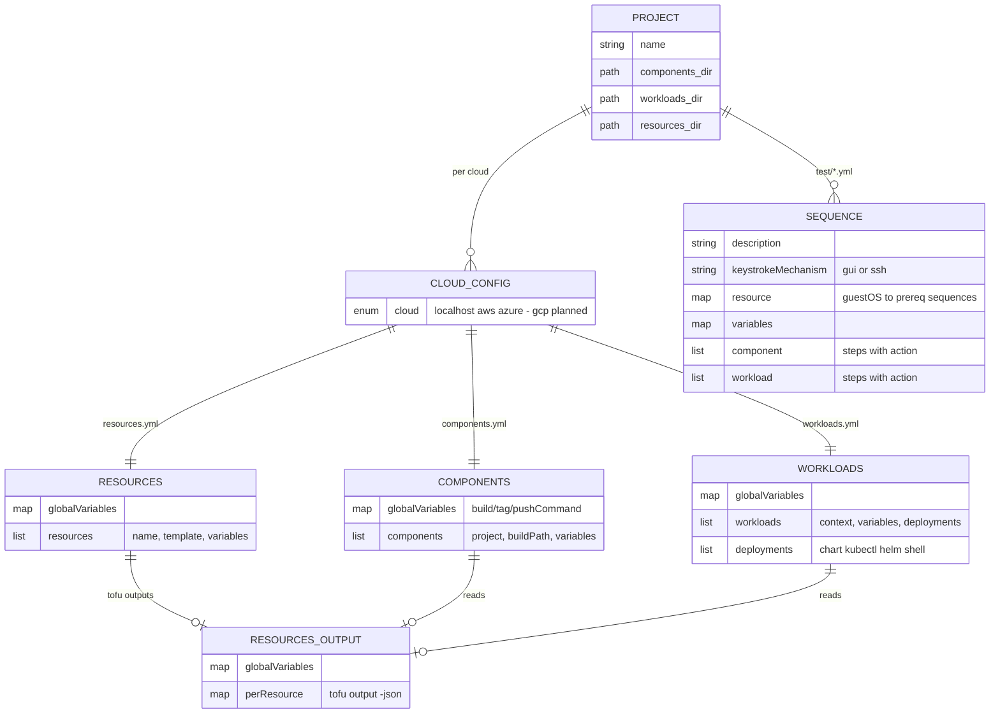
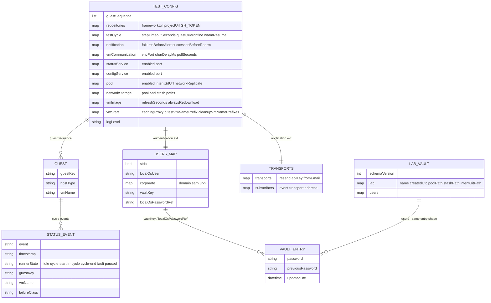

# Configuration data model

> One sentence: the YAML schema the engine and harness read — project deploy
> data and test-harness runtime data — as two entity-relationship views.

See [Design overview](00-index.md) · [Yuruna Architecture](../architecture.md).

Derived from `yuruna-project/example/<project>/` and `yuruna-project/template/`,
the parsing code in
`automation/Yuruna.{Resource,Component,Workload,Validation,DeploymentKind,VariableExpansion}.psm1`
and `automation/Import.Yaml.psm1`, `test/test.config.yml.template`, and the
schemas under `test/schemas/`. No secret values appear here — only field names.

## Project deploy data model

```mermaid
erDiagram
    PROJECT ||--o{ CLOUD_CONFIG : "per cloud"
    PROJECT ||--o{ SEQUENCE : "test/*.yml"
    CLOUD_CONFIG ||--|| RESOURCES : "resources.yml"
    CLOUD_CONFIG ||--|| COMPONENTS : "components.yml"
    CLOUD_CONFIG ||--|| WORKLOADS : "workloads.yml"
    RESOURCES ||--o| RESOURCES_OUTPUT : "tofu outputs"
    COMPONENTS ||--o| RESOURCES_OUTPUT : reads
    WORKLOADS ||--o| RESOURCES_OUTPUT : reads

    PROJECT {
        string name
        path components_dir
        path workloads_dir
        path resources_dir
    }
    CLOUD_CONFIG {
        enum cloud "localhost aws azure - gcp planned"
    }
    RESOURCES {
        map globalVariables
        list resources "name, template, variables"
    }
    COMPONENTS {
        map globalVariables "build/tag/pushCommand"
        list components "project, buildPath, variables"
    }
    WORKLOADS {
        map globalVariables
        list workloads "context, variables, deployments"
        list deployments "chart kubectl helm shell"
    }
    RESOURCES_OUTPUT {
        map globalVariables
        map perResource "tofu output -json"
    }
    SEQUENCE {
        string description
        string keystrokeMechanism "gui or ssh"
        map resource "guestOS to prereq sequences"
        map variables
        list component "steps with action"
        list workload "steps with action"
    }
```

`PROJECT ||--o{ CLOUD_CONFIG` is zero-or-more on purpose: `example/nested.host`
is a shipped, sequence-only project with no `config/` tree at all.
`yuruna-project/template` is itself the scaffold — there is no
`template/<project>` level.

The relationships the engine relies on: a resource's `template` resolves to
`resources/<template>` with fallback to `global/resources/<template>`; a
component's `buildPath` (default: its `project`) must hold a `Dockerfile`
under `components/<buildPath>`; a deployment's `chart` resolves under
`workloads/<chart>` and requires `variables.installName`. Deployment kind is
detected by which field is present — one of `chart | kubectl | helm | shell`.

`SEQUENCE` files require `description`, `keystrokeMechanism` and `resource`,
and are `additionalProperties: false`. There is no `gui/` or `ssh/`
directory anywhere: the `ssh` variant of a sequence is a distinct
`<name>.ssh.yml` file carrying `keystrokeMechanism: ssh`. `action` is a
**step-level** key inside the `component:`/`workload:` arrays (a 21-value
enum), not a top-level one.

`RESOURCES_OUTPUT` is the generated `config/<cloud>/resources.output.yml`.
`Yuruna.VariableExpansion.psm1` flattens it into the environment with two
rules: keys under `globalVariables` land under their bare key, while every
other top-level key `R` becomes `R.<outputName>` taking the leaf's `value`.
That flattened `<resource>.<output>` form is what the shipped configs depend
on — `example/website/config/localhost/components.yml` resolves its registry
via `"${env:registryName}.registryLocation"`.

Those top-level keys are also the **deployed-resource inventory**, and teardown
is the third consumer of the file: `Yuruna.Clear.psm1` walks every key except
`globalVariables` and runs `tofu destroy` in the matching
`.yuruna/<cloud>/resources/<resourceName>` work folder. A resource declared
with an empty `template` never appears here — it only names an already-existing
resource and owns no work folder — so the key set is exactly what can be torn
down. There is no `resources:` list in this file; that shape belongs to the
forward `resources.yml`.

**Variable precedence differs by phase**, and the two chains differ in their
final layer:

| Phase | Precedence (last wins) |
|---|---|
| Workloads | resources output → workloads `globalVariables` → workload `variables` → deployment `variables` |
| Components | resources output → components `globalVariables` → component `variables` → engine-forced `project` / `buildPath` / `dockerfile` |

The component phase has no deployment layer, and its final layer is
engine-forced: a component that sets `project` under its own `variables:` is
silently overridden.

`Import.Yaml.psm1` is the parse boundary for the resources/components/workloads
entities and their generated output — `ConvertFrom-YAML -Ordered`, throwing
when `powershell-yaml` is absent. Ordered parsing is load-bearing for the
precedence chains, which accumulate into `[ordered]` sinks. `SEQUENCE` files
do **not** go through it: `test/modules/Test.SequenceResolve.psm1` reads them
(and the snippet library) with a direct `ConvertFrom-Yaml -Ordered`, so they
never get that missing-module throw.

## Test-harness runtime data model

```mermaid
erDiagram
    TEST_CONFIG ||--o{ GUEST : guestSequence
    TEST_CONFIG ||--|| USERS_MAP : "authentication ext"
    TEST_CONFIG ||--|| TRANSPORTS : "notification ext"
    USERS_MAP ||--o{ VAULT_ENTRY : "vaultKey / localOsPasswordRef"
    LAB_VAULT ||--o{ VAULT_ENTRY : "users - same entry shape"
    GUEST ||--o{ STATUS_EVENT : "cycle events"

    TEST_CONFIG {
        list guestSequence
        map repositories "frameworkUrl projectUrl GH_TOKEN"
        map testCycle "stepTimeoutSeconds guestQuarantine warmResume"
        map notification "failuresBeforeAlert successesBeforeRearm"
        map vmCommunication "vncPort charDelayMs pollSeconds"
        map statusService "enabled port"
        map configService "enabled port"
        map pool "enabled intentGitUrl networkReplicate"
        map networkStorage "pool and stash paths"
        map vmImage "refreshSeconds alwaysRedownload"
        map vmStart "cachingProxyIp testVmNamePrefix cleanupVmNamePrefixes"
        string logLevel
    }
    GUEST {
        string guestKey
        string hostType
        string vmName
    }
    USERS_MAP {
        bool strict
        string localOsUser
        map corporate "domain sam upn"
        string vaultKey
        string localOsPasswordRef
    }
    VAULT_ENTRY {
        string password
        string previousPassword
        datetime updatedUtc
    }
    LAB_VAULT {
        int schemaVersion
        map lab "name createdUtc poolPath stashPath intentGitPath"
        map users
    }
    TRANSPORTS {
        map transports "resend apiKey fromEmail"
        map subscribers "event transport address"
    }
    STATUS_EVENT {
        string event
        string timestamp
        string runnerState "idle cycle-start in-cycle cycle-end fault paused"
        string guestKey
        string vmName
        string failureClass
    }
```

`USERS_MAP` (`users.yml`) maps each logical sequence username to a login
identity; its `vaultKey` / `localOsPasswordRef` resolve into `VAULT_ENTRY`
(`vault.yml`, runtime-generated). Both live under
`test/status/extension/authentication/`. `TRANSPORTS` (`transports.yml`) is
**not** their companion — it is the notification extension's own config
(provider credentials plus per-event-code `subscribers` such as
`cycle.failure`, `config.smoke`, `pool.alert`) and lives under
`test/status/extension/notification/`.

`LAB_VAULT` is a second, differently-shaped vault document written by
`test/New-Lab.ps1` as `lab.<Name>.vault.yml` into that same authentication
folder. It is **not** interchangeable with `vault.yml`:
`vault.schema.yml` is `additionalProperties: false` with `required: [users]`,
so a `lab:` node cannot be added to it; `lab.vault.schema.yml` requires
`[schemaVersion, lab, users]`. Its `users` entries carry the same
password/previousPassword/updatedUtc shape, which is why it is drawn against
`VAULT_ENTRY`.

The two are nonetheless expected to **agree on any credential they share**.
`vault.yml` is authoritative — it is what the harness reads — so when a
machine already holds a credential for one of the share accounts, `New-Lab`
copies that value into the new `LAB_VAULT` instead of generating one. The
accounts are machine-wide, so a second lab that minted its own password would
produce a lab vault disagreeing with the OS account, the SMB server, and every
machine the earlier vault was copied to.

`STATUS_EVENT` is the `cycle.events.ndjson` envelope — required fields
`timestamp` and `event` (`timestamp`, not `utc`), with the state fields
validated against the six-value runner enum. The authentication extension
writes a *different* shape to its own `events.log` (`ts`, `event`,
`outcome`).

`TEST_CONFIG` has no schema under `test/schemas/`; `test/Test-Config.ps1`
validates it directly, and applies `extension-config.schema.yml` to the
committed `test/extension/{authentication,notification}/*.config.yml` and
`{users,vault,notification.transports}.schema.yml` to the runtime state under
`test/status/extension/`. `lab.vault.schema.yml` documents the lab-vault
shape but is applied by no code path — `New-Lab.ps1` hand-writes that YAML
without validating it.

`pool.intentGitUrl` points at a separate git repo, the live pool intent
store. It carries `pools.yml` (schemaVersion 2: `poolId`, `poolGuid`,
`members[]`, `testSet`, `config.testCycle`, `gating`), `test-sets.yml`, and a
guest-compatibility map (`guestKey → hypervisors`) that decides which
`guestSequence` entries a host actually runs. Registration is **not** in that
repo: each host publishes its own record (`hostId`, `hostType`, `hypervisor`,
`poolId`, `capabilities`, `capacity`, `supportedGuests`) as
`runtime/host.registration.json` over its status service, which the aggregator
polls. The schemas for all of these are in `test/schemas/`; samples are in
`test/pool/examples/`. Both views stay within the
[≤7 rule](00-index.md#the-7-rule--grouping-decisions) — seven entities each.

---

LICENSEURI https://yuruna.link/license

Copyright (c) 2019-2026 by Alisson Sol et al.

Last review: 2026.07.29
