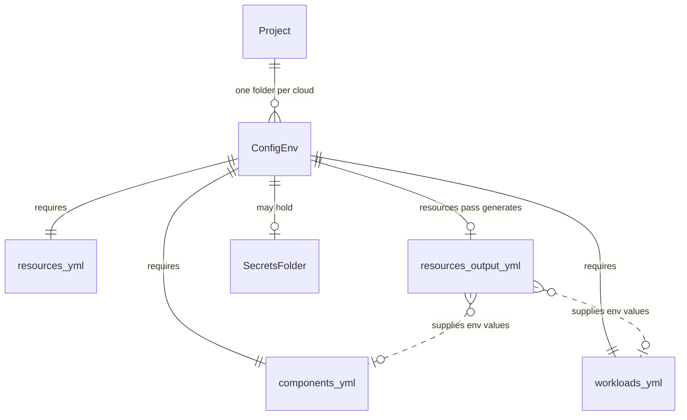
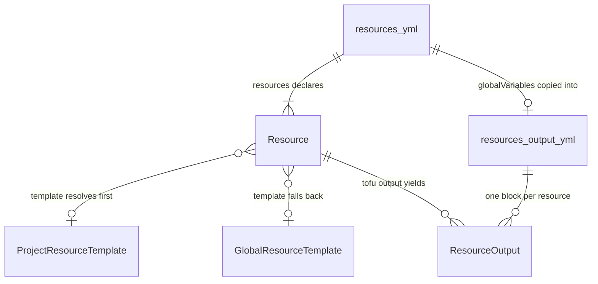
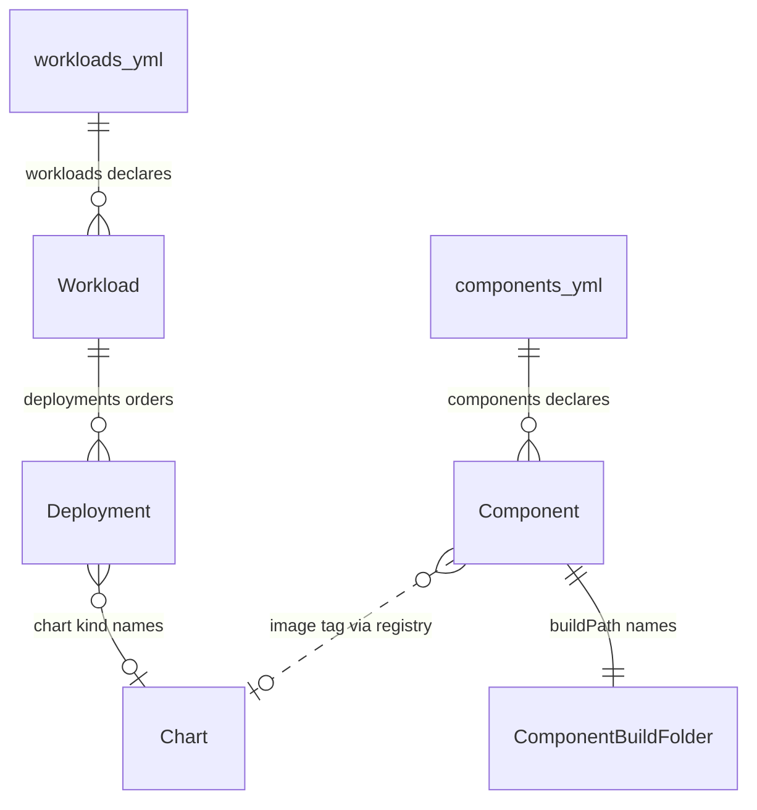
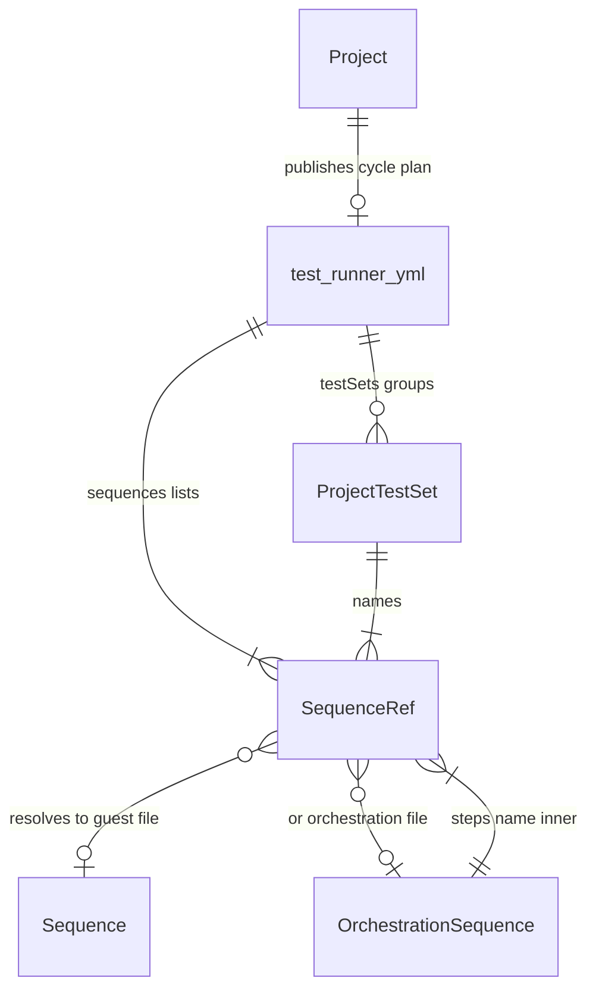
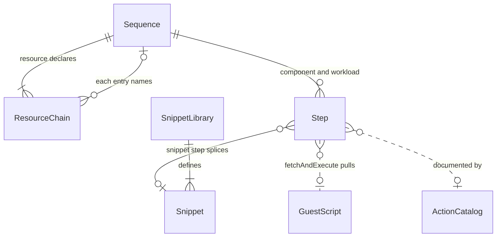
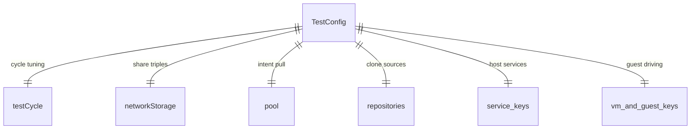
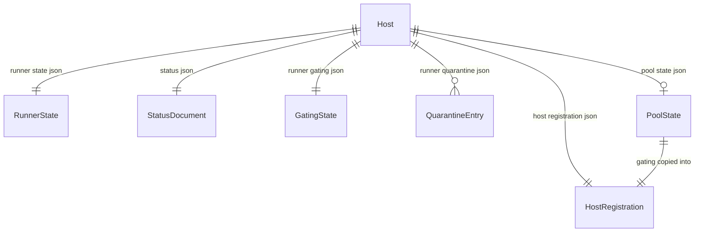
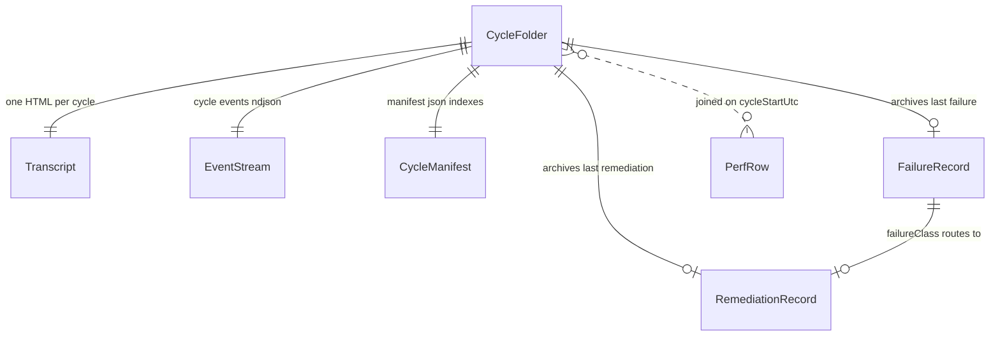
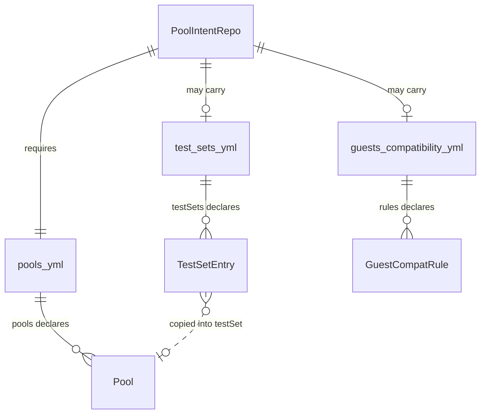
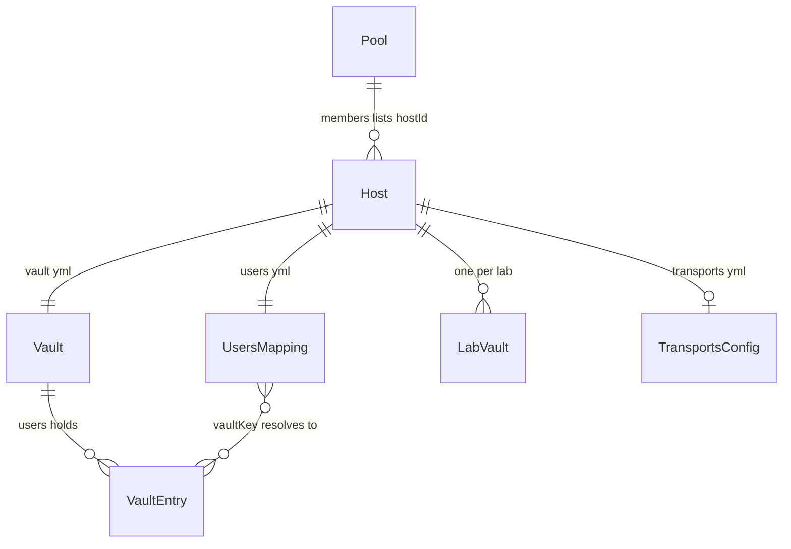

# Configuration data model

> One sentence: the YAML and JSON the deploy engine and the test harness read,
> as ten entity-relationship views across four areas.

See [Design overview](00-index.md) - [Deployment topology](06-deployment.md) -
[Yuruna Architecture](../architecture.md).

Derived from the parsers in `automation/Yuruna.Resource.psm1`,
`automation/Yuruna.Component.psm1`, `automation/Yuruna.Workload.psm1`,
`automation/Yuruna.Validation.psm1`, `automation/Yuruna.DeploymentKind.psm1` and
`automation/Yuruna.VariableExpansion.psm1` and `automation/Yuruna.Requirement.psm1`;
the project trees under
`yuruna-project/`; `test/test.config.yml.template` with its reader
`test/modules/Test.Config.psm1`; the plan and sequence readers
`test/modules/Test.SequencePlanner.psm1` and
`test/modules/Test.SequenceResolve.psm1`; the runtime writers
`test/modules/Test.RunnerState.psm1`,
`test/modules/Test.SequenceFailureState.psm1`, `test/modules/Test.Perf.psm1`,
`test/modules/Test.Log.psm1` and `test/modules/Test.Capability.psm1`; and the
JSON Schemas under `test/schemas/`. Only field names appear here, never a value
from a live vault.

**How to read the diagrams.** A solid edge is containment or generation that one
parser enforces on its own. A dashed edge is a cross-store join -- two files that
agree by name or through an environment variable, with no single parser checking
both ends. Cardinality is crow's foot: `||` exactly one, `|{` one or more, `o{`
zero or more, `o|` zero or one. Boxes carry artifact names; paths are cited in
the prose below each diagram.

## Project deploy data

A project is one directory in the `yuruna-project` data repo.
`yuruna-project/template/` is the scaffold an operator copies;
`yuruna-project/example/website/`, `yuruna-project/example/text-to-sql/` and
`yuruna-project/example/nested.host/` are the shipped examples, and
`yuruna-project/book/` carries chapter sequences. Only the first three of those
five hold a deploy tree: `example/nested.host/` and `book/` have a `test/`
folder and no `config/`, so the three deploy phases never run for them.

**The config folder.** Everything the three phase scripts read is addressed as
`<project_root>/config/<config_subfolder>/<file>`, with both halves supplied on
the command line.

```mermaid
erDiagram
    Project ||--o{ ConfigEnv : "one folder per cloud"
    ConfigEnv ||--|| resources_yml : "requires"
    ConfigEnv ||--|| components_yml : "requires"
    ConfigEnv ||--|| workloads_yml : "requires"
    ConfigEnv ||--o| resources_output_yml : "resources pass generates"
    ConfigEnv ||--o| SecretsFolder : "may hold"
    resources_output_yml }o..o| components_yml : "supplies env values"
    resources_output_yml }o..o| workloads_yml : "supplies env values"
```

### Relationships

| Edge | Cardinality | Why the code says so |
|---|---|---|
| Project - ConfigEnv | 1 to 0..N | `Confirm-FolderList` in `automation/Yuruna.Validation.psm1` requires `<project_root>/config/<subfolder>` to exist, and each phase script takes `-config_subfolder`. One folder per target cloud: `yuruna-project/example/website/config/` holds `aws/`, `azure/` and `localhost/`; `yuruna-project/template/config/` holds only `localhost/`; `yuruna-project/example/nested.host/` holds none. |
| ConfigEnv - resources_yml | 1 to 1 | The path is fixed, not configurable: `Confirm-ResourceList` and `Publish-ResourceList` both join `config/$config_subfolder/resources.yml`, and an absent file fails validation. |
| ConfigEnv - components_yml | 1 to 1 | Same fixed join in `Confirm-ComponentList` and `Publish-ComponentList`; absent is a validation failure. |
| ConfigEnv - workloads_yml | 1 to 1 | Same in `Confirm-WorkloadList` and `Publish-WorkloadList`. |
| ConfigEnv - resources_output_yml | 1 to 0..1 | Created by the resources apply pass (`New-Item -Force` before the per-resource loop). `Confirm-ResourceOutputList` treats an absent file as valid, so a components-only or workloads-only project never has one. |
| ConfigEnv - SecretsFolder | 1 to 0..1 | `Invoke-SecretFolderValidation` returns success when the folder does not exist. Workload validation additionally checks the peer folder `config/secrets` (written as `config/<env>/../secrets`), shared across sibling config folders. |
| resources_output_yml - components_yml / workloads_yml | cross-store | `Set-ExpandedResourcesOutput` pushes every leaf into `Env:` before the component and workload variable layers are applied. No parser checks that a `${env:...}` reference inside a command string names a leaf that exists; a missing one expands to the empty string. |

### Fields

| Entity | Path | Notes |
|---|---|---|
| Project | `yuruna-project/<name>/`, passed as `-project_root` | Defaults to `Get-Location`. `Resolve-YurunaRootSet` in `automation/Yuruna.LogLevel.psm1` exports `Env:yuruna_root`, `Env:project_root` and `Env:config_root` for the tofu and helm subprocesses. |
| ConfigEnv | `<project>/config/<cloud>/`, passed as `-config_subfolder` | Shipped values are `localhost`, `azure`, `aws`. The name is free-form; it is only a path segment. |
| resources_yml | `<project>/config/<cloud>/resources.yml` | Parsed by `automation/Yuruna.Resource.psm1`. |
| components_yml | `<project>/config/<cloud>/components.yml` | Parsed by `automation/Yuruna.Component.psm1`. |
| workloads_yml | `<project>/config/<cloud>/workloads.yml` | Parsed by `automation/Yuruna.Workload.psm1`. |
| resources_output_yml | `<project>/config/<cloud>/resources.output.yml` | Generated. The workload publisher also falls back to `config/<cloud>/../resources.output.yml` so a phased deployment can share one output file. |
| SecretsFolder | `<project>/config/<cloud>/secrets/*.txt` and `<project>/config/secrets/*.txt` | The file name is the secret name. |

There is no JSON Schema for the three deploy files -- the PowerShell parser is
the whole contract, which is why `Yuruna.Validation.psm1` restates every rule the
publishers rely on.

**Resources.** The first phase turns declarations into OpenTofu runs and writes
their outputs back as the only channel into the other two phases.

```mermaid
erDiagram
    resources_yml ||--|{ Resource : "resources declares"
    Resource }o--o| ProjectResourceTemplate : "template resolves first"
    Resource }o--o| GlobalResourceTemplate : "template falls back"
    Resource ||--o{ ResourceOutput : "tofu output yields"
    resources_output_yml ||--o{ ResourceOutput : "one block per resource"
    resources_yml ||--o| resources_output_yml : "globalVariables copied into"
```

### Relationships

| Edge | Cardinality | Why the code says so |
|---|---|---|
| resources_yml - Resource | 1 to 1..N | `Confirm-ResourceList` fails with "Resources cannot be null or empty" when `resources` is null, so a file that validates has at least one entry. The publisher is laxer and returns a skipped manifest, but the validator gate runs first. |
| Resource - ProjectResourceTemplate | N to 0..1 | `<project_root>/resources/<template>` is probed first. Zero when `template` is absent -- that entry only names an already-existing resource, and no folder is copied and no tofu runs. One template folder can serve many resources. |
| Resource - GlobalResourceTemplate | N to 0..1 | `<yuruna_root>/global/resources/<template>` is probed only when the project copy is missing; neither found is `config_error`. Project wins. The shipped set is `global/resources/aws/{eks-cluster,registry}`, `global/resources/azure/{aks-cluster,postgresql,registry,resource-group,storage-share,vm-linux}` and `global/resources/localhost/{context-copy,registry}`. |
| Resource - ResourceOutput | 1 to 0..N | The apply pass runs `tofu output -json` per templated resource. Zero only for a template-less entry: for a templated one an empty result throws, so at least one `output` block is mandatory, and a `{}` result throws separately as a silent-provisioner signal. |
| resources_output_yml - ResourceOutput | 1 to 0..N | The generated file is a `globalVariables` block followed by one block per resource name, appended as the apply loop progresses. |
| resources_yml - resources_output_yml | 1 to 0..1 | The init pass expands `globalVariables` once and the apply pass seeds the output file with the expanded map, so downstream phases re-use the expansion instead of re-running it. |

### Fields

`resources.yml`:

| Key | Required | Rule | Source |
|---|---|---|---|
| `globalVariables` | optional | Map of string to string. Every value must be non-empty (`Confirm-GlobalVariableList`). Each is expanded once, on the init pass, then written to `Env:<key>` and back into the YAML node. | `automation/Yuruna.Resource.psm1` |
| `resources` | **required** | Null is `config_error` at validation. | `automation/Yuruna.Validation.psm1` |
| `resources[].name` | **required** | Expanded, then used verbatim as `Env:resourceName` and as the `.yuruna/<cloud>/resources/<name>` work-folder segment. Duplicates are rejected both raw and post-expansion with an Ordinal comparer, because a collision would stage two resources into one folder and the second apply would overwrite the first's carried-over state. | `automation/Yuruna.Validation.psm1` |
| `resources[].template` | optional | `<cloud>/<dir>` relative to `resources/`. Empty means "just naming an existing resource". | `automation/Yuruna.Resource.psm1` |
| `resources[].variables` | optional | Each value must be non-empty. Merged after `globalVariables` into `terraform.tfvars` as `key = "value"` and into `Env:`. | `automation/Yuruna.Validation.psm1` |

`resources.output.yml` (generated, never hand-edited):

| Key | Shape | Lands in the environment as |
|---|---|---|
| `globalVariables` | the fully expanded globals | flat, `Env:<key>` |
| `<resourceName>` | one block per resource; each leaf is `{ value: ..., sensitive: <bool> }` | dotted, `Env:<resourceName>.<outputName>` |

`Set-ExpandedResourcesOutput` in `automation/Yuruna.VariableExpansion.psm1` walks
that two-layer shape. A leaf that is not a `{ value: ... }` dictionary falls back
to the raw scalar and emits a warning rather than silently writing an empty
variable. The file is always pushed with `-NoExpand` by the component, workload
and validation paths, because a tofu output can echo back a `$(...)`
subexpression that would otherwise execute at config-load time.

**Components and workloads.** The build phase and the deploy phase share no
file; they meet only through the registry coordinates that both read out of the
environment.

```mermaid
erDiagram
    components_yml ||--o{ Component : "components declares"
    Component ||--|| ComponentBuildFolder : "buildPath names"
    workloads_yml ||--o{ Workload : "workloads declares"
    Workload ||--o{ Deployment : "deployments orders"
    Deployment }o--o| Chart : "chart kind names"
    Component }o..o| Chart : "image tag via registry"
```

Three entities are folded into the Fields tables rather than drawn: the
Dockerfile probed inside `ComponentBuildFolder`, the deployment-kind catalog that
classifies each `Deployment`, and the `values.yaml` regenerated for every chart
install.

### Relationships

| Edge | Cardinality | Why the code says so |
|---|---|---|
| components_yml - Component | 1 to 0..N | A null `components` list is informational in the validator and returns a skipped manifest from `Publish-ComponentList`. Duplicate `project`, raw or expanded, is rejected: two components sharing that key build, tag and push to the same image identity, so the second silently overwrites the first. |
| Component - ComponentBuildFolder | 1 to exactly 1 | `buildPath` defaults to `project` and resolves to `<project_root>/components/<buildPath>`; a missing folder is `config_error`. There is no global fallback here -- `global/components/` holds only a `placeholder` file and no code path reads it. |
| workloads_yml - Workload | 1 to 0..N | A null `workloads` list is informational and returns skipped. Duplicate `context`, raw or expanded, is rejected: the publisher deletes and recreates `.yuruna/<cloud>/workloads/<context>` at the start of each workload, so the second would clobber the first's staged charts. |
| Workload - Deployment | 1 to 0..N | An ordered list that runs in file order. Each item names one kind by convention; nothing rejects a second, which is why the catalog defines a precedence (below). |
| Deployment - Chart | N to 0..1 | Only the `chart` kind names a folder, `<project_root>/workloads/<chart>`; a missing folder is `config_error`. The pair `(context, expanded installName)` must be unique, since two chart deployments sharing both would upgrade one helm release instead of installing two workloads. As with components there is no global fallback: `global/workloads/` is a placeholder. |
| Component - Chart | cross-store | The component's `tagCommand` and `pushCommand` and the chart's `image:` line build the same string from `Env:containerPrefix` and `Env:<registryName>.registryLocation`. Nothing validates the agreement ahead of time; `yuruna-project/example/website/workloads/frontend/website/templates/01-website.yml` uses helm's `required` so a value that never arrived fails at lint with a message naming the missing `resources.output.yml` block. |

### Fields

`components.yml`:

| Key | Required | Rule |
|---|---|---|
| `globalVariables` | optional | Holds the shared `buildCommand`, `tagCommand`, `pushCommand` and optionally `preProcessor` / `postProcessor`. |
| `components[].project` | **required** | Expanded, then set as `Env:projectName` and as the `project` variable. |
| `components[].buildPath` | optional | Defaults to `project`. |
| `buildCommand`, `tagCommand`, `pushCommand` | **required** at the component level or in `globalVariables` | Missing at both levels is `config_error`. Resolution is component first, then global. |
| `components[].variables.preProcessor` / `.postProcessor` | optional | Component level first, then `globalVariables`. Both run with the working directory pushed to `<project_root>/components/`; a non-zero exit is `tool_failed`. |
| *(derived)* `dockerfile` | derived | Probed in the build folder as `Dockerfile`, then `dockerfile`, then `<project>-dockerfile`; none found is `config_error`. Injected as the `dockerfile` variable and `Env:dockerfile`. |

Registry login is not a YAML key. After the tag phase,
`Resolve-ComponentRegistryLogin` in `automation/Yuruna.Component.Registry.psm1`
reads `Env:<registryName>.registryLocation` and dispatches through the
hostname-pattern registry in `automation/Yuruna.CredentialProvider.psm1`; no
match means the phase is skipped. Variable layering for a component, each layer
also pushed to `Env:` and all applied with `-NoExpand` because the layering is
done at the YAML level: `resources.output.yml`, then `components.globalVariables`,
then `component.variables`, then the injected `project`, `buildPath` and
`dockerfile`.

`workloads.yml`:

| Key | Required | Rule |
|---|---|---|
| `workloads[].context` | **required** | Expanded into `Env:contextName`. Existence is probed non-mutatingly with `kubectl config get-contexts <name>` before `use-context`; failure at publish time is `cluster_unreachable`, and the original context is restored in a `finally`. |
| `workloads[].variables` | optional | Expanded, pushed to `Env:`, merged into the deployment variable bag. |
| `deployments[]` | optional | Each item names one of `chart`, `kubectl`, `helm` or `shell`. `Confirm-WorkloadList` rejects an item with *no* kind; it does not reject one with two, so the precedence rule below is reachable. |
| `deployments[].variables.installName` | **required for `chart`** | Expanded; becomes the helm release name and the `.yuruna/<cloud>/workloads/<context>/<installName>` folder. Every chart variable value must be non-empty. |

The deployment kinds are a code catalog, not YAML:
`automation/Yuruna.DeploymentKind.psm1` registers four plain-data descriptors
carrying `Name`, `Field`, `IsChart`, `ToolName`, `CommandPrefix` and `Retryable`
-- `chart` (helm, is-chart, not retryable), `kubectl` (prefix `kubectl `,
retryable), `helm` (prefix `helm `, retryable) and `shell` (no prefix, not
retryable). Registration order is the precedence: `chart` wins if present,
otherwise the last present non-chart kind. No kind present is `config_error`, and
the expected-kinds phrase in both the validator and the publisher message is
generated from the same catalog.

A chart's `values.yaml` inside the work folder is generated, not read: every
merged deployment variable is written as `key: "value"` plus a synthesized
`contextName`, so the stub `values.yaml` committed under
`<project>/workloads/<chart>/` never reaches helm. Layering for a deployment,
deepest wins: `resources.output.yml` with `-NoExpand`, then
`workloads.globalVariables` (expanded and cached back into the YAML so the
per-deployment pass does not re-expand), then `workload.variables`, then
`deployment.variables`.

Secrets validation (`Invoke-SecretFolderValidation`) reads each `*.txt` with
`Get-Content -Raw`, marks it `git update-index --assume-unchanged`, and treats
blank content as informational for resources but blocking for workloads.

### Host tool floors -- `automation/Yuruna.Requirement.yml`

One more configuration YAML belongs to the deploy engine rather than to a project:
`automation/Yuruna.Requirement.yml`, the single source of host-tool version
floors. A root `requirements[]` of 20 entries, each `{tool, command, version,
releases}`, where `command` is a PowerShell expression that prints the installed
version and `version` is the floor. `Confirm-RequirementList`
(`automation/Yuruna.Requirement.psm1`) compares the first dotted-number token of
each side and reports `MISSING` or `BELOW`, narrowable to a subset with `-Tool`,
then appends a `Runtime capabilities` section that holds one row today: AES-GCM,
because a runtime that meets the PowerShell floor can still lack the algorithm
every Lab-token enrollment needs. It is not folded into any diagram above: it is
read by `Confirm-RequirementList`, reached from `yuruna requirements`
(`automation/yuruna.ps1:99`), from `Test-Requirement.ps1` -- which the three
bootstrap installers shell out to rather than parsing the YAML themselves -- and
from `Check-DependencyVersion.ps1`. None of those are project data.

## Project cycle plan and sequences

**The cycle plan.** A cloned project publishes what the runner should execute,
one cycle after another.

```mermaid
erDiagram
    Project ||--o| test_runner_yml : "publishes cycle plan"
    test_runner_yml ||--|{ SequenceRef : "sequences lists"
    test_runner_yml ||--o{ ProjectTestSet : "testSets groups"
    ProjectTestSet ||--|{ SequenceRef : "names"
    SequenceRef }o--o| Sequence : "resolves to guest file"
    SequenceRef }o--o| OrchestrationSequence : "or orchestration file"
    OrchestrationSequence ||--|{ SequenceRef : "steps name inner"
```

### Relationships

| Edge | Cardinality | Why the code says so |
|---|---|---|
| Project - test_runner_yml | 1 to 0..1 | The path is fixed: `Get-CycleConfigPath` in `test/modules/Test.SequencePlanner.psm1` returns `<RepoRoot>/project/test/test.runner.yml`, and the clone is the project, so at most one plan is live. When the planner cannot read it the runner falls back to the legacy `guestSequence` list in `test.config.yml`. |
| test_runner_yml - SequenceRef | 1 to 1..N | `sequences:` is required and non-empty; `Get-CycleConfig` throws otherwise. A `.yml`, `.yaml` or `.json` suffix on an entry is stripped. |
| test_runner_yml - ProjectTestSet | 1 to 0..N | `testSets:` is optional. `Get-ProjectTestSet` always emits the implicit set `all` first and skips a declared set named `all` with a warning -- the name is reserved. |
| ProjectTestSet - SequenceRef | 1 to 1..N | A set with zero sequences is skipped with a warning, never thrown, because this read happens inside a live cycle. The same holds for a non-mapping entry, a nameless one, a name failing the case-sensitive `^[a-z0-9][a-z0-9._-]*$`, or a duplicate name. |
| SequenceRef - Sequence | N to 0..1 | Names are not resolved when the plan is read; a set naming a missing sequence surfaces later at plan time as `PlannerFatal`, classified `plan_invalid`. |
| SequenceRef - OrchestrationSequence | N to 0..1 | An entry may instead resolve to an orchestration file, detected by shape rather than by a key: no `baseline:`, a non-empty `steps:`, and a first step with `action: InvokeTestSequence`. Mixing orchestration and guest sequences in one plan, or listing more than one orchestration, is rejected in `test/modules/Test.RunnerInnerLoop.psm1`. |
| OrchestrationSequence - SequenceRef | 1 to 1..N | `test/schemas/orchestration-sequence.schema.yml` requires `[name, steps]` at the root and `[action, sequence]` on every step. |

### Fields

`test.runner.yml` -- the shipped example is
`yuruna-project/test/test.runner.yml`:

| Key | Required | Rule |
|---|---|---|
| `sequences[]` | **required** | Non-empty list of bare sequence names. |
| `testSets[].name` | required per entry | `^[a-z0-9][a-z0-9._-]*$`, case-sensitive, unique, and not `all`. |
| `testSets[].displayName` | optional | The label a non-technical operator sees on the pool-control board. |
| `testSets[].description` | optional | One line under `displayName`. |
| `testSets[].sequences[]` | required per entry | Must be non-empty or the set is skipped. |

Orchestration files (`test/schemas/orchestration-sequence.schema.yml`,
`additionalProperties: false`): `name` matching `^[a-z0-9][a-z0-9._-]*$`,
optional `description`, `continueOnError` defaulting to false, and `steps[]`
where each step is `action: InvokeTestSequence` plus a `sequence` name matching
`^[A-Za-z0-9._-]+$` with any `.yml` or `.yaml` suffix stripped.

**The sequence file.** One file drives one guest through one scenario, and names
its own prerequisites.

```mermaid
erDiagram
    Sequence ||--|{ ResourceChain : "resource declares"
    ResourceChain }o--o| Sequence : "each entry names"
    Sequence ||--o{ Step : "component and workload"
    Step }o--o| Snippet : "snippet step splices"
    SnippetLibrary ||--|{ Snippet : "defines"
    Step }o..o| GuestScript : "fetchAndExecute pulls"
    Step }o..o| ActionCatalog : "documented by"
```

### Relationships

| Edge | Cardinality | Why the code says so |
|---|---|---|
| Sequence - ResourceChain | 1 to 1..N | `test/schemas/sequence.schema.yml` lists `resource` in the root `required` set with `minProperties: 1`: a mapping of guest OS key to an ordered list of prerequisite sequence names. |
| ResourceChain - Sequence | N to 0..1 | Each entry is a bare file name, resolved the same way a plan entry is. The file name is the lookup key, not a label, so renaming a file breaks every chain that names it; `sequenceGuid` is the identifier that survives a rename for perf analytics. Zero when the chain names a sequence that does not resolve, which the planner reports as fatal. |
| Sequence - Step | 1 to 0..N | The executed list is `component` concatenated with `workload`. Both keys are optional; `additionalProperties: false` at the root, and a legacy `baseline:` key or a flat top-level `steps:` is rejected at load with a migration error. |
| Step - Snippet | N to 0..1 | A snippet step carries `snippet` plus an optional `description`, and no other key (`additionalProperties: false`). Splicing happens inside `Read-SequenceFile`, including inside `retry.steps`, so every consumer sees already-spliced steps. |
| SnippetLibrary - Snippet | 1 to 1..N | `test/schemas/snippets.schema.yml` requires `minProperties: 1`, keys matching `^[A-Za-z][A-Za-z0-9_-]*$`, each mapping to a non-empty step array. Snippets may reference snippets. |
| Step - GuestScript | N to 0..1 | Cross-store: a `fetchAndExecute` step names a path the guest pulls over HTTP and runs. The payloads live beside the sequences, for example `yuruna-project/example/website/test/ubuntu.server.24/ubuntu.server.24.workload.k8s.website.sh`, which in turn invokes `automation/Set-Resource.ps1` and its two siblings inside the guest. |
| Step - ActionCatalog | N to 0..1 | Cross-store and documentation-only: `test/sequences/actions.yml`, shaped by `test/schemas/actions.schema.yml`, maps 20 action names to prose. Three sets are close but not equal: the `action` enum in `sequence.schema.yml` holds 21 (those 20 plus the deprecated alias `typeAndEnter`), the catalog documents 20, and the 21 `Register-SequenceAction` calls in `test/modules/Test.SequenceHandler.psm1` drop `typeAndEnter` and add `recoverFromSnapshot`, which no schema names. The runner never reads the catalog -- the live action set is whatever `Register-SequenceAction` registers. |

### Fields

`sequence.schema.yml` root, `additionalProperties: false`, required
`[description, keystrokeMechanism, resource]`:

| Key | Required | Rule |
|---|---|---|
| `sequenceGuid` | optional | 42-prefixed GUID; survives a file rename and is the perf join key. |
| `sequenceRevision` | optional | Integer, bumped when steps are added, removed or reordered. |
| `description` | **required** | One line. |
| `keystrokeMechanism` | **required** | `gui` or `ssh`. |
| `resource` | **required** | `minProperties: 1`; guest OS key to ordered prerequisite chain. |
| `variables` | optional | Scalars only (string, number, boolean). |
| `requiresSnapshot.id` | optional | Two runtime effects: the VM name becomes `id` instead of `test-<guestKey>`, and a snapshot hit skips the whole resource chain. |
| `component[]`, `workload[]` | optional | The VM setup phase and the verification phase. |

A step is one of two shapes. A snippet step carries `snippet` and an optional
`description`. An action step carries `action` from the enum plus per-action
required fields expressed as `if`/`then` branches -- seventeen of them. For
example `callExtension` needs `method`, `fetchAndExecute` needs `text` and
`waitPattern`, `pressKey` needs `name`, `retry` needs `steps`, `passwdPrompt`
needs `pattern` and `text`, `sshExec` needs `command`, `waitForText` needs
`pattern`, `waitForSeconds` needs `seconds`, `tapOn` needs `label`, the three
`inputText` spellings need `text`, and the snapshot and diagnostic verbs need
`id`.
`additionalProperties` stays open on an action step so optional parameters pass.

Resolution order is project-first, in `Resolve-SequencePath`
(`test/modules/Test.SequenceResolve.psm1`): every `test/` directory found by a
recursive scan under `<repo>/project/`, then the framework `test/sequences/`.
Within each, a host-suffixed candidate is tried before the plain name. Two
project files with the same name under different `test/` folders is
`PlannerFatal`, and every probe uses `-LiteralPath` so a name containing wildcard
metacharacters is not glob-expanded. That is why
`yuruna-project/example/website/test/`,
`yuruna-project/example/text-to-sql/test/`,
`yuruna-project/example/nested.host/test/` and `yuruna-project/book/test/` are
all reachable by bare name. Snippet libraries follow the same layering:
`test/sequences/_snippets.yml` is the framework library, a project library sits at
`project/<...>/test/_snippets.yml`, project entries override framework entries of
the same name, and two project libraries defining one name is a fatal ambiguity.

## Test-harness runtime data

**Host configuration.** One file per machine, normally read through
`test/modules/Test.Config.psm1`, which caches by path plus mtime plus a
64 KB SHA-256 and publishes a cross-process JSON snapshot. A few call sites parse
the YAML directly and bypass that cache -- `automation/Yuruna.GitHubSource.psm1`,
`test/Remove-TestVMFiles.ps1` and `Test.Perf.psm1`'s fallback.

It is not only read, either. The inner loop rewrites the operator's file at the
start of every cycle, before the first read: `Update-TestConfigFromTemplate`
(`test/modules/Test.ConfigSync.psm1:249`, called at
`test/modules/Invoke-TestRunnerInnerLoop.ps1:352-356`) overlays the live file on
`test/test.config.yml.template`, comments out every key the template no longer
defines, canonicalises ordering, and rewrites the file atomically. The template is
the schema source of truth, so a host that skipped releases picks up new keys
without hand-editing; a nested-shape departure copies the file to
`test.config.yml.backup` first and can stop the run. That is also why the retired
keys below matter: the reconcile does not translate them, it drops them.

```mermaid
erDiagram
    TestConfig ||--|| testCycle : "cycle tuning"
    TestConfig ||--|| networkStorage : "share triples"
    TestConfig ||--|| pool : "intent pull"
    TestConfig ||--|| repositories : "clone sources"
    TestConfig ||--|| service_keys : "host services"
    TestConfig ||--|| vm_and_guest_keys : "guest driving"
```

Two boxes are aggregates. `service_keys` folds the four service blocks
`configService`, `statusService`, `downloadAgentService` and `notification`;
`vm_and_guest_keys` folds `vmCommunication`, `vmImage`, `vmStart`, the legacy
`guestSequence` list and the scalar `logLevel`. Those are the thirteen top-level
keys of `test/test.config.yml.template`.

### Relationships

| Edge | Cardinality | Why the code says so |
|---|---|---|
| TestConfig - every group | 1 to exactly 1 | The template is a single YAML document with thirteen top-level keys and no repetition. Every group is optional on disk: `Test.Config.psm1` supplies no defaults of its own, and each consuming call site carries its own fallback, so an absent block reads as "all defaults". That rule has a sharp edge: sixteen keys were renamed and `Read-TestConfig` does not migrate them, so a value under a retired spelling reads as absent and silently takes the default. `Get-RetiredConfigKeyMap` (`test/modules/Test.ConfigNaming.psm1`) is the old-to-new table, each entry carrying a `Factor` for the unit changes (`testCycle.stepTimeoutMinutes` x60 to `stepTimeoutSeconds`, `vmImage.refreshHours` x3600 to `refreshSeconds`), and `tools/Update-TestConfigNaming.ps1` is what rewrites a config with it. |

Two resolvers in the reader do carry defaults -- `Resolve-CleanupVmNamePrefix`
(`test-`, and the configured list extends rather than replaces it) and
`Get-YurunaStatusServiceSeed` (port `8080`). Precedence when a pool is in play is
pool intent over host config over code default: `pools.schema.yml` allows a
`config.testCycle` block whose keys are merged over the host file for the cycle,
and the pool's `testSet` also overrides `repositories.frameworkUrl` and
`repositories.projectUrl`. `repositories.ghToken` never travels through pool
intent.

### Fields

| Group | Keys |
|---|---|
| `testCycle` | `cycleDelaySeconds`, `stopOnFailure`, `stepTimeoutSeconds`, `preambleTimeoutSeconds` (0 is the meaningful opt-out), `recentDisplayCount`, `autoRemediation.{enabled,maxAttemptsPerCycle}`, `guestQuarantine.{enabled,failuresToQuarantine,skipCycles}`, `warmResume.{enabled,maxAttempts}`, `perfLog.enabled`, `labHealth.{enabled,minIntervalSeconds,discoveryIntervalSeconds,armWindowHours,maxHoldAttempts,require[]}` |
| `networkStorage` | `poolStorage{LocalPath,NetworkPath,NetworkUser}`, `stashStorage{LocalPath,NetworkPath,NetworkUser}`, `moveLogsToPoolStorage`. Each tier needs all three of its triple populated or it is a complete no-op. |
| `pool` | `enabled`, `intentGitUrl`, `localClonePath`, `pullTimeoutSeconds` |
| `repositories` | `frameworkUrl`, `projectUrl`, `ghToken` (host-local) |
| `service_keys` | `configService.{enabled,port}`, `statusService.{enabled,port}`, `downloadAgentService.{enabled,autoSeed,freshnessSeconds,prefetchLeadSeconds,scanIntervalSeconds}`, `notification.{failuresBeforeAlert,successesBeforeRearm}` |
| `vm_and_guest_keys` | `vmCommunication.{charDelayMs,pollSeconds,timeoutSeconds,vncPort}`, `vmImage.{alwaysRedownload,refreshSeconds}`, `vmStart.{bootDelaySeconds,startTimeoutSeconds,testVmNamePrefix,cleanupVmNamePrefixes,cachingProxyIp}`, `guestSequence[]`, `logLevel` |

`test/test.config.yml.template` is the committed default; the live
`test/test.config.yml` is gitignored host state.
`downloadAgentService.enabled` is deliberately left unstated in the template so
it resolves by mode rather than by a value someone copied.

**Runtime state.** Everything the runner keeps between processes lives as small
files under `$env:YURUNA_RUNTIME_DIR`, all written atomically as temp plus
rename.

```mermaid
erDiagram
    Host ||--|| RunnerState : "runner state json"
    Host ||--|| StatusDocument : "status json"
    Host ||--|| GatingState : "runner gating json"
    Host ||--o{ QuarantineEntry : "runner quarantine json"
    Host ||--|| HostRegistration : "host registration json"
    Host ||--o| PoolState : "pool state json"
    PoolState ||--|| HostRegistration : "gating copied into"
```

The pool-storage drain ledger `poolstorage.state.json` and the pid, heartbeat and
lock files are folded out of the diagram and listed in Fields; they carry process
liveness rather than configuration.

### Relationships

| Edge | Cardinality | Why the code says so |
|---|---|---|
| Host - RunnerState | 1 to 1 | `Get-RunnerStatePath` resolves one `runner.state.json` per runtime dir. Both the resident outer process and the per-cycle child write it, which is why it carries `writerPid` and `runId` alongside `current`. |
| Host - StatusDocument | 1 to 1 | One `status.json` per host, seeded from `test/status/status.json.template` and served by the status service. |
| Host - GatingState | 1 to 1 | `runner.gating.json` persists the notification latch across the single-cycle respawn. |
| Host - QuarantineEntry | 1 to 0..N | `runner.quarantine.json` is a `guests` map keyed by guest key; a clean pass drops the entry entirely, so a recovered guest starts every streak from zero. |
| Host - HostRegistration | 1 to 1 | `Write-HostRegistrationRecord` in `test/modules/Test.Capability.psm1` writes one `host.registration.json` per cycle at runner startup, atomically, best-effort. `test/schemas/host.registration.schema.yml` is its contract for the aggregator. |
| Host - PoolState | 1 to 0..1 | `pool.state.json` exists only when the pool-intent pull ran; it is how a freshly spawned inner runner learns the derived `poolId`, `desiredState` and `gating`. |
| PoolState - HostRegistration | 1 to 1 | The registration record reads its `poolId`, `poolGuid` and `gating` out of `pool.state.json` rather than re-deriving them, so the aggregator and the runner cannot disagree within a cycle. |

### Fields

| Entity | Path | Key fields |
|---|---|---|
| RunnerState | `runtime/runner.state.json` | `current` from the six-state enum, `since`, `runId`, `writerPid`, `history[]` capped at 20 entries of `{from, to, at, reason, synthetic}`, plus carried `lastCycleStartUtc` and `lastCycleNumber`. |
| StatusDocument | `runtime/status.json`, template `test/status/status.json.template` | `schemaVersion`, `host`, `hostname`, `cycleStartUtc`, `startedAt`, `finishedAt`, `overallStatus`, `stepPaused`, `cyclePaused`, `gitCommits[]`, `lastGetImageAt`, `cycle`, `guests[]`, `nested{}`, `history[]`. |
| GatingState | `runtime/runner.gating.json` | `consecutiveFailures`, `consecutiveSuccesses`, `consecutiveCrashes`, `alertArmed`, `savedAt`. |
| QuarantineEntry | `runtime/runner.quarantine.json` | per guest key: `failureClass`, `consecutiveFailures`, `quarantined`, `quarantinedAtCommit`, `quarantinedAtProjectCommit`, `skipCyclesRemaining`, `quarantinedAtUtc`. |
| HostRegistration | `runtime/host.registration.json` | required `[schemaVersion, hostId, hostType]`; `hostId` matches `^42[0-9a-fA-F]{30}$`; plus `hostname`, `hypervisor` in `{hyper-v, kvm, utm}`, nullable `poolId`/`poolGuid`, `gating`, `capabilities`, `runId`, `pid`, `statusPort`, `writtenAtUtc`, and reserved null `capacity`/`ipPool`/`disk`/`supportedGuests`. `additionalProperties: true` also carries what the writer emits and the schema never declared: `activeExtensions[]` and `extensionTargets{}` from the per-service markers, `projectUrl`/`projectCommit`, `testSets`, `projectAccess` and `network`. |
| PoolState | `runtime/pool.state.json` (written by `Write-YurunaPoolState`, `test/modules/Test.PoolSync.psm1`) | derived `poolId` and `poolGuid`, `desiredState`, `intentOk` (did the pull succeed) and `gating`, stamped `lastSyncUtc`. Its sibling `pool.manifest.json` carries `poolId`, `poolGuid`, the test set's `{name, frameworkUrl, projectUrl}`, the pool's own `config` block and `writtenAtUtc`, plus `sequences[]` only when non-empty. |
| LabHealthRecord | `runtime/lab-health.json` (written by `Save-LabHealthRecord`, `test/modules/Test.LabHealth.psm1`) | `schemaVersion` 1 and `areas.<area>{lastOkUtc, lastAddress, verdict}`. A `lastOkUtc` inside `armWindowHours` is what arms a hold, which is why boot recovery sweeps the hold flags but deliberately leaves this file standing: it is knowledge, not parked state. Folded out of the diagram, which already holds seven entities. |

Also in the same directory, outside the diagram: `host.uuid` (the stable
per-machine identity that `hostId` comes from), `runner.pid` with its
`runner.start` StartTime sidecar, `inner.pid`, `runner.heartbeat`,
`runner.stepHeartbeat`, `runner.phase`, `runner.watchdog.lapsed`,
`runner.cycle.outcome.json`, `poolstorage.state.json` and its drain lock,
`break-active.json`, and the `control.*` pause and restart flags -- the lab
hold's `control.lab-hold`, its `lab-hold.json` sidecar and
`control.lab-hold-release` among them. Also there: the parsed-config snapshot
`.test.config.snapshot.<tag>.json` that lets a child process skip the YAML parse,
the two markers the registration record folds in (`project.access.json`,
`host-network.json`), `host.pre-automation.json` from the automation
enable/disable path, `current-action.json`, and one `<area>.json` per running
extension service.

**Per-cycle results.** Each cycle gets one folder under `$env:YURUNA_LOG_DIR`,
named `<NNNNNN>.<YYYY-MM-DD>.<HH-mm-ss>.<HOSTID>` with a lifecycle suffix:
`.incomplete` while running, bare after a clean close, `.aborted.<UTC>` after
boot recovery adopted an orphan.

```mermaid
erDiagram
    CycleFolder ||--|| Transcript : "one HTML per cycle"
    CycleFolder ||--|| EventStream : "cycle events ndjson"
    CycleFolder ||--|| CycleManifest : "manifest json indexes"
    CycleFolder ||--o| FailureRecord : "archives last failure"
    CycleFolder ||--o| RemediationRecord : "archives last remediation"
    FailureRecord ||--o| RemediationRecord : "failureClass routes to"
    CycleFolder }o..o{ PerfRow : "joined on cycleStartUtc"
```

### Relationships

| Edge | Cardinality | Why the code says so |
|---|---|---|
| CycleFolder - Transcript | 1 to 1 | `Start-LogFile` in `test/modules/Test.Log.psm1` creates one `<base>.html` per cycle and anchors the `Yuruna.Log` proxy module to it. The cycle transcript is not a PowerShell transcript -- `Start-LogFile` renders the HTML itself. A separate `Start-Transcript` path does exist (`Start-YurunaChildTranscript`, `test/modules/Test.LogLevel.psm1`), writing one `<script>.<pid>.log` per child into `$env:YURUNA_CHILD_TRANSCRIPT_DIR`, but nothing in production sets that variable, so it produces nothing today. |
| CycleFolder - EventStream | 1 to 1 | `cycle.events.ndjson`, one JSON object per line. Every event records the bare `<base>` as its `cycleFolder` regardless of the on-disk suffix, so consumers join across the closing rename. A failed write drops a `cycle.events.gaps` sentinel. |
| CycleFolder - CycleManifest | 1 to 1 | `Write-CycleManifest` enumerates every file in the folder. It is written before the `.incomplete` marker is deleted, so a crash between the two reads as "ended ambiguously" rather than as a complete cycle with a missing index. |
| CycleFolder - FailureRecord | 1 to 0..1 | `last_failure.json` is written at the log-directory root during the cycle and archived into the folder on close, so a passing cycle has none. |
| CycleFolder - RemediationRecord | 1 to 0..1 | `last_remediation.json`, archived on close only when its `runId` matches this run. |
| FailureRecord - RemediationRecord | 1 to 0..1 | `Invoke-Remediation` in `test/modules/Test.Remediation.psm1` picks a handler by `failureClass`, preferring `innerFailureClass` only when the outer class is exactly `retry_exhausted`, the inner class differs from it, and that inner class has its own registered handler, and writes the recommendation beside the record. The dispatcher is advisory: it records what should happen and never performs it. |
| CycleFolder - PerfRow | cross-store | Perf rows live outside the cycle folder, in `test/status/perf/cycles/` as JSONL, gated by `testCycle.perfLog.enabled` (an absent key reads as enabled). They join back on `cycleStartUtc` and `hostUuid`. |

### Fields

`manifest.json` entries carry `path` (relative, forward-slash normalized),
`kind`, `sizeBytes`, `sha256` and `modifiedUtc`, inside a `schemaVersion` 2
envelope carrying `cycleFolder` (the bare `<base>`, so it joins across the closing
rename), `writtenAtUtc`, `artifactCount` and a path-sorted `artifacts[]`. `sha256`
is null in two cases: a read failure, and the four bulky ring-buffer kinds
(`screenshot`, `screenshot-raw`, `ocr`, `ocr-raw`) it skips on purpose, because
hashing hundreds of polling frames at cycle end costs seconds and tells an
operator nothing. The `kind` vocabulary is what folds the remaining artifacts into
the diagram's `CycleManifest` box: `transcript`, `ndjson`, `ndjson-gaps`,
`failure`, `remediation`, `screenshot-failure`, `ocr-failure`,
`diagnostic-host`, `diagnostic-guest`, `screenshot`, `ocr`, `screenshot-raw`,
`ocr-raw`, `fetch-and-execute-log`, `fetch-and-execute-profile`,
`notification-delivery`, `perf` and `other` -- eighteen in all. The two
fetch-and-execute patterns carry a leading wildcard because both land in the
per-guest subfolder rather than at the cycle root. The per-VM subfolders, the pre-OCR screen ring,
`host.diagnostic.txt` and the JSON Lines delivery ledger
`notification.delivery.json` all appear there.

The failure record (`test/modules/Test.SequenceFailureState.psm1`, one builder
for both the file and the matching NDJSON event so the two cannot drift):

| Field | Meaning |
|---|---|
| `schemaVersion` | Always 2. |
| `reason` | `step` or `crash` from the sequence engine, plus `infra` when the outer or inner loop wrote the record for a host-side stage (`New-InfraFailureRecord`). |
| `stepNumber`, `totalSteps`, `action`, `description`, `actionVerb` | Where in the sequence it stopped and which verb failed. |
| `vmName`, `guestKey`, `sequenceName`, `timestamp` | Identity. |
| `failureClass`, `severity`, `classificationSource` | The verb's registered classification. `classificationSource` is one of six, so a consumer can tell a genuinely unknown cause from an unclassified verb: `crash`, `pattern-match`, `verb-registry` and `unresolved-verb` from the sequence engine, plus `infra-stage` and `synthetic` when the outer loop wrote the record after a watchdog kill left none. |
| `suggestedRecoveries[]` | Always an array, never null. |
| `repro` | Carries `resumeFromStep`, which warm resume reads. |
| `lastSucceededStepNumber` | The replay boundary. |
| `innerActionVerb`, `innerFailureClass`, `innerSeverity`, `innerSuggestedRecoveries[]` | The cause underneath an exhausted `retry`, so remediation routes on it instead of collapsing to `retry_exhausted`. |
| `context` | Three shapes. A step or crash record carries `hostType`, `matchedFailurePattern` and `sequencePath`, then either `cycleFolder`, `failureScreenshotPath` and `failureOcrPath` (step) or the error, origin and stack (crash). An infra-stage record carries `hostType` and `stage` alone. |

A perf row (`test/modules/Test.Perf.psm1`, `schema: 1`) carries the cycle
identity (`cycleStartUtc`, `cycleStartedAtUtc`, `hostUuid`, `hostname`,
`hostPlatform`, `hostInfoHash`, `harnessCommit`, `projectCommit`), the sequence
identity (`sequenceName`, `sequenceGuid`, `sequenceRevision`,
`sequenceContentHash`), the guest identity (`guestKey`, `vmName`,
`guestInfoHash`) and the step facts (`stepOrdinal`, `stepOccurrence`, `stepName`,
`stepKind`, `parentStepOrdinal`, timings and an outcome of `pass`, `fail`,
`skipped` or `timeout`). `sequenceGuid` is what lets a row survive a sequence
file rename.

## Pool intent

**The intent store.** A bare git repository that hosts pull read-only each
cycle and the pool-control service pushes to. Every admin write in `test/pool/`
clones, edits, re-validates the whole document against the writing checkout's
schema copy, commits and pushes, with a rebase-and-retry on a concurrent edit.

```mermaid
erDiagram
    PoolIntentRepo ||--|| pools_yml : "requires"
    PoolIntentRepo ||--o| test_sets_yml : "may carry"
    PoolIntentRepo ||--o| guests_compatibility_yml : "may carry"
    pools_yml ||--o{ Pool : "pools declares"
    test_sets_yml ||--o{ TestSetEntry : "testSets declares"
    guests_compatibility_yml ||--o{ GuestCompatRule : "rules declares"
    TestSetEntry }o..o| Pool : "copied into testSet"
```

### Relationships

| Edge | Cardinality | Why the code says so |
|---|---|---|
| PoolIntentRepo - pools_yml | 1 to exactly 1 | `test/pool/Test-PoolIntent.ps1` validates it as `-Required`: an absent `pools.yml` must fail rather than read as success, because runners pull whatever is committed and would otherwise silently run unpooled. A fresh bare repo is seeded with `schemaVersion: 2` and an empty `pools` list. |
| PoolIntentRepo - test_sets_yml | 1 to 0..1 | Optional. `test/schemas/pool-test-sets.schema.yml` describes a reusable library for the pool-control UI; the runner reads only `pools.yml`. |
| PoolIntentRepo - guests_compatibility_yml | 1 to 0..1 | Optional; `Test-PoolIntent.ps1` skips it when absent, and an absent rule set is permissive. |
| pools_yml - Pool | 1 to 0..N | `test/schemas/pools.schema.yml` requires `[schemaVersion, pools]` with `schemaVersion` a const 2, and each pool requires `[poolId, poolGuid]`. |
| test_sets_yml - TestSetEntry | 1 to 0..N | Requires `[schemaVersion, testSets]` with `schemaVersion` a const 1; each entry requires `[name, frameworkUrl, projectUrl]`. `name` is the sole upsert and delete key in `test/pool/Set-PoolTestSetDefinition.ps1`. |
| guests_compatibility_yml - GuestCompatRule | 1 to 0..N | Requires `[schemaVersion, rules]`; each rule requires `[guestKey, hypervisors]`, with `hypervisors[]` drawn from `{hyper-v, kvm, utm}` and at least one entry. A project may ship its own copy at `project/test/guests.compatibility.yml`, read by `test/modules/Test.PoolPlanner.psm1`. |
| TestSetEntry - Pool | cross-store | A library entry is copied into a pool's single embedded `testSet` block by `test/pool/Set-PoolTestSet.ps1`. Nothing keeps the copy in sync afterwards; the embedded block is what the cycle reads. |

### Fields

A pool entry:

| Field | Required | Rule |
|---|---|---|
| `poolId` | **required** | DNS-label-safe and treated as immutable once telemetry has accumulated under it -- it is the metric and log label. |
| `poolGuid` | **required** | 42-prefixed; the identifier shown on the dashboard. |
| `displayName` | optional | Defaults to the empty string. |
| `members[]` | optional | Stable host IDs matching `^42[0-9a-fA-F]{30}$`. This is the single source of truth for membership. A host belongs to at most one pool -- a cross-array invariant JSON Schema cannot express, so `Test-PoolIntent.ps1` enforces it. |
| `testSet` | optional | `{name, frameworkUrl, projectUrl, sequences[]}`, requiring the first three. Overrides the host's `repositories.*` for the cycle. |
| `config.testCycle` | optional | `additionalProperties: true`; merged over the host's `test.config.yml`. |
| `gating` | optional | `{failuresBeforeAlert, successesBeforeRearm, quorum{healthyThreshold, degradedAfterSeconds}}`. Advisory; authoring even an empty block opts the pool into alerting. |
| `desiredState` | optional | `run`, `paused` or `drain`; defaults to `run`. |

The root also accepts an `autoEnrollment` block that no writer emits yet. It is
declared so that every checkout accepts a document containing it before any
checkout starts writing it -- the file is `additionalProperties: false` at the
root and every admin write re-validates the whole document, so a newer writer
would otherwise break administration on every older machine. The rule that an
auto-enrollment target pool may not carry a `testSet` is enforced in
`Test-PoolIntent.ps1` and `test/pool/Set-PoolTestSet.ps1`, not in the schema.

**Host identity and credentials.** What a pool names, and what the host holds
locally and never publishes.

```mermaid
erDiagram
    Pool ||--o{ Host : "members lists hostId"
    Host ||--|| UsersMapping : "users yml"
    Host ||--|| Vault : "vault yml"
    Vault ||--o{ VaultEntry : "users holds"
    UsersMapping }o--o{ VaultEntry : "vaultKey resolves to"
    Host ||--o{ LabVault : "one per lab"
    Host ||--o| TransportsConfig : "transports yml"
```

### Relationships

| Edge | Cardinality | Why the code says so |
|---|---|---|
| Pool - Host | 1 to 0..N | Membership is the `members[]` array, operator-authored. The `poolId` echoed back in `host.registration.json` is derived from it, so the intent side is authoritative. |
| Host - UsersMapping | 1 to 1 | `test/status/extension/authentication/users.yml`, bootstrapped from the committed `test/extension/authentication/users.yml.template` and then kept forward-compatible with it: `Merge-UsersTemplateEntry` appends any template entry the live file has never seen, so a host provisioned before a logical user existed learns the name instead of having strict mode refuse a cycle over it. Only credential-free entries merge. `test/schemas/users.schema.yml` requires `[users]`. |
| Host - Vault | 1 to 1 | `test/status/extension/authentication/vault.yml`, required `[users]` and `additionalProperties: false` per `test/schemas/vault.schema.yml`. Read-modify-write is serialized by a named system mutex derived from the vault path, and writes are temp file plus force-move. |
| Vault - VaultEntry | 1 to 0..N | Each key matches `^[A-Za-z0-9._-]+$` and maps to `{password, previousPassword, updatedUtc}` with `password` required and non-empty and `updatedUtc` a required date-time. |
| UsersMapping - VaultEntry | N to N | Each logical user resolves to a vault key twice over, through `vaultKey` for the login password and through `localOsPasswordRef` for the local test-VM account password; either falls back to the logical name when empty. |
| Host - LabVault | 1 to 0..N | `lab.<name>.vault.yml` beside the host vault, one per lab, deliberately copyable to the lab's other machines. `test/schemas/lab.vault.schema.yml` requires `[schemaVersion, lab, users]` with `schemaVersion` a const 1. |
| Host - TransportsConfig | 1 to 0..1 | `test/status/extension/notification/transports.yml`, from the committed `test/extension/notification/transports.yml.template`. |

### Fields

| Entity | Path | Fields |
|---|---|---|
| UsersMapping | `test/status/extension/authentication/users.yml` | `strict` (boolean, default false) and `users.<logical>` with `localOsUser`, `corporate{domain, sam, upn}`, `vaultKey` and `localOsPasswordRef` -- all optional, each defaulting to the logical key when empty. |
| Vault | `test/status/extension/authentication/vault.yml` | `users.<vaultKey>{password, previousPassword, updatedUtc}`. Written and read by `test/extension/authentication/default.psm1`. The schema calls it a per-cycle cache, but no code path removes it: `Initialize-VaultConnection` creates it only when absent and reuses whatever is there, so the service-VM administrator passwords and the lab bearer token persist across cycles. Its sibling `events.log` (byte-bounded rotation keeping ten archives, `events.log.1`..`.10`) is the vault audit trail. |
| LabToken | `users.lab-auth-token` in `users.yml` plus its `vault.yml` entry | Not a login user: the pool-wide shared bearer that the `writeGate: lab-token` routes and the status service's control proofs verify against. An empty `vaultKey` means this host is un-enrolled. `test/lab/Set-LabToken.ps1` redeems a dashboard code and writes both halves in one step; `test/lab/Lab-Diag.ps1` prints every stage of that exchange read-only. |
| LabVault | `test/status/extension/authentication/lab.<name>.vault.yml` | `schemaVersion`, `lab{name matching a DNS-label pattern, createdUtc, poolPath, stashPath, intentGitPath}` and the same `users` entry shape. Written once by `test/lab/New-Lab.ps1`; read by `test/modules/Test.Lab.psm1`, which infers the storage root from `lab.poolPath`. |
| TransportsConfig | `test/status/extension/notification/transports.yml` | Required `[transports, subscribers]`, `additionalProperties: false`. `transports.resend{apiKey, fromEmail}` requires both when present; `subscribers.<eventCode>` is an array of `{transport, address}` with `transport` limited to `email`. |

Two asymmetries in the lookup are deliberate and live in
`test/extension/authentication/default.psm1`. A populated `vaultKey` never
auto-generates and throws when the entry is missing, so the config gate blocks
the cycle rather than inventing a password a directory would reject; an empty
`vaultKey` mints one on first reference. `localOsPasswordRef` always
auto-generates, because that account is the harness's own to own.

Which extension providers are active, and which of them front a service VM, is
declared per area in `test/extension/<area>/<area>.config.yml` against
`test/schemas/extension-config.schema.yml`: a required `active[]` naming sibling
`.psm1` base names, plus an optional `service{displayName, vmName, hostedIn,
healthPort, healthPath, startScript, stopScript, markerBaseUrlKey,
beaconInterval, writeGate}` block. The notification area iterates its whole
`active` list; the authentication area is imported with `-RequireSingle`, so a
list holding anything other than exactly one entry throws and fails the config
gate rather than being narrowed (`test/modules/Test.Extension.psm1:167-169`).
