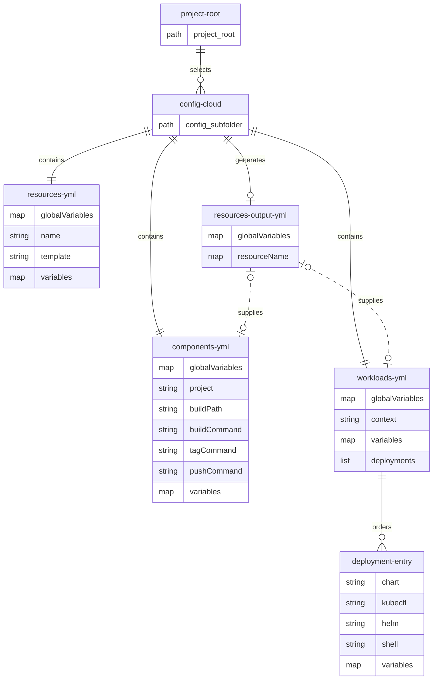
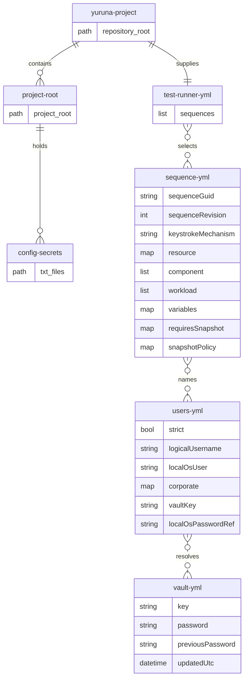

# Configuration data model

These views map the current project YAML, resource outputs, optional secret files, and separate test identities to the readers that consume them.

The entities represent filesystem scopes and YAML records, not database tables.
Paths and dynamic mapping keys are identified in the prose below; cardinalities
show containment and references. See [Architecture](../architecture.md) for the
phase model.

## Project deployment records

```mermaid
erDiagram
    project-root ||--o{ config-cloud : selects
    config-cloud ||--|| resources-yml : contains
    config-cloud ||--|| components-yml : contains
    config-cloud ||--|| workloads-yml : contains
    config-cloud ||--o| resources-output-yml : generates
    workloads-yml ||--o{ deployment-entry : orders
    %% optional: later phases read resource outputs when the file exists.
    resources-output-yml |o..o| components-yml : supplies
    resources-output-yml |o..o| workloads-yml : supplies
    project-root {
        path project_root
    }
    config-cloud {
        path config_subfolder
    }
    resources-yml {
        map globalVariables
        string name
        string template
        map variables
    }
    components-yml {
        map globalVariables
        string project
        string buildPath
        string buildCommand
        string tagCommand
        string pushCommand
        map variables
    }
    workloads-yml {
        map globalVariables
        string context
        map variables
        list deployments
    }
    deployment-entry {
        string chart
        string kubectl
        string helm
        string shell
        map variables
    }
    resources-output-yml {
        map globalVariables
        map resourceName
    }
```

This seven-entity view groups each phase document with its list entries:
`name`, `template`, and `variables` are fields of a `resources[]` item;
`project`, `buildPath`, commands, and `variables` belong to a `components[]`
item; and `context`, `variables`, and `deployments` belong to a `workloads[]`
item. Each phase document also has `globalVariables`. A deployment selects a
registered kind (`chart`, `kubectl`, `helm`, or `shell`); the four fields in the
diagram are alternatives, not four required commands.
`resourceName` denotes a dynamic output key derived from `resources[].name`;
it is not a literal required field. Each resource's OpenTofu outputs retain
objects containing their `value`.

Sources: [`automation/Yuruna.Resource.psm1`](../../automation/Yuruna.Resource.psm1),
[`automation/Yuruna.Component.psm1`](../../automation/Yuruna.Component.psm1),
[`automation/Yuruna.Workload.psm1`](../../automation/Yuruna.Workload.psm1),
[`automation/Yuruna.Validation.psm1`](../../automation/Yuruna.Validation.psm1),
[`automation/Yuruna.VariableExpansion.psm1`](../../automation/Yuruna.VariableExpansion.psm1),
and [`automation/Yuruna.DeploymentKind.psm1`](../../automation/Yuruna.DeploymentKind.psm1).
The companion repository supplies
[`template/config/localhost/`](https://github.com/alissonsol/yuruna-project/tree/main/template/config/localhost)
and the concrete website
[`example/website/config/localhost/resources.yml`](https://github.com/alissonsol/yuruna-project/blob/main/example/website/config/localhost/resources.yml),
[`components.yml`](https://github.com/alissonsol/yuruna-project/blob/main/example/website/config/localhost/components.yml), and
[`workloads.yml`](https://github.com/alissonsol/yuruna-project/blob/main/example/website/config/localhost/workloads.yml).

| Reference | Resolution in the engine |
| --- | --- |
| `project_root` | Selects a project root such as `example/website/` or `template/` in `yuruna-project`. The template is itself a project root. |
| `config_subfolder` | Selects `config/<config_subfolder>/` below that root. Website configurations exist for `localhost`, `aws`, and `azure`; the template and `example/text-to-sql/` contain `localhost`. |
| `resources[].template` | Resolves project `resources/<template>/` first, then framework `global/resources/<template>/`. An empty template names an existing resource. |
| `resources[].name` | Becomes the expanded output key and `.yuruna/<config>/resources/<name>/` work-folder name. |
| `components[].project` / `buildPath` | Identifies the component and selects `components/<buildPath>/`; an omitted `buildPath` defaults to `project`. |
| Component commands | `buildCommand`, `tagCommand`, and `pushCommand` use direct entry fields with phase-global fallbacks. `preProcessor` and `postProcessor` come from merged variables, including `components[].variables`. |
| `workloads[].context` | Selects a Kubernetes context; the module restores the caller's original context afterward. |
| `deployments[].chart` | Selects `workloads/<chart>/`; `variables.installName` names the Helm installation and its work folder. |

Component variables combine resource output globals and resource-qualified
outputs, component-document globals, and component variables, in that order.
Workload deployments add workload-document globals, workload variables, and
finally deployment variables over resource outputs. Later layers override
matching names. Resource output values are exposed through names such as
`<resource-name>.<output-name>`.

`config/<cloud>/resources.output.yml` records ownership before an apply can
partially create infrastructure, so a resource entry may initially be empty.
The [cleanup module](../../automation/Yuruna.Clear.psm1) uses this manifest and
resource work folders to find managed resources; the existence of the manifest
alone does not mean all output values are available.

The current [resource templates](../../global/resources/) and
[`example/website/config/`](https://github.com/alissonsol/yuruna-project/tree/main/example/website/config)
cover localhost, AWS, and Azure. The current project tree has no GCP
configuration, and the framework has no GCP resource template. Google Artifact
Registry authentication is implemented separately, as described below.

## Project secrets and test identities

```mermaid
erDiagram
    yuruna-project ||--o{ project-root : contains
    %% optional: the validator accepts secret text files in either config location.
    project-root ||--o{ config-secrets : holds
    yuruna-project ||--|| test-runner-yml : supplies
    test-runner-yml }o..o{ sequence-yml : selects
    sequence-yml }o..o{ users-yml : names
    users-yml }o..o{ vault-yml : resolves
    yuruna-project {
        path repository_root
    }
    project-root {
        path project_root
    }
    config-secrets {
        path txt_files
    }
    test-runner-yml {
        list sequences
    }
    sequence-yml {
        string sequenceGuid
        int sequenceRevision
        string keystrokeMechanism
        map resource
        list component
        list workload
        map variables
        map requiresSnapshot
        map snapshotPolicy
    }
    users-yml {
        bool strict
        string logicalUsername
        string localOsUser
        map corporate
        string vaultKey
        string localOsPasswordRef
    }
    vault-yml {
        string key
        string password
        string previousPassword
        datetime updatedUtc
    }
```

This seven-entity view groups the two optional deployment secret locations
under `config-secrets`. It also distinguishes the companion repository root
from an individual project root. The `users-yml` and `vault-yml` nodes are
runtime files in the framework checkout; the dotted edges represent names and
secret-key lookups, not containment in `yuruna-project`.

Sources: the companion
[`test/test.runner.yml`](https://github.com/alissonsol/yuruna-project/blob/main/test/test.runner.yml)
and [`example/website/test/`](https://github.com/alissonsol/yuruna-project/tree/main/example/website/test),
framework [`test/modules/Test.RunnerInnerLoop.psm1`](../../test/modules/Test.RunnerInnerLoop.psm1),
[`test/modules/Test.SequenceResolve.psm1`](../../test/modules/Test.SequenceResolve.psm1),
[`test/schemas/sequence.schema.yml`](../../test/schemas/sequence.schema.yml),
[`test/schemas/users.schema.yml`](../../test/schemas/users.schema.yml),
[`test/schemas/vault.schema.yml`](../../test/schemas/vault.schema.yml), and
[`test/extension/authentication/default.psm1`](../../test/extension/authentication/default.psm1).
[`test/Test-Config.ps1`](../../test/Test-Config.ps1) enforces the strict
identity and vault-key checks.
The [`automation/Yuruna.Validation.psm1`](../../automation/Yuruna.Validation.psm1)
validator checks optional
`<project>/config/<cloud>/secrets/*.txt` and
`<project>/config/secrets/*.txt` files. For the workload phase, present files
must contain non-whitespace text. The current `yuruna-project` template and
examples do not contain these folders; the validator does not feed their
contents into the deployment variable map.

The repository-level `test/test.runner.yml` lists, in `sequences`, the
top-level sequences a cycle runs. The selected sequence files can live under
project `test/` folders or framework `test/sequences/`; the
[resolver](../../test/modules/Test.SequenceResolve.psm1) checks project files
first. `sequenceGuid` is a persistent identity;
`sequenceRevision` identifies the sequence's shape. Sequence `resource`,
`component`, and `workload` sections describe test prerequisites and actions,
and are distinct from the three deployment configuration files.
`keystrokeMechanism` chooses `gui` or `ssh`. Optional `requiresSnapshot` selects
a saved disk snapshot, while `snapshotPolicy` adds age and provenance rules.

`logicalUsername` and `key` denote mapping keys beneath `users`, rather than
literal record fields. The optional vault `previousPassword` and `updatedUtc`
fields accompany its required `password`. Sequence expressions such as
`${ext:authentication.GetPassword(${username})}` resolve logical identities
through the authentication extension. `vaultKey` chooses a login password;
`localOsPasswordRef` can choose a different secret for the local guest account.
A nonempty `vaultKey` requires an existing vault password and is never
auto-generated. An empty `vaultKey` uses the logical username and can generate
a password; `localOsPasswordRef` can also generate a local-account password.
The `strict` setting belongs to the users document and makes missing active
identities or configured `vaultKey` entries fail the pre-cycle check.

The extension resolves runtime files under
`test/status/extension/authentication/users.yml` and `vault.yml` in the framework
checkout; the committed
[`users.yml.template`](../../test/extension/authentication/users.yml.template)
bootstraps the users map. These runtime files are separate from the companion
project's deployment configuration. This view describes their schema without
including secret values.

Registry authentication is another boundary:
[Yuruna.Component.Registry](../../automation/Yuruna.Component.Registry.psm1)
uses [Yuruna.CredentialProvider](../../automation/Yuruna.CredentialProvider.psm1)
for Azure ACR, AWS ECR, Google Artifact Registry, Docker Hub, or generic Docker
registries. It uses the selected provider's CLI/environment credentials, without
implicitly loading the harness vault. Configured workload commands can create
Kubernetes Secrets, as the website workloads demonstrate.

[Start-ConfigService](../../test/service/Start-ConfigService.ps1) also resolves
pool and stash storage passwords through the harness vault. It combines them
with `networkStorage` paths and usernames from `test.config.yml` and serves them
over the authenticated guest channel shown in [Deployment](06-deployment.md).

---

[Architecture](../architecture.md) | [Design overview](README.md)
